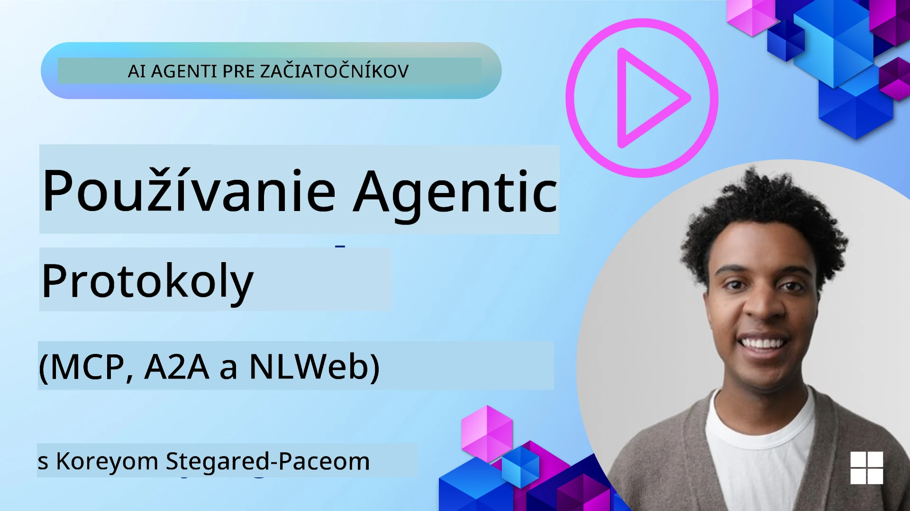
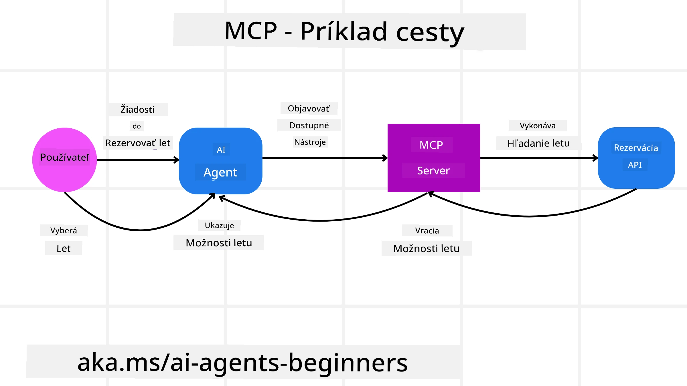
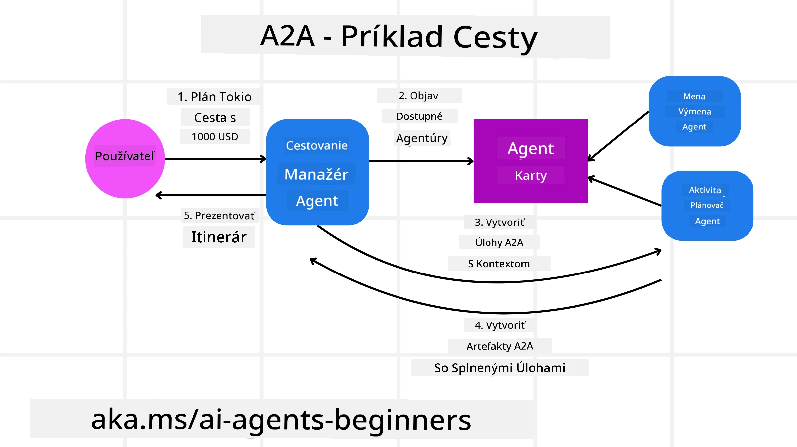
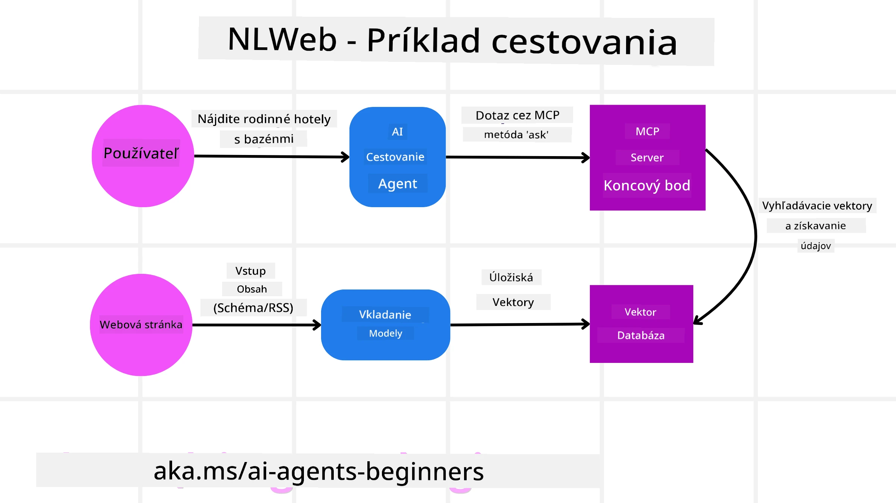

# Používanie agentových protokolov (MCP, A2A a NLWeb)

> _(Kliknite na obrázok vyššie pre zobrazenie videa tejto lekcie)_

Ako rastie používanie AI agentov, rastie aj potreba protokolov, ktoré zabezpečujú štandardizáciu, bezpečnosť a podporujú otvorené inovácie. V tejto lekcii pokryjeme 3 protokoly, ktoré sa snažia túto potrebu naplniť - Protokol kontextu modelu (Model Context Protocol, MCP), Agent-to-Agent (A2A) a Natural Language Web (NLWeb).

## Úvod

V tejto lekcii sa budeme zaoberať:

• Ako **MCP** umožňuje AI agentom pristupovať k externým nástrojom a dátam, aby dokončili úlohy používateľa.

• Ako **A2A** umožňuje komunikáciu a spoluprácu medzi rôznymi AI agentmi.

• Ako **NLWeb** prináša rozhrania v prirodzenom jazyku na akúkoľvek webovú stránku, čo umožňuje AI agentom objavovať a interagovať s obsahom.

## Ciele učenia

• **Identifikovať** hlavný účel a prínosy MCP, A2A a NLWeb v kontexte AI agentov.

• **Vysvetliť** ako každý protokol uľahčuje komunikáciu a interakciu medzi LLM, nástrojmi a inými agentmi.

• **Rozpoznať** odlišné úlohy, ktoré každý protokol zohráva pri budovaní zložitých agentových systémov.

## Protokol kontextu modelu

**Model Context Protocol (MCP)** je otvorený štandard, ktorý poskytuje štandardizovaný spôsob, akým aplikácie poskytujú kontext a nástroje LLM. To umožňuje „univerzálny adaptér“ k rôznym zdrojom dát a nástrojom, ku ktorým sa AI agenti môžu pripájať konzistentným spôsobom.

Pozrime sa na komponenty MCP, výhody v porovnaní s priame použitím API a príklad, ako by AI agenti mohli použiť MCP server.

### Hlavné komponenty MCP

MCP funguje na **architektúre klient-server** a hlavné komponenty sú:

• **Hosts** sú aplikácie využívajúce LLM (napríklad editor kódu ako VSCode), ktoré iniciujú spojenia so MCP serverom.

• **Clients** sú komponenty v rámci hostiteľskej aplikácie, ktoré udržiavajú jednok-ootázkové spojenia so servermi.

• **Servers** sú ľahké programy, ktoré vystavujú konkrétne schopnosti.

Súčasťou protokolu sú tri základné primitívy, ktoré sú schopnosťami MCP servera:

• **Tools**: Ide o samostatné akcie alebo funkcie, ktoré môže AI agent zavolať, aby vykonal úlohu. Napríklad servis počasia môže vystaviť nástroj "get weather", alebo e-commerce server môže vystaviť nástroj "purchase product". MCP servery inzerujú názov každého nástroja, popis a vstupno-výstupné schémy vo svojom zozname schopností.

• **Resources**: Sú to položky dát alebo dokumenty len na čítanie, ktoré MCP server môže poskytnúť, a klienti ich môžu získavať na požiadanie. Príklady zahŕňajú obsah súborov, záznamy v databáze alebo log súbory. Resources môžu byť textové (ako kód alebo JSON) alebo binárne (ako obrázky alebo PDF).

• **Prompts**: Preddefinované šablóny, ktoré poskytujú navrhované výzvy, čo umožňuje zložitejšie pracovné postupy.

### Výhody MCP

MCP ponúka významné výhody pre AI agentov:

• **Dynamické zisťovanie nástrojov**: Agenti môžu dynamicky prijímať zoznam dostupných nástrojov zo servera spolu s popismi toho, čo robia. To kontrastuje s tradičnými API, ktoré často vyžadujú statické kódovanie pre integrácie, čo znamená, že akákoľvek zmena API si vyžaduje aktualizáciu kódu. MCP ponúka prístup „integrovať raz“, čo vedie k väčšej prispôsobiteľnosti.

• **Interoperabilita medzi LLM**: MCP funguje naprieč rôznymi LLM, poskytujúc flexibilitu pri prepínaní základných modelov na hodnotenie lepšieho výkonu.

• **Štandardizovaná bezpečnosť**: MCP zahŕňa štandardnú autentifikačnú metódu, zlepšujúc škálovateľnosť pri pridávaní prístupu k ďalším MCP serverom. To je jednoduchšie ako spravovanie rôznych kľúčov a typov autentifikácie pre rôzne tradičné API.

### Príklad MCP

Predstavte si, že používateľ chce rezervovať let pomocou AI asistenta poháňaného MCP.

1. **Pripojenie**: AI asistent (MCP klient) sa pripojí k MCP serveru poskytovanému leteckou spoločnosťou.

2. **Zistenie nástrojov**: Klient sa spýta MCP servera leteckej spoločnosti: „Aké nástroje máte k dispozícii?“ Server odpovie nástrojmi ako "search flights" a "book flights".

3. **Volanie nástroja**: Potom požiadaš AI asistenta: „Prosím, vyhľadaj let z Portlandu do Honolulu.“ AI asistent, používajúc svoj LLM, identifikuje, že musí zavolať nástroj "search flights" a odovzdá relevantné parametre (odletové miesto, cieľ) MCP serveru.

4. **Vykonanie a odpoveď**: MCP server, pôsobiaci ako wrapper, vykoná skutočné volanie do interného rezervačného API leteckej spoločnosti. Následne prijme informácie o letoch (napr. JSON údaje) a pošle ich späť AI asistentovi.

5. **Ďalšia interakcia**: AI asistent predstaví možnosti letov. Keď vyberiete let, asistent môže zavolať nástroj "book flight" na tom istom MCP serveri a dokončiť rezerváciu.

## Protokol Agent-to-Agent (A2A)

Kým MCP sa zameriava na prepojenie LLM s nástrojmi, **protokol Agent-to-Agent (A2A)** posúva vec ďalej tým, že umožňuje komunikáciu a spoluprácu medzi rôznymi AI agentmi. A2A prepája AI agentov naprieč rôznymi organizáciami, prostrediami a technologickými stackmi, aby dokončili spoločnú úlohu.

Preskúmame komponenty a výhody A2A spolu s príkladom, ako by sa dal použiť v našej cestovnej aplikácii.

### Hlavné komponenty A2A

A2A sa zameriava na umožnenie komunikácie medzi agentmi a na to, aby spolupracovali pri dokončení časti úlohy používateľa. Každá súčasť protokolu k tomu prispieva:

#### Karta agenta

Podobne ako MCP server zdieľa zoznam nástrojov, Karta agenta obsahuje:
- Názov agenta.
- **popis všeobecných úloh**, ktoré vykonáva.
- **zoznam konkrétnych zručností** s popismi, ktoré pomôžu ostatným agentom (alebo aj ľudským používateľom) pochopiť, kedy a prečo by mali toho agenta zavolať.
- **aktuálnu Endpoint URL** agenta
- **verziu** a **schopnosti** agenta, ako napríklad prúdenie odpovedí (streaming) a push notifikácie.

#### Executor agenta

Executor agenta je zodpovedný za **odovzdanie kontextu chatovej komunikácie používateľa vzdialenému agentovi**, pretože vzdialený agent to potrebuje na pochopenie úlohy, ktorú treba splniť. V A2A serveri agent používa svoj vlastný veľký jazykový model (Large Language Model, LLM) na parsovanie prichádzajúcich požiadaviek a vykonávanie úloh pomocou vlastných interných nástrojov.

#### Artefakt

Keď vzdialený agent dokončí požadovanú úlohu, jeho výstup sa vytvorí ako artefakt. Artefakt **obsahuje výsledok práce agenta**, **popis toho, čo bolo dokončené**, a **textový kontext**, ktorý je prenášaný protokolom. Po odoslaní artefaktu sa spojenie s vzdialeným agentom uzavrie, kým nebude opäť potrebné.

#### Fronta udalostí

Táto súčasť sa používa na **spracovanie aktualizácií a odosielanie správ**. Je obzvlášť dôležitá v produkcii pre agentové systémy, aby sa zabránilo uzavretiu spojenia medzi agentmi skôr, než je úloha dokončená, najmä keď dokončenie úlohy môže trvať dlhší čas.

### Výhody A2A

• **Zlepšená spolupráca**: Umožňuje agentom od rôznych dodávateľov a platforiem navzájom interagovať, zdieľať kontext a spolupracovať, čo uľahčuje bezproblémovú automatizáciu cez tradične oddelené systémy.

• **Flexibilita výberu modelu**: Každý A2A agent si môže rozhodnúť, ktorý LLM použije na obsluhu svojich požiadaviek, čo umožňuje optimalizované alebo doladené modely pre jednotlivých agentov, na rozdiel od jediného LLM spojenia v niektorých scenároch MCP.

• **Vstavaná autentifikácia**: Autentifikácia je integrovaná priamo do protokolu A2A, poskytujúc robustný bezpečnostný rámec pre interakcie agentov.

### Príklad A2A

Rozšírme náš scenár rezervácie ciest, tentokrát s využitím A2A.

1. **Požiadavka používateľa na multi-agenta**: Používateľ komunikuje s A2A klientom/agenta „Travel Agent“, napríklad: „Prosím, rezervuj celú cestu do Honolulu na budúci týždeň vrátane letov, hotela a prenájmu auta“.

2. **Orchestrace Travel Agenta**: Travel Agent prijme túto komplexnú požiadavku. Použije svoj LLM na premyslenie úlohy a určí, že potrebuje komunikovať s ďalšími špecializovanými agentmi.

3. **Medziagentová komunikácia**: Travel Agent následne využije protokol A2A na pripojenie k downstream agentom, ako sú „Airline Agent“, „Hotel Agent“ a „Car Rental Agent“, ktoré vytvorili rôzne spoločnosti.

4. **Delegované vykonanie úloh**: Travel Agent odošle konkrétne úlohy týmto špecializovaným agentom (napr. „Nájdite lety do Honolulu“, „Rezervujte hotel“, „Prenajmite auto“). Každý z týchto špecializovaných agentov, bežiaci so svojimi vlastnými LLM a využívajúc vlastné nástroje (ktoré môžu byť sami MCP servermi), vykoná svoju konkrétnu časť rezervácie.

5. **Konsolidovaná odpoveď**: Keď všetci downstream agenti dokončia svoje úlohy, Travel Agent skompletuje výsledky (údaje o letoch, potvrdenie hotela, rezerváciu prenájmu auta) a pošle komplexnú, chatovú odpoveď späť používateľovi.

## Web v prirodzenom jazyku (NLWeb)

Webové stránky boli dlhodobo primárnym spôsobom, ako používateľom sprístupniť informácie a dáta cez internet.

Pozrime sa na rôzne komponenty NLWeb, výhody NLWeb a príklad toho, ako náš NLWeb funguje na príklade našej cestovnej aplikácie.

### Komponenty NLWeb

- **NLWeb Application (Core Service Code)**: Systém, ktorý spracováva otázky v prirodzenom jazyku. Spája rôzne časti platformy, aby vytváral odpovede. Môžete ho vnímať ako **motor, ktorý poháňa funkcie v prirodzenom jazyku** na webovej stránke.

- **NLWeb Protocol**: Toto je **základná sada pravidiel pre interakciu v prirodzenom jazyku** s webovou stránkou. Vracia odpovede v JSON formáte (často používajúc Schema.org). Jeho účelom je vytvoriť jednoduchý základ pre „AI web“, podobne ako HTML umožnil zdieľať dokumenty online.

- **MCP Server (Model Context Protocol Endpoint)**: Každé NLWeb nastavenie zároveň funguje ako **MCP server**. To znamená, že môže **zdieľať nástroje (ako metódu „ask“) a údaje** s inými AI systémami. V praxi to umožňuje, aby obsah a schopnosti webu boli použiteľné AI agentmi, čím sa stránka stáva súčasťou širšieho „ekosystému agentov“.

- **Embedding Models**: Tieto modely sa používajú na **prevod obsahu webovej stránky do číselných reprezentácií nazývaných vektory** (embeddings). Tieto vektory zachytávajú zmysel spôsobom, ktorý dokážu počítače porovnávať a vyhľadávať. Ukladajú sa v špeciálnej databáze a používatelia si môžu vybrať, ktorý embedding model chcú použiť.

- **Vector Database (Retrieval Mechanism)**: Táto databáza **ukladá embeddings obsahu webovej stránky**. Keď niekto položí otázku, NLWeb skontroluje vektorovú databázu, aby rýchlo našiel najrelevantnejšie informácie. Poskytne rýchly zoznam možných odpovedí zoradených podľa podobnosti. NLWeb spolupracuje s rôznymi systémami ukladania vektorov, ako sú Qdrant, Snowflake, Milvus, Azure AI Search a Elasticsearch.

### Príklad NLWeb

Zoberme si opäť náš cestovný rezervačný web, tentokrát poháňaný NLWebom.

1. **Vstup dát**: Existujúce produktové katalógy cestovného webu (napr. zoznamy letov, popisy hotelov, turistické balíčky) sú naformátované pomocou Schema.org alebo načítané cez RSS feedy. Nástroje NLWeb tieto štruktúrované dáta ingestujú, vytvoria embeddings a uloží ich do lokálnej alebo vzdialenej vektorovej databázy.

2. **Otázka v prirodzenom jazyku (človek)**: Používateľ navštívi web a namiesto preklikávania menu napíše do chatového rozhrania: „Nájdite mi rodinne priateľský hotel v Honolulu s bazénom na budúci týždeň“.

3. **Spracovanie NLWeb**: Aplikácia NLWeb prijme túto otázku. Odešle dopyt LLM na pochopenie a súčasne prehľadáva svoju vektorovú databázu pre relevantné záznamy hotelov.

4. **Presné výsledky**: LLM pomôže interpretovať výsledky vyhľadávania z databázy, identifikovať najlepšie zhody na základe kritérií „rodinne priateľský“, „bazén“ a „Honolulu“, a následne naformátovať odpoveď v prirodzenom jazyku. Kľúčové je, že odpoveď odkazuje na skutočné hotely z katalógu webu, čím sa predchádza vymysleným informáciám.

5. **Interakcia AI agenta**: Keďže NLWeb slúži ako MCP server, externý AI cestovný agent sa môže tiež pripojiť k inštancii NLWeb tejto webovej stránky. AI agent môže potom použiť metódu `ask("Are there any vegan-friendly restaurants in the Honolulu area recommended by the hotel?")`. Inštancia NLWeb to spracuje, využije svoju databázu informácií o reštauráciách (ak sú načítané) a vráti štruktúrovanú JSON odpoveď.

### Máte viac otázok o MCP/A2A/NLWeb?

Pripojte sa na [Microsoft Foundry Discord](https://aka.ms/ai-agents/discord), aby ste sa stretli s ďalšími študentmi, zúčastnili sa office hours a získali odpovede na svoje otázky o AI agentech.

## Zdroje

- [MCP pre začiatočníkov](https://aka.ms/mcp-for-beginners)  
- [Dokumentácia MCP](https://learn.microsoft.com/python/api/overview/azure/ai-projects-readme)
- [Repozitár NLWeb](https://github.com/nlweb-ai/NLWeb)
- [Microsoft Agent Framework](https://aka.ms/ai-agents-beginners/agent-framewrok)

---

<!-- CO-OP TRANSLATOR DISCLAIMER START -->
**Vyhlásenie o vylúčení zodpovednosti**:
Tento dokument bol preložený pomocou služby prekladu založenej na umelej inteligencii [Co-op Translator](https://github.com/Azure/co-op-translator). Hoci sa snažíme o presnosť, vezmite prosím na vedomie, že automatické preklady môžu obsahovať chyby alebo nepresnosti. Pôvodný dokument v jeho pôvodnom jazyku by sa mal považovať za autoritatívny zdroj. Pre kritické informácie sa odporúča profesionálny ľudský preklad. Za akékoľvek nedorozumenia alebo nesprávne výklady vyplývajúce z použitia tohto prekladu nezodpovedáme.
<!-- CO-OP TRANSLATOR DISCLAIMER END -->