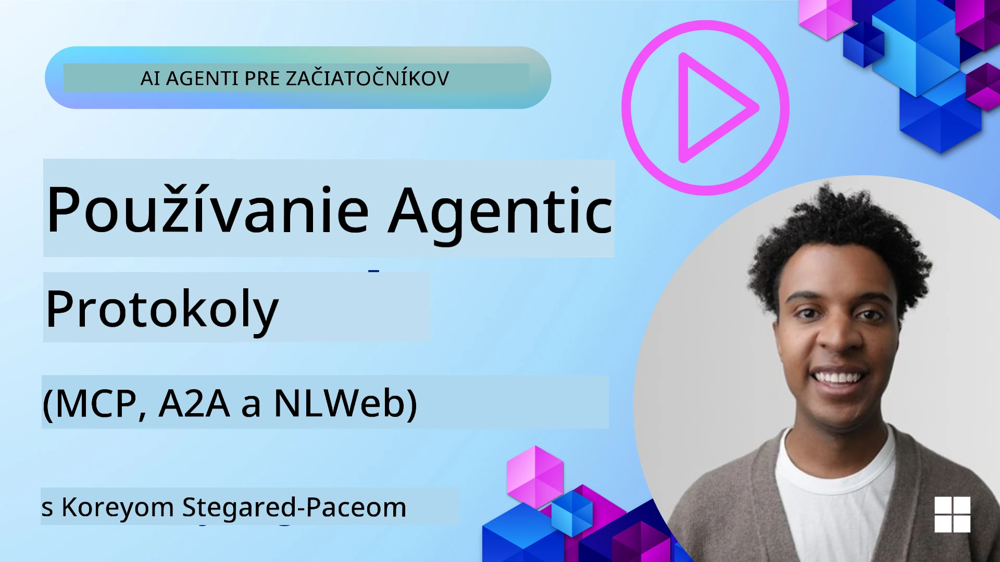
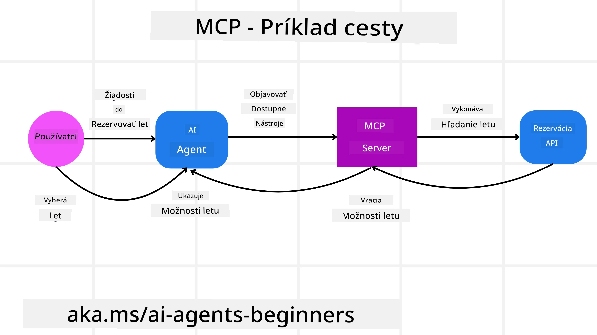
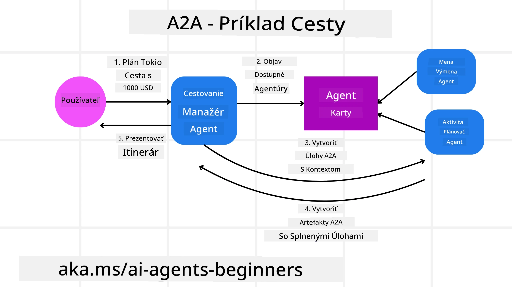
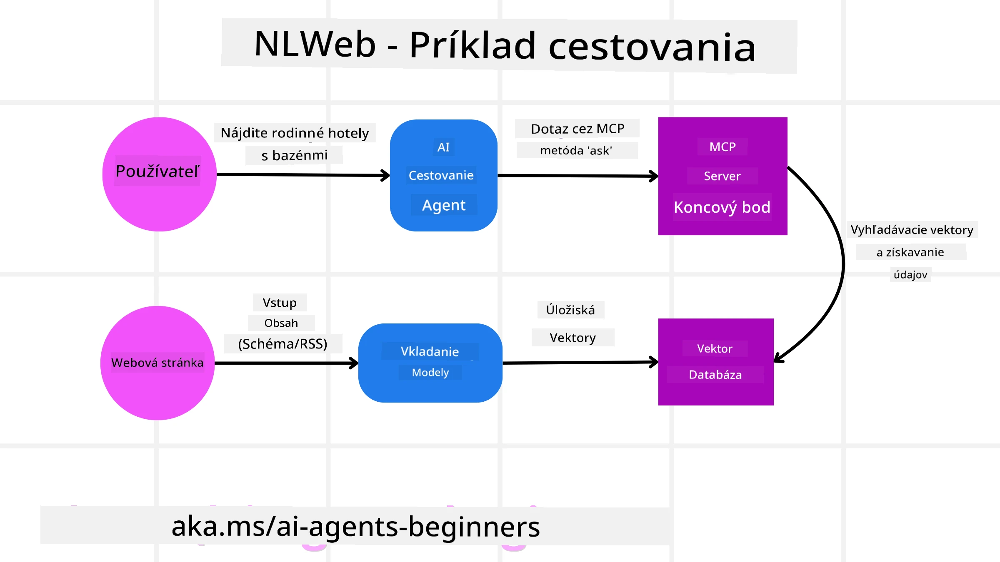

# Používanie agentických protokolov (MCP, A2A a NLWeb)

> _(Kliknite na obrázok vyššie pre zobrazenie videa k tejto lekcii)_

S rastúcim používaním AI agentov rastie aj potreba protokolov, ktoré zabezpečujú štandardizáciu, bezpečnosť a podporujú otvorenú inováciu. V tejto lekcii pokryjeme 3 protokoly, ktoré sa snažia túto potrebu splniť - Model Context Protocol (MCP), Agent to Agent (A2A) a Natural Language Web (NLWeb).

## Úvod

V tejto lekcii sa budeme venovať:

• Ako **MCP** umožňuje AI agentom pristupovať k externým nástrojom a dátam na dokončenie úloh používateľov.

• Ako **A2A** umožňuje komunikáciu a spoluprácu medzi rôznymi AI agentmi.

• Ako **NLWeb** prináša prírodné jazykové rozhrania do každej webovej stránky, čo umožňuje AI agentom objavovať a interagovať s obsahom.

## Ciele učenia

• **Identifikovať** základný účel a výhody MCP, A2A a NLWeb v kontexte AI agentov.

• **Vysvetliť** ako každý protokol uľahčuje komunikáciu a interakciu medzi LLM, nástrojmi a inými agentmi.

• **Rozpoznať** odlišné úlohy, ktoré každý protokol zohráva pri tvorbe komplexných agentických systémov.

## Model Context Protocol

**Model Context Protocol (MCP)** je otvorený štandard, ktorý poskytuje štandardizovaný spôsob, ako aplikácie môžu poskytovať kontext a nástroje pre LLM. Umožňuje tak „univerzálny adaptér“ k rôznym zdrojom dát a nástrojom, ku ktorým sa AI agenti môžu pripojiť konzistentným spôsobom.

Pozrime sa na komponenty MCP, výhody oproti priamej práci s API a príklad, ako by AI agenti mohli využiť MCP server.

### Základné komponenty MCP

MCP funguje na **klient-server architektúre** a hlavné komponenty sú:

• **Hostia** sú LLM aplikácie (napríklad kódový editor ako VSCode), ktoré začínajú spojenie so serverom MCP.

• **Klienti** sú komponenty v hostiteľskej aplikácii, ktoré udržiavajú jedno-na-jedno spojenie so servermi.

• **Servery** sú ľahké programy, ktoré sprístupňujú konkrétne schopnosti.

Protokol obsahuje tri základné primitívy, ktoré sú schopnosti MCP servera:

• **Nástroje**: Ide o diskétne akcie alebo funkcie, ktoré AI agent môže zavolať na vykonanie úlohy. Napríklad meteorologická služba môže sprístupniť nástroj „get weather“, alebo e-commerce server nástroj „purchase product“. MCP servery inzerujú názov nástroja, popis a vstupno-výstupné schémy v zozname svojich schopností.

• **Zdroje**: Sú to dátové položky alebo dokumenty určené len na čítanie, ktoré MCP server môže poskytovať, a klienti ich môžu na požiadanie vyžiadať. Príkladmi sú obsah súborov, záznamy v databáze alebo logy. Zdroje môžu byť textové (napríklad kód alebo JSON) alebo binárne (obrázky alebo PDF).

• **Výzvy**: Sú to preddefinované šablóny, ktoré poskytujú navrhované výzvy, čo umožňuje komplexnejšie pracovné postupy.

### Výhody MCP

MCP ponúka významné výhody pre AI agentov:

• **Dynamické objavovanie nástrojov**: Agenti môžu dynamicky získať zoznam dostupných nástrojov zo servera spolu s ich popismi. To kontrastuje s tradičnými API, ktoré často vyžadujú statické kódovanie pre integrácie, čo znamená, že akákoľvek zmena API núti aktualizovať kód. MCP ponúka prístup „integruj raz“, ktorý vedie k väčšej prispôsobivosti.

• **Interoperabilita naprieč LLM**: MCP funguje naprieč rôznymi LLM, poskytujúci flexibilitu pri prechode medzi jadrovými modelmi za účelom dosiahnutia lepšieho výkonu.

• **Štandardizovaná bezpečnosť**: MCP obsahuje štandardnú autentifikačnú metódu, čo zlepšuje škálovateľnosť pri pridávaní prístupu k ďalším MCP serverom. Je to jednoduchšie než spravovať rôzne kľúče a typy autentifikácie pre rôzne tradičné API.

### Príklad MCP

Predstavme si, že používateľ chce rezervovať let pomocou AI asistenta poháňaného MCP.

1. **Pripojenie**: AI asistent (MCP klient) sa pripojí k MCP serveru poskytovanému leteckou spoločnosťou.

2. **Objavovanie nástrojov**: Klient sa opýta MCP servera leteckej spoločnosti: „Aké nástroje máte k dispozícii?“ Server odpovie nástrojmi ako „hľadaj lety“ a „rezervuj lety“.

3. **Vyvolanie nástroja**: Potom sa opýtate AI asistenta: „Prosím, vyhľadaj let z Portlandu do Honolulu.“ AI asistent, s použitím svojho LLM, identifikuje, že musí zavolať nástroj „hľadaj lety“ a odovzdá príslušné parametre (pôvod, cieľ) MCP serveru.

4. **Vykonanie a odpoveď**: MCP server, pôsobiaci ako obal, vykoná skutočné volanie interného rezervačného API leteckej spoločnosti. Následne prijme informácie o lete (napríklad JSON dáta) a pošle ich späť AI asistentovi.

5. **Ďalšia interakcia**: AI asistent prezentuje možnosti letov. Keď vyberiete let, asistent vyvolá nástroj „rezervuj let“ na tom istom MCP serveri a dokončí rezerváciu.

## Agent-to-Agent protokol (A2A)

Kým MCP sa zameriava na pripájanie LLM k nástrojom, **Agent-to-Agent (A2A) protokol** ide krok ďalej tým, že umožňuje komunikáciu a spoluprácu medzi rôznymi AI agentmi. A2A prepája AI agentov naprieč rôznymi organizáciami, prostrediami a technologickými zásobníkmi na splnenie spoločnej úlohy.

Preskúmame komponenty a výhody A2A a aj príklad jeho použitia v našej cestovnej aplikácii.

### Základné komponenty A2A

A2A kladie dôraz na umožnenie komunikácie medzi agentmi a ich spoluprácu na dokončení používateľskej podúlohy. Každá časť protokolu k tomu prispieva:

#### Agent Card

Podobne ako MCP server zdieľa zoznam nástrojov, Agent Card obsahuje:
- Meno agenta.
- **popis všeobecných úloh**, ktoré vykonáva.
- **zoznam špecifických zručností** s popismi, ktoré pomáhajú iným agentom (alebo aj ľudským používateľom) pochopiť, kedy a prečo by chceli agenta volať.
- **aktuálnu adresu URL koncového bodu** agenta
- **verziu** a **schopnosti** agenta, ako napríklad prenos odpovedí naživo a push notifikácie.

#### Agent Executor

Agent Executor je zodpovedný za **prenesenie kontextu používateľského chatu k vzdialenému agentovi**, vzdialený agent to potrebuje na pochopenie úlohy, ktorú má splniť. V A2A serveri agent používa vlastný Large Language Model (LLM) na spracovanie prichádzajúcich požiadaviek a vykonávanie úloh s použitím interných nástrojov.

#### Artefakt

Keď vzdialený agent dokončí požadovanú úlohu, jeho výsledok je vytvorený ako artefakt. Artefakt **obsahuje výsledok práce agenta**, **popis toho, čo bolo dokončené**, a **textový kontext**, ktorý je odoslaný cez protokol. Po odoslaní artefaktu sa spojenie so vzdialeným agentom uzavrie, kým nebude znova potrebné.

#### Fronta udalostí

Táto súčasť sa používa na **spracovanie aktualizácií a odosielanie správ**. Je obzvlášť dôležitá v produkcii agentických systémov, aby sa zabránilo uzavretiu spojenia medzi agentmi pred dokončením úlohy, najmä keď dokončenie úlohy trvá dlhší čas.

### Výhody A2A

• **Zlepšená spolupráca**: Umožňuje agentom od rôznych dodávateľov a platforiem interagovať, zdieľať kontext a pracovať spoločne, čo uľahčuje plynulú automatizáciu medzi tradične nesúvislými systémami.

• **Flexibilita výberu modelu**: Každý agent A2A si môže vybrať, ktorý LLM používa na spracovanie svojich požiadaviek, čo umožňuje optimalizované alebo jemne doladené modely pre každého agenta, na rozdiel od jednej LLM pripojenia v niektorých MCP scenároch.

• **Vstavaná autentifikácia**: Autentifikácia je priamo integrovaná do A2A protokolu, poskytujúc pevný bezpečnostný rámec pre interakcie agentov.

### Príklad A2A

Rozšírme náš scenár rezervácie ciest, tentoraz pomocou A2A.

1. **Používateľská požiadavka na multi-agenta**: Používateľ komunikuje s „Cestovným agentom“ ako A2A klient/agenta, napríklad slovami „Prosím, zarezervuj celú cestu na Honolulu na budúci týždeň, vrátane letov, hotela a prenájmu auta“.

2. **Orchestrace Cestovným agentom**: Cestovný agent prijme túto zložitú požiadavku. Pomocou svojho LLM vyhodnotí úlohu a zistí, že potrebuje komunikovať s inými špecializovanými agentmi.

3. **Medzi-agentná komunikácia**: Cestovný agent potom používa A2A protokol na pripojenie k podriadeným agentom, ako sú „Letecký agent“, „Hotelový agent“ a „Agent požičovne áut“, ktorí sú vytvorení rôznymi spoločnosťami.

4. **Delegovanie vykonania úloh**: Cestovný agent posiela konkrétne úlohy týmto špecializovaným agentom (napr. „Nájdi lety na Honolulu“, „Zarezervuj hotel“, „Prenajmi auto“). Každý z týchto agentov, ktorý používa vlastné LLM a vlastné nástroje (ktoré môžu byť samy MCP servery), vykoná svoju časť rezervácie.

5. **Konsolidovaná odpoveď**: Keď všetci podriadení agenti dokončia svoje úlohy, Cestovný agent skompletuje výsledky (detaily letov, potvrdenie hotela, rezerváciu auta) a odošle komplexnú, chatovú odpoveď naspäť používateľovi.

## Natural Language Web (NLWeb)

Webové stránky boli dlhodobo hlavným spôsobom, ako používatelia pristupujú k informáciám a dátam na internete.

Pozrime sa na rôzne komponenty NLWeb, jeho výhody a príklad fungovania nášho NLWebu v cestovnej aplikácii.

### Komponenty NLWeb

- **NLWeb aplikácia (základný servisný kód)**: Systém, ktorý spracováva otázky v prirodzenom jazyku. Prepája rôzne časti platformy na tvorbu odpovedí. Môžete si to predstaviť ako **motor, ktorý poháňa funkcie prirodzeného jazyka** na webovej stránke.

- **NLWeb protokol**: Je to **základný súbor pravidiel pre interakciu v prirodzenom jazyku** s webovou stránkou. Posiela odpovede v JSON formáte (často používajúc Schema.org). Jeho cieľom je vytvoriť jednoduchý základ pre „AI Web“ podobne, ako HTML umožnil zdieľanie dokumentov online.

- **MCP server (Model Context Protocol koncový bod)**: Každé nastavenie NLWeb tiež funguje ako **MCP server**. To znamená, že môže **zdieľať nástroje (napríklad metódu „ask“) a dáta** s inými AI systémami. V praxi to umožňuje, aby obsah a schopnosti webu boli použiteľné AI agentmi, čím stránka vstupuje do širšieho „ekosystému agentov“.

- **Embedding modely**: Tieto modely sa používajú na **konverziu obsahu webu na číselné reprezentácie nazývané vektory** (embeddingy). Tieto vektory zachytávajú význam spôsobom, ktorý počítače dokážu porovnávať a vyhľadávať. Ukladajú sa do špeciálnej databázy a používatelia si môžu vybrať, ktorý embedding model chcú použiť.

- **Vektorová databáza (mechanizmus vyhľadávania)**: Táto databáza **ukladá embeddingy obsahu webu**. Keď niekto zadá otázku, NLWeb prehľadáva vektorovú databázu, aby rýchlo našiel najrelevantnejšie informácie. Poskytuje rýchly zoznam možných odpovedí zoradených podľa podobnosti. NLWeb pracuje s rôznymi systémami uloženia vektorov ako Qdrant, Snowflake, Milvus, Azure AI Search a Elasticsearch.

### Príklad NLWeb

Zoberme si opäť našu cestovnú stránku, ale tentoraz poháňanú NLWebom.

1. **Zber dát**: Existujúce katalógy produktov na stránke (napr. zoznamy letov, popisy hotelov, turistické balíčky) sú naformátované pomocou Schema.org alebo načítané cez RSS feedy. Nástroje NLWebu tieto štruktúrované dáta získajú, vytvoria embeddingy a uložia ich do lokálnej alebo vzdialenej vektorovej databázy.

2. **Otázka v prirodzenom jazyku (človek)**: Používateľ navštívi stránku a namiesto prechádzania menu napíše do chatového rozhrania: „Nájdi mi hotel vhodný pre rodiny v Honolulu s bazénom na budúci týždeň“.

3. **Spracovanie NLWebom**: Aplikácia NLWeb prijme túto otázku. Posiela ju do LLM na porozumenie a súčasne vyhľadáva v jej vektorovej databáze relevantné hotelové ponuky.

4. **Presné výsledky**: LLM pomáha interpretovať vyhľadávacie výsledky z databázy, identifikuje najlepšie zhody na základe kritérií „vhodné pre rodiny“, „bazén“ a „Honolulu“, a potom vytvorí odpoveď v prirodzenom jazyku. Podstatné je, že odpoveď sa odkazuje na skutočné hotely z katalógu, vyhýbajúc sa vymysleným informáciám.

5. **Interakcia s AI agentom**: Keďže NLWeb funguje ako MCP server, externý AI cestovný agent sa môže tiež pripojiť k tejto instance NLWeb stránky. AI agent by potom mohol použiť MCP metódu `ask` na dotazovanie webu priamo: `ask("Sú v oblasti Honolulu nejaké vegánske reštaurácie, ktoré odporúča hotel?")`. NLWeb by to spracoval, využívajúc svoju databázu informácií o reštauráciách (ak by bola načítaná), a vrátil štruktúrovanú JSON odpoveď.

### Máte ďalšie otázky o MCP/A2A/NLWeb?

Pridajte sa do [Microsoft Foundry Discord](https://discord.com/invite/ATgtXmAS5D), aby ste sa stretli s ostatnými študentmi, zúčastnili sa konzultačných hodín a získali odpovede na vaše otázky o AI agentoch.

## Zdroje

- [MCP pre začiatočníkov](https://aka.ms/mcp-for-beginners)  
- [Dokumentácia MCP](https://learn.microsoft.com/python/api/overview/azure/ai-projects-readme)
- [NLWeb Repo](https://github.com/nlweb-ai/NLWeb)
- [Microsoft Agent Framework](https://aka.ms/ai-agents-beginners/agent-framework)

---

<!-- CO-OP TRANSLATOR DISCLAIMER START -->
**Vyhlásenie o zodpovednosti**:
Tento dokument bol preložený pomocou AI prekladateľskej služby [Co-op Translator](https://github.com/Azure/co-op-translator). Hoci sa snažíme o presnosť, vezmite prosím na vedomie, že automatické preklady môžu obsahovať chyby alebo nepresnosti. Pôvodný dokument v jeho natívnom jazyku by mal byť považovaný za autoritatívny zdroj. Pre kritické informácie sa odporúča profesionálny ľudský preklad. Nie sme zodpovední za žiadne nedorozumenia alebo nesprávne interpretácie vyplývajúce z použitia tohto prekladu.
<!-- CO-OP TRANSLATOR DISCLAIMER END -->