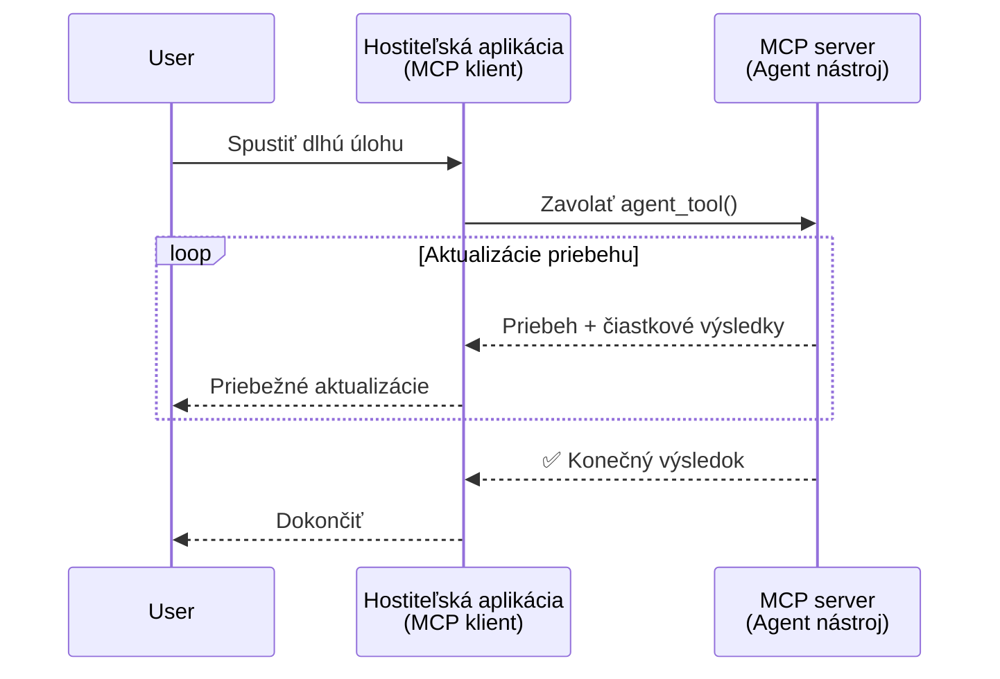
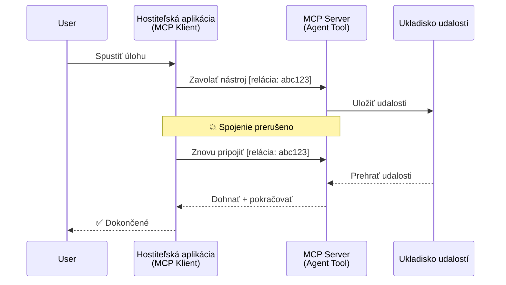
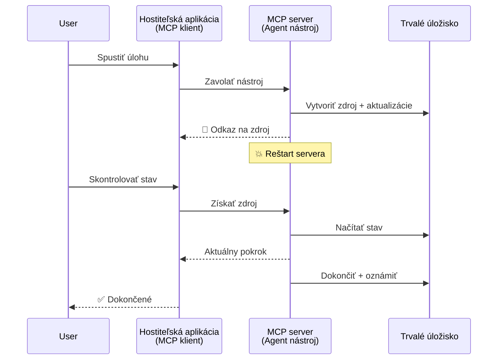
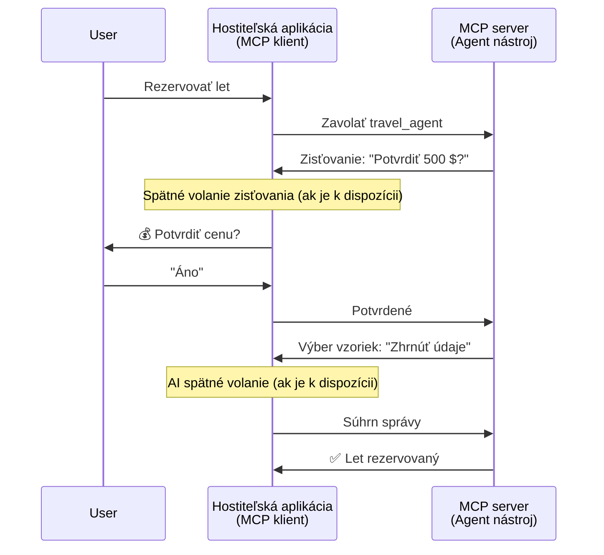
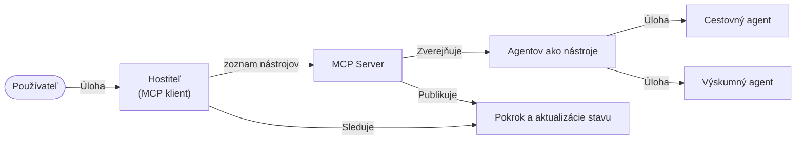

# Budovanie komunikačných systémov medzi agentmi pomocou MCP

> TL;DR - Môžete postaviť Agent2Agent komunikáciu na MCP? Áno!

MCP sa vyvinulo významne za svoje pôvodné ciele „poskytovať kontext pre LLM“. S nedávnymi vylepšeniami vrátane [obnoviteľných streamov](https://modelcontextprotocol.io/docs/concepts/transports#resumability-and-redelivery), [vyvolávania](https://modelcontextprotocol.io/specification/2025-06-18/client/elicitation), [vzorkovania](https://modelcontextprotocol.io/specification/2025-06-18/client/sampling) a notifikácií ([pokrok](https://modelcontextprotocol.io/specification/2025-06-18/basic/utilities/progress) a [zdroje](https://modelcontextprotocol.io/specification/2025-06-18/schema#resourceupdatednotification)), MCP teraz poskytuje silný základ pre budovanie komplexných systémov komunikácie medzi agentmi.

## Nesprávne chápanie Agenta/Nástroja

Keď viac vývojárov skúma nástroje s agentickým správaním (bežia dlhé obdobia, môžu vyžadovať dodatočný vstup počas vykonávania atď.), bežným omylom je, že MCP je nevhodné, hlavne preto, že prvé príklady jeho primitívnych nástrojov sa zameriavali na jednoduché vzory požiadavka-odpoveď.

Tento názor je zastaraný. Špecifikácia MCP sa v posledných mesiacoch výrazne rozšírila o funkcie, ktoré uzatvárajú medzeru pri budovaní dlhodobého agentického správania:

- **Streaming a Čiastočné Výsledky**: Aktualizácie postupu v reálnom čase počas vykonávania
- **Obnoviteľnosť**: Klienti sa môžu znovu pripojiť a pokračovať po odpojení
- **Trvácnosť**: Výsledky prežijú reštart servera (napr. pomocou odkazov na zdroje)
- **Viackolové spracovanie**: Interaktívny vstup počas vykonávania pomocou vyvolávania a vzorkovania

Tieto funkcie sa dajú kombinovať na umožnenie zložitých agentických a multiagentných aplikácií, všetko nasadené na protokole MCP.

Pre referenciu budeme agenta nazývať „nástroj“, ktorý je dostupný na MCP serveri. To implikuje existenciu hostiteľskej aplikácie, ktorá implementuje MCP klienta, ktorý nadviaže reláciu so serverom MCP a môže volať agenta.

## Čo robí MCP nástroj „agentickým“?

Predtým než vstúpime do implementácie, poďme si stanoviť, aké infraštruktúrne schopnosti sú potrebné na podporu dlhodobých agentov.

> Definujeme agenta ako entitu, ktorá môže autonómne pracovať počas dlhých období, schopnú riešiť komplexné úlohy, ktoré môžu vyžadovať viacero interakcií alebo úprav na základe spätných väzieb v reálnom čase.

### 1. Streaming a Čiastočné Výsledky

Tradičné vzory požiadavka-odpoveď nefungujú pre dlhodobé úlohy. Agenti musia poskytovať:

- Aktualizácie postupu v reálnom čase
- Medzičasné výsledky

**Podpora MCP**: Notifikácie o aktualizácii zdrojov umožňujú streaming čiastočných výsledkov, hoci to vyžaduje starostlivý dizajn, aby sa predišlo konfliktom s modelom žiadosť/odpoveď JSON-RPC 1:1.

| Funkcia                   | Prípad použitia                                                                                                                                                                | Podpora MCP                                                                               |
| ------------------------- | ------------------------------------------------------------------------------------------------------------------------------------------------------------------------------- | ----------------------------------------------------------------------------------------- |
| Aktualizácie v reálnom čase | Používateľ žiada o úlohu migrácie kódu. Agent streamuje priebeh: „10 % - Analyzujem závislosti... 25 % - Konvertujem TypeScript súbory... 50 % - Aktualizujem importy...“           | ✅ Notifikácie o pokroku                                                                  |
| Čiastočné výsledky         | Úloha „Generovať knihu“ streamuje čiastočné výsledky, napr. 1) Osnovu príbehu, 2) Zoznam kapitol, 3) Každú kapitolu ako dokončenú. Hostiteľ môže kontrolovať, zrušiť alebo presmerovať.| ✅ Notifikácie môžu byť „rozšírené“ o čiastočné výsledky, viď návrhy v PR 383, 776          |

<div align="center" style="font-style: italic; font-size: 0.95em; margin-bottom: 0.5em;">
<strong>Obrázok 1:</strong> Tento diagram ilustruje, ako agent MCP streamuje aktualizácie postupu v reálnom čase a čiastočné výsledky do hostiteľskej aplikácie počas dlhodobej úlohy, čo umožňuje používateľovi sledovať vykonávanie v reálnom čase.
</div>



### 2. Obnoviteľnosť

Agenti musia zvládnuť prerušenia siete elegantne:

- Znovu sa pripojiť po (klientskom) odpojení
- Pokračovať tam, kde prestali (opätovné doručenie správ)

**Podpora MCP**: MCP transport StreamableHTTP dnes podporuje obnovenie relácie a opätovné doručenie správ pomocou ID relácie a posledných ID udalostí. Dôležité je, že server musí implementovať EventStore, ktorý umožní prehrávanie udalostí pri znovupripojení klienta.
Poznámka, že existuje komunitný návrh (PR #975), ktorý skúma transportné nezávislé obnoviteľné streamy.

| Funkcia     | Prípad použitia                                                                                                                                            | Podpora MCP                                                               |
| ----------- | ----------------------------------------------------------------------------------------------------------------------------------------------------------- | ------------------------------------------------------------------------- |
| Obnoviteľnosť | Klient sa odpojí počas dlhodobej úlohy. Po znovupripojení sa relácia obnoví s prehratím vynechaných udalostí a plynulo pokračuje tam, kde prestala.          | ✅ Transport StreamableHTTP s ID relácie, prehrávaním udalostí a EventStore |

<div align="center" style="font-style: italic; font-size: 0.95em; margin-bottom: 0.5em;">
<strong>Obrázok 2:</strong> Tento diagram ukazuje, ako transport MCP StreamableHTTP a event store umožňujú plynulé obnovenie relácie: ak sa klient odpojí, môže sa znovu pripojiť a prehrávať vynechané udalosti, čím pokračuje v úlohe bez straty postupu.
</div>



### 3. Trvácnosť

Dlhodobí agenti potrebujú perzistentný stav:

- Výsledky prežijú reštarty servera
- Stav možno získať mimo pásma
- Sledovanie postupu cez relácie

**Podpora MCP**: MCP teraz podporuje návratový typ odkaz na zdroj pre volania nástrojov. Dnes je bežný vzor navrhnúť nástroj, ktorý vytvorí zdroj a okamžite vráti odkaz na zdroj. Nástroj môže na pozadí pokračovať v riešení úlohy a aktualizovať zdroj. Klient si potom môže vybrať, či bude pravidelne kontrolovať stav tohto zdroja pre čiastočné alebo úplné výsledky (podľa toho, ktoré aktualizácie zdroja server poskytuje) alebo sa prihlási na odber pre notifikácie o aktualizáciách.

Jedným obmedzením je, že opakované kontrolovanie zdrojov alebo prihlásenie na odber aktualizácií môže spotrebovať prostriedky s dôsledkami pri väčšom meradle. Existuje otvorený komunitný návrh (vrátane #992), ktorý skúma možnosť zahrnúť webhooks alebo spúšťače, ktoré môže server volať na oznámenie klientovi/hostiteľskej aplikácii o aktualizáciách.

| Funkcia    | Prípad použitia                                                                                                                                               | Podpora MCP                                                         |
| ---------- | ------------------------------------------------------------------------------------------------------------------------------------------------------------ | ------------------------------------------------------------------- |
| Trvácnosť  | Server spadne počas úlohy migrácie dát. Výsledky a postup prežijú reštart, klient môže skontrolovať stav a pokračovať z perzistentného zdroja.              | ✅ Odkazy na zdroje s perzistentným úložiskom a notifikáciami o stave |

Dnes je bežný vzor navrhnúť nástroj, ktorý vytvorí zdroj a okamžite vráti odkaz na zdroj. Nástroj môže na pozadí riešiť úlohu, vydávať notifikácie o zdroji slúžiace ako aktualizácie postupu alebo obsahovať čiastočné výsledky a podľa potreby aktualizovať obsah v zdroji.

<div align="center" style="font-style: italic; font-size: 0.95em; margin-bottom: 0.5em;">
<strong>Obrázok 3:</strong> Tento diagram demonštruje, ako agenti MCP používajú perzistentné zdroje a notifikácie o stave na zabezpečenie, že dlhodobé úlohy prežijú reštarty servera, čo umožňuje klientom sledovať postup a získavať výsledky aj po zlyhaniach.
</div>



### 4. Viackolové Interakcie

Agenti často potrebujú dodatočný vstup počas vykonávania:

- Ľudské vysvetlenie alebo schválenie
- AI asistenciu pri komplexných rozhodnutiach
- Dynamické upravovanie parametrov

**Podpora MCP**: Plne podporované cez vzorkovanie (pre AI vstup) a vyvolávanie (pre ľudský vstup).

| Funkcia                 | Prípad použitia                                                                                                                                     | Podpora MCP                                            |
| ----------------------- | -------------------------------------------------------------------------------------------------------------------------------------------------- | ------------------------------------------------------ |
| Viackolové Interakcie   | Agent na rezerváciu ciest žiada používateľa o potvrdenie ceny, potom žiada AI o zhrnutie údajov o ceste pred dokončením rezervácie.                | ✅ Vyvolávanie pre ľudský vstup, vzorkovanie pre AI vstup |

<div align="center" style="font-style: italic; font-size: 0.95em; margin-bottom: 0.5em;">
<strong>Obrázok 4:</strong> Tento diagram zobrazuje, ako agenti MCP môžu interaktívne vyžadovať ľudský vstup alebo žiadať AI asistenciu počas vykonávania, podporujúc komplexné, viackolové workflow ako potvrdenia a dynamické rozhodovanie.
</div>



## Implementácia dlhodobých agentov pomocou MCP – Prehľad kódu

V rámci tohto článku poskytujeme [knižnicu kódu](https://github.com/victordibia/ai-tutorials/tree/main/MCP%20Agents), ktorá obsahuje kompletnú implementáciu dlhodobých agentov pomocou MCP Python SDK s transportom StreamableHTTP pre obnovenie relácie a opätovné doručenie správ. Implementácia ukazuje, ako možno MCP schopnosti skombinovať na umožnenie sofistikovaných agentických správ.

Konkrétne implementujeme server s dvoma primárnymi nástrojmi agentov:

- **Cestovný agent** - Simuluje službu rezervácie ciest s potvrdením ceny prostredníctvom vyvolávania
- **Výskumný agent** - Vykonáva výskumné úlohy s AI-asistovanými zhrnutiami cez vzorkovanie

Obe agenti demonštrujú aktualizácie postupu v reálnom čase, interaktívne potvrdenia a plnú možnosť obnovenia relácie.

### Kľúčové koncepty implementácie

Nasledujúce sekcie ukazujú implementáciu agentov na strane servera a spracovanie na strane klienta pre jednotlivé funkcie:

#### Streaming a aktualizácie postupu – Stav úlohy v reálnom čase

Streaming umožňuje agentom poskytovať aktualizácie postupu v reálnom čase počas dlhodobých úloh, informujúc používateľov o stave úlohy a medzičasných výsledkoch.

**Implementácia servera (agent posiela notifikácie o postupe):**

```python
# Z server/server.py - Cestovný agent posielajúci aktualizácie priebehu
for i, step in enumerate(steps):
    await ctx.session.send_progress_notification(
        progress_token=ctx.request_id,
        progress=i * 25,
        total=100,
        message=step,
        related_request_id=str(ctx.request_id)
    )
    await anyio.sleep(2)  # Simulovať prácu

# Alternatíva: Zaznamenávať správy pre podrobné krok za krokom aktualizácie
await ctx.session.send_log_message(
    level="info",
    data=f"Processing step {current_step}/{steps} ({progress_percent}%)",
    logger="long_running_agent",
    related_request_id=ctx.request_id,
)
```

**Implementácia klienta (hostiteľ prijíma aktualizácie postupu):**

```python
# Z klienta/client.py - Klient spracúvajúci notifikácie v reálnom čase
async def message_handler(message) -> None:
    if isinstance(message, types.ServerNotification):
        if isinstance(message.root, types.LoggingMessageNotification):
            console.print(f"📡 [dim]{message.root.params.data}[/dim]")
        elif isinstance(message.root, types.ProgressNotification):
            progress = message.root.params
            console.print(f"🔄 [yellow]{progress.message} ({progress.progress}/{progress.total})[/yellow]")

# Zaregistrujte obslužnú funkciu správ pri vytváraní relácie
async with ClientSession(
    read_stream, write_stream,
    message_handler=message_handler
) as session:
```

#### Vyvolávanie – Žiadosť o vstup od používateľa

Vyvolávanie umožňuje agentom požiadať o vstup používateľa počas vykonávania. Je to nevyhnutné pre potvrdenia, objasnenia alebo schválenia počas dlhodobých úloh.

**Implementácia servera (agent žiada o potvrdenie):**

```python
# Z server/server.py - Cestovná kancelária žiada o potvrdenie ceny
elicit_result = await ctx.session.elicit(
    message=f"Please confirm the estimated price of $1200 for your trip to {destination}",
    requestedSchema=PriceConfirmationSchema.model_json_schema(),
    related_request_id=ctx.request_id,
)

if elicit_result and elicit_result.action == "accept":
    # Pokračovať s rezerváciou
    logger.info(f"User confirmed price: {elicit_result.content}")
elif elicit_result and elicit_result.action == "decline":
    # Zrušiť rezerváciu
    booking_cancelled = True
```

**Implementácia klienta (hostiteľ poskytuje callback pre vyvolávanie):**

```python
# Z client/client.py - Klient spracúva požiadavky na získavanie informácií
async def elicitation_callback(context, params):
    console.print(f"💬 Server is asking for confirmation:")
    console.print(f"   {params.message}")

    response = console.input("Do you accept? (y/n): ").strip().lower()

    if response in ['y', 'yes']:
        return types.ElicitResult(
            action="accept",
            content={"confirm": True, "notes": "Confirmed by user"}
        )
    else:
        return types.ElicitResult(
            action="decline",
            content={"confirm": False, "notes": "Declined by user"}
        )

# Zaregistrujte spätné volanie pri vytváraní relácie
async with ClientSession(
    read_stream, write_stream,
    elicitation_callback=elicitation_callback
) as session:
```

#### Vzorkovanie – Žiadosť AI asistencie

Vzorkovanie umožňuje agentom požiadať LLM o pomoc pri komplexných rozhodnutiach alebo tvorbe obsahu počas vykonávania. To umožňuje hybridné workflow človek-AI.

**Implementácia servera (agent žiada o AI asistenciu):**

```python
# Zo server/server.py - Výskumný agent žiada o zhrnutie od AI
sampling_result = await ctx.session.create_message(
    messages=[
        SamplingMessage(
            role="user",
            content=TextContent(type="text", text=f"Please summarize the key findings for research on: {topic}")
        )
    ],
    max_tokens=100,
    related_request_id=ctx.request_id,
)

if sampling_result and sampling_result.content:
    if sampling_result.content.type == "text":
        sampling_summary = sampling_result.content.text
        logger.info(f"Received sampling summary: {sampling_summary}")
```

**Implementácia klienta (hostiteľ poskytuje callback pre vzorkovanie):**

```python
# Zo client/client.py - Klient spracováva požiadavky na vzorkovanie
async def sampling_callback(context, params):
    message_text = params.messages[0].content.text if params.messages else 'No message'
    console.print(f"🧠 Server requested sampling: {message_text}")

    # V reálnej aplikácii by toto mohlo volať API LLM
    # Pre demonštračné účely poskytujeme simulovanú odpoveď
    mock_response = "Based on current research, MCP has evolved significantly..."

    return types.CreateMessageResult(
        role="assistant",
        content=types.TextContent(type="text", text=mock_response),
        model="interactive-client",
        stopReason="endTurn"
    )

# Zaregistrujte spätné volanie pri vytváraní relácie
async with ClientSession(
    read_stream, write_stream,
    sampling_callback=sampling_callback,
    elicitation_callback=elicitation_callback
) as session:
```

#### Obnoviteľnosť – kontinuita relácie cez odpojenia

Obnoviteľnosť zabezpečuje, že dlhodobé agentné úlohy zvládnu odpojenia klienta a môžu plynulo pokračovať po opätovnom pripojení. Implementuje sa cez event store a tokeny obnovenia.

**Implementácia Event Store (server uchováva stav relácie):**

```python
# Z server/event_store.py - Jednoduchý pamäťový úložisko udalostí
class SimpleEventStore(EventStore):
    def __init__(self):
        self._events: list[tuple[StreamId, EventId, JSONRPCMessage]] = []
        self._event_id_counter = 0

    async def store_event(self, stream_id: StreamId, message: JSONRPCMessage) -> EventId:
        """Store an event and return its ID."""
        self._event_id_counter += 1
        event_id = str(self._event_id_counter)
        self._events.append((stream_id, event_id, message))
        return event_id

    async def replay_events_after(self, last_event_id: EventId, send_callback: EventCallback) -> StreamId | None:
        """Replay events after the specified ID for resumption."""
        start_index = None
        stream_id = None
        for index, (event_stream_id, event_id, _) in enumerate(self._events):
            if event_id == last_event_id:
                start_index = index + 1
                stream_id = event_stream_id
                break

        if start_index is None:
            return None

        # Prehrať iba neskoršie udalosti z pôvodného prúdu relácie.
        for event_stream_id, event_id, message in self._events[start_index:]:
            if event_stream_id != stream_id:
                continue
            await send_callback(EventMessage(message, event_id))

        return stream_id

# Z server/server.py - Odovzdanie úložiska udalostí správcovi relácií
def create_server_app(event_store: Optional[EventStore] = None) -> Starlette:
    server = ResumableServer()

    # Vytvoriť správcu relácií s úložiskom udalostí pre obnovenie
    session_manager = StreamableHTTPSessionManager(
        app=server,
        event_store=event_store,  # Úložisko udalostí umožňuje obnovenie relácie
        json_response=False,
        security_settings=security_settings,
    )

    return Starlette(routes=[Mount("/mcp", app=session_manager.handle_request)])

# Použitie: Inicializovať s úložiskom udalostí
event_store = SimpleEventStore()
app = create_server_app(event_store)
```

**Metadata klienta s tokenom obnovenia (klient sa pripojí znovu pomocou uloženého stavu):**

```python
# Z client/client.py - Obnovenie klienta s metadátami
if existing_tokens and existing_tokens.get("resumption_token"):
    # Použite existujúci token obnovenia na pokračovanie tam, kde sme prestali
    metadata = ClientMessageMetadata(
        resumption_token=existing_tokens["resumption_token"],
    )
else:
    # Vytvorte spätné volanie na uloženie tokenu obnovenia, keď sa prijme
    def enhanced_callback(token: str):
        protocol_version = getattr(session, 'protocol_version', None)
        token_manager.save_tokens(session_id, token, protocol_version, command, args)

    metadata = ClientMessageMetadata(
        on_resumption_token_update=enhanced_callback,
    )

# Odoslať požiadavku s metadátami obnovenia
result = await session.send_request(
    types.ClientRequest(
        types.CallToolRequest(
            method="tools/call",
            params=types.CallToolRequestParams(name=command, arguments=args)
        )
    ),
    types.CallToolResult,
    metadata=metadata,
)
```

Hostiteľská aplikácia uchováva lokálne ID relácií a tokeny obnovenia, čo mu umožňuje znovu sa pripojiť k existujúcim reláciám bez straty postupu alebo stavu.

### Organizácia kódu

<div align="center" style="font-style: italic; font-size: 0.95em; margin-bottom: 0.5em;">
<strong>Obrázok 5:</strong> Architektúra systému agentov založená na MCP
</div>



**Kľúčové súbory:**

- **`server/server.py`** - Obnoviteľný MCP server s agentmi pre cestovanie a výskum, ktorí demonštrujú vyvolávanie, vzorkovanie a aktualizácie postupu
- **`client/client.py`** - Interaktívna hostiteľská aplikácia s podporou obnovenia, callback handlery a správou tokenov
- **`server/event_store.py`** - Implementácia event store umožňujúca obnovenie relácie a opätovné doručenie správ

## Rozšírenie na multi-agentnú komunikáciu na MCP

Uvedenú implementáciu možno rozšíriť na multi-agentné systémy zlepšením inteligencie a rozsahu hostiteľskej aplikácie:

- **Inteligentné rozdelenie úloh**: Hostiteľ analyzuje zložité požiadavky používateľa a rozkladá ich na podúlohy pre rôzne špecializované agenti
- **Koordinácia viacerých serverov**: Hostiteľ udržiava pripojenia k viacerým MCP serverom, každý s rôznou schopnosťou agentov
- **Správa stavu úloh**: Hostiteľ sleduje postup viacerých súbežných agentných úloh, rieši závislosti a sekvenovanie
- **Odolnosť a opakované pokusy**: Hostiteľ spracováva zlyhania, implementuje logiku opakovaní a presmerováva úlohy, keď sú agenti nedostupní
- **Synthéza výsledkov**: Hostiteľ kombinuje výstupy z viacerých agentov do súdržných konečných výsledkov

Hostiteľ sa vyvíja zo základného klienta na inteligentného organizátora, ktorý koordinuje distribuované schopnosti agentov pri zachovaní toho istého základného protokolu MCP.

## Záver

Vylepšené schopnosti MCP – notifikácie o zdrojoch, vyvolávanie/vzorkovanie, obnoviteľné streamy a perzistentné zdroje – umožňujú komplexné interakcie medzi agentmi pri zachovaní jednoduchosti protokolu.

## Začnite

Ste pripravený postaviť svoj vlastný systém agent2agent? Postupujte podľa týchto krokov:

### 1. Spustite demo

```bash
# Spustite server s úložiskom udalostí pre obnovu
python -m server.server --port 8006

# V inom termináli spustite interaktívneho klienta
python -m client.client --url http://127.0.0.1:8006/mcp
```

**Dostupné príkazy v interaktívnom režime:**

- `travel_agent` - Rezervujte cestu s potvrdením ceny cez vyvolávanie
- `research_agent` - Výskumné témy s AI-asistovanými zhrnutiami cez vzorkovanie
- `list` - Zobrazí všetky dostupné nástroje
- `clean-tokens` - Vyčistí tokeny obnovenia
- `help` - Zobrazí podrobnú pomoc pre príkazy
- `quit` - Ukončí klienta

### 2. Otestujte schopnosti obnovenia

- Spustite dlhodobého agenta (napr. `travel_agent`)
- Prerušte klienta počas vykonávania (Ctrl+C)
- Reštartujte klienta – automaticky obnoví postup tam, kde prestal

### 3. Preskúmajte a rozšírte

- **Preskúmajte príklady**: Pozrite si tento [mcp-agents](https://github.com/victordibia/ai-tutorials/tree/main/MCP%20Agents)
- **Pridajte sa ku komunite**: Zúčastnite sa diskusií o MCP na GitHub
- **Experimentujte**: Začnite jednoduchou dlhodobou úlohou a postupne pridávajte streaming, obnoviteľnosť a koordináciu viacerých agentov

To ukazuje, ako MCP umožňuje inteligentné správanie agentov pri zachovaní jednoduchej nástrojovej koncepcie.

Celkovo sa špecifikácia protokolu MCP rýchlo vyvíja; čitateľovi sa odporúča prezrieť si oficiálnu dokumentačnú webstránku pre najnovšie aktualizácie - https://modelcontextprotocol.io/introduction

---

<!-- CO-OP TRANSLATOR DISCLAIMER START -->
**Vyhlásenie o zodpovednosti**:
Tento dokument bol preložený pomocou AI prekladateľskej služby [Co-op Translator](https://github.com/Azure/co-op-translator). Hoci sa snažíme o presnosť, vezmite prosím na vedomie, že automatické preklady môžu obsahovať chyby alebo nepresnosti. Pôvodný dokument v jeho natívnom jazyku by mal byť považovaný za autoritatívny zdroj. Pre kritické informácie sa odporúča profesionálny ľudský preklad. Nie sme zodpovední za žiadne nedorozumenia alebo nesprávne interpretácie vyplývajúce z použitia tohto prekladu.
<!-- CO-OP TRANSLATOR DISCLAIMER END -->