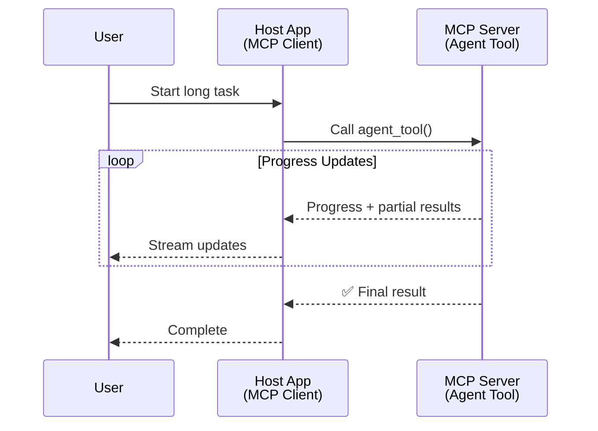
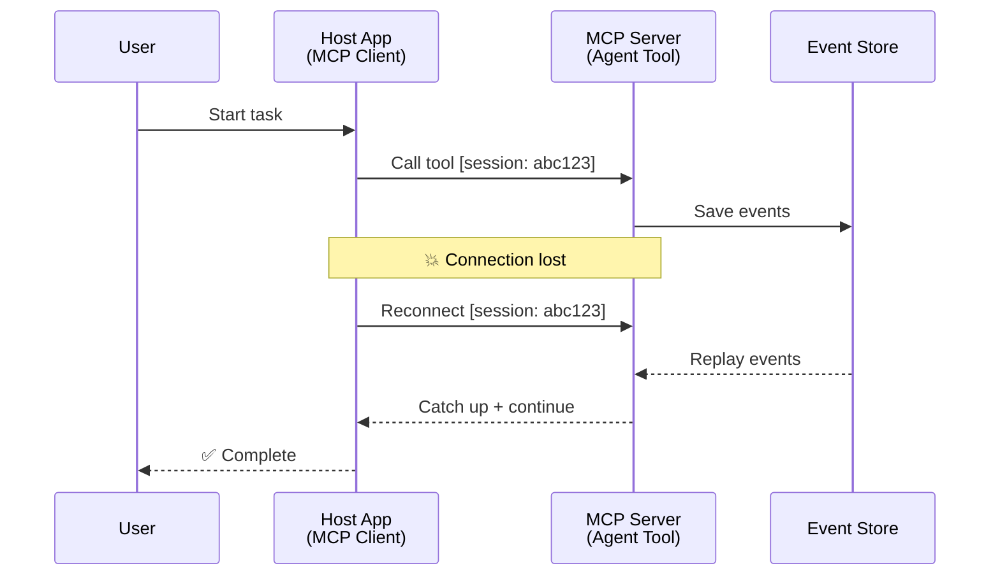
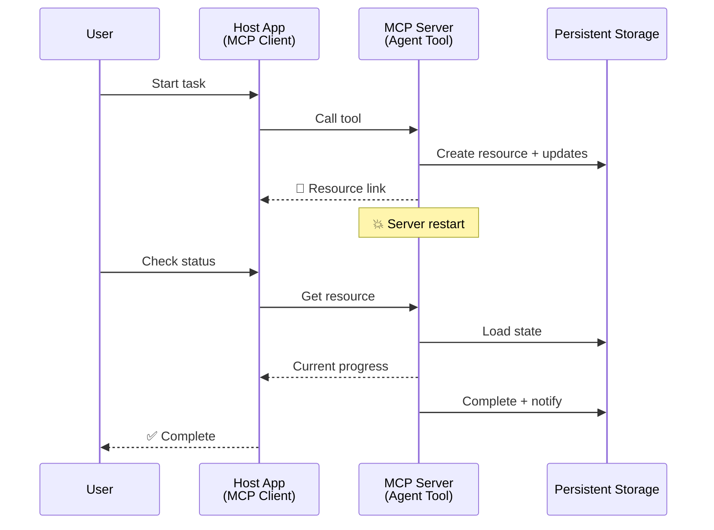
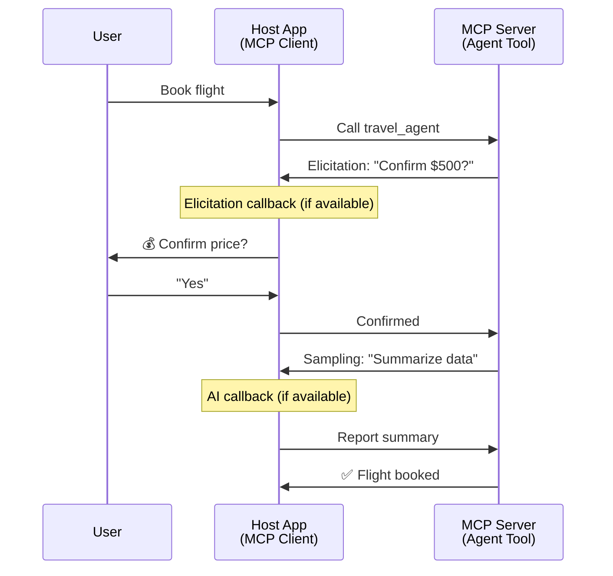

<!--
CO_OP_TRANSLATOR_METADATA:
{
  "original_hash": "5cc6836626047aa055e8960c8484a7d0",
  "translation_date": "2025-07-24T08:35:33+00:00",
  "source_file": "11-mcp/code_samples/mcp-agents/README.md",
  "language_code": "sk"
}
-->
# Budovanie systémov komunikácie medzi agentmi pomocou MCP

> Stručne - Môžete vytvoriť komunikáciu Agent2Agent na MCP? Áno!

MCP sa výrazne vyvinul nad rámec svojho pôvodného cieľa „poskytovať kontext pre LLM“. S nedávnymi vylepšeniami, ako sú [obnoviteľné streamy](https://modelcontextprotocol.io/docs/concepts/transports#resumability-and-redelivery), [elicitation](https://modelcontextprotocol.io/specification/2025-06-18/client/elicitation), [sampling](https://modelcontextprotocol.io/specification/2025-06-18/client/sampling) a notifikácie ([progress](https://modelcontextprotocol.io/specification/2025-06-18/basic/utilities/progress) a [resources](https://modelcontextprotocol.io/specification/2025-06-18/schema#resourceupdatednotification)), MCP teraz poskytuje robustný základ na budovanie komplexných systémov komunikácie medzi agentmi.

## Mýtus o agentoch/nástrojoch

Ako čoraz viac vývojárov skúma nástroje s agentickým správaním (dlhodobé spúšťanie, potreba dodatočných vstupov počas vykonávania atď.), často sa mylne predpokladá, že MCP nie je vhodný, pretože skoré príklady jeho nástrojov sa zameriavali na jednoduché vzory požiadavka-odpoveď.

Tento pohľad je zastaraný. Špecifikácia MCP bola za posledné mesiace výrazne vylepšená o funkcie, ktoré umožňujú budovanie dlhodobého agentického správania:

- **Streamovanie a čiastočné výsledky**: Aktualizácie priebehu v reálnom čase počas vykonávania
- **Obnoviteľnosť**: Klienti sa môžu po odpojení znova pripojiť a pokračovať
- **Trvácnosť**: Výsledky prežijú reštarty servera (napr. prostredníctvom odkazov na zdroje)
- **Viackolové interakcie**: Interaktívne vstupy počas vykonávania prostredníctvom elicitation a sampling

Tieto funkcie je možné skombinovať na umožnenie komplexných agentických a multi-agentových aplikácií, všetko nasadené na protokole MCP.

Pre referenciu budeme označovať agenta ako „nástroj“, ktorý je dostupný na MCP serveri. To predpokladá existenciu hostiteľskej aplikácie, ktorá implementuje MCP klienta, ktorý nadviaže reláciu s MCP serverom a môže volať agenta.

## Čo robí MCP nástroj „agentickým“?

Predtým, než sa pustíme do implementácie, definujme, aké infraštruktúrne schopnosti sú potrebné na podporu dlhodobých agentov.

> Definujeme agenta ako entitu, ktorá dokáže autonómne fungovať počas dlhšieho obdobia, schopnú zvládať komplexné úlohy, ktoré môžu vyžadovať viacero interakcií alebo úprav na základe spätnej väzby v reálnom čase.

### 1. Streamovanie a čiastočné výsledky

Tradičné vzory požiadavka-odpoveď nefungujú pre dlhodobé úlohy. Agenti musia poskytovať:

- Aktualizácie priebehu v reálnom čase
- Medzivýsledky

**Podpora MCP**: Notifikácie o aktualizácii zdrojov umožňujú streamovanie čiastočných výsledkov, hoci to vyžaduje starostlivý návrh, aby sa predišlo konfliktom s modelom 1:1 požiadavka/odpoveď JSON-RPC.

| Funkcia                   | Prípad použitia                                                                                                                                                                       | Podpora MCP                                                                                |
| ------------------------- | ------------------------------------------------------------------------------------------------------------------------------------------------------------------------------------- | ------------------------------------------------------------------------------------------ |
| Aktualizácie priebehu v reálnom čase | Používateľ požiada o úlohu migrácie kódu. Agent streamuje priebeh: „10 % - Analyzovanie závislostí... 25 % - Konvertovanie TypeScript súborov... 50 % - Aktualizácia importov...“ | ✅ Notifikácie o priebehu                                                                  |
| Čiastočné výsledky        | Úloha „Generovať knihu“ streamuje čiastočné výsledky, napr. 1) Náčrt príbehu, 2) Zoznam kapitol, 3) Každá kapitola po dokončení. Hostiteľ môže kontrolovať, zrušiť alebo presmerovať v ktoromkoľvek štádiu. | ✅ Notifikácie môžu byť „rozšírené“ o čiastočné výsledky, pozri návrhy na PR 383, 776       |

<strong>Obrázok 1:</strong> Tento diagram ilustruje, ako MCP agent streamuje aktualizácie priebehu v reálnom čase a čiastočné výsledky do hostiteľskej aplikácie počas dlhodobej úlohy, čo umožňuje používateľovi monitorovať vykonávanie v reálnom čase.

### 2. Obnoviteľnosť

Agenti musia zvládať prerušenia siete bez problémov:

- Znovu sa pripojiť po odpojení klienta
- Pokračovať tam, kde skončili (opätovné doručenie správ)

**Podpora MCP**: MCP StreamableHTTP transport dnes podporuje obnovenie relácie a opätovné doručenie správ pomocou ID relácie a ID poslednej udalosti. Dôležité je, že server musí implementovať EventStore, ktorý umožňuje prehrávanie udalostí pri opätovnom pripojení klienta.  
Poznámka: Existuje komunitný návrh (PR #975), ktorý skúma transportovo-agnostické obnoviteľné streamy.

| Funkcia      | Prípad použitia                                                                                                                                                   | Podpora MCP                                                                |
| ------------ | ------------------------------------------------------------------------------------------------------------------------------------------------------------------ | -------------------------------------------------------------------------- |
| Obnoviteľnosť | Klient sa odpojí počas dlhodobej úlohy. Po opätovnom pripojení sa relácia obnoví s prehratými zmeškanými udalosťami, pokračujúc bezproblémovo tam, kde skončila. | ✅ StreamableHTTP transport s ID relácie, prehrávaním udalostí a EventStore |

<strong>Obrázok 2:</strong> Tento diagram ukazuje, ako StreamableHTTP transport a EventStore MCP umožňujú bezproblémové obnovenie relácie: ak sa klient odpojí, môže sa znova pripojiť a prehrávať zmeškané udalosti, pokračujúc v úlohe bez straty pokroku.

### 3. Trvácnosť

Dlhodobí agenti potrebujú perzistentný stav:

- Výsledky prežijú reštarty servera
- Stav je možné získať mimo relácie
- Sledovanie priebehu medzi reláciami

**Podpora MCP**: MCP teraz podporuje návratový typ Resource link pre volania nástrojov. Dnes je možným vzorom navrhnúť nástroj, ktorý vytvorí zdroj a okamžite vráti odkaz na zdroj. Nástroj môže pokračovať v riešení úlohy na pozadí a aktualizovať zdroj. Klient sa môže rozhodnúť kontrolovať stav tohto zdroja, aby získal čiastočné alebo úplné výsledky (na základe toho, aké aktualizácie zdrojov server poskytuje), alebo sa prihlásiť na odber zdroja pre notifikácie o aktualizáciách.

Jedným obmedzením je, že kontrolovanie zdrojov alebo prihlásenie na odber aktualizácií môže spotrebovať zdroje s dôsledkami pri škálovaní. Existuje otvorený komunitný návrh (vrátane #992), ktorý skúma možnosť zahrnutia webhookov alebo spúšťačov, ktoré môže server volať na notifikáciu klienta/hostiteľskej aplikácie o aktualizáciách.

| Funkcia    | Prípad použitia                                                                                                                                        | Podpora MCP                                                        |
| ---------- | ----------------------------------------------------------------------------------------------------------------------------------------------------- | ------------------------------------------------------------------ |
| Trvácnosť | Server sa zrúti počas úlohy migrácie dát. Výsledky a priebeh prežijú reštart, klient môže skontrolovať stav a pokračovať z perzistentného zdroja. | ✅ Odkazy na zdroje s perzistentným úložiskom a notifikáciami stavu |

Dnes je bežným vzorom navrhnúť nástroj, ktorý vytvorí zdroj a okamžite vráti odkaz na zdroj. Nástroj môže na pozadí riešiť úlohu, vydávať notifikácie o zdrojoch, ktoré slúžia ako aktualizácie priebehu alebo obsahujú čiastočné výsledky, a podľa potreby aktualizovať obsah v zdroji.

<strong>Obrázok 3:</strong> Tento diagram demonštruje, ako MCP agenti používajú perzistentné zdroje a notifikácie stavu na zabezpečenie toho, že dlhodobé úlohy prežijú reštarty servera, čo umožňuje klientom kontrolovať priebeh a získavať výsledky aj po zlyhaniach.

### 4. Viackolové interakcie

Agenti často potrebujú dodatočné vstupy počas vykonávania:

- Ľudské objasnenie alebo schválenie
- AI pomoc pri komplexných rozhodnutiach
- Dynamické úpravy parametrov

**Podpora MCP**: Plne podporované prostredníctvom sampling (pre AI vstupy) a elicitation (pre ľudské vstupy).

| Funkcia                 | Prípad použitia                                                                                                                                     | Podpora MCP                                           |
| ----------------------- | --------------------------------------------------------------------------------------------------------------------------------------------------- | ----------------------------------------------------- |
| Viackolové interakcie | Agent na rezerváciu cestovania žiada používateľa o potvrdenie ceny, potom požiada AI o zhrnutie cestovných údajov pred dokončením transakcie. | ✅ Elicitation pre ľudské vstupy, sampling pre AI vstupy |

<strong>Obrázok 4:</strong> Tento diagram zobrazuje, ako MCP agenti môžu interaktívne získavať ľudské vstupy alebo žiadať AI pomoc počas vykonávania, podporujúc komplexné, viackolové pracovné postupy, ako sú potvrdenia a dynamické rozhodovanie.

...

**Upozornenie**:  
Tento dokument bol preložený pomocou služby na automatický preklad [Co-op Translator](https://github.com/Azure/co-op-translator). Hoci sa snažíme o presnosť, upozorňujeme, že automatické preklady môžu obsahovať chyby alebo nepresnosti. Pôvodný dokument v jeho pôvodnom jazyku by mal byť považovaný za autoritatívny zdroj. Pre dôležité informácie odporúčame profesionálny ľudský preklad. Nezodpovedáme za žiadne nedorozumenia alebo nesprávne interpretácie vyplývajúce z použitia tohto prekladu.