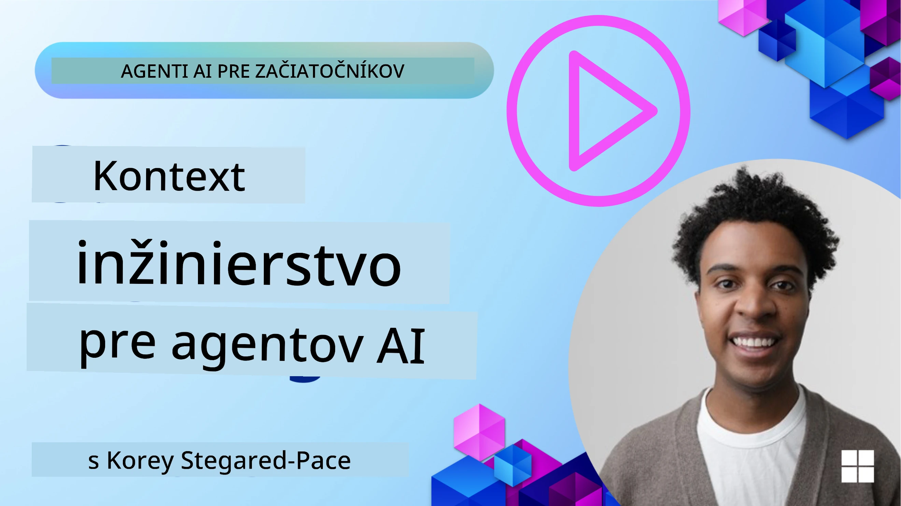
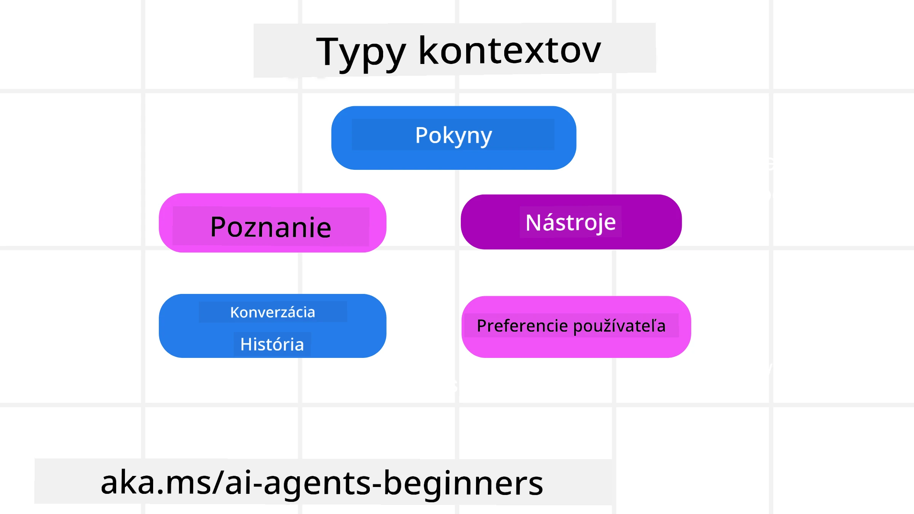
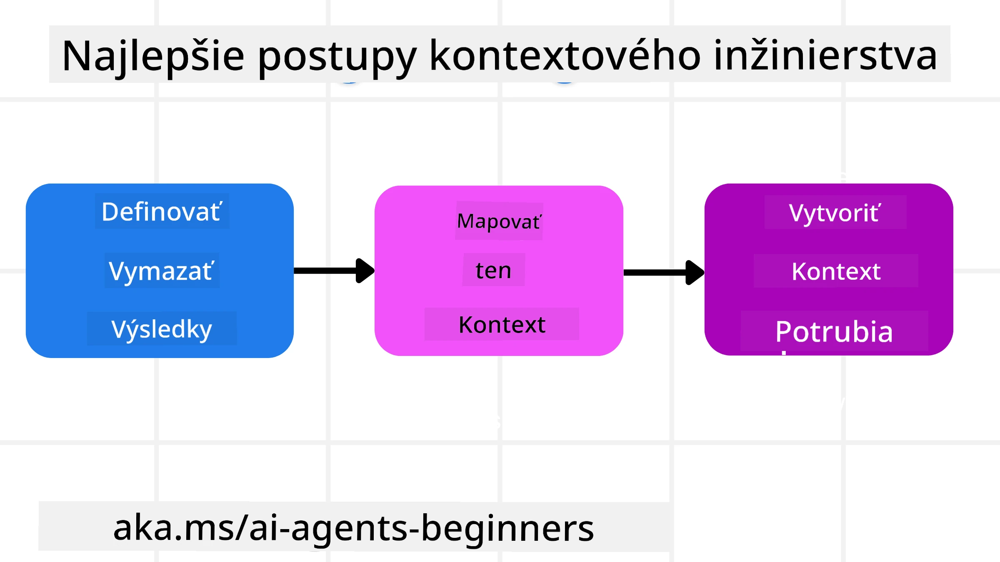

# Context Engineering pre AI Agentov

> _(Kliknite na obrázok vyššie pre pozretie videa tejto lekcie)_

Pochopenie komplexity aplikácie, pre ktorú budujete AI agenta, je dôležité pre vytvorenie spoľahlivého agenta. Potrebujeme vytvárať AI agentov, ktorí efektívne spravujú informácie, aby riešili zložité požiadavky nad rámec prompt inžinierstva.

V tejto lekcii sa pozrieme na to, čo je context engineering a jeho úlohu pri budovaní AI agentov.

## Úvod

Táto lekcia pokrýva:

• **Čo je Context Engineering** a prečo sa líši od prompt inžinierstva.

• **Stratégie pre efektívne Context Engineering**, vrátane toho, ako písať, vyberať, komprimovať a izolovať informácie.

• **Bežné chyby v kontexte**, ktoré môžu zvrátiť fungovanie vášho AI agenta a ako ich opraviť.

## Ciele učenia

Po dokončení tejto lekcie budete rozumieť, ako:

• **Definovať context engineering** a odlíšiť ho od prompt inžinierstva.

• **Identifikovať kľúčové komponenty kontextu** v aplikáciách s veľkými jazykovými modelmi (LLM).

• **Použiť stratégie na písanie, výber, kompresiu a izoláciu kontextu** na zlepšenie výkonu agenta.

• **Rozpoznať bežné chyby v kontexte** ako je otrava, rozptýlenie, zmätok a konflikt, a implementovať opatrenia na ich zmiernenie.

## Čo je Context Engineering?

Pre AI agentov je kontext tým, čo riadi plánovanie AI agenta na vykonanie určitých akcií. Context Engineering je prax zabezpečiť, že AI agent má správne informácie na dokončenie ďalšieho kroku úlohy. Kontextové okno má obmedzenú veľkosť, takže ako tvorcovia agentov musíme vybudovať systémy a procesy na správu pridávania, odstraňovania a zhutňovania informácií v kontextovom okne.

### Prompt Engineering vs Context Engineering

Prompt engineering sa zameriava na jednu sadu statických inštrukcií na efektívne vedenie AI agentov pomocou pravidiel. Context engineering zase rieši správu dynamickej súpravy informácií, vrátane počiatočného promptu, aby AI agent mal potrebné informácie v priebehu času. Hlavnou myšlienkou context engineeringu je urobiť tento proces opakovateľným a spoľahlivým.

### Typy kontextu

Je dôležité si uvedomiť, že kontext nie je len jedna vec. Informácie, ktoré AI agent potrebuje, môžu pochádzať z rôznych zdrojov, a je na nás, aby sme zabezpečili, že agent má k týmto zdrojom prístup:

Typy kontextu, ktoré môže AI agent potrebovať spravovať, zahŕňajú:

• **Inštrukcie:** Sú to ako „pravidlá“ agenta – prompty, systémové správy, few-shot príklady (ukazujúce AI, ako niečo robiť) a popisy nástrojov, ktoré môže použiť. Tu sa spája zameranie prompt engineeringu a context engineeringu.

• **Poznanie:** Zahrňuje fakty, informácie získané z databáz alebo dlhodobé spomienky, ktoré agent nazbieral. To zahŕňa integráciu Retrieval Augmented Generation (RAG) systému, ak agent potrebuje prístup k rôznym zdrojom poznatkov a databázam.

• **Nástroje:** Sú to definície externých funkcií, API a MCP serverov, ktoré agent môže volať, spolu so spätnou väzbou (výsledkami), ktorú z ich použitia dostáva.

• **História konverzácie:** Prebiehajúci dialóg s používateľom. Časom tieto rozhovory rastú a stávajú sa komplikovanejšími, čo znamená, že zaberajú miesto v kontextovom okne.

• **Preferencie používateľa:** Informácie naučené o tom, čo sa používateľovi páči alebo nepáči v priebehu času. Tie môžu byť uložené a vyvolané pri prijímaní dôležitých rozhodnutí, ktoré používateľovi pomáhajú.

## Stratégie pre efektívny Context Engineering

### Plánovacie stratégie

Dobrý context engineering začína dobrým plánovaním. Tu je prístup, ktorý vám pomôže začať rozmýšľať, ako aplikovať koncept context engineeringu:

1. **Definujte jasné výsledky** – výsledky úloh, ktoré budú AI agentovi priradené, by mali byť jasne definované. Odpovedzte na otázku – „Ako bude vyzerať svet, keď AI agent dokončí svoju úlohu?“ Inými slovami, aká zmena, informácia alebo odpoveď by mala byť pre používateľa po interakcii s AI agentom.

2. **Zmapujte kontext** – Keď ste definovali výsledky AI agenta, musíte odpovedať na otázku „Aké informácie AI agent potrebuje na dokončenie tejto úlohy?“. Takto môžete začať mapovať kontext, kde sa tieto informácie nachádzajú.

3. **Vytvorte kontextové pipeline-y** – Teraz keď viete, kde sa informácie nachádzajú, musíte odpovedať na otázku „Ako agent získa tieto informácie?“. Toto môže byť riešené rôznymi spôsobmi, vrátane RAG, použitia MCP serverov a iných nástrojov.

### Praktické stratégie

Plánovanie je dôležité, ale keď sa informácie začnú dostávať do kontextového okna agenta, potrebujeme praktické stratégie na jeho správu:

#### Správa kontextu

Kým niektoré informácie sa do kontextového okna pridávajú automaticky, context engineering znamená prevziať aktívnu rolu pri správe týchto údajov, čo je možné viacerými stratégiami:

 1. **Agent Scratchpad**  
 Umožňuje AI agentovi zaznamenávať relevantné informácie o aktuálnych úlohách a interakciách s používateľom počas jednej relácie. Tento záznam by mal existovať mimo kontextového okna, v súbore alebo bežiacom objekte, ktorý si agent môže neskôr v rámci tejto relácie vyvolať.

 2. **Spomienky**  
 Scratchpady sú vhodné na správu informácií mimo kontextového okna jednej relácie. Spomienky umožňujú agentom ukladať a vyvolávať relevantné informácie naprieč viacerými reláciami. Môžu obsahovať zhrnutia, používateľské preferencie a spätnú väzbu k budúcim zlepšeniam.

 3. **Kompresia kontextu**  
 Keď kontextové okno rastie a blíži sa k svojmu limitu, je možné použiť techniky ako sumarizáciu a skracovanie. To môže zahŕňať ponechanie iba najrelevantnejších informácií alebo odstránenie starších správ.

 4. **Multi-agentové systémy**  
 Vyvíjanie multi-agentových systémov je formou context engineeringu, pretože každý agent má svoje vlastné kontextové okno. Ako sa kontext zdieľa a odovzdáva medzi agentmi, je ďalšia vec, ktorú je potrebné naplánovať pri vývoji týchto systémov.

 5. **Sandbox prostredia**  
 Ak agent potrebuje spustiť nejaký kód alebo spracovať veľké množstvo informácií v dokumente, môže to vyžadovať veľa tokenov na spracovanie výsledkov. Namiesto uloženia všetkého v kontextovom okne môže agent použiť sandbox prostredie, ktoré umožní spustenie kódu a prečíta si iba výsledky a iné relevantné informácie.

 6. **Objekty runtime stavu**  
 Toto sa dosahuje vytvorením kontajnerov informácií na správu situácií, keď agent potrebuje mať prístup k určitým informáciám. Pre komplexnú úlohu to umožní agentovi ukladať výsledky každého podúlohy krok po kroku, čím kontext zostane prepojený iba na konkrétnu podúlohu.

#### Kontrola kontextu

Po aplikovaní jednej z týchto stratégií stojí za to skontrolovať, čo vlastne ďalší modelový dotaz prijal. Užitočná otázka na debugovanie je:

> Nahral agent príliš veľa, nesprávny alebo mu chýbal potrebný kontext?

Nemusíte zaznamenávať surové prompty, výstupy nástrojov alebo obsah spomienok, aby ste na túto otázku odpovedali. V produkcii uprednostnite malé záznamy kontroly kontextu, ktoré zachytia počty, ID, hash a značky pravidiel:

- **Výber:** Sledujte, koľko kandidátnych blokov, nástrojov alebo spomienok bolo posúdených, koľko vybraných a ktoré pravidlo alebo skóre spôsobilo filtrovanie ostatných.

- **Kompresia:** Zaznamenajte zdrojový rozsah alebo ID stopy, ID zhrnutia, odhadovaný počet tokenov pred a po kompresii a či bol surový obsah vylúčený z ďalšieho volania.

- **Izolácia:** Poznamenajte, ktorá podúloha bežala v samostatnom agentovi, relácii alebo sandboxe, aké obmedzené zhrnutie bolo vrátené a či veľký výstup nástroja zostal mimo kontextu rodičovského agenta.

- **Pamäť a RAG:** Ukladajte ID dokumentov na vyhľadanie, ID pamätí, skóre, vybrané ID a stav redakcie namiesto plného vyhľadaného textu.

- **Bezpečnosť a súkromie:** Uprednostnite hash, ID, tokenové vedrá a značky pravidiel pred citlivým textom promptu, argumentmi nástrojov, výsledkami nástrojov alebo telami používateľských spomienok.

Cieľom nie je ukladať viac kontextu. Je ním zanechať dostatok dôkazov, aby vývojár mohol povedať, ktorá stratégia kontextu bola použitá a či zmenila ďalší modelový dotaz zamýšľaným spôsobom.

### Príklad Context Engineeringu

Povedzme, že chceme, aby AI agent **„Rezervoval mi výlet do Paríža.“**

• Jednoduchý agent používajúci iba prompt engineering by mohol odpovedať: **„Dobre, kedy by ste chceli ísť do Paríža?“**. Spracoval len vašu priamu otázku v čase, keď ju používateľ položil.

• Agent používajúci stratégie context engineeringu by urobil oveľa viac. Skôr než odpovie, jeho systém by mohol:

  ◦ **Skontrolovať váš kalendár** na dostupné dátumy (na základe real-time dát).

  ◦ **Pripomenúť si minulé cestovné preferencie** (z dlhodobej pamäte), ako preferovaná letecká spoločnosť, rozpočet alebo či uprednostňujete priame lety.

  ◦ **Identifikovať dostupné nástroje** na rezerváciu letu a hotela.

- Potom by príkladová odpoveď mohla znieť: „Ahoj [Vaše meno]! Vidím, že ste voľný v prvom týždni októbra. Mám hľadať priame lety do Paríža s [preferovaná letecká spoločnosť] v rámci vášho bežného rozpočtu [Rozpočet]?“. Tento bohatší, kontextovo uvedomelý odpoveď demonštruje silu context engineeringu.

## Bežné chyby v kontexte

### Otrava kontextu

**Čo to je:** Keď do kontextu vstúpi halucinácia (falošná informácia generovaná LLM) alebo chyba, ktorá je opakovane spomínaná, spôsobujúc, že agent sleduje nemožné ciele alebo vyvíja nezmyselné stratégie.

**Čo robiť:** Zaviesť **validáciu kontextu** a **karanténu**. Validujte informácie pred ich pridaním do dlhodobej pamäte. Ak je detekovaná potenciálna otrava, začnite nové kontextové vlákna, aby sa zlá informácia nešírila.

**Príklad rezervácie cesty:** Váš agent halucinoval **priamy let z malého lokálneho letiska do vzdialeného medzinárodného mesta**, ktoré v skutočnosti neponúka medzinárodné lety. Tento neexistujúci let sa uloží do kontextu. Neskôr, keď požiadate agenta o rezerváciu, neustále sa snaží nájsť lístky na túto nemožnú trasu, čo vedie k opakujúcim sa chybám.

**Riešenie:** Implementujte krok, ktorý **validuje existenciu letu a trasy pomocou API v reálnom čase** _pred_ pridaním detailov letu do aktuálneho kontextu agenta. Ak validácia zlyhá, chybná informácia je „karanténovaná“ a ďalej sa nepoužíva.

### Rozptýlenie kontextu

**Čo to je:** Keď sa kontext stane tak veľkým, že model sa príliš zameriava na nahromadenú históriu namiesto využitia naučených vecí počas tréningu, vedie to k opakujúcim sa alebo neprínosným akciám. Modely začínajú robiť chyby ešte pred naplnením kontextového okna.

**Čo robiť:** Používajte **súhrny kontextu**. Pravidelne komprimujte nahromadené informácie do kratších súhrnov, pričom zachovajte dôležité detaily a odstráňte nadbytočnú históriu. Pomáha to „resetovať“ fokus.

**Príklad rezervácie cesty:** Dlhodobo diskutujete o rôznych vysnívaných cestovných destináciách, vrátane detailného rozprávania o vašom batohovom výlete spred dvoch rokov. Keď nakoniec požiadate **„nájsť mi lacný let na** **budúci mesiac****,“** agent sa zasekne v starých, irelevantných detailoch a neustále sa pýta na vaše batohové vybavenie alebo minulé itineráre, ignorujúc vašu aktuálnu požiadavku.

**Riešenie:** Po určitom počte prejavov alebo ak kontext rastie príliš veľký, by mal agent **zhrnúť najnovšie a relevantné časti konverzácie** – zamerať sa na aktuálne cestovné dátumy a destináciu – a použiť tento skondenzovaný súhrn pre ďalšie volanie LLM, pričom menej relevantný historický rozhovor odmietne.

### Zmätok v kontexte

**Čo to je:** Keď zbytočný kontext, často vo forme príliš veľa dostupných nástrojov, spôsobuje, že model generuje zlé odpovede alebo volá nerelevantné nástroje. Menšie modely sú na to obzvlášť náchylné.

**Čo robiť:** Zaviesť **správu záťaže nástrojov** pomocou techník RAG. Ukladajte popisy nástrojov do vektorovej databázy a vyberajte _len_ najrelevantnejšie nástroje pre konkrétnu úlohu. Výskum ukazuje, že je vhodné obmedziť výber nástrojov na menej ako 30.

**Príklad rezervácie cesty:** Váš agent má prístup k desiatkam nástrojov: `book_flight`, `book_hotel`, `rent_car`, `find_tours`, `currency_converter`, `weather_forecast`, `restaurant_reservations` atď. Položíte otázku, **„Aký je najlepší spôsob, ako sa pohybovať po Paríži?“** Kvôli veľkému počtu nástrojov sa agent zmätene snaží volať `book_flight` _v rámci_ Paríža alebo `rent_car` hoci preferujete verejnú dopravu, pretože popisy nástrojov sa môžu prekrývať alebo proste nevie vybrať ten najlepší.

**Riešenie:** Používajte **RAG nad popismi nástrojov**. Keď sa pýtate na pohyb po Paríži, systém dynamicky vyhľadá _len_ najrelevantnejšie nástroje ako `rent_car` alebo `public_transport_info` na základe vašej požiadavky, čím predloží LLM zameraný „loadout“ nástrojov.

### Konflikt v kontexte

**Čo to je:** Keď v kontexte existujú protirečivé informácie, čo vedie k nekonzistentnému uvažovaniu alebo zlým konečným odpovediam. Často sa to stáva, keď informácie prichádzajú po etapách a skoré, nesprávne predpoklady zostanú v kontexte.

**Čo robiť:** Používajte **prerezávanie kontextu** a **vyraďovanie**. Prerezávanie znamená odstránenie zastaraných alebo protichodných informácií pri príchode nových detailov. Vyraďovanie poskytuje modelu samostatný “scratchpad” pracovný priestor na spracovanie informácií bez zahltenia hlavného kontextu.
**Príklad rezervácie cestovania:** Najskôr poviete svojmu agentovi, **„Chcem letieť v ekonomickej triede.“** Neskôr v rozhovore si to rozmyslíte a poviete, **„Vlastne, na túto cestu choďme v biznis triede.“** Ak obe inštrukcie zostanú v kontexte, agent môže dostať konfliktujúce výsledky vyhľadávania alebo byť zmätený, ktorú preferenciu má uprednostniť.

**Riešenie:** Implementujte **prerezávanie kontextu**. Keď nová inštrukcia odporuje starej, staršia inštrukcia sa z kontextu odstráni alebo explicitne predefinuje. Alternatívne môže agent použiť **scratchpad** na zosúladenie konfliktujúcich preferencií pred rozhodnutím, čím zabezpečí, že len konečná, konzistentná inštrukcia bude riadiť jeho činnosti.

## Máte ďalšie otázky ohľadom kontextového inžinierstva?

Pridajte sa do [Microsoft Foundry Discord](https://aka.ms/ai-agents/discord), kde sa môžete stretnúť s ďalšími študentmi, zúčastniť sa úradných hodín a získať odpovede na svoje otázky ohľadom AI agentov.

---

<!-- CO-OP TRANSLATOR DISCLAIMER START -->
**Vyhlásenie o zodpovednosti**:
Tento dokument bol preložený pomocou AI prekladateľskej služby [Co-op Translator](https://github.com/Azure/co-op-translator). Hoci sa snažíme o presnosť, vezmite prosím na vedomie, že automatické preklady môžu obsahovať chyby alebo nepresnosti. Pôvodný dokument v jeho natívnom jazyku by mal byť považovaný za autoritatívny zdroj. Pre kritické informácie sa odporúča profesionálny ľudský preklad. Nie sme zodpovední za žiadne nedorozumenia alebo nesprávne interpretácie vyplývajúce z použitia tohto prekladu.
<!-- CO-OP TRANSLATOR DISCLAIMER END -->