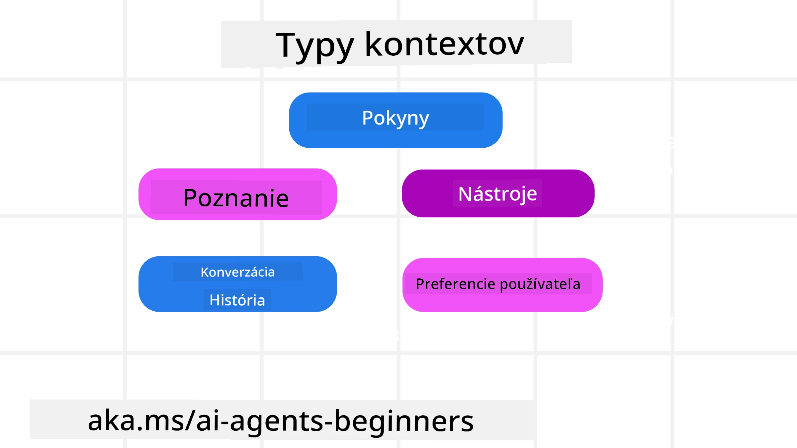
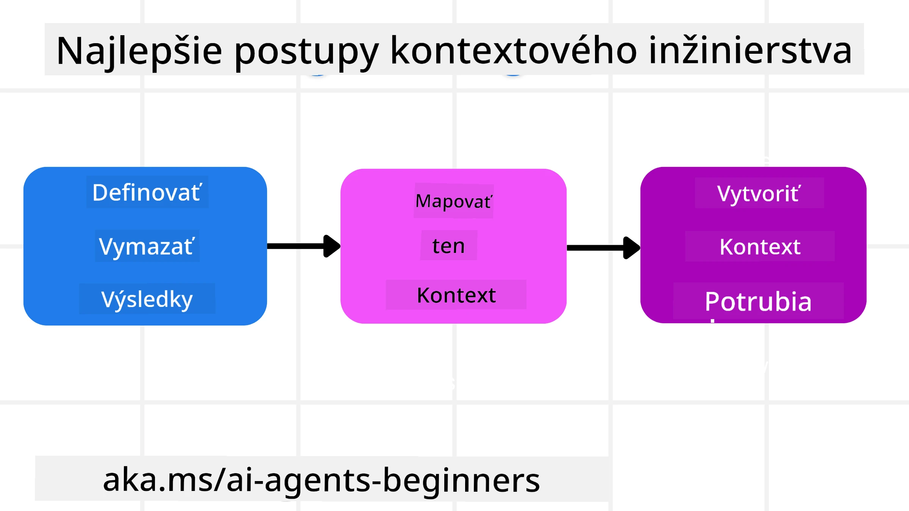

# Inžinierstvo kontextu pre AI agentov

> _(Kliknite na obrázok vyššie pre zobrazenie videa tejto lekcie)_

Pochopenie zložitosti aplikácie, pre ktorú budujete AI agenta, je dôležité na vytvorenie spoľahlivého agenta. Potrebujeme vytvárať AI agentov, ktorí efektívne spravujú informácie tak, aby riešili zložité potreby vyžadujúce viac než len inžinierstvo promptov.

V tejto lekcii sa pozrieme na to, čo je inžinierstvo kontextu a akú úlohu má pri vytváraní AI agentov.

## Úvod

Táto lekcia bude pokrývať:

• **Čo je inžinierstvo kontextu** a prečo sa líši od inžinierstva promptov.

• **Stratégie efektívneho inžinierstva kontextu**, vrátane toho, ako písať, vyberať, komprimovať a izolovať informácie.

• **Bežné zlyhania kontextu**, ktoré môžu prekazit váš AI agent, a ako ich opraviť.

## Ciele učenia

Po dokončení tejto lekcie budete vedieť:

• **Definovať inžinierstvo kontextu** a rozlíšiť ho od inžinierstva promptov.

• **Identifikovať kľúčové komponenty kontextu** v aplikáciách s veľkými jazykovými modelmi (LLM).

• **Aplikovať stratégie písania, výberu, komprimácie a izolácie kontextu** na zlepšenie výkonu agenta.

• **Rozpoznať bežné zlyhania kontextu** ako napríklad otrávenie, rozptýlenie, zmätok a konflikt a implementovať opatrenia na ich zmiernenie.

## Čo je inžinierstvo kontextu?

Pre AI agentov je kontext tým, čo riadi plánovanie ich krokov na vykonanie určitých akcií. Inžinierstvo kontextu je prax zabezpečovania, že AI agent má správne informácie na dokončenie ďalšieho kroku úlohy. Kontextové okno je obmedzené veľkosťou, takže ako tvorcovia agentov musíme vytvoriť systémy a procesy na spravovanie pridávania, odstraňovania a zjednocovania informácií v kontextovom okne.

### Inžinierstvo promptov vs inžinierstvo kontextu

Inžinierstvo promptov sa zameriava na jeden súbor statických inštrukcií, ktoré efektívne vedú AI agentov pomocou súboru pravidiel. Inžinierstvo kontextu spravuje dynamický súbor informácií, vrátane úvodného promptu, aby AI agent mal potrebné informácie v priebehu času. Hlavnou myšlienkou inžinierstva kontextu je urobiť tento proces opakovateľným a spoľahlivým.

### Typy kontextu

Je dôležité si uvedomiť, že kontext nie je len jedna vec. Informácie, ktoré AI agent potrebuje, môžu pochádzať z rôznych zdrojov a je na nás zabezpečiť, aby agent mal k nim prístup:

Typy kontextu, ktoré môže AI agent potrebovať spravovať, zahŕňajú:

• **Inštrukcie:** Sú to akoby "pravidlá" agenta – prompty, systémové správy, príklady few-shot (ukazujúce AI, ako niečo robiť) a popisy nástrojov, ktoré môže používať. Tu sa zameranie inžinierstva promptov spája s inžinierstvom kontextu.

• **Znalosti:** Zahŕňa fakty, informácie získané z databáz alebo dlhodobé spomienky, ktoré agent nazbieral. To zahŕňa integráciu systému Retrieval Augmented Generation (RAG), ak agent potrebuje prístup k rôznym úložiskám znalostí a databázam.

• **Nástroje:** Sú to definície externých funkcií, API a MCP serverov, ktoré agent môže volať, spolu s výsledkami (spätnou väzbou), ktoré z používania dostáva.

• **História konverzácií:** Prebiehajúci dialóg s používateľom. S postupom času tieto konverzácie rastú a stávajú sa zložitejšími, čo znamená, že zaberajú miesto v kontextovom okne.

• **Preferencie používateľa:** Informácie získané o používateľových obľúbených alebo neobľúbených veciach v čase. Tieto môžu byť uložené a použité pri rozhodovaní na pomoc používateľovi.

## Stratégie efektívneho inžinierstva kontextu

### Plánovacie stratégie

Dobré inžinierstvo kontextu začína dobrým plánovaním. Tu je prístup, ktorý vám pomôže začať uvažovať o tom, ako aplikovať koncept inžinierstva kontextu:

1. **Definujte jasné výsledky** – výsledky úloh, ktoré AI agenti vykonajú, by mali byť jasne definované. Odpovedzte na otázku – "Ako bude svet vyzerať, keď AI agent dokončí svoju úlohu?" Inými slovami, akú zmenu, informáciu alebo odpoveď by mal používateľ mať po interakcii s AI agentom.
2. **Zmapujte kontext** – Keď máte definované výsledky AI agenta, musíte odpovedať na otázku "Aké informácie agent potrebuje na dokončenie tejto úlohy?" Takto môžete začať mapovať kontext, teda kde sa tieto informácie môžu nachádzať.
3. **Vytvorte kontextové pipeline** – Teraz keď viete, kde sú informácie, je potrebné odpovedať na otázku "Ako agent získa tieto informácie?". Môže to byť rôznymi spôsobmi vrátane RAG, použitia MCP serverov a iných nástrojov.

### Praktické stratégie

Plánovanie je dôležité, ale keď informácie začnú prichádzať do kontextového okna nášho agenta, potrebujeme praktické stratégie ich správy:

#### Správa kontextu

Kým niektoré informácie sa pridávajú do kontextového okna automaticky, inžinierstvo kontextu znamená aktívnejší prístup k spravovaniu týchto informácií, ktorý možno dosiahnuť niekoľkými stratégiami:

 1. **Poznámkový blok agenta**
 Tento umožňuje AI agentovi zaznamenávať relevantné informácie o aktuálnych úlohách a interakciách s používateľom počas jednej relácie. Mal by existovať mimo kontextového okna v súbore alebo runtime objekte, ktorý si agent môže neskôr počas tejto relácie vyvolať, ak je to potrebné.

 2. **Spomienky**
 Poznámkové bloky sú vhodné na správu informácií mimo kontextového okna jednej relácie. Spomienky umožňujú agentom ukladať a vyhľadávať relevantné informácie naprieč viacerými reláciami. Môžu zahŕňať zhrnutia, preferencie používateľa a spätnú väzbu na zlepšenie v budúcnosti.

 3. **Komprimácia kontextu**
  Keď kontextové okno rastie a blíži sa k svojmu limitu, možno použiť techniky ako sumarizácia a orezanie. To znamená buď ponechať iba najrelevantnejšie informácie alebo odstrániť staršie správy.
  
 4. **Systémy viacerých agentov**
  Vývoj systémov viacerých agentov je formou inžinierstva kontextu, pretože každý agent má svoje vlastné kontextové okno. Ako sa tento kontext zdieľa a odovzdáva medzi rôznymi agentmi, je ďalšia vec na plánovanie pri tvorbe týchto systémov.
  
 5. **Sandbox prostredia**
  Ak agent potrebuje spustiť nejaký kód alebo spracovať veľké množstvo informácií v dokumente, môže to vyžadovať veľa tokenov na spracovanie výsledkov. Namiesto toho, aby toto všetko bolo uložené v kontextovom okne, agent môže použiť sandbox prostredie, ktoré dokáže kód spustiť a len prečítať výsledky a iné relevantné informácie.
  
 6. **Runtime stavové objekty**
   To sa robí vytváraním kontajnerov informácií na správu situácií, keď agent potrebuje mať prístup k určitým informáciám. Pre komplexnú úlohu to umožní agentovi ukladať výsledky každej podúlohy krok za krokom, čím zostane kontext pripojený len k tej konkrétnej podúlohe.

#### Kontrola kontextu

Po použití jednej z týchto stratégií stojí za to skontrolovať, čo ďalší modelový volací proces skutočne prijal. Užitočná otázka pri ladení je:

> Nahrala agentovi príliš veľa kontextu, nesprávny kontext, alebo mu chýbal kontext, ktorý potreboval?

Nemusíte zaznamenávať surové prompty, výstupy nástrojov alebo obsah pamäte na zodpovedanie tejto otázky. Vo výrobe uprednostnite malé záznamy kontroly kontextu, ktoré zachytávajú počty, ID, hash kódy a označenia politiky:

- **Výber:** Sledujte, koľko kandidátnych častí, nástrojov alebo spomienok bolo zvážených, koľko z nich bolo vybraných a ktoré pravidlo alebo skóre spôsobilo vyfiltrovanie ostatných.
- **Komprimácia:** Zaznamenajte zdrojový rozsah alebo sledovacie ID, ID zhrnutia, odhadovaný počet tokenov pred a po komprimácii a či bol surový obsah vylúčený z ďalšieho volania.
- **Izolácia:** Poznačte, ktorá podúloha bežala v samostatnom agentovi, relácii alebo sandboxe, aké obmedzené zhrnutie sa vrátilo a či veľké výstupy nástrojov zostali mimo kontextu rodičovského agenta.
- **Pamäť a RAG:** Uchovávajte ID dokumentov vyhľadávania, ID pamäte, skóre, vybrané ID a stav redakcie namiesto úplného vyhľadaného textu.
- **Bezpečnosť a súkromie:** Uprednostnite hash kódy, ID, tokenové vedrá a označenia politiky pred citlivým textom promptov, argumentmi nástrojov, výsledkami nástrojov alebo obsahmi používateľských spomienok.

Cieľom nie je uchovávať viac kontextu. Je to nechať dostatočný dôkaz, aby vývojár mohol povedať, ktorá kontextová stratégia sa použila a či to zmenilo ďalšie modelové volanie zamýšľaným spôsobom.

### Príklad inžinierstva kontextu

Predpokladajme, že chceme AI agentovi povedať **"Zarezervuj mi cestu do Paríža."**

• Jednoduchý agent používajúci len inžinierstvo promptov môže len odpovedať: **"Dobre, kedy by ste chceli ísť do Paríža?"**. Spracoval len vašu priamu otázku v čase, keď ste ju položili.

• Agent používajúci spomenuté stratégie inžinierstva kontextu by spravil omnoho viac. Skôr než by odpovedal, jeho systém by mohol:

  ◦ **Skontrolovať váš kalendár** na dostupné dátumy (získavanie dát v reálnom čase).

 ◦ **Pripomenúť si predchádzajúce cestovné preferencie** (z dlhodobej pamäte), ako vaša preferovaná letecká spoločnosť, rozpočet alebo či preferujete priame lety.

 ◦ **Identifikovať dostupné nástroje** na rezerváciu leteniek a hotelov.

- Potom by mohla byť odpoveď napríklad: "Ahoj [Tvoje meno]! Vidím, že si voľný v prvom týždni októbra. Mám hľadať priame lety do Paríža na [preferovanej leteckej spoločnosti] v rámci tvojho obvyklého rozpočtu [rozpočet]?" Táto bohatšia, kontextom vedená odpoveď ukazuje silu inžinierstva kontextu.

## Bežné zlyhania kontextu

### Otrávenie kontextu

**Čo to je:** Keď do kontextu vstúpi halucinácia (nepravdivá informácia generovaná LLM) alebo chyba a je opakovane odkazovaná, čo spôsobuje, že agent sleduje nemožné ciele alebo vyvíja nezmyselné stratégie.

**Čo robiť:** Implementujte **validáciu kontextu** a **karanténu**. Overujte informácie pred ich pridaním do dlhodobej pamäte. Ak je zistené možné otrávenie, začnite nové vlákna kontextu, aby ste zabránili šíreniu zlých informácií.

**Príklad rezervácie cesty:** Váš agent halucinuje **priamy let z malého lokálneho letiska do vzdialeného medzinárodného mesta**, ktoré v skutočnosti neponúka medzinárodné lety. Tento neexistujúci detail o lete sa uloží do kontextu. Neskôr, keď žiadate agenta o rezerváciu, stále sa snaží nájsť lístky na túto nemožnú trasu, čo vedie k opakovaným chybám.

**Riešenie:** Implementujte krok, ktorý **overuje existenciu letu a trasy cez API v reálnom čase** _predtým_, než sa detail letu pridá do pracovného kontextu agenta. Ak overenie zlyhá, chybná informácia je "karanténovaná" a ďalej sa nepoužíva.

### Rozptýlenie kontextu

**Čo to je:** Keď kontext narastie natoľko, že model sa príliš zameriava na nahromadenú históriu namiesto využitia toho, čo sa naučil počas tréningu, vedie to k opakovaným alebo neefektívnym akciám. Modely môžu začať robiť chyby ešte pred naplnením kontextového okna.

**Čo robiť:** Použite **sumarizáciu kontextu**. Pravidelne komprimujte nahromadené informácie do kratších zhrnutí, ktoré zachovajú dôležité detaily a odstránia duplicitnú históriu. To pomáha "resetovať" zameranie.

**Príklad rezervácie cesty:** Diskutujete dlhodobo o rôznych vysnívaných cestovných destináciách, vrátane detailného rozprávania o vašej turistike spred dvoch rokov. Keď nakoniec žiadate **"nájdi mi lacný let na budúci mesiac,"** agent sa zasekne v starých, nerelevantných detailoch a stále sa pýta na výbavu na turistiku alebo minulé plány, zanedbávajúc vašu aktuálnu požiadavku.

**Riešenie:** Po určitom počte krokov alebo keď kontext príliš narastie, by agent mal **zhrnúť najnovšie a relevantné časti konverzácie** – zamerať sa na aktuálne dátumy a cieľ cesty – a použiť toto kondenzované zhrnutie pre ďalšie volanie LLM, pričom menej relevantný historický chat zahodí.

### Zmätok kontextu

**Čo to je:** Keď zbytočný kontext, často vo forme príliš mnohých dostupných nástrojov, spôsobuje generovanie zlých odpovedí alebo volanie nesúvisiacich nástrojov. Menšie modely sú na toto obzvlášť náchylné.

**Čo robiť:** Implementujte **správu zatriedenia nástrojov** pomocou techník RAG. Uchovávajte popisy nástrojov vo vektorovej databáze a vyberajte _len_ tie najrelevantnejšie nástroje pre každú konkrétnu úlohu. Výskumy naznačujú obmedzenie výberu nástrojov na menej ako 30.

**Príklad rezervácie cesty:** Váš agent má prístup k desiatkam nástrojov: `book_flight`, `book_hotel`, `rent_car`, `find_tours`, `currency_converter`, `weather_forecast`, `restaurant_reservations` a iné. Položíte otázku, **"Aký je najlepší spôsob pohybu po Paríži?"** Kvôli veľkému počtu nástrojov sa agent zmätený pokúša volať `book_flight` _v rámci_ Paríža alebo `rent_car`, hoci preferujete verejnú dopravu, pretože popisy nástrojov sa môžu prekrývať alebo jednoducho nevie rozlíšiť ten najlepší.

**Riešenie:** Použite **RAG nad popismi nástrojov**. Keď sa pýtate na pohyb v Paríži, systém dynamicky načíta _len_ najrelevantnejšie nástroje ako `rent_car` alebo `public_transport_info` na základe vašej otázky, čím sa vytvorí zameraný "váhový súbor" nástrojov pre LLM.

### Konflikt kontextu

**Čo to je:** Keď v kontexte existujú protichodné informácie, čo vedie k nesúrodému uvažovaniu alebo zlým záverečným odpovediam. Často sa stáva, že informácie prichádzajú postupne a skoré nesprávne predpoklady zostávajú v kontexte.

**Čo robiť:** Použite **prerezávanie kontextu** a **odkladanie**. Prerezávanie znamená odstraňovanie zastaraných alebo protichodných informácií, ako prichádzajú nové detaily. Odkladanie dáva modelu samostatný "poznámkový blok", kde môže spracovať informácie bez zahlcovania hlavného kontextu.

**Príklad rezervácie cesty:** Najskôr poviete svojmu agentovi, **„Chcem letieť v ekonomickej triede.“** Neskôr v rozhovore si to rozmyslíte a poviete, **„Vlastne, na túto cestu pôjdeme v biznis triede.“** Ak zostanú obe inštrukcie v kontexte, agent môže dostať protichodné výsledky vyhľadávania alebo môže byť zmätený, ktorú preferenciu uprednostniť.

**Riešenie:** Implementujte **čistenie kontextu**. Keď nová inštrukcia protirečí starej, staršia inštrukcia sa z kontextu odstráni alebo explicitne prepíše. Alternatívne môže agent použiť **poznámkový blok** (scratchpad), aby zladil protichodné preferencie pred rozhodnutím, čím zabezpečí, že len konečná, konzistentná inštrukcia bude riadiť jeho činnosť.

## Máte ďalšie otázky o inžinierstve kontextu?

Pridajte sa na [Microsoft Foundry Discord](https://discord.com/invite/ATgtXmAS5D), kde sa stretnete s ďalšími študentmi, zúčastníte sa konzultačných hodín a získate odpovede na vaše otázky týkajúce sa AI agentov.

---

<!-- CO-OP TRANSLATOR DISCLAIMER START -->
**Vyhlásenie o zodpovednosti**:
Tento dokument bol preložený pomocou AI prekladateľskej služby [Co-op Translator](https://github.com/Azure/co-op-translator). Hoci sa snažíme o presnosť, vezmite prosím na vedomie, že automatické preklady môžu obsahovať chyby alebo nepresnosti. Pôvodný dokument v jeho natívnom jazyku by mal byť považovaný za autoritatívny zdroj. Pre kritické informácie sa odporúča profesionálny ľudský preklad. Nie sme zodpovední za žiadne nedorozumenia alebo nesprávne interpretácie vyplývajúce z použitia tohto prekladu.
<!-- CO-OP TRANSLATOR DISCLAIMER END -->