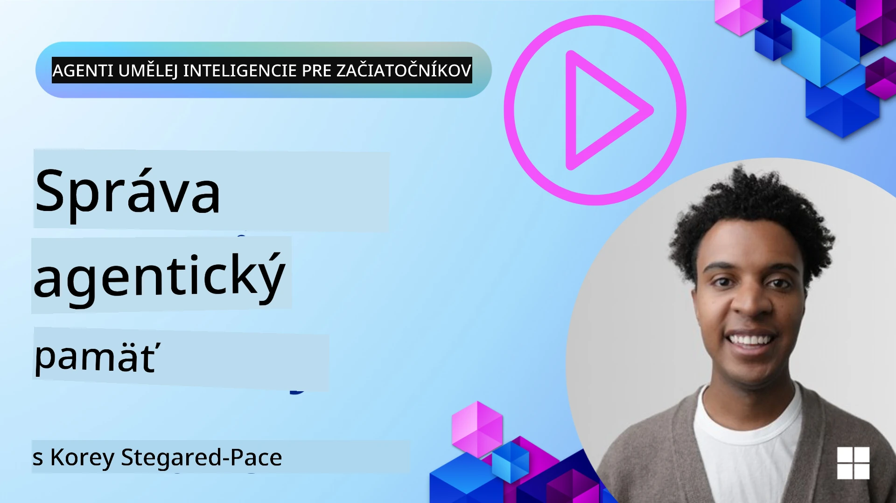

# Pamäť pre AI agentov 

Keď sa diskutuje o jedinečných výhodách vytvárania AI agentov, spomínajú sa hlavne dve veci: schopnosť volať nástroje na vykonávanie úloh a schopnosť zlepšovať sa v priebehu času. Pamäť je základom vytvárania agentov, ktorí sa sami zlepšujú a dokážu vytvárať lepšie skúsenosti pre našich používateľov.

V tejto lekcii sa pozrieme na to, čo je pamäť pre AI agentov a ako ju môžeme spravovať a využívať v prospech našich aplikácií.

## Úvod

Táto lekcia pokryje:

• **Pochopenie pamäte AI agenta**: Čo je pamäť a prečo je pre agentov nevyhnutná.

• **Implementácia a ukladanie pamäte**: Praktické metódy pridania pamäťových schopností vašim AI agentom, so zameraním na krátkodobú a dlhodobú pamäť.

• **Umožniť AI agentom samovylepšovanie**: Ako pamäť umožňuje agentom učiť sa z minulých interakcií a zlepšovať sa v priebehu času.

## Dostupné implementácie

Táto lekcia obsahuje dve komplexné notebookové príručky:

• **[13-agent-memory.ipynb](./13-agent-memory.ipynb)**: Implementuje pamäť pomocou Mem0 a Azure AI Search s Microsoft Agent Framework

• **[13-agent-memory-cognee.ipynb](./13-agent-memory-cognee.ipynb)**: Implementuje štruktúrovanú pamäť pomocou Cognee, automaticky buduje znalostný graf založený na embeddingoch, vizualizuje graf a poskytuje inteligentné vyhľadávanie

## Ciele učenia

Po absolvovaní tejto lekcie budete vedieť:

• **Rozlíšiť medzi rôznymi typmi pamäte AI agenta**, vrátane pracovnej, krátkodobej a dlhodobej pamäte, ako aj špecializovaných foriem ako pamäť persony a episodická pamäť.

• **Implementovať a spravovať krátkodobú a dlhodobú pamäť pre AI agentov** pomocou Microsoft Agent Framework, využívajúc nástroje ako Mem0, Cognee, Whiteboard memory a integráciu s Azure AI Search.

• **Pochopiť princípy za samo-zlepšujúcimi sa AI agentmi** a ako robustné systémy správy pamäte prispievajú k priebežnému učeniu a adaptácii.

## Pochopenie pamäte AI agentov

V jadre, **pamäť pre AI agentov sa vzťahuje na mechanizmy, ktoré im umožňujú uchovávať a pripomínať si informácie**. Tieto informácie môžu byť konkrétne detaily o konverzácii, preferencie používateľa, minulých akciách alebo dokonca naučené vzory.

Bez pamäti sú AI aplikácie často bezstavové, čo znamená, že každá interakcia začína od nuly. To vedie k opakujúcej sa a frustrujúcej používateľskej skúsenosti, kde agent „zabúda“ predchádzajúci kontext alebo preferencie.

### Prečo je pamäť dôležitá?

inteligencia agenta je hlboko spätá s jeho schopnosťou si vybavovať a využívať minulé informácie. Pamäť umožňuje agentom byť:

• **Reflexívne**: Učiť sa z minulých akcií a výsledkov.

• **Interaktívne**: Udržiavať kontext v priebehu prebiehajúcej konverzácie.

• **Proaktívne a reaktívne**: Predvídať potreby alebo primerane reagovať na základe historických dát.

• **Autonómne**: Fungovať samostatnejšie tým, že čerpajú zo uložených poznatkov.

Cieľom implementácie pamäte je urobiť agentov viac **spoľahlivými a schopnejšími**.

### Typy pamäte

#### Pracovná pamäť

Predstavte si to ako kus papieru na poznámky, ktorý agent používa počas jednej prebiehajúcej úlohy alebo myšlienkového procesu. Uchováva okamžité informácie potrebné na výpočet ďalšieho kroku.

Pre AI agentov pracovná pamäť často zachytáva najrelevantnejšie informácie z konverzácie, aj keď je celý chat dlhý alebo orezaný. Zameriava sa na extrahovanie kľúčových prvkov ako požiadavky, návrhy, rozhodnutia a akcie.

**Príklad pracovnej pamäte**

V cestovnom agentovi by pracovná pamäť mohla zachytiť aktuálnu požiadavku používateľa, napríklad „Chcem si rezervovať výlet do Paríža“. Táto konkrétna požiadavka je uložená v bezprostrednom kontexte agenta, aby viedla aktuálnu interakciu.

#### Krátkodobá pamäť

Tento typ pamäte uchováva informácie počas jednej konverzácie alebo relácie. Je to kontext aktuálneho chatu, ktorý umožňuje agentovi odvolávať sa na predchádzajúce repliky v dialógu.

**Príklad krátkodobej pamäte**

Ak sa používateľ opýta: „Koľko bude stáť let do Paríža?“ a potom pridá: „A čo ubytovanie tam?“, krátkodobá pamäť zabezpečí, že agent vie, že „tam“ odkazuje na „Paríž“ v rámci tej istej konverzácie.

#### Dlhodobá pamäť

Ide o informácie, ktoré pretrvávajú cez viacero konverzácií alebo relácií. Umožňuje agentom pamätať si používateľské preferencie, historické interakcie alebo všeobecné vedomosti počas dlhšieho časového obdobia. To je dôležité pre personalizáciu.

**Príklad dlhodobej pamäte**

Dlhodobá pamäť môže uložiť, že „Ben má rád lyžovanie a aktivity v prírode, má rád kávu s výhľadom na hory a chce sa vyhýbať pokročilým zjazdovkám kvôli minulému zraneniu“. Tieto informácie, získané z predchádzajúcich interakcií, ovplyvnia odporúčania pri budúcom plánovaní ciest, čím budú veľmi personalizované.

#### Pamäť persony

Tento špecializovaný typ pamäte pomáha agentovi rozvíjať konzistentnú „osobnosť“ alebo „personu“. Umožňuje agentovi pamätať si detaily o sebe alebo o svojej zamýšľanej úlohe, čo robí interakcie plynulejšími a zameranejšími.

**Príklad pamäte persony**
Ak je cestovný agent navrhnutý ako „expert na plánovanie lyžovačiek“, pamäť persony môže posilniť túto rolu a ovplyvniť jeho odpovede tak, aby zodpovedali tónu a vedomostiam odborníka.

#### Pamäť pracovného postupu / epizodická pamäť

Táto pamäť ukladá postupnosť krokov, ktoré agent vykonáva počas zložitých úloh, vrátane úspechov a neúspechov. Je to ako zapamätanie si konkrétnych „epizód“ alebo minulých skúseností, z ktorých sa dá učiť.

**Príklad episodickej pamäte**

Ak sa agent pokúsil zarezervovať konkrétny let, ale zlyhalo to kvôli jeho nedostupnosti, episodická pamäť môže zaznamenať tento neúspech, čo umožní agentovi skúsiť alternatívne lety alebo informovať používateľa o probléme pri následnom pokuse oveľa informovanejšie.

#### Pamäť entít

Toto zahŕňa extrahovanie a zapamätanie si konkrétnych entít (ako ľudia, miesta alebo veci) a udalostí z konverzácií. Umožňuje agentovi budovať štruktúrované porozumenie kľúčových prvkov, o ktorých sa hovorilo.

**Príklad pamäte entít**

Z konverzácie o minulom výlete by agent mohol extrahovať „Paríž“, „Eiffelova veža“ a „večera v reštaurácii Le Chat Noir“ ako entity. Pri budúcej interakcii by si agent mohol spomenúť na „Le Chat Noir“ a ponúknuť zarezervovanie novej rezervácie tam.

#### Štruktúrovaný RAG (Retrieval Augmented Generation)

Zatiaľ čo RAG je širšia technika, „Štruktúrovaný RAG“ je vyzdvihnutá ako silná pamäťová technológia. Extrahuje husté, štruktúrované informácie z rôznych zdrojov (konverzácií, e‑mailov, obrázkov) a využíva ich na zvýšenie presnosti, schopnosti vyhľadávania a rýchlosti odpovedí. Na rozdiel od klasického RAG, ktorý sa spolieha výlučne na sémantickú podobnosť, Štruktúrovaný RAG pracuje s vnútornou štruktúrou informácií.

**Príklad Štruktúrovaného RAG**

Namiesto iba zhodovania kľúčových slov by Štruktúrovaný RAG mohol rozparsovať údaje o lete (cieľ, dátum, čas, letecká spoločnosť) z e‑mailu a uložiť ich štruktúrovane. To umožňuje presné dotazy ako „Aký let som si rezervoval do Paríža v utorok?“

## Implementácia a ukladanie pamäte

Implementácia pamäte pre AI agentov zahŕňa systematický proces **správy pamäte**, ktorý zahŕňa generovanie, ukladanie, vyhľadávanie, integráciu, aktualizáciu a dokonca „zabúdanie“ (alebo mazanie) informácií. Vyhľadávanie (retrieval) je obzvlášť kľúčovým aspektom.

### Špecializované pamäťové nástroje

#### Mem0

Jedným zo spôsobov, ako ukladať a spravovať pamäť agenta, je použitie špecializovaných nástrojov, ako je Mem0. Mem0 funguje ako perzistentná pamäťová vrstva, ktorá agentom umožňuje pripomínať si relevantné interakcie, ukladať používateľské preferencie a faktický kontext a učiť sa z úspechov a neúspechov v priebehu času. Myšlienka je, že bezstavoví agenti sa stanú stavovými.

Funguje cez **dvojfázový proces pamäte: extrakcia a aktualizácia**. Najprv sú správy pridané do vlákna agenta odoslané do služby Mem0, ktorá používa Large Language Model (LLM) na zhrnutie histórie konverzácie a extrakciu nových spomienok. Následne fáza aktualizácie riadená LLM určí, či tieto spomienky pridať, upraviť alebo odstrániť, pričom ich ukladá do hybridného úložiska, ktoré môže zahŕňať vektorové, grafové a kľúč‑hodnota databázy. Tento systém tiež podporuje rôzne typy pamäte a môže integrovať grafovú pamäť na správu vzťahov medzi entitami.

#### Cognee

Ďalším silným prístupom je použitie **Cognee**, open‑source sémantickej pamäte pre AI agentov, ktorá transformuje štruktúrované a neštruktúrované dáta do dotazovateľných znalostných grafov podporených embeddingami. Cognee poskytuje **dvojitú úložnú architektúru** kombinujúcu vyhľadávanie podľa vektorovej podobnosti s grafovými vzťahmi, čo agentom umožňuje rozumieť nielen tomu, ktoré informácie sú si podobné, ale aj tomu, ako sú koncepty navzájom prepojené.

Vyniká v **hybridnej recovere (retrieval)**, ktorá spája vektorovú podobnosť, grafovú štruktúru a reasonovanie LLM — od surového vyhľadávania chunkov po otázky‑odpovede so znalosťou grafu. Systém udržiava **živú pamäť**, ktorá sa vyvíja a rastie a zároveň zostáva dotazovateľná ako jeden prepojený graf, podporujúc krátkodobý kontext relácie aj dlhodobú perzistentnú pamäť.

Návod v notebooku Cognee ([13-agent-memory-cognee.ipynb](./13-agent-memory-cognee.ipynb)) demonštruje budovanie tejto jednotnej pamäťovej vrstvy s praktickými príkladmi ingestovania rôznych zdrojov dát, vizualizácie znalostného grafu a dotazovania s rôznymi stratégiami vyhľadávania prispôsobenými konkrétnym potrebám agenta.

### Ukladanie pamäte pomocou RAG

Beyond specialized memory tools like mem0 , môžete využiť robustné vyhľadávacie služby ako **Azure AI Search ako backend pre ukladanie a vyhľadávanie spomienok**, obzvlášť pre štruktúrovaný RAG.

To vám umožní zakotviť odpovede agenta vo vašich vlastných dátach, čím zabezpečíte relevantnejšie a presnejšie odpovede. Azure AI Search možno použiť na ukladanie používateľských cestovných spomienok, katalógov produktov alebo akýchkoľvek iných doménovo špecifických znalostí.

Azure AI Search podporuje funkcie ako **Štruktúrovaný RAG**, ktorý vyniká v extrahovaní a vyhľadávaní hustých, štruktúrovaných informácií z veľkých datasetov ako sú histórie konverzácií, e‑maily alebo dokonca obrázky. To poskytuje „nadľudskú presnosť a spätné vyhľadávanie“ v porovnaní s tradičnými prístupmi založenými na delení textu a embeddingoch.

## Umožniť AI agentom samo‑zlepšovanie

Bežný vzor pre samo‑zlepšujúce sa agentov zahŕňa zavedenie **„knowledge agenta“**. Tento samostatný agent pozoruje hlavnú konverzáciu medzi používateľom a primárnym agentom. Jeho úloha je:

1. **Identifikovať cenné informácie**: Určiť, či je časť konverzácie hodná uloženia ako všeobecné vedomosti alebo konkrétna používateľská preferencia.

2. **Extrahovať a zhrnúť**: Destilovať podstatné učenie alebo preferenciu z konverzácie.

3. **Uložiť do znalostnej bázy**: Perzistovať tieto extrahované informácie, často vo vektorovej databáze, aby sa dali neskôr vyhľadať.

4. **Rozšíriť budúce dotazy**: Keď používateľ začne nový dotaz, knowledge agent vyhľadá relevantné uložené informácie a pripojí ich do promptu používateľa, poskytujúc kľúčový kontext primárnemu agentovi (podobne ako RAG).

### Optimalizácie pre pamäť

• **Riadenie latencie**: Aby sa predišlo spomaleniu používateľských interakcií, môže sa najprv použiť lacnejší, rýchlejší model na rýchlu kontrolu, či je informácia vhodná na uloženie alebo vyhľadanie, a zložitejší extrakčný/vyhľadávací proces sa vyvolá len v prípade potreby.

• **Údržba znalostnej bázy**: Pre rastúcu znalostnú bázu možno menej často používané informácie presúvať do „studeného úložiska“ na riadenie nákladov.

## Máte viac otázok o pamäti agentov?

Pridajte sa na [Microsoft Foundry Discord](https://aka.ms/ai-agents/discord), aby ste sa stretli s ďalšími študentmi, zúčastnili sa konzultačných hodín a získali odpovede na vaše otázky o AI agentoch.

---

<!-- CO-OP TRANSLATOR DISCLAIMER START -->
**Vyhlásenie o vylúčení zodpovednosti**:
Tento dokument bol preložený pomocou služby prekladu založenej na umelej inteligencii [Co-op Translator](https://github.com/Azure/co-op-translator). Hoci sa usilujeme o presnosť, vezmite, prosím, na vedomie, že automatické preklady môžu obsahovať chyby alebo nepresnosti. Originálny dokument v jeho pôvodnom jazyku by mal byť považovaný za autoritatívny zdroj. Pre kritické informácie sa odporúča profesionálny ľudský preklad. Za akékoľvek nedorozumenia alebo nesprávne interpretácie vyplývajúce z použitia tohto prekladu nenesieme zodpovednosť.
<!-- CO-OP TRANSLATOR DISCLAIMER END -->