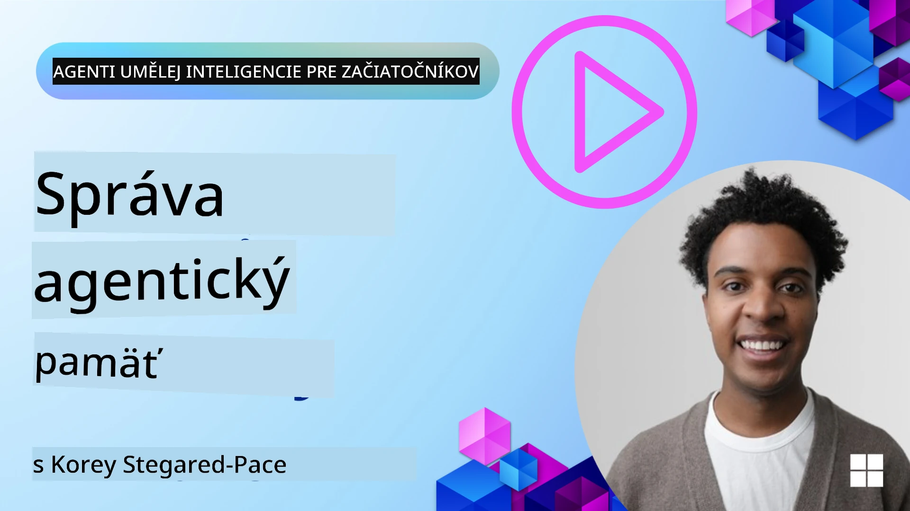

# Pamäť pre AI agentov 

Pri diskusii o jedinečných výhodách vytvárania AI agentov sa hlavne spomínajú dve veci: schopnosť volať nástroje na vykonávanie úloh a schopnosť zlepšovať sa v priebehu času. Pamäť je základom tvorby samoučiacich sa agentov, ktorí dokážu vytvárať lepšie skúsenosti pre našich používateľov.

V tejto lekcii sa pozrieme na to, čo pamäť znamená pre AI agentov a ako ju môžeme spravovať a využívať pre prospech našich aplikácií.

## Úvod

Táto lekcia pokrýva:

• **Pochopenie pamäte AI agenta**: Čo je pamäť a prečo je pre agentov nevyhnutná.

• **Implementácia a ukladanie pamäte**: Praktické metódy pridania pamäťových schopností do vašich AI agentov so zameraním na krátkodobú a dlhodobú pamäť.

• **Tvorba samoučiacich sa AI agentov**: Ako pamäť umožňuje agentom učiť sa z minulých interakcií a zlepšovať sa v priebehu času.

## Dostupné implementácie

Táto lekcia obsahuje dva komplexné tutoriály v jupyter notebookoch:

• **[13-agent-memory.ipynb](./13-agent-memory.ipynb)**: Implementuje pamäť pomocou Mem0 a Azure AI Search s Microsoft Agent Framework

• **[13-agent-memory-cognee.ipynb](./13-agent-memory-cognee.ipynb)**: Implementuje štruktúrovanú pamäť pomocou Cognee, automaticky vytvára znalostný graf podporený embeddingmi, vizualizuje graf a inteligentné vyhľadávanie

## Učebné ciele

Po absolvovaní tejto lekcie budete vedieť:

• **Rozlíšiť rôzne typy pamäte AI agentov**, vrátane pracovnej, krátkodobej a dlhodobej pamäte, ako aj špecializovaných foriem ako persona a epizodická pamäť.

• **Implementovať a spravovať krátkodobú a dlhodobú pamäť AI agentov** pomocou Microsoft Agent Framework, využívajúc nástroje ako Mem0, Cognee, Whiteboard pamäť a integrovať ich s Azure AI Search.

• **Pochopiť princípy samoučiacich AI agentov** a ako robustné systémy správy pamäte prispievajú k kontinuálnemu učeniu a adaptácii.

## Pochopenie pamäte AI agenta

V jadre, **pamäť pre AI agentov označuje mechanizmy, ktoré im umožňujú uchovávať a vyvolávať informácie**. Tieto informácie môžu byť konkrétne detaily o rozhovore, preferencie používateľa, minulé akcie alebo dokonca naučené vzory.

Bez pamäte sú AI aplikácie často bezstavové, čo znamená, že každá interakcia začína odznova. To vedie k opakujúcemu sa a frustrujúcemu používateľskému zážitku, kde agent „zabúda“ predchádzajúci kontext alebo preferencie.

### Prečo je pamäť dôležitá?

Inteligencia agenta úzko súvisí s jeho schopnosťou pripomínať si a využívať minulé informácie. Pamäť umožňuje agentom byť:

• **Reflexívne**: Učiť sa z minulých akcií a výsledkov.

• **Interaktívne**: Udržiavať kontext počas prebiehajúceho rozhovoru.

• **Proaktívne a Reaktívne**: Očakávať potreby alebo reagovať vhodne na základe historických údajov.

• **Autonómne**: Fungovať samostatnejšie čerpaním zo uloženého poznania.

Cieľom implementácie pamäte je urobiť agentov **spoľahlivejšími a schopnejšími**.

### Typy pamäte

#### Pracovná pamäť

Predstavte si ju ako kus škrabacieho papiera, ktorý agent používa počas jednej prebiehajúcej úlohy alebo myšlienkového procesu. Obsahuje bezprostredné informácie potrebné na vykonanie nasledujúceho kroku.

Pre AI agentov pracovná pamäť často zachytáva najrelevantnejšie informácie z rozhovoru, aj keď je celá história chatu dlhá alebo orezaná. Zameriava sa na extrakciu kľúčových prvkov ako požiadavky, návrhy, rozhodnutia a akcie.

**Príklad pracovnej pamäte**

V agentovi na rezerváciu cestovania môže pracovná pamäť zachytiť aktuálnu požiadavku používateľa, napríklad „Chcem rezervovať výlet do Paríža“. Táto konkrétna požiadavka je držaná v okamžitom kontexte agenta na usmernenie aktuálnej interakcie.

#### Krátkodobá pamäť

Tento typ pamäte uchováva informácie počas jednej konverzácie alebo relácie. Je to kontext aktuálneho chatu, vďaka ktorému môže agent odvolávať sa na predchádzajúce výmeny v dialógu.

V príkladoch Python SDK [Microsoft Agent Framework](https://github.com/microsoft/agent-framework) to zodpovedá `AgentSession`, vytvorenému pomocou `agent.create_session()`. Relácia je vstavanou krátkodobou pamäťou frameworku: udržiava kontext rozhovoru dostupný, kým sa tá istá relácia opätovne používa, ale tento kontext sa neukladá, keď relácia skončí alebo sa aplikácia reštartuje. Na fakty a preferencie, ktoré majú prežiť medzi reláciami, používajte dlhodobú pamäť, zvyčajne prostredníctvom databázy, vektorového indexu alebo iného perzistentného úložiska.

**Príklad krátkodobej pamäte**

Ak sa používateľ opýta „Koľko by stál let do Paríža?“ a potom nadviaže otázkou „A ubytovanie tam?“, krátkodobá pamäť zabezpečí, že agent vie, že „tam“ sa vzťahuje na „Paríž“ v rámci tej istej konverzácie.

#### Dlhodobá pamäť

Ide o informácie, ktoré pretrvávajú cez viaceré rozhovory alebo relácie. Umožňuje agentom pamätať si preferencie používateľa, historické interakcie alebo všeobecné poznatky počas dlhého obdobia. Je to dôležité pre personalizáciu.

**Príklad dlhodobej pamäte**

Dlhodobá pamäť môže ukladať informáciu, že „Ben má rád lyžovanie a outdoorové aktivity, obľubuje kávu s výhľadom na hory a chce sa vyhnúť pokročilým lyžiarskym zjazdovkám kvôli minulému zraneniu“. Tieto informácie, naučené z predchádzajúcich interakcií, ovplyvňujú odporúčania v budúcich cestovných plánovacích reláciách, čím sú veľmi personalizované.

#### Persona pamäť

Tento špecializovaný typ pamäte pomáha agentovi vyvinúť konzistentnú „osobnosť“ alebo „personu“. Umožňuje agentovi pamätať si detaily o sebe alebo o svojej zámernej úlohe, čím sú interakcie plynulejšie a zamerané.

**Príklad persona pamäte**

Ak je cestovný agent navrhnutý ako „expert na plánovanie lyžovania“, persona pamäť môže posilniť túto úlohu a ovplyvniť odpovede, aby boli v tóne a znalostiach experta.

#### Workflow/Epizodická pamäť

Táto pamäť ukladá sekvenciu krokov, ktoré agent počas zložitej úlohy vykonal, vrátane úspechov a neúspechov. Je to ako zapamätanie si konkrétnych „epizód“ alebo minulých skúseností, z ktorých sa agent môže učiť.

**Príklad epizodickej pamäte**

Ak sa agent pokúsil rezervovať konkrétny let, ale neúspešne kvôli nedostupnosti, epizodická pamäť môže zaznamenať túto neúspešnosť, čo agentovi umožní skúsiť alternatívne lety alebo informovať používateľa o probléme viac informovaným spôsobom pri ďalšom pokuse.

#### Pamäť entít

Tento druh pamäte zahŕňa extrahovanie a zapamätanie si konkrétnych entít (ako ľudia, miesta alebo veci) a udalostí z konverzácií. Umožňuje agentovi vytvoriť štruktúrované porozumenie kľúčových prvkov, o ktorých sa hovorilo.

**Príklad pamäte entít**

Z rozhovoru o minulom výlete môže agent vyextrahovať „Paríž“, „Eiffelova veža“ a „večera v reštaurácii Le Chat Noir“ ako entity. Pri budúcej interakcii by si agent mohol spomenúť na „Le Chat Noir“ a ponúknuť novú rezerváciu tam.

#### Štruktúrovaný RAG (Retrieval Augmented Generation)

Hoci RAG je širšia technika, „Štruktúrovaný RAG“ je vyzdvihnutý ako výkonná pamäťová technológia. Extrahuje husté, štruktúrované informácie z rôznych zdrojov (rozhovory, emaily, obrázky) a používa ich na zvýšenie presnosti, pripomenutia a rýchlosti reakcií. Na rozdiel od klasického RAG, ktorý sa spolieha iba na sémantickú podobnosť, Štruktúrovaný RAG pracuje s inherentnou štruktúrou informácií.

**Príklad štruktúrovaného RAG**

Namiesto iba zhodnotenia kľúčových slov môže Štruktúrovaný RAG parsovať detaily letu (cieľová destinácia, dátum, čas, letecká spoločnosť) z emailu a uložiť ich štruktúrovane. To umožňuje presné dotazy ako „Aký let som si rezervoval do Paríža v utorok?“

## Implementácia a ukladanie pamäte

Implementácia pamäte pre AI agentov zahŕňa systematický proces **správy pamäte**, ktorý obsahuje generovanie, ukladanie, vyhľadávanie, integráciu, aktualizáciu a dokonca aj „zabúdanie“ (alebo mazanie) informácií. Vyhľadávanie je obzvlášť kľúčovým aspektom.

### Špecializované pamäťové nástroje

#### Mem0

Jedným zo spôsobov, ako ukladať a spravovať pamäť agenta, je použiť špecializované nástroje ako Mem0. Mem0 funguje ako trvalá pamäťová vrstva, ktorá agentom umožňuje pripomínať si relevantné interakcie, ukladať používateľské preferencie a faktický kontext a učiť sa z úspechov a neúspechov v čase. Myšlienka je, že bezstavoví agenti sa zmenia na stavových.

Funguje cez **dvojfázový pamäťový proces: extrakcia a aktualizácia**. Najprv sú správy pridávané do vlákna agenta odosielané do služby Mem0, ktorá používa veľký jazykový model (LLM) na zhrnutie histórie rozhovoru a extrahovanie nových spomienok. Následne fáza aktualizácie riadená LLM určuje, či tieto pamäti pridať, upraviť alebo vymazať, pričom ich ukladá do hybridného dátového úložiska, ktoré môže zahŕňať vektorové, grafové a kľúč-hodnotové databázy. Tento systém podporuje rôzne typy pamäte a môže zahrnúť aj grafovú pamäť na správu vzťahov medzi entitami.

#### Cognee

Ďalším výkonným prístupom je využitie **Cognee**, open-source semantickej pamäte pre AI agentov, ktorá transformuje štruktúrované a neštruktúrované dáta do dotazovateľných znalostných grafov podporovaných embeddingmi. Cognee poskytuje **dvojitú architektúru úložiska** kombinujúcu vyhľadávanie vektorovej podobnosti s grafovými vzťahmi, umožňujúc agentom chápať nielen čo je podobné, ale ako sú koncepty navzájom prepojené.

Vyniká v **hybridnom vyhľadávaní**, ktoré spája vektorovú podobnosť, grafovú štruktúru a uvažovanie LLM - od surového vyhľadávania po otázky opierajúce sa o znalosť grafu. Systém udržiava **živú pamäť**, ktorá sa vyvíja a rastie, pričom zostáva dotazovateľnou ako jeden prepojený graf a podporuje krátkodobý kontext relácie i dlhodobú perzistentnú pamäť.

Tutoriál v notebooku Cognee ([13-agent-memory-cognee.ipynb](./13-agent-memory-cognee.ipynb)) demonštruje budovanie tejto jednotnej pamäťovej vrstvy, s praktickými príkladmi prijímania rôznych zdrojov dát, vizualizácie znalostného grafu a dotazovania s rôznymi vyhľadávacími stratégiami prispôsobenými potrebám konkrétneho agenta.

### Ukladanie pamäte pomocou RAG

Okrem špecializovaných pamäťových nástrojov ako Mem0 môžete využiť robustné vyhľadávacie služby ako **Azure AI Search ako backend pre ukladanie a vyhľadávanie pamätí**, najmä pre štruktúrovaný RAG.

To umožňuje podložiť odpovede agenta vlastnými dátami a zabezpečiť tak relevantnejšie a presnejšie odpovede. Azure AI Search možno použiť na ukladanie používateľských cestovateľských spomienok, produktových katalógov alebo iných odborových znalostí.

Azure AI Search podporuje funkcie ako **Štruktúrovaný RAG**, ktorý vyniká v extrakcii a vyhľadávaní hustých, štruktúrovaných informácií z veľkých datasetov ako história konverzácie, emaily alebo dokonca obrázky. To poskytuje „nadľudskú presnosť a pripomínanie“ v porovnaní s tradičným rozdelením textu a embeddingovými prístupmi.

## Tvorba samoučiacich sa AI agentov

Bežný postup pre samoučiace sa agentov zahŕňa zavedenie **„poznávacieho agenta“**. Tento samostatný agent sleduje hlavný rozhovor medzi používateľom a primárnym agentom. Jeho úlohou je:

1. **Identifikovať cenné informácie**: Určiť, či časť rozhovoru stojí za uloženie ako všeobecné poznanie alebo špecifická používateľská preferencia.

2. **Extrahovať a zhrnúť**: Destilovať podstatnú naučenú informáciu alebo preferenciu z rozhovoru.

3. **Uložiť do znalostnej bázy**: Trvalo uložiť tieto údaje, často do vektorovej databázy, aby boli neskôr dostupné.

4. **Rozšíriť budúce dopyty**: Keď používateľ začne nový dopyt, poznávací agent nájde relevantné uložené informácie a pridá ich k používateľovej výzve, čím poskytuje dôležitý kontext primárnemu agentovi (podobne ako RAG).

### Optimalizácie pamäte

• **Manažment latencie**: Aby sa zabránilo spomaleniu používateľských interakcií, môže sa najprv použiť lacnejší a rýchlejší model na rýchlu kontrolu toho, či je informácia vhodná na uloženie alebo vyhľadanie, pričom zložitejší proces extrakcie/vyhľadávania sa spustí len keď je to potrebné.

• **Údržba znalostnej bázy**: Pre rastúcu znalostnú bázu možno menej často používané informácie presunúť do „studenej archivácie“ na zníženie nákladov.

## Máte ďalšie otázky o pamäti agentov?

Pripojte sa na [Microsoft Foundry Discord](https://discord.com/invite/ATgtXmAS5D), aby ste sa stretli s ďalšími študentmi, zúčastnili sa konzultačných hodín a dostali odpovede na svoje otázky o AI agentech.

---

<!-- CO-OP TRANSLATOR DISCLAIMER START -->
**Vyhlásenie o zodpovednosti**:
Tento dokument bol preložený pomocou AI prekladateľskej služby [Co-op Translator](https://github.com/Azure/co-op-translator). Hoci sa snažíme o presnosť, vezmite prosím na vedomie, že automatické preklady môžu obsahovať chyby alebo nepresnosti. Pôvodný dokument v jeho natívnom jazyku by mal byť považovaný za autoritatívny zdroj. Pre kritické informácie sa odporúča profesionálny ľudský preklad. Nie sme zodpovední za žiadne nedorozumenia alebo nesprávne interpretácie vyplývajúce z použitia tohto prekladu.
<!-- CO-OP TRANSLATOR DISCLAIMER END -->