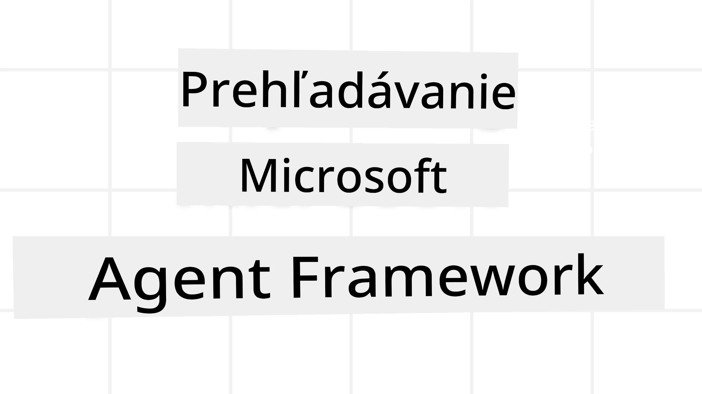
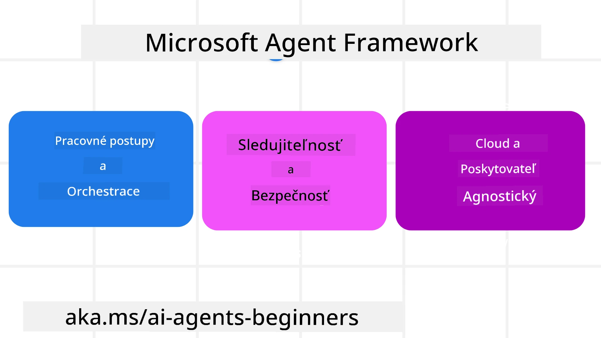
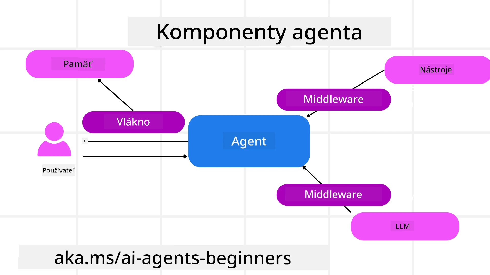

# Preskúmanie Microsoft Agent Framework



### Úvod

Táto lekcia pokryje:

- Pochopenie Microsoft Agent Framework: kľúčové vlastnosti a hodnota  
- Preskúmanie kľúčových konceptov Microsoft Agent Framework
- Pokročilé vzory MAF: pracovné toky, middleware a pamäť

## Ciele učenia

Po dokončení tejto lekcie budete vedieť:

- Vytvárať produkčne pripravené AI agentov pomocou Microsoft Agent Framework
- Použiť základné vlastnosti Microsoft Agent Framework vo vašich agentných prípadoch použitia
- Použiť pokročilé vzory vrátane pracovných tokov, middleware a observability

## Ukážky kódu

Ukážky kódu pre [Microsoft Agent Framework (MAF)](https://aka.ms/ai-agents-beginners/agent-framewrok) nájdete v tomto repozitári v súboroch `xx-python-agent-framework` a `xx-dotnet-agent-framework`.

## Pochopenie Microsoft Agent Framework



[Microsoft Agent Framework (MAF)](https://aka.ms/ai-agents-beginners/agent-framewrok) je jednotné rozhranie Microsoftu na tvorbu AI agentov. Ponúka flexibilitu na riešenie širokej škály agentných prípadov použitia, ktoré sa vyskytujú v produkčných aj výskumných prostrediach, vrátane:

- **Sekvenčnej orchestrácie agentov** v scenároch, kde sú potrebné krok za krokom pracovné toky.
- **Súčasnej orchestrácie** v scenároch, kde agenti musia dokončiť úlohy súčasne.
- **Orchestrácie skupinovej konverzácie** v scenároch, kde agenti môžu spolupracovať na jednej úlohe.
- **Orchestrácie odovzdávania** v scenároch, kde si agenti odovzdávajú úlohu, keď sú čiastočné úlohy dokončené.
- **Magnetickej orchestrácie** v scenároch, kde manažérsky agent vytvára a upravuje zoznam úloh a koordinuje podagentov na dokončenie úlohy.

Na zabezpečenie AI agentov v produkcii MAF tiež obsahuje funkcie na:

- **Observabilitu** prostredníctvom použitia OpenTelemetry, kde sa zaznamenáva každá akcia AI agenta vrátane vyvolania nástrojov, krokov orchestrácie, priebehu uvažovania a monitorovania výkonu cez Microsoft Foundry dashboardy.
- **Bezpečnosť** prostredníctvom natívneho hostenia agentov na Microsoft Foundry, ktoré zahŕňa bezpečnostné kontroly ako prístup založený na úlohách, spracovanie súkromných údajov a zabudovanú bezpečnosť obsahu.
- **Trvácnosť** keďže vlákna agentov a pracovné toky môžu byť pozastavené, obnovené a zotavené po chybách, čo umožňuje dlhšie bežiace procesy.
- **Kontrolu** keďže sú podporované pracovné toky s človekom v slučke, kde sú úlohy označené ako vyžadujúce schválenie človekom.

Microsoft Agent Framework sa tiež zameriava na interoperabilitu tým, že:

- **Je cloudovo nezávislý** - Agenti môžu bežať v kontajneroch, on-premise a cez viaceré rôzne cloudy.
- **Je poskytovateľsky nezávislý** - Agenti môžu byť vytváraní cez vaše preferované SDK vrátane Azure OpenAI a OpenAI.
- **Integruje otvorené štandardy** - Agenti môžu využívať protokoly ako Agent-to-Agent (A2A) a Model Context Protocol (MCP) na objavovanie a používanie iných agentov a nástrojov.
- **Pluginy a konektory** - Je možné vytvárať spojenia s dátovými a pamäťovými službami ako Microsoft Fabric, SharePoint, Pinecone a Qdrant.

Pozrime sa, ako sa tieto vlastnosti aplikujú na niektoré z kľúčových konceptov Microsoft Agent Framework.

## Kľúčové koncepty Microsoft Agent Framework

### Agenti



**Tvorba agentov**

Agenti sa vytvárajú definovaním inference služby (poskytovateľa LLM), 
sady inštrukcií, ktoré má AI agent nasledovať, a priradeným `name`:

```python
agent = AzureOpenAIChatClient(credential=AzureCliCredential()).create_agent( instructions="You are good at recommending trips to customers based on their preferences.", name="TripRecommender" )
```

Vyššie uvedené používa `Azure OpenAI`, ale agenti môžu byť vytváraní použitím rôznych služieb vrátane `Microsoft Foundry Agent Service`:

```python
AzureAIAgentClient(async_credential=credential).create_agent( name="HelperAgent", instructions="You are a helpful assistant." ) as agent
```

OpenAI `Responses`, `ChatCompletion` API

```python
agent = OpenAIResponsesClient().create_agent( name="WeatherBot", instructions="You are a helpful weather assistant.", )
```

```python
agent = OpenAIChatClient().create_agent( name="HelpfulAssistant", instructions="You are a helpful assistant.", )
```

alebo vzdialené agenti pomocou protokolu A2A:

```python
agent = A2AAgent( name=agent_card.name, description=agent_card.description, agent_card=agent_card, url="https://your-a2a-agent-host" )
```

**Spustenie agentov**

Agenti sa spúšťajú použitím metód `.run` alebo `.run_stream` pre ne-streamované alebo streamované odpovede.

```python
result = await agent.run("What are good places to visit in Amsterdam?")
print(result.text)
```

```python
async for update in agent.run_stream("What are the good places to visit in Amsterdam?"):
    if update.text:
        print(update.text, end="", flush=True)

```

Každé spustenie agenta môže tiež obsahovať možnosti na prispôsobenie parametrov, ako sú `max_tokens` použité agentom, `tools`, ktoré môže agent volať, a dokonca `model` sám použitý pre agenta.

To je užitočné v prípadoch, kde sú potrebné konkrétne modely alebo nástroje na splnenie úlohy používateľa.

**Nástroje**

Nástroje môžu byť definované pri vytváraní agenta:

```python
def get_attractions( location: Annotated[str, Field(description="The location to get the top tourist attractions for")], ) -> str: """Get the top tourist attractions for a given location.""" return f"The top attractions for {location} are." 


# Pri priamom vytváraní ChatAgenta

agent = ChatAgent( chat_client=OpenAIChatClient(), instructions="You are a helpful assistant", tools=[get_attractions]

```

a tiež pri spustení agenta:

```python

result1 = await agent.run( "What's the best place to visit in Seattle?", tools=[get_attractions] # Nástroj poskytnutý iba pre tento beh )
```

**Vlákna agentov**

Vlákna agentov sa používajú na spracovanie viacstupňových rozhovorov. Vlákna môžu byť vytvorené buď:

- Použitím `get_new_thread()`, čo umožňuje, aby sa vlákno ukladalo v priebehu času
- Automatickým vytvorením vlákna pri spustení agenta, ktoré trvá iba počas aktuálneho spustenia.

Na vytvorenie vlákna vyzerá kód takto:

```python
# Vytvorte nový vláknový proces.
thread = agent.get_new_thread() # Spustite agenta s vláknom.
response = await agent.run("Hello, I am here to help you book travel. Where would you like to go?", thread=thread)

```

Vlákno môžete následne serializovať na uloženie pre neskoršie použitie:

```python
# Vytvorte nový vlákno.
thread = agent.get_new_thread() 

# Spustite agenta s vláknom.

response = await agent.run("Hello, how are you?", thread=thread) 

# Serializujte vlákno pre ukladanie.

serialized_thread = await thread.serialize() 

# Deserializujte stav vlákna po načítaní z úložiska.

resumed_thread = await agent.deserialize_thread(serialized_thread)
```

**Agent Middleware**

Agenti spolupracujú s nástrojmi a LLM, aby dokončili úlohy používateľa. V určitých scenároch chceme vykonať alebo sledovať interakcie medzi nimi. Agent middleware nám umožňuje toto prostredníctvom:

*Funkčného middleware*

Tento middleware nám umožňuje vykonať akciu medzi agentom a funkciou/nástrojom, ktorý bude volať. Príkladom použitia je, keď chcete na volanie funkcie zaznamenať nejaké informácie.

V nižšie uvedenom kóde `next` definuje, či sa má zavolať ďalší middleware alebo skutočná funkcia.

```python
async def logging_function_middleware(
    context: FunctionInvocationContext,
    next: Callable[[FunctionInvocationContext], Awaitable[None]],
) -> None:
    """Function middleware that logs function execution."""
    # Predspracovanie: Zaznamenať pred vykonaním funkcie
    print(f"[Function] Calling {context.function.name}")

    # Pokračovať na ďalší middleware alebo vykonanie funkcie
    await next(context)

    # Postspracovanie: Zaznamenať po vykonaní funkcie
    print(f"[Function] {context.function.name} completed")
```

*Chat middleware*

Tento middleware umožňuje vykonať alebo zaznamenať akciu medzi agentom a požiadavkami medzi LLM.

Obsahuje dôležité informácie ako sú `messages`, ktoré sa posielajú AI službe.

```python
async def logging_chat_middleware(
    context: ChatContext,
    next: Callable[[ChatContext], Awaitable[None]],
) -> None:
    """Chat middleware that logs AI interactions."""
    # Predspracovanie: Zaznamenajte pred volaním AI
    print(f"[Chat] Sending {len(context.messages)} messages to AI")

    # Pokračujte k ďalšiemu middleware alebo AI službe
    await next(context)

    # Post-processing: Zaznamenajte po odpovedi AI
    print("[Chat] AI response received")

```

**Agent Memory**

Ako bolo pokryté v lekcii `Agentic Memory`, pamäť je dôležitým prvkom na to, aby agent mohol pracovať cez rôzne kontexty. MAF ponúka niekoľko rôznych typov pamätí:

*Pamäť v pamäti (In-Memory Storage)*

Ide o pamäť uloženú vo vláknach počas behu aplikácie.

```python
# Vytvorte nový vlákno.
thread = agent.get_new_thread() # Spustite agenta s vláknom.
response = await agent.run("Hello, I am here to help you book travel. Where would you like to go?", thread=thread)
```

*Trvalé správy*

Táto pamäť sa používa pri ukladání histórie konverzácií cez rôzne relácie. Je definovaná pomocou `chat_message_store_factory`:

```python
from agent_framework import ChatMessageStore

# Vytvorte vlastné úložisko správ
def create_message_store():
    return ChatMessageStore()

agent = ChatAgent(
    chat_client=OpenAIChatClient(),
    instructions="You are a Travel assistant.",
    chat_message_store_factory=create_message_store
)

```

*Dynamická pamäť*

Táto pamäť sa pridáva do kontextu pred spustením agentov. Tieto pamäte môžu byť uložené v externých službách ako mem0:

```python
from agent_framework.mem0 import Mem0Provider

# Používanie Mem0 pre pokročilé pamäťové schopnosti
memory_provider = Mem0Provider(
    api_key="your-mem0-api-key",
    user_id="user_123",
    application_id="my_app"
)

agent = ChatAgent(
    chat_client=OpenAIChatClient(),
    instructions="You are a helpful assistant with memory.",
    context_providers=memory_provider
)

```

**Agent Observability**

Observabilita je dôležitá pre budovanie spoľahlivých a udržiavateľných agentných systémov. MAF integruje OpenTelemetry na poskytovanie trasovania a metrov pre lepšiu observabilitu.

```python
from agent_framework.observability import get_tracer, get_meter

tracer = get_tracer()
meter = get_meter()
with tracer.start_as_current_span("my_custom_span"):
    # urob niečo
    pass
counter = meter.create_counter("my_custom_counter")
counter.add(1, {"key": "value"})
```

### Pracovné toky

MAF ponúka pracovné toky, ktoré sú preddefinované kroky na dokončenie úlohy a zahŕňajú AI agentov ako komponenty v týchto krokoch.

Pracovné toky sa skladajú z rôznych komponentov, ktoré umožňujú lepšiu kontrolu toku. Pracovné toky tiež umožňujú **multi-agent orchestráciu** a **checkpointing** na uloženie stavov pracovného toku.

Základné komponenty pracovného toku sú:

**Executor-y**

Executor-y prijímajú vstupné správy, vykonávajú pridelené úlohy a potom produkujú výstupnú správu. Tým posúvajú pracovný tok vpred k dokončeniu väčšej úlohy. Executor-y môžu byť buď AI agent alebo vlastná logika.

**Hrany (Edges)**

Hrany sa používajú na definovanie toku správ v pracovnom toku. Môžu byť:

*Priame hrany* - Jednoduché jeden-na-jeden spojenia medzi executor-mi:

```python
from agent_framework import WorkflowBuilder

builder = WorkflowBuilder()
builder.add_edge(source_executor, target_executor)
builder.set_start_executor(source_executor)
workflow = builder.build()
```

*Podmienené hrany* - Aktivované po splnení určitej podmienky. Napríklad, keď hotelové izby nie sú dostupné, executor môže navrhnúť iné možnosti.

*Switch-case hrany* - Smerujú správy k rôznym executor-om na základe definovaných podmienok. Napríklad, ak cestujúci zákazník má prioritný prístup a jeho úlohy budú spracované iným pracovným tokom.

*Fan-out hrany* - Posiela jednu správu viacerým cieľom.

*Fan-in hrany* - Zhromaždia viacero správ od rôznych executor-ov a pošlú ich jednému cieľu.

**Udalosti**

Na lepšiu observabilitu pracovných tokov MAF ponúka zabudované udalosti pre vykonávanie vrátane:

- `WorkflowStartedEvent`  - Začiatok vykonávania pracovného toku
- `WorkflowOutputEvent` - Pracovný tok generuje výstup
- `WorkflowErrorEvent` - Pracovný tok narazí na chybu
- `ExecutorInvokeEvent`  - Executor začína spracovávanie
- `ExecutorCompleteEvent`  -  Executor dokončuje spracovanie
- `RequestInfoEvent` - Bola vydaná požiadavka

## Pokročilé vzory MAF

Sekcie vyššie pokrývajú kľúčové koncepty Microsoft Agent Framework. Ako budete tvoriť zložitejších agentov, tu sú niektoré pokročilé vzory na zváženie:

- **Kombinácia middleware**: Reťazenie viacerých middleware handlerov (logovanie, autentifikácia, obmedzovanie rýchlosti) pomocou funkčného a chat middleware pre detailnú kontrolu správania agentov.
- **Checkpointing pracovných tokov**: Použitie udalostí pracovného toku a serializácia na uloženie a obnovenie dlhodobých procesov agentov.
- **Dynamický výber nástrojov**: Kombinovanie RAG nad popismi nástrojov s registráciou nástrojov v MAF na prezentovanie len relevantných nástrojov pre konkrétnu požiadavku.
- **Viacagentné odovzdávanie**: Použitie hrán pracovných tokov a podmieneného smerovania na orchestráciu odovzdávania medzi špecializovanými agentmi.

## Ukážky kódu

Ukážky kódu pre Microsoft Agent Framework nájdete v tomto repozitári v súboroch `xx-python-agent-framework` a `xx-dotnet-agent-framework`.

## Máte ďalšie otázky o Microsoft Agent Framework?

Pridajte sa do [Microsoft Foundry Discord](https://aka.ms/ai-agents/discord), aby ste sa stretli s ďalšími študentmi, zúčastnili sa konzultačných hodín a získali odpovede na vaše otázky o AI Agentocht.

---

<!-- CO-OP TRANSLATOR DISCLAIMER START -->
**Vyhlásenie o zodpovednosti**:
Tento dokument bol preložený pomocou AI prekladateľskej služby [Co-op Translator](https://github.com/Azure/co-op-translator). Aj keď sa snažíme o presnosť, berte prosím na vedomie, že automatizované preklady môžu obsahovať chyby alebo nepresnosti. Originálny dokument v jeho pôvodnom jazyku by mal byť považovaný za autoritatívny zdroj. Pre kritické informácie odporúčame profesionálny ľudský preklad. Nie sme zodpovední za akékoľvek nepochopenia alebo nesprávne interpretácie vyplývajúce z použitia tohto prekladu.
<!-- CO-OP TRANSLATOR DISCLAIMER END -->