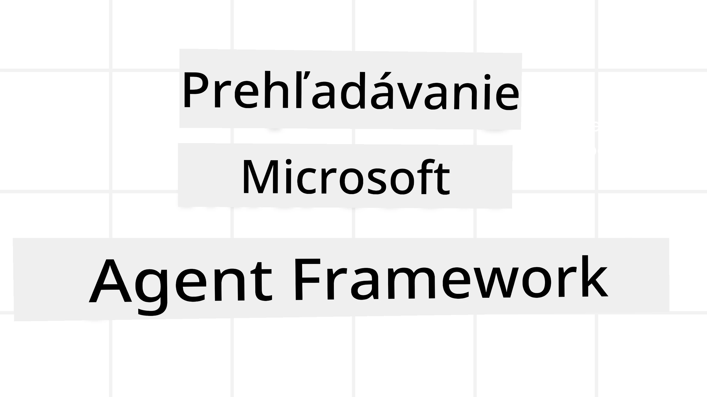
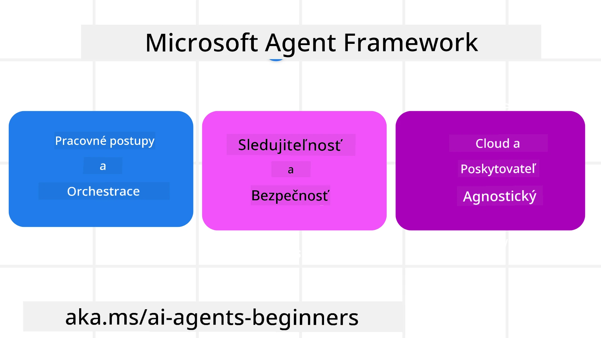
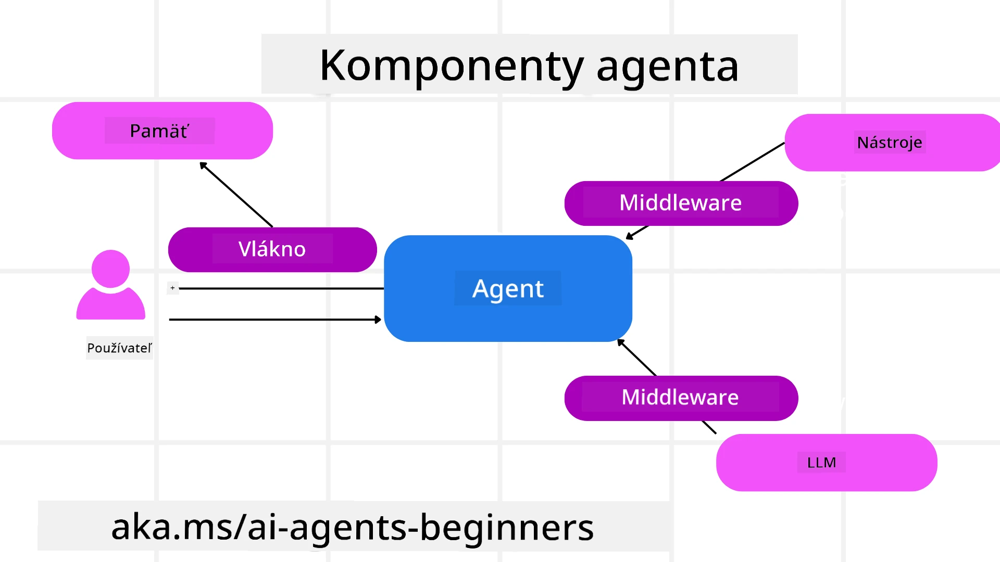

# Preskúmanie Microsoft Agent Framework



### Úvod

Táto lekcia pokryje:

- Pochopenie Microsoft Agent Framework: kľúčové vlastnosti a hodnota  
- Preskúmanie kľúčových konceptov Microsoft Agent Framework
- Pokročilé vzory MAF: pracovné postupy, middleware a pamäť

## Ciele učenia

Po dokončení tejto lekcie budete vedieť:

- Vytvárať produkčne pripravených AI agentov pomocou Microsoft Agent Framework
- Použiť základné vlastnosti Microsoft Agent Framework pre vaše agentné prípady použitia
- Používať pokročilé vzory vrátane pracovných postupov, middleware a pozorovateľnosti

## Vzorky kódu

Vzorky kódu pre [Microsoft Agent Framework (MAF)](https://aka.ms/ai-agents-beginners/agent-framework) nájdete v tomto repozitári v súboroch `xx-python-agent-framework` a `xx-dotnet-agent-framework`.

## Pochopenie Microsoft Agent Framework



[Microsoft Agent Framework (MAF)](https://aka.ms/ai-agents-beginners/agent-framework) je jednotný framework Microsoftu na tvorbu AI agentov. Ponúka flexibilitu na riešenie širokej škály agentných prípadov použitia, ktoré sa vyskytujú v produkčnom aj výskumnom prostredí, vrátane:

- **Sekvenčná orchestrácia agentov** v scenároch, kde sú potrebné postupné pracovné postupy.
- **Súbežná orchestrácia** v scenároch, kde agenti potrebujú vykonať úlohy súčasne.
- **Orchestrácia skupinového chatu** v scenároch, kde agenti môžu spolupracovať na jednej úlohe.
- **Orchestrácia predania úlohy** v scenároch, kde agenti odovzdávajú úlohu jeden druhému po dokončení podúloh.
- **Magnetická orchestrácia** v scenároch, kde manažér agent vytvára a upravuje zoznam úloh a riadi koordináciu podagentov na dokončenie úlohy.

Pre doručenie AI agentov do produkcie MAF taktiež zahŕňa funkcie pre:

- **Pozorovateľnosť** pomocou OpenTelemetry, kde každá akcia AI agenta vrátane volania nástrojov, orchestrácie krokov, toku uvažovania a monitorovania výkonu sa sleduje prostredníctvom panelov Microsoft Foundry.
- **Bezpečnosť** prostredníctvom natívneho hostovania agentov na Microsoft Foundry, ktoré zahŕňa bezpečnostné kontroly, ako sú prístup založený na roliach, správa súkromných údajov a zabudovaná bezpečnosť obsahu.
- **Trvácnosť** pretože vlákna a pracovné postupy agentov môžu byť pozastavené, obnovené a zotavené po chybe, čo umožňuje dlhšie bežiace procesy.
- **Kontrola** podporou pracovných postupov s človekom v slučke, kde sú úlohy označené ako vyžadujúce ľudské schválenie.

Microsoft Agent Framework sa tiež zameriava na interoperabilitu tým, že:

- **Je nezávislý od cloudu** - Agentov je možné spúšťať v kontajneroch, on-premise aj naprieč rôznymi cloudmi.
- **Je nezávislý od poskytovateľa** - Agentov môžete vytvárať cez preferovaný SDK vrátane Azure OpenAI a OpenAI.
- **Integruje otvorené štandardy** - Agentov využívajú protokoly ako Agent-to-Agent (A2A) a Model Context Protocol (MCP) na objavovanie a používanie iných agentov a nástrojov.
- **Pluginy a konektory** - Možné sú pripojenia k dátovým a pamäťovým službám ako Microsoft Fabric, SharePoint, Pinecone a Qdrant.

Pozrime sa, ako sa tieto funkcie aplikujú na niektoré z kľúčových konceptov Microsoft Agent Framework.

## Kľúčové koncepty Microsoft Agent Framework

### Agenti



**Vytváranie agentov**

Vytvorenie agenta sa vykonáva definovaním inferenčnej služby (LLM poskytovateľ), sady inštrukcií, ktoré má AI agent dodržiavať, a priradeným `name`:

```python
agent = AzureOpenAIChatClient(credential=AzureCliCredential()).create_agent( instructions="You are good at recommending trips to customers based on their preferences.", name="TripRecommender" )
```

Vyššie je použitý `Azure OpenAI`, ale agenti môžu byť vytvorení aj pomocou rôznych služieb, vrátane `Microsoft Foundry Agent Service`:

```python
AzureAIAgentClient(async_credential=credential).create_agent( name="HelperAgent", instructions="You are a helpful assistant." ) as agent
```

OpenAI `Responses`, `ChatCompletion` API

```python
agent = OpenAIResponsesClient().create_agent( name="WeatherBot", instructions="You are a helpful weather assistant.", )
```

```python
agent = OpenAIChatClient().create_agent( name="HelpfulAssistant", instructions="You are a helpful assistant.", )
```

alebo [MiniMax](https://platform.minimaxi.com/), ktorý poskytuje kompatibilné API s OpenAI s veľkými kontextovými oknami (až 204K tokenov):

```python
agent = OpenAIChatClient(base_url="https://api.minimax.io/v1", api_key=os.environ["MINIMAX_API_KEY"], model_id="MiniMax-M3").create_agent( name="HelpfulAssistant", instructions="You are a helpful assistant.", )
```

alebo vzdialení agenti pomocou protokolu A2A:

```python
agent = A2AAgent( name=agent_card.name, description=agent_card.description, agent_card=agent_card, url="https://your-a2a-agent-host" )
```

**Spustenie agentov**

Agenti sa spúšťajú pomocou metód `.run` alebo `.run_stream` pre ne-streamované alebo streamované odpovede.

```python
result = await agent.run("What are good places to visit in Amsterdam?")
print(result.text)
```

```python
async for update in agent.run_stream("What are the good places to visit in Amsterdam?"):
    if update.text:
        print(update.text, end="", flush=True)

```

Každé spustenie agenta môže tiež obsahovať možnosti na prispôsobenie parametrov, ako je `max_tokens` používaných agentom, `tools`, ktoré agent môže volať, alebo dokonca samotný `model` použitý agentom.

To je užitočné v prípadoch, kde sú potrebné špecifické modely alebo nástroje na dokončenie používateľovej úlohy.

**Nástroje**

Nástroje môžu byť definované pri definovaní agenta:

```python
def get_attractions( location: Annotated[str, Field(description="The location to get the top tourist attractions for")], ) -> str: """Get the top tourist attractions for a given location.""" return f"The top attractions for {location} are." 


# Pri priamom vytváraní ChatAgent

agent = ChatAgent( chat_client=OpenAIChatClient(), instructions="You are a helpful assistant", tools=[get_attractions]

```

ale aj pri spustení agenta:

```python

result1 = await agent.run( "What's the best place to visit in Seattle?", tools=[get_attractions] # Nástroj poskytnutý iba pre tento beh )
```

**Vlákna agentov**

Vlákna agentov sa používajú na spracovanie viackolových konverzácií. Vlákna môžu byť vytvorené buď:

- Použitím `get_new_thread()`, čo umožňuje uložiť vlákno v čase
- Automatickým vytvorením vlákna pri spustení agenta, ktoré trvá iba počas aktuálneho spustenia.

Na vytvorenie vlákna vyzerá kód takto:

```python
# Vytvorte nový vlákno.
thread = agent.get_new_thread() # Spustite agenta s vláknom.
response = await agent.run("Hello, I am here to help you book travel. Where would you like to go?", thread=thread)

```

Vlákno je možné serializovať a uložiť pre neskoršie použitie:

```python
# Vytvorte nový vlákno.
thread = agent.get_new_thread() 

# Spustite agenta vo vlákne.

response = await agent.run("Hello, how are you?", thread=thread) 

# Serializovať vlákno na uloženie.

serialized_thread = await thread.serialize() 

# Deserializujte stav vlákna po načítaní z úložiska.

resumed_thread = await agent.deserialize_thread(serialized_thread)
```

**Middleware agentov**

Agenti interagujú s nástrojmi a LLM na dokončenie používateľských úloh. V určitých scenároch chceme medzi týmito interakciami vykonávať alebo zaznamenávať akcie. Middleware agentov nám to umožňuje pomocou:

*Middleware funkcie*

Táto middleware umožňuje vykonať akciu medzi agentom a funkciou/nástrojom, ktorý bude volať. Príklad použitia je vykonanie logovania pri volaní funkcie.

V kóde nižšie `next` definuje, či sa má volať ďalší middleware alebo samotná funkcia.

```python
async def logging_function_middleware(
    context: FunctionInvocationContext,
    next: Callable[[FunctionInvocationContext], Awaitable[None]],
) -> None:
    """Function middleware that logs function execution."""
    # Predspracovanie: Záznam pred vykonaním funkcie
    print(f"[Function] Calling {context.function.name}")

    # Pokračovať na ďalší middleware alebo vykonanie funkcie
    await next(context)

    # Popspracovanie: Záznam po vykonaní funkcie
    print(f"[Function] {context.function.name} completed")
```

*Middleware chatu*

Táto middleware umožňuje vykonať alebo zaznamenať akciu medzi agentom a požiadavkami medzi LLM.

Obsahuje dôležité informácie ako `messages`, ktoré sa odosielajú AI službe.

```python
async def logging_chat_middleware(
    context: ChatContext,
    next: Callable[[ChatContext], Awaitable[None]],
) -> None:
    """Chat middleware that logs AI interactions."""
    # Predspracovanie: Záznam pred volaním AI
    print(f"[Chat] Sending {len(context.messages)} messages to AI")

    # Pokračovať na ďalší middleware alebo AI službu
    await next(context)

    # Póspracovanie: Záznam po odpovedi AI
    print("[Chat] AI response received")

```

**Pamäť agentov**

Ako bolo vysvetlené v lekcii `Agentic Memory`, pamäť je dôležitým prvkom umožňujúcim agentovi pracovať s rôznymi kontextami. MAF ponúka niekoľko typov pamätí:

*Pamäť v rámci procesu*

Pamäť uložená vo vláknach počas behu aplikácie.

```python
# Vytvorte nový vlákno.
thread = agent.get_new_thread() # Spustite agenta s vláknom.
response = await agent.run("Hello, I am here to help you book travel. Where would you like to go?", thread=thread)
```

*Trvalé správy*

Táto pamäť sa používa na ukladanie histórie konverzácií medzi rôznymi reláciami. Definuje sa pomocou `chat_message_store_factory`:

```python
from agent_framework import ChatMessageStore

# Vytvorte vlastné úložisko správ
def create_message_store():
    return ChatMessageStore()

agent = ChatAgent(
    chat_client=OpenAIChatClient(),
    instructions="You are a Travel assistant.",
    chat_message_store_factory=create_message_store
)

```

*Dynamická pamäť*

Táto pamäť sa pridáva do kontextu pred spustením agentov. Tieto pamäte môžu byť uložené v externých službách, napríklad mem0:

```python
from agent_framework.mem0 import Mem0Provider

# Použitie Mem0 pre pokročilé pamäťové schopnosti
memory_provider = Mem0Provider(
    api_key="your-mem0-api-key",
    user_id="user_123",
    application_id="my_app"
)

agent = ChatAgent(
    chat_client=OpenAIChatClient(),
    instructions="You are a helpful assistant with memory.",
    context_providers=memory_provider
)

```

**Pozorovateľnosť agentov**

Pozorovateľnosť je dôležitá pre vytváranie spoľahlivých a udržiavateľných agentných systémov. MAF sa integruje s OpenTelemetry na poskytovanie trasovania a metrík pre lepšiu pozorovateľnosť.

```python
from agent_framework.observability import get_tracer, get_meter

tracer = get_tracer()
meter = get_meter()
with tracer.start_as_current_span("my_custom_span"):
    # urobiť niečo
    pass
counter = meter.create_counter("my_custom_counter")
counter.add(1, {"key": "value"})
```

### Pracovné postupy

MAF ponúka pracovné postupy, ktoré sú preddefinované kroky na dokončenie úlohy a ako súčasť týchto krokov zahŕňajú AI agentov.

Pracovné postupy sa skladajú z rôznych komponentov, ktoré umožňujú lepšiu kontrolu toku. Tiež umožňujú **orchestráciu viacerých agentov** a **checkpointing** na uloženie stavov pracovného postupu.

Základné komponenty pracovného postupu sú:

**Výkonníky (Executors)**

Výkonníci prijímajú vstupné správy, vykonávajú pridelené úlohy a potom vytvárajú výstupné správy. Tým posúvajú pracovný postup vpred k dokončeniu väčšej úlohy. Výkonníci môžu byť AI agenti alebo vlastná logika.

**Hrany (Edges)**

Hrany sa používajú na definovanie toku správ v pracovnom postupe. Môžu byť:

*Priame hrany* - Jednoduché spojenia jeden ku jednému medzi výkonníkmi:

```python
from agent_framework import WorkflowBuilder

builder = WorkflowBuilder()
builder.add_edge(source_executor, target_executor)
builder.set_start_executor(source_executor)
workflow = builder.build()
```

*Podmienečné hrany* - Aktivované po splnení určitej podmienky. Napríklad, keď nie sú dostupné hotelové izby, výkonník môže navrhnúť iné možnosti.

*Prepínač-case hrany* - Smerujú správy k rôznym výkonníkom na základe definovaných podmienok. Napríklad, ak má cestujúci prioritný prístup, jeho úlohy budú spracované iným pracovným tokom.

*Fan-out hrany* - Odošlú jednu správu viacerým cieľom.

*Fan-in hrany* - Zhromaždia viac správ z rôznych výkonníkov a odošlú ich jednému cieľu.

**Udalosti**

Na lepšiu pozorovateľnosť pracovných postupov MAF poskytuje zabudované udalosti pre vykonávanie vrátane:

- `WorkflowStartedEvent`  - Začína sa vykonávanie pracovného postupu
- `WorkflowOutputEvent` - Pracovný postup vytvára výstup
- `WorkflowErrorEvent` - Pracovný postup narazí na chybu
- `ExecutorInvokeEvent`  - Výkonník začína spracovanie
- `ExecutorCompleteEvent`  -  Výkonník dokončuje spracovanie
- `RequestInfoEvent` - Vydaná je požiadavka

## Pokročilé vzory MAF

Vyššie uvedené časti pokrývajú kľúčové koncepty Microsoft Agent Framework. Pri tvorbe zložitejších agentov zvážte nasledujúce pokročilé vzory:

- **Kompózia middleware**: Reťazenie viacerých middleware handlerov (logovanie, autentifikácia, obmedzovanie rýchlosti) pomocou funkčného a chat middleware pre detailnú kontrolu správania agenta.
- **Checkpointing pracovných postupov**: Použitie udalostí pracovných postupov a serializácie na uloženie a obnovenie dlhšie bežiacich procesov agentov.
- **Dynamický výber nástrojov**: Kombinácia RAG nad popismi nástrojov s registráciou nástrojov v MAF na prezentovanie len relevantných nástrojov pre dopyt.
- **Predávanie medzi viacerými agentmi**: Použitie hran pracovných postupov a podmieneného smerovania na orchestráciu predávania medzi špecializovanými agentmi.

## Vzorky kódu

Vzorky kódu pre Microsoft Agent Framework nájdete v tomto repozitári v súboroch `xx-python-agent-framework` a `xx-dotnet-agent-framework`.

## Máte ďalšie otázky o Microsoft Agent Framework?

Pripojte sa na [Microsoft Foundry Discord](https://discord.com/invite/ATgtXmAS5D), aby ste sa stretli s ostatnými študentmi, zúčastnili sa hodín otvorených dverí a získali odpovede na svoje otázky o AI agentoch.

---

<!-- CO-OP TRANSLATOR DISCLAIMER START -->
**Vyhlásenie o zodpovednosti**:
Tento dokument bol preložený pomocou AI prekladateľskej služby [Co-op Translator](https://github.com/Azure/co-op-translator). Hoci sa snažíme o presnosť, vezmite prosím na vedomie, že automatické preklady môžu obsahovať chyby alebo nepresnosti. Pôvodný dokument v jeho natívnom jazyku by mal byť považovaný za autoritatívny zdroj. Pre kritické informácie sa odporúča profesionálny ľudský preklad. Nie sme zodpovední za žiadne nedorozumenia alebo nesprávne interpretácie vyplývajúce z použitia tohto prekladu.
<!-- CO-OP TRANSLATOR DISCLAIMER END -->