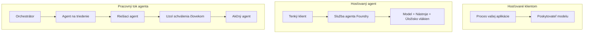
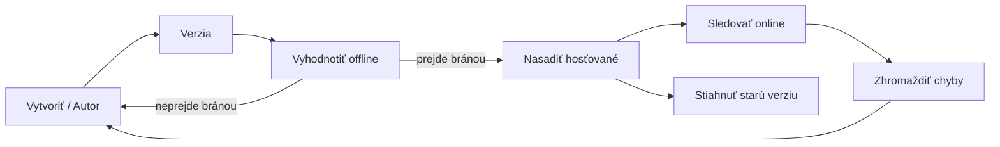
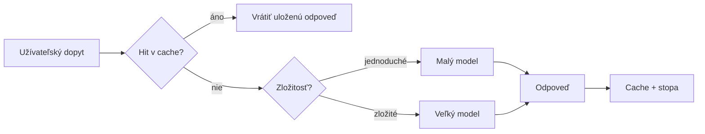
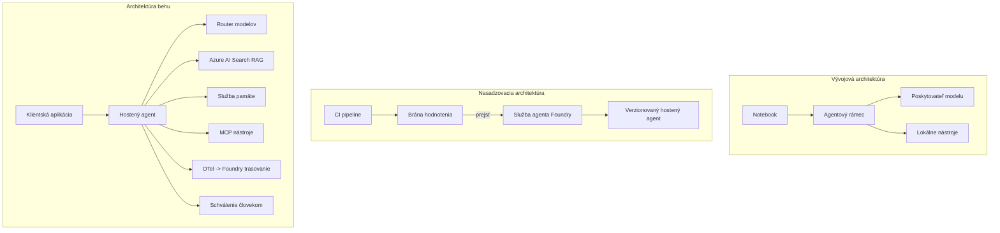

# Nasadzovanie škálovateľných agentov pomocou Microsoft Foundry


Zatiaľ ste v kurze vytvorili agentov, ktorí bežia na vašom notebooku, v rámci poznámkového bloku, ovládaní pomocou `az login` a niekoľkých premenných prostredia. To je presne správny spôsob, ako sa učiť. Nie je to však správny spôsob, ako prevádzkovať agenta, na ktorom závisia tisíce zákazníkov o 3 hodine ráno.

Táto lekcia sa týka rozdielu medzi „funguje to na mojom počítači“ a „funguje to spoľahlivo a cenovo dostupne v produkcii.“ Tento rozdiel zacielime pomocou **Microsoft Foundry** a **Microsoft Foundry Agent Service**, a urobíme to vytvorením skutočného zákazníckeho podporného agenta, ktorý má nástroje, vyhľadávanie, pamäť, hodnotenie a monitoring.

## Úvod

Táto lekcia pokrýva:

- Rozdiel medzi **prototypovým agentom** a **nasadeným agentom** a prečo je prechod väčšinou o všetkom, čo je *okolo* modelu.
- **Vzory nasadenia** agentov: hosťovaný na klientovi, hosťovaný ako služba (Hosted Agents) a orchestrácia pracovného toku.
- **Životný cyklus agenta** na Microsoft Foundry — vytvorenie, verzovanie, nasadenie, hodnotenie, sledovanie, vyradenie.
- **Stratégie škálovania**: smerovanie modelov, ukladanie do cache, súbežnosť a bezstavový dizajn.
- **Pozorovateľnosť** s OpenTelemetry a trasovaním Foundry.
- **Optimalizácia nákladov** prostredníctvom výberu modelu, smerovania a hodnotiacich brán.
- **Podnikoví zástupcovia**: správa, ľudské schválenie a bezpečné prevádzkovanie MCP serverov v produkcii.

## Ciele učenia

Po dokončení tejto lekcie budete vedieť:

- Vybrať správny vzor nasadenia pre danú záťaž agenta.
- Nasadiť agenta do Microsoft Foundry Agent Service tak, aby bol verzovaný, spravovaný a pozorovateľný.
- Instrumentovať agenta pre trasovanie a prepojiť hodnotiaci proces, ktorý beží pred každým vydaním.
- Aplikovať smerovanie modelu a ukladanie do cache na udržanie latencie a nákladov pod kontrolou pri škálovaní.
- Pridať bránu ľudského schválenia pre rizikové akcie a integrovať MCP server bezpečne v produkcii.

## Predpoklady

Táto lekcia predpokladá, že ste absolvovali predchádzajúce lekcie a rozumiete:

- Vytváraniu agentov s pomocou [Microsoft Agent Framework](../14-microsoft-agent-framework/README.md) (Lekcia 14).
- [Používaniu nástrojov](../04-tool-use/README.md) (Lekcia 4) a [Agentic RAG](../05-agentic-rag/README.md) (Lekcia 5).
- [Agent Memory](../13-agent-memory/README.md) (Lekcia 13) a [Agentic Protocols / MCP](../11-agentic-protocols/README.md) (Lekcia 11).
- [Pozorovateľnosti a hodnotení](../10-ai-agents-production/README.md) (Lekcia 10) — táto lekcia na ňu priamo nadväzuje.

Tiež budete potrebovať:

- **Azure predplatné** a **Microsoft Foundry projekt** s aspoň jedným nasadeným modelom pre chat.
- Azure CLI autentifikované (`az login`).
- Python 3.12+ a balíky v repozitári [`requirements.txt`](../../../requirements.txt).

## Od prototypu k produkcii: Čo sa vlastne mení

Prototypový agent a produkčný agent zdieľajú rovnakú základnú slučku — rozumovanie, volanie nástrojov, odpoveď. Čo sa mení, je všetko okolo tejto slučky. Model tvorí možno 20 % produkčného agenta; zvyšných 80 % je operačný základ.

| Obava | Prototyp | Produkcia |
| --- | --- | --- |
| **Hosťovanie** | Beží vo vašom poznámkovom bloku | Beží ako hosťovaná služba, verzovaná a postupne nasadzovaná |
| **Identita** | váš token z `az login` | Spravovaná identita s obmedzeným RBAC |
| **Stav** | V pamäti, stratený po reštarte | Externý (uloženie vlákien, servis pamäte) |
| **Zlyhanie** | Vidíte trasovanie chýb | Opakované pokusy, záložné mechanizmy, dead-letter, upozornenia |
| **Náklady** | "Je to len pár centov" | Sleduje sa na požiadavku, smeruje sa, kešuje sa, rozpočtuje sa |
| **Kvalita** | Pozriete si výstup | Automaticky hodnotené pred každým vydaním |
| **Dôvera** | Schválite každú akciu | Politika + človek v slučke pre rizikové akcie |

Majte túto tabuľku na pamäti. Každá sekcia nižšie sa vzťahuje na jeden riadok.

## Vzory nasadenia agentov

Existujú tri vzory, ktoré často použijete v kombinácii.

### 1. Agenti hosťovaní na klientoch

Agent objekt žije vo *vašom* aplikačnom procese. Váš kód volá poskytovateľa modelu priamo; rozumová slučka beží vo vašej službe. To je to, čo ste robili v každej predchádzajúcej lekcii.

- **Použite, keď** potrebujete plnú kontrolu nad slučkou, vlastný middleware alebo integrujete agenta do existujúceho backendu.
- **Obchodný kompromis**: sami spravujete škálovanie, stav a odolnosť.

### 2. Hosťovaní agenti (Foundry Agent Service)

Agent je *registrovaný ako zdroj* v Microsoft Foundry. Foundry hosťuje rozumovú slučku, ukladá vlákna, vynucuje bezpečnosť obsahu a RBAC a robí agenta viditeľným v foundry portáli. Vaša aplikácia sa stáva tenkým klientom, ktorý vytvára vlákna a číta odpovede.

- **Použite, keď** chcete trvanlivosť, zabudovanú pozorovateľnosť, správu a menší operačný záber.
- **Obchodný kompromis**: menej nízkoúrovňovej kontroly výmenou za manažované runtime.

### 3. Agent pracovné toky

Viacerí agenti (a nástroje) sú zložené do grafu s explicitným riadením toku — sekvenčné kroky, vetvenie, uzly ľudského schválenia a trvanlivé kontrolné body, ktoré sa môžu pozastaviť a obnoviť. Toto je schopnosť **Workflows** v Microsoft Agent Framework aplikovaná pri škálovaní nasadenia.

- **Použite, keď** jedna úloha zahŕňa niekoľko špecializovaných agentov alebo vyžaduje schvaľovací krok v strede.
- **Obchodný kompromis**: viac pohyblivých častí; potrebuje pozorovateľnosť na úrovni orchestrácie.



## Životný cyklus agenta na Microsoft Foundry

Nasadenie agenta nie je jednorazový `push`. Je to slučka, ktorá veľmi pripomína vydávací cyklus softvéru, pretože presne taká je.



Kľúčová myšlienka, prevzatá z [Lekcie 10](../10-ai-agents-production/README.md): **offline hodnotenie je brána, nie dodatočná záležitosť.** Nová verzia agenta sa neodošle, pokiaľ neprejde vašimi hodnotiacimi prahmi. Online pozorovateľnosť potom živí skutočné zlyhania späť do offline testovacieho súboru. Toto je celý cyklus.

## Stratégie škálovania

Škálovanie agenta sa líši od škálovania bezstavového webového API, pretože každá požiadavka môže spustiť viacero nákladných volaní modelu a nástrojov. Štyri techniky nesú väčšinu záťaže.

**Bezstavná správa požiadaviek.** Neuchovávajte žiadny používateľský stav v pamäti procesu. Uchovávajte konverzačné vlákna v Foundry úložisku vlákien alebo v pamäťovej službe, aby ktorákolvek inštancia mohla spracovať ktorúkoľvek požiadavku. Toto umožňuje horizontálne škálovanie — pridajte inštancie, žiadne viazané relácie.

**Smerovanie modelov.** Nie každá požiadavka potrebuje váš najvýkonnejší (a najdrahší) model. Smerujte jednoduché požiadavky — klasifikácia zámeru, krátke faktické odpovede — do malého, rýchleho modelu a veľký model rezervujte na skutočné rozumovanie. Foundry **Model Router** to môže urobiť za vás, alebo si môžete implementovať vlastného ľahkého klasifikátora. DIY verziu vybudujete v laboratóriu.

**Ukladanie odpovedí do cache.** Mnohé dotazy na podporu sú takmer duplicitné („ako si resetujem heslo?“). Ukladajte odpovede na bežné otázky a poskytujte ich bez toho, aby ste oslovili model. Aj primeraná miera cache zásahu významne znižuje náklady a latenciu.

**Súbežnosť a spätný tlak.** Poskytovatelia modelov majú obmedzenia rýchlosti. Obmedzte súbežnosť, používajte opakované pokusy s exponenciálnym oneskorením a zlyhajte elegantne (odpoveď „pracujeme na tom“ v poradí je lepšia než 500).



## Pozorovateľnosť v produkcii

Nemôžete prevádzkovať, čo nevidíte. Ako bolo pokryté v Lekcii 10, Microsoft Agent Framework emitujem natívne **OpenTelemetry** stopy — každé volanie modelu, vyvolanie nástroja a krok orchestrácie sa stáva spanom. V produkcii tieto span-y exportujete do Microsoft Foundry (alebo akéhokoľvek backendu kompatibilného s OTel), aby ste mohli:

- Sledovať jednu zákaznícku sťažnosť end-to-end naprieč každým volaním modelu a nástroja.
- Monitorovať p50/p95 latenciu a náklady na požiadavku v čase.
- Upozorniť na špičky chybovosti a anomálie nákladov skôr, než si to všimnú vaši používatelia (alebo finančný tím).

```python
from agent_framework.observability import get_tracer

tracer = get_tracer()

with tracer.start_as_current_span("support_request") as span:
    span.set_attribute("customer.tier", "enterprise")
    span.set_attribute("routed.model", "gpt-5-nano")
    # vykonávanie agenta je v tomto rozsahu automaticky sledované
```

Atribúty ako `customer.tier` a `routed.model` menia hromadu stop na zodpovedateľné otázky („sú podnikové zákazníci príliš často smerovaní na malý model?“).

## Optimalizácia nákladov

Náklady v produkčných agentoch dominujú tokeny. Tri páky, podľa dopadu:

1. **Správna veľkosť modelu.** Malý model, ktorý prejde vašou hodnotiacou bránou, je takmer vždy lacnejší než veľký model, ktorý tiež prejde. Používajte hodnotenie na *dokázanie*, že malý model je dosť dobrý, namiesto predvolenej voľby najväčšieho modelu zo zásady.
2. **Smerovanie podľa zložitosti.** Ako vyššie — platíte veľký model len za požiadavky, ktoré vyžadujú rozumovanie veľkým modelom.
3. **Agresívne kešovanie.** Najlacnejšie volanie modelu je také, ktoré nikdy neuskutočníte.

Hodnotiace brány a kontrola nákladov sú tá istá disciplína z dvoch uhlov pohľadu: hodnotenie vám hovorí *kvalitný základ*, smerovanie a kešovanie udržujú náklady čo najbližšie k tomuto základu.

## Podnikové úvahy o nasadení

**Správa.** Hosťovaní agenti zdedia RBAC, bezpečnosť obsahu a auditovanie Foundry. Dajte každému agentovi spravovanú identitu s najmenšími oprávneniami, ktoré potrebuje — prístup len na čítanie do znalostnej databázy, obmedzený prístup k ticketovaniu API, nič viac.

**Človek v slučke.** Niektoré akcie sú príliš vážne na plnú automatizáciu — vrátenie peňazí, zmazanie účtu, eskalácia k právnemu tímu. Microsoft Agent Framework podporuje **nástroje vyžadujúce schválenie**: agent navrhne akciu, vykonanie sa pozastaví, človek schváli alebo odmietne a pracovný tok pokračuje. Primitív ste videli v [Lekcii 6](../06-building-trustworthy-agents/README.md); tu ho nasadíte.

**MCP v produkcii.** [MCP](../11-agentic-protocols/README.md) umožňuje agentovi využívať externé nástroje cez štandardné rozhranie. V produkcii považujte každý MCP server za nedôveryhodnú hranicu: pevne nastavte verziu servera, spúšťajte ho so škálovanou identitou, overujte jeho výstupy a nikdy ho nespojujte so žiadnymi tajomstvami. MCP server je závislosť, ktorá musí byť patchovaná, auditovaná a obmedzovaná podľa rýchlosti.



Tieto tri diagramy — vývoj, nasadenie, beh — sú ten istý agent v troch štádiách života. Nasledujúce laboratórium vás prevedie jeho tvorbou.

## Praktické laboratórium: Produkčne pripravený zákaznícky podporný agent

Otvorte [`code_samples/16-python-agent-framework.ipynb`](./code_samples/16-python-agent-framework.ipynb) a prejdite ho od začiatku do konca. Skompletizujete **zákazníckeho podporného agenta Contoso** so všetkými produkčnými aspektmi zapojenými:

1. **Volanie nástrojov** — vyhľadávanie stavu objednávky a otváranie podporných lístkov.
2. **RAG** — odpovedanie na otázky o politike zo znalostnej databázy (Azure AI Search, s pamäťovým záložným riešením, aby poznámkový blok bežal bez Search zdroja).
3. **Pamäť** — zapamätanie zákazníka v priebehu konverzačných kôl.
4. **Smerovanie modelov** — klasifikátor zložitosti smeruje každú požiadavku na malý alebo veľký model.
5. **Ukladanie odpovedí do cache** — opakované otázky sa podávajú z cache.
6. **Ľudské schválenie** — vrátenia nad určitý prah vyžadujú ľudský podpis.
7. **Hodnotiaci proces** — malý offline testovací súbor hodnotí agenta a slúži ako brána na vydanie.
8. **Pozorovateľnosť** — OpenTelemetry trasovanie okolo každej požiadavky.

### Prehľad

Poznámkový blok je organizovaný tak, aby každá produkčná záležitosť bola samostatná, spustiteľná sekcia. Jadro tvorí spracovateľ požiadaviek so smerovaním a kešovaním:

```python
async def handle_support_request(query: str, customer_id: str) -> str:
    # 1. Podávať z vyrovnávacej pamäte, keď je to možné.
    cached = response_cache.get(normalize(query))
    if cached:
        return cached

    # 2. Smerovať podľa zložitosti na kontrolu nákladov.
    model = "gpt-5-nano" if is_simple(query) else "gpt-5-mini"

    # 3. Spustiť agenta vo vnútri trasy sledovania pre pozorovateľnosť.
    with tracer.start_as_current_span("support_request") as span:
        span.set_attribute("routed.model", model)
        span.set_attribute("customer.id", customer_id)
        response = await support_agent.run(query, model=model)

    # 4. Uložiť do vyrovnávacej pamäte a vrátiť.
    response_cache.set(normalize(query), response.text)
    return response.text
```

Hodnotiaca brána, ktorá stráži vydanie, vyzerá takto:

```python
async def evaluation_gate(agent, test_cases, threshold: float = 0.8) -> bool:
    passed = 0
    for case in test_cases:
        result = await agent.run(case["input"])
        if score_response(result.text, case["expected"]) >= 0.8:
            passed += 1
    pass_rate = passed / len(test_cases)
    print(f"Evaluation pass rate: {pass_rate:.0%} (gate: {threshold:.0%})")
    return pass_rate >= threshold  # nasadiť iba ak brána prejde
```

Prečítajte si každý riadok — poznámkový blok si úmyselne ponecháva primitíva malé, aby nič nebolo skryté za výzvou na rámec.

## Validácia nasadeného agenta pomocou smoke testov

Vyššie uvedená hodnotiaca brána beží *offline* proti vášmu agent objektu. Keď je agent nasadený ako Hosťovaný Agent, potrebujete ešte jednu, ešte lacnejšiu kontrolu: **naozaj odpovedá nasadený endpoint?**

"Úspešné" nasadenie dokazuje len to, že riadiaca rovina akceptovala definíciu — nedokazuje, že agent odpovedá. Chýbajúca závislosť, nesprávne smerovanie modelu alebo expirované pripojenie môžu zanechať zelené nasadenie, ktoré nič nevracia. **Smoke test** to zachytí za sekundy, pri každom nasadení, bez nákladov plného hodnotenia.

Tento repozitár dodáva pripravenú smoke-test pipeline postavenú na [AI Smoke Test](https://github.com/marketplace/actions/ai-smoke-test) GitHub Akcii:

- **Katalóg** — [`tests/lesson-16-smoke-tests.json`](../../../tests/lesson-16-smoke-tests.json) obsahuje prompti a asercie pre agenta podpory Contoso (odôvodnené odpovede o politike, vyhľadávanie objednávky, dodržiavanie témy a kontinuita vlákna v viackolových konverzáciách). Katalógy pre agentov z iných lekcií sú vedľa neho — pozri [`tests/README.md`](../tests/README.md).
- **Pracovný tok** — [`.github/workflows/smoke-test.yml`](../../../.github/workflows/smoke-test.yml) sa prihlási cez Azure OIDC a POSTne každý prompt na endpoint odpovedí agenta, zlyhanie na akejkoľvek asercie spôsobí neúspech úlohy.

```yaml
- name: Smoke-test hosted agent
  uses: JFolberth/ai-smoketest@v1
  with:
    project_endpoint: ${{ inputs.project_endpoint }}
    agent_name: ContosoSupportAgent
    tests_file: tests/lesson-16-smoke-tests.json
```


Spustite to z karty **Actions** po nasadení vášho agenta, pričom zadáte koncový bod projektu Foundry a názov agenta. Federovaná identita potrebuje v rámci projektu Foundry rolu **Azure AI User**. Predstavte si vrstvy ako pyramídu: smoke testy (dostupné a reagujúce?) sa spúšťajú pri každom nasadení, offline hodnotenie (dosť dobré na vydanie?) sa spúšťa pred povýšením a online hodnotenie (ako si vedie v reálnom prostredí?) beží nepretržite.

## Kontrola vedomostí

Otestujte svoje porozumenie pred pokračovaním k úlohe.

**1. Približne koľko produkčného agenta je "model" a čo tvorí zvyšok?**

<details>
<summary>Odpoveď</summary>

Model je menšinou systému — často sa uvádza okolo 20 %. Zvyšok tvoria prevádzkové základné časti: hosting a verziovanie, identita a RBAC, externý stav, spracovanie chýb, sledovanie nákladov, hodnotenie a kontroly s človekom v slučke. Prechod do produkcie je väčšinou o budovaní všetkého *okolo* slučky uvažovania.
</details>

**2. Kedy by ste si vybrali Hosted Agenta namiesto agenta hosťovaného klientom?**

<details>
<summary>Odpoveď</summary>

Keď chcete spravované runtime s zabudovanou odolnosťou (vlákna, ktoré pretrvávajú a môžu pokračovať), pozorovateľnosťou, bezpečnosťou obsahu a RBAC a ste ochotní vymeniť časť nízkoúrovňovej kontroly slučky uvažovania za menšiu prevádzkovú náročnosť. Agent hosťovaný klientom je lepší, keď potrebujete plnú kontrolu nad slučkou alebo keď agenta vkladáte do existujúceho backendu.
</details>

**3. Prečo musí byť škálovateľný agent bezstavový v pamäti svojho procesu?**

<details>
<summary>Odpoveď</summary>

Aby ktorákolvek inštancia mohla spracovať ktorúkoľvek požiadavku, čo umožňuje horizontálne škálovanie bez pripútaných relácií. Stav rozhovoru pre používateľa je externalizovaný do úložiska vlákien alebo pamäťovej služby. Ak by bol stav uložený v pamäti procesu, pri reštarte by ste ho stratili a nemohli by ste slobodne distribuovať záťaž.
</details>

**4. Aký problém rieši smerovanie modelu a ako súvisí s hodnotením?**

<details>
<summary>Odpoveď</summary>

Smerovanie posiela jednoduché požiadavky do malého, lacného a rýchleho modelu a vyhradzuje veľký model pre skutočné uvažovanie, čím kontroluje latenciu a náklady. Súvisí to s hodnotením, pretože hodnotenie *dokazuje*, že malý model je dosť dobrý pre určitú triedu požiadaviek — smerovanie bez hodnotenia je len hádanie.
</details>

**5. Čo je to "hodnotiaca brána" a kde sa nachádza v životnom cykle?**

<details>
<summary>Odpoveď</summary>

Hodnotiaca brána spúšťa offline testovací súbor proti novej verzii agenta a blokuje nasadenie, pokiaľ miera úspešnosti neprekročí prahovú hodnotu. Nachádza sa medzi "verzia" a "nasadenie" v životnom cykle, čím robí kvalitu podmienkou pre vydanie namiesto niečoho, čo kontrolujete po vydaní.
</details>

**6. Prečo by mal byť MCP server v produkcii považovaný za nedôveryhodnú hranicu?**

<details>
<summary>Odpoveď</summary>

Pretože je to externá závislosť, na ktorú váš agent volá. Mali by ste pripevniť jeho verziu, spúšťať ho s obmedzenou identitou, overovať jeho výstupy, obmedzovať rýchlosť požiadaviek a nikdy mu nezverovať tajomstvá — rovnaká disciplína, akú uplatňujete pri akejkoľvek tretej strane. Jeho výstupy vstupujú do uvažovania agenta, takže neoverená dôvera predstavuje bezpečnostné riziko.
</details>

**7. Ktorá jediná zmena zvyčajne najviac ovplyvňuje náklady produkčného agenta a prečo?**

<details>
<summary>Odpoveď</summary>

Správny výber veľkosti modelu — používanie najmenšieho modelu, ktorý stále prejde hodnotiacou bránou. Náklady dominujú tokeny a menší model, ktorý spĺňa kvalitatívne kritériá, je takmer vždy lacnejší ako väčší. Keďže medzipamäť a smerovanie náklady ešte znižujú, výber základného modelu má najväčší prvotný efekt.
</details>

**8. Akú úlohu zohrávajú atribúty spanov ako `customer.tier` a `routed.model` v pozorovateľnosti?**

<details>
<summary>Odpoveď</summary>

Premieňajú surové stopy na zmysluplné otázky súvisiace s biznisom. Bez atribútov máte len stenu spanov; s nimi môžete položiť otázky typu "sú podnikateľskí zákazníci smerovaní do malého modelu príliš často?" alebo "ktorý model spracováva naše najpomalšie požiadavky?" Atribúty umožňujú deliť telemetriu podľa rozmerov dôležitých pre vašu prevádzku.
</details>

## Úloha

Vezmite zákazníckeho podporného agenta z laboratória a zosilnite ho pre špecifický scenár: **agent podpory pre fakturáciu predplatného pre SaaS spoločnosť.**

Vaša úloha by mala:

1. **Nahradiť nástroje** nástrojmi relevantnými pre fakturáciu: `get_subscription_status`, `get_invoice` a `issue_credit` (kredity nad 50 $ vyžadujú schválenie človekom).
2. **Pridať tri RAG dokumenty** pokrývajúce politiku vrátenia peňazí spoločnosti, fakturačný cyklus a politiku zrušenia.
3. **Rozšíriť hodnotiaci súbor** na aspoň osem prípadov, vrátane minimálne dvoch, ktoré *by mali* spustiť cestu schválenia človekom, a potvrdiť, že vaša hodnotiaca brána správne prechádza alebo zlyháva.
4. **Pridať jednu správu o nákladoch**: po desiatich zmiešaných dopytoch cez agenta vypísať, koľko z nich smerovalo do malého modelu, koľko do veľkého modelu a koľko bolo vybavených z medzipamäte.

Napíšte krátky odsek (v bunke markdown) vysvetľujúci, ktoré pravidlo smerovania modelov ste si zvolili a ako by ste ho overili na skutočnej prevádzke. Nie je jediná správna odpoveď — hodnotí sa, či sú produkčné obavy spojene koherentne.

## Zhrnutie

V tejto lekcii ste presunuli agenta z prototypu do produkcie s Microsoft Foundry:

- Prechod do produkcie je väčšinou o **prevádzkovom základe** okolo modelu — hosting, identita, stav, spracovanie chýb, náklady, kvalita a dôvera.
- Naučili ste sa tri **vzory nasadenia** — hosťovaný klientom, Hosted Agenti a Agent Workflows — a kedy ktorý použiť.
- Prešli ste si **životným cyklom agenta**, kde offline **hodnotenie slúži ako brána k vydaniu** a online pozorovateľnosť vracia chyby späť do testovacieho súboru.
- Aplikovali ste **škálovacie stratégie** — bezstavový dizajn, smerovanie modelu, medzipamäť a obmedzenú súbežnosť — a spojili ich s **optimalizáciou nákladov**.
- Zaviedli ste **podnikové kontroly**: RBAC, schválenie človekom v slučke a bezpečnú integráciu MCP v produkcii.
- Postavili ste **produkčne pripraveného agenta zákazníckej podpory**, ktorý zlúčil všetky tieto prvky do spustiteľného kódu.

Nasledujúca lekcia podnikne opačnú cestu: namiesto škálovania agentov do cloudu ich prinesiete *dolé* na jeden vývojársky počítač a budete ich spúšťať úplne lokálne.

## Dodatočné zdroje

- <a href="https://learn.microsoft.com/azure/ai-foundry/what-is-azure-ai-foundry" target="_blank">Dokumentácia Microsoft Foundry</a>
- <a href="https://learn.microsoft.com/azure/ai-foundry/agents/overview" target="_blank">Prehľad služby Microsoft Foundry Agent</a>
- <a href="https://learn.microsoft.com/en-us/agent-framework/overview/?wt.mc_id=youtube_26688_organicsocial_reactor&pivots=programming-language-python" target="_blank">Microsoft Agent Framework</a>
- <a href="https://learn.microsoft.com/azure/ai-foundry/concepts/model-router" target="_blank">Model Router v Microsoft Foundry</a>
- <a href="https://learn.microsoft.com/azure/search/search-what-is-azure-search" target="_blank">Azure AI Search</a>
- <a href="https://opentelemetry.io/" target="_blank">OpenTelemetry</a>
- <a href="https://github.com/marketplace/actions/ai-smoke-test" target="_blank">AI Smoke Test GitHub Action</a>
- <a href="https://modelcontextprotocol.io/" target="_blank">Model Context Protocol (MCP)</a>

## Predchádzajúca lekcia

[Budovanie agentov pre použitie počítača (CUA)](../15-browser-use/README.md)

## Nasledujúca lekcia

[Vytváranie lokálnych AI agentov](../17-creating-local-ai-agents/README.md)

---

<!-- CO-OP TRANSLATOR DISCLAIMER START -->
**Vyhlásenie o zodpovednosti**:
Tento dokument bol preložený pomocou AI prekladateľskej služby [Co-op Translator](https://github.com/Azure/co-op-translator). Hoci sa snažíme o presnosť, vezmite prosím na vedomie, že automatické preklady môžu obsahovať chyby alebo nepresnosti. Pôvodný dokument v jeho natívnom jazyku by mal byť považovaný za autoritatívny zdroj. Pre kritické informácie sa odporúča profesionálny ľudský preklad. Nie sme zodpovední za žiadne nedorozumenia alebo nesprávne interpretácie vyplývajúce z použitia tohto prekladu.
<!-- CO-OP TRANSLATOR DISCLAIMER END -->