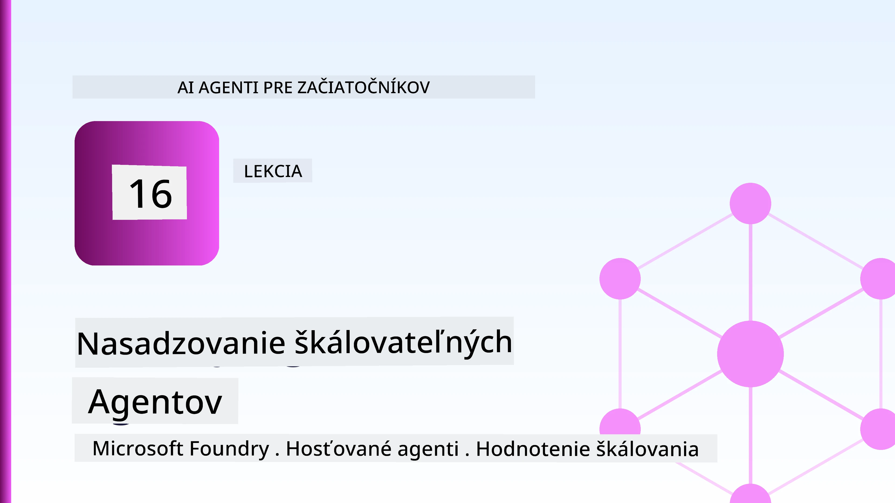
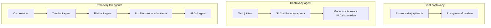
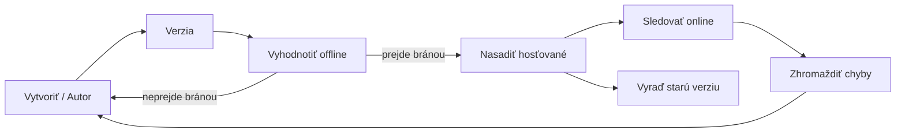
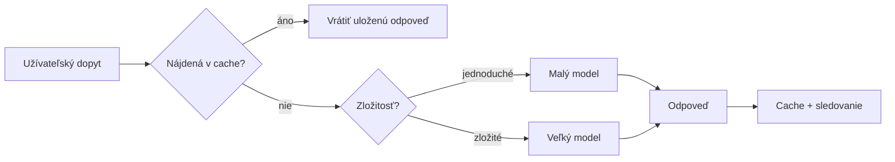
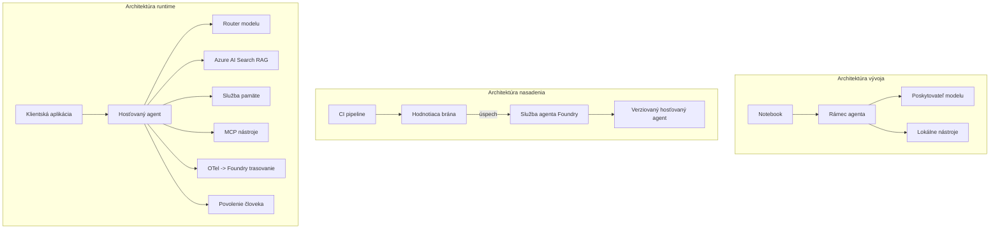

# Nasadzovanie škálovateľných agentov s Microsoft Foundry



Až do tohto bodu kurzu ste vytvárali agentov, ktorí bežia na vašom notebooku, vo vnútri poznámkového bloku, riadení `az login` a niekoľkými premennými prostredia. To je presne správny spôsob, ako sa učiť. Nie je to však správny spôsob, ako prevádzkovať agenta, na ktorom v noci o 3:00 závisia tisíce zákazníkov.

Táto lekcia sa zaoberá priepasťou medzi „funguje to na mojom počítači“ a „funguje to spoľahlivo a cenovo dostupne v produkcii.“ Túto priepasť prekonáme pomocou **Microsoft Foundry** a **Microsoft Foundry Agent Service**, a urobíme to vytvorením skutočného zákazníckeho podporného agenta, ktorý má nástroje, vyhľadávanie, pamäť, hodnotenie a monitorovanie.

## Úvod

Táto lekcia pokrýva:

- Rozdiel medzi **prototypovým agentom** a **nasadeným agentom** a prečo je prechod v podstate o všetkom *okolo* modelu.
- **Vzor nasadenia** agentov: hosťované na klientovi, hosťované ako služba (Hosted Agents) a orchestrace pracovných tokov.
- **Životný cyklus agenta** v Microsoft Foundry — vytváranie, verzovanie, nasadenie, evaluácia, pozorovanie, vyradenie z prevádzky.
- **Stratégie škálovania**: smerovanie modelu, kešovanie, súbežnosť a bezstavový dizajn.
- **Pozorovateľnosť** pomocou OpenTelemetry a Foundry trace.
- **Optimalizácia nákladov** prostredníctvom výberu modelu, smerovania a hodnotiacich brán.
- **Podnikovými úvahami**: správa, schválenie človekom a bezpečné spustenie MCP serverov v produkcii.

## Výukové ciele

Po dokončení tejto lekcie budete vedieť:

- Vybrať správny vzor nasadenia pre danú záťaž agenta.
- Nasadiť agenta do Microsoft Foundry Agent Service tak, aby bol verzovaný, spravovaný a pozorovateľný.
- Instrumentovať agenta pre sledovanie a prepojiť hodnotiacu linku, ktorá beží pred každým vydaním.
- Použiť smerovanie a kešovanie modelu na udržanie latencie a nákladov pod kontrolou pri škálovaní.
- Pridať schvaľovaciu bránu človekom pre vysokorizikové akcie a integrovať MCP server bezpečným spôsobom v produkcii.

## Predpoklady

Táto lekcia predpokladá, že ste dokončili predchádzajúce lekcie a ste pohodlní s:

- Vytváraním agentov pomocou [Microsoft Agent Framework](../14-microsoft-agent-framework/README.md) (Lekcia 14).
- [Používaním nástrojov](../04-tool-use/README.md) (Lekcia 4) a [Agentic RAG](../05-agentic-rag/README.md) (Lekcia 5).
- [Agentickou pamäťou](../13-agent-memory/README.md) (Lekcia 13) a [Agentickými protokolmi / MCP](../11-agentic-protocols/README.md) (Lekcia 11).
- [Pozorovateľnosťou a evaluáciou](../10-ai-agents-production/README.md) (Lekcia 10) — táto lekcia na nej priamo stavia.

Budete taktiež potrebovať:

- **Predplatné Azure** a **projekt Microsoft Foundry** s aspoň jedným nasadeným chat modelom.
- **Azure CLI** autentifikované (`az login`).
- Python 3.12+ a balíky v repozitári [`requirements.txt`](../../../requirements.txt).

## Z prototypu do produkcie: Čo sa vlastne mení

Prototypový agent a produkčný agent zdieľajú tú istú základnú slučku — rozmýšľať, volať nástroje, odpovedať. Mení sa však všetko, čo je okolo tejto slučky. Model tvorí možno 20 % produkčného agenta; zvyšných 80 % je operačný kostra.

| Oblasť | Prototyp | Produkcia |
| --- | --- | --- |
| **Hostovanie** | Beží vo vašom poznámkovom bloku | Beží ako hosťovaná služba, verzovaná a postupne nasadzovaná |
| **Identita** | Váš token z `az login` | Spravovaná identita s rozsahovým RBAC |
| **Stav** | V pamäti, stratený pri reštarte | Externý (úložisko konverzácií, pamäťová služba) |
| **Zlyhanie** | Vidíte traceback | Opakovania, záložné plány, dead-letter, upozornenia |
| **Náklady** | "Je to pár centov" | Sledované na požiadavku, smerované, kešované, rozpočtované |
| **Kvalita** | Sledujete výstup vizuálne | Automaticky hodnotené pred každým vydaním |
| **Dôvera** | Schvaľujete každú akciu | Pravidlá + človek v slučke pri rizikových akciách |

Majte túto tabuľku na pamäti. Každá sekcia nižšie zodpovedá jednému z týchto riadkov.

## Vzory nasadenia agentov

Existujú tri vzory, ktoré budete používať, často v kombinácii.

### 1. Agent hosťovaný na klientovi

Objekt agenta žije vo *vašom* procesnom rámci aplikácie. Váš kód volá poskytovateľa modelu priamo; slučka uvažovania beží vo vašej službe. Takto to robila každá predchádzajúca lekcia.

- **Používajte, keď** potrebujete plnú kontrolu nad slučkou, vlastné middleware alebo vkladáte agenta do existujúceho backendu.
- **Kompromis**: škálovanie, stav a odolnosť spravujete sami.

### 2. Hosťovaní agenti (Foundry Agent Service)

Agent je *registrovaný ako zdroj* v Microsoft Foundry. Foundry hosťuje slučku uvažovania, ukladá vlákna, vynucuje bezpečnosť obsahu a RBAC, a zobrazuje agenta v portáli Foundry. Vaša aplikácia sa stáva tenkým klientom, ktorý vytvára vlákna a číta odpovede.

- **Používajte, keď** chcete odolnosť, zabudovanú pozorovateľnosť, správu a menšiu operačnú plochu.
- **Kompromis**: menej nízkoúrovňovej kontroly výmenou za spravované runtime.

### 3. Pracovné toky agentov

Viacerí agenti (a nástroje) sú zložené do grafu s explicitným riadením toku — sekvenčné kroky, rozvetvovanie, uzly schvaľovania človekom a trvácne kontrolné body, ktoré sa môžu pozastaviť a obnoviť. Toto je schopnosť **Workflows** Microsoft Agent Framework aplikovaná na škálovanie nasadenia.

- **Používajte, keď** jedna úloha zahŕňa niekoľko špecializovaných agentov alebo vyžaduje schválenie v strede.
- **Kompromis**: viac pohyblivých častí; vyžaduje sa pozorovateľnosť na úrovni orchestrácie.



## Životný cyklus agenta na Microsoft Foundry

Nasadenie agenta nie je jednorazový `push`. Je to slučka, ktorá veľmi pripomína cyklus vydávania softvéru, pretože presne to je.



Kľúčová myšlienka, prevzatá z [Lekcie 10](../10-ai-agents-production/README.md): **offline evaluácia je brána, nie dodatočná myšlienka.** Nová verzia agenta sa nevydá, kým neprekročí vaše hodnotiace prahové hodnoty. Online pozorovateľnosť potom vracia spätnú väzbu o reálnych zlyhaniach do offline testovacej sady. To je celá slučka.

## Stratégie škálovania

Škálovanie agenta sa líši od škálovania bezstavového webového API, pretože každá požiadavka môže spustiť viacero nákladných volaní modelu a nástrojov. Štyri techniky znášajú väčšinu záťaže.

**Bezstavová obsluha požiadaviek.** Neuchovávajte stav používateľa v pamäti procesu. Ukladajte vlákna konverzácie do Foundry thread store alebo pamäťovej služby, aby akákoľvek inštancia vedela spracovať ktorúkoľvek požiadavku. To umožňuje horizontálne škálovanie — pridať inštancie bez viazaných relácií.

**Smerovanie modelov.** Nie každá požiadavka potrebuje ten najvýkonnejší (a najdrahší) model. Jednoduché požiadavky — klasifikácia zámeru, krátke faktické odpovede — smerujte na malý, rýchly model, a veľký model rezervujte pre skutočné uvažovanie. Foundry's **Model Router** to za vás spraví, alebo si môžete implementovať ľahký klasifikátor sami. V laboratóriu si vybudujete vlastnú verziu.

**Kešovanie odpovedí.** Mnohé podporné otázky sú takmer duplikáty („ako si resetujem heslo?“). Ukladajte odpovede na bežné otázky do cache a podávajte ich bez vyvolávania modelu. Aj mierna miera zásahu do cache výrazne znižuje náklady a latenciu.

**Súbežnosť a spätný tlak.** Poskytovatelia modelu majú limity rýchlosti. Obmedzte súbežnosť, používajte opakovanie s exponenciálnym oneskorením a zlyhajte slušne (zaradená odpoveď „rátame s tým“ je lepšia ako chyba 500).



## Pozorovateľnosť v produkcii

Nemôžete prevádzkovať to, čo nevidíte. Ako bolo pokryté v Lekcii 10, Microsoft Agent Framework rodinne emituje **OpenTelemetry** stopy — každý modelový hovor, vyvolanie nástroja a orchestrácia sa stáva trvaním (span). V produkcii exportujete tieto trvania do Microsoft Foundry (alebo do ľubovoľného backendu kompatibilného s OTel), aby ste mohli:

- Sledovať jednu zákaznícku sťažnosť end-to-end naprieč každým modelovým a nástrojovým volaním.
- Monitorovať latenciu p50/p95 a náklady na požiadavku v čase.
- Upozorniť na špičky chybovosti a anomálie nákladov ešte predtým, než si ich všimnú vaši používatelia (alebo finančný tím).

```python
from agent_framework.observability import get_tracer

tracer = get_tracer()

with tracer.start_as_current_span("support_request") as span:
    span.set_attribute("customer.tier", "enterprise")
    span.set_attribute("routed.model", "gpt-5-nano")
    # vykonávanie agenta je automaticky sledované v tomto rozsahu
```

Atribúty ako `customer.tier` a `routed.model` menia múr trás na zodpovedateľné otázky („Jsú podnikový zákazníci príliš často smerovaní na malý model?“).

## Optimalizácia nákladov

Náklady v produkčných agentoch sú dominované tokenmi. Tri páky v poradí podľa vplyvu:

1. **Správna veľkosť modelu.** Malý model, ktorý prejde vašou hodnotiacou bránou, je takmer vždy lacnejší než veľký model, ktorý tiež prejde. Používajte evaluáciu na *dôkaz*, že malý model je dosť dobrý, namiesto predvolenia najväčšieho modelu z opatrnosti.
2. **Smerovanie podľa zložitosti.** Ako uvádzané vyššie — platíte ceny veľkého modelu len za požiadavky, ktoré vyžadujú veľké uvažovanie modelu.
3. **Agresívne kešovanie.** Najlacnejší modelový hovor je ten, ktorý nikdy nespravíte.

Hodnotiace brány a kontrola nákladov sú rovnaká disciplína pozeraná z dvoch uhlov: evaluácia vám hovorí *kvalitný základ*, smerovanie a kešovanie vás držia čo najbližšie k *nákladom* tohto základu.

## Podnikové aspekty nasadenia

**Správa.** Hosťovaní agenti zdedia Foundry RBAC, bezpečnosť obsahu a auditovanie. Každému agentovi dajte spravovanú identitu s najmenším potrebným povolením — prístup len na čítanie k znalostnej báze, selektívny prístup k API ticketovaniu, nič viac.

**Človek v slučke.** Niektoré akcie sú priveľmi závažné na úplnú automatizáciu — vrátenie peňazí, vymazanie účtu, eskalácia na právny tím. Microsoft Agent Framework podporuje **nástroje vyžadujúce schválenie**: agent navrhne akciu, vykonanie sa pozastaví, človek schváli alebo zamietne a pracovný tok pokračuje. Túto primitívu ste videli v [Lekcii 6](../06-building-trustworthy-agents/README.md); tu ju nasadíte.

**MCP v produkcii.** [MCP](../11-agentic-protocols/README.md) umožňuje agentovi používať externé nástroje cez štandardné rozhranie. V produkcii sa každý MCP server považuje za nedôveryhodnú hranicu: zaistite verziu servera, spúšťajte ho so selektívnou identitou, validujte jeho výstupy a nikdy mu nezverujte tajomstvá. MCP server je závislosťou, a závislosti sa záplatújú, auditujú a obmedzujú rýchlosťou.



Tieto tri diagramy — vývoj, nasadenie, runtime — sú ten istý agent v troch životných fázach. Následujúca laboratórium vás prevedie jeho zostavením.

## Praktické laboratórium: Produkčne pripravený zákaznícky podporný agent

Otvorte [`code_samples/16-python-agent-framework.ipynb`](./code_samples/16-python-agent-framework.ipynb) a prejdite ním od začiatku do konca. Zostavíte **Contoso zákazníckeho podporného agenta** so všetkými produkčnými aspektmi zapojenými:

1. **Volanie nástrojov** — vyhľadávanie stavu objednávky a otvorenie ticketu podpory.
2. **RAG** — odpovede na otázky o politikách zo znalostnej bázy (Azure AI Search, s in-memory fallbackom, aby blok poznámok bežal bez Search zdroja).
3. **Pamäť** — pamätajte si zákazníka počas priebehu konverzácie.
4. **Smerovanie modelu** — klasifikátor zložitosti smeruje každú požiadavku na malý alebo veľký model.
5. **Kešovanie odpovedí** — opakované otázky sa podávajú z cache.
6. **Schválenie človekom** — refundácie nad hranicu vyžadujú ľudský súhlas.
7. **Hodnotiaca linka** — malá offline testovacia sada hodnotí agenta a slúži ako brána pri vydávaní.
8. **Pozorovateľnosť** — OpenTelemetry trace okolo každej požiadavky.

### Prechod

Poznámkový blok je usporiadaný tak, že každý produkčný aspekt je samostatná, spustiteľná sekcia. Jadro tvorí request handler s routingom a kešovaním:

```python
async def handle_support_request(query: str, customer_id: str) -> str:
    # 1. Podávajte z cache, keď je to možné.
    cached = response_cache.get(normalize(query))
    if cached:
        return cached

    # 2. Smerujte podľa zložitosti pre kontrolu nákladov.
    model = "gpt-5-nano" if is_simple(query) else "gpt-5-mini"

    # 3. Spustite agenta v rámci trace span pre sledovateľnosť.
    with tracer.start_as_current_span("support_request") as span:
        span.set_attribute("routed.model", model)
        span.set_attribute("customer.id", customer_id)
        response = await support_agent.run(query, model=model)

    # 4. Uložte do cache a vráťte.
    response_cache.set(normalize(query), response.text)
    return response.text
```

Hodnotiaca brána, ktorá stráži vydanie, vyzerá takto:

```python
async def evaluation_gate(agent, test_cases, threshold: float = 0.8) -> bool:
    passed = 0
    for case in test_cases:
        result = await agent.run(case["input"])
        if score_response(result.text, case["expected"]) >= 0.8:
            passed += 1
    pass_rate = passed / len(test_cases)
    print(f"Evaluation pass rate: {pass_rate:.0%} (gate: {threshold:.0%})")
    return pass_rate >= threshold  # nasadiť iba ak brána prejde
```

Prečítajte si každý riadok — poznámkový blok drží primitívy zámerne malé, nič nie je skryté za volaním frameworku.

## Validácia nasadeného agenta pomocou Smoke Tests

Vyššie uvedená hodnotiaca brána beží *offline* proti objektu agenta. Keď je agent nasadený ako Hosted Agent, potrebujete ešte jednu, ešte lacnejšiu kontrolu: **odpovedá nasadený endpoint vôbec?**

„Úspešné“ nasadenie len dokazuje, že riadiaca rovina akceptovala definíciu — no nedokazuje, že agent reaguje. Chýbajúca závislosť, nesprávne smerovanie modelu alebo vypršané spojenie môžu nechať zelené nasadenie, ktoré však nič nevracia. **Smoke test** to zachytí za sekundy, pri každom nasadení, bez nákladov plnej evaluácie.

Tento repozitár obsahuje hotovú smoke-test linku postavenú na [AI Smoke Test](https://github.com/marketplace/actions/ai-smoke-test) GitHub Action:

- **Katalóg** — [`tests/lesson-16-smoke-tests.json`](../../../tests/lesson-16-smoke-tests.json) obsahuje podnety a assertiony pre Contoso podporného agenta (otázky o zásadách, overenie objednávky, dodržanie témy a kontinuita vlákna vo viacerých krokoch). Katalógy pre agentov z iných lekcií žijú vedľa neho — pozrite [`tests/README.md`](../tests/README.md).
- **Pracovný tok** — [`.github/workflows/smoke-test.yml`](../../../.github/workflows/smoke-test.yml) sa prihlasuje cez Azure OIDC a POSTuje každý podnet na endpoint agentových odpovedí, pričom zlyhanie na akomkoľvek asertíve zastaví úlohu.

```yaml
- name: Smoke-test hosted agent
  uses: JFolberth/ai-smoketest@v1
  with:
    project_endpoint: ${{ inputs.project_endpoint }}
    agent_name: ContosoSupportAgent
    tests_file: tests/lesson-16-smoke-tests.json
```


Spustite to z karty **Akcie**, akonáhle je váš agent nasadený, pričom poskytnite koncový bod projektu Foundry a meno agenta. Federovaná identita potrebuje rolu **Azure AI User** v rozsahu projektu Foundry. Predstavte si vrstvy ako pyramídu: testy dymu (dostupný a odpovedá?) sa spúšťajú pri každom nasadení, offline hodnotenie (dostatočne dobré na vydanie?) sa spúšťa pred povýšením a online hodnotenie (ako sa darí v praxi?) beží nepretržite.

## Kontrola vedomostí

Otestujte svoje porozumenie pred pokračovaním k úlohe.

**1. Cca koľkú časť produkčného agenta tvorí „model“ a čo tvorí zvyšok?**

<details>
<summary>Odpoveď</summary>

Model je menšinou systému — často sa uvádza okolo 20 %. Zvyšok tvorí prevádzkový skelet: hosťovanie a verzovanie, identita a RBAC, externalizovaný stav, spracovanie chýb, sledovanie nákladov, hodnotenie a kontroly s ľudským zásahom. Prechod do produkcie je prevažne o budovaní všetkého *okolo* cyklu uvažovania.
</details>

**2. Kedy by ste zvolili Hosted Agenta namiesto agenta hosťovaného na klientskej strane?**

<details>
<summary>Odpoveď</summary>

Keď chcete spravované prostredie vykonávania s zabudovanou odolnosťou (vlákna, ktoré pretrvávajú a môžu pokračovať), pozorovateľnosťou, bezpečnosťou obsahu a RBAC a ste ochotní obetovať niektorú nízkoúrovňovú kontrolu nad cyklom uvažovania za menšiu prevádzkovú plochu. Agent hosťovaný na klientskej strane je vhodnejší, keď potrebujete plnú kontrolu nad cyklom alebo keď integrujete agenta do existujúceho backendu.
</details>

**3. Prečo musí byť škálovateľný agent bezstavový vo svojej procesnej pamäti?**

<details>
<summary>Odpoveď</summary>

Aby ktorákolvek inštancia mohla spracovať ktorúkoľvek požiadavku, čo umožňuje horizontálne škálovanie bez „sticky sessions“. Stav konverzácie pre používateľa je externalizovaný do úložiska vlákien alebo pamäťovej služby. Ak by stav žil v procesnej pamäti, pri reštarte by sa stratil a záťaž by sa nedala voľne distribuovať.
</details>

**4. Aký problém rieši smerovanie modelov a ako súvisí s hodnotením?**

<details>
<summary>Odpoveď</summary>

Smerovanie odosiela jednoduché požiadavky na malý, lacný a rýchly model a vyhradzujer veľký model pre skutočné uvažovanie, čím kontroluje latenciu a náklady. Súvisí s hodnotením, pretože hodnotenie je to, čo *preukazuje*, že malý model je dostatočne dobrý pre danú triedu požiadaviek — smerovanie bez hodnotenia je len hádanie.
</details>

**5. Čo je „hodnotiaca brána“ a kde sa nachádza v životnom cykle?**

<details>
<summary>Odpoveď</summary>

Hodnotiaca brána spúšťa offline testovací súbor na novej verzii agenta a blokuje nasadenie, pokiaľ miera úspešnosti neprekročí prah. Nachádza sa medzi „verziou“ a „nasadením“ v životnom cykle, čím sa kvalita stáva podmienkou pre vydanie namiesto niečoho, čo sa kontroluje po vydaní.
</details>

**6. Prečo by mal byť MCP server v produkcii považovaný za neoverenú hranicu?**

<details>
<summary>Odpoveď</summary>

Pretože je to externá závislosť, na ktorú váš agent volá. Mali by ste pinovať jeho verziu, spúšťať ho s obmedzenou identitou, overovať jeho výstupy, obmedzovať jeho používanie a nikdy nemáte zverejňovať tajomstvá — rovnaká disciplína, akú uplatňujete na akúkoľvek tretiu stranu. Jeho výstupy vstupujú do uvažovania vášho agenta, takže neoverená dôvera predstavuje bezpečnostné riziko.
</details>

**7. Ktorá jediná zmena má zvyčajne najväčší vplyv na náklady produkčného agenta a prečo?**

<details>
<summary>Odpoveď</summary>

Správna veľkosť modelu — použitie najmenšieho modelu, ktorý stále prejde hodnotiacou bránou. Náklady sú dominované tokenmi a menší model, ktorý spĺňa kvalitatívny štandard, je takmer vždy lacnejší ako väčší. Keď sa potom použijú kešovanie a smerovanie, náklady sa ešte znížia, ale výber správneho základného modelu má najväčší prvotný efekt.
</details>

**8. Akú úlohu hrajú atribúty spanov ako `customer.tier` a `routed.model` pri pozorovateľnosti?**

<details>
<summary>Odpoveď</summary>

Premieňajú surové stopy na zodpovedateľné obchodné otázky. Bez atribútov máte hromadu spanov; s nimi môžete položiť otázky ako „sú podnikateľskí zákazníci príliš často smerovaní na malý model?“ alebo „ktorý model spracováva naše najpomalšie požiadavky?“ Atribúty sú spôsob, ako rozrezať telemetriu podľa rozmerov, ktoré sú dôležité pre vašu prevádzku.
</details>

## Úloha

Vezmite zákazníckeho podporného agenta z laboratória a zabezpečte ho pre konkrétny scenár: **podporný agent pre predplatné fakturácie v SaaS spoločnosti.**

Vaša odovzdaná práca by mala:

1. **Nahradiť nástroje** nástrojmi relevantnými pre fakturáciu: `get_subscription_status`, `get_invoice` a `issue_credit` (kredity nad 50 $ vyžadujú schválenie človekom).
2. **Pridať tri RAG dokumenty** pokrývajúce politiku vrátenia peňazí, fakturačný cyklus a politiku zrušenia.
3. **Rozšíriť súbor hodnotenia** aspoň na osem prípadov, vrátane aspoň dvoch, ktoré *by mali* spustiť cestu so schválením človekom, a potvrdiť, že vaša hodnotiaca brána správne prechádza alebo zlyháva.
4. **Pridať jednu správu o nákladoch**: po spracovaní desiatich zmiešaných dopytov agentom vytlačte, koľko šlo na malý model, koľko na veľký model a koľko bolo obslúžených z keše.

Napíšte krátky odsek (v markdown bunke) vysvetľujúci, ktorú pravidlo smerovania modelov ste zvolili a ako by ste ho validovali s reálnou prevádzkou. Neexistuje jediná správna odpoveď — hodnotí sa, či sú produkčné aspekty spolu súvislo prepojené.

## Zhrnutie

V tejto lekcii ste presunuli agenta z prototypu do produkcie pomocou Microsoft Foundry:

- Skok do produkcie je hlavne o **prevádzkovom skelete** okolo modelu — hosťovanie, identita, stav, spracovanie chýb, náklady, kvalita a dôvera.
- Naučili ste sa tri **vzory nasadenia** — hosťovaný klientom, Hosted Agenti a pracovné postupy agentov — a kedy ktorý využiť.
- Prešli ste **životným cyklom agenta**, kde offline **hodnotenie slúži ako brána vydania** a online pozorovateľnosť vracia chyby späť do testovacieho súboru.
- Aplikovali ste **škálovacie stratégie** — bezstavový dizajn, smerovanie modelov, kešovanie a obmedzenú súbežnosť — a spojili ich s **optimalizáciou nákladov**.
- Zapojili ste **firemné kontroly**: RBAC, ľudské schválenie a bezpečnú integráciu MCP do produkcie.
- Vytvorili ste **produkčne pripraveného zákazníckeho podporného agenta**, ktorý spája všetky tieto aspekty do spustiteľného kódu.

Nasledujúca lekcia ide opačným smerom: namiesto škálovania agentov do cloudu ich stiahnete *dole* na jeden počítač vývojára a spustíte úplne lokálne.

## Dodatočné zdroje

- <a href="https://learn.microsoft.com/azure/ai-foundry/what-is-azure-ai-foundry" target="_blank">Dokumentácia Microsoft Foundry</a>
- <a href="https://learn.microsoft.com/azure/ai-foundry/agents/overview" target="_blank">Prehľad služieb agentov Microsoft Foundry</a>
- <a href="https://learn.microsoft.com/en-us/agent-framework/overview/?wt.mc_id=youtube_26688_organicsocial_reactor&pivots=programming-language-python" target="_blank">Microsoft Agent Framework</a>
- <a href="https://learn.microsoft.com/azure/ai-foundry/concepts/model-router" target="_blank">Model Router v Microsoft Foundry</a>
- <a href="https://learn.microsoft.com/azure/search/search-what-is-azure-search" target="_blank">Azure AI Search</a>
- <a href="https://opentelemetry.io/" target="_blank">OpenTelemetry</a>
- <a href="https://github.com/marketplace/actions/ai-smoke-test" target="_blank">GitHub Akcia AI Smoke Test</a>
- <a href="https://modelcontextprotocol.io/" target="_blank">Model Context Protocol (MCP)</a>

## Predchádzajúca lekcia

[Budovanie agentov na používanie počítača (CUA)](../15-browser-use/README.md)

## Nasledujúca lekcia

[Vytváranie lokálnych AI agentov](../17-creating-local-ai-agents/README.md)

---

<!-- CO-OP TRANSLATOR DISCLAIMER START -->
**Vyhlásenie o zodpovednosti**:
Tento dokument bol preložený pomocou AI prekladateľskej služby [Co-op Translator](https://github.com/Azure/co-op-translator). Hoci sa snažíme o presnosť, vezmite prosím na vedomie, že automatické preklady môžu obsahovať chyby alebo nepresnosti. Pôvodný dokument v jeho natívnom jazyku by mal byť považovaný za autoritatívny zdroj. Pre kritické informácie sa odporúča profesionálny ľudský preklad. Nie sme zodpovední za žiadne nedorozumenia alebo nesprávne interpretácie vyplývajúce z použitia tohto prekladu.
<!-- CO-OP TRANSLATOR DISCLAIMER END -->