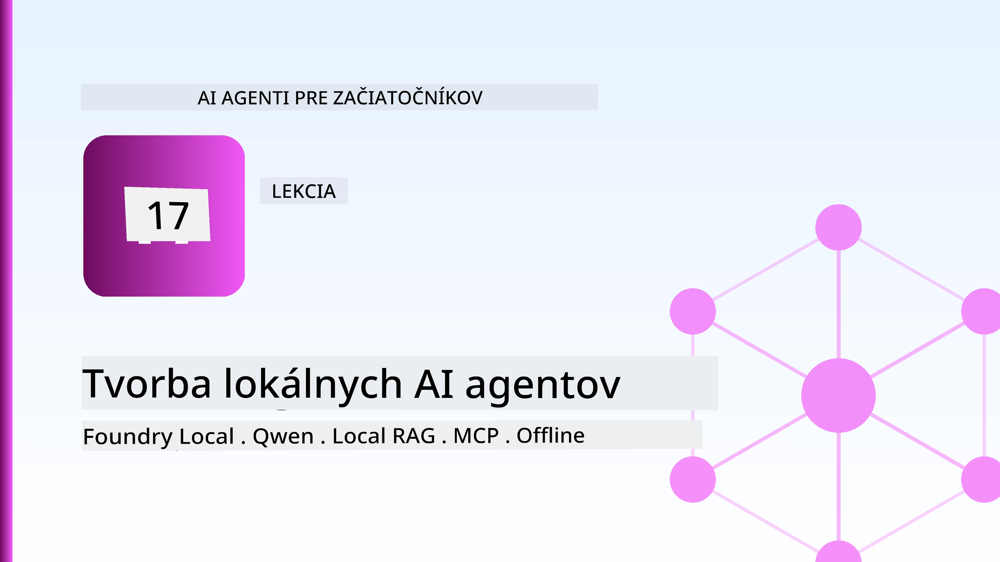
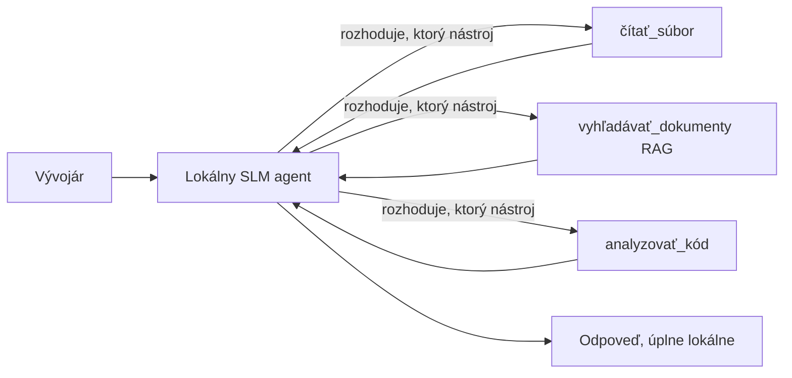
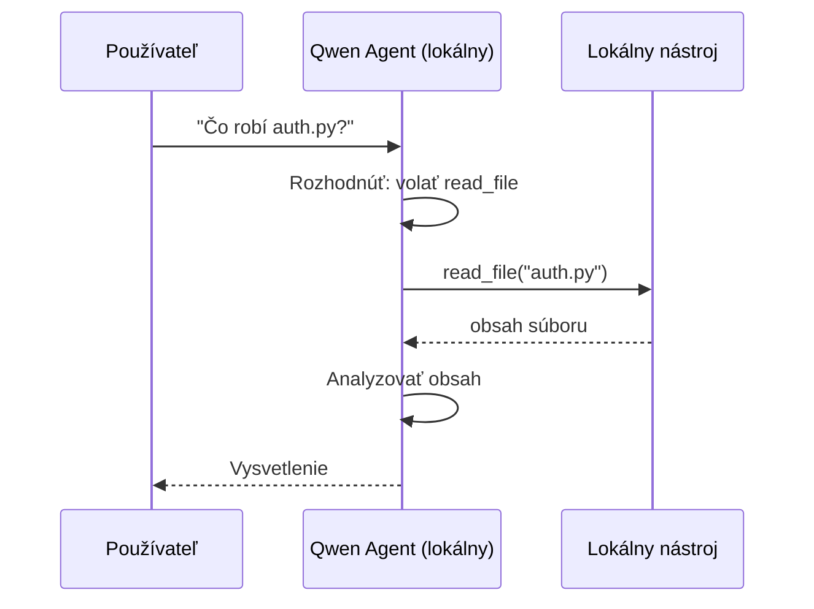
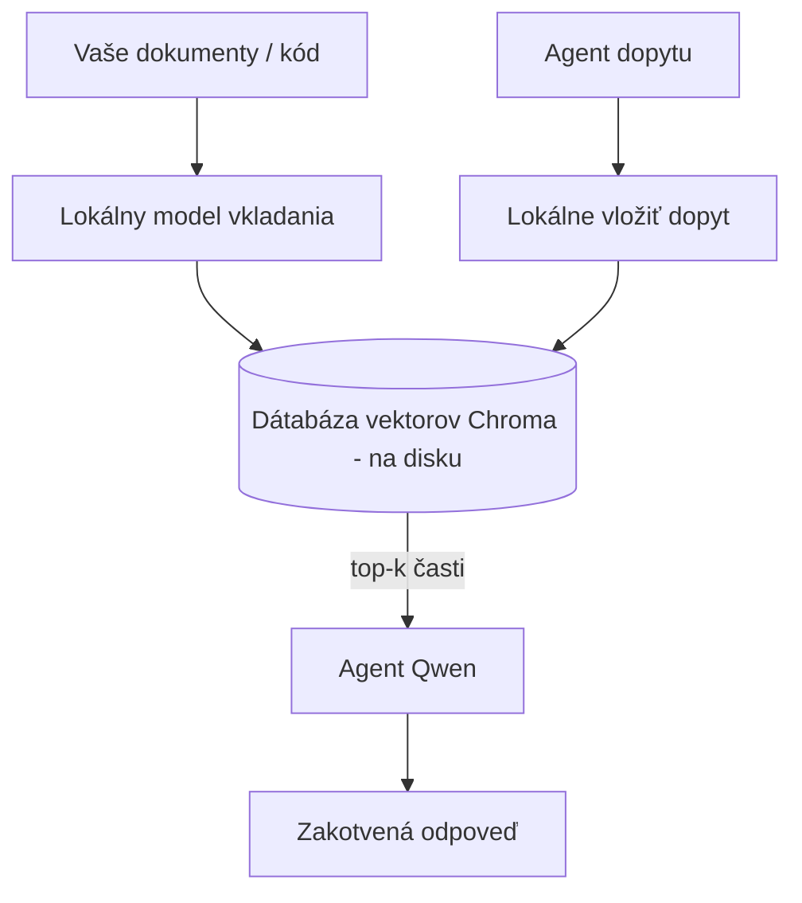
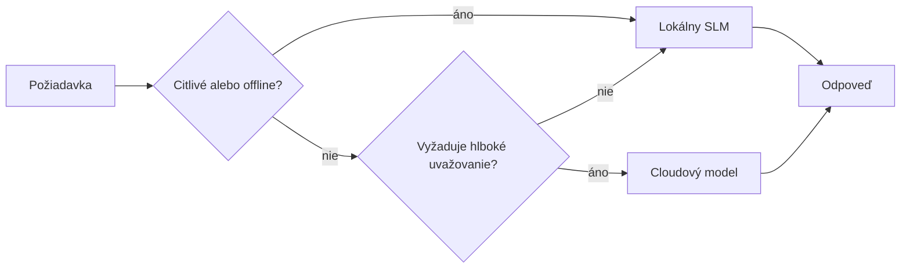

# Vytváranie lokálnych AI agentov pomocou Microsoft Foundry Local a Qwen



Predchádzajúca lekcia škálovala agentov *hore* do cloudu. Táto ich zasa prináša *dole* na jeden počítač. Na konci budete mať funkčného inžinierskeho asistenta, ktorý rozmýšľa, volá nástroje, číta vaše súbory a prehľadáva vašu dokumentáciu — **bez jedného jediného volania inferencie v cloude.**

Prečo by ste to chceli? Tri dôvody, ktoré v reálnej inžinierskej práci často zaznievajú:

- **Súkromie.** Kód a dokumenty nikdy neopustia stroj. Žiadny prompt, žiadny úryvok, žiadne zákaznícke dáta neprejdú sieťovou hranicou.
- **Náklady.** Lokálna inferencia nemá účtovanie za token. Môžete iterovať celý deň za cenu elektriny.
- **Offline.** Na lietadle, v zabezpečenom zariadení alebo počas výpadku agent stále funguje.

Nevýhoda je, že vymieňate špičkový cloudový model za **malý jazykový model (SLM)** bežiaci na vašom CPU, GPU alebo NPU. Táto lekcia je o budovaní agentov, ktorí sú *dobrí* v týchto obmedzeniach namiesto pretendovania, že obmedzenia neexistujú.

## Úvod

Táto lekcia pokryje:

- **Malé jazykové modely (SLM)** — čo sú, kde vynikajú a kde nie.
- **Microsoft Foundry Local** — runtime, ktorý sťahuje a poskytuje modely priamo na zariadení cez **OpenAI-kompatibilné API**.
- **Qwen modely s volaním funkcií** — SLM, ktoré spoľahlivo generujú volania nástrojov, čo robí lokálnych *agentov* (nielen lokálny chat) možnými.
- **Lokálne nástroje, lokálny RAG a lokálny MCP** — dávajú agentovi schopnosti bez cloudu.
- **Hybridné vzory** — kedy niečo nechať lokálne a kedy siahnuť po cloude.

## Ciele učenia

Po dokončení tejto lekcie budete vedieť:

- Vysvetliť kompromisy SLM a vybrať vhodné prípady použitia lokálnych agentov.
- Poskytovať Qwen model lokálne cez Foundry Local a pripojiť sa k nemu cez OpenAI-kompatibilný endpoint.
- Vytvoriť nástrojovo-volajúceho agenta, ktorý beží úplne na vašom pracovnom stroji.
- Pridať lokálny RAG nad vlastnými dokumentmi pomocou lokálnej vektorovej databázy (Chroma).
- Pripojiť agenta na lokálny MCP server a uvažovať o hybridných lokálnych/cloudových riešeniach.

## Predpoklady

Táto lekcia predpokladá, že ste absolvovali predchádzajúce lekcie a ovládate:

- [Používanie nástrojov](../04-tool-use/README.md) (lekcia 4) a [Agentický RAG](../05-agentic-rag/README.md) (lekcia 5).
- [Agentické protokoly / MCP](../11-agentic-protocols/README.md) (lekcia 11).
- [Microsoft Agent Framework](../14-microsoft-agent-framework/README.md) (lekcia 14).

Tiež budete potrebovať:

- Vývojársky pracovný stroj. **8 GB RAM je realistický minimál; 16 GB+ je pohodlné.** GPU alebo NPU pomôžu, ale nie sú povinné.
- **Inštalovaný Microsoft Foundry Local** (pozri sekciu inštalácie nižšie).
- Python 3.12+ a balíčky v repozitári [`requirements.txt`](../../../requirements.txt), plus `foundry-local-sdk`, `openai` a `chromadb` pre túto lekciu.

## Malé jazykové modely: správny nástroj pre lokálnu prácu

Špičkový cloudový model má stovky miliárd parametrov a za sebou dátové centrum. SLM má pár miliárd parametrov a musí sa zmestiť do RAM vášho notebooku. Tento rozdiel nastavuje jasné očakávania.

**SLM sú dobré na:**

- Štruktúrované, ohraničené úlohy — klasifikácia, extrakcia, zhrnutie známeho dokumentu.
- **Volanie nástrojov** — rozhodovanie, ktorú funkciu volať a s akými argumentmi.
- Rýchle, lacné a súkromné iterácie na vašich vlastných dátach.

**SLM sú slabšie na:**

- Otvorené, viacstupňové uvažovanie s rozsiahlym kontextom.
- Široké všeobecné znalosti (videli menej a viac zabúdajú).

Víťazná stratégia pre lokálnych agentov je preto: **nechajte SLM orchestrovať a nechajte nástroje robiť ťažkú prácu.** Model nemusí *poznať* váš kód — musí vedieť, kedy volať `read_file` a `search_docs`. To priamo hrá na silné stránky SLM.



## Microsoft Foundry Local

**Microsoft Foundry Local** je ľahký runtime, ktorý sťahuje, spravuje a poskytuje modely priamo na vašom stroji. Jeho najdôležitejšou vlastnosťou pre nás je, že vystavuje **OpenAI-kompatibilný HTTP endpoint** — čo znamená, že OpenAI SDK a OpenAI klient Microsoft Agent Framework pracujú s ním len zmenou `base_url`. Všetko, čo ste sa naučili o tvorbe agentov, sa prenáša priamo; len endpoint sa presúva z cloudu na `localhost`.

Foundry Local taktiež automaticky vyberá najlepšiu verziu modelu pre váš hardvér — CPU, CUDA/GPU alebo NPU — takže nemusíte ručne optimalizovať pre každý stroj.

### Inštalácia

Nainštalujte Foundry Local (pozri [dokumentáciu](https://learn.microsoft.com/azure/ai-foundry/foundry-local/) pre váš OS), potom si overte, že funguje:

```bash
# Nainštalujte (napr. podľa dokumentácie pre vašu platformu)
winget install Microsoft.FoundryLocal      # Windows
# brew install microsoft/foundrylocal/foundrylocal   # macOS

# Stiahnite a spustite model Qwen, potom spustite lokálnu službu
foundry model run qwen2.5-7b-instruct
foundry service status
```

Keď služba beží, máte lokálny endpoint kompatibilný s OpenAI (zvyčajne `http://localhost:PORT/v1`). Notebook používa `foundry-local-sdk` na automatické vyhľadanie endpointu, takže nemusíte tvrdohlavo zadávať port.

## Qwen volanie funkcií: Prečo je to dôležité

Agent je agentom iba ak môže volať nástroje. Mnohé SLM vedia chatovať, ale generujú nespoľahlivé alebo chybný volania nástrojov. **Qwen** modely sú trénované na volanie funkcií a konzistentne vytvárajú správne volania nástrojov — čo presne premieňa lokálny chat model na lokálneho *agenta*.

Priebeh je štandardná slučka volania nástrojov, ktorú už poznáte, len beží na zariadení:



## Lokálny RAG

Vyhľadávanie v dokumentácii je miesto, kde lokálni agenti naozaj zúročia svoju hodnotu. Namiesto toho, aby ste dúfali, že SLM si zapamätal dokumentáciu vášho frameworku, vložíte tieto dokumenty do **lokálnej vektorovej databázy** a necháte agenta vyhľadávať relevantné kúsky na požiadanie.

Používame **Chromu**, embedovaný vektorový obchod bežiaci v procese bez potreby spravujúceho servera. Pipeline je úplne lokálna: lokálny embedding model → lokálne vektory → lokálne vyhľadávanie → lokálny SLM.



Toto je rovnaký vzor Agentic RAG z Lekcie 5 — jediná zmena je, že všetky komponenty bežia na vašom stroji.

## Lokálne MCP servery

[MCP](../11-agentic-protocols/README.md) je transportný protokol, nie cloudová služba. MCP server môže bežať ako lokálny proces na `stdio`, vystavujúc nástroje agentovi cez štandardný protokol. To vám umožňuje využívať rastúce ekosystém MCP serverov — prístup k súborovému systému, git operácie, dotazy do databáz — úplne offline.

Bezpečnostný postoj je iný ako v cloude, ale nie je žiadny: lokálny MCP server beží s povoleniami vášho používateľa, tak obmedzte jeho rozsah (adresár projektu, nie celý váš domovský adresár) a považujte jeho výstupy za vstupy, ktoré treba validovať.

## Hybridné cloudové a lokálne vzory

Lokálne-prvné neznamená iba-lokálne. Zrelé systémy nasmerujú podľa citlivosti a obtiažnosti:

| Situácia | Kde to beží |
| --- | --- |
| Citlivý kód / dáta alebo offline | **Lokálny SLM** |
| Jednoduchá, ohraničená úloha | **Lokálny SLM** (lacné, rýchle) |
| Ťažké viacstupňové uvažovanie nad necitlivými dátami | **Cloudový model** |
| Všetko počas výpadku | **Lokálny SLM** (postupný pokles výkonu) |

Toto odráža myšlienku **modelového routingu** z Lekcie 16 — s tým rozdielom, že jedným z „modelov“ je teraz váš vlastný stroj. Robustný dizajn sa spolieha na lokálne, keď cloud nie je k dispozícii, takže agent klesá v kvalite, namiesto aby úplne zlyhal.



## Praktické cvičenie: Lokálny inžiniersky asistent

Otvorte [`code_samples/17-local-agent-foundry-local.ipynb`](./code_samples/17-local-agent-foundry-local.ipynb) a prejdite si ho. Vytvoríte **lokálneho inžinierskeho asistenta**, ktorý beží úplne na vašom pracovnom stroji a môže:

1. **Volat nástroje** — cez Qwen volanie funkcií cez Foundry Local.
2. **Vykonávať lokálne operácie so súbormi** — vypisovať a čítať súbory v adresári projektu.
3. **Analyzovať kód** — hlásiť základné metriky zdrojového súboru.
4. **Vyhľadávať dokumentáciu** — lokálny RAG cez priečinok s dokumentmi s Chromou.
5. **Použiť MCP** — pripojiť sa k lokálnemu MCP serveru (s elegantným preskočením, ak nie je nakonfigurovaný).

Nebolo použité žiadne cloudové inferenčné volanie.

### Prehľad

Asistent sa pripája k Foundry Local cez OpenAI-kompatibilný endpoint, takže kód agenta vyzerá takmer rovnako ako v cloudových lekciách — len sa mení klient:

```python
from foundry_local import FoundryLocalManager
from openai import OpenAI

# Foundry Local nájde/stiahne model a poskytne nám lokálny endpoint.
manager = FoundryLocalManager(\"qwen2.5-7b-instruct\")
client = OpenAI(base_url=manager.endpoint, api_key=manager.api_key)  # api_key je lokálny zástupný symbol
```

Nástroje sú obyčajné Python funkcie obmedzené na adresár projektu:

```python
def read_file(path: str) -> str:
    \"\"\"Read a file, but only inside the sandboxed project directory.\"\"\"
    full = (PROJECT_ROOT / path).resolve()
    if PROJECT_ROOT not in full.parents and full != PROJECT_ROOT:
        return \"Access denied: path is outside the project directory.\"
    return full.read_text(encoding=\"utf-8\")
```

Všimnite si kontrolu sandboxu — aj lokálne nástroj, ktorý číta ľubovoľné cesty, je riziko. Notebook udržuje každý nástroj obmedzený na koreňový adresár projektu.

## Kontrola vedomostí

Otestujte svoje poznatky pred prechodom na zadanie.

**1. Uveďte dva konkrétne dôvody pre spustenie agenta lokálne namiesto v cloude.**

<details>
<summary>Odpoveď</summary>

Ktorékoľvek dve z: **súkromie** (kód a dáta nikdy neopustia stroj), **náklady** (žiadne účtovanie za tokeny v inferencii) a **offline schopnosť** (funguje bez siete – na lietadle, v zabezpečenom zariadení alebo počas výpadku). Regulačné/zmluvné obmedzenia zakazujúce posielanie dát mimo zariadenia sú častým dôvodom pre súkromie.
</details>

**2. Aké je odporúčané rozdelenie práce medzi SLM a jeho nástrojmi v lokálnom agentovi a prečo?**

<details>
<summary>Odpoveď</summary>

Nechajte SLM **orchestrovať** (rozhodovať, ktorý nástroj volať a s akými argumentmi) a nechajte **nástroje robiť ťažkú prácu** (čítať súbory, získavať dokumenty, počítať výsledky). SLM sú silné pri ohraničených rozhodnutiach ako výber nástroja, ale slabšie pri širokých znalostiach a dlhom viacstupňovom uvažovaní, takže spoliehanie sa na nástroje hrá na ich sila.
</details>

**3. Čo umožňuje znovu použiť cloudový kód agenta s Foundry Local?**

<details>
<summary>Odpoveď</summary>

Foundry Local vystavuje **OpenAI-kompatibilný HTTP endpoint**. OpenAI SDK a OpenAI klient Agent Frameworku s ním pracujú iba zmenou `base_url` (a použitím lokálneho API kľúča). Všetko ostatné zostáva rovnaké.
</details>

**4. Prečo špecificky používame Qwen model na volanie funkcií a nie hociktorý SLM?**

<details>
<summary>Odpoveď</summary>

Pretože agent musí produkovať spoľahlivé, správne formátované **volania nástrojov**. Mnohé SLM vedia chatovať, ale generujú chybné alebo nekonzistentné volania nástrojov. Qwen modely sú trénované na volanie funkcií a produkujú konzistentné volania, čo premieňa lokálny chat model na funkčného lokálneho agenta.
</details>

**5. V lokálnom RAG pipeline, ktoré komponenty bežia na stroji?**

<details>
<summary>Odpoveď</summary>

Všetky: embedding model, vektorová databáza (Chroma, na disku), krok vyhľadávania a SLM. Dokumenty sú lokálne vložené, uložené, vyhľadávané a spracované lokálnym modelom — žiadny komponent sa nedotýka cloudu.
</details>

**6. Lokálny MCP server beží na vašom stroji. Znamená to automaticky, že je bezpečný? Aké opatrenie by ste si mali stále zachovať?**

<details>
<summary>Odpoveď</summary>

Nie. Lokálny MCP server beží s povoleniami vášho používateľa, takže môže pristupovať ku všetkému, čo môžete vy. Obmedzte ho na nevyhnutné (napríklad jeden projektový adresár namiesto celého domovského priečinka) a považujte jeho výstupy ako vstupy na validáciu pred ďalším spracovaním.
</details>

**7. Opíšte rozumné pravidlo hybridného routovania, ktoré zahŕňa lokálny model.**

<details>
<summary>Odpoveď</summary>

Nasmerujte citlivé alebo offline požiadavky na lokálny SLM; jednoduché, ohraničené úlohy takisto na lokálny SLM kvôli rýchlosti a nákladom; náročné viacstupňové uvažovanie nad necitlivými dátami na cloudový model; a pri nedostupnosti cloudu spadnite späť na lokálny SLM tak, aby agent degradoval plynulo namiesto úplného zlyhania. Toto je modelový routing (Lekcia 16) s vašim lokálnym strojom ako jedným z modelov.
</details>

**8. Aká je realistická minimálna hodnota RAM pre spustenie lokálneho agenta v tejto lekcii a čo vám prináša viac RAM?**

<details>
<summary>Odpoveď</summary>

Okolo **8 GB** je realistický minimál; 16 GB+ je pohodlné. Viac RAM vám umožní spustiť väčšie a schopnejšie modely a uchovať viac kontextu v pamäti. GPU alebo NPU zrýchľujú inferenciu, ale nie sú povinné — Foundry Local vyberá CPU verziu, ak nie je dostupný žiadny akcelerátor.
</details>

## Zadanie

Rozšírte lokálneho inžinierskeho asistenta o **lokálneho recenzenta dokumentácie** pre malý projekt podľa vášho výberu (môžete použiť jeden z priečinkov lekcií v tomto repozitári).

Vaša práca by mala:

1. **Indexovať reálny priečinok s dokumentáciou/kódom** do Chromy (aspoň päť súborov).
2. **Pridať nástroj `find_todos`**, ktorý prehľadá projekt pre poznámky `TODO`/`FIXME` a vráti ich spolu so súborom a číslom riadku — pričom zachová rovnakú kontrolu sandboxu ako `read_file`.

3. **Opýtajte sa agenta tri otázky**, ktoré ho donútia kombinovať nástroje: jednu čistú RAG otázku, jednu, ktorá vyžaduje prečítanie konkrétneho súboru, a jednu, ktorá vyžaduje nájsť TODO úlohy.
4. **Zmerajte ich**: zmerajte čas každej z troch odpovedí a zaznamenajte ich do markdown bunky. Komentujte, či je latencia prijateľná pre váš plánovaný pracovný tok.

Potom napíšte krátky odsek o tom, **čo by ste presunuli do cloudu a čo by ste nechali lokálne** pre tohto recenzenta a prečo. Budete hodnotení podľa toho, či sú lokálne komponenty správne prepojené a či je váš hybridný spôsob uvažovania správny — nie podľa kvality modelu.

## Zhrnutie

V tejto lekcii ste vytvorili agenta, ktorý beží úplne na vašom vlastnom stroji:

- **SLM** menia šírku záberu za cenu súkromia, nákladov a offline prevádzky — a vynikajú, keď **orkestrujú nástroje** namiesto toho, aby niesli všetky znalosti samy.
- **Foundry Local** poskytuje modely priamo na zariadení za **endpointom kompatibilným s OpenAI**, takže váš cloudový agent kód sa prenesie jedinou zmenou riadku.
- **Qwen modely s volaním funkcií** umožňujú spoľahlivé lokálne volanie nástrojov — a teda aj lokálnych *agentov*.
- **Lokálny RAG** (Chroma) a **lokálny MCP** dávajú agentovi schopnosti bez opustenia zariadenia.
- **Hybridné vzory** vám umožňujú smerovať podľa citlivosti a obtiažnosti, s lokálnym ako elegantným záložným riešením.

Týmto sa uzatvára nasadzovací cyklus: Lekcia 16 škálovala agentov do Microsoft Foundry a táto lekcia ich škáluje na jediné pracovisko. Ďalšia lekcia sa zameriava na zabezpečenie nasadených agentov.

## Doplnkové zdroje

- <a href="https://learn.microsoft.com/azure/ai-foundry/foundry-local/" target="_blank">Dokumentácia Microsoft Foundry Local</a>
- <a href="https://learn.microsoft.com/azure/ai-foundry/what-is-azure-ai-foundry" target="_blank">Dokumentácia Microsoft Foundry</a>
- <a href="https://learn.microsoft.com/en-us/agent-framework/overview/?wt.mc_id=youtube_26688_organicsocial_reactor&pivots=programming-language-python" target="_blank">Microsoft Agent Framework</a>
- <a href="https://qwen.readthedocs.io/en/latest/framework/function_call.html" target="_blank">Dokumentácia volania funkcií Qwen</a>
- <a href="https://modelcontextprotocol.io/" target="_blank">Model Context Protocol (MCP)</a>
- <a href="https://docs.trychroma.com/" target="_blank">Chroma vektorová databáza</a>

## Predchádzajúca lekcia

[Nasadzovanie škálovateľných agentov](../16-deploying-scalable-agents/README.md)

## Nasledujúca lekcia

[Zabezpečenie AI agentov](../18-securing-ai-agents/README.md)

---

<!-- CO-OP TRANSLATOR DISCLAIMER START -->
**Vyhlásenie o zodpovednosti**:
Tento dokument bol preložený pomocou AI prekladateľskej služby [Co-op Translator](https://github.com/Azure/co-op-translator). Hoci sa snažíme o presnosť, vezmite prosím na vedomie, že automatické preklady môžu obsahovať chyby alebo nepresnosti. Pôvodný dokument v jeho natívnom jazyku by mal byť považovaný za autoritatívny zdroj. Pre kritické informácie sa odporúča profesionálny ľudský preklad. Nie sme zodpovední za žiadne nedorozumenia alebo nesprávne interpretácie vyplývajúce z použitia tohto prekladu.
<!-- CO-OP TRANSLATOR DISCLAIMER END -->