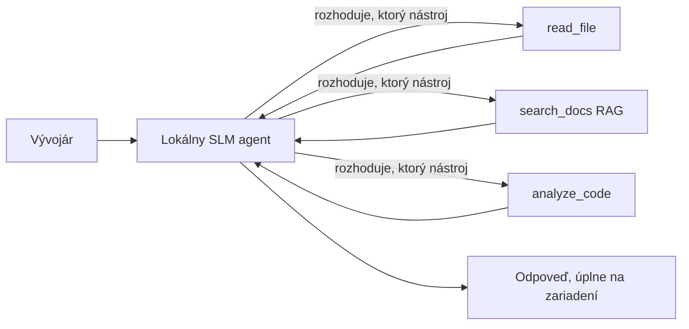
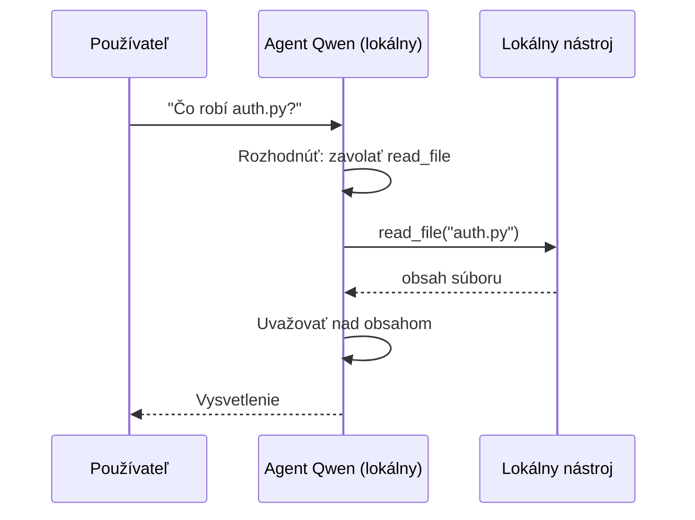
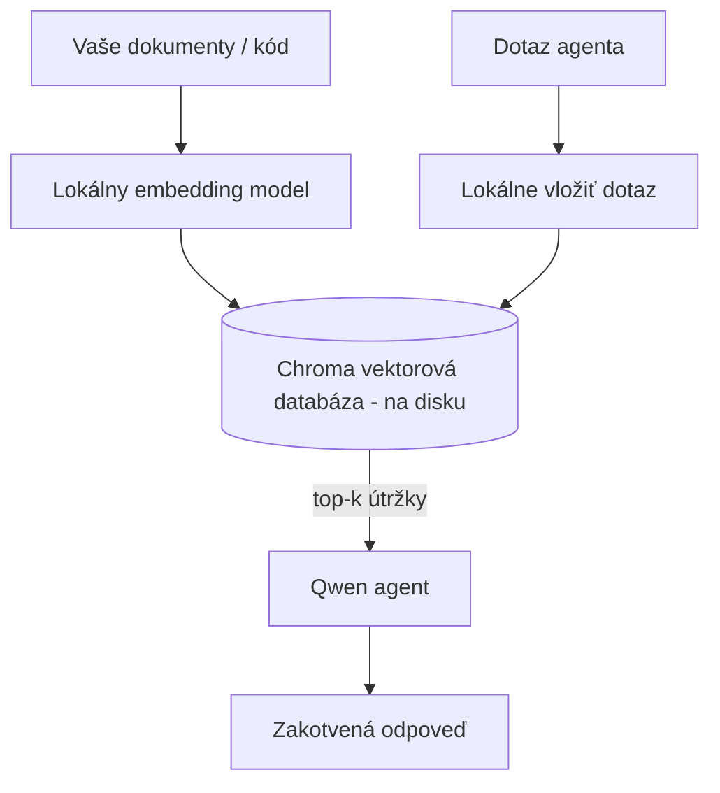
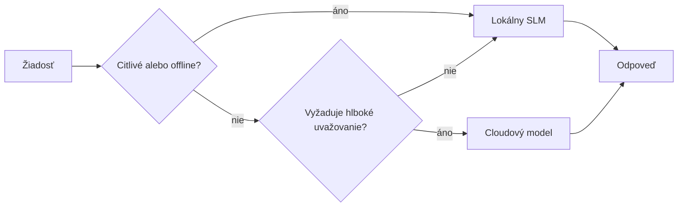

# Vytváranie lokálnych AI agentov pomocou Microsoft Foundry Local a Qwen


Predchádzajúca lekcia škálovala agentov *hore* do cloudu. Táto ich prináša *dole* na jeden stroj. Na konci budete mať fungujúceho inžinierskeho asistenta, ktorý rozmýšľa, volá nástroje, číta vaše súbory a vyhľadáva vo vašej dokumentácii — **bez jedinej cloudovej inferenčnej požiadavky.**

Prečo by ste to chceli? Tri dôvody, ktoré sa neustále objavujú v reálnej inžinierskej práci:

- **Súkromie.** Kód a dokumenty nikdy neopúšťajú stroj. Žiadny prompt, žiadny snippet, žiadne zákaznícke dáta neprechádzajú cez sieťovú hranicu.
- **Náklady.** Lokálny inference nemá žiadnu fakturáciu za tokeny. Môžete iterovať celý deň za cenu elektriny.
- **Offline.** V lietadle, v bezpečnom zariadení alebo počas výpadku agent stále funguje.

Háčik je v tom, že vymieňate špičkový cloudový model za **Malý jazykový model (SLM)** bežiaci na vašom CPU, GPU alebo NPU. Táto lekcia je o budovaní agentov, ktorí sú *dobrí* v rámci tohto obmedzenia, namiesto predstierania, že toto obmedzenie neexistuje.

## Úvod

Táto lekcia pokryje:

- **Malé jazykové modely (SLM)** — čo sú, kde vynikajú a kde nie.
- **Microsoft Foundry Local** — runtime, ktorý sťahuje a poskytuje modely na zariadení cez **OpenAI-kompatibilné API**.
- **Qwen modely pre volanie funkcií** — SLM, ktoré spoľahlivo generujú volania nástrojov, čo umožňuje lokálnych *agentov* (nielen lokálny chat).
- **Lokálne nástroje, lokálny RAG a lokálny MCP** — dodávajú schopnosti agentovi bez cloudu.
- **Hybridné vzory** — kedy zostať lokálny a kedy siahnuť do cloudu.

## Ciele učenia

Po dokončení tejto lekcie budete vedieť:

- Vysvetliť kompromisy SLM a vybrať vhodné použitia lokálnych agentov.
- Poskytnúť Qwen model lokálne s Foundry Local a pripojiť sa k nemu cez OpenAI-kompatibilný endpoint.
- Postaviť agenta volajúceho nástroje, ktorý pracuje výhradne na vašom pracovnom stanici.
- Pridať lokálny RAG nad vlastnými dokumentmi pomocou lokálnej vektorovej databázy (Chroma).
- Pripojiť agenta na lokálny MCP server a rozmýšľať o hybridných lokálnych/cloudových návrhoch.

## Predpoklady

Táto lekcia predpokladá, že ste absolvovali predchádzajúce lekcie a ste pohodlní s:

- [Použitie nástrojov](../04-tool-use/README.md) (Lekcia 4) a [Agentic RAG](../05-agentic-rag/README.md) (Lekcia 5).
- [Agentic Protokoly / MCP](../11-agentic-protocols/README.md) (Lekcia 11).
- [Microsoft Agent Framework](../14-microsoft-agent-framework/README.md) (Lekcia 14).

Budete tiež potrebovať:

- Vývojársku pracovnú stanicu. **8 GB RAM je realistické minimum**; 16 GB a viac je pohodlné. GPU alebo NPU pomáhajú, ale nie sú povinné.
- **Microsoft Foundry Local** nainštalovaný (pozri sekciu nastavenia nižšie).
- Python 3.12+ a balíčky v repozitári [`requirements.txt`](../../../requirements.txt), plus `foundry-local-sdk`, `openai` a `chromadb` pre túto lekciu.

## Malé jazykové modely: Správny nástroj pre lokálnu prácu

Špičkový cloudový model má stovky miliárd parametrov a dátové centrum za sebou. SLM má pár miliárd parametrov a musí sa zmestiť do RAM vášho notebooku. Tento rozdiel nastavuje jasné očakávania.

**SLM sú dobré v:**

- Štruktúrovaných, ohraničených úlohách — klasifikácia, extrakcia, zhrnutie známeho dokumentu.
- **Volaní nástrojov** — rozhodovanie, ktorú funkciu zavolať a s akými argumentmi.
- Rýchlej, lacnej, súkromnej iterácii na vlastných dátach.

**SLM sú slabšie v:**

- Otvorenom, viacstupňovom uvažovaní cez veľký kontext.
- Širokých vedomostiach o svete (videli menej a viac zabúdajú).

Víťazná stratégia pre lokálnych agentov je teda: **nechajte SLM orchestrovať a nechajte nástroje robiť ťažkú prácu.** Model nemusí *poznať* váš kód; musí vedieť, kedy volať `read_file` a `search_docs`. To priamo hrá do silných stránok SLM.



## Microsoft Foundry Local

**Microsoft Foundry Local** je ľahký runtime, ktorý sťahuje, spravuje a poskytuje modely výhradne na vašom stroji. Jeho najdôležitejšou vlastnosťou pre nás je, že sprístupňuje **OpenAI-kompatibilný HTTP endpoint** — čo znamená, že OpenAI SDK a klient Microsoft Agent Frameworku pre OpenAI s ním pracujú len so zmenou `base_url`. Všetko, čo ste sa naučili o budovaní agentov, sa prenáša priamo; mení sa iba endpoint z cloudového na `localhost`.

Foundry Local tiež automaticky vyberie najlepší build modelu pre váš hardvér — CPU build, CUDA/GPU build alebo NPU build — takže nemusíte manuálne optimalizovať pre každý stroj.

### Nastavenie

Nainštalujte Foundry Local (pozrite si [dokumentáciu](https://learn.microsoft.com/azure/ai-foundry/foundry-local/) pre váš OS), potom potvrďte, že funguje:

```bash
# Inštalujte (napríklad; riaďte sa dokumentáciou pre vašu platformu)
winget install Microsoft.FoundryLocal      # Windows
# brew install microsoft/foundrylocal/foundrylocal   # macOS

# Stiahnite a spustite model Qwen, potom spustite lokálnu službu
foundry model run qwen2.5-7b-instruct
foundry service status
```

Keď služba beží, máte lokálny OpenAI-kompatibilný endpoint (typicky `http://localhost:PORT/v1`). Notebok používa `foundry-local-sdk` na automatické zistenie endpointu, takže nemusíte tvrdoko kódovať port.

## Qwen volanie funkcií: Prečo je dôležité

Agent je agentom iba vtedy, ak dokáže volať nástroje. Mnohé SLM vedia chatovať, ale generujú nespoľahlivé, nesprávne volania nástrojov. **Qwen** modely sú trénované pre volanie funkcií a konzistentne generujú správne štruktúry volaní nástrojov — presne to premieňa lokálny chat model na lokálneho *agenta*.

Priebeh je štandardná slučka volania nástrojov, ktorú už poznáte, len beží na zariadení:



## Lokálny RAG

Vyhľadávanie v dokumentácii je miesto, kde lokálni agenti ukazujú svoju hodnotu. Namiesto spoliehania sa na to, že SLM si zapamätal dokumentáciu vášho frameworku, vložíte tieto dokumenty do **lokálnej vektorovej databázy** a necháte agenta vyhľadávať relevantné časti na požiadanie.

Používame **Chroma**, zabudovanú vektorovú databázu, ktorá beží v rámci procesu bez správy servera. Potrubie je úplne lokálne: lokálny embedding model → lokálne vektory → lokálne vyhľadávanie → lokálny SLM.



Toto je ten istý vzor Agentic RAG z Lekcie 5 — jediná zmena je, že každá súčasť beží na vašom stroji.

## Lokálne MCP servery

[MCP](../11-agentic-protocols/README.md) je transport, nie cloudová služba. MCP server môže bežať ako lokálny proces na `stdio`, sprístupňujúc nástroje agentovi cez štandardný protokol. To umožňuje znovuvyužitie rastúcej ekosystému MCP serverov — prístup k súborovému systému, git operácie, dopyty do databázy — výhradne offline.

Bezpečnostná pozícia je iná ako v cloude, ale nie absentná: lokálny MCP server stále beží s oprávneniami vášho používateľa, preto ohraničte jeho dosah (napríklad na adresár projektu, nie na celý domovský adresár) a považujte jeho výstupy za vstupy, ktoré je potrebné overiť.

## Hybridné cloudové a lokálne vzory

Lokálne prioritné neznamená len lokálne. Zrelé systémy smerujú podľa citlivosti a náročnosti:

| Situácia | Kde beží |
| --- | --- |
| Citlivý kód / dáta, alebo offline | **Lokálny SLM** |
| Jednoduchá, ohraničená úloha | **Lokálny SLM** (lacný, rýchly) |
| Náročné viacstupňové uvažovanie o necitlivých dátach | **Cloudový model** |
| Všetko počas výpadku | **Lokálny SLM** (jemné degradovanie) |

Toto odráža myšlienku **modelového smerovania** z Lekcie 16 — s tým rozdielom, že jeden z „modelov“ je teraz váš vlastný stroj. Robustný dizajn sa vracia k lokálnemu modelu, keď cloud nie je dostupný, takže agent degraduje kvalitu namiesto úplného zlyhania.



## Praktická cvičenie: Lokálny inžiniersky asistent

Otvorte [`code_samples/17-local-agent-foundry-local.ipynb`](./code_samples/17-local-agent-foundry-local.ipynb) a prejdite si ho. Postavíte **lokálneho inžinierskeho asistenta**, ktorý beží výhradne na vašom pracovnom stanici a môže:

1. **Volá nástroje** — cez Qwen volanie funkcií cez Foundry Local.
2. **Vykonáva lokálne operácie so súbormi** — zoznamuje a číta súbory v adresári projektu.
3. **Analyzuje kód** — hlási základné metriky o zdrojovom súbore.
4. **Vyhľadáva v dokumentácii** — lokálny RAG nad priečinkom s dokumentáciou pomocou Chromy.
5. **Používa MCP** — pripojí sa na lokálny MCP server (s jemným preskočením ak nie je konfigurovaný).

Žiadna cloudová inference sa nikde nepoužíva.

### Prechod krok za krokom

Asistent sa pripája k Foundry Local cez OpenAI-kompatibilný endpoint, takže kód agenta vyzerá takmer rovnako ako v cloudových lekciách — mení sa iba klient:

```python
from foundry_local import FoundryLocalManager
from openai import OpenAI

# Foundry Local objavuje/stiahne model a poskytuje nám lokálny koncový bod.
manager = FoundryLocalManager(\"qwen2.5-7b-instruct\")
client = OpenAI(base_url=manager.endpoint, api_key=manager.api_key)  # api_key je lokálna zástupná hodnota
```

Nástroje sú obyčajné Python funkcie ohraničené na adresár projektu:

```python
def read_file(path: str) -> str:
    \"\"\"Read a file, but only inside the sandboxed project directory.\"\"\"
    full = (PROJECT_ROOT / path).resolve()
    if PROJECT_ROOT not in full.parents and full != PROJECT_ROOT:
        return \"Access denied: path is outside the project directory.\"
    return full.read_text(encoding=\"utf-8\")
```

Pozor na kontrolu sandboxu — aj lokálne je nástroj, ktorý číta ľubovoľné cesty, rizikom. Notebok udržiava každý nástroj ohraničený na jeden koreň projektu.

## Overenie vedomostí

Otestujte svoje porozumenie pred prechodom na zadanie.

**1. Uveďte dva konkrétne dôvody, prečo spustiť agenta lokálne namiesto v cloude.**

<details>
<summary>Odpoveď</summary>

Ktorékoľvek dva z: **súkromie** (kód a dáta nikdy neopúšťajú zariadenie), **náklady** (žiadna fakturácia za tokeny), a **offline schopnosť** (funguje bez siete — v lietadle, v zabezpečenom zariadení alebo počas výpadku). Regulačné / súladové obmedzenia zakazujúce odosielanie dát mimo zariadenia sú častým dôvodom pre súkromie.
</details>

**2. Aké je odporúčané rozdelenie práce medzi SLM a jeho nástrojmi v lokálnom agentovi a prečo?**

<details>
<summary>Odpoveď</summary>

Nechajte SLM **orchestrovať** (rozhodovať, ktorý nástroj volať a s akými argumentmi) a nechajte **nástroje robiť ťažkú prácu** (čítanie súborov, vyhľadávanie dokumentov, výpočty výsledkov). SLM sú silné v ohraničených rozhodnutiach ako výber nástroja, ale slabšie v širokých vedomostiach a dlhom viacstupňovom uvažovaní, preto spoliehanie sa na nástroje hrá do ich silných stránok.
</details>

**3. Čo umožňuje znovuvyužiť cloudový kód agenta s Foundry Local?**

<details>
<summary>Odpoveď</summary>

Foundry Local sprístupňuje **OpenAI-kompatibilný HTTP endpoint**. OpenAI SDK a OpenAI klient Agent Frameworku s ním pracujú len so zmenou `base_url` (a s použitím lokálneho placeholder API kľúča). Všetko ostatné v kóde agenta zostáva rovnaké.
</details>

**4. Prečo teda špecificky používame Qwen model pre volanie funkcií namiesto hocijakého SLM?**

<details>
<summary>Odpoveď</summary>

Pretože agent musí produkovať spoľahlivé, dobre formátované **volania nástrojov**. Mnohé SLM vedia chatovať, ale emitujú nesprávne alebo nekonzistentné štruktúry volania nástrojov. Qwen modely sú trénované pre volanie funkcií a produkujú konzistentné volania nástrojov, čo premieňa lokálny chat model na fungujúceho lokálneho agenta.
</details>

**5. Ktoré komponenty bežia na stroji v lokálnom RAG potrubí?**

<details>
<summary>Odpoveď</summary>

Všetky: embedding model, vektorová databáza (Chroma, na disku), vyhľadávací krok a SLM. Dokumenty sa vkladajú lokálne, ukladajú lokálne, vyhľadávajú lokálne a spracovávajú lokálnym modelom — žiadna súčasť sa nedotýka cloudu.
</details>

**6. Lokálny MCP server beží na vašom stroji. Znamená to automaticky, že je bezpečný? Aké opatrenie by ste mali stále dodržiavať?**

<details>
<summary>Odpoveď</summary>

Nie. Lokálny MCP server beží s oprávneniami vášho používateľa, takže môže pristupovať k čomukoľvek, ku čomu máte prístup vy. Ohradte ho na to, čo potrebuje (napríklad adresár projektu namiesto celého domovského adresára) a považujte jeho výstupy za vstupy, ktoré treba validovať pred ich použitím.
</details>

**7. Opíšte rozumné pravidlo hybridného smerovania, ktoré zahŕňa lokálny model.**

<details>
<summary>Odpoveď</summary>

Smerujte citlivé alebo offline požiadavky na lokálny SLM; jednoduché ohraničené úlohy smerujte na lokálny SLM kvôli rýchlosti a nákladom; náročné viacstupňové uvažovanie o necitlivých dátach na cloudový model; a v prípade nedostupnosti cloudu sa vráťte k lokálnemu SLM, aby agent degradoval jemne namiesto zlyhania. Toto je modelové smerovanie (Lekcia 16) so súčasťou lokálneho stroja ako jedným z modelov.
</details>

**8. Aký je realistický minimálny RAM údaj pre spustenie lokálneho agenta v tejto lekcii a čo vám dáva viac RAM?**

<details>
<summary>Odpoveď</summary>

Okolo **8 GB** je realistické minimum; 16 GB a viac je pohodlné. Viac RAM umožňuje spustiť väčšie, schopnejšie modely a udržať v pamäti viac kontextu. GPU alebo NPU zrýchľujú inferenciu, ale nie sú povinné — Foundry Local vyberie CPU build, keď nie je k dispozícii žiaden akcelerátor.
</details>

## Zadanie

Rozšírte lokálneho inžinierskeho asistenta o **lokálneho kontrolóra dokumentácie** pre malý projekt podľa vlastného výberu (môžete použiť jeden z priečinkov lekcií v tomto repozitári).

Vaša odovzdaná práca by mala:

1. **Indexovať skutočný dokumentačný/kódový priečinok** do Chromy (aspoň päť súborov).
2. **Pridať nástroj `find_todos`** ktorý prehľadá projekt kvôli komentárom `TODO`/`FIXME` a vráti ich spolu so súborom a číslom riadku — s rovnakou kontrolou sandboxu ako `read_file`.

3. **Opýtajte sa agenta tri otázky**, ktoré ho prinútia kombinovať nástroje: jednu čistú RAG otázku, jednu vyžadujúcu čítanie konkrétneho súboru a jednu, ktorá vyžaduje hľadanie TODO.
4. **Zmerajte to**: zaznamenajte čas každej z troch odpovedí v markdown bunke. Zhodnoťte, či je latencia prijateľná pre váš zamýšľaný pracovný tok.

Potom napíšte krátky odstavec o **tom, čo by ste presunuli do cloudu a čo by ste nechali lokálne** pre tohto recenzenta a prečo. Hodnotí sa, či sú lokálne komponenty správne prepojené a či je vaše hybridné uvažovanie správne — nie kvalita modelu.

## Zhrnutie

V tejto lekcii ste vytvorili agenta, ktorý beží úplne na vašom vlastnom zariadení:

- **SLM** obetujú šírku záberu za súkromie, náklady a offline prevádzku — a vynikajú, keď **orchestruja nástroje** namiesto toho, aby mali všetky vedomosti sami.
- **Foundry Local** poskytuje modely na zariadení za **OpenAI-kompatibilným endpointom**, takže váš cloudový kód agenta sa prenáša zmenou jedného riadku.
- **Qwen modely s volaním funkcií** umožňujú spoľahlivé lokálne volanie nástrojov — a teda aj lokálnych *agentov*.
- **Lokálny RAG** (Chroma) a **lokálny MCP** dávajú agentovi schopnosti bez opustenia zariadenia.
- **Hybridné vzory** vám umožňujú smerovať podľa citlivosti a náročnosti, kde lokálne slúži ako elegantný záložný plán.

Toto uzatvára nasadzovací oblúk: Lekcia 16 škálovala agentov do Microsoft Foundry a táto lekcia ich zmenšila na jedno pracovisko. Nasledujúca lekcia sa venuje zabezpečeniu nasadených agentov.

## Dodatočné zdroje

- <a href="https://learn.microsoft.com/azure/ai-foundry/foundry-local/" target="_blank">Dokumentácia Microsoft Foundry Local</a>
- <a href="https://learn.microsoft.com/azure/ai-foundry/what-is-azure-ai-foundry" target="_blank">Dokumentácia Microsoft Foundry</a>
- <a href="https://learn.microsoft.com/en-us/agent-framework/overview/?wt.mc_id=youtube_26688_organicsocial_reactor&pivots=programming-language-python" target="_blank">Microsoft Agent Framework</a>
- <a href="https://qwen.readthedocs.io/en/latest/framework/function_call.html" target="_blank">Dokumentácia Qwen funkčného volania</a>
- <a href="https://modelcontextprotocol.io/" target="_blank">Model Context Protocol (MCP)</a>
- <a href="https://docs.trychroma.com/" target="_blank">Chroma vektorová databáza</a>

## Predchádzajúca lekcia

[Nasadzovanie škálovateľných agentov](../16-deploying-scalable-agents/README.md)

## Nasledujúca lekcia

[Zabezpečenie AI agentov](../18-securing-ai-agents/README.md)

---

<!-- CO-OP TRANSLATOR DISCLAIMER START -->
**Vyhlásenie o zodpovednosti**:
Tento dokument bol preložený pomocou AI prekladateľskej služby [Co-op Translator](https://github.com/Azure/co-op-translator). Hoci sa snažíme o presnosť, vezmite prosím na vedomie, že automatické preklady môžu obsahovať chyby alebo nepresnosti. Pôvodný dokument v jeho natívnom jazyku by mal byť považovaný za autoritatívny zdroj. Pre kritické informácie sa odporúča profesionálny ľudský preklad. Nie sme zodpovední za žiadne nedorozumenia alebo nesprávne interpretácie vyplývajúce z použitia tohto prekladu.
<!-- CO-OP TRANSLATOR DISCLAIMER END -->