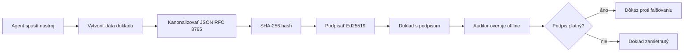
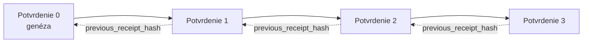

[Pozrite si video lekcie: Zaistenie AI agentov kryptografickými potvrdeniami](https://youtu.be/PLACEHOLDER_VIDEO_ID)

> _(Video lekcie a náhľad bude pridaný tímom Microsoft pre obsah po zlúčení, zodpovedajúci vzoru lekcií 14 / 15.)_

# Zaistenie AI agentov kryptografickými potvrdeniami

## Úvod

Táto lekcia pokryje:

- Prečo sú auditné stopy AI agentov dôležité pre súlad, ladenie a dôveru.
- Čo je kryptografické potvrdenie a ako sa líši od nepodpísaného záznamu.
- Ako vytvoriť podpísané potvrdenie pre volanie nástroja agenta v čistom Pythone.
- Ako overiť potvrdenie offline a odhaliť manipuláciu.
- Ako spájať potvrdenia tak, aby ich odstránenie alebo preusporiadanie porušilo reťazec.
- Čo potvrdenia dokazujú a čo explicitne nedokazujú.

## Ciele učenia

Po dokončení tejto lekcie budete vedieť:

- Identifikovať režimy zlyhania, ktoré motivujú kryptografickú pôvodnosť akcií agenta.
- Vytvoriť potvrdenie podpísané Ed25519 nad kanonickým JSON payloadom.
- Nezávisle overiť potvrdenie iba pomocou verejného kľúča podpisovateľa.
- Detekovať manipuláciu opakovaným overením upraveného potvrdenia.
- Vytvoriť hashovo-reťazený sled potvrdení a vysvetliť, prečo je reťazec dôležitý.
- Rozpoznať hranicu medzi tým, čo potvrdenia dokazujú (priradenie, integrita, usporiadanie) a čo nedokazujú (správnosť akcie, správnosť politiky).

## Problém: Auditná stopa vášho agenta

Predstavte si, že ste nasadili AI agenta pre Contoso Travel. Agent číta požiadavky zákazníkov, volá API letov na vyhľadanie možností a rezervuje miesta v mene zákazníka. Minulý štvrťrok agent spracoval 50 000 rezervácií.

Dnes príde auditor. Položí jednoduchú otázku: "Ukážte mi, čo váš agent robil."

Odovzdáte mu svoje logy. Auditor ich prezerá a kladie ťažšiu otázku: "Ako viem, že tieto záznamy neboli upravované?"

Toto je problém auditnej stopy. Väčšina dnes nasadených agentov sa spolieha na:

- **Aplikačné logy**: písané samotným agentom, upraviteľné kýmkoľvek s prístupom k súborovému systému.
- **Cloudové logovacie služby**: na platformovej úrovni súdeľné voči manipulácii, ale len ak auditor dôveruje prevádzkovateľovi platformy.
- **Logy databázových transakcií**: vhodné pre zmeny v databáze, ale nie na ľubovoľné volania nástrojov.

Žiadny z týchto prístupov nemôže odpovedať na otázku auditora bez toho, aby auditor dôveroval niekomu (vám, vášmu cloudovému poskytovateľovi, dodávateľovi databázy). Pre interné použitie je táto dôvera často prijateľná. Pre regulované pracovné zaťaženia (financie, zdravotníctvo, čokoľvek podliehajúce Európskemu zákonu o AI) nie.

Kryptografické potvrdenia riešia tento problém tým, že každú akciu agenta robia nezávisle overiteľnou. Auditor vám nemusí dôverovať. Potrebuje iba váš verejný kľúč a samotné potvrdenie.

## Čo je kryptografické potvrdenie?

Potvrdenie je JSON objekt, ktorý zaznamenáva, čo agent urobil, podpísaný digitálnym podpisom.



Minimálne potvrdenie vyzerá takto:

```json
{
  "type": "agent.tool_call.v1",
  "agent_id": "contoso-travel-bot",
  "tool_name": "lookup_flights",
  "tool_args_hash": "sha256:a3f9c1...",
  "result_hash": "sha256:7b2e1d...",
  "policy_id": "contoso-travel-policy-v3",
  "timestamp": "2026-04-25T14:30:00Z",
  "sequence": 47,
  "previous_receipt_hash": "sha256:9d4e6a...",
  "signature": {
    "alg": "EdDSA",
    "sig": "c5af83...",
    "public_key": "8f3b2c..."
  }
}
```

Tri vlastnosti vykonávajú prácu:

1. **Podpis**. Potvrdenie je podpísané bránou agenta pomocou súkromného kľúča Ed25519. Ktorýkoľvek držiteľ príslušného verejného kľúča môže offline overiť podpis. Akákoľvek manipulácia s ktorýmkoľvek poľom podpis zneplatní.

2. **Kanonické kódovanie**. Pred podpisom je potvrdenie serializované pomocou JSON Canonicalization Scheme (JCS, RFC 8785). Toto zabezpečuje, že dve implementácie produkujúce rovnaké logické potvrdenie vyprodukujú bajtovo identický výstup. Bez kanonizácie by rôzne JSON serializéry vytvorili rôzne podpisy pre ten istý obsah.

3. **Hashové reťazenie**. Pole `previous_receipt_hash` prepája každé potvrdenie s tým predchádzajúcim. Odstránenie alebo preusporiadanie potvrdenia porušuje každé potvrdenie za ním. Manipulácia je viditeľná na úrovni reťazca, aj keď sa obíde jednotlivý podpis.

Tieto vlastnosti spoločne poskytujú tri garanty:

- **Priradenie**: tento kľúč podpísal tento obsah.
- **Integrita**: obsah sa od podpisu nezmenil.
- **Usporiadanie**: toto potvrdenie prišlo po tom potvrdení v reťazci.

## Vytvorenie potvrdenia v Pythone

Na vytvorenie potvrdenia nepotrebujete špeciálnu knižnicu. Kryptografické primitíva sú široko dostupné a logika zaberie niekoľko desiatok riadkov Python kódu.

Praktické cvičenia v `code_samples/18-signed-receipts.ipynb` prejdú úplný tok krok za krokom. Súhrnná verzia:

```python
import json
import hashlib
import base64
from nacl import signing
from jcs import canonicalize  # RFC 8785 kanonický JSON

def b64url_nopad(data: bytes) -> str:
    return base64.urlsafe_b64encode(data).decode("ascii").rstrip("=")

def sha256_canonical(obj) -> str:
    """SHA-256 of a Python object's JCS-canonical JSON form."""
    return f"sha256:{hashlib.sha256(canonicalize(obj)).hexdigest()}"

# Vygenerujte alebo načítajte podpisovací kľúč (v produkcii uložte v kľúčovej skrinke)
signing_key = signing.SigningKey.generate()
verify_key = signing_key.verify_key

# Vytvorte obsah príjmu (zatiaľ bez podpisu)
tool_args = {"origin": "SYD", "destination": "LAX"}
tool_result = [{"flight": "QF11", "price": 1850, "stops": 0}]

payload = {
    "type": "agent.tool_call.v1",
    "agent_id": "contoso-travel-bot",
    "tool_name": "lookup_flights",
    "tool_args_hash": sha256_canonical(tool_args),
    "result_hash": sha256_canonical(tool_result),
    "policy_id": "contoso-travel-policy-v3",
    "timestamp": "2026-04-25T14:30:00Z",
    "sequence": 0,
    "previous_receipt_hash": None,
}

# Kanonizujte, zahashujte, podpíšte.
canonical_bytes = canonicalize(payload)
message_hash = hashlib.sha256(canonical_bytes).digest()
signature_bytes = signing_key.sign(message_hash).signature

# Pripojte štruktúrovaný podpisový objekt.
receipt = {
    **payload,
    "signature": {
        "alg": "EdDSA",
        "sig": b64url_nopad(signature_bytes),
        "public_key": b64url_nopad(bytes(verify_key)),
    },
}
```

To je celý pipeline podpisovania. Cvičenia v notebooku podrobne vysvetľujú každý krok.

## Overovanie potvrdenia a odhaľovanie manipulácie

Overovanie je opačná operácia:

```python
import base64
import hashlib
from nacl import signing
from nacl.exceptions import BadSignatureError
from jcs import canonicalize

def b64url_decode(s: str) -> bytes:
    padding = "=" * ((4 - len(s) % 4) % 4)
    return base64.urlsafe_b64decode(s + padding)

def verify_receipt(receipt: dict) -> bool:
    # Podpis je štruktúrovaný objekt: {"alg", "sig", "public_key"}.
    sig_obj = receipt.get("signature")
    if not sig_obj or sig_obj.get("alg") != "EdDSA":
        return False

    # Zostavte späť obsah, ktorý bol skutočne podpísaný (všetko okrem podpisu).
    payload = {k: v for k, v in receipt.items() if k != "signature"}

    canonical_bytes = canonicalize(payload)
    message_hash = hashlib.sha256(canonical_bytes).digest()

    try:
        verify_key = signing.VerifyKey(b64url_decode(sig_obj["public_key"]))
        verify_key.verify(message_hash, b64url_decode(sig_obj["sig"]))
        return True
    except BadSignatureError:
        return False
```

Táto funkcia zoberie potvrdenie a vráti `True`, ak je podpis platný, inak `False`. Žiadne sieťové volanie, žiadna závislosť na službách, žiadna dôvera v tretiu stranu nie je potrebná.

Ak chcete vidieť odhaľovanie manipulácií v praxi, notebook prechádza:

1. Vytvorení platného potvrdenia a potvrdení, že sa overí.
2. Úprave jedného bajtu v poli `tool_args_hash`.
3. Opakovanom overení s neúspešným výsledkom.

Toto je praktická demonštrácia, že potvrdenia sú odhaľovateľné na manipuláciu: akákoľvek úprava, akokoľvek malá, porušuje podpis.

## Reťazenie potvrdení pre viacstupňových agentov

Jedno podpísané potvrdenie chráni jednu akciu. Reťaz potvrdení chráni postupnosť.



Každé potvrdenie zaznamenáva hash predchádzajúceho potvrdenia. Na tiché odstránenie potvrdenia 2 by útočník musel buď:

- Upraviť pole `previous_receipt_hash` v potvrdení 3 (čím by sa porušil podpis potvrdenia 3), ALEBO
- Vyrobiť nový podpis na upravenom potvrdení 3 (vyžaduje súkromný kľúč agenta).

Ak je súkromný kľúč uložený v hardvérovej bezpečnostnej peňaženke a verejný kľúč publikujete s každým potvrdením, žiadny z útokov nie je bez odhalenia možný.

Notebook prechádza:

1. Vytvorením reťazca troch potvrdení.
2. Overením, že `previous_receipt_hash` každého potvrdenia zodpovedá skutočnému hashu predchádzajúceho potvrdenia.
3. Manipuláciou s jedným potvrdením uprostred a pozorovaním, ako sa reťaz na tomto mieste poruší.

Takto vyrábate auditnú stopu, ktorú môže externý auditor nezávisle overiť bez potreby vám dôverovať.

## Čo potvrdenia dokazujú (a čo nie)

Toto je najdôležitejšia časť lekcie. Potvrdenia sú silné, ale ich sila je obmedzená.

**Potvrdenia dokazujú tri veci:**

1. **Priradenie**: konkrétny kľúč podpísal konkrétny obsah.
2. **Integritu**: obsah sa od podpisu nezmenil.
3. **Usporiadanie**: toto potvrdenie prišlo po inom potvrdení v hash reťazci.

**Potvrdenia NEDOKAZUJÚ:**

1. **Správnosť**: že akcia agenta bola správna. Potvrdenie môže byť podpísané rovnako čisto pre nesprávnu odpoveď ako pre správnu.
2. **Súlad s politikou**: že politika uvedená v `policy_id` bola naozaj vyhodnotená, alebo že by túto akciu povolila, keby bola overená. Potvrdenie zaznamenáva, čo bolo tvrdené, nie, čo bolo vynútené.
3. **Identitu okrem kľúča**: potvrdenie hovorí "tento kľúč podpísal tento obsah." Nehovorí "tento človek to autorizoval." Prepojenie kľúča s osobou alebo organizáciou vyžaduje samostatnú identitnú infraštruktúru (adresár, register verejných kľúčov atď.).
4. **Pravdivosť vstupov**: ak agent dostane zmanipulovaný prompt a podľa neho koná, potvrdenie verne zaznamenáva akciu. Potvrdenia sú za hranicou validácie vstupov, nie ich náhradou.

Táto hranica je dôležitá z dvoch dôvodov:

- Ukazuje, na čo sú potvrdenia užitočné: robia správanie agenta auditovateľným a odhaľovateľným na manipuláciu, aj cez organizačné hranice.
- Ukazuje, aké ďalšie vrstvy stále potrebujete: validáciu vstupov (lekcia 6), vynucovanie politiky (krátko spomenuté nižšie) a identitnú infraštruktúru (mimo rozsah tejto lekcie).

Bežnou chybou je predpokladať, že "máme potvrdenia" znamená "sme riadení." To nie je pravda. Potvrdenia sú základom. Riadenie je systém, ktorý na nich staviate.

## Produkčné referencie

Python kód v tejto lekcii je zámerne minimalistický, aby ste mohli prečítať každý riadok a presne pochopiť, čo sa deje. V produkcii máte dve možnosti:

1. **Stavať priamo na kryptografických primitívach.** Tých 50 riadkov vyššie je postačujúcich pre mnoho prípadov použitia. PyNaCl (Ed25519) a balík `jcs` (kanonický JSON) sú dobre udržiavané a auditované knižnice.

2. **Použiť produkčnú knižnicu na potvrdenia.** Niekoľko open-source projektov implementuje rovnaký vzor s ďalšími funkciami (rotácia kľúčov, hromadné overovanie, distribúcia JWK Set, integrácia s politickými enginmi):
   - Formát potvrdenia použitý v tejto lekcii vychádza z IETF Internet-Draft (`draft-farley-acta-signed-receipts`), ktorý je momentálne v štádiu štandardizácie.
   - Microsoft Agent Governance Toolkit skladá potvrdenia s rozhodnutiami politiky založenými na Cedar; pozrite si Tutorial 33 v tomto repozitári pre ukážku end-to-end.
   - Balíky `protect-mcp` (npm) a `@veritasacta/verify` (npm) poskytujú implementáciu podpisovania potvrdení a offline overovanie v Node.js, určenú na ovinutie ľubovoľného MCP servera auditnou stopou odhaľujúcou manipulácie.
   - **[nobulex](https://github.com/arian-gogani/nobulex)** Python SDK (`pip install nobulex`) poskytuje rovnaký vzor podpisovania Ed25519 + JCS v Pythone s integráciou LangChain a CrewAI, vrátane publikovaných medzi-validation testovacích vektorov a mapovania súladu prispôsobeného cez [OWASP PR #2210](https://github.com/OWASP/CheatSheetSeries/pull/2210).

Rozhodnutie medzi vlastnou implementáciou a použitím knižnice je podobné rozhodnutiu medzi písaním vlastnej knižnice JWT alebo použitím overenej: oba prístupy sú rozumné; knižnica šetrí čas a redukuje auditné povrchy; cesta od základov vás núti ovládať každý primitív. Táto lekcia učí cestu od základov, aby ste mali pevný základ na obe možnosti.

## Overenie znalostí

Otestujte si porozumenie pred presunom na praktické cvičenie.

**1. Potvrdenie je podpísané súkromným Ed25519 kľúčom agenta. Auditor má iba verejný kľúč. Môže auditor potvrdenie overiť offline?**

<details>
<summary>Odpoveď</summary>

Áno. Overenie Ed25519 vyžaduje iba verejný kľúč a podpísané bajty. Žiadne sieťové volania, žiadne závislosti na službách. Táto vlastnosť robí potvrdenia užitočnými v prostrediach s odpojením od siete, viac-organizačnými alebo s nízkou dôverou.
</details>

**2. Útočník upraví pole `policy_id` potvrdenia, aby tvrdošil, že bolo riadené voľnejšou politikou. Podpis bol urobený nad pôvodným payloadom. Čo sa stane pri overení?**

<details>
<summary>Odpoveď</summary>

Overenie zlyhá. Podpis bol vytvorený nad kanonickými bajtmi pôvodného payloadu; úprava ktoréhokoľvek poľa zmení kanonické bajty, čím sa zmení SHA-256 hash, a podpis sa stáva neplatným. Útočník by potreboval súkromný kľúč na vytvorenie novej platnej podpísanej verzie, čo nemá.
</details>

**3. Prečo potvrdenie obsahuje `tool_args_hash` a `result_hash` namiesto surových argumentov a výsledku?**

<details>
<summary>Odpoveď</summary>

Dva dôvody. Prvý, potvrdenie môže byť archivované alebo prenášané v prostredí, kde únik surového obsahu (osobné údaje, obchodné dáta) je problém. Hashovanie udržiava potvrdenie malé a obsah súkromný; auditor overuje hash s oddelene uloženou kópiou skutočného obsahu. Druhý, hashe majú pevnú veľkosť; potvrdenie s hashmi má veľkosť ohraničenú bez ohľadu na veľkosť vstupov a výstupov.
</details>

**4. Pole `previous_receipt_hash` prepája každé potvrdenie s jeho predchodcom. Ak útočník ticho vymaže jedno potvrdenie uprostred reťazca, čo sa stane neplatným?**

<details>
<summary>Odpoveď</summary>

Každé potvrdenie, ktoré prišlo po vymazanom. Ich polia `previous_receipt_hash` už nezodpovedajú skutočnému reťazcu (pretože potvrdenie, ktoré odkazovali, neexistuje, alebo reťaz teraz smeruje na iného predchodcu). Na zakrytie vymazania by útočník musel každý neskorší podpísať znova, čo vyžaduje súkromný kľúč.
</details>

**5. Potvrdenie sa overí úspešne. Dokazuje to, že akcia agenta bola správna, primeraná alebo v súlade s politikou?**

<details>
<summary>Odpoveď</summary>

Nie. Platné potvrdenie dokazuje tri veci: priradenie (tento kľúč podpísal tento obsah), integritu (obsah sa nezmenil) a usporiadanie (toto potvrdenie prišlo po inom). Nedokazuje, že akcia bola správna, že politika uvedená v `policy_id` bola naozaj vyhodnotená alebo že agent dodržiaval všetky pravidlá. Potvrdenia robia správanie agenta auditovateľným, nie nevyhnutne správnym. Toto je najdôležitejšia hranica lekcie.
</details>

## Praktické cvičenie

Otvorte `code_samples/18-signed-receipts.ipynb` a dokončite všetky štyri sekcie:

1. **Sekcia 1**: Podpíšte svoje prvé potvrdenie a overte ho.
2. **Sekcia 2**: Manipulujte s potvrdením a sledujte neúspešné overenie.
3. **Sekcia 3**: Vytvorte reťaz troch potvrdení a overte integritu reťazca.
4. **Sekcia 4**: Aplikujte vzor na agenta postaveného na Microsoft Agent Framework: obalte volanie nástroja podpisovaním potvrdenia a potom overte potvrdenie nezávisle.
**Výzva navyše 1:** rozšírte schému príjmu o ďalšie pole podľa vlastného výberu (napríklad identifikátor požiadavky na trasovanie), aktualizujte kanonickú logiku podpisovania tak, aby ho zahŕňala, a potvrďte, že príjem sa stále úspešne overí. Potom pole po podpise zmeňte a potvrďte, že overenie zlyhá. To vás prinúti pochopiť, ako každý bajt kanonického kódovania prispieva k podpisu.

**Výzva navyše 2:** vytvorte SHA-256 hash dvoch svojich príjmov naraz (v deterministickom poradí zreťazte ich kanonické bajty) a vložte výsledný digest ako nové pole do tretieho príjmu pred jeho podpísaním. Overte, že všetky tri príjmy sa stále úspešne overia. Práve ste vytvorili dôkaz zahrnutia v jednom kroku: ktokoľvek, kto má tretí príjem, môže dokázať, že prvé dva existovali v čase jeho podpísania bez potreby odhaliť ich obsah. Toto je vzor, ktorý používajú príjmy selektívneho zverejnenia vo veľkom meradle (Merkle záväzky, RFC 6962).

## Záver

Kryptografické príjmy poskytujú AI agentom auditnú stopu, ktorá je:

- **Nezávisle overiteľná:** každá strana s verejným kľúčom môže overiť, žiadna závislosť na službách.
- **Zreteľná voči pozmeneniu:** akákoľvek úprava zneplatní podpis.
- **Prenositeľná:** príjem je malý JSON súbor; môže sa archivovať, prenášať a overovať kdekoľvek.
- **Zladená so štandardmi:** postavená na Ed25519 (RFC 8032), JCS (RFC 8785) a SHA-256, všetky široko používané primitíva.

Nie sú náhradou za validáciu vstupov, presadzovanie politík ani identitnú infraštruktúru. Sú základom pre tieto vrstvy. Keď nasadzujete agentov do regulovaných pracovných záťaží, viacorganizačných workflowov alebo akéhokoľvek prostredia, kde budúci audítor nemôže predpokladať, že vám dôveruje, príjmy sú spôsob, ako udržať auditnú stopu čestnú.

Najdôležitejšie zhrnutie: príjmy dokazujú, kto čo povedal a kedy. Nedokazujú, že to, čo bolo povedané, je pravda alebo správne. Držte toto rozlíšenie pevne. Je to rozdiel medzi čestným systémom pôvodu a zavádzajúcim.

## Produkčný kontrolný zoznam

Keď ste pripravení prejsť z tejto lekcie na nasadenie agentov s podpísanými príjmami v reálnom prostredí:

- [ ] **Presuňte podpisový kľúč zo svojho vývojárskeho laptopu.** Použite Azure Key Vault, AWS KMS alebo hardvérový bezpečnostný modul. Súkromný kľúč, ktorý podpisuje vaše príjmy, nesmie nikdy byť v zdrojovom kóde ani v čitateľnej forme na aplikačných zariadeniach.
- [ ] **Zverejnite verejný kľúč na overenie.** Audítori ho potrebujú na offline overovanie. Štandardný vzor je JWK Set na dobre známom URL (RFC 7517), napríklad `https://your-org.example.com/.well-known/agent-keys.json`.
- [ ] **Externé ukotvenie reťazca.** Pravidelne zapisujte najnovší hash hlavy reťazca do transparetného logu (Sigstore Rekor, RFC 3161 timestamp authority alebo ďalší interný systém), aby externá strana mohla potvrdiť „tento reťazec existoval v danom čase“.
- [ ] **Ukladajte príjmy nemenným spôsobom.** Ako úložisko iba na dopĺňanie (Azure Storage s politikami nemennosti, AWS S3 Object Lock), ktoré zabráni vnútornému používateľovi prepísať históriu na úrovni úložiska.
- [ ] **Rozhodnite o dobe uchovávania.** Mnohé regulačné režimy vyžadujú viacročné uchovávanie. Naplánujte rast príjmov (každý príjem má približne 500 bajtov; agent vykonávajúci 10 000 volaní denne vyprodukuje približne 1,8 GB ročne).
- [ ] **Zdokumentujte, čo príjmy nezahŕňajú.** Príjmy dokazujú atribúciu, integritu a poradie. Váš runbook by mal výslovne uvádzať, aké ďalšie kontroly (validácia vstupov, presadzovanie politík, obmedzovanie tempa, identitná infraštruktúra) sú vedľa príjmov vo vašej správe súladu.

### Máte ďalšie otázky o zabezpečení AI agentov?

Pridajte sa k [Microsoft Foundry Discord](https://aka.ms/ai-agents/discord), aby ste sa stretli s ďalšími študentmi, zúčastnili sa konzultačných hodín a získali odpovede na svoje otázky o AI agentoch.

## Za touto lekciou

Táto lekcia pokrýva podpisovanie jedného príjmu a hashovo reťazené sekvencie. Rovnaké primitíva sa skladajú do viacerých pokročilejších vzorov, na ktoré môžete naraziť, keď sa vaša správa o vládnutí vyvinie:

- **Selektívne zverejnenie.** Keď sú polia príjmu nezávisle viazané (Merkle strom v štýle RFC 6962), môžete odhaliť konkrétne polia konkrétnym audítorom a dokázať, že ostatné sú nezmenené bez ich odhalenia. Užitočné, keď ten istý príjem musí spĺňať komplexný audit (ktorý chce úplnosť) a regulácie minimalizácie údajov ako GDPR (ktoré chcú, aby auditor videl čo najmenej).
- **Odvolanie príjmu.** Ak je kompromitovaný podpisový kľúč, potrebujete spôsob, ako od určitého času označiť všetky príjmy podpísané týmto kľúčom ako nedôveryhodné. Štandardné vzory: krátkodobé podpisové kľúče plus zverejnený zoznam odvolaní, alebo transparentný log s odvolávacími položkami.
- **Obojsmerné / rozdelené podpisové príjmy.** Niektoré implementácie rozdeľujú podpisovanú záťaž na predvykonávaciu (`authorization_*`) a po vykonaní (`result_*`) polovicu s nezávislými podpismi, užitočné, keď rozhodnutie o autorizácii a pozorovaný výsledok sú produkované rôznymi aktérmi alebo v rôznych časoch. Toto sa additívne skladá na formát príjmu vyučovaný v tejto lekcii.
- **Zloženie záťaže.** Príjem zapečatia akékoľvek bajty, ktoré vložíte do `result_hash`. Reálne záťaže sú často bohatšie ako výsledok jediného nástroja: predrozhodovacie úvahy (predpoveď modelu, zvážené možnosti, dôkazy a ich úplnosť, riziková pozícia, reťaz zodpovednosti, výsledok brány) môžu všetky žiť v záťaži, zapečatenej jediným príjmom. Toto udržiava formát príjmu minimálny a zároveň umožňuje vývoj schém domény po doméne.
- **Medziimplementačná zhoda.** Viac nezávislých implementácií toho istého formátu príjmu (Python, TypeScript, Rust, Go) medzi seba verifikuje na spoločných testovacích vektoroch. Ak si vytvoríte vlastnú implementáciu, validácia podľa zverejnených vektorov potvrdí kompatibilitu na úrovni drôtu.
- **Migrácia po kvantovej ére.** Ed25519 je dnes široko používaný, no nie je kvantovo odolný. Formát príjmu je algoritmicky agilný: pole `signature.alg` môže niesť `ML-DSA-65` (štandard NIST pre post-kvantový podpis), keď budete potrebovať migráciu. Plánujte pre prechodné obdobie, počas ktorého budú príjmy podpísané dvojito.

## Ďalšie zdroje

- <a href="https://datatracker.ietf.org/doc/draft-farley-acta-signed-receipts/" target="_blank">IETF Internet-Draft: Podpísané rozhodovacie príjmy pre strojové riadenie prístupu</a>
- <a href="https://learn.microsoft.com/azure/ai-studio/responsible-use-of-ai-overview" target="_blank">Prehľad zodpovedného používania AI (Azure AI)</a>
- <a href="https://datatracker.ietf.org/doc/html/rfc8032" target="_blank">RFC 8032: Digitálny podpis založený na Edwardsovej krivke (EdDSA)</a>
- <a href="https://datatracker.ietf.org/doc/html/rfc8785" target="_blank">RFC 8785: Schéma kanonizácie JSON (JCS)</a>
- <a href="https://datatracker.ietf.org/doc/html/rfc6962" target="_blank">RFC 6962: Priehľadnosť certifikátov</a> (Merkle strom používaný v príjmoch selektívneho zverejnenia)
- <a href="https://github.com/microsoft/agent-governance-toolkit/blob/main/docs/tutorials/33-offline-verifiable-receipts.md" target="_blank">Microsoft Agent Governance Toolkit, Tutorial 33: Offline overiteľné rozhodovacie príjmy</a>
- <a href="https://github.com/ScopeBlind/agent-governance-testvectors" target="_blank">Testovacie vektory pre medziimplementačnú zhodu</a> formátu príjmu použitého v tejto lekcii (Apache-2.0)
- <a href="https://pynacl.readthedocs.io/" target="_blank">Dokumentácia PyNaCl</a> (Ed25519 v Pythone)

## Predchádzajúca lekcia

[Budovanie agentov na použitie počítača (CUA)](../15-browser-use/README.md)

## Nasledujúca lekcia

_(Bude určené správcami kurikula)_

---

<!-- CO-OP TRANSLATOR DISCLAIMER START -->
**Vyhlásenie o zodpovednosti**:
Tento dokument bol preložený pomocou AI prekladateľskej služby [Co-op Translator](https://github.com/Azure/co-op-translator). Hoci sa snažíme o presnosť, vezmite prosím na vedomie, že automatické preklady môžu obsahovať chyby alebo nepresnosti. Pôvodný dokument v jeho natívnom jazyku by mal byť považovaný za autoritatívny zdroj. Pre kritické informácie sa odporúča profesionálny ľudský preklad. Nie sme zodpovední za žiadne nedorozumenia alebo nesprávne interpretácie vyplývajúce z použitia tohto prekladu.
<!-- CO-OP TRANSLATOR DISCLAIMER END -->