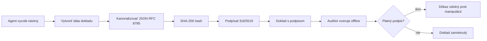
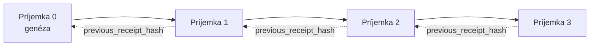

[Pozrite si video lekcie: Zabezpečenie AI agentov pomocou kryptografických potvrdení](https://youtu.be/PLACEHOLDER_VIDEO_ID)

> _(Video lekcie a miniatúra budú pridané tímom Microsoftu po zlúčení, v súlade so vzorom lekcie 14 / 15.)_

# Zabezpečenie AI agentov pomocou kryptografických potvrdení

## Úvod

Táto lekcia pokrýva:

- Prečo sú audítorské stopy AI agentov dôležité pre súlad, ladenie a dôveru.
- Čo je kryptografické potvrdenie a ako sa líši od nepodpísaného riadku protokolu.
- Ako vytvoriť podpísané potvrdenie o volaní nástroja agenta v obyčajnom Pythone.
- Ako overiť potvrdenie offline a zistiť manipuláciu.
- Ako spájať potvrdenia do reťazca tak, že odstránenie alebo preusporiadanie jedného poruší reťazec.
- Čo potvrdenia dokazujú a čo explicitne nedokazujú.

## Ciele učenia

Po dokončení tejto lekcie budete vedieť:

- Identifikovať režimy zlyhania, ktoré motivujú použitie kryptografického pôvodu pri akciách agentov.
- Vytvoriť Ed25519-podpísané potvrdenie nad kanonickým JSON payloadom.
- Samostatne overiť potvrdenie pomocou iba verejného kľúča podpisovateľa.
- Zistiť manipuláciu opätovným overením upraveného potvrdenia.
- Vytvoriť hash-reťazcový sled potvrdení a vysvetliť, prečo reťazec je dôležitý.
- Rozpoznať hranicu medzi tým, čo potvrdenia dokazujú (priradenie, integrita, poradie) a čo nedokazujú (správnosť akcie, správnosť politiky).

## Problém: Audítorská stopa vášho agenta

Predstavte si, že ste nasadili AI agenta pre Contoso Travel. Agent číta požiadavky zákazníkov, volá API letov na vyhľadanie možností a rezervuje miesta v mene zákazníka. Za posledný štvrťrok spracoval agent 50 000 rezervácií.

Dnes prichádza audítor. Položí jednoduchú otázku: „Ukážte mi, čo váš agent urobil.“

Odovzdáte im svoje protokolové súbory. Audítor ich prezerá a pýta si náročnejšiu otázku: „Ako viem, že tieto protokoly neboli upravené?“

Toto je problém audítorskej stopy. Väčšina dnešných nasadení agentov spolieha na:

- **Protokoly aplikácií**: zapisované samotným agentom, upraviteľné kýmkoľvek s prístupom k súborovému systému.
- **Cloudové služby logovania**: zásah do nich je zjavný na úrovni platformy, ale iba ak audítor dôveruje prevádzkovateľovi platformy.
- **Transakčné protokoly databázy**: vhodné na zmeny v databáze, nie však na ľubovoľné volania nástrojov.

Žiadny z týchto zdrojov nedokáže odpovedať na otázku audítora bez toho, aby si musel audítor niekomu dôverovať (vám, vášmu cloud poskytovateľovi, vášmu dodávateľovi databázy). Pre interné použitie je táto dôvera často prijateľná. Pre regulované záťaže (financie, zdravotníctvo, čokoľvek podliehajúce zákonu o AI EÚ) nie je.

Kryptografické potvrdenia to riešia tým, že každú akciu agenta robia nezávisle overiteľnou. Audítor nemusí dôverovať vám. Potrebuje iba váš verejný kľúč a samotné potvrdenie.

## Čo je kryptografické potvrdenie?

Potvrdenie je JSON objekt, ktorý zaznamenáva, čo agent urobil, podpísaný digitálnym podpisom.



Minimálne potvrdenie vyzerá takto:

```json
{
  "type": "agent.tool_call.v1",
  "agent_id": "contoso-travel-bot",
  "tool_name": "lookup_flights",
  "tool_args_hash": "sha256:a3f9c1...",
  "result_hash": "sha256:7b2e1d...",
  "policy_id": "contoso-travel-policy-v3",
  "timestamp": "2026-04-25T14:30:00Z",
  "sequence": 47,
  "previous_receipt_hash": "sha256:9d4e6a...",
  "signature": {
    "alg": "EdDSA",
    "sig": "c5af83...",
    "public_key": "8f3b2c..."
  }
}
```

Tri vlastnosti robia prácu:

1. **Podpis**. Potvrdenie je podpísané bránou agenta pomocou súkromného Ed25519 kľúča. Ktokoľvek s príslušným verejným kľúčom môže offline overiť podpis. Akákoľvek manipulácia s ľubovoľným poľom podpis zneplatní.

2. **Kanonické kódovanie**. Pred podpisom sa potvrdenie serializuje pomocou JSON Canonicalization Scheme (JCS, RFC 8785). Toto zaručuje, že dve implementácie produkujúce logicky rovnaké potvrdenie vytvoria identický bajtový výstup. Bez kanonizácie by rôzne JSON sérializátory vytvárali rozdielne podpisy na ten istý obsah.

3. **Hashové reťazenie**. Pole `previous_receipt_hash` spája každé potvrdenie s tým predchádzajúcim. Odstránenie alebo preusporiadanie potvrdenia poruší každý nasledujúci záznam. Manipulácia je viditeľná na úrovni reťazca aj v prípade prejdenia jednotlivých podpisov.

Tieto vlastnosti spolu poskytujú tri záruky:

- **Priradenie**: tento kľúč podpísal tento obsah.
- **Integrita**: obsah sa od podpisu nezmenil.
- **Poradie**: toto potvrdenie prišlo po tomto potvrdení v reťazci.

## Vytváranie potvrdenia v Pythone

Na vytvorenie potvrdenia nepotrebujete špeciálnu knižnicu. Kryptografické primitíva sú široko dostupné a logika zaberie len niekoľko desiatok riadkov Pythonu.

Praktické cvičenia v `code_samples/18-signed-receipts.ipynb` prejdú celý proces podrobne. Skrátená verzia:

```python
import json
import hashlib
import base64
from nacl import signing
from jcs import canonicalize  # RFC 8785 kanonický JSON

def b64url_nopad(data: bytes) -> str:
    return base64.urlsafe_b64encode(data).decode("ascii").rstrip("=")

def sha256_canonical(obj) -> str:
    """SHA-256 of a Python object's JCS-canonical JSON form."""
    return f"sha256:{hashlib.sha256(canonicalize(obj)).hexdigest()}"

# Generovať alebo načítať podpisový kľúč (v produkcii uložiť v kľúčovej skrinke)
signing_key = signing.SigningKey.generate()
verify_key = signing_key.verify_key

# Vytvoriť obsah účtenky (zatiaľ bez podpisu)
tool_args = {"origin": "SYD", "destination": "LAX"}
tool_result = [{"flight": "QF11", "price": 1850, "stops": 0}]

payload = {
    "type": "agent.tool_call.v1",
    "agent_id": "contoso-travel-bot",
    "tool_name": "lookup_flights",
    "tool_args_hash": sha256_canonical(tool_args),
    "result_hash": sha256_canonical(tool_result),
    "policy_id": "contoso-travel-policy-v3",
    "timestamp": "2026-04-25T14:30:00Z",
    "sequence": 0,
    "previous_receipt_hash": None,
}

# Kanonizovať, hašovať, podpísať.
canonical_bytes = canonicalize(payload)
message_hash = hashlib.sha256(canonical_bytes).digest()
signature_bytes = signing_key.sign(message_hash).signature

# Pripojiť štruktúrovaný objekt podpisu.
receipt = {
    **payload,
    "signature": {
        "alg": "EdDSA",
        "sig": b64url_nopad(signature_bytes),
        "public_key": b64url_nopad(bytes(verify_key)),
    },
}
```

To je celý proces podpisovania. Cvičenia v notebooku prechádzajú každý krok.

## Overenie potvrdenia a zisťovanie manipulácie

Overenie je opačný proces:

```python
import base64
import hashlib
from nacl import signing
from nacl.exceptions import BadSignatureError
from jcs import canonicalize

def b64url_decode(s: str) -> bytes:
    padding = "=" * ((4 - len(s) % 4) % 4)
    return base64.urlsafe_b64decode(s + padding)

def verify_receipt(receipt: dict) -> bool:
    # Podpis je štruktúrovaný objekt: {"alg", "sig", "public_key"}.
    sig_obj = receipt.get("signature")
    if not sig_obj or sig_obj.get("alg") != "EdDSA":
        return False

    # Zrekonštruujte obsah, ktorý bol skutočne podpísaný (všetko okrem podpisu).
    payload = {k: v for k, v in receipt.items() if k != "signature"}

    canonical_bytes = canonicalize(payload)
    message_hash = hashlib.sha256(canonical_bytes).digest()

    try:
        verify_key = signing.VerifyKey(b64url_decode(sig_obj["public_key"]))
        verify_key.verify(message_hash, b64url_decode(sig_obj["sig"]))
        return True
    except BadSignatureError:
        return False
```

Táto funkcia prijíma potvrdenie a vráti `True`, ak je podpis platný, inak `False`. Žiadne sieťové volanie, žiadna závislosť na službe, žiadna dôvera v tretiu stranu nie je potrebná.

Na demonštráciu zisťovania manipulácie notebook prejde:

1. Vytvorenie platného potvrdenia a potvrdenie jeho platnosti.
2. Zmenu jedného bajtu v poli `tool_args_hash`.
3. Opätovné spustenie overenia, ktoré zlyhá.

Toto praktické ukazuje, že potvrdenia sú zjavné na manipuláciu: akákoľvek úprava, akokoľvek malá, poruší podpis.

## Reťazenie potvrdení pre viacstupňové agentov

Jedno podpísané potvrdenie chráni jednu akciu. Reťaz potvrdení chráni sekvenciu akcií.



Každé potvrdenie zaznamenáva hash predchádzajúceho potvrdenia. Ak chce útočník ticho odstrániť potvrdenie 2, musel by:

- Upraviť pole `previous_receipt_hash` v potvrdení 3 (čo zruší podpis potvrdenia 3), ALEBO
- Zfalošiť nový podpis na pozmenenom potvrdení 3 (čo vyžaduje súkromný kľúč agenta).

Ak je súkromný kľúč uložený v hardvérovej peňaženke a verejný kľúč publikujete s každým potvrdením, ani jeden útok nie je bez odhalenia možný.

Notebook prejde:

1. Vytvorenie reťazca troch potvrdení.
2. Overenie, že pole `previous_receipt_hash` každého potvrdenia zodpovedá skutočnému hashu predchádzajúceho.
3. Manipulácia s jedným potvrdením uprostred a sledovanie, že reťaz sa presne na tomto mieste zlomí.

Takto vytvoríte audítorskú stopu, ktorú môže externý audítor overiť bez dôvery vo vás.

## Čo potvrdenia dokazujú (a čo nedokazujú)

Toto je najdôležitejšia časť lekcie. Potvrdenia sú silné, ale ich moc je obmedzená.

**Potvrdenia dokazujú tri veci:**

1. **Priradenie**: konkrétny kľúč podpísal konkrétnu záťaž.
2. **Integrita**: záťaž sa od podpisu nezmenila.
3. **Poradie**: toto potvrdenie prišlo po danom potvrdení v hash reťazci.

**Potvrdenia NEdokazujú:**

1. **Správnosť**: že agentova akcia bola správna akcia. Potvrdenie sa môže podpísať rovnako čisto pre zlú aj správnu odpoveď.
2. **Súlad s pravidlami**: že politika uvedená v `policy_id` bola naozaj vyhodnotená, alebo že by povolila danú akciu, ak by bola skontrolovaná. Potvrdenie zaznamenáva, čo sa tvrdilo, nie čo sa vynucovalo.
3. **Identita nad rámec kľúča**: potvrdenie hovorí „tento kľúč podpísal tento obsah.“ Nehovorí „tento človek toto autorizoval.“ Prepojenie kľúča s osobou alebo organizáciou vyžaduje samostatnú identitnú infraštruktúru (adresár, registr verejných kľúčov atď.).
4. **Pravdivosť vstupov**: ak agent dostane zmanipulovanú výzvu a jedná podľa nej, potvrdenie zaznamenáva akciu verne. Potvrdenia sú nadstavbou po validácii vstupov, nie jej náhradou.

Táto hranica je dôležitá z dvoch dôvodov:

- Ukazuje, na čo sú potvrdenia užitočné: robia správanie agenta auditovateľným a zjavne zabezpečeným proti manipulácii, dokonca aj cez organizačné hranice.
- Ukazuje, aké ďalšie vrstvy stále potrebujete: validáciu vstupov (lekcia 6), uplatňovanie politík (stručne nižšie) a identitnú infraštruktúru (mimo rozsah tejto lekcie).

Bežnou chybou je predpokladať, že „máme potvrdenia“ znamená „sme riadení.“ Nie je to tak. Potvrdenia sú základ. Riadenie je systém, ktorý na nich staviate.

## Referencie pre produkciu

Python kód v tejto lekcii je zameraný na minimalistickosť, aby ste mohli čítať každý riadok a presne chápať, čo sa deje. V produkcii máte dve možnosti:

1. **Budovať priamo na kryptografických primitívoch.** Tých 50 riadkov, ktoré ste videli, stačí pre mnohé použitia. PyNaCl (Ed25519) a balík `jcs` (kanonický JSON) sú dobre udržiavané a auditované knižnice.

2. **Použiť produkčnú knižnicu na potvrdenia.** Niekoľko open-source projektov implementuje rovnaký vzor s doplnkovými funkciami (rotácia kľúčov, hromadné overovanie, distribúcia JWK súboru, integrácia s motorom politík):
   - Formát potvrdenia použitý v tejto lekcii nasleduje IETF Internet-Draft (`draft-farley-acta-signed-receipts`), ktorý je momentálne v procese štandardizácie.
   - Microsoft Agent Governance Toolkit kombinuje potvrdenia s rozhodnutiami politík založenými na Cedar; pozrite si Tutorial 33 v danom repozitári pre kompletný príklad.
   - Balíky `protect-mcp` (npm) a `@veritasacta/verify` (npm) poskytujú implementáciu podpisu a offline overenia potvrdení v Node, určenú na zabalenie akéhokoľvek MCP servera so zjavnou auditnou stopou.

Rozhodnutie medzi vlastnou implementáciou a knižnicou je podobné ako medzi písaním vlastnej JWT knižnice a použitím testovanej: obe možnosti sú rozumné; knižnica ušetrí čas a zníži auditné riziko; cesta odznova vás núti pochopiť každý primitiv. Táto lekcia učí cestu od znova, aby ste mali základ pre oba prístupy.

## Overenie znalostí

Otestujte si porozumenie pred začatím praktického cvičenia.

**1. Potvrdenie je podpísané súkromným Ed25519 kľúčom agenta. Audítor má iba verejný kľúč. Môže audítor potvrdenie overiť offline?**

<details>
<summary>Odpoveď</summary>

Áno. Overenie Ed25519 vyžaduje iba verejný kľúč a podpísané bajty. Žiadne sieťové volania, žiadna závislosť na službe. Toto je vlastnosť, ktorá robí potvrdenia užitočnými v odpojených, viacorganizačných alebo nízko dôverných auditných prostrediach.
</details>

**2. Útočník upraví pole `policy_id` potvrdenia, aby tvrdil, že bolo riadené voľnejšou politikou. Podpis bol vypočítaný nad pôvodnou záťažou. Čo sa stane počas overenia?**

<details>
<summary>Odpoveď</summary>

Overenie zlyhá. Podpis bol vypočítaný nad kanonickými bajtmi pôvodnej záťaže; zmena akéhokoľvek poľa mení kanonické bajty, čo mení SHA-256 hash a robí podpis neplatným. Útočník by potreboval súkromný kľúč na vytvorenie nového platného podpisu, ktorý nemá.
</details>

**3. Prečo potvrdenie obsahuje hash argumentov nástroja (`tool_args_hash`) a výsledkov (`result_hash`) namiesto surových argumentov a výsledku?**

<details>
<summary>Odpoveď</summary>

Dva dôvody. Po prvé, potvrdenie môže byť archivované alebo prenášané v prostrediach, kde by únik surového obsahu (osobné údaje, obchodné dáta) bol problém. Hashovanie udržiava potvrdenie malé a obsah súkromný; audítor overuje, že hash zodpovedá samostatne uloženému kópiu skutočného obsahu. Po druhé, hashe majú pevnú veľkosť; potvrdenie s hashmi má obmedzenú veľkosť bez ohľadu na veľkosť vstupov a výstupov.
</details>

**4. Pole `previous_receipt_hash` spája každé potvrdenie s jeho predchodcom. Čo sa stane, ak útočník ticho vymaže jedno potvrdenie uprostred reťazca?**

<details>
<summary>Odpoveď</summary>

Každé potvrdenie, ktoré prišlo po vymazanom, sa stane neplatným. Ich polia `previous_receipt_hash` už nezodpovedajú aktuálnemu reťazcu (pretože potvrdenie, na ktoré odkazovali, už neexistuje, alebo reťaz teraz ukazuje na iného predchodcu). Na skrytie mazania by musel útočník znovu podpísať každé neskoršie potvrdenie, čo vyžaduje súkromný kľúč.
</details>

**5. Potvrdenie sa overí ako platné. Dokazuje to, že akcia agenta bola správna, zmysluplná alebo v súlade s pravidlami?**

<details>
<summary>Odpoveď</summary>

Nie. Platné potvrdenie dokazuje tri veci: priradenie (tento kľúč podpísal tento obsah), integritu (obsah sa nezmenil) a poradie (toto potvrdenie prišlo za iným potvrdením). NEdokazuje, že akcia bola správna, že politika v `policy_id` bola naozaj vyhodnotená alebo že agent dodržiaval všetky pravidlá. Potvrdenia robia správanie agenta auditovateľným, nie nevyhnutne správnym. Toto je najdôležitejšia hranica lekcie.
</details>

## Praktické cvičenie

Otvorte `code_samples/18-signed-receipts.ipynb` a dokončite všetky štyri sekcie:

1. **Sekcia 1**: Podpíšte svoje prvé potvrdenie a overte ho.
2. **Sekcia 2**: Manipulujte s potvrdením a sledujte zlyhanie overenia.
3. **Sekcia 3**: Vytvorte reťaz troch potvrdení a overte integritu reťazca.
4. **Sekcia 4**: Aplikujte vzor na agenta vytvoreného pomocou Microsoft Agent Framework: zabaľte volanie nástroja do podpisovania potvrdenia, potom potvrdenie samostatne overte.

**Doplnková výzva 1:** rozšírte schému potvrdenia o ďalšie vlastné pole (napríklad ID požiadavky na sledovanie), aktualizujte kanonickú logiku podpisovania tak, aby ho zahrňovala, a potvrďte, že potvrdenie stále prechádza spätným overením. Potom upravte pole po podpise a potvrďte, že overenie zlyhá. Toto vás núti pochopiť, ako každý bajt kanonického kódovania prispieva k podpisu.
**Výzva na precvičenie 2:** Zahashujte SHA-256 spolu dva svoje potvrdenia (spojte ich kanonické bajty v deterministickom poradí) a vložte výsledný digest ako nové pole do tretieho potvrdenia pred jeho podpísaním. Overte, že všetky tri potvrdenia je možné stále obojsmerne zakódovať a dekódovať. Práve ste vytvorili jednoprvkový dôkaz o zaradení: ktokoľvek, kto vlastní tretie potvrdenie, môže dokázať, že prvé dve existovali v čase, keď bolo toto potvrdenie podpísané, bez nutnosti odhaľovať ich obsah. Toto je vzor, ktorý v rozsahu používajú potvrdenia s výberovým zverejnením (Merkle záväzky, RFC 6962).

## Záver

Kryptografické potvrdenia dávajú AI agentom audítovateľnú stopu, ktorá je:

- **Nezávisle overiteľná**: ktokoľvek s verejným kľúčom môže overiť, bez závislosti na službách.
- **Odolná voči manipulácii**: akákoľvek úprava podpis zneplatní.
- **Prenositeľná**: potvrdenie je malý JSON súbor; môže byť archivované, prenášané a overované kdekoľvek.
- **Zladená so štandardmi**: postavená na Ed25519 (RFC 8032), JCS (RFC 8785) a SHA-256, všetky široko používané primitivá.

Nie sú náhradou za validáciu vstupov, dodržiavanie pravidiel alebo identitnú infraštruktúru. Sú základom pre tieto vrstvy. Keď nasadzujete agentov na regulované úlohy, v rámci viacerých organizácií alebo v prostredí, kde nemôžete predpokladať, že vám budúci audítor dôveruje, potvrdenia sú spôsob, ako zabezpečiť poctivú audítovateľnú stopu.

Najdôležitejšie poučenie: potvrdenia preukazujú, kto čo povedal a kedy. Neprekazujú, že to čo bolo povedané, je pravda alebo správne. Držte tento rozdiel pevne. Je to rozdiel medzi poctivým systémom pôvodu a zavádzajúcim.

## Kontrolný zoznam pre produkciu

Keď ste pripravení prejsť od tejto lekcie k nasadeniu agentov s podpisovanými potvrdeniami v reálnom prostredí:

- [ ] **Preneste podpisovací kľúč mimo vývojárskeho laptopu.** Použite Azure Key Vault, AWS KMS alebo hardvérový bezpečnostný modul. Privátny kľúč na podpisovanie potvrdení nesmie byť nikdy uložený vo verziovacom systéme ani v čistom texte na serveroch.
- [ ] **Zverejnite overovací verejný kľúč.** Audítori ho potrebujú na offline overovanie. Bežný vzor je JWK Set na dobre známej URL (RFC 7517), napríklad `https://your-org.example.com/.well-known/agent-keys.json`.
- [ ] **Externé ukotvenie reťazca.** Pravidelne zapisujte posledný hash hlavy reťazca do transparentného logu (Sigstore Rekor, RFC 3161 časová autorita alebo druhý interný systém), aby externá strana mohla potvrdiť „tento reťazec existoval v tomto čase“.
- [ ] **Ukladajte potvrdenia nemenné.** Append-only blob skladovanie (Azure Storage s pravidlami nemennosti, AWS S3 Object Lock) zabráni insiderovi prepísať históriu na úložnej vrstve.
- [ ] **Rozhodnite o archivácii.** Mnohé regulačné režimy vyžadujú viacročné uchovávanie. Plánujte rast počtu potvrdení (každé potvrdenie má ~500 bajtov; agent volajúci 10 000 krát denne vyprodukuje ~1,8 GB ročne).
- [ ] **Zdokumentujte, čo potvrdenia nepokrývajú.** Potvrdenia dokazujú atribúciu, integritu a poradie. Váš prevádzkový manuál by mal explicitne uvádzať, aké ďalšie kontroly (validácia vstupov, dodržiavanie pravidiel, obmedzenie frekvencie, identitná infraštruktúra) dopĺňajú potvrdenia vo vašom riadiacom prístupe.

### Máte viac otázok o zabezpečení AI agentov?

Pridajte sa na [Microsoft Foundry Discord](https://aka.ms/ai-agents/discord), kde sa stretnete s ďalšími študentmi, môžete navštíviť konzultačné hodiny a získať odpovede na otázky o AI agentoch.

## Za touto lekciou

Táto lekcia pokrýva podpisovanie jedného potvrdenia a hash reťazcové sekvencie. Rovnaké primitivá sa skladajú do niekoľkých pokročilejších vzorov, na ktoré môžete natrafiť, keď sa váš riadiaci prístup vyvíja:

- **Výberové zverejnenie.** Keď sú polia potvrdenia samostatne záväzné (Merkle strom štýlom RFC 6962), môžete konkrétne polia odkryť konkrétnym audítorom a dokázať, že zvyšok sa nezmenil bez ich odhalenia. Užitočné, keď jedno potvrdenie musí spĺňať komplexný audit (vyžaduje úplnosť) aj pravidlá minimalizácie dát ako GDPR (chce, aby audítor videl len minimum nutné).
- **Zrušenie potvrdenia.** Ak je podpisovací kľúč kompromitovaný, potrebujete spôsob, ako označiť všetky potvrdenia podpísané týmto kľúčom ako nedôveryhodné od určitého času. Štandardné vzory: krátkodobé podpisovacie kľúče plus zverejnený zoznam zrušení, alebo transparentný log so záznamami o zrušení.
- **Dvojstranné / rozdelené podpisové potvrdenia.** Niektoré implementácie rozdeľujú podpisovaný obsah na predvýkonnú fázu (`authorization_*`) a po výkonnú (`result_*`) s nezávislými podpismi, užitočné keď rozhodnutie o povolení a pozorovaný výsledok vytvárajú rôzni aktéri alebo v rôznom čase. Tento vzor je doplnkový k formátu potvrdení vyučovanému v tejto lekcii.
- **Skladanie obsahu.** Potvrdenie uzamyká ľubovoľné bajty, ktoré vložíte do `result_hash`. Reálne dáta sú často bohatšie než jeden výsledok nástroja: pred rozhodnutím dôvody (predpoveď modelu, zvážené možnosti, dôkazy a ich úplnosť, postoj k riziku, reťaz zodpovednosti, výsledok brány) môžu byť všetky v prehrávacej položke uzavreté jedným potvrdením. Umožňuje to udržať formát potvrdenia minimalistický, zatiaľ čo schémy obsahu sa vyvíjajú podľa oblastí.
- **Kompatibilita medzi implementáciami.** Viaceré nezávislé implementácie formátu potvrdení (Python, TypeScript, Rust, Go) sa navzájom krížovo overujú pomocou zdieľaných testovacích vektorov. Ak si vytvoríte vlastnú implementáciu, overovanie podľa publikovaných vektorov potvrdí kompatibilitu na protokolovej úrovni.
- **Migrácia po kvantovej bezpečnosti.** Ed25519 je dnes široko používaný, no nie je odolný voči kvantovým útokom. Formát potvrdenia je algoritmicky flexibilný: pole `signature.alg` môže niesť hodnotu `ML-DSA-65` (štandard NIST pre postkvantový podpis) keď bude potrebné prejsť. Plánujte prechodné obdobie so súčasným dvojitým podpisovaním.

## Dodatočné zdroje

- <a href="https://datatracker.ietf.org/doc/draft-farley-acta-signed-receipts/" target="_blank">IETF Internet-Draft: Signed Decision Receipts for Machine-to-Machine Access Control</a>
- <a href="https://learn.microsoft.com/azure/ai-studio/responsible-use-of-ai-overview" target="_blank">Prehľad zodpovedného používania AI (Azure AI)</a>
- <a href="https://datatracker.ietf.org/doc/html/rfc8032" target="_blank">RFC 8032: Digitálny podpis Edvardsovej krivky (EdDSA)</a>
- <a href="https://datatracker.ietf.org/doc/html/rfc8785" target="_blank">RFC 8785: Schéma kanonizácie JSON (JCS)</a>
- <a href="https://datatracker.ietf.org/doc/html/rfc6962" target="_blank">RFC 6962: Transparentnosť certifikátov</a> (Merkle strom použitý v potvrdeniach so selektívnym zverejnením)
- <a href="https://github.com/microsoft/agent-governance-toolkit/blob/main/docs/tutorials/33-offline-verifiable-receipts.md" target="_blank">Microsoft Agent Governance Toolkit, Tutorial 33: Offline-overiteľné rozhodovacie potvrdenia</a>
- <a href="https://github.com/ScopeBlind/agent-governance-testvectors" target="_blank">Testovacie vektory kompatibility medzi implementáciami</a> pre formát potvrdení použitý v tejto lekcii (Apache-2.0)
- <a href="https://pynacl.readthedocs.io/" target="_blank">Dokumentácia PyNaCl</a> (Ed25519 v Pythone)

## Predchádzajúca lekcia

[Budovanie agentov pre používanie počítača (CUA)](../15-browser-use/README.md)

## Ďalšia lekcia

_(Bude určená koordinátormi kurikula)_

---

<!-- CO-OP TRANSLATOR DISCLAIMER START -->
**Vyhlásenie o zodpovednosti**:
Tento dokument bol preložený pomocou AI prekladateľskej služby [Co-op Translator](https://github.com/Azure/co-op-translator). Hoci sa snažíme o presnosť, vezmite prosím na vedomie, že automatické preklady môžu obsahovať chyby alebo nepresnosti. Pôvodný dokument v jeho natívnom jazyku by mal byť považovaný za autoritatívny zdroj. Pre kritické informácie sa odporúča profesionálny ľudský preklad. Nie sme zodpovední za žiadne nedorozumenia alebo nesprávne interpretácie vyplývajúce z použitia tohto prekladu.
<!-- CO-OP TRANSLATOR DISCLAIMER END -->