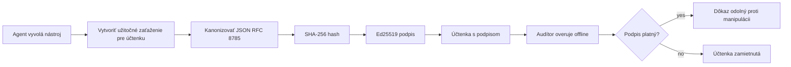
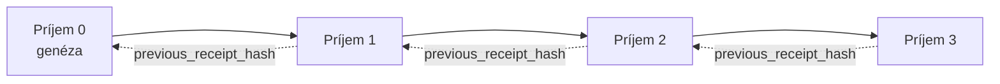

[Pozrite si video lekcie: Zabezpečenie AI agentov pomocou kryptografických potvrdení](https://youtu.be/PLACEHOLDER_VIDEO_ID)

> _(Video lekcie a náhľad budú pridané tímom Microsoftu po zlúčení, podľa vzoru lekcie 14 / 15.)_

# Zabezpečenie AI agentov pomocou kryptografických potvrdení

## Úvod

Táto lekcia bude pokrývať:

- Prečo majú audítorské stopy pre AI agentov význam pre súlad, ladenie a dôveru.
- Čo je to kryptografické potvrdenie a ako sa líši od nepodpísanej záznamovej línie.
- Ako vyprodukovať podpísané potvrdenie pri volaní nástroja agenta v obyčajnom Pythone.
- Ako overiť potvrdenie offline a odhaliť zmeny.
- Ako reťaziť potvrdenia tak, že odstránenie alebo preusporiadanie jedného zlomí celý reťazec.
- Čo potvrdenia dokazujú a čo explicitne nedokazujú.

## Ciele učenia

Po dokončení tejto lekcie budete vedieť:

- Identifikovať poruchové režimy, ktoré motivujú kryptografický pôvod akcií agenta.
- Vyprodukovať potvrdenie podpísané Ed25519 nad kanonickým JSON payloadom.
- Overiť potvrdenie nezávisle len za použitia verejného kľúča podpisovateľa.
- Odhaliť zmeny opakovaným overením upraveného potvrdenia.
- Vytvoriť reťazec potvrdení založený na hashovaní a vysvetliť, prečo reťazec záleží.
- Rozpoznať hranicu medzi tým, čo potvrdenia dokazujú (atribúciu, integritu, poradie) a tým, čo nedokazujú (správnosť akcie, správnosť politiky).

## Problém: Audítorská stopa vášho agenta

Predstavte si, že ste nasadili AI agenta pre Contoso Travel. Agent číta požiadavky zákazníkov, volá API pre lety na vyhľadanie možností a rezervuje miesta za zákazníka. Za posledný štvrťrok agent spracoval 50 000 rezervácií.

Dnes prichádza audítor. Položí jednoduchú otázku: "Ukážte mi, čo váš agent urobil."

Podáte im logy. Audítor ich prezrie a položí ťažšiu otázku: "Ako viem, že tieto logy neboli upravované?"

Toto je problém audítorskej stopy. Väčšina dnešných nasadení agentov sa spolieha na:

- **Aplikačné logy**: zapisované samotným agentom, upraviteľné kýmkoľvek s prístupom k súborovému systému.
- **Cloudové služby pre logovanie**: dokazujú zmeny na platformovej úrovni, ale len ak audítor dôveruje prevádzkovateľovi platformy.
- **Záznamy databázových transakcií**: vhodné pre zmeny v databáze, ale nie pre ľubovoľné volania nástrojov.

Žiadne z týchto nerieši otázku audítora bez toho, aby audítor musel niekomu dôverovať (vám, poskytovateľovi cloudu, dodávateľovi databázy). Pre interné použitie je táto dôvera často prijateľná. Pre regulované úlohy (financie, zdravotníctvo, čokoľvek podliehajúce zákonu EÚ o AI) to však nie je.

Kryptografické potvrdenia to riešia tým, že každá akcia agenta je nezávisle overiteľná. Audítor nemusí dôverovať vám. Potrebuje len váš verejný kľúč a samotné potvrdenie.

## Čo je kryptografické potvrdenie?

Potvrdenie je JSON objekt, ktorý zaznamenáva, čo agent urobil, podpísaný digitálnym podpisom.


```mermaid
flowchart LR
    A[Agent vyvolá nástroj] --> B[Vytvoriť užitočné zaťaženie pre účtenku]
    B --> C[Kanonizovať JSON RFC 8785]
    C --> D[SHA-256 hash]
    D --> E[Ed25519 podpis]
    E --> F[Účtenka s podpisom]
    F --> G[Audítor overuje offline]
    G --> H{Podpis platný?}
    H -- yes --> I[Dôkaz odolný proti manipulácii]
    H -- no --> J[Účtenka zamietnutá]
```

Minimálne potvrdenie vyzerá takto:

```json
{
  "type": "agent.tool_call.v1",
  "agent_id": "contoso-travel-bot",
  "tool_name": "lookup_flights",
  "tool_args_hash": "sha256:a3f9c1...",
  "result_hash": "sha256:7b2e1d...",
  "policy_id": "contoso-travel-policy-v3",
  "timestamp": "2026-04-25T14:30:00Z",
  "sequence": 47,
  "previous_receipt_hash": "sha256:9d4e6a...",
  "signature": {
    "alg": "EdDSA",
    "sig": "c5af83...",
    "public_key": "8f3b2c..."
  }
}
```

Tri vlastnosti pracujú:

1. **Podpis**. Potvrdenie je podpísané agentovou bránou pomocou súkromného kľúča Ed25519. Každý s príslušným verejným kľúčom môže podpis offline overiť. Akákoľvek úprava poľa podpis zneplatní.

2. **Kanonické kódovanie**. Pred podpisom sa potvrdenie serializuje pomocou JSON Canonicalization Scheme (JCS, RFC 8785). To zaručuje, že dve implementácie produkujúce ten istý logický obsah generujú identický výstup v bajtoch. Bez kanonizácie by rôzne JSON serializéry vytvorili rôzne podpisy pre rovnaký obsah.

3. **Reťazenie hashov**. Pole `previous_receipt_hash` spája každé potvrdenie s predchádzajúcim. Odstránenie alebo preusporiadanie potvrdí zlomí všetky neskoršie potvrdenia. Zmeny sú viditeľné na úrovni reťazca aj ak sa jednotlivé podpisy obídu.

Spolu tieto vlastnosti poskytujú tri záruky:

- **Atribúcia**: tento kľúč podpísal tento obsah.
- **Integrita**: obsah sa nezmenil od podpisu.
- **Poradie**: toto potvrdenie nasleduje za týmto potvrdením v reťazci.

## Vytvorenie potvrdenia v Pythone

Nepotrebujete špeciálnu knižnicu na vytvorenie potvrdenia. Kryptografické primitíva sú bežne dostupné a logika je len pár desiatok riadkov Pythonu.

Praktické cvičenia v `code_samples/18-signed-receipts.ipynb` vedú cez celý proces. Súhrnná verzia:

```python
import json
import hashlib
import base64
from nacl import signing
from jcs import canonicalize  # RFC 8785 kanonický JSON

def b64url_nopad(data: bytes) -> str:
    return base64.urlsafe_b64encode(data).decode("ascii").rstrip("=")

def sha256_canonical(obj) -> str:
    """SHA-256 of a Python object's JCS-canonical JSON form."""
    return f"sha256:{hashlib.sha256(canonicalize(obj)).hexdigest()}"

# Generujte alebo načítajte podpisovací kľúč (v produkcii uložte do trezoru kľúčov)
signing_key = signing.SigningKey.generate()
verify_key = signing_key.verify_key

# Vytvorte náklad účtenky (ešte bez podpisu)
tool_args = {"origin": "SYD", "destination": "LAX"}
tool_result = [{"flight": "QF11", "price": 1850, "stops": 0}]

payload = {
    "type": "agent.tool_call.v1",
    "agent_id": "contoso-travel-bot",
    "tool_name": "lookup_flights",
    "tool_args_hash": sha256_canonical(tool_args),
    "result_hash": sha256_canonical(tool_result),
    "policy_id": "contoso-travel-policy-v3",
    "timestamp": "2026-04-25T14:30:00Z",
    "sequence": 0,
    "previous_receipt_hash": None,
}

# Kanonizujte, zahashujte, podpíšte.
canonical_bytes = canonicalize(payload)
message_hash = hashlib.sha256(canonical_bytes).digest()
signature_bytes = signing_key.sign(message_hash).signature

# Priložte štruktúrovaný objekt podpisu.
receipt = {
    **payload,
    "signature": {
        "alg": "EdDSA",
        "sig": b64url_nopad(signature_bytes),
        "public_key": b64url_nopad(bytes(verify_key)),
    },
}
```

To je celý podpisovací proces. Cvičenia v notebooku prechádzajú každým krokom.

## Overenie potvrdenia a detekcia úprav

Overenie je opačná operácia:

```python
import base64
import hashlib
from nacl import signing
from nacl.exceptions import BadSignatureError
from jcs import canonicalize

def b64url_decode(s: str) -> bytes:
    padding = "=" * ((4 - len(s) % 4) % 4)
    return base64.urlsafe_b64decode(s + padding)

def verify_receipt(receipt: dict) -> bool:
    # Podpis je štruktúrovaný objekt: {"alg", "sig", "public_key"}.
    sig_obj = receipt.get("signature")
    if not sig_obj or sig_obj.get("alg") != "EdDSA":
        return False

    # Zrekonštruujte záťaž, ktorá bola skutočne podpísaná (všetko okrem podpisu).
    payload = {k: v for k, v in receipt.items() if k != "signature"}

    canonical_bytes = canonicalize(payload)
    message_hash = hashlib.sha256(canonical_bytes).digest()

    try:
        verify_key = signing.VerifyKey(b64url_decode(sig_obj["public_key"]))
        verify_key.verify(message_hash, b64url_decode(sig_obj["sig"]))
        return True
    except BadSignatureError:
        return False
```

Táto funkcia prijíma potvrdenie a vráti `True`, ak je podpis platný, inak `False`. Žiadne sieťové volania, žiadne závislosti na službách, žiadna dôvera v tretiu stranu.

Pre zobrazenie detekcie úprav notebook vedie cez:

1. Vyprodukovanie platného potvrdenia a potvrdenie jeho platnosti.
2. Úpravu jedného bajtu v poli `tool_args_hash`.
3. Opakované overenie a zistenie zlyhania.

Toto je praktický dôkaz, že potvrdenia sú dôkazom úprav: akákoľvek zmena, akokoľvek malá, zlomí podpis.

## Reťazenie potvrdení pre viackrokových agentov

Jedno podpísané potvrdenie chráni jednu akciu. Reťaz potvrdení chráni sekvenciu.


```mermaid
flowchart LR
    R0[Príjem 0<br/>genéza] --> R1[Príjem 1]
    R1 --> R2[Príjem 2]
    R2 --> R3[Príjem 3]
    R1 -. previous_receipt_hash .-> R0
    R2 -. previous_receipt_hash .-> R1
    R3 -. previous_receipt_hash .-> R2
```

Každé potvrdenie obsahuje hash predchádzajúceho potvrdenia. Ak by útočník ticho odstránil potvrdenie číslo 2, musel by:

- Upraviť pole `previous_receipt_hash` potvrdenia 3 (čo zlomí podpis potvrdenia 3), ALEBO
- Vyrábať nový podpis na upravenom potvrdení 3 (čo vyžaduje súkromný kľúč agenta).

Ak je súkromný kľúč uložený v hardvérovom trezore a verejný kľúč zverejnený s každým potvrdením, žiadny útok nie je možný bez odhalenia.

Notebook ukazuje:

1. Vytvorenie reťazca troch potvrdení.
2. Overenie, že `previous_receipt_hash` každého potvrdenia zodpovedá skutočnému hashu predchádzajúceho potvrdenia.
3. Modifikáciu jedného potvrdenia v strede a zistenie prasknutia reťazca presne v tom bode.

Takto vybudujete audítorskú stopu, ktorú môže externý audítor overiť bez dôvery v vás.

## Čo potvrdenia dokazujú (a čo nie)

Toto je najdôležitejšia časť lekcie. Potvrdenia sú mocné, ale ich moc je obmedzená.

**Potvrdenia dokazujú tri veci:**

1. **Atribúciu**: konkrétny kľúč podpísal konkrétny payload.
2. **Integritu**: payload sa od podpisu nezmenil.
3. **Poradie**: toto potvrdenie je v reťazci za týmto potvrdením.

**Potvrdenia nepreukazujú:**

1. **Správnosť**: že akcia agenta bola správna. Potvrdenie môže byť podpísané pre nesprávnu odpoveď rovnako ako pre správnu.
2. **Súlad s politikou**: že politika uvedená v `policy_id` bola naozaj vyhodnotená, alebo že by túto akciu povolila. Potvrdenie zaznamenáva, čo sa tvrdilo, nie čo bolo vynútené.
3. **Identita mimo kľúča**: potvrdenie hovorí "tento kľúč podpísal tento obsah." Nepíše "tento človek to autorizoval." Spojenie kľúča s osobou alebo organizáciou vyžaduje samostatnú infraštruktúru identity (adresár, register verejných kľúčov atď.).
4. **Pravdivosť vstupov**: ak agent dostane zmanipulovaný prompt a koná na jeho základe, potvrdenie verne zaznamenáva akciu. Potvrdenia sú za validáciou vstupov, nie jej náhradou.

Táto hranica je dôležitá z dvoch dôvodov:

- Hovorí, na čo sú potvrdenia užitočné: robia správanie agenta auditovateľným a dôkazom proti úpravám, dokonca naprieč organizačnými hranicami.
- Hovorí, aké ďalšie vrstvy stále potrebujete: validáciu vstupov (Lekcia 6), vynucovanie politiky (stručne pokryté nižšie) a infraštruktúru identity (mimo rozsahu tejto lekcie).

Bežná chyba je predpokladať, že "máme potvrdenia" znamená "sme riadení." Nie je to tak. Potvrdenia sú základ. Riadenie je systém, ktorý na nich staviate.

## Produkčné odkazy

Python kód v tejto lekcii je zámerne minimálny, aby ste každý riadok mohli čítať a presne pochopiť, čo sa deje. V produkcii máte dve možnosti:

1. **Stavať priamo na kryptografických primitívach.** Tých 50 riadkov, ktoré ste videli, stačí pre mnohé použitia. PyNaCl (Ed25519) a balíček `jcs` (kanonický JSON) sú dobre udržiavané a auditované knižnice.

2. **Použiť produkčnú knižnicu pre potvrdenia.** Niekoľko open-source projektov implementuje rovnaký vzor s pridanými funkciami (rotácia kľúčov, hromadné overovanie, distribúcia JWK Set, integrácia s politikami):
   - Formát potvrdenia použitý v tejto lekcii nasleduje návrh IETF Internet-Draft (`draft-farley-acta-signed-receipts`), ktorý je momentálne v štádiu štandardov.
   - Microsoft Agent Governance Toolkit skladá potvrdenia s rozhodnutiami založenými na Cedar politike; pozrite si Tutoriál 33 v danom repozitári pre kompletný príklad.
   - Balíčky `protect-mcp` (npm) a `@veritasacta/verify` (npm) poskytujú implementáciu podpisovania a offline overenia potvrdení pre Node, určené na zabalenie MCP servera s dôkazom proti úpravám.
   - **[nobulex](https://github.com/arian-gogani/nobulex)** Python SDK (`pip install nobulex`) poskytuje rovnaký vzor Ed25519 + JCS podpísania v Pythone s integráciou LangChain a CrewAI, vrátane publikovaných testovacích vektorov a mapovania súladu prispelého cez [OWASP PR #2210](https://github.com/OWASP/CheatSheetSeries/pull/2210).

Rozhodnutie medzi vlastnou implementáciou a knižnicou je podobné ako rozhodnutie medzi vlastnou JWT knižnicou a testovanou knižnicou: obe sú rozumné; knižnica šetrí čas a znižuje auditné riziko; cesta od základov vás núti pochopiť každý primitív. Táto lekcia učí cestu od základov, aby ste mali základ pre obe možnosti.

## Kontrola znalostí

Otestujte si svoje porozumenie pred prechodom na praktické cvičenie.

**1. Potvrdenie je podpísané súkromným kľúčom Ed25519 agenta. Audítor má len verejný kľúč. Môže audítor potvrdenie overiť offline?**

<details>
<summary>Odpoveď</summary>

Áno. Overenie Ed25519 vyžaduje len verejný kľúč a podpísané bajty. Žiadne sieťové volania, žiadna závislosť na službe. Toto je vlastnosť, ktorá robí potvrdenia užitočnými v prostrediach izolovaných od siete, viacorganizáciových alebo nízkodôveryhodných auditov.
</details>

**2. Útočník upraví pole `policy_id` v potvrdení tak, aby tvrdilo, že bolo riadené menej prísnou politikou. Podpis bol nad pôvodným obsahom. Čo sa stane počas overenia?**

<details>
<summary>Odpoveď</summary>

Overenie zlyhá. Podpis bol vypočítaný nad kanonickými bajtami pôvodného obsahu; úprava akéhokoľvek poľa zmení bajty, čo zmení SHA-256 hash, čo spôsobí neplatnosť podpisu. Útočník by potreboval súkromný kľúč na vytvorenie nového platného podpisu, čo nemá.
</details>

**3. Prečo potvrdenie obsahuje `tool_args_hash` a `result_hash` namiesto surových argumentov a výsledku?**

<details>
<summary>Odpoveď</summary>

Dôvody sú dva. Po prvé, potvrdenie možno archívovať alebo prenášať v prostrediach, kde by únik surového obsahu (osobné údaje, obchodné dáta) bol problém. Hashovanie udržiava potvrdenie malé a obsah súkromný; audítor overí, že hash zodpovedá samostatne uloženému kópii skutočného obsahu. Po druhé, hashe majú fixnú veľkosť; potvrdenie s hashmi má obmedzenú veľkosť bez ohľadu na veľkosť vstupov a výstupov.
</details>

**4. Pole `previous_receipt_hash` spája každé potvrdenie s predchodcom. Ak útočník ticho odstráni jedno potvrdenie zo stredu reťazca, čo sa stane neplatným?**

<details>
<summary>Odpoveď</summary>

Všetky potvrdenia, ktoré za ním nasledovali. Ich polia `previous_receipt_hash` už nezodpovedajú reálnemu reťazcu (pretože potvrdenie, na ktoré odkazovali, už neexistuje, alebo teraz odkazujú na iného predchodcu). Na skrytie zmazania by útočník musel opätovne podpísať každé ďalšie potvrdenie, čo vyžaduje súkromný kľúč.
</details>

**5. Potvrdenie sa overí správne. Dokazuje to, že agentova akcia bola správna, správne zmyslová alebo súladná s politikou?**

<details>
<summary>Odpoveď</summary>

Nie. Platné potvrdenie dokazuje tri veci: atribúciu (tento kľúč podpísal tento obsah), integritu (obsah sa nezmenil) a poradie (toto potvrdenie nasleduje za týmto potvrdením). NEdokazuje, že akcia bola správna, že politika v `policy_id` bola naozaj vyhodnotená, alebo že agent dodržal všetky pravidlá. Potvrdenia robia správanie agenta auditovateľným, ale nie nevyhnutne správnym. Toto je najdôležitejšia hranica v lekcii.
</details>

## Praktické cvičenie

Otvorte `code_samples/18-signed-receipts.ipynb` a dokončite všetky štyri sekcie:

1. **Sekcia 1**: Podpíšte prvé potvrdenie a overte ho.
2. **Sekcia 2**: Úpravte potvrdenie a sledujte zlyhanie overenia.
3. **Sekcia 3**: Vytvorte reťazec troch potvrdení a overte integritu reťazca.
4. **Sekcia 4**: Použite vzor na agenta vytvoreného pomocou Microsoft Agent Framework: zabaľte volanie nástroja do podpisovania potvrdení a potom potvrdenie overte nezávisle.


**Rozšírená výzva 1:** rozšírte schému príjmu o ďalšie pole podľa vlastného výberu (napríklad ID požiadavky na sledovanie), aktualizujte kódovanie na podpisovanie, aby ho zahŕňalo, a potvrďte, že príjem stále prejde verifikáciou. Potom pole po podpísaní upravte a potvrďte, že verifikácia zlyhá. To vás núti pochopiť, ako každý bajt kanonického kódovania prispieva k podpisu.

**Rozšírená výzva 2:** vypočítajte SHA-256 hash dvoch vašich príjmov (zreťazte ich kanonické bajty v deterministickom poradí) a výsledný digest vložte ako nové pole do tretieho príjmu pred jeho podpisom. Overte, že všetky tri príjmy stále prejdú verifikáciou. Práve ste vytvorili jednoetapový dôkaz inklúzie: každý, kto má tretí príjem, môže dokázať, že prvé dva existovali v čase jeho podpisu, bez potreby odhaliť ich obsah. Toto je vzor, ktorý používajú príjmy s výberovým zverejňovaním v mierke (Merkleho záväzky, RFC 6962).

## Záver

Kryptografické príjmy poskytujú AI agentom auditnú stopu, ktorá je:

- **Nezávisle overiteľná**: akákoľvek strana s verejným kľúčom môže overiť, nezávisle od služby.
- **Manipulácii vzdorná**: každá zmena neplatí podpis.
- **Prenositeľná**: príjem je malý JSON súbor; možno ho archivovať, prenášať a overovať kdekoľvek.
- **V súlade so štandardmi**: postavená na Ed25519 (RFC 8032), JCS (RFC 8785) a SHA-256, všetky široko používané primitíva.

Nie je náhradou za validáciu vstupov, presadzovanie pravidiel alebo infraštruktúru identity. Sú základom pre tieto vrstvy. Keď nasadzujete agentov do regulovaných pracovných záťaží, multiorganizačných procesov alebo do akéhokoľvek prostredia, kde nemožno očakávať dôveru budúceho auditora, príjmy sú spôsob, ako zabezpečiť čestnú auditnú stopu.

Najdôležitejšie ponaučenie: príjmy dokazujú, kto čo povedal a kedy. Nedokazujú, že to, čo bolo povedané, je pravdivé alebo správne. Túto rozlišovaciu čiaru držte pevne. Je to rozdiel medzi čestným a zavádzajúcim systémom pôvodu.

## Kontrolný zoznam pre produkciu

Keď ste pripravení prejsť z tejto lekcie na nasadenie agentov s podpísanými príjmami v reálnom prostredí:

- [ ] **Presuňte podpisovací kľúč mimo vývojárskeho notebooku.** Použite Azure Key Vault, AWS KMS alebo hardvérový bezpečnostný modul. Privátny kľúč podpisujúci vaše príjmy nesmie nikdy žiť v správe zdrojových kódov alebo v čitateľnej forme na aplikačných strojoch.
- [ ] **Zverejnite verejný kľúč na verifikáciu.** Audítori ho potrebujú na offline overenie. Štandardný postup je JWK Set na dobre známom URL (RFC 7517), napríklad `https://your-org.example.com/.well-known/agent-keys.json`.
- [ ] **Externé ukotvite reťazec.** Pravidelne zapisujte najnovší hash hlavy reťazca do transparentného zoznamu (Sigstore Rekor, RFC 3161 timestamp authority alebo druhý interný systém), aby externá strana mohla potvrdiť „tento reťazec existoval v tomto čase“.
- [ ] **Ukladajte príjmy nemenným spôsobom.** Storage typu append-only blob (Azure Storage s nemennými politikami, AWS S3 Object Lock) zabraňuje insiderovi prepisovať históriu na úrovni úložiska.
- [ ] **Rozhodnite o dobe uchovávania.** Mnohé regulačné rámce vyžadujú viacročné uloženie. Plánujte rast príjmov (každý príjem je ~500 bajtov; agent vykonávajúci 10 000 volaní denne generuje ~1,8 GB ročne).
- [ ] **Zdokumentujte, čo príjmy nepokrývajú.** Príjmy dokazujú pripísanie, integritu a poradie. Váš prevádzkový manuál by mal explicitne uviesť, aké ďalšie kontroly (validácia vstupov, presadzovanie pravidiel, obmedzovanie sadzieb, infraštruktúra identity) dopĺňajú príjmy vo vašom riadiacom nastavení.

### Máte viac otázok o zabezpečení AI agentov?

Pripojte sa do [Microsoft Foundry Discord](https://aka.ms/ai-agents/discord), stretnite sa s ďalšími študentmi, navštevujte konzultačné hodiny a získajte odpovede na svoje otázky o AI agentocht.

## Za touto lekciou

Táto lekcia pokrýva podpisovanie jedného príjmu a hashom spojené sekvencie. Tie isté primitíva sa skladajú do niekoľkých pokročilejších vzorov, s ktorými sa môžete stretnúť s postupným dozrievaním vášho riadenia:

- **Výberové zverejňovanie.** Keď sú polia príjmu nezávisle záväzné (Merkleov strom štýlu RFC 6962), môžete odhaliť konkrétne polia konkrétnym audítorom a dokázať, že ostatné ostávajú nezmenené bez ich odhalenia. Použiteľné, ak ten istý príjem musí vyhovieť súčasne komplexnému auditu (ktorý chce úplnosť) a reguláciám znižovania údajov ako GDPR (ktoré chcú, aby auditor videl len nevyhnutné minimum).
- **Odvolanie príjmu.** Ak je podpisovací kľúč kompromitovaný, potrebujete spôsob, ako označiť všetky príjmy podpísané týmto kľúčom od určitého času za nedôveryhodné. Štandardné vzory: krátkodobé podpisovacie kľúče plus zverejnený zoznam odvolaní, alebo transparentný log s položkami o odvolaní.
- **Obojstranné / rozdelené podpisy príjmov.** Niektoré implementácie rozdeľujú podpísaný obsah na pre-vykonávacie (`authorization_*`) a po-vykonávacie (`result_*`) polovice s nezávislými podpismi, užitočné, keď rozhodnutie o autorizácii a výsledok pozorovaný sú rôznymi subjektmi alebo v rôznych časoch. Tento vzor sa skladá navyše na formáte príjmu vyučovanom v tejto lekcii.
- **Zloženie obsahu.** Príjem uzatvára akékoľvek bajty, ktoré vložíte do `result_hash`. Skutočné obsahy sú často bohatšie ako jeden výsledok volania nástroja: rozvaha pred rozhodnutím (predikcia modelu, zvažované možnosti, dôkazy a ich úplnosť, postoj k riziku, reťaz zodpovednosti, výsledok brány) môžu byť všetky súčasťou obsahu, uzavreté jedným príjmom. Toto ponecháva formát príjmu minimálny a umožňuje evolúciu schém obsahu podľa odboru.
- **Zhodnosť viacerých implementácií.** Viacero nezávislých implementácií rovnakého formátu príjmu (Python, TypeScript, Rust, Go) si navzájom overuje testovacími vektormi. Ak vyvíjate vlastnú implementáciu, overenie podľa publikovaných vektorov potvrdzuje kompatibilitu prenosu údajov.
- **Migrácia po kvantovej ére.** Ed25519 je dnes široko používaný, ale nie je kvantovo rezistentný. Formát príjmu je algoritmicky flexibilný: pole `signature.alg` môže niesť `ML-DSA-65` (štandard po kvantový podpis NIST), keď bude potrebné migrovať. Plánujte prechodné obdobie, počas ktorého budú príjmy dvojito podpísané.

## Ďalšie zdroje

- <a href="https://datatracker.ietf.org/doc/draft-farley-acta-signed-receipts/" target="_blank">IETF Internet-Draft: Signed Decision Receipts for Machine-to-Machine Access Control</a>
- <a href="https://learn.microsoft.com/azure/ai-studio/responsible-use-of-ai-overview" target="_blank">Responsible AI overview (Azure AI)</a>
- <a href="https://datatracker.ietf.org/doc/html/rfc8032" target="_blank">RFC 8032: Edwards-Curve Digital Signature Algorithm (EdDSA)</a>
- <a href="https://datatracker.ietf.org/doc/html/rfc8785" target="_blank">RFC 8785: JSON Canonicalization Scheme (JCS)</a>
- <a href="https://datatracker.ietf.org/doc/html/rfc6962" target="_blank">RFC 6962: Certificate Transparency</a> (Merkle-tree construction used by selective-disclosure receipts)
- <a href="https://github.com/microsoft/agent-governance-toolkit/blob/main/docs/tutorials/33-offline-verifiable-receipts.md" target="_blank">Microsoft Agent Governance Toolkit, Tutorial 33: Offline-Verifiable Decision Receipts</a>
- <a href="https://github.com/ScopeBlind/agent-governance-testvectors" target="_blank">Cross-implementation conformance test vectors</a> for the receipt format used in this lesson (Apache-2.0)
- <a href="https://pynacl.readthedocs.io/" target="_blank">PyNaCl documentation</a> (Ed25519 in Python)

## Predchádzajúca lekcia

[Building Computer Use Agents (CUA)](../15-browser-use/README.md)

---

<!-- CO-OP TRANSLATOR DISCLAIMER START -->
**Vyhlásenie o zodpovednosti**:
Tento dokument bol preložený pomocou AI prekladateľskej služby [Co-op Translator](https://github.com/Azure/co-op-translator). Hoci sa snažíme o presnosť, vezmite prosím na vedomie, že automatické preklady môžu obsahovať chyby alebo nepresnosti. Pôvodný dokument v jeho natívnom jazyku by mal byť považovaný za autoritatívny zdroj. Pre kritické informácie sa odporúča profesionálny ľudský preklad. Nie sme zodpovední za žiadne nedorozumenia alebo nesprávne interpretácie vyplývajúce z použitia tohto prekladu.
<!-- CO-OP TRANSLATOR DISCLAIMER END -->