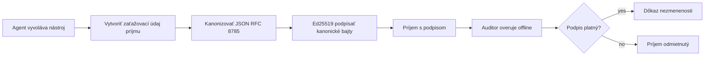
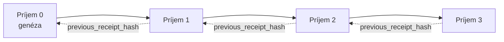

[Pozrite si video lekcie: Zabezpečenie AI agentov pomocou kryptografických potvrdení](https://youtu.be/PLACEHOLDER_VIDEO_ID)

> _(Video lekcie a náhľadový obrázok pridá tím Microsoft obsahu po zlúčení, podľa vzoru lekcie 14 / 15.)_

# Zabezpečenie AI agentov pomocou kryptografických potvrdení

## Úvod

Táto lekcia pokryje:

- Prečo sú auditné stopy pre AI agentov dôležité pre súlad, ladenie a dôveru.
- Čo je to kryptografické potvrdenie a ako sa líši od nepodpísaného riadku protokolu.
- Ako vytvoriť podpísané potvrdenie pre volanie nástroja agenta v obyčajnom Pythone.
- Ako overiť potvrdenie offline a zistiť neoprávnené zásahy.
- Ako reťaziť potvrdenia tak, že odstránenie alebo zmena poradia jedného preruší celý reťazec.
- Čo potvrdenia dokazujú a čo výslovne nedokazujú.

## Ciele učenia

Po dokončení tejto lekcie budete vedieť:

- Identifikovať režimy zlyhania, ktoré motivujú kryptografickú pôvodnosť akcií agenta.
- Vytvoriť podpísané potvrdenie Ed25519 nad kanonickým JSON payloadom.
- Nezávisle overiť potvrdenie len pomocou verejného kľúča podpisovateľa.
- Zistiť neoprávnené zásahy opätovným spustením overovania na upravenom potvrdení.
- Vytvoriť reťazec potvrdení pomocou hashovania a vysvetliť, prečo je tento reťazec dôležitý.
- Rozpoznať hranicu medzi tým, čo potvrdenia dokazujú (pripísanie, integrita, poradie) a čo nedokazujú (správnosť akcie, správnosť politiky).

## Problém: Auditná stopa vášho agenta

Predstavte si, že ste nasadili AI agenta pre Contoso Travel. Agent číta požiadavky zákazníkov, volá API letov, aby našiel možnosti, a rezervuje letenky v ich mene. Minulý štvrťrok agent spracoval 50 000 rezervácií.

Dnes prichádza audítor. Položí jednoduchú otázku: „Ukážte mi, čo váš agent urobil.“

Podáte mu vaše logy. Audítor sa pozrie a položí ťažšiu otázku: „Ako viem, že tieto logy neboli upravené?“

Toto je problém auditnej stopy. Väčšina dnešných nasadení agentov spolieha na:

- **Aplikačné logy**: zapisované samotným agentom, upraviteľné každým, kto má prístup k súborovému systému.
- **Cloudové loggingové služby**: na platformovej úrovni odolné voči úpravám, ale len ak audítor dôveruje prevádzkovateľovi platformy.
- **Logy databázových transakcií**: vhodné pre zmeny databázy, ale nie na ľubovoľné volania nástrojov.

Žiadny z nich však nedokáže odpovedať audítorovi bez nutnosti dôvery v niekoho (vás, vášho cloudového poskytovateľa, vášho dodávateľa databázy). Pre interné použitie je táto dôvera často akceptovateľná. Pre regulované pracovné zaťaženia (financie, zdravotníctvo, všetko podliehajúce zákonu EÚ o AI) nie.

Kryptografické potvrdenia toto riešia tým, že každú akciu agenta sprístupňujú na nezávislé overenie. Audítor nemusí dôverovať vám. Potrebuje len váš verejný kľúč a samotné potvrdenie.

## Čo je kryptografické potvrdenie?

Potvrdenie je JSON objekt, ktorý zaznamenáva, čo agent urobil, podpísaný digitálnym podpisom.


```mermaid
flowchart LR
    A[Agent vyvoláva nástroj] --> B[Vytvoriť zaťažovací údaj príjmu]
    B --> C[Kanonizovať JSON RFC 8785]
    C --> E[Ed25519 podpísať kanonické bajty]
    E --> F[Príjem s podpisom]
    F --> G[Auditor overuje offline]
    G --> H{Podpis platný?}
    H -- yes --> I[Dôkaz nezmenenosti]
    H -- no --> J[Príjem odmietnutý]
```

Minimálne potvrdenie vyzerá takto:

```json
{
  "type": "agent.tool_call.v1",
  "agent_id": "contoso-travel-bot",
  "tool_name": "lookup_flights",
  "tool_args_hash": "sha256:a3f9c1...",
  "result_hash": "sha256:7b2e1d...",
  "policy_id": "contoso-travel-policy-v3",
  "timestamp": "2026-04-25T14:30:00Z",
  "sequence": 47,
  "previous_receipt_hash": "sha256:9d4e6a...",
  "signature": {
    "alg": "EdDSA",
    "sig": "c5af83...",
    "public_key": "8f3b2c..."
  }
}
```

Tri vlastnosti robia svoju prácu:

1. **Podpis**. Potvrdenie je podpísané bránou agenta pomocou súkromného kľúča Ed25519. Každý s príslušným verejným kľúčom môže podpis offline overiť. Zásah do akéhokoľvek poľa podpis zneplatní.

2. **Kanonické kódovanie**. Pred podpisom sa potvrdenie serializuje podľa JSON Canonicalization Scheme (JCS, RFC 8785). Tým sa zabezpečí, že dve implementácie, ktoré vytvoria rovnaké logické potvrdenie, vytvoria aj bitovo identický výstup. Bez kanonizácie by rôzne JSON serializéry produkovali odlišné podpisy rovnakého obsahu.

3. **Hashové reťazenie**. Pole `previous_receipt_hash` spája každé potvrdenie s predchádzajúcim. Odstránenie alebo zmena poradia potvrdí každý nasledujúci doklad. Zásah je viditeľný na úrovni reťazca, aj keď sú obídené jednotlivé podpisy.

Spoločne tieto vlastnosti poskytujú tri záruky:

- **Pripísanie**: tento kľúč podpísal tento obsah.
- **Integrita**: obsah sa od podpisu nezmenil.
- **Poradie**: toto potvrdenie prišlo v reťazci po danom potvrdení.

## Vytváranie potvrdenia v Pythone

Na vytvorenie potvrdenia nepotrebujete žiadnu špeciálnu knižnicu. Kryptografické primitíva sú široko dostupné a logika je pár desiatok riadkov Python kódu.

Praktické cvičenia v `code_samples/18-signed-receipts.ipynb` prejdú celý proces. Zhrnutie:

```python
import json
import hashlib
import base64
from nacl import signing
from jcs import canonicalize  # RFC 8785 kanonický JSON

def b64url_nopad(data: bytes) -> str:
    return base64.urlsafe_b64encode(data).decode("ascii").rstrip("=")

def sha256_canonical(obj) -> str:
    """SHA-256 of a Python object's JCS-canonical JSON form."""
    return f"sha256:{hashlib.sha256(canonicalize(obj)).hexdigest()}"

# Vygenerujte alebo načítajte podpisovací kľúč (vo výrobe uložte v trezore kľúčov)
signing_key = signing.SigningKey.generate()
verify_key = signing_key.verify_key

# Vytvorte obsah účtenky (zatiaľ bez podpisu)
tool_args = {"origin": "SYD", "destination": "LAX"}
tool_result = [{"flight": "QF11", "price": 1850, "stops": 0}]

payload = {
    "type": "agent.tool_call.v1",
    "agent_id": "contoso-travel-bot",
    "tool_name": "lookup_flights",
    "tool_args_hash": sha256_canonical(tool_args),
    "result_hash": sha256_canonical(tool_result),
    "policy_id": "contoso-travel-policy-v3",
    "timestamp": "2026-04-25T14:30:00Z",
    "sequence": 0,
    "previous_receipt_hash": None,
}

# Kanonizujte a priamo podpíšte bajty JCS. PureEdDSA interné hašovanie.
canonical_bytes = canonicalize(payload)
signature_bytes = signing_key.sign(canonical_bytes).signature

# Pripojte štruktúrovaný objekt podpisu.
receipt = {
    **payload,
    "signature": {
        "alg": "EdDSA",
        "sig": b64url_nopad(signature_bytes),
        "public_key": b64url_nopad(bytes(verify_key)),
    },
}
```

Toto je celý podpisovací pipeline. Cvičenia v notebooku prejdú každý krok.

## Overovanie potvrdenia a detekcia zásahu

Overenie je inverzná operácia:

```python
import base64
import hashlib
from nacl import signing
from nacl.exceptions import BadSignatureError
from jcs import canonicalize

def b64url_decode(s: str) -> bytes:
    padding = "=" * ((4 - len(s) % 4) % 4)
    return base64.urlsafe_b64decode(s + padding)

def verify_receipt(receipt: dict) -> bool:
    # Podpis je štruktúrovaný objekt: {"alg", "sig", "public_key"}.
    sig_obj = receipt.get("signature")
    if not sig_obj or sig_obj.get("alg") != "EdDSA":
        return False

    # Rekonštruujte náklad, ktorý bol skutočne podpísaný (všetko okrem podpisu).
    payload = {k: v for k, v in receipt.items() if k != "signature"}

    canonical_bytes = canonicalize(payload)

    try:
        verify_key = signing.VerifyKey(b64url_decode(sig_obj["public_key"]))
        verify_key.verify(canonical_bytes, b64url_decode(sig_obj["sig"]))
        return True
    except BadSignatureError:
        return False
```

Táto funkcia prijíma potvrdenie a vracia `True`, ak je podpis platný, inak `False`. Žiadne sieťové volanie, žiadna závislosť na službe, žiadna potreba dôvery v tretie strany.

Ak chcete vidieť detekciu zásahu v akcii, notebook prejde:

1. Vytvorenie platného potvrdenia a potvrdenie, že sa overí.
2. Úpravu jedného bytu v poli `tool_args_hash`.
3. Opätovné spustenie overenia a zobrazenie neúspechu.

Toto je praktický dôkaz toho, že potvrdenia sú odolné voči neoprávneným zásahom: akákoľvek úprava, akokoľvek malá, zruší podpis.

## Reťazenie potvrdení pre viacstupňových agentov

Jedno podpísané potvrdenie chráni jednu akciu. Reťaz potvrdení chráni sekvenciu.


```mermaid
flowchart LR
    R0[Príjem 0<br/>genéza] --> R1[Príjem 1]
    R1 --> R2[Príjem 2]
    R2 --> R3[Príjem 3]
    R1 -. previous_receipt_hash .-> R0
    R2 -. previous_receipt_hash .-> R1
    R3 -. previous_receipt_hash .-> R2
```

Každé potvrdenie zapisuje hash predchádzajúceho potvrdenia. Na tiché odstránenie potvrdenia 2 by útočník musel buď:

- Upraviť pole `previous_receipt_hash` potvrdenia 3 (čo zruší podpis potvrdenia 3), ALEBO
- Forgovať nový podpis na upravené potvrdenie 3 (čo vyžaduje súkromný kľúč agenta).

Ak je súkromný kľúč uložený v hardvérovej bezpečnostnej skrinke a verejný kľúč publikujete s každým potvrdením, žiadny z týchto útokov nie je možný bez odhalenia.

Notebook prejde:

1. Vytvorenie reťazca troch potvrdení.
2. Overenie, že `previous_receipt_hash` každého potvrdenia zodpovedá skutočnému hashu predchádzajúceho dokladu.
3. Zásah do jedného potvrdenia uprostred a zistenie prerušenia reťazca priamo v tomto bode.

Takto vytvoríte auditnú stopu, ktorú môže vonkajší audítor overiť bez dôvery vo vás.

## Čo potvrdenia dokazujú (a čo nedokazujú)

Toto je najdôležitejšia časť tejto lekcie. Potvrdenia sú silné, ale ich sila je obmedzená.

**Potvrdenia dokazujú tri veci:**

1. **Pripísanie**: konkrétny kľúč podpísal konkrétny payload.
2. **Integrita**: payload sa od podpisu nezmenil.
3. **Poradie**: toto potvrdenie prišlo za tým v hash reťazci.

**Potvrdenia nedokazujú:**

1. **Správnosť**: že akcia agenta bola správna. Potvrdenie môže byť podpísané pre nesprávnu odpoveď rovnako ľahko ako pre správnu.
2. **Dodržiavanie pravidiel**: že politika uvedená v `policy_id` bola skutočne vyhodnotená, alebo že by akciu povolila, ak by bola skontrolovaná. Potvrdenie zaznamenáva, čo sa tvrdilo, nie čo bolo vykonané.
3. **Identitu za kľúčom**: potvrdenie hovorí „tento kľúč podpísal tento obsah.“ Nepíše „tento človek to autorizoval.“ Spojenie kľúča s osobou alebo organizáciou vyžaduje samostatnú identitnú infraštruktúru (adresár, registr verejných kľúčov a pod.).
4. **Pravdivosť vstupov**: ak agent dostane zmanipulovaný podnet a naň reaguje, potvrdenie zrkadlí verne akciu. Potvrdenia sú situované za validáciou vstupov, nie jej náhradou.

Táto hranica je dôležitá z dvoch dôvodov:

- Hovorí vám, na čo sú potvrdenia užitočné: robiť správanie agenta auditovateľným a odolným voči úpravám, aj naprieč organizačnými hranicami.
- Hovorí vám, aké ďalšie vrstvy ešte potrebujete: validáciu vstupov (Lekcia 6), vynucovanie pravidiel (krátko nižšie) a identitnú infraštruktúru (mimo rozsahu tejto lekcie).

Bežnou chybou je predpoklad, že „máme potvrdenia“ znamená „sme riadení.“ Nie je to tak. Potvrdenia sú základ. Riadenie je systém, ktorý na tom staviate.

## Dôkaz, že človek autorizoval presnú akciu

Bod 3 vyššie si zaslúži vlastnú časť: potvrdenie akcie hovorí „tento kľúč podpísal tento obsah,“ nikdy nie „človek to autorizoval.“ Pre vysoko rizikové akcie (refundácie, vymazania, prevody peňazí) rámce riadenia čoraz častejšie vyžadujú práve toto chýbajúce tvrdenie, a je ho možné vytvoriť s rovnakými primitívami, ktoré ste už v tejto lekcii použili.

Nasledujúci notebook `code_samples/human-authorization-receipts.ipynb` pridáva druhý typ potvrdenia, `human.approval.v1`, v rovnakom formáte ako potvrdenia z lekcie (typovaný payload podpísaný Ed25519 nad jeho kanonickými JCS bajtmi, s objektom `signature` mimo podpísaných bajtov). Menovaný schvaľovateľ podpisuje **plnú kanonickú akciu a jej digest** pred vykonaním; akcia agenta má **ten istý digest akcie** a `parent_approval_ref`, `receipt_hash` schválenia, rovnaká konvencia ako `previous_receipt_hash` v reťazci, ktorý ste postavili vyššie. Jediná funkcia `verify_chain` prejde obe artefakty pod **samostatnými registrovými kľúčmi** (kľúče schvaľovačov vs kľúče agentov), takže kódová cesta je spoločná, ale autority nie.

Tá vlastnosť, vyjadrená opatrne: *človek autorizoval túto presnú akciu a agent vykonal práve tú autorizovanú akciu.* Notebook obsahuje príklady odmietnutí, ktoré túto vlastnosť robia reálnou, nie iba tvrdenou:

- klasická sada: zásahy, zmätený zástupca, prehranie, sfalšované kľúče na ktorejkoľvek strane, chybný vstup;
- **neplatná autorita**: podpis stále prechádza overením, odmietnutý napriek tomu, pretože verzia politiky sa zmenila, kľúč schvaľovateľa bol odstránený z registrov, alebo schválenie vypršalo pred vykonaním;
- **náhrada digestu**: platne podpísané potvrdenie akcie ukazujúce na *skutočné* schválenie, ktoré sa viaže na *inú* kanonickú akciu.

Každé zlyhanie zamietne s odlišným dôvodom, takže audítor pri čítaní odmietnutia vie, či autorita vypršala alebo sa vykonaná akcia zmenila. Pravidlo vyučované v notebooku: podpísané schválenie samo o sebe nie je autorita. Autorita existuje iba vtedy, ak sa obe potvrdenia stále viažu na rovnakú kanonickú akciu v čase vykonania. Potvrdenie ľudského schválenia je vzdelávací nástroj definovaný touto lekciou, nie typ potvrdenia definovaný `draft-farley-acta-signed-receipts`.

## Referencie pre produkciu

Python kód v tejto lekcii je úmyselne minimalistický, aby ste mohli čítať každý riadok a presne pochopiť, čo sa deje. V produkcii máte dve možnosti:

1. **Postaviť priamo na kryptografických primitívach.** Tých 50 riadkov, ktoré ste videli, stačí pre mnohé použitia. PyNaCl (Ed25519) a balík `jcs` (kanonický JSON) sú dobre udržiavané a auditované knižnice.

2. **Použiť knižnicu na produkčné potvrdenia.** Niekoľko open-source projektov implementuje ten istý vzor s ďalšími funkciami (rotácia kľúčov, dávkové overovanie, distribúcia JWK Set, integrácia s politickými nástrojmi):
   - Podpisovací proces používa konvencie JCS a podpisového rozsahu v nezávislom IETF Internet-draft-e ([`draft-farley-acta-signed-receipts`](https://datatracker.ietf.org/doc/draft-farley-acta-signed-receipts/), revízia 02). Vzdelávacie plakové potvrdenie v tejto lekcii sa líši od draftu s obalom `{payload, signature}` a nie je prezentované ako konformná implementácia. Draft zverejňuje súbor pre spoločnú testovaciu sadu ([agent-governance-testvectors](https://github.com/ScopeBlind/agent-governance-testvectors)) pre implementácie cieliace na jeho formát.
   - Microsoft Agent Governance Toolkit kombinuje potvrdenia s rozhodnutiami politík založenými na Cedar; pozri Tutorial 33 v tom repozitári pre komplexný príklad.
   - Balíčky `protect-mcp` (npm) a `@veritasacta/verify` (npm) poskytujú Node-based implementáciu podpisovania potvrdení a offline overovanie, určené na zabezpečenie ľubovoľného servera MCP auditnou stopou odolnou voči úpravám, vrátane toku s požiadavkou na spolupodpis, kde pozastavená akcia vystaví schvaľovacie potvrdenie viazané na digest akcie (podpora WebAuthn v desktop toku), rovnako ako schvaľovacie potvrdenie v notebooku ľudskej autorizácie vyššie.
   - **[nobulex](https://github.com/arian-gogani/nobulex)** Python SDK (`pip install nobulex`) poskytuje rovnaký vzor podpisovania Ed25519 + JCS v Pythone s integráciami LangChain a CrewAI, vrátane zverejnených testovacích vektorov pre krížové overovanie a mapovania zhody prispievanej cez [OWASP PR #2210](https://github.com/OWASP/CheatSheetSeries/pull/2210).

Rozhodnutie medzi vlastnou implementáciou a knižnicou je podobné rozhodnutiu medzi písaním vlastnej JWT knižnice alebo použitím testovanej: obe sú rozumné; knižnica šetrí čas a znižuje auditnú plochu; prístup od nuly vás núti rozumieť každému primitívu. Táto lekcia učí cestu od nuly, aby ste mali základ pre ktorúkoľvek voľbu.

## Kontrola vedomostí

Overte si porozumenie pred presunom na praktické cvičenie.

**1. Potvrdenie je podpísané súkromným Ed25519 kľúčom agenta. Audítor má len verejný kľúč. Môže audítor potvrdenie overiť offline?**

<details>
<summary>Odpoveď</summary>

Áno. Overenie Ed25519 vyžaduje iba verejný kľúč a podpísané bajty. Žiadne sieťové volanie, žiadna závislosť na službe. Toto je vlastnosť, ktorá robí potvrdenia užitočnými v sieťovo izolovaných, viac-organizačných alebo nízko-dôveryhodných auditných prostrediach.
</details>

**2. Útočník upraví pole `policy_id` potvrdenia, aby tvrdil, že akcia bola riadená prísnejšou politikou. Podpis bol nad pôvodným payloadom. Čo sa stane počas overovania?**

<details>
<summary>Odpoveď</summary>


Overenie zlyhá. Podpis bol vypočítaný nad kanonickými bajtmi pôvodného obsahu; akákoľvek zmena v poli tieto bajty zmení, čo spôsobí neplatnosť podpisu. Útočník by potreboval súkromný kľúč na vytvorenie nového platného podpisu, ktorý však nemá.
</details>

**3. Prečo príjem obsahuje `tool_args_hash` a `result_hash` namiesto surových argumentov a výsledku?**

<details>
<summary>Odpoveď</summary>

Dva dôvody. Po prvé, príjem môže potrebovať archiváciu alebo prenos v prostrediach, kde je problémom únik surového obsahu (osobné identifikačné údaje, obchodné dáta). Hašovanie udržiava príjem malý a obsah súkromný; audítor overuje, že haš zodpovedá samostatne uloženému kópii skutočného obsahu. Po druhé, haše majú pevnú veľkosť; príjem s hašmi je veľkostne ohraničený bez ohľadu na veľkosť vstupov a výstupov.
</details>

**4. Pole `previous_receipt_hash` spája každý príjem s jeho predchodcom. Ak útočník ticho odstráni jeden príjem uprostred reťazca, čo sa stane neplatným?**

<details>
<summary>Odpoveď</summary>

Každý príjem, ktorý nasledoval po odstránenom. Ich polia `previous_receipt_hash` už nezodpovedajú skutočnému reťazcu (pretože príjem, na ktorý odkazovali, už neexistuje alebo reťazec teraz ukazuje na iného predchodcu). Na skrytie odstránenia by útočník musel znova podpísať každý nasledujúci príjem, čo vyžaduje súkromný kľúč.
</details>

**5. Príjem prejde overením. Dokazuje to, že agentova akcia bola správna, platná alebo v súlade s politikou?**

<details>
<summary>Odpoveď</summary>

Nie. Platný príjem dokazuje tri veci: atribúciu (tento kľúč podpísal tento obsah), integritu (obsah sa nezmenil) a poradie (tento príjem prišiel po tom príjme). NEPROVÁDZA, že akcia bola správna, že politika uvedená v `policy_id` bola skutočne vyhodnotená, ani že agent dodržal všetky pravidlá. Príjmy sú audítorovateľným chovaním agenta, nie nevyhnutne správnym. Toto je najdôležitejšia hranica v lekcii.
</details>

## Cvičenie na precvičenie

Otvorte `code_samples/18-signed-receipts.ipynb` a dokončite všetky štyri časti:

1. **Časť 1**: Podpíšte svoj prvý príjem a overte ho.
2. **Časť 2**: Manipulujte s príjmom a sledujte, ako overenie zlyhá.
3. **Časť 3**: Vytvorte trojdielny reťazec príjmov a overte integritu reťazca.
4. **Časť 4**: Použite vzor pre agenta vytvoreného s Microsoft Agent Framework: obalte volanie nástroja do podpisovania príjmov a potom overte príjem nezávisle.

**Pokročilá výzva 1:** rozšírte schému príjmu o ďalšie pole podľa vlastného výberu (napríklad ID požiadavky na trasovanie), aktualizujte logiku kanonického podpisu tak, aby ho zahŕňala, a potvrďte, že príjem stále prechádza verifikáciou. Potom po podpise pole zmeňte a potvrďte, že overenie zlyhá. Toto vás prinúti pochopiť, ako každý bajt kanonického kódovania prispieva k podpisu.

**Pokročilá výzva 2:** SHA-256 hašujte dva vaše príjmy naraz (konkatenácia ich kanonických bajtov v deterministickom poradí) a vložte výsledný digest ako nové pole do tretieho príjmu pred jeho podpisom. Overte, že všetky tri príjmy stále prechádzajú verifikáciou. Práve ste vytvorili dôkaz o jedno-krokovom zahrnutí: ktokoľvek s tretím príjmom môže dokázať, že prvé dva existovali v čase jeho podpisu, bez potreby odhaľovať ich obsah. Toto je vzor, ktorý selektívne zverejňovacie príjmy používajú vo veľkom (Merkle záväzky, RFC 6962).

## Záver

Kryptografické príjmy poskytujú AI agentom auditovateľnú stopu, ktorá je:

- **Nezávisle overiteľná**: každá strana s verejným kľúčom môže overiť, bez závislosti na službe.
- **Evidentná pri manipulácii**: každá zmena zneplatní podpis.
- **Prenositeľná**: príjem je malý JSON súbor; môže byť archivovaný, prenášaný a overovaný kdekoľvek.
- **Štandardne zosúladená**: postavená na Ed25519 (RFC 8032), JCS (RFC 8785) a SHA-256, všetky široko používané primitíva.

Nie sú náhradou za validáciu vstupov, vymáhanie politiky alebo infraštruktúru identity. Sú základom týchto vrstiev. Keď nasadzujete agentov do regulovaných pracovných záťaží, medziorganizáciových workflowov alebo do akéhokoľvek prostredia, kde sa nedá predpokladať, že vás budúci audítor bude dôverovať, príjmy sú spôsob, ako spraviť auditnú stopu čestnou.

Najdôležitejšie ponaučenie: príjmy dokazujú, kto čo povedal a kedy. Nedokazujú, že to, čo bolo povedané, je pravdivé alebo správne. Držte túto odlišnosť pevne. Je to rozdiel medzi čestným systémom pôvodu a zavádzajúcim.

## Kontrolný zoznam pre produkciu

Keď ste pripravení prejsť od tejto lekcie k nasadeniu agentov s podpísanými príjmami v reálnom prostredí:

- [ ] **Presuňte podpisovací kľúč z vývojárskeho laptopu.** Použite Azure Key Vault, AWS KMS alebo hardvérový bezpečnostný modul. Súkromný kľúč, ktorým podpisujete príjmy, nesmie nikdy byť v zdrojovom kóde alebo v čitelnom texte na aplikačných strojoch.
- [ ] **Zverejnite verejný kľúč na overovanie.** Audítori ho potrebujú na offline overenie. Štandardný vzor je JWK Set na dobre známom URL (RFC 7517), napríklad `https://your-org.example.com/.well-known/agent-keys.json`.
- [ ] **Externé ukotvenie reťazca.** Periodicky zapisujte hash hlavy najnovšieho reťazca do transparentného protokolu (Sigstore Rekor, RFC 3161 autorita časových pečiatok alebo druhý interný systém), aby externá strana mohla potvrdiť „tento reťazec existoval v tento čas“.
- [ ] **Ukladajte príjmy nemenným spôsobom.** Ukladanie len s prílohou (Azure Storage s nemennými politikami, AWS S3 Object Lock) zabraňuje insiderovi prepísať históriu na úrovni úložiska.
- [ ] **Rozhodnite o uchovávaní.** Mnohé režimy zhody vyžadujú viacročné uchovávanie. Plánujte rast príjmov (každý príjem má ~500 bajtov; agent vykonávajúci 10 tisíc volaní denne vytvorí ~1,8 GB ročne).
- [ ] **Zdokumentujte, čo príjmy nepokrývajú.** Príjmy dokazujú atribúciu, integritu a poradie. Váš bežný manuál by mal explicitne uvádzať, ktoré ďalšie kontroly (validácia vstupov, presadzovanie politiky, obmedzovanie rýchlosti, infraštruktúra identity) sú spolu s príjmami vo vašej správe.

### Máte viac otázok o zabezpečení AI agentov?

Pripojte sa k [Microsoft Foundry Discord](https://aka.ms/ai-agents/discord), kde sa stretnete s ďalšími študentmi, zúčastníte sa konzultačných hodín a získate odpovede na vaše otázky o AI agentech.

## Za hranicou tejto lekcie

Táto lekcia pokrýva podpísanie jedného príjmu a reťazce hašovaných príjmov. Rovnaké primitíva tvoria viacero pokročilých vzorov, s ktorými sa môžete stretnúť, keď sa vaša správa zrelaxuje:

- **Selektívne zverejňovanie.** Keď sú polia príjmu samostatne záväzné (Merkle strom štýlu RFC 6962), môžete odhaliť konkrétne polia vybraným audítorom a dokázať, že zvyšok sa nezmenil bez ich odhalenia. Užitočné, keď ten istý príjem musí spĺňať komplexný audit (ktorý chce úplnosť) aj pravidlá minimalizácie údajov ako GDPR (ktoré chcú, aby audítor videl čo najmenej).
- **Odvolanie príjmu.** Ak je kompromitovaný podpisovací kľúč, potrebujete spôsob, ako označiť všetky príjmy podpísané týmto kľúčom ako nedôveryhodné od určitého času. Štandardné vzory: krátkodobé podpisovacie kľúče spolu s publikovaným zoznamom odvolaní alebo transparentný protokol s položkami odvolania.
- **Obojstranné / rozdelené podpisové príjmy.** Niektoré implementácie rozdeľujú podpísaný obsah na pred-vykonávací (`authorization_*`) a po-vykonávací (`result_*`) diel s nezávislými podpismi, užitočné keď rozhodnutie o autorizácii a pozorovaný výsledok sú produkované rôznymi aktérmi alebo v rôznom čase. Toto sa skladá aditívne nad formát príjmu vyučovaný v tejto lekcii.
- **Kompozícia obsahu.** Príjem zapečatí akékoľvek bajty, ktoré vložíte do `result_hash`. Reálne obsahy sú často bohatšie než výsledok jedného volania nástroja: predrozhodovacie uvažovanie (predpoveď modelu, zvažované možnosti, dôkazy a ich úplnosť, postoj k riziku, reťaz zodpovednosti, výsledok brány) môžu všetky žiť v obsahu, zapečatené jedným príjmom. Toto udržiava formát príjmu minimálny a zároveň umožňuje vývoj schém obsahu podľa domény.
- **Konzistencia medzi implementáciami.** Viaceré nezávislé implementácie rovnakého formátu príjmov (Python, TypeScript, Rust, Go) sa navzájom overujú pomocou spoločných testovacích vektorov. Ak si vytvoríte vlastnú implementáciu, overenie podľa publikovaných vektorov potvrdí kompatibilitu na úrovni dát.
- **Migrácia na post-kvantové algoritmy.** Ed25519 je dnes široko používaný, ale nie je odolný voči kvantovým počítačom. Formát príjmu je algoritmovo elastický: pole `signature.alg` môže niesť hodnotu `ML-DSA-65` (štandard NIST pre post-kvantový podpis), keď budete potrebovať migráciu. Plánujte období prechodného obdobia, počas ktorého budú príjmy dvojmo podpísané.

## Ďalšie zdroje

- <a href="https://datatracker.ietf.org/doc/draft-farley-acta-signed-receipts/" target="_blank">IETF Internet-draft: Podpísané rozhodovacie príjmy pre strojové prístupové riadenie</a>
- <a href="https://learn.microsoft.com/azure/ai-studio/responsible-use-of-ai-overview" target="_blank">Prehľad zodpovedného AI (Azure AI)</a>
- <a href="https://datatracker.ietf.org/doc/html/rfc8032" target="_blank">RFC 8032: Edwardsova krivka digitálneho podpisového algoritmu (EdDSA)</a>
- <a href="https://datatracker.ietf.org/doc/html/rfc8785" target="_blank">RFC 8785: Schéma kanonizácie JSON (JCS)</a>
- <a href="https://datatracker.ietf.org/doc/html/rfc6962" target="_blank">RFC 6962: Certifikačná transparentnosť</a> (Merkle stromová konštrukcia používaná selektívne zverejňovacími príjmami)
- <a href="https://github.com/microsoft/agent-governance-toolkit/blob/main/docs/tutorials/33-offline-verifiable-receipts.md" target="_blank">Microsoft Agent Governance Toolkit, Tutorial 33: Offline overiteľné rozhodovacie príjmy</a>
- <a href="https://github.com/ScopeBlind/agent-governance-testvectors" target="_blank">Testovacie vektory konzistencie medzi implementáciami</a> pre formát príjmu použitý v tejto lekcii (Apache-2.0)
- <a href="https://pynacl.readthedocs.io/" target="_blank">Dokumentácia PyNaCl</a> (Ed25519 v Pythone)

## Predchádzajúca lekcia

[Vytváranie lokálnych AI agentov](../17-creating-local-ai-agents/README.md)

---

<!-- CO-OP TRANSLATOR DISCLAIMER START -->
**Vyhlásenie o zodpovednosti**:
Tento dokument bol preložený pomocou AI prekladateľskej služby [Co-op Translator](https://github.com/Azure/co-op-translator). Hoci sa snažíme o presnosť, vezmite prosím na vedomie, že automatické preklady môžu obsahovať chyby alebo nepresnosti. Pôvodný dokument v jeho natívnom jazyku by mal byť považovaný za autoritatívny zdroj. Pre kritické informácie sa odporúča profesionálny ľudský preklad. Nie sme zodpovední za žiadne nedorozumenia alebo nesprávne interpretácie vyplývajúce z použitia tohto prekladu.
<!-- CO-OP TRANSLATOR DISCLAIMER END -->