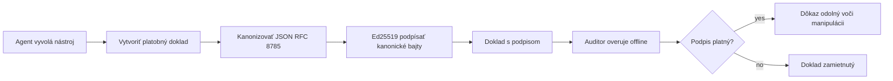
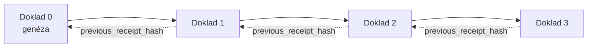

[Pozrite si video lekcie: Zabezpečenie AI agentov pomocou kryptografických potvrdení](https://youtu.be/PLACEHOLDER_VIDEO_ID)

> _(Video lekcie a náhľadový obrázok doplní tím Microsoft obsahu po zlúčení, v súlade s vzorom lekcií 14 / 15.)_

# Zabezpečenie AI agentov pomocou kryptografických potvrdení

## Úvod

Táto lekcia pokryje:

- Prečo sú auditné stopy pre AI agentov dôležité pre súlad, ladenie a dôveru.
- Čo je kryptografické potvrdenie a ako sa líši od nepodpísaného záznamu v logu.
- Ako vyprodukovať podpísané potvrdenie pre volanie nástroja agenta v obyčajnom Pythone.
- Ako overiť potvrdenie offline a zistiť manipuláciu.
- Ako reťaziť potvrdenia tak, aby odstránenie alebo zmena poradia jedného lámala celý reťazec.
- Čo potvrdenia dokazujú a čo výslovne nedokazujú.

## Ciele učenia

Po ukončení tejto lekcie budete vedieť:

- Identifikovať režimy zlyhania, ktoré motivujú kryptografický pôvod akcií agenta.
- Vyprodukovať podpísané potvrdenie Ed25519 nad kanonickou JSON platňou.
- Nezávisle overiť potvrdenie pomocou iba verejného kľúča podpisovateľa.
- Zistiť manipuláciu opätovným spustením overenia modifikovaného potvrdenia.
- Vytvoriť sekvenciu potvrdení prepojenú hash reťazcom a vysvetliť, prečo je reťazec dôležitý.
- Rozpoznať hranicu medzi tým, čo potvrdenia dokazujú (priradenie, integritu, poradie) a čo nie (správnosť akcie, správnosť politiky).

## Problém: Auditná stopa vášho agenta

Predstavte si, že ste nasadili AI agenta pre Contoso Travel. Agent číta požiadavky zákazníkov, volá API letov na vyhľadávanie možností a rezervuje miesta v mene zákazníka. Minulý štvrťrok agent spracoval 50 000 rezervácií.

Dnes prichádza audítor. Položí jednoduchú otázku: "Ukážte mi, čo váš agent urobil."

Odovzdáte im svoje log súbory. Audítor sa pozrie a položí zložitejšiu otázku: "Ako viem, že tieto záznamy neboli upravované?"

Toto je problém auditnej stopy. Väčšina dnešných nasadení agentov sa spolieha na:

- **Aplikačné logy**: zapisované agentom samotným, upraviteľné každým, kto má prístup k súborovému systému.
- **Cloudové logovacie služby**: odolné voči manipulácii na úrovni platformy, ale iba ak audítor dôveruje prevádzkovateľovi platformy.
- **Logy databázových transakcií**: vhodné pre zmeny v databáze, ale nie pre ľubovoľné volania nástrojov.

Žiadne z týchto nemôže odpovedať na otázku audítora bez toho, aby audítor musel niekomu dôverovať (vám, vášmu poskytovateľovi cloudu, vášmu dodávateľovi databázy). Pre interné použitie je táto dôvera často prijateľná. Pre regulované úlohy (financie, zdravotníctvo, čokoľvek podliehajúce nariadeniu EU AI Act) nie je.

Kryptografické potvrdenia tento problém riešia tým, že každá akcia agenta je nezávisle overiteľná. Audítor nemusí dôverovať vám. Potrebuje iba váš verejný kľúč a samotné potvrdenie.

## Čo je to kryptografické potvrdenie?

Potvrdenie je JSON objekt, ktorý zaznamenáva, čo agent urobil, podpísaný digitálnym podpisom.


```mermaid
flowchart LR
    A[Agent vyvolá nástroj] --> B[Vytvoriť platobný doklad]
    B --> C[Kanonizovať JSON RFC 8785]
    C --> E[Ed25519 podpísať kanonické bajty]
    E --> F[Doklad s podpisom]
    F --> G[Auditor overuje offline]
    G --> H{Podpis platný?}
    H -- yes --> I[Dôkaz odolný voči manipulácii]
    H -- no --> J[Doklad zamietnutý]
```

Minimálne potvrdenie vyzerá takto:

```json
{
  "type": "agent.tool_call.v1",
  "agent_id": "contoso-travel-bot",
  "tool_name": "lookup_flights",
  "tool_args_hash": "sha256:a3f9c1...",
  "result_hash": "sha256:7b2e1d...",
  "policy_id": "contoso-travel-policy-v3",
  "timestamp": "2026-04-25T14:30:00Z",
  "sequence": 47,
  "previous_receipt_hash": "sha256:9d4e6a...",
  "signature": {
    "alg": "EdDSA",
    "sig": "c5af83...",
    "public_key": "8f3b2c..."
  }
}
```

Tri vlastnosti vykonávajú túto prácu:

1. **Podpis**. Potvrdenie je podpísané gateway agentom pomocou súkromného kľúča Ed25519. Každý, kto má príslušný verejný kľúč, môže overiť podpis offline. Akákoľvek manipulácia s ktorýmkoľvek poľom podpis invaliduje.

2. **Kanonická kódovanie**. Pred podpisom sa potvrdenie serializuje pomocou JSON Canonicalization Scheme (JCS, RFC 8785). To zabezpečuje, že dve implementácie vytvárajúce rovnaké logické potvrdenie vytvoria identický bajtový výstup. Bez kanonizácie by rôzne JSON serializéry generovali rôzne podpisy pre ten istý obsah.

3. **Hash reťazenie**. Pole `previous_receipt_hash` spája každé potvrdenie s predchádzajúcim. Odstránenie alebo zmena poradia potvrdenia rozbije každé potvrdenie, ktoré nasleduje po ňom. Manipulácia je viditeľná na úrovni reťazca, aj keď sa obídu jednotlivé podpisy.

Spoločne tieto vlastnosti poskytujú tri istoty:

- **Priradenie**: tento kľúč podpísal tento obsah.
- **Integrita**: obsah sa od podpisu nezmenil.
- **Poradie**: toto potvrdenie nasledovalo za tým potvrdením v reťazci.

## Produkcia potvrdenia v Pythone

Nepotrebujete špeciálnu knižnicu na produkciu potvrdenia. Kryptografické primitívy sú široko dostupné a logika má niekoľko desiatok riadkov Pythonu.

Praktické cvičenia v `code_samples/18-signed-receipts.ipynb` prechádzajú celý proces krok po kroku. Zhrnutie:

```python
import json
import hashlib
import base64
from nacl import signing
from jcs import canonicalize  # RFC 8785 kanonický JSON

def b64url_nopad(data: bytes) -> str:
    return base64.urlsafe_b64encode(data).decode("ascii").rstrip("=")

def sha256_canonical(obj) -> str:
    """SHA-256 of a Python object's JCS-canonical JSON form."""
    return f"sha256:{hashlib.sha256(canonicalize(obj)).hexdigest()}"

# Vygenerujte alebo načítajte podpisovací kľúč (v produkcii uložte do úložiska kľúčov)
signing_key = signing.SigningKey.generate()
verify_key = signing_key.verify_key

# Vytvorte náklad účtenky (ešte bez podpisu)
tool_args = {"origin": "SYD", "destination": "LAX"}
tool_result = [{"flight": "QF11", "price": 1850, "stops": 0}]

payload = {
    "type": "agent.tool_call.v1",
    "agent_id": "contoso-travel-bot",
    "tool_name": "lookup_flights",
    "tool_args_hash": sha256_canonical(tool_args),
    "result_hash": sha256_canonical(tool_result),
    "policy_id": "contoso-travel-policy-v3",
    "timestamp": "2026-04-25T14:30:00Z",
    "sequence": 0,
    "previous_receipt_hash": None,
}

# Kanonizujte a podpíšte JCS bajty priamo. PureEdDSA interne hašuje.
canonical_bytes = canonicalize(payload)
signature_bytes = signing_key.sign(canonical_bytes).signature

# Pripojte štruktúrovaný objekt podpisu.
receipt = {
    **payload,
    "signature": {
        "alg": "EdDSA",
        "sig": b64url_nopad(signature_bytes),
        "public_key": b64url_nopad(bytes(verify_key)),
    },
}
```

To je celý proces podpisovania. Cvičenia v notebooku prechádzajú každý krok.

## Overovanie potvrdenia a detekcia manipulácie

Overovanie je opačná operácia:

```python
import base64
import hashlib
from nacl import signing
from nacl.exceptions import BadSignatureError
from jcs import canonicalize

def b64url_decode(s: str) -> bytes:
    padding = "=" * ((4 - len(s) % 4) % 4)
    return base64.urlsafe_b64decode(s + padding)

def verify_receipt(receipt: dict) -> bool:
    # Podpis je štruktúrovaný objekt: {"alg", "sig", "public_key"}.
    sig_obj = receipt.get("signature")
    if not sig_obj or sig_obj.get("alg") != "EdDSA":
        return False

    # Zrekonštruujte záťaž, ktorá bola skutočne podpísaná (všetko okrem podpisu).
    payload = {k: v for k, v in receipt.items() if k != "signature"}

    canonical_bytes = canonicalize(payload)

    try:
        verify_key = signing.VerifyKey(b64url_decode(sig_obj["public_key"]))
        verify_key.verify(canonical_bytes, b64url_decode(sig_obj["sig"]))
        return True
    except BadSignatureError:
        return False
```

Táto funkcia vezme potvrdenie a vráti `True`, ak je podpis platný, inak `False`. Žiadne sieťové volania, žiadne závislosti na službách, nepotrebuje dôveru v žiadnu tretiu stranu.

Ak chcete vidieť detekciu manipulácie v praxi, notebook prechádza:

1. Vytvorenie platného potvrdenia a potvrdenie jeho platnosti.
2. Úpravu jedného bajtu v poli `tool_args_hash`.
3. Opätovné spustenie overenia s neúspechom.

Toto je praktická demonštrácia, že potvrdenia sú odolné voči manipulácii: akákoľvek, aj najmenšia zmena, poruší podpis.

## Reťazenie potvrdení pre viacstupňových agentov

Jedno podpísané potvrdenie chráni jednu akciu. Reťazec potvrdení chráni sekvenciu.


```mermaid
flowchart LR
    R0[Doklad 0<br/>genéza] --> R1[Doklad 1]
    R1 --> R2[Doklad 2]
    R2 --> R3[Doklad 3]
    R1 -. previous_receipt_hash .-> R0
    R2 -. previous_receipt_hash .-> R1
    R3 -. previous_receipt_hash .-> R2
```

Každé potvrdenie zaznamenáva hash predchádzajúceho potvrdenia. Na tiché odstránenie potvrdenia 2 by útočník musel buď:

- Upraviť pole `previous_receipt_hash` potvrdenia 3 (čím poruší podpis potvrdenia 3), ALEBO
- Zfalšovať nový podpis na modifikovanom potvrdení 3 (vyžaduje súkromný kľúč agenta).

Ak je súkromný kľúč v hardvérovej kľúčovej schránke a verejný kľúč zverejňujete s každým potvrdením, žiadny z týchto útokov nie je realizovateľný bez detekcie.

Notebook prechádza:

1. Vytvorenie reťazca troch potvrdení.
2. Overenie, že `previous_receipt_hash` každého potvrdenia zodpovedá skutočnému hashu predchádzajúceho potvrdenia.
3. Manipuláciu s jedným potvrdením uprostred a pozorovanie prerušenia reťazca práve na tomto mieste.

Toto je spôsob, ako vytvoriť auditnú stopu, ktorú dokáže externý audítor overiť bez toho, aby vám musel dôverovať.

## Čo potvrdenia dokazujú (a čo nie)

Toto je najdôležitejšia časť tejto lekcie. Potvrdenia sú mocné, ale ich moc je obmedzená.

**Potvrdenia dokazujú tri veci:**

1. **Priradenie**: konkrétny kľúč podpísal konkrétnu platňu.
2. **Integrita**: platňa sa od podpisu nezmenila.
3. **Poradie**: toto potvrdenie nasledovalo za iným potvrdením v hash reťazci.

**Potvrdenia NEdokazujú:**

1. **Správnosť**: že akcia agenta bola správna. Potvrdenie môže byť podpísané rovnako jednoducho pre nesprávnu odpoveď aj pre správnu.
2. **Súlad s politikou**: že politika referencovaná v `policy_id` bola naozaj vyhodnotená, alebo že by akciu povolila, ak by bola kontrolovaná. Potvrdenie zaznamenáva to, čo bolo tvrdené, nie to, čo bolo vynútené.
3. **Identita okrem kľúča**: potvrdenie hovorí „tento kľúč podpísal tento obsah.“ Nehovorí „tento človek autorizoval toto.“ Pripojenie kľúča k osobe alebo organizácii vyžaduje samostatnú infraštruktúru identity (adresár, registr verejných kľúčov, atď.).
4. **Pravdivosť vstupov**: ak agent dostane manipulovaný prompt a postupuje podľa neho, potvrdenie verne zaznamenáva akciu. Potvrdenia sú následkom validácie vstupov, nie jej náhradou.

Táto hranica je dôležitá z dvoch dôvodov:

- Hovorí vám, na čo sú potvrdenia užitočné: spravovanie a viditeľnosť manipulácie správania agentov, dokonca aj cez organizačné hranice.
- Hovorí vám, aké ďalšie vrstvy ešte potrebujete: validáciu vstupov (lekcia 6), vynucovanie politiky (stručne nižšie), a infraštruktúru identity (mimo rozsahu tejto lekcie).

Bežnou chybou je predpokladať, že „máme potvrdenia“ znamená „sme riadení.“ Nie je to tak. Potvrdenia sú základ. Riadenie je systém, ktorý na tom staviate.

## Dokázanie, že človek schválil presnú akciu

Bod 3 vyššie si zaslúži vlastnú sekciu: potvrdenie o akcii hovorí „tento kľúč podpísal tento obsah,“ nikdy „človek to autorizoval.“ Pre vysokorizikové akcie (refundácie, vymazania, prevody peňazí) sú riadiace rámce stále častejšie požadujú toto chýbajúce vyhlásenie, ktoré je možné produkovať rovnakými primitívmi, ktoré ste už vytvorili v tejto lekcii.

Následný notebook `code_samples/human-authorization-receipts.ipynb` pridáva druhý typ potvrdenia, `human.approval.v1`, v rovnakom tvare obálky ako lekčné potvrdenia (typizovaná platňa podpísaná Ed25519 cez kanonické bajty JCS, s objektom `signature` mimo podpísaných bajtov). Menuovaný schvaľovateľ podpisuje **plnú kanonickú akciu a jej digest** pred vykonaním; potvrdenie akcie agenta nesie **ten istý digest akcie** a `parent_approval_ref`, `receipt_hash` schválenia, rovnaký konvenci ako `previous_receipt_hash` v reťazci, ktorý ste vyššie vytvorili. Jeden `verify_chain` prechádza obe artefakty pod **samostatnými registrovými súbormi kľúčov** (schvaľovacie kľúče versus kľúče agenta), takže cesta kódu je zdieľaná, ale autority už nie.

Tá vlastnosť, povedaná presne: *človek schválil túto presnú akciu a agent vykonal presne túto schválenú akciu.* Opravy v notebooku zabezpečujú, že vlastnosť je skutočná a nie len deklarovaná:

- klasická sada: manipulácia, zmätok zástupcu, opakovanie, falšované kľúče na oboch stranách, nesprávne vstupy;
- **neaktuálna autorita**: podpis, ktorý stále overuje, ale je odmietnutý, pretože sa verzia politiky zmenila, kľúč schvaľovateľa bol odstránený z registrového súboru alebo schválenie vypršalo pred vykonaním;
- **substitúcia digestu**: platne podpísané potvrdenie o akcii ukazujúce na *skutočné* schválenie, ktoré viaže *inú* kanonickú akciu.

Každé zlyhanie odmieta s odlišným dôvodom, takže audítor čítajúci odmietnutie vidí, či autorita starnula, alebo či sa vykonaná akcia zmenila. Pravidlo, ktoré učí notebook: podpísané schválenie samo o sebe nie je autorita. Autorita existuje iba ak obe potvrdenia stále viažu na tú istú kanonickú akciu v čase vykonania. Potvrdenie o schválení človekom je vzdelávacia kompozícia definovaná touto lekciou, nie typ potvrdenia definovaný v `draft-farley-acta-signed-receipts`.

## Produkčné referencie

Python kód v tejto lekcii je zámerne minimálny, aby ste mohli prečítať každý riadok a presne pochopiť, čo sa deje. V produkcii máte dve možnosti:

1. **Stavať priamo na kryptografických primitívoch.** Tých 50 riadkov, ktoré ste videli vyššie, stačí na mnohé použitia. PyNaCl (Ed25519) a balík `jcs` (kanonický JSON) sú dobre udržiavané a auditované knižnice.

2. **Použiť produkčnú knižnicu potvrdení.** Niekoľko open-source projektov implementuje rovnaký vzor s dodatočnými funkciami (rotácia kľúčov, hromadné overovanie, distribúcia JWK Set, integrácia s engine politiky):
   - Potpisovací pipeline používa konvencie JCS a rozsahu podpisu v nezávislom IETF Internet-Draft ([`draft-farley-acta-signed-receipts`](https://datatracker.ietf.org/doc/draft-farley-acta-signed-receipts/), revízia 02). Vzdelávacie ploché potvrdenie z lekcie sa líši od draftovej obálky `{payload, signature}` a nie je prezentované ako konformná implementácia. Draft publikoval spoločnú testovaciu sadu súladu ([agent-governance-testvectors](https://github.com/ScopeBlind/agent-governance-testvectors)) pre implementácie cieliace na jeho štruktúru.
   - Microsoft Agent Governance Toolkit kombinuje potvrdenia s rozhodnutiami politík na báze Cedar; príklad od konca do konca nájdete v Tutoriáli 33 v diaľni.
   - Balíčky `protect-mcp` (npm) a `@veritasacta/verify` (npm) poskytujú Node-based implementáciu podpisovania a offline overenia potvrdení, určené na obalenie akéhokoľvek MCP servera tamper-evident auditnou stopou vrátane režimu čakania na spolu-podpis, kde pozastavená akcia vyprodukuje schvaľovacie potvrdenie viazané na digest akcie (WebAuthn zálohované v desktopovom režime), rovnaký vzor schválení ako v notebooks vyššie.
   - **[nobulex](https://github.com/arian-gogani/nobulex)** Python SDK (`pip install nobulex`) poskytuje ten istý Ed25519 + JCS podpisový vzor v Pythone s integráciami LangChain a CrewAI, vrátane publikovaných testovacích vektorov a mapovania súladu prispel cez [OWASP PR #2210](https://github.com/OWASP/CheatSheetSeries/pull/2210).

Rozhodnutie medzi vlastným riešením a použitím knižnice je podobné rozhodnutiu medzi písaním vlastnej knižnice JWT a použitím otestovanej: obe možnosti sú rozumné; knižnica šetrí čas a znižuje auditný povrch; cesta od základov vás núti rozumieť každému primitívu. Táto lekcia učí cestu od základov, aby ste mali základ pre obe voľby.

## Kontrola vedomostí

Otestujte si svoje chápanie pred prechodom na praktické cvičenie.

**1. Potvrdenie je podpísané súkromným kľúčom Ed25519 agenta. Audítor má iba verejný kľúč. Môže audítor potvrdenie overiť offline?**

<details>
<summary>Odpoveď</summary>

Áno. Overovanie Ed25519 vyžaduje iba verejný kľúč a podpísané bajty. Žiadne sieťové volanie, žiadna závislosť služby. Toto je vlastnosť, ktorá robí potvrdenia užitočnými v izolovaných, viac organizačných alebo nízkodôveryhodných auditných nastaveniach.
</details>

**2. Útočník upraví pole `policy_id` v potvrdení, aby tvrdil, že bolo riadené povolujúcejšou politikou. Podpis bol nad pôvodnou platňou. Čo sa stane pri overovaní?**

<details>
<summary>Odpoveď</summary>


Overenie zlyhá. Podpis bol vypočítaný nad kanonickými bajtmi pôvodného obsahu; zmena akéhokoľvek poľa tieto bajty mení, čo robí podpis neplatným. Útočník by potreboval súkromný kľúč na vytvorenie nového platného podpisu, ktorý však nemá.
</details>

**3. Prečo potvrdenie obsahuje `tool_args_hash` a `result_hash` namiesto surových argumentov a výsledku?**

<details>
<summary>Odpoveď</summary>

Dva dôvody. Po prvé, potvrdenie môže byť archivované alebo prenášané v prostrediach, kde by únik surového obsahu (osobné údaje, obchodné dáta) bol problémom. Hashovanie udržuje potvrdenie malé a obsah súkromný; audítor overuje, či hash zodpovedá samostatne uloženému kópii skutočného obsahu. Po druhé, hashe majú pevnú veľkosť; potvrdenie s hashmi je obmedzené veľkosťou bez ohľadu na veľkosť vstupov a výstupov.
</details>

**4. Pole `previous_receipt_hash` spája každé potvrdenie s jeho predchodcom. Ak útočník potichu vymaže jedno potvrdenie zo stredu reťazca, čo sa stane neplatným?**

<details>
<summary>Odpoveď</summary>

Každé potvrdenie, ktoré prišlo po vymazanom. Ich polia `previous_receipt_hash` už nezodpovedajú skutočnému reťazcu (pretože potvrdenie, na ktoré odkazovali, už neexistuje, alebo reťazec teraz ukazuje na iného predchodcu). Ak chce útočník skryť vymazanie, musel by znovu podpísať každé neskoršie potvrdenie, čo vyžaduje súkromný kľúč.
</details>

**5. Potvrdenie sa overí správne. Dokazuje to, že agentova akcia bola správna, spoľahlivá alebo v súlade s politikou?**

<details>
<summary>Odpoveď</summary>

Nie. Platné potvrdenie dokazuje tri veci: atribúciu (tento kľúč podpísal tento obsah), integritu (obsah sa nezmenil) a zoradenie (toto potvrdenie prišlo po inom). NEdokazuje, že akcia bola správna, že politika uvedená v `policy_id` bola vyhodnotená, alebo že agent dodržal všetky pravidlá. Potvrdenia robia správanie agenta auditovateľným, nie nevyhnutne správnym. Toto je najdôležitejšia hranica tejto lekcie.
</details>

## Cvičenie

Otvorte `code_samples/18-signed-receipts.ipynb` a dokončite všetky štyri sekcie:

1. **Sekcia 1**: Podpíšte svoje prvé potvrdenie a overte ho.
2. **Sekcia 2**: Pokúste sa potvrdenie pozmeniť a sledujte zlyhanie overenia.
3. **Sekcia 3**: Vytvorte trojité reťazcové potvrdenie a overte integritu reťazca.
4. **Sekcia 4**: Aplikujte tento vzor na agenta vytvoreného s Microsoft Agent Framework: zabaľte volanie nástroja do podpisovania potvrdenia a potom potvrdenie overte samostatne.

**Rozšírená výzva 1:** rozšírte schému potvrdenia o ďalšie vlastné pole (napríklad identifikátor požiadavky na sledovanie), aktualizujte kanonickú logiku podpisovania, aby ho zahrnula, a potvrďte, že potvrdenie prejde overením. Potom pole po podpise zmeňte a potvrďte neúspech overenia. Toto vás prinúti pochopiť, ako každý bajt kanonického kódovania ovplyvňuje podpis.

**Rozšírená výzva 2:** SHA-256 zahashujte dve svoje potvrdenia spolu (konkatenáciou ich kanonických bajtov v deterministickom poradí) a vložte výsledný digest ako nové pole do tretieho potvrdenia pred jeho podpisom. Overte, že všetky tri potvrdenia stále prejdú kontrolou. Práve ste vytvorili dôkaz o začlenení v jednom kroku: ktokoľvek s tretím potvrdením môže dokázať existenciu prvých dvoch v čase podpisu, bez odhalenia ich obsahu. Toto je vzor, ktorý sa široko používa pri potvrdeniach s výberovým zverejňovaním (Merkleho záväzky, RFC 6962).

## Záver

Kryptografické potvrdenia dávajú AI agentom auditovateľnú stopu, ktorá je:

- **Nezávisle overiteľná**: každá strana so verejným kľúčom môže overiť, bez závislosti na službe.
- **Zrejmá pri neoprávnenej manipulácii**: každá modifikácia zneplatní podpis.
- **Prenositeľná**: potvrdenie je malý JSON súbor; môže byť archivovaný, prenášaný a overovaný kdekoľvek.
- **V súlade so štandardmi**: postavené na Ed25519 (RFC 8032), JCS (RFC 8785) a SHA-256, všetky široko používané primitíva.

Nie sú náhradou za validáciu vstupov, presadzovanie politiky alebo identitnú infraštruktúru. Sú základom pre tieto vrstvy. Ak nasadzujete agentov do regulovaných pracovných záťaží, medziorganizáciových pracovných tokov alebo akéhokoľvek prostredia, kde budúci audítor vám nemusí plne dôverovať, potvrdenia zabezpečujú čestnú auditnú stopu.

Najdôležitejší odkaz: potvrdenia dokazujú, kto čo povedal a kedy. Nedokazujú, že to, čo bolo povedané, bolo pravdivé alebo správne. Tento rozdiel si pevne udržiavajte na pamäti. Je to rozdiel medzi čestným systémom pôvodu a zavádzajúcim.

## Produkčný zoznam kontrol

Keď ste pripravení prejsť z tejto lekcie na nasadzovanie agentov s podpísanými potvrdeniami v reálnom prostredí:

- [ ] **Presuňte podpisovací kľúč mimo vývojárskeho laptopu.** Použite Azure Key Vault, AWS KMS alebo hardvérový bezpečnostný modul. Súkromný kľúč, ktorý podpisuje vaše potvrdenia, nesmie nikdy byť v zdrojovej kontrole ani v plaintext forme na aplikačných strojoch.
- [ ] **Zverejnite verejný kľúč na overovanie.** Audítori ho potrebujú na offline overovanie. Štandardným vzorom je JWK Set na dobre známom URL (RFC 7517), napríklad `https://your-org.example.com/.well-known/agent-keys.json`.
- [ ] **Externé ukotvenie reťazca.** Pravidelne zapisujte najnovší hash hlavičky reťazca do transparentného záznamu (Sigstore Rekor, RFC 3161 timestamp authority, alebo druhý interný systém), aby externe mohla byť overená existencia tohto reťazca k danému času.
- [ ] **Ukladajte potvrdenia nemenne.** Append-only blob storage (Azure Storage s politikami nemennosti, AWS S3 Object Lock) zabraňuje vnútorným osobám meniť históriu na vrstve ukladania.
- [ ] **Rozhodnite o uchovávaní.** Mnohé normy vyžadujú viacročné uchovávanie. Plánujte rast potvrdení (každé je ~500 bajtov; agent vykonávajúci 10 000 volaní denne vytvorí ~1,8 GB ročne).
- [ ] **Zdokumentujte, čo potvrdenia nekryjú.** Potvrdenia dokazujú atribúciu, integritu a zoradenie. Váš runbook by mal explicitne uviesť, aké ďalšie kontroly (validácia vstupov, presadzovanie politiky, limitovanie frekvencie, identitná infraštruktúra) spolu s potvrdeniami tvoria vašu správu.

### Máte ďalšie otázky o zabezpečení AI agentov?

Pridajte sa do [Microsoft Foundry Discord](https://aka.ms/ai-agents/discord) a stretávajte sa s ostatnými študentmi, navštevujte konzultačné hodiny a získajte odpovede na svoje otázky o AI agentoch.

## Za touto lekciou

Táto lekcia pokrýva podpisovanie jedného potvrdenia a hashovo spojené sekvencie. Rovnaké primitíva tvoria aj niekoľko pokročilejších vzorov, s ktorými sa môžete stretnúť, keď vaša správa dozrieva:

- **Selektívne zverejňovanie.** Keď sú polia potvrdenia nezávisle viazané (Merkle strom podľa RFC 6962), môžete vybrať, ktoré polia ukážete konkrétnym audítorom a dokázať, že ostatné sa nezmenili, bez ich odhalenia. Užitočné, keď rovnaké potvrdenie musí vyhovovať úplnému auditu (čo chce kompletnosť) a zároveň reguláciám minimalizácie dát ako GDPR (ktoré chcú, aby audítor videl čo najmenej).
- **Odvolanie potvrdení.** Ak je kompromitovaný podpisovací kľúč, potrebujete spôsob, ako označiť všetky potvrdenia podpísané týmto kľúčom ako nedôveryhodné od určitého času. Štandardné vzory: krátkodobé podpisovacie kľúče plus zverejnený zoznam odvolaní, alebo transparentný záznam s odvolávacími záznamami.
- **Obojstranné / rozdelené podpisové potvrdenia.** Niektoré implementácie rozdeľujú podpísaný obsah na pred-vykonávaciu (`authorization_*`) a poposlednú (`result_*`) polovicu s nezávislými podpismi, užitočné ak rozhodnutie o autorizácii a pozorovaný výsledok vytvárajú rôzni aktéri alebo v rôznych časoch. Toto sa additívne skladá nad formátom potvrdenia vyučovaným v tejto lekcii.
- **Kombinovanie obsahu.** Potvrdenie zapečatí akékoľvek bajty, ktoré vložíte do `result_hash`. Reálne obsahy sú často bohatšie než výsledok jedného volania nástroja: predbežné uvažovanie (modelový predpoklad, zvážené možnosti, dôkazy a ich úplnosť, riziková pozícia, reťaz zodpovednosti, výsledok brány) môžu všetky žiť v obsahu, zapečatené jedným potvrdením. Toto udržuje formát potvrdenia minimálny, zatiaľ čo schémy obsahu sa môžu vyvíjať doménovo.
- **Konzistencia medzi implementáciami.** Viaceré nezávislé implementácie rovnakého formátu potvrdenia (Python, TypeScript, Rust, Go) sa navzájom overujú pomocou zdieľaných testovacích vektorov. Ak si vybudujete vlastnú implementáciu, overenie podľa zverejnených vektorov potvrdzuje kompatibilitu.
- **Migrácia po kvantovej dobe.** Ed25519 je dnes široko používaný, ale nie je odolný voči kvantovým počítačom. Formát potvrdenia je algoritmicky flexibilný: pole `signature.alg` môže niesť `ML-DSA-65` (štandard NIST pre post-kvantový podpis), keď budete potrebovať migráciu. Plánujte prechodné obdobie, kedy budú potvrdenia dvojito podpísané.

## Dodatočné zdroje

- <a href="https://datatracker.ietf.org/doc/draft-farley-acta-signed-receipts/" target="_blank">IETF Internet-Draft: Signed Decision Receipts for Machine-to-Machine Access Control</a>
- <a href="https://learn.microsoft.com/azure/ai-studio/responsible-use-of-ai-overview" target="_blank">Prehľad zodpovedného využívania AI (Azure AI)</a>
- <a href="https://datatracker.ietf.org/doc/html/rfc8032" target="_blank">RFC 8032: Edwards-Curve Digital Signature Algorithm (EdDSA)</a>
- <a href="https://datatracker.ietf.org/doc/html/rfc8785" target="_blank">RFC 8785: Scheme JSON kanonizácie (JCS)</a>
- <a href="https://datatracker.ietf.org/doc/html/rfc6962" target="_blank">RFC 6962: Transparentnosť certifikátov</a> (Merkle strom používaný selektívnymi potvrdeniami)
- <a href="https://github.com/microsoft/agent-governance-toolkit/blob/main/docs/tutorials/33-offline-verifiable-receipts.md" target="_blank">Microsoft Agent Governance Toolkit, Tutoriál 33: Offline overiteľné rozhodovacie potvrdenia</a>
- <a href="https://github.com/ScopeBlind/agent-governance-testvectors" target="_blank">Vektorové testy súladu medzi implementáciami</a> formátu potvrdení použitého v tejto lekcii (Apache-2.0)
- <a href="https://pynacl.readthedocs.io/" target="_blank">Dokumentácia PyNaCl</a> (Ed25519 v Pythone)

## Predchádzajúca lekcia

[Tvorba lokálnych AI agentov](../17-creating-local-ai-agents/README.md)

---

<!-- CO-OP TRANSLATOR DISCLAIMER START -->
**Vyhlásenie o zodpovednosti**:
Tento dokument bol preložený pomocou AI prekladateľskej služby [Co-op Translator](https://github.com/Azure/co-op-translator). Hoci sa snažíme o presnosť, vezmite prosím na vedomie, že automatické preklady môžu obsahovať chyby alebo nepresnosti. Pôvodný dokument v jeho natívnom jazyku by mal byť považovaný za autoritatívny zdroj. Pre kritické informácie sa odporúča profesionálny ľudský preklad. Nie sme zodpovední za žiadne nedorozumenia alebo nesprávne interpretácie vyplývajúce z použitia tohto prekladu.
<!-- CO-OP TRANSLATOR DISCLAIMER END -->