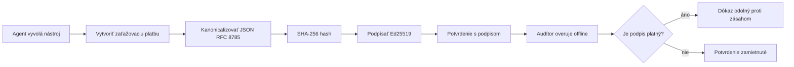
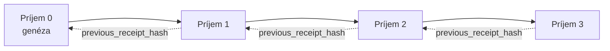

[Pozrite si video lekcie: Zabezpečenie AI agentov pomocou kryptografických potvrdení](https://youtu.be/PLACEHOLDER_VIDEO_ID)

> _(Video lekcie a náhľad budú pridané tímom Microsoft pre obsah po zlúčení, v súlade so vzorom lekcií 14 / 15.)_

# Zabezpečenie AI agentov pomocou kryptografických potvrdení

## Úvod

V tejto lekcii sa dozviete:

- Prečo sú auditné stopy pre AI agentov dôležité pre dodržiavanie predpisov, ladenie a dôveru.
- Čo je kryptografické potvrdenie a ako sa líši od nepodpísaného záznamu v logu.
- Ako vyprodukovať podpísané potvrdenie pre volanie nástroja agenta v obyčajnom Pythone.
- Ako potvrdenie offline overiť a zistiť manipuláciu.
- Ako reťaziť potvrdenia tak, aby odstránenie alebo preusporiadanie jedného toto reťazenie prerušilo.
- Čo potvrdenia dokazujú a čo explicitne nedokazujú.

## Ciele učenia

Po dokončení tejto lekcie budete vedieť:

- Identifikovať režimy zlyhaní, ktoré motivujú kryptografickú pôvodnosť akcií agenta.
- Vyprodukovať potvrdenie podpísané Ed25519 nad kanonickým JSON nákladom.
- Nezávisle overiť potvrdenie len pomocou verejného kľúča podpisovateľa.
- Zistiť manipuláciu opätovným spustením overenia na upravenom potvrdení.
- Vytvoriť hashovo reťazenú sekvenciu potvrdení a vysvetliť, prečo je reťaz dôležitá.
- Rozpoznať hranicu medzi tým, čo potvrdenia dokazujú (priradenie, integrita, objednanie) a čo nedokazujú (správnosť akcie, platnosť politiky).

## Problém: Auditná stopa vášho agenta

Predstavte si, že nasadíte AI agenta pre Contoso Travel. Agent číta požiadavky zákazníka, volá API letov na vyhľadanie možností a rezervuje miesta za zákazníka. Za posledný štvrťrok agent spracoval 50 000 rezervácií.

Dnes prichádza audítor. Položí jednoduchú otázku: „Ukážte mi, čo váš agent urobil.“

Podáte mu svoje logy. Audítor ich prehliadne a položí ťažšiu otázku: „Ako viem, že tieto logy neboli upravované?“

Toto je problém auditnej stopy. Väčšina dnešných nasadení agentov spolieha na:

- **Aplikačné logy**: zapisované samotným agentom, upraviteľné kýmkoľvek s prístupom k súborovému systému.
- **Cloudové služby na logovanie**: na úrovni platformy sú proti manipulácii, ale len ak audítor dôveruje prevádzkovateľovi platformy.
- **Logy transakcií databázy**: vhodné pre zmeny v databáze, ale nie pre ľubovoľné volania nástrojov.

Žiadna z týchto možností nedokáže odpovedať audítorovi bez toho, aby musel niekomu dôverovať (vám, vášmu cloudovému poskytovateľovi, predajcovi databázy). Pre interné použitie je táto dôvera často prijateľná. Pre regulované pracovné záťaže (financie, zdravotná starostlivosť, čokoľvek podliehajúce EÚ AI zákonu) nie je.

Kryptografické potvrdenia riešia tento problém tým, že každá akcia agenta je nezávisle overiteľná. Audítor nemusí dôverovať vám. Potrebuje iba váš verejný kľúč a samotné potvrdenie.

## Čo je kryptografické potvrdenie?

Potvrdenie je JSON objekt, ktorý zaznamenáva, čo agent urobil, podpísaný digitálnym podpisom.


```mermaid
flowchart LR
    A[Agent vyvolá nástroj] --> B[Vytvoriť zaťažovaciu platbu]
    B --> C[Kanonicalizovať JSON RFC 8785]
    C --> D[SHA-256 hash]
    D --> E[Podpísať Ed25519]
    E --> F[Potvrdenie s podpisom]
    F --> G[Audítor overuje offline]
    G --> H{Je podpis platný?}
    H -- áno --> I[Dôkaz odolný proti zásahom]
    H -- nie --> J[Potvrdenie zamietnuté]
```

Minimálne potvrdenie vyzerá takto:

```json
{
  "type": "agent.tool_call.v1",
  "agent_id": "contoso-travel-bot",
  "tool_name": "lookup_flights",
  "tool_args_hash": "sha256:a3f9c1...",
  "result_hash": "sha256:7b2e1d...",
  "policy_id": "contoso-travel-policy-v3",
  "timestamp": "2026-04-25T14:30:00Z",
  "sequence": 47,
  "previous_receipt_hash": "sha256:9d4e6a...",
  "signature": {
    "alg": "EdDSA",
    "sig": "c5af83...",
    "public_key": "8f3b2c..."
  }
}
```

Tri vlastnosti sa podieľajú na fungovaní:

1. **Podpis**. Potvrdenie je podpísané bránou agenta pomocou súkromného kľúča Ed25519. Každý, kto má zodpovedajúci verejný kľúč, môže podpis offline overiť. Akákoľvek manipulácia s ktorýmkoľvek poľom podpis stanoví ako neplatný.

2. **Kanonické kódovanie**. Pred podpisom sa potvrdenie serializuje pomocou JSON Canonicalization Scheme (JCS, RFC 8785). Toto zabezpečí, že dve implementácie produkujúce rovnaké logické potvrdenie vytvoria bajtovo identický výstup. Bez kanonizácie by rôzne serializátory JSON vygenerovali odlišné podpisy pre rovnaký obsah.

3. **Hashové reťazenie**. Pole `previous_receipt_hash` spája každé potvrdenie s tým predchádzajúcim. Odstránenie alebo preusporiadanie potvrdenia rozbije všetky nasledujúce potvrdenia v reťazci. Manipulácia je zjavná na úrovni reťazca, aj keď sa jednotlivo podpisi obídu.

Spoločne tieto vlastnosti poskytujú tri záruky:

- **Priradenie**: tento kľúč podpísal tento obsah.
- **Integrita**: obsah sa od podpisu nezmenil.
- **Objednanie**: toto potvrdenie prišlo v reťazci po danom potvrdení.

## Produkcia potvrdenia v Pythone

Na produkciu potvrdenia nemusíte mať žiadnu špeciálnu knižnicu. Kryptografické primitíva sú široko dostupné a logika má len pár desiatok riadkov v Pythone.

Praktické cvičenia v `code_samples/18-signed-receipts.ipynb` prechádzajú celý proces. Stručný prehľad:

```python
import json
import hashlib
import base64
from nacl import signing
from jcs import canonicalize  # Kanonický JSON podľa RFC 8785

def b64url_nopad(data: bytes) -> str:
    return base64.urlsafe_b64encode(data).decode("ascii").rstrip("=")

def sha256_canonical(obj) -> str:
    """SHA-256 of a Python object's JCS-canonical JSON form."""
    return f"sha256:{hashlib.sha256(canonicalize(obj)).hexdigest()}"

# Vygenerujte alebo načítajte podpisovací kľúč (v produkcii uložte do trezoru kľúčov)
signing_key = signing.SigningKey.generate()
verify_key = signing_key.verify_key

# Vytvorte obsah účtenky (zatiaľ bez podpisu)
tool_args = {"origin": "SYD", "destination": "LAX"}
tool_result = [{"flight": "QF11", "price": 1850, "stops": 0}]

payload = {
    "type": "agent.tool_call.v1",
    "agent_id": "contoso-travel-bot",
    "tool_name": "lookup_flights",
    "tool_args_hash": sha256_canonical(tool_args),
    "result_hash": sha256_canonical(tool_result),
    "policy_id": "contoso-travel-policy-v3",
    "timestamp": "2026-04-25T14:30:00Z",
    "sequence": 0,
    "previous_receipt_hash": None,
}

# Kanonizujte, zahashujte, podpíšte.
canonical_bytes = canonicalize(payload)
message_hash = hashlib.sha256(canonical_bytes).digest()
signature_bytes = signing_key.sign(message_hash).signature

# Pripojte štruktúrovaný objekt podpisu.
receipt = {
    **payload,
    "signature": {
        "alg": "EdDSA",
        "sig": b64url_nopad(signature_bytes),
        "public_key": b64url_nopad(bytes(verify_key)),
    },
}
```

To je celý podpisovací proces. Cvičenia v notebooku prejdú každý krok podrobne.

## Overenie potvrdenia a detekcia manipulácie

Overovanie je opačná operácia:

```python
import base64
import hashlib
from nacl import signing
from nacl.exceptions import BadSignatureError
from jcs import canonicalize

def b64url_decode(s: str) -> bytes:
    padding = "=" * ((4 - len(s) % 4) % 4)
    return base64.urlsafe_b64decode(s + padding)

def verify_receipt(receipt: dict) -> bool:
    # Podpis je štruktúrovaný objekt: {"alg", "sig", "public_key"}.
    sig_obj = receipt.get("signature")
    if not sig_obj or sig_obj.get("alg") != "EdDSA":
        return False

    # Obnovte obsah, ktorý bol skutočne podpísaný (všetko okrem podpisu).
    payload = {k: v for k, v in receipt.items() if k != "signature"}

    canonical_bytes = canonicalize(payload)
    message_hash = hashlib.sha256(canonical_bytes).digest()

    try:
        verify_key = signing.VerifyKey(b64url_decode(sig_obj["public_key"]))
        verify_key.verify(message_hash, b64url_decode(sig_obj["sig"]))
        return True
    except BadSignatureError:
        return False
```

Táto funkcia prijíma potvrdenie a vracia `True`, ak je podpis platný, inak `False`. Žiadne sieťové volanie, žiadna závislosť na službe, žiadna dôvera v tretiu stranu nie je potrebná.

Aby ste videli detekciu manipulácie v praxi, notebook prechádza:

1. Vytvorenie platného potvrdenia a potvrdenie, že sa overí.
2. Úprava jedného bajtu v poli `tool_args_hash`.
3. Opätovné spustenie overenia s neúspešným výsledkom.

Toto je praktický dôkaz, že potvrdenia sú odolné proti manipulácii: akákoľvek zmena, akokoľvek malá, zruší podpis.

## Reťazenie potvrdení pre viacstupňových agentov

Jedno podpísané potvrdenie chráni jednu akciu. Reťaz potvrdení chráni sekvenciu.


```mermaid
flowchart LR
    R0[Príjem 0<br/>genéza] --> R1[Príjem 1]
    R1 --> R2[Príjem 2]
    R2 --> R3[Príjem 3]
    R1 -. previous_receipt_hash .-> R0
    R2 -. previous_receipt_hash .-> R1
    R3 -. previous_receipt_hash .-> R2
```

Každé potvrdenie uchováva hash predchádzajúceho potvrdenia. Na tiché odstránenie potvrdenia číslo 2 by útočník musel buď:

- Zmeniť `previous_receipt_hash` v potvrdení číslo 3 (čo rozbije podpis potvrdenia číslo 3), ALEBO
- Sfabrikovať nový podpis pre upravené potvrdenie číslo 3 (čo vyžaduje súkromný kľúč agenta).

Ak je súkromný kľúč uložený v hardvérovej trezore kľúčov a verejný kľúč zverejňujete s každým potvrdením, ani jeden z týchto útokov nie je bez odhalenia možný.

Notebook prechádza:

1. Vytvorenie reťazca troch potvrdení.
2. Overenie, že každý `previous_receipt_hash` zodpovedá skutočnému hashu predchádzajúceho potvrdenia.
3. Úprava jedného potvrdenia uprostred reťazca a pozorovanie prerušenia reťazca práve na tomto mieste.

Takto vytvoríte auditnú stopu, ktorú môže externý audítor overiť bez toho, aby vám musel dôverovať.

## Čo potvrdenia dokazujú (a čo nedokazujú)

Toto je najdôležitejšia časť lekcie. Potvrdenia sú silné, ale ich sila má hranice.

**Potvrdenia dokazujú tri veci:**

1. **Priradenie**: konkrétny kľúč podpísal konkrétny náklad.
2. **Integrita**: od podpisu sa náklad nezmenil.
3. **Objednanie**: toto potvrdenie prišlo v reťazci po danom potvrdení.

**Potvrdenia NEdokazujú:**

1. **Správnosť**: že akcia agenta bola správna. Potvrdenie môže byť podpísané rovnako jednoducho pre nesprávnu odpoveď ako pre správnu.
2. **Súlad s politikou**: že politika uvedená v `policy_id` bola skutočne vyhodnotená, alebo že by túto akciu povolila, ak by bola skontrolovaná. Potvrdenie zaznamenáva to, čo bolo tvrdené, nie to, čo bolo vynútené.
3. **Identitu nad rámec kľúča**: potvrdenie hovorí „tento kľúč podpísal tento obsah.“ Nehovorí však „tento človek to autorizoval.“ Prepojenie kľúča s osobou alebo organizáciou si vyžaduje samostatnú identifikačnú infraštruktúru (adresár, register verejných kľúčov a pod.).
4. **Pravdivosť vstupov**: ak agent dostane zmanipulovanú výzvu a podľa nej vykoná akciu, potvrdenie túto akciu verne zaznamená. Potvrdenia sú závislé od validácie vstupov, nie jej náhradou.

Táto hranica je dôležitá z dvoch dôvodov:

- Hovorí vám, na čo sú potvrdenia užitočné: spraviť správanie agenta auditovateľným a odolným proti manipulácii, dokonca naprieč organizačnými hranicami.
- Ukazuje, aké ďalšie vrstvy stále potrebujete: validácia vstupov (Lekcia 6), vynucovanie politiky (krátko spomenuté nižšie) a identifikačnú infraštruktúru (mimo rozsah tejto lekcie).

Bežnou chybou je predpokladať, že „máme potvrdenia“ znamená „sme riadení.“ Nie je to tak. Potvrdenia sú základ. Riadenie je systém, ktorý na tom stavať.

## Produkčné odkazy

Kód v tejto lekcii je zámerne minimálny, aby ste vedeli čítať každý riadok a rozumeli presne, čo sa deje. V produkcii máte dve možnosti:

1. **Stavať priamo na kryptografických primitívach.** Tých 50 riadkov vyššie stačí pre mnohé použitia. PyNaCl (Ed25519) a balík `jcs` (kanonický JSON) sú dobre udržiavané a auditované knižnice.

2. **Použiť produkčnú knižnicu na potvrdenia.** Niekoľko open-source projektov implementuje rovnaký vzor s ďalšími funkciami (rotácia kľúčov, hromadné overovanie, distribúcia JWK setu, integrácia s mechanizmami politiky):
   - Formát potvrdenia použitý v tejto lekcii vychádza zo IETF Internet-Draftu (`draft-farley-acta-signed-receipts`), ktorý je momentálne v štandardizačnom procese.
   - Microsoft Agent Governance Toolkit skladá potvrdenia s rozhodnutiami v politike na báze Cedar; pozrite si Tutorial 33 v tom repozitári pre kompletný príklad.
   - Balíky `protect-mcp` (npm) a `@veritasacta/verify` (npm) poskytujú Node-implementáciu podpisovania potvrdení a offline overovania, určené na obalenie každého MCP servera auditnou stopou s odhalením manipulácie.
   - **[nobulex](https://github.com/arian-gogani/nobulex)** Python SDK (`pip install nobulex`) poskytuje rovnaký Ed25519 + JCS podpisovací vzor v Pythone s integráciami LangChain a CrewAI, vrátane zverejnených testovacích vektorov a mapovania súladu prispelého cez [OWASP PR #2210](https://github.com/OWASP/CheatSheetSeries/pull/2210).

Rozhodnutie medzi vlastnou implementáciou a knižnicou pripomína voľbu medzi vlastnou JWT knižnicou a použítím otestovanej: obe sú rozumné; knižnica šetrí čas a znižuje auditnú plochu; vlastná cesta vás núti rozumieť každej primitíve. Táto lekcia vás učí vlastnú cestu, aby ste mali základ pre obe možnosti.

## Kontrola znalostí

Otestujte svoje porozumenie predtým, než prejdete k praktickému cvičeniu.

**1. Potvrdenie je podpísané súkromným Ed25519 kľúčom agenta. Audítor má len verejný kľúč. Môže audítor potvrdenie offline overiť?**

<details>
<summary>Odpoveď</summary>

Áno. Overenie Ed25519 vyžaduje iba verejný kľúč a podpísané bajty. Žiadne volanie do siete, žiadna závislosť na službe. Táto vlastnosť robí potvrdenia užitočnými v izolovaných, viacerých organizáciách alebo nízko dôveryhodných auditoch.
</details>

**2. Útočník upraví pole `policy_id` v potvrdení tak, aby tvrdilo, že bolo spravované liberálnejšou politikou. Podpis bol vykonaný nad pôvodným nákladom. Čo sa stane pri overovaní?**

<details>
<summary>Odpoveď</summary>

Overenie zlyhá. Podpis sa vypočítal nad kanonickými bajtmi pôvodného nákladu; zmena akéhokoľvek poľa mení bajty, mení SHA-256 hash a tým pádom podpis nie je platný. Útočník by musel mať súkromný kľúč na vytvorenie nového platného podpisu, čo nemá.
</details>

**3. Prečo potvrdenie obsahuje `tool_args_hash` a `result_hash` namiesto surových argumentov a výsledku?**

<details>
<summary>Odpoveď</summary>

Dva dôvody. Po prvé, potvrdenie môže byť archivované alebo prenášané v prostrediach, kde by únik surového obsahu (osobné údaje, obchodné dáta) bol problém. Hashovanie udržiava potvrdenie malé a obsah súkromný; audítor overí, že hash zodpovedá samostatne uloženým dátam. Po druhé, hash má pevne danú veľkosť; potvrdenie s hashmi je teda ohraničené v veľkosti bez ohľadu na veľkosť vstupov a výstupov.
</details>

**4. Pole `previous_receipt_hash` spája každé potvrdenie s predchodcom. Ak útočník ticho vymaže jedno potvrdenie uprostred reťazca, čo sa stane neplatným?**

<details>
<summary>Odpoveď</summary>

Každé potvrdenie stojace za vymazaným. Ich polia `previous_receipt_hash` už nezodpovedajú skutočnému reťazcu (potvrdenie, na ktoré odkazovali, už neexistuje alebo reťaz teraz ukazuje na iného predchodcu). Na ukrytie vymazania by útočník musel všetky neskoršie potvrdenia znovu podpísať, čo vyžaduje súkromný kľúč.
</details>

**5. Potvrdenie sa čisto overí. Dokazuje to správnosť, rozumnosť alebo súlad akcie agenta s politikou?**

<details>
<summary>Odpoveď</summary>

Nie. Platné potvrdenie dokazuje tri veci: priradenie (tento kľúč podpísal tento obsah), integritu (obsah sa nezmenil) a objednanie (potvrdenie prišlo po inom potvrdení). NEdokazuje, že akcia bola správna, že politika v `policy_id` bola skutočne vyhodnotená, ani že agent dodržiaval pravidlá. Potvrdenia robia správanie agenta auditovateľným, nie nevyhnutne správnym. Toto je najdôležitejšia hranica lekcie.
</details>

## Praktické cvičenie

Otvorte `code_samples/18-signed-receipts.ipynb` a dokončite všetky štyri sekcie:

1. **Sekcia 1**: Podpíšte svoje prvé potvrdenie a overte ho.
2. **Sekcia 2**: Manipulujte s potvrdením a sledujte zlyhanie overenia.
3. **Sekcia 3**: Vytvorte reťaz troch potvrdení a overte jej integritu.
4. **Sekcia 4**: Použite tento vzor na agenta postaveného na Microsoft Agent Framework: obalte volanie nástroja podpisovaním potvrdenia a potom potvrdenie nezávisle overte.
**Rozšírená výzva 1:** rozšírte schému potvrdenia o ďalšie pole podľa vlastného výberu (napríklad ID požiadavky na sledovanie), aktualizujte kanonickú logiku podpisovania tak, aby ho zahrnovala, a potvrďte, že potvrdenie stále prejde verifikáciou. Potom pole po podpise zmeňte a potvrďte, že overenie zlyhá. Toto vás prinúti pochopiť, ako každý bajt kanonického kódovania prispieva k podpisu.

**Rozšírená výzva 2:** pomocou SHA-256 zahashujte dva svoje potvrdenia dokopy (spojte ich kanonické bajty v deterministickom poradí) a výsledný digest vložte ako nové pole do tretieho potvrdenia pred jeho podpísaním. Overte, že všetky tri potvrdenia stále prejdú verifikáciou. Práve ste vytvorili dôkaz o jednorazovom začlenení: každý, kto vlastní tretie potvrdenie, môže dokázať, že prvé dve existovali v čase jeho podpísania, bez toho, aby musel prezradiť ich obsah. Toto je vzor, ktorý selektívne zverejňujúce potvrdenia používajú vo veľkom meradle (Merkleho záväzky, RFC 6962).

## Záver

Kryptografické potvrdenia poskytujú AI agentom auditovateľnú stopu, ktorá je:

- **Nezávisle overiteľná**: ktokoľvek s verejným kľúčom môže overiť, bez závislosti na službe.
- **Odolná proti manipulácii**: akákoľvek úprava podpis zneplatní.
- **Prenosná**: potvrdenie je malý JSON súbor; dá sa archivovať, prenášať a overovať kdekoľvek.
- **V súlade so štandardmi**: postavené na Ed25519 (RFC 8032), JCS (RFC 8785) a SHA-256, všetko široko používané primitíva.

Nie sú náhradou za validáciu vstupu, vynucovanie pravidiel alebo identitnú infraštruktúru. Sú základom pre tieto vrstvy. Keď nasadzujete agentov do regulovaných prostredí, pracovných procesov pre viac organizácií alebo do situácií, kde sa nemožno spoľahnúť, že vám budúci audítor dôveruje, potvrdenia sú spôsob, ako urobiť auditovateľnú stopu poctivou.

Najdôležitejšie zhrnutie: potvrdenia dokazujú, kto čo povedal a kedy. Nedokazujú, že to, čo bolo povedané, je pravda alebo správne. Dodržiavajte tento rozdiel pevne. Je to rozdiel medzi čestným systémom pôvodu a zavádzajúcim.

## Kontrolný zoznam pre produkciu

Keď ste pripravení prejsť z tejto lekcie na nasadenie agentov s podpísanými potvrdeniami v reálnom prostredí:

- [ ] **Presuňte kľúč na podpisovanie z vývojárskeho laptopu.** Použite Azure Key Vault, AWS KMS alebo hardvérový bezpečnostný modul. Súkr. kľúč, ktorý podpisuje vaše potvrdenia, nesmie nikdy byť v zdrojovom kóde alebo v čitateľnej podobe v aplikačných strojoch.
- [ ] **Zverejnite verejný kľúč na overovanie.** Audítori ho potrebujú na offline overovanie. Štandardný vzor je JWK Set na dobre známom URL (RFC 7517), napr. `https://your-org.example.com/.well-known/agent-keys.json`.
- [ ] **Externé zakotvenie reťazca.** Pravidelne zapisujte hash hlavy reťazca do transparentného logu (Sigstore Rekor, RFC 3161 časová autorita alebo druhý interný systém), aby externá strana mohla potvrdiť „tento reťazec v túto dobu existoval“.
- [ ] **Ukladajte potvrdenia nemenným spôsobom.** Append-only blob storage (Azure Storage s politikami nemennosti, AWS S3 Object Lock) zabráni insiderovi prepísať históriu na úrovni uloženia.
- [ ] **Rozhodnite sa o retencii.** Mnohé režimy dodržiavania vyžadujú viacročný archiv. Plánujte rast počtu potvrdení (každé má ~500 bajtov; agent s 10 000 volaniami denne vytvorí ~1,8 GB ročne).
- [ ] **Zdokumentujte, čo potvrdenia nepokrývajú.** Potvrdenia dokazujú priradenie, integritu a zoradenie. Váš postup by mal explicitne uviesť, aké ďalšie kontroly (validácia vstupu, vynútenie pravidiel, obmedzenie rýchlosti, identitná infraštruktúra) idú vedľa potvrdení vo vašej správe riadenia.

### Máte ďalšie otázky týkajúce sa zabezpečenia AI agentov?

Pripojte sa k [Microsoft Foundry Discord](https://aka.ms/ai-agents/discord), kde sa stretnete s ostatnými študentmi, zúčastníte sa konzultačných hodín a získate odpovede na svoje otázky o AI agentoch.

## Mimo tejto lekcie

Táto lekcia pokrýva podpisovanie jedného potvrdenia a hash-reťazené sekvencie. Tie isté primitíva sa komponujú do niekoľkých pokročilejších vzorov, na ktoré môžete naraziť s vývojom svojej správy riadenia:

- **Selektívne zverejňovanie.** Keď sú polia potvrdenia nezávisle záväzným spôsobom (Merkle strom podľa RFC 6962), môžete odhaliť konkrétne polia konkrétnym audítorom a zároveň dokázať, že ostatné zostávajú nezmenené bez ich odhalenia. Užitečné, keď to isté potvrdenie musí vyhovieť komplexnému auditu (ktorý chce úplnosť) aj reguláciám minimalizácie údajov ako GDPR (ktoré požadujú, aby audítor videl čo najmenej).
- **Odvolanie potvrdenia.** Ak je podpisový kľúč kompromitovaný, potrebujete spôsob, ako označiť všetky potvrdenia podpísané týmto kľúčom za nedôveryhodné od určitého času. Štandardné vzory: krátkodobé podpisové kľúče plus zverejnený zoznam odvolaní, alebo transparentný log s položkami odvolania.
- **Bilateralné / rozdelené podpisové potvrdenia.** Niektoré implementácie rozdeľujú podpísaný obsah do pre-vykonávacej (`authorization_*`) a po-vykonávacej (`result_*`) polovice s nezávislými podpismi, užitočné keď rozhodnutie o autorizácii a jeho výsledok produkujú rôzni aktéri alebo v rôznych časoch. Toto kompozuje na vrch formátu potvrdenia naučeného v tejto lekcii.
- **Kompozícia obsahu.** Potvrdenie uzatvára ľubovoľné bajty, ktoré dáte do `result_hash`. Reálne zaťaženia sú často bohatšie než iba výsledok jedného nástroja: pred-bezrozhodný rozbor (predikcia modelu, zvažované možnosti, dôkazy a ich úplnosť, riziková pozícia, sledovateľnosť, výsledok brány) môžu všetko žiť v obsahu uzavretom jedným potvrdením. Toto udržuje formát potvrdenia minimalistický, zatiaľ čo schémy obsahu môžu postupne rásť podľa domény.
- **Kompatibilita medzi implementáciami.** Viaceré nezávislé implementácie rovnakého formátu potvrdenia (Python, TypeScript, Rust, Go) vzájomne overujú testovacie vektory. Ak vytvoríte vlastnú implementáciu, validácia na zverejnených vektoroch potvrdí kompatibilitu.
- **Migrácia na post-kvantový štandard.** Ed25519 je široko používaný dnes, ale nie je odolný voči kvantovým počítačom. Formát potvrdenia je algoritmicky flexibilný: pole `signature.alg` môže niesť `ML-DSA-65` (NIST post-kvantový štandard podpisu), keď budete musieť migrovať. Plánujte prechodné obdobie, kde potvrdenia budú dvojnásobne podpisované.

## Ďalšie zdroje

- <a href="https://datatracker.ietf.org/doc/draft-farley-acta-signed-receipts/" target="_blank">IETF Internet-Draft: Signed Decision Receipts for Machine-to-Machine Access Control</a>
- <a href="https://learn.microsoft.com/azure/ai-studio/responsible-use-of-ai-overview" target="_blank">Prehľad zodpovedného používania AI (Azure AI)</a>
- <a href="https://datatracker.ietf.org/doc/html/rfc8032" target="_blank">RFC 8032: Edwards-Curve Digitálny podpisový algoritmus (EdDSA)</a>
- <a href="https://datatracker.ietf.org/doc/html/rfc8785" target="_blank">RFC 8785: Schéma kanonizácie JSON (JCS)</a>
- <a href="https://datatracker.ietf.org/doc/html/rfc6962" target="_blank">RFC 6962: Transparentnosť certifikátov</a> (Merkle strom používaný u selektívne zverejňujúcich potvrdení)
- <a href="https://github.com/microsoft/agent-governance-toolkit/blob/main/docs/tutorials/33-offline-verifiable-receipts.md" target="_blank">Microsoft Agent Governance Toolkit, Tutoriál 33: Offline Overiteľné rozhodovacie potvrdenia</a>
- <a href="https://github.com/ScopeBlind/agent-governance-testvectors" target="_blank">Krížové testovacie vektory pre formát potvrdenia použité v tejto lekcii (Apache-2.0)</a>
- <a href="https://pynacl.readthedocs.io/" target="_blank">Dokumentácia PyNaCl</a> (Ed25519 v Pythone)

## Predchádzajúca lekcia

[Budovanie agentov na používanie počítača (CUA)](../15-browser-use/README.md)

---

<!-- CO-OP TRANSLATOR DISCLAIMER START -->
**Vyhlásenie o zodpovednosti**:
Tento dokument bol preložený pomocou AI prekladateľskej služby [Co-op Translator](https://github.com/Azure/co-op-translator). Hoci sa snažíme o presnosť, vezmite prosím na vedomie, že automatické preklady môžu obsahovať chyby alebo nepresnosti. Pôvodný dokument v jeho natívnom jazyku by mal byť považovaný za autoritatívny zdroj. Pre kritické informácie sa odporúča profesionálny ľudský preklad. Nie sme zodpovední za žiadne nedorozumenia alebo nesprávne interpretácie vyplývajúce z použitia tohto prekladu.
<!-- CO-OP TRANSLATOR DISCLAIMER END -->