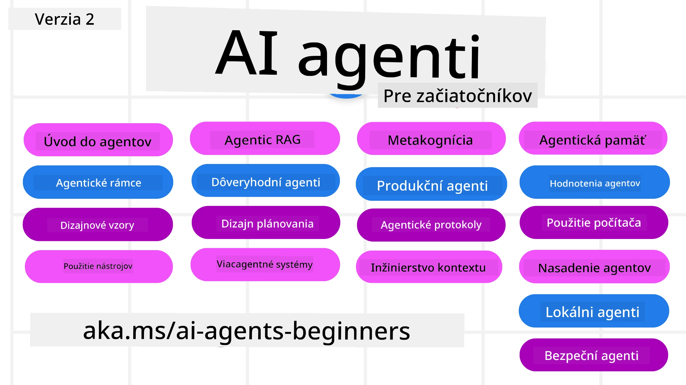

# AI Agentov pre Začiatočníkov - Kurz



## Kurz, ktorý vás naučí všetko potrebné na začatie tvorby AI Agentov

[](https://github.com/microsoft/ai-agents-for-beginners/blob/master/LICENSE?WT.mc_id=academic-105485-koreyst)
[](https://GitHub.com/microsoft/ai-agents-for-beginners/graphs/contributors/?WT.mc_id=academic-105485-koreyst)
[](https://GitHub.com/microsoft/ai-agents-for-beginners/issues/?WT.mc_id=academic-105485-koreyst)
[](https://GitHub.com/microsoft/ai-agents-for-beginners/pulls/?WT.mc_id=academic-105485-koreyst)
[](http://makeapullrequest.com?WT.mc_id=academic-105485-koreyst)

### 🌐 Podpora viacerých jazykov

#### Podporované cez GitHub Akciu (automatizované & vždy aktuálne)

<!-- CO-OP TRANSLATOR LANGUAGES TABLE START -->
[Arabčina](../ar/README.md) | [Bengálčina](../bn/README.md) | [Bulharčina](../bg/README.md) | [Barmský (Myanmar)](../my/README.md) | [Čínština (zjednodušená)](../zh-CN/README.md) | [Čínština (tradičná, Hongkong)](../zh-HK/README.md) | [Čínština (tradičná, Macau)](../zh-MO/README.md) | [Čínština (tradičná, Taiwan)](../zh-TW/README.md) | [Chorvátčina](../hr/README.md) | [Čeština](../cs/README.md) | [Dánčina](../da/README.md) | [Holandčina](../nl/README.md) | [Estónčina](../et/README.md) | [Fínčina](../fi/README.md) | [Francúzština](../fr/README.md) | [Nemčina](../de/README.md) | [Gréčtina](../el/README.md) | [Hebrejčina](../he/README.md) | [Hindčina](../hi/README.md) | [Maďarčina](../hu/README.md) | [Indonézština](../id/README.md) | [Taliančina](../it/README.md) | [Japončina](../ja/README.md) | [Kannada](../kn/README.md) | [Khmerčina](../km/README.md) | [Kórejčina](../ko/README.md) | [Litovčina](../lt/README.md) | [Malajčina](../ms/README.md) | [Malajálamčina](../ml/README.md) | [Maráthčina](../mr/README.md) | [Nepálčina](../ne/README.md) | [Nigerijská pidžinčina](../pcm/README.md) | [Nórčina](../no/README.md) | [Perzština (Farsi)](../fa/README.md) | [Poľština](../pl/README.md) | [Portugalčina (Brazília)](../pt-BR/README.md) | [Portugalčina (Portugalsko)](../pt-PT/README.md) | [Pandžábčina (Gurmukhi)](../pa/README.md) | [Rumunčina](../ro/README.md) | [Ruština](../ru/README.md) | [Srbčina (cyrilika)](../sr/README.md) | [Slovenčina](./README.md) | [Slovinčina](../sl/README.md) | [Španielčina](../es/README.md) | [Swahilčina](../sw/README.md) | [Švédčina](../sv/README.md) | [Tagalog (Filipínčina)](../tl/README.md) | [Tamilčina](../ta/README.md) | [Telugčina](../te/README.md) | [Thajčina](../th/README.md) | [Turečtina](../tr/README.md) | [Ukrajinčina](../uk/README.md) | [Urdu](../ur/README.md) | [Vietnamčina](../vi/README.md)

> **Radšej chcete klonovať lokálne?**
>
> Tento repozitár obsahuje viac ako 50 jazykových prekladov, čo výrazne zvyšuje veľkosť sťahovania. Ak chcete klonovať bez prekladov, použite sparse checkout:
>
> **Bash / macOS / Linux:**
> ```bash
> git clone --filter=blob:none --sparse https://github.com/microsoft/ai-agents-for-beginners.git
> cd ai-agents-for-beginners
> git sparse-checkout set --no-cone '/*' '!translations' '!translated_images'
> ```
>
> **CMD (Windows):**
> ```cmd
> git clone --filter=blob:none --sparse https://github.com/microsoft/ai-agents-for-beginners.git
> cd ai-agents-for-beginners
> git sparse-checkout set --no-cone "/*" "!translations" "!translated_images"
> ```
>
> Toto vám poskytne všetko potrebné na dokončenie kurzu s oveľa rýchlejším sťahovaním.
<!-- CO-OP TRANSLATOR LANGUAGES TABLE END -->

**Ak chcete podporu ďalších jazykov pre preklady, sú uvedené [tu](https://github.com/Azure/co-op-translator/blob/main/getting_started/supported-languages.md).**

[](https://GitHub.com/microsoft/ai-agents-for-beginners/watchers/?WT.mc_id=academic-105485-koreyst)
[](https://GitHub.com/microsoft/ai-agents-for-beginners/network/?WT.mc_id=academic-105485-koreyst)
[](https://GitHub.com/microsoft/ai-agents-for-beginners/stargazers/?WT.mc_id=academic-105485-koreyst)

[](https://discord.gg/nTYy5BXMWG)


## 🌱 Začíname

Tento kurz obsahuje lekcie pokrývajúce základy tvorby AI Agentov. Každá lekcia sa venuje svojmu vlastnému tématu, takže začnite kde chcete!

Tento kurz podporuje viac jazykov. Pozrite si naše [dostupné jazyky tu](#-multi-language-support). 

Ak je to váš prvýkrát, čo pracujete s generatívnymi AI modelmi, vyskúšajte náš kurz [Generative AI For Beginners](https://aka.ms/genai-beginners), ktorý obsahuje 21 lekcií na tvorbu s GenAI.

Nezabudnite [pridať hviezdu (🌟) tomuto repozitáru](https://docs.github.com/en/get-started/exploring-projects-on-github/saving-repositories-with-stars?WT.mc_id=academic-105485-koreyst) a [rozvetviť tento repozitár (fork)](https://github.com/microsoft/ai-agents-for-beginners/fork), aby ste mohli spúšťať kód.

### Spoznajte iných študentov, získajte odpovede na svoje otázky

Ak sa zaseknete alebo máte otázky ohľadom tvorby AI Agentov, pripojte sa k nášmu vyhradenému Discord kanálu v [Microsoft Foundry Discord](https://aka.ms/ai-agents/discord).

### Čo potrebujete

Každá lekcia v tomto kurze obsahuje príklady kódu, ktoré nájdete v priečinku code_samples. Môžete si [rozvetviť (fork) tento repozitár](https://github.com/microsoft/ai-agents-for-beginners/fork) pre vytvorenie vlastnej kópie.  

Príklady kódu v týchto cvičeniach využívajú Microsoft Agent Framework a Azure AI Foundry Agent Service V2:

- [Microsoft Foundry](https://aka.ms/ai-agents-beginners/ai-foundry) - Vyžaduje Azure účet

Tento kurz používa tieto AI Agent frameworky a služby od Microsoftu:

- [Microsoft Agent Framework (MAF)](https://aka.ms/ai-agents-beginners/agent-framework)
- [Azure AI Foundry Agent Service V2](https://aka.ms/ai-agents-beginners/ai-agent-service)

Niektoré príklady kódu taktiež podporujú alternatívnych poskytovateľov kompatibilných s OpenAI, ako je [MiniMax](https://platform.minimaxi.com/), ktorý ponúka modely s veľkým kontextom (až 204K tokenov). Podrobnosti konfigurácie nájdete v [Course Setup](./00-course-setup/README.md).

Pre viac informácií o spustení kódu ku kurzu navštívte [Course Setup](./00-course-setup/README.md).

## 🙏 Chcete pomôcť?

Máte návrhy alebo ste našli preklepy či chyby v kóde? [Vytvorte issue](https://github.com/microsoft/ai-agents-for-beginners/issues?WT.mc_id=academic-105485-koreyst) alebo [vytvorte pull request](https://github.com/microsoft/ai-agents-for-beginners/pulls?WT.mc_id=academic-105485-koreyst).


## 📂 Každá lekcia obsahuje

- Písomnú lekciu v README a krátke video
- Ukážky kódu v Pythone používajúce Microsoft Agent Framework s Azure AI Foundry
- Odkazy na ďalšie zdroje pre pokračovanie vo vzdelávaní


## 🗃️ Lekcie

| **Lekcia**                                    | **Text & Kód**                                     | **Video**                                                  | **Ďalšie vzdelávanie**                                                              |
|----------------------------------------------|----------------------------------------------------|------------------------------------------------------------|-------------------------------------------------------------------------------------|
| Úvod do AI Agentov a prípadov použitia Agenta | [Odkaz](./01-intro-to-ai-agents/README.md)          | [Video](https://youtu.be/3zgm60bXmQk?si=z8QygFvYQv-9WtO1)  | [Odkaz](https://aka.ms/ai-agents-beginners/collection?WT.mc_id=academic-105485-koreyst) |
| Preskúmavanie agentových frameworkov          | [Odkaz](./02-explore-agentic-frameworks/README.md)  | [Video](https://youtu.be/ODwF-EZo_O8?si=Vawth4hzVaHv-u0H)  | [Odkaz](https://aka.ms/ai-agents-beginners/collection?WT.mc_id=academic-105485-koreyst) |
| Pochopenie AI agentových dizajnových vzorov   | [Odkaz](./03-agentic-design-patterns/README.md)     | [Video](https://youtu.be/m9lM8qqoOEA?si=BIzHwzstTPL8o9GF)  | [Odkaz](https://aka.ms/ai-agents-beginners/collection?WT.mc_id=academic-105485-koreyst) |
| Dizajnový vzor použitia nástrojov             | [Odkaz](./04-tool-use/README.md)                    | [Video](https://youtu.be/vieRiPRx-gI?si=2z6O2Xu2cu_Jz46N)  | [Odkaz](https://aka.ms/ai-agents-beginners/collection?WT.mc_id=academic-105485-koreyst) |
| Agentic RAG                                  | [Odkaz](./05-agentic-rag/README.md)                 | [Video](https://youtu.be/WcjAARvdL7I?si=gKPWsQpKiIlDH9A3)  | [Odkaz](https://aka.ms/ai-agents-beginners/collection?WT.mc_id=academic-105485-koreyst) |
| Vývoj dôveryhodných AI Agentov                 | [Odkaz](./06-building-trustworthy-agents/README.md) | [Video](https://youtu.be/iZKkMEGBCUQ?si=jZjpiMnGFOE9L8OK ) | [Odkaz](https://aka.ms/ai-agents-beginners/collection?WT.mc_id=academic-105485-koreyst) |
| Dizajnový vzor plánovania                      | [Odkaz](./07-planning-design/README.md)             | [Video](https://youtu.be/kPfJ2BrBCMY?si=6SC_iv_E5-mzucnC)  | [Odkaz](https://aka.ms/ai-agents-beginners/collection?WT.mc_id=academic-105485-koreyst) |
| Dizajnový vzor viacerých agentov                | [Odkaz](./08-multi-agent/README.md)                 | [Video](https://youtu.be/V6HpE9hZEx0?si=rMgDhEu7wXo2uo6g)  | [Odkaz](https://aka.ms/ai-agents-beginners/collection?WT.mc_id=academic-105485-koreyst) |
| Vzor dizajnu metakognície                  | [Odkaz](./09-metacognition/README.md)               | [Video](https://youtu.be/His9R6gw6Ec?si=8gck6vvdSNCt6OcF)  | [Odkaz](https://aka.ms/ai-agents-beginners/collection?WT.mc_id=academic-105485-koreyst) |
| AI agenti v prevádzke                       | [Odkaz](./10-ai-agents-production/README.md)        | [Video](https://youtu.be/l4TP6IyJxmQ?si=31dnhexRo6yLRJDl)  | [Odkaz](https://aka.ms/ai-agents-beginners/collection?WT.mc_id=academic-105485-koreyst) |
| Používanie agentických protokolov (MCP, A2A a NLWeb) | [Odkaz](./11-agentic-protocols/README.md)           | [Video](https://youtu.be/X-Dh9R3Opn8)                                 | [Odkaz](https://aka.ms/ai-agents-beginners/collection?WT.mc_id=academic-105485-koreyst) |
| Inžinierstvo kontextu pre AI agentov        | [Odkaz](./12-context-engineering/README.md)         | [Video](https://youtu.be/F5zqRV7gEag)                                 | [Odkaz](https://aka.ms/ai-agents-beginners/collection?WT.mc_id=academic-105485-koreyst) |
| Správa agentickej pamäte                    | [Odkaz](./13-agent-memory/README.md)     |      [Video](https://youtu.be/QrYbHesIxpw?si=vZkVwKrQ4ieCcIPx)                                                      |                                                                                        |
| Skúmanie Microsoft Agent Framework                         | [Odkaz](./14-microsoft-agent-framework/README.md)                            |                                                            |                                                                                        |
| Vytváranie agentov na používanie počítača (CUA)           | [Odkaz](./15-browser-use/README.md)     |                                                            | [Odkaz](https://docs.browser-use.com/examples/templates/playwright-integration)         |
| Nasadzovanie škálovateľných agentov                    | Čoskoro k dispozícii                            |                                                            |                                                                                        |
| Vytváranie lokálnych AI agentov                     | Čoskoro k dispozícii                               |                                                            |                                                                                        |
| Zabezpečovanie AI agentov                           | [Odkaz](./18-securing-ai-agents/README.md)  |                                                            | [Odkaz](https://aka.ms/ai-agents-beginners/collection?WT.mc_id=academic-105485-koreyst) |

## 🎒 Ďalšie kurzy

Náš tím produkuje ďalšie kurzy! Pozrite si:

<!-- CO-OP TRANSLATOR OTHER COURSES START -->
### LangChain
[](https://aka.ms/langchain4j-for-beginners)
[](https://aka.ms/langchainjs-for-beginners?WT.mc_id=m365-94501-dwahlin)
[](https://github.com/microsoft/langchain-for-beginners?WT.mc_id=m365-94501-dwahlin)
---

### Azure / Edge / MCP / Agenti
[](https://github.com/microsoft/AZD-for-beginners?WT.mc_id=academic-105485-koreyst)
[](https://github.com/microsoft/edgeai-for-beginners?WT.mc_id=academic-105485-koreyst)
[](https://github.com/microsoft/mcp-for-beginners?WT.mc_id=academic-105485-koreyst)
[](https://github.com/microsoft/ai-agents-for-beginners?WT.mc_id=academic-105485-koreyst)

---
 
### Séria generatívnej AI
[](https://github.com/microsoft/generative-ai-for-beginners?WT.mc_id=academic-105485-koreyst)
[-9333EA?style=for-the-badge&labelColor=E5E7EB&color=9333EA)](https://github.com/microsoft/Generative-AI-for-beginners-dotnet?WT.mc_id=academic-105485-koreyst)
[-C084FC?style=for-the-badge&labelColor=E5E7EB&color=C084FC)](https://github.com/microsoft/generative-ai-for-beginners-java?WT.mc_id=academic-105485-koreyst)
[-E879F9?style=for-the-badge&labelColor=E5E7EB&color=E879F9)](https://github.com/microsoft/generative-ai-with-javascript?WT.mc_id=academic-105485-koreyst)

---
 
### Základné učenie
[](https://aka.ms/ml-beginners?WT.mc_id=academic-105485-koreyst)
[](https://aka.ms/datascience-beginners?WT.mc_id=academic-105485-koreyst)
[](https://aka.ms/ai-beginners?WT.mc_id=academic-105485-koreyst)
[](https://github.com/microsoft/Security-101?WT.mc_id=academic-96948-sayoung)
[](https://aka.ms/webdev-beginners?WT.mc_id=academic-105485-koreyst)
[](https://aka.ms/iot-beginners?WT.mc_id=academic-105485-koreyst)
[](https://github.com/microsoft/xr-development-for-beginners?WT.mc_id=academic-105485-koreyst)

---
 
### Séria Copilot
[](https://aka.ms/GitHubCopilotAI?WT.mc_id=academic-105485-koreyst)
[](https://github.com/microsoft/mastering-github-copilot-for-dotnet-csharp-developers?WT.mc_id=academic-105485-koreyst)
[](https://github.com/microsoft/CopilotAdventures?WT.mc_id=academic-105485-koreyst)
<!-- CO-OP TRANSLATOR OTHER COURSES END -->

## 🌟 Poďakovanie komunite

Ďakujeme [Shivam Goyalovi](https://www.linkedin.com/in/shivam2003/) za príspevok dôležitých ukážok kódu demonštrujúcich Agentic RAG.

## Prispievanie

Tento projekt vítá príspevky a návrhy. Väčšina príspevkov vyžaduje, aby ste súhlasili s
Licenčnou zmluvou prispievateľa (CLA), ktorá potvrdzuje, že máte právo, a skutočne udeľujete nám
práva na použitie vášho príspevku. Podrobnosti nájdete na <https://cla.opensource.microsoft.com>.

Keď odošlete žiadosť o zlúčenie, bot CLA automaticky zistí, či potrebujete poskytnúť
CLA a príslušne označí PR (napr. kontrola stavu, komentár). Jednoducho dodržiavajte inštrukcie,
ktoré poskytne bot. Toto bude potrebné urobiť iba raz vo všetkých repozitároch, ktoré používajú našu CLA.

Tento projekt prijal [Microsoft Open Source Code of Conduct](https://opensource.microsoft.com/codeofconduct/).
Ďalšie informácie nájdete v [FAQ k Code of Conduct](https://opensource.microsoft.com/codeofconduct/faq/) alebo
kontaktujte [opencode@microsoft.com](mailto:opencode@microsoft.com) s ďalšími otázkami alebo pripomienkami.

## Ochranné známky

Tento projekt môže obsahovať ochranné známky alebo logá projektov, produktov alebo služieb. Povolené používanie ochranných známok alebo log spoločnosti Microsoft
podlieha a musí dodržiavať
[Zásady pre ochranné známky a značky spoločnosti Microsoft](https://www.microsoft.com/legal/intellectualproperty/trademarks/usage/general).
Používanie ochranných známok alebo log spoločnosti Microsoft v upravených verziách tohto projektu nesmie viesť k zmätku ani naznačovať sponzorstvo spoločnosťou Microsoft.
Akékoľvek používanie ochranných známok alebo log tretích strán podlieha pravidlám týchto tretích strán.

## Získanie pomoci

Ak sa zaseknete alebo máte otázky o vývoji AI aplikácií, pridajte sa k:

[](https://aka.ms/foundry/discord)

Ak máte spätnú väzbu k produktu alebo chyby počas vývoja, navštívte:

[](https://aka.ms/foundry/forum)

---

<!-- CO-OP TRANSLATOR DISCLAIMER START -->
**Vyhlásenie o zodpovednosti**:
Tento dokument bol preložený pomocou AI prekladateľskej služby [Co-op Translator](https://github.com/Azure/co-op-translator). Hoci sa snažíme o presnosť, vezmite prosím na vedomie, že automatické preklady môžu obsahovať chyby alebo nepresnosti. Pôvodný dokument v jeho natívnom jazyku by mal byť považovaný za autoritatívny zdroj. Pre kritické informácie sa odporúča profesionálny ľudský preklad. Nie sme zodpovední za žiadne nedorozumenia alebo nesprávne interpretácie vyplývajúce z použitia tohto prekladu.
<!-- CO-OP TRANSLATOR DISCLAIMER END -->