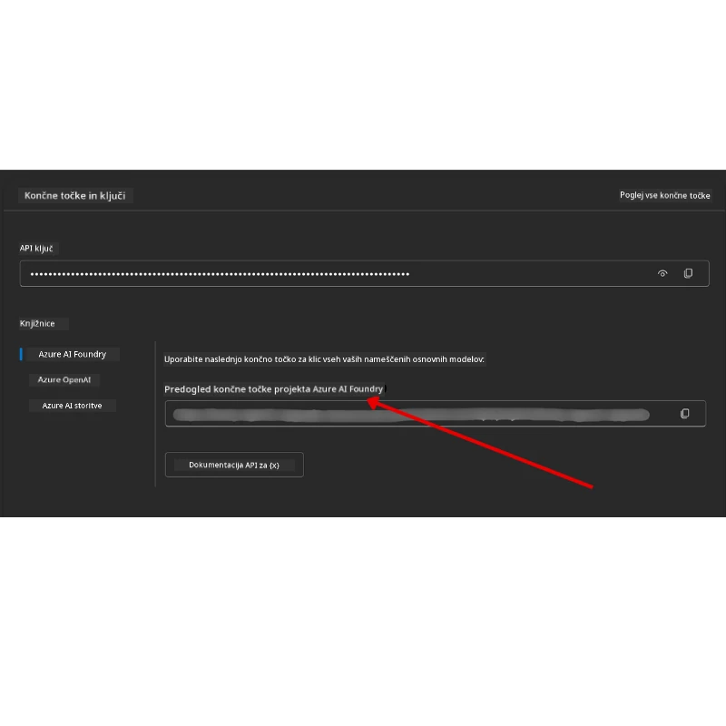

# Nastavitev tečaja

## Uvod

Ta lekcija bo zajemala, kako zagnati primere kode iz tega tečaja.

## Pridruži se drugim učečim in poišči pomoč

Preden začnete klonirati svoj repozitorij, se pridružite kanalu [Discord za AI agente za začetnike](https://aka.ms/ai-agents/discord), da dobite pomoč pri nastavitvi, vprašanja o tečaju ali se povežete z drugimi učečimi se.

## Klonirajte ali ustvarite fork tega repozitorija

Za začetek prosimo, klonirajte ali ustvarite fork GitHub repozitorija. S tem boste dobili svojo različico gradiva tečaja, tako da boste lahko zagnali, preizkusili in prilagodili kodo!

To lahko storite s klikom na povezavo do <a href="https://github.com/microsoft/ai-agents-for-beginners/fork" target="_blank">ustvarite fork repozitorija</a>

Zdaj bi morali imeti svojo forknjeno različico tega tečaja na naslednji povezavi:


### Plitki klon (priporočeno za delavnico / Codespaces)

  >Celoten repozitorij je lahko velik (~3 GB) ko prenesete celotno zgodovino in vse datoteke. Če boste le obiskali delavnico ali potrebujete le nekaj map z lekcijami, plitki klon (ali delni sparse klon) prepreči večino tega prenosa z obrezovanjem zgodovine in/ali preskakovanjem blobov.

#### Hiter plitki klon — minimalna zgodovina, vse datoteke

Replace `<your-username>` in the below commands with your fork URL (or the upstream URL if you prefer).

To clone only the latest commit history (small download):

```bash|powershell
git clone --depth 1 https://github.com/<your-username>/ai-agents-for-beginners.git
```

To clone a specific branch:

```bash|powershell
git clone --depth 1 --branch <branch-name> https://github.com/<your-username>/ai-agents-for-beginners.git
```

#### Delni (sparse) klon — minimalni blob-i + samo izbrane mape

This uses partial clone and sparse-checkout (requires Git 2.25+ and recommended modern Git with partial clone support):

```bash|powershell
git clone --depth 1 --filter=blob:none --sparse https://github.com/<your-username>/ai-agents-for-beginners.git
```

Traverse into the repo folder:

```bash|powershell
cd ai-agents-for-beginners
```

Then specify which folders you want (example below shows two folders):

```bash|powershell
git sparse-checkout set 00-course-setup 01-intro-to-ai-agents
```

After cloning and verifying the files, if you only need files and want to free space (no git history), please delete the repository metadata (💀irreversible — you will lose all Git functionality: no commits, pulls, pushes, or history access).

```bash
# zsh/bash
rm -rf .git
```

```powershell
# PowerShell
Remove-Item -Recurse -Force .git
```

#### Uporaba GitHub Codespaces (priporočeno za izogibanje velikim prenosom na lokalni napravi)

- Ustvarite nov Codespace za ta repozitorij prek [GitHub UI](https://github.com/codespaces).  

- V terminalu novonastalega Codespace-a zaženite enega od zgornjih shallow/sparse clone ukazov, da v delovno okolje Codespace pripeljete samo potrebne mape lekcij.
- Izbirno: po kloniranju znotraj Codespaces odstranite .git, da pridobite dodatni prostor (glejte ukaze za odstranjevanje zgoraj).
- Opomba: Če raje odprete repozitorij neposredno v Codespaces (brez dodatnega kloniranja), se zavedajte, da bo Codespaces zgradil devcontainer okolje in morda še vedno pripravil več, kot potrebujete. Kloniranje plitve kopije znotraj novega Codespace-a vam daje več nadzora nad porabo diska.

#### Nasveti

- Vedno zamenjajte URL za kloniranje z URL-jem vašega forka, če želite urejati/commitati.
- Če boste kasneje potrebovali več zgodovine ali datotek, jih lahko pridobite (fetch) ali prilagodite sparse-checkout, da vključite dodatne mape.

## Zaganjanje kode

Ta tečaj ponuja serijo Jupyter zvezkov (Notebooks), ki jih lahko zaženete, da pridobite praktične izkušnje z gradnjo AI agentov.

Primeri kode uporabljajo **Microsoft Agent Framework (MAF)** z `AzureAIProjectAgentProvider`, ki se poveže na **Azure AI Agent Service V2** (Responses API) preko **Microsoft Foundry**.

Vsi Python zvezki so označeni z `*-python-agent-framework.ipynb`.

## Zahteve

- Python 3.12+
  - **OPOMBA**: Če nimate nameščenega Python 3.12, ga namestite. Nato ustvarite virtualno okolje (venv) z python3.12, da zagotovite pravilne različice, ki so navedene v datoteki requirements.txt.
  
    >Primer

    Create Python venv directory:

    ```bash|powershell
    python -m venv venv
    ```

    Nato aktivirajte venv okolje za:

    ```bash
    # zsh/bash
    source venv/bin/activate
    ```
  
    ```dos
    # Command Prompt for Windows
    venv\Scripts\activate
    ```

- .NET 10+: For the sample codes using .NET, ensure you install [.NET 10 SDK](https://dotnet.microsoft.com/download/dotnet/10.0) or later. Then, check your installed .NET SDK version:

    ```bash|powershell
    dotnet --list-sdks
    ```

- **Azure CLI** — Zahtevan za avtentikacijo. Namestite ga s [aka.ms/installazurecli](https://aka.ms/installazurecli).
- **Azure Subscription** — Za dostop do Microsoft Foundry in Azure AI Agent Service.
- **Microsoft Foundry Project** — Projekt z nameščenim modelom (npr. `gpt-4o`). Glejte [Korak 1](../../../00-course-setup) spodaj.

Vključen imamo `requirements.txt` datoteko v korenu tega repozitorija, ki vsebuje vse potrebne Python pakete za zagon primerov kode.

Namestite jih lahko z zagonom naslednjega ukaza v terminalu v korenu repozitorija:

```bash|powershell
pip install -r requirements.txt
```

Priporočamo ustvarjanje Python virtualnega okolja, da se izognete morebitnim konfliktom in težavam.

## Nastavitev VSCode

Prepričajte se, da v VSCode uporabljate pravo različico Pythona.


## Nastavitev Microsoft Foundry in Azure AI Agent Service

### Korak 1: Ustvarite Microsoft Foundry projekt

Potrebujete Azure AI Foundry **hub** in **projekt** z nameščenim modelom, da zaženete zvezke.

1. Obiščite [ai.azure.com](https://ai.azure.com) in se prijavite s svojim Azure računom.
2. Ustvarite **hub** (ali uporabite obstoječega). Glejte: [Hub resources overview](https://learn.microsoft.com/azure/ai-foundry/concepts/ai-resources).
3. Znotraj hub-a ustvarite **projekt**.
4. Deployajte model (npr. `gpt-4o`) iz **Models + Endpoints** → **Deploy model**.

### Korak 2: Pridobite konecno točko projekta in ime nameščene različice modela

Iz vašega projekta v Microsoft Foundry portalu:

- **Project Endpoint** — Pojdite na stran **Overview** in kopirajte endpoint URL.



- **Model Deployment Name** — Pojdite na **Models + Endpoints**, izberite svoj nameščeni model in zabeležite **Deployment name** (npr. `gpt-4o`).

### Korak 3: Prijavite se v Azure z `az login`

Vsi zvezki uporabljajo **`AzureCliCredential`** za avtentikacijo — ni potrebe po upravljanju API ključev. To zahteva, da ste prijavljeni prek Azure CLI.

1. **Namestite Azure CLI**, če ga še nimate: [aka.ms/installazurecli](https://aka.ms/installazurecli)

2. **Prijavite se** z zagonom:

    ```bash|powershell
    az login
    ```

    Ali če ste v oddaljenem/Codespace okolju brez brskalnika:

    ```bash|powershell
    az login --use-device-code
    ```

3. **Izberite svoj naročniški račun (subscription)**, če ste pozvani — izberite tistega, ki vsebuje vaš Foundry projekt.

4. **Preverite**, da ste prijavljeni:

    ```bash|powershell
    az account show
    ```

> **Zakaj `az login`?** Zvezki se avtenticirajo z `AzureCliCredential` iz paketa `azure-identity`. To pomeni, da vaša Azure CLI seja zagotavlja poverilnice — ni API ključev ali skrivnosti v vaši `.env` datoteki. To je [varnostna najboljša praksa](https://learn.microsoft.com/azure/developer/ai/keyless-connections).

### Korak 4: Ustvarite svojo `.env` datoteko

Kopirajte primer datoteke:

```bash
# zsh/bash
cp .env.example .env
```

```powershell
# PowerShell
Copy-Item .env.example .env
```

Odprite `.env` in izpolnite ti dve vrednosti:

```env
AZURE_AI_PROJECT_ENDPOINT=https://<your-project>.services.ai.azure.com/api/projects/<your-project-id>
AZURE_AI_MODEL_DEPLOYMENT_NAME=gpt-4o
```

| Variable | Kje ga najti |
|----------|--------------|
| `AZURE_AI_PROJECT_ENDPOINT` | Foundry portal → vaš projekt → stran **Overview** |
| `AZURE_AI_MODEL_DEPLOYMENT_NAME` | Foundry portal → **Models + Endpoints** → ime vaše nameščene različice modela |

To je vse za večino lekcij! Zvezki se bodo avtenticirali samodejno prek vaše seje `az login`.

### Korak 5: Namestite Python odvisnosti

```bash|powershell
pip install -r requirements.txt
```

Priporočamo, da to zaženete v virtualnem okolju, ki ste ga ustvarili prej.

## Dodatna nastavitev za lekcijo 5 (Agentic RAG)

Lekcija 5 uporablja **Azure AI Search** za retrieval-augmented generation. Če nameravate zagnati to lekcijo, dodajte te spremenljivke v svojo `.env` datoteko:

| Variable | Kje ga najti |
|----------|--------------|
| `AZURE_SEARCH_SERVICE_ENDPOINT` | Azure portal → vaš **Azure AI Search** vir → **Overview** → URL |
| `AZURE_SEARCH_API_KEY` | Azure portal → vaš **Azure AI Search** vir → **Settings** → **Keys** → primary admin key |

## Dodatna nastavitev za lekciji 6 in 8 (GitHub modeli)

Nekateri zvezki v lekcijah 6 in 8 uporabljajo **GitHub Models** namesto Azure AI Foundry. Če nameravate zagnati te primere, dodajte te spremenljivke v svojo `.env` datoteko:

| Variable | Kje ga najti |
|----------|--------------|
| `GITHUB_TOKEN` | GitHub → **Settings** → **Developer settings** → **Personal access tokens** |
| `GITHUB_ENDPOINT` | Use `https://models.inference.ai.azure.com` (default value) |
| `GITHUB_MODEL_ID` | Model name to use (e.g. `gpt-4o-mini`) |

## Dodatna nastavitev za lekcijo 8 (Bing Grounding Workflow)

Pogojni workflow zvezek v lekciji 8 uporablja **Bing grounding** preko Azure AI Foundry. Če nameravate zagnati ta primer, dodajte to spremenljivko v svojo `.env` datoteko:

| Variable | Kje ga najti |
|----------|--------------|
| `BING_CONNECTION_ID` | Azure AI Foundry portal → vaš projekt → **Management** → **Connected resources** → vaša Bing povezava → kopirajte connection ID |

## Odpravljanje težav

### Napake preverjanja SSL certifikatov na macOS

Če ste na macOS in naletite na napako kot:

```plaintext
ssl.SSLCertVerificationError: [SSL: CERTIFICATE_VERIFY_FAILED] certificate verify failed: self-signed certificate in certificate chain
```

To je znana težava s Pythonom na macOS, kjer sistemski SSL certifikati niso samodejno zaupanja vredni. Poskusite naslednje rešitve v navedenem vrstnem redu:

**Možnost 1: Zaženite Pythonov skript Install Certificates (priporočeno)**

```bash
# Zamenjajte 3.XX z nameščeno različico Pythona (npr. 3.12 ali 3.13):
/Applications/Python\ 3.XX/Install\ Certificates.command
```

**Možnost 2: Uporabite `connection_verify=False` v vašem zvezku (samo za zvezke z GitHub modeli)**

V lekciji 6 zvezku (`06-building-trustworthy-agents/code_samples/06-system-message-framework.ipynb`) je že vključen začasni popravek kot zakomentiran ukaz. Odkomentirajte `connection_verify=False` pri ustvarjanju clienta:

```python
client = ChatCompletionsClient(
    endpoint=endpoint,
    credential=AzureKeyCredential(token),
    connection_verify=False,  # Onemogočite preverjanje SSL, če naletite na napake s certifikatom
)
```

> **⚠️ Opozorilo:** Onemogočanje preverjanja SSL (`connection_verify=False`) zmanjša varnost s preskakovanjem validacije certifikatov. Uporabljajte to le kot začasno rešitev v razvojnih okoljih, nikoli v produkciji.

**Možnost 3: Namestite in uporabite `truststore`**

```bash
pip install truststore
```

Nato dodajte naslednje na vrh vašega zvezka ali skripte pred izvajanjem mrežnih klicev:

```python
import truststore
truststore.inject_into_ssl()
```

## Se vam kje zatakne?

Če imate težave pri izvajanju te nastavitve, se pridružite našemu <a href="https://discord.gg/kzRShWzttr" target="_blank">Azure AI Community Discord</a> ali <a href="https://github.com/microsoft/ai-agents-for-beginners/issues?WT.mc_id=academic-105485-koreyst" target="_blank">odprite issue</a>.

## Naslednja lekcija

Zdaj ste pripravljeni zagnati kodo za ta tečaj. Veselo učenje in raziskovanje sveta AI agentov! 

[Uvod v AI agente in primere uporabe agentov](../01-intro-to-ai-agents/README.md)

---

<!-- CO-OP TRANSLATOR DISCLAIMER START -->
Izjava o omejitvi odgovornosti:
Ta dokument je bil preveden z uporabo storitve za prevajanje z umetno inteligenco Co-op Translator (https://github.com/Azure/co-op-translator). Čeprav si prizadevamo za natančnost, upoštevajte, da lahko avtomatizirani prevodi vsebujejo napake ali netočnosti. Izvirni dokument v izvorni različici obravnavajte kot zavezujoč vir. Za kritične informacije priporočamo strokovni človeški prevod. Za morebitne nesporazume ali napačne razlage, ki izhajajo iz uporabe tega prevoda, ne odgovarjamo.
<!-- CO-OP TRANSLATOR DISCLAIMER END -->