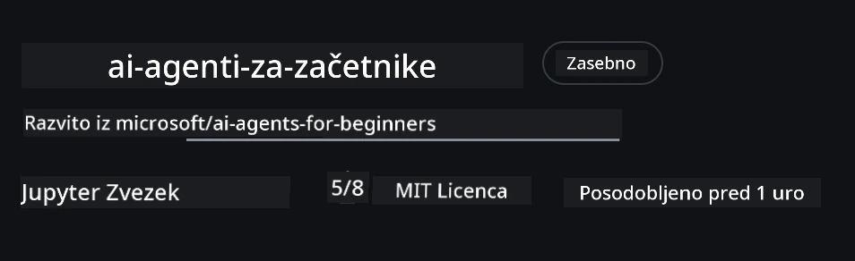
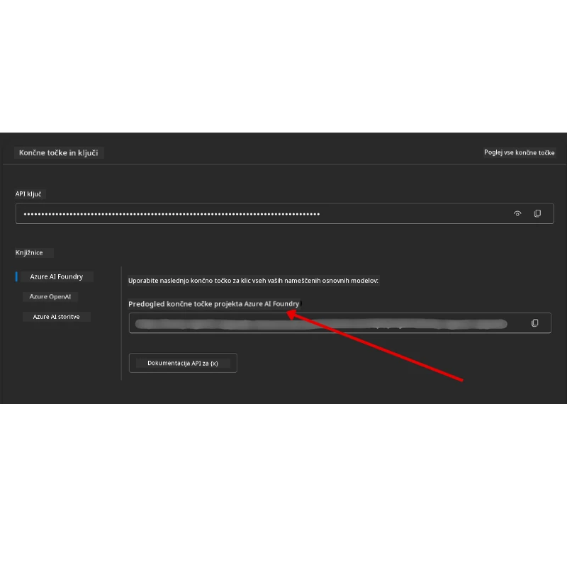

# Nastavitev tečaja

## Uvod

Ta lekcija bo zajemala, kako zagnati kode vzorcev tega tečaja.

## Pridruži se drugim učencem in pridobi pomoč

Preden začneš klonirati svoj repozitorij, se pridruži [AI Agents For Beginners Discord kanalu](https://aka.ms/ai-agents/discord) za pomoč pri nastavitvi, odgovore na vprašanja o tečaju ali povezovanje z drugimi učenci.

## Kloniraj ali forkej ta repozitorij

Za začetek prosim kloniraj ali forkej GitHub repozitorij. Tako boš imel svojo različico gradiva tečaja, da lahko zaženeš, preizkusiš in prilagodiš kodo!

To lahko storiš tako, da klikneš povezavo do <a href="https://github.com/microsoft/ai-agents-for-beginners/fork" target="_blank">fork repozitorija</a>

Zdaj bi moral imeti svojo forkano različico tega tečaja na naslednji povezavi:



### Shallow Clone (priporočeno za delavnice / Codespaces)

  >Celoten repozitorij je lahko velik (~3 GB), če preneseš celotno zgodovino in vse datoteke. Če se udeležuješ le delavnice ali potrebuješ samo nekaj map lekcij, shallow clone (ali sparse clone) prepreči večino prenosa z omejitvijo zgodovine in/ali izpustitvijo blob datotek.

#### Hiter shallow clone — minimalna zgodovina, vse datoteke

Zamenjaj `<your-username>` v spodnjih ukazih s tvojo fork URL (ali z upstream URL, če raje).

Za kloniranje samo najnovejše zgodovine komitov (majhen prenos):

```bash|powershell
git clone --depth 1 https://github.com/<your-username>/ai-agents-for-beginners.git
```

Za kloniranje specifične veje:

```bash|powershell
git clone --depth 1 --branch <branch-name> https://github.com/<your-username>/ai-agents-for-beginners.git
```

#### Delni (sparse) clone — minimalni blobi + le izbrane mape

To uporablja delni clone in sparse-checkout (zahteva Git 2.25+ in priporočeno moderno Git z delnim supportom):

```bash|powershell
git clone --depth 1 --filter=blob:none --sparse https://github.com/<your-username>/ai-agents-for-beginners.git
```

Pojdi v mapo repozitorija:

```bash|powershell
cd ai-agents-for-beginners
```

Nato določi, katere mape želiš (primer spodaj prikazuje dve mapi):

```bash|powershell
git sparse-checkout set 00-course-setup 01-intro-to-ai-agents
```

Po kloniranju in preverjanju datotek, če potrebuješ samo datoteke in želiš sprostiti prostor (brez git zgodovine), prosim izbriši podatke repozitorija (💀nepovratno — izgubeš vse funkcionalnosti Git: brez komitov, pullov, pushov ali dostopa do zgodovine).

```bash
# zsh/bash
rm -rf .git
```

```powershell
# PowerShell
Remove-Item -Recurse -Force .git
```

#### Uporaba GitHub Codespaces (priporočeno za izogibanje velikim lokalnim prenosom)

- Ustvari nov Codespace za ta repozitorij preko [GitHub UI](https://github.com/codespaces).  

- V terminalu novega codespace-a zaženi enega od zgornjih ukazov shallow/sparse clone, da v Codespace delovno okolje pripelješ le potrebne mape lekcij.
- Neobvezno: po kloniranju znotraj Codespaces, odstrani .git, da sprostiš dodaten prostor (glej ukaze za odstranitev zgoraj).
- Opomba: če želiš repozitorij odpreti neposredno v Codespaces (brez dodatnega kloniranja), vedeti je treba, da bo Codespaces zgradil okolje devcontainer in mogoče bo še vedno naložil več, kot potrebuješ. Kloniranje shallow kopije v svežem Codespaceu ti daje več nadzora nad uporabo diska.

#### Nasveti

- Vedno zamenjaj URL klona s svojim forkom, če želiš spreminjati/dodajati komite.
- Če kasneje potrebuješ več zgodovine ali datotek, jih lahko preneseš ali prilagodiš sparse-checkout za dodatne mape.

## Zagon kode

Ta tečaj ponuja serijo Jupyter zvezkov, ki jih lahko zaženeš, da pridobiš praktične izkušnje z gradnjo AI agentov.

Vzorcev kode uporabljajo **Microsoft Agent Framework (MAF)** s `FoundryChatClient`, ki se poveže z **Microsoft Foundry Agent Service V2** (Responses API) skozi **Microsoft Foundry**.

Vsi Python zvezki so označeni z `*-python-agent-framework.ipynb`.

## Zahteve

- Python 3.12+
  - **OPOMBA**: Če nimaš nameščenega Python3.12, poskrbi, da ga namestiš. Nato ustvari virtualno okolje z python3.12, da zagotoviš pravilne različice iz datoteke requirements.txt.
  
    >Primer

    Ustvari Python venv mapo:

    ```bash|powershell
    python -m venv venv
    ```

    Nato aktiviraj venv okolje za:

    ```bash
    # zsh/bash
    source venv/bin/activate
    ```
  
    ```dos
    # Command Prompt for Windows
    venv\Scripts\activate
    ```

- .NET 10+: Za vzorčne kode, ki uporabljajo .NET, poskrbi, da imaš nameščen [.NET 10 SDK](https://dotnet.microsoft.com/download/dotnet/10.0) ali novejši. Nato preveri svojo namestitev .NET SDK različice:

    ```bash|powershell
    dotnet --list-sdks
    ```

- **Azure CLI** — potrebno za overjanje. Namesti iz [aka.ms/installazurecli](https://aka.ms/installazurecli).
- **Azure naročnina** — za dostop do Microsoft Foundry in Microsoft Foundry Agent Service.
- **Microsoft Foundry projekt** — projekt z nameščenim modelom (npr. `gpt-4o`). Glej [1. korak](#1-korak-ustvari-microsoft-foundry-projekt) spodaj.

V korenu tega repozitorija smo vključili datoteko `requirements.txt`, ki vsebuje vse potrebne Python pakete za zagon vzorcev kode.

Namesti jih lahko z zagonom naslednjega ukaza v terminalu na korenu repozitorija:

```bash|powershell
pip install -r requirements.txt
```

Priporočamo ustvarjanje Python virtualnega okolja, da se izogneš konfliktom in težavam.

## Nastavitev VSCode

Prepričaj se, da v VSCode uporabljaš pravo različico Pythona.


## Nastavitev Microsoft Foundry in Microsoft Foundry Agent Service

### 1. korak: Ustvari Microsoft Foundry projekt

Potreben je Microsoft Foundry **hub** in **projekt** z nameščenim modelom za zagon zvezkov.

1. Pojdi na [ai.azure.com](https://ai.azure.com) in se prijavi s svojim Azure računom.
2. Ustvari **hub** (ali uporabi obstoječega). Glej: [Pregled virov huba](https://learn.microsoft.com/azure/ai-foundry/concepts/ai-resources).
3. Znotraj huba ustvari **projekt**.
4. Namesti model (npr., `gpt-4o`) iz **Models + Endpoints** → **Deploy model**.

### 2. korak: Poišči URL končne točke projekta in ime nameščenega modela

Iz tvojega projekta v Microsoft Foundry portalu:

- **Projektna končna točka** — pojdi na stran **Overview** in skopiraj URL končne točke.



- **Ime namestitve modela** — pojdi na **Models + Endpoints**, izberi svoj nameščeni model in zapiši **Deployment name** (npr. `gpt-4o`).

### 3. korak: Prijavi se v Azure z `az login`

Vsi zvezki uporabljajo **`AzureCliCredential`** za overjanje — ni potrebnih API ključev za upravljanje. Za to moraš biti prijavljen preko Azure CLI.

1. **Namesti Azure CLI** če še ni nameščen: [aka.ms/installazurecli](https://aka.ms/installazurecli)

2. **Prijavi se** z zagonom:

    ```bash|powershell
    az login
    ```

    Ali če si v oddaljenem/Codespace okolju brez brskalnika:

    ```bash|powershell
    az login --use-device-code
    ```

3. **Izberi svojo naročnino**, če boš pozvan — izberi tisto, ki vsebuje tvoj Foundry projekt.

4. **Preveri**, da si prijavljen:

    ```bash|powershell
    az account show
    ```

> **Zakaj `az login`?** Zvezki se avtenticirajo z `AzureCliCredential` iz paketa `azure-identity`. To pomeni, da tvoja Azure CLI seja zagotavlja poverilnice — brez API ključev ali skrivnosti v tvoji `.env` datoteki. To je [varnostna najboljša praksa](https://learn.microsoft.com/azure/developer/ai/keyless-connections).

### 4. korak: Ustvari svojo `.env` datoteko

Kopiraj primer datoteke:

```bash
# zsh/bash
cp .env.example .env
```

```powershell
# PowerShell
Copy-Item .env.example .env
```

Odpri `.env` in izpolni ti dve vrednosti:

```env
AZURE_AI_PROJECT_ENDPOINT=https://<your-project>.services.ai.azure.com/api/projects/<your-project-id>
AZURE_AI_MODEL_DEPLOYMENT_NAME=gpt-4o
```

| Spremenljivka | Kje jo najdeš |
|----------|-----------------|
| `AZURE_AI_PROJECT_ENDPOINT` | Foundry portal → tvoj projekt → stran **Overview** |
| `AZURE_AI_MODEL_DEPLOYMENT_NAME` | Foundry portal → **Models + Endpoints** → ime tvojega nameščenega modela |

To je vse za večino lekcij! Zvezki se bodo avtomatsko autentično prijavili skozi tvojo `az login` sejo.

### 5. korak: Namesti Python odvisnosti

```bash|powershell
pip install -r requirements.txt
```

Priporočamo, da to zaženeš znotraj virtualnega okolja, ki si ga prej ustvaril.

## Dodatna nastavitev za lekcijo 5 (Agentic RAG)

Lekcija 5 uporablja **Azure AI Search** za generiranje z izboljšano pridobitvijo. Če nameravaš izvajati to lekcijo, dodaj te spremenljivke v svojo `.env` datoteko:

| Spremenljivka | Kje jo najdeš |
|----------|-----------------|
| `AZURE_SEARCH_SERVICE_ENDPOINT` | Azure portal → tvoj **Azure AI Search** vir → **Overview** → URL |
| `AZURE_SEARCH_API_KEY` | Azure portal → tvoj **Azure AI Search** vir → **Settings** → **Keys** → primarni upravljalski ključ |

## Dodatna nastavitev za lekcije, ki kličo Azure OpenAI neposredno (lekciji 6 in 8)

Nekateri zvezki v lekcijah 6 in 8 kličejo **Azure OpenAI** neposredno (prek **Responses API**) namesto preko Microsoft Foundry projekta. Ti vzorci so prej uporabljali GitHub Models, ki so zastareli (prenehanje julij 2026) in ne podpirajo Responses API. Če nameravaš zagnati te vzorce, dodaj te spremenljivke v svojo `.env` datoteko:

| Spremenljivka | Kje jo najdeš |
|----------|-----------------|
| `AZURE_OPENAI_ENDPOINT` | Azure portal → tvoj **Azure OpenAI** vir → **Keys and Endpoint** → Endpoint (npr. `https://<your-resource>.openai.azure.com`) |
| `AZURE_OPENAI_DEPLOYMENT` | Ime tvojega nameščenega modela (npr. `gpt-4o-mini`), ki podpira Responses API |
| `AZURE_OPENAI_API_KEY` | Neobvezno — samo če uporabljaš pristnost na podlagi ključa namesto `az login` / Entra ID |

> Responses API uporablja stabilno `/openai/v1/` končno točko, zato ni potrebno `api-version`. Prijavi se z `az login` za uporabo pristnosti brez ključa Entra ID.

## Alternativni ponudnik: MiniMax (združljiv z OpenAI)

[MiniMax](https://platform.minimaxi.com/) ponuja modele z velikim kontekstom (do 204K tokenov) preko API-ja združljivega z OpenAI. Ker Microsoft Agent Framework `OpenAIChatClient` deluje z vsakim OpenAI kompatibilnim endpointom, lahko uporabiš MiniMax kot alternativo za Azure OpenAI ali OpenAI.

Dodaj te spremenljivke v svojo `.env` datoteko:

| Spremenljivka | Kje jo najdeš |
|----------|-----------------|
| `MINIMAX_API_KEY` | [MiniMax Platform](https://platform.minimaxi.com/) → API Keys |
| `MINIMAX_BASE_URL` | Uporabi `https://api.minimax.io/v1` (privzeta vrednost) |
| `MINIMAX_MODEL_ID` | Ime modela za uporabo (npr., `MiniMax-M3`) |

**Primer modeli**: `MiniMax-M3` (priporočeno), `MiniMax-M2.7`, `MiniMax-M2.7-highspeed` (hitrejši odgovori). Imena modelov in razpoložljivost se lahko s časom spreminjajo, dostop do določenega modela pa je odvisen od tvojega računa ali regije — preveri [MiniMax Platform](https://platform.minimaxi.com/) za trenutni seznam. Če `MiniMax-M3` ni na voljo za tvoj račun, nastavi `MINIMAX_MODEL_ID` na model, do katerega imaš dostop (npr. `MiniMax-M2.7`).

Vzorčni primeri kode, ki uporabljajo `OpenAIChatClient` (npr. lekcija 14 hotel booking workflow), bodo ob zaznavi nastavitve `MINIMAX_API_KEY` avtomatično uporabili tvojo MiniMax konfiguracijo.

## Alternativni ponudnik: Foundry Local (zagoni modele na napravi)

[Foundry Local](https://foundrylocal.ai) je lahek runtime, ki prenese, upravlja in ponuja jezikovne modele **popolnoma na tvoji napravi** preko OpenAI združljivega API-ja — brez oblaka, brez Azure naročnine in brez API ključev. Odlična možnost za razvoj brez povezave, eksperimente brez stroškov oblaka ali za hranjenje podatkov lokalno.

Ker Microsoft Agent Framework `OpenAIChatClient` deluje z vsakim endpointom združljivim z OpenAI, je Foundry Local lokalna alternativa Azure OpenAI.

**1. Namesti Foundry Local**

```bash
# Windows
winget install Microsoft.FoundryLocal

# macOS
brew install foundrylocal
```

**2. Prenesi in zaženi model** (s tem začne tudi lokalno storitev):

```bash
foundry model list          # oglejte si razpoložljive modele
foundry model run phi-4-mini
```

**3. Namesti Python SDK** za odkrivanje lokalne končne točke:

```bash
pip install foundry-local-sdk
```

**4. Usmeri Microsoft Agent Framework na svoj lokalni model:**

```python
from foundry_local import FoundryLocalManager
from agent_framework.openai import OpenAIChatClient

# Prenese (če je potrebno) in lokalno streže model, nato odkrije končno točko/vrata.
manager = FoundryLocalManager("phi-4-mini")

chat_client = OpenAIChatClient(
    base_url=manager.endpoint,      # npr. http://localhost:<port>/v1
    api_key=manager.api_key,        # vedno "ni potrebno" za Foundry Local
    model_id=manager.get_model_info("phi-4-mini").id,
)

agent = chat_client.as_agent(
    name="LocalAgent",
    instructions="You are a helpful assistant running fully on-device.",
)
```

> **Opomba:** Foundry Local izpostavlja OpenAI združljivo **Chat Completions** končno točko. Uporabljaj jo za lokalni razvoj in situacije brez povezave. Za celoten nabor funkcij **Responses API** (stanje pogovorov, globoka orodna orkestracija in razvoj v slogu agentov) cilja na **Azure OpenAI** ali **Microsoft Foundry** projekt, kot prikazano v lekcijah. Glej [Foundry Local dokumentacijo](https://foundrylocal.ai) za trenutni katalog modelov in podporo platforme.

## Dodatna nastavitev za lekcijo 8 (Bing Grounding Workflow)


Pogojna delovna zvezka v lekciji 8 uporablja **Bing grounding** preko Microsoft Foundry. Če nameravate zagnati ta primer, dodajte to spremenljivko v vašo `.env` datoteko:

| Spremenljivka | Kje jo najdete |
|--------------|----------------|
| `BING_CONNECTION_ID` | Microsoft Foundry portal → vaš projekt → **Upravljanje** → **Povezani viri** → vaša Bing povezava → kopirajte ID povezave |

## Reševanje težav

### Napake preverjanja SSL certifikatov na macOS

Če uporabljate macOS in naletite na napako, kot je:

```plaintext
ssl.SSLCertVerificationError: [SSL: CERTIFICATE_VERIFY_FAILED] certificate verify failed: self-signed certificate in certificate chain
```

To je znana težava s Python-om na macOS, kjer sistemski SSL certifikati niso samodejno zaupani. Poskusite naslednje rešitve po vrstnem redu:

**Možnost 1: Zaženite Pythonov skript za namestitev certifikatov (priporočeno)**

```bash
# Zamenjajte 3.XX z vašo nameščeno različico Pythona (npr. 3.12 ali 3.13):
/Applications/Python\ 3.XX/Install\ Certificates.command
```

**Možnost 2: Uporabite `connection_verify=False` v vašem zvezku (samo za GitHub Models zvezke)**

V zvezku Lekcija 6 (`06-building-trustworthy-agents/code_samples/06-system-message-framework.ipynb`) je že vključen zakomentiran zaobidni ukrep. Odkomentirajte `connection_verify=False`, ko ustvarjate klienta:

```python
client = ChatCompletionsClient(
    endpoint=endpoint,
    credential=AzureKeyCredential(token),
    connection_verify=False,  # Onemogoči preverjanje SSL, če naletiš na napake s certifikatom
)
```

> **⚠️ Opozorilo:** Onemogočanje SSL preverjanja (`connection_verify=False`) zmanjša varnost, ker preskoči validacijo certifikata. To uporabljajte samo kot začasno rešitev v razvojnih okoljih, nikoli v produkciji.

**Možnost 3: Namestite in uporabite `truststore`**

```bash
pip install truststore
```

Nato dodajte naslednje na začetek vašega zvezka ali skripte, preden naredite kakršnekoli omrežne klice:

```python
import truststore
truststore.inject_into_ssl()
```

## Ste zataknjeni?

Če imate kakršnekoli težave pri zagonu te nastavitve, se pridružite našemu <a href="https://discord.gg/kzRShWzttr" target="_blank">Azure AI Community Discord</a> ali <a href="https://github.com/microsoft/ai-agents-for-beginners/issues?WT.mc_id=academic-105485-koreyst" target="_blank">ustvarite zadevo</a>.

## Naslednja lekcija

Sedaj ste pripravljeni za zagon kode za ta tečaj. Veselo učenje o svetu AI agentov! 

[Uvod v AI agente in primere uporabe agentov](../01-intro-to-ai-agents/README.md)

---

<!-- CO-OP TRANSLATOR DISCLAIMER START -->
**Omejitev odgovornosti**:
Ta dokument je bil preveden z uporabo AI prevajalske storitve [Co-op Translator](https://github.com/Azure/co-op-translator). Čeprav si prizadevamo za natančnost, vas prosimo, da upoštevate, da avtomatizirani prevodi lahko vsebujejo napake ali netočnosti. Izvirni dokument v njegovem izvirnem jeziku je treba obravnavati kot avtoritativni vir. Za kritične informacije je priporočljiv strokovni človeški prevod. Ne odgovarjamo za morebitna nesporazume ali napačne interpretacije, ki izhajajo iz uporabe tega prevoda.
<!-- CO-OP TRANSLATOR DISCLAIMER END -->