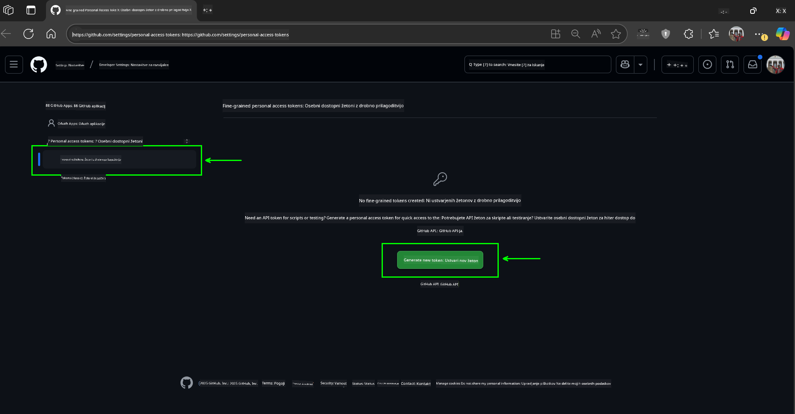

<!--
CO_OP_TRANSLATOR_METADATA:
{
  "original_hash": "76945069b52a49cd0432ae3e0b0ba22e",
  "translation_date": "2025-07-12T07:58:49+00:00",
  "source_file": "00-course-setup/README.md",
  "language_code": "sl"
}
-->
v svojem GitHub računu.

Na levi strani zaslona izberite možnost `Fine-grained tokens`.

    Nato izberite `Generate new token`.

    

Pozvani boste, da vnesete ime za svoj žeton, izberete datum poteka (priporočeno: 30 dni) in določite obseg dovoljenj za svoj žeton (Javni repozitoriji).

Prav tako je potrebno urediti dovoljenja tega žetona: Permissions -> Models -> Dovoli dostop do GitHub modelov

Kopirajte svoj novi žeton, ki ste ga pravkar ustvarili. Ta boste zdaj dodali v svojo `.env` datoteko, vključeno v ta tečaj.

### Korak 2: Ustvarite svojo `.env` datoteko

Za ustvarjanje `.env` datoteke zaženite naslednji ukaz v terminalu.

```bash
cp .env.example .env
```

To bo kopiralo primer datoteke in ustvarilo `.env` v vašem imeniku, kjer boste izpolnili vrednosti za okoljske spremenljivke.

Ko imate žeton kopiran, odprite `.env` datoteko v svojem najljubšem urejevalniku besedila in prilepite žeton v polje `GITHUB_TOKEN`.

Zdaj bi morali biti sposobni zagnati vzorčne kode tega tečaja.

## Nastavitev za primere, ki uporabljajo Azure AI Foundry in Azure AI Agent Service

### Korak 1: Pridobite končno točko svojega Azure projekta

Sledite korakom za ustvarjanje vozlišča in projekta v Azure AI Foundry, ki jih najdete tukaj: [Hub resources overview](https://learn.microsoft.com/en-us/azure/ai-foundry/concepts/ai-resources)

Ko ste ustvarili svoj projekt, boste morali pridobiti povezovalni niz za svoj projekt.

To lahko storite tako, da odprete stran **Overview** vašega projekta v portalu Azure AI Foundry.


### Korak 2: Ustvarite svojo `.env` datoteko

Za ustvarjanje `.env` datoteke zaženite naslednji ukaz v terminalu.

```bash
cp .env.example .env
```

To bo kopiralo primer datoteke in ustvarilo `.env` v vašem imeniku, kjer boste izpolnili vrednosti za okoljske spremenljivke.

Ko imate žeton kopiran, odprite `.env` datoteko v svojem najljubšem urejevalniku besedila in prilepite žeton v polje `PROJECT_ENDPOINT`.

### Korak 3: Prijavite se v Azure

Kot varnostno najboljšo prakso bomo uporabili [avtentikacijo brez ključa](https://learn.microsoft.com/azure/developer/ai/keyless-connections?tabs=csharp%2Cazure-cli?WT.mc_id=academic-105485-koreyst) za prijavo v Azure OpenAI z Microsoft Entra ID. Preden to storite, morate najprej namestiti **Azure CLI** po [navodilih za namestitev](https://learn.microsoft.com/cli/azure/install-azure-cli?WT.mc_id=academic-105485-koreyst) za vaš operacijski sistem.

Nato odprite terminal in zaženite `az login --use-device-code`, da se prijavite v svoj Azure račun.

Ko se prijavite, v terminalu izberite svojo naročnino.

## Dodatne okoljske spremenljivke - Azure Search in Azure OpenAI 

Za lekcijo Agentic RAG - Lekcija 5 - so primeri, ki uporabljajo Azure Search in Azure OpenAI.

Če želite zagnati te vzorce, boste morali dodati naslednje okoljske spremenljivke v svojo `.env` datoteko:

### Stran pregleda (projekt)

- `AZURE_SUBSCRIPTION_ID` - Preverite **Podrobnosti projekta** na strani **Overview** vašega projekta.

- `AZURE_AI_PROJECT_NAME` - Poiščite na vrhu strani **Overview** vašega projekta.

- `AZURE_OPENAI_SERVICE` - Najdete v zavihku **Vključene zmogljivosti** za **Azure OpenAI Service** na strani **Overview**.

### Upravljalni center

- `AZURE_OPENAI_RESOURCE_GROUP` - Pojdite na **Project properties** na strani **Overview** v **Management Center**.

- `GLOBAL_LLM_SERVICE` - Pod **Povezani viri** poiščite ime povezave **Azure AI Services**. Če ni navedeno, preverite v **Azure portalu** v svoji skupini virov za ime vira AI Services.

### Stran modelov in končnih točk

- `AZURE_OPENAI_EMBEDDING_DEPLOYMENT_NAME` - Izberite svoj model za vdelavo (npr. `text-embedding-ada-002`) in zabeležite **Deployment name** iz podrobnosti modela.

- `AZURE_OPENAI_CHAT_DEPLOYMENT_NAME` - Izberite svoj model za klepet (npr. `gpt-4o-mini`) in zabeležite **Deployment name** iz podrobnosti modela.

### Azure Portal

- `AZURE_OPENAI_ENDPOINT` - Poiščite **Azure AI services**, kliknite nanj, nato pojdite na **Upravljanje virov**, **Ključi in končne točke**, pomaknite se do "Azure OpenAI končnih točk" in kopirajte tisto, ki pravi "Language APIs".

- `AZURE_OPENAI_API_KEY` - Na istem zaslonu kopirajte KEY 1 ali KEY 2.

- `AZURE_SEARCH_SERVICE_ENDPOINT` - Poiščite svoj vir **Azure AI Search**, kliknite nanj in si oglejte **Overview**.

- `AZURE_SEARCH_API_KEY` - Nato pojdite na **Settings** in nato **Keys**, da kopirate primarni ali sekundarni skrbniški ključ.

### Zunanja spletna stran

- `AZURE_OPENAI_API_VERSION` - Obiščite stran [API version lifecycle](https://learn.microsoft.com/en-us/azure/ai-services/openai/api-version-deprecation#latest-ga-api-release) pod **Latest GA API release**.

### Nastavitev avtentikacije brez ključev

Namesto da bi trdo kodirali svoje poverilnice, bomo uporabili povezavo brez ključa z Azure OpenAI. Za to bomo uvozili `DefaultAzureCredential` in kasneje poklicali funkcijo `DefaultAzureCredential`, da pridobimo poverilnice.

```python
from azure.identity import DefaultAzureCredential, InteractiveBrowserCredential
```

## Ste kje obtičali?

Če imate težave pri nastavitvi, se pridružite naši

ali

.

## Naslednja lekcija

Zdaj ste pripravljeni na zagon kode za ta tečaj. Veselo učenje o svetu AI agentov!

[Uvod v AI agente in primere uporabe agentov](../01-intro-to-ai-agents/README.md)

**Omejitev odgovornosti**:  
Ta dokument je bil preveden z uporabo storitve za avtomatski prevod AI [Co-op Translator](https://github.com/Azure/co-op-translator). Čeprav si prizadevamo za natančnost, vas opozarjamo, da lahko avtomatski prevodi vsebujejo napake ali netočnosti. Izvirni dokument v njegovem izvirnem jeziku velja za avtoritativni vir. Za pomembne informacije priporočamo strokovni človeški prevod. Za morebitna nesporazume ali napačne interpretacije, ki izhajajo iz uporabe tega prevoda, ne odgovarjamo.