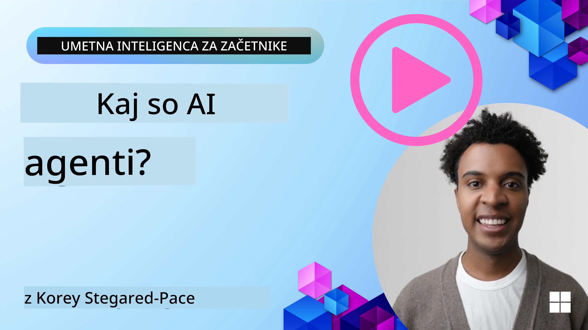
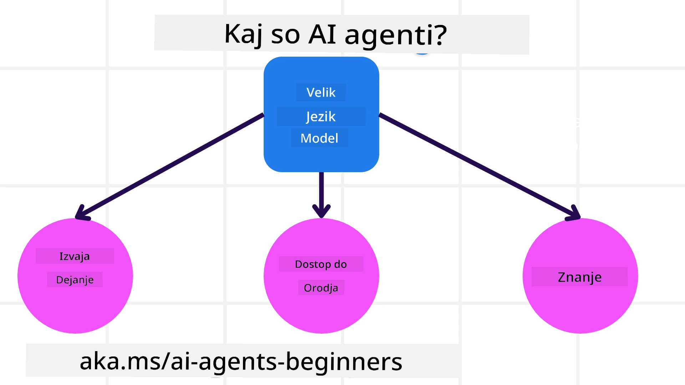
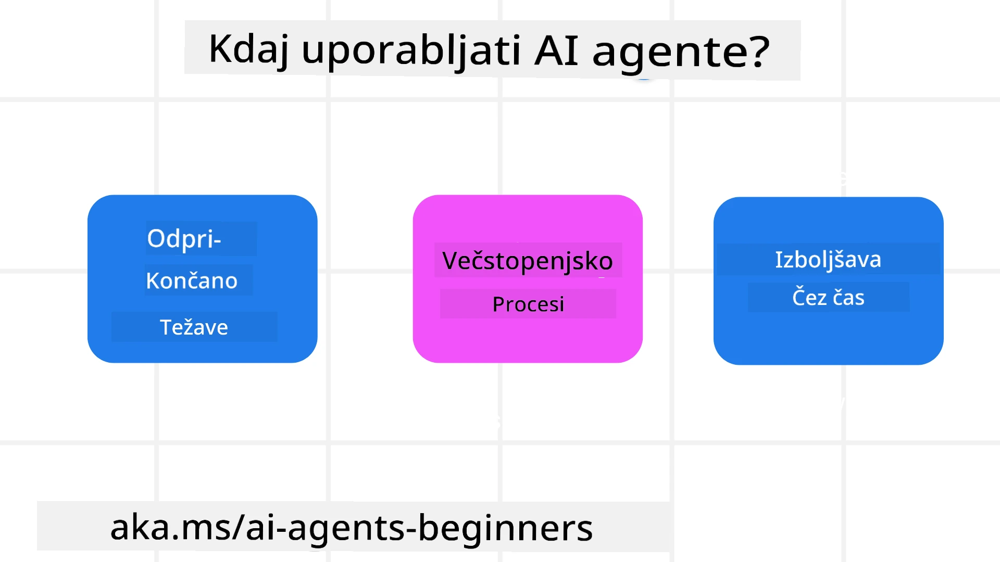

> _(Kliknite sliko zgoraj, da si ogledate video te lekcije)_

# Uvod v AI agente in primere uporabe agentov

Dobrodošli v tečaju "AI Agents for Beginners"! Ta tečaj ponuja osnovno znanje in praktične primere za izgradnjo AI agentov.

Pridružite se <a href="https://discord.gg/kzRShWzttr" target="_blank">Skupnosti Azure AI na Discordu</a>, spoznajte druge učence in ustvarjalce AI agentov ter zastavite vsa vprašanja, ki jih imate glede tega tečaja.

Za začetek tečaja si bomo najprej bolje razjasnili, kaj so AI agenti in kako jih lahko uporabimo v aplikacijah in potekih dela, ki jih gradimo.

## Uvod

Ta lekcija zajema:

- Kaj so AI agenti in katere so različne vrste agentov?
- Kateri primeri uporabe so najbolj primerni za AI agente in kako nam lahko pomagajo?
- Kateri so osnovni gradniki pri načrtovanju agentnih rešitev?

## Cilji učenja
Po končani lekciji boste sposobni:

- Razumeti pojme AI agentov in kako se razlikujejo od drugih AI rešitev.
- Uporabiti AI agente kar najbolj učinkovito.
- Načrtovati agentne rešitve produktivno za uporabnike in stranke.

## Opredelitev AI agentov in vrste AI agentov

### Kaj so AI agenti?

AI agenti so **sistemi**, ki omogočajo **velikim jezikovnim modelom (LLMs)**, da **izvedejo dejanja** s širjenjem njihovih zmogljivosti tako, da LLM-jem zagotovijo **dostop do orodij** in **znanja**.

Razčlenimo to definicijo na manjše dele:

- **System** - Pomembno je razmišljati o agentih ne le kot o eni sami komponenti, temveč kot o sistemu mnogih komponent. Na osnovni ravni so sestavni deli AI agenta:
  - **Environment** - Določeni prostor, v katerem deluje AI agent. Na primer, če bi imeli AI agenta za rezervacijo potovanj, bi lahko bilo okolje sistem za rezervacijo potovanj, ki ga AI agent uporablja za dokončanje nalog.
  - **Sensors** - Okolja vsebujejo informacije in zagotavljajo povratne informacije. AI agenti uporabljajo senzorje za zbiranje in interpretacijo teh informacij o trenutnem stanju okolja. V primeru agenta za rezervacijo potovanj lahko sistem za rezervacije zagotovi informacije, kot so razpoložljivost hotelov ali cene letov.
  - **Actuators** - Ko AI agent prejme trenutno stanje okolja, za trenutno nalogo agent določi, katero dejanje izvesti za spremembo okolja. Pri agentu za rezervacijo potovanj je to lahko rezervacija razpoložljive sobe za uporabnika.

**Veliki jezikovni modeli** - Koncept agentov je obstajal že pred ustvarjanjem LLM-jev. Prednost gradnje AI agentov z LLM-ji je njihova sposobnost interpretacije človeškega jezika in podatkov. Ta sposobnost LLM-jem omogoča interpretacijo informacij iz okolja in določanje načrta za spremembo okolja.

**Izvajanje dejanj** - Izven sistemov AI agentov so LLM-ji omejeni na situacije, kjer je dejanje generiranje vsebine ali informacij na podlagi uporabnikovega poziva. Znotraj sistemov AI agentov lahko LLM-ji opravijo naloge tako, da interpretirajo uporabnikovo zahtevo in uporabijo orodja, ki so na voljo v njihovem okolju.

**Dostop do orodij** - Katera orodja ima LLM na voljo, določata 1) okolje, v katerem deluje, in 2) razvijalec AI agenta. V našem primeru agenta za potovanja so orodja agenta omejena z operacijami, ki so na voljo v sistemu za rezervacije, in/ali lahko razvijalec omeji dostop agenta do orodij na le lete.

**Spomin+Znanje** - Spomin je lahko kratkoročen v kontekstu pogovora med uporabnikom in agentom. Na dolgi rok, poleg informacij, ki jih zagotavlja okolje, lahko AI agenti pridobivajo tudi znanje iz drugih sistemov, storitev, orodij in celo drugih agentov. V primeru agenta za potovanja je to znanje lahko informacija o uporabnikovih preferencah potovanja, shranjena v podatkovni bazi strank.

### Različne vrste agentov

Zdaj, ko imamo splošno definicijo AI agentov, si poglejmo nekaj specifičnih vrst agentov in kako bi se uporabili za AI agenta za rezervacijo potovanj.

| **Vrsta agenta**                | **Opis**                                                                                                                       | **Primer**                                                                                                                                                                                                                   |
| ----------------------------- | ------------------------------------------------------------------------------------------------------------------------------------- | ----------------------------------------------------------------------------------------------------------------------------------------------------------------------------------------------------------------------------- |
| **Preprosti refleksni agenti**      | Izvedejo takojšnja dejanja na podlagi vnaprej določenih pravil.                                                                                  | Agent za potovanja razume kontekst e-pošte in posreduje pritožbe glede potovanj službi za pomoč strankam.                                                                                                                          |
| **Modelno refleksni agenti** | Izvedejo dejanja na podlagi modela sveta in sprememb tega modela.                                                              | Agent za potovanja daje prednost poti z znatnimi spremembami cen na podlagi dostopa do zgodovinskih podatkov o cenah.                                                                                                             |
| **Ciljno usmerjeni agenti**         | Ustvarijo načrte za dosego določenih ciljev z razumevanjem cilja in določitvijo dejanj za njegovo uresničitev.                                  | Agent za potovanja rezervira pot tako, da določi potrebne prevozne aranžmaje (avto, javni prevoz, leti) od trenutne lokacije do cilja.                                                                                |
| **Agenti, ki temeljijo na uporabnosti**      | Upoštevajo preference in numerično tehtajo kompromise, da določijo, kako doseči cilje.                                               | Agent za potovanja maksimira uporabnost s tehtanjem udobja proti stroškom pri rezervaciji potovanja.                                                                                                                                          |
| **Učeči se agenti**           | Sčasoma se izboljšujejo tako, da se odzivajo na povratne informacije in ustrezno prilagajajo svoja dejanja.                                                        | Agent za potovanja se izboljša z uporabo povratnih informacij strank iz anket po potovanju za prilagoditve prihodnjih rezervacij.                                                                                                               |
| **Hierarhični agenti**       | Vključujejo več agentov v večnivojskem sistemu, pri čemer višjenivojski agenti razdelijo naloge na podnaloge, ki jih izvedejo nižjenivojski agenti. | Agent za potovanja prekliče pot tako, da nalogo razdeli na podnaloge (na primer preklic posameznih rezervacij) in dovoli nižjenivojskim agentom, da jih izvedejo in poročajo višjenivojskemu agentu.                                     |
| **Sistemi z več agenti (MAS)** | Agenti opravljajo naloge neodvisno, bodisi sodelovalno ali tekmovalno.                                                           | Sodelovanje: Več agentov rezervira posebne turistične storitve, kot so hoteli, leti in razvedrilo. Tekmovanje: Več agentov upravlja in tekmuje za skupni koledar rezervacij hotela za rezervacijo gostov v hotelu. |

## Kdaj uporabiti AI agente

V prejšnjem razdelku smo uporabili primer agenta za potovanja, da pojasnimo, kako se lahko različne vrste agentov uporabijo v različnih scenarijih rezervacije potovanj. Ta aplikacija nas bo spremljala skozi celoten tečaj.

Poglejmo vrste primerov uporabe, pri katerih so AI agenti najbolj uporabni:

- **Odprte težave** - omogočanje LLM, da določi potrebne korake za izvedbo naloge, saj tega ni vedno mogoče vnaprej zakodirati v potek dela.
- **Večstopenjski postopki** - naloge, ki zahtevajo raven kompleksnosti, pri kateri mora AI agent uporabiti orodja ali informacije skozi več korakov namesto enkratnega pridobivanja.  
- **Izboljševanje skozi čas** - naloge, pri katerih se agent lahko skozi čas izboljša z zbiranjem povratnih informacij iz okolja ali od uporabnikov, da zagotovi večjo uporabnost.

Več premislekov o uporabi AI agentov obravnavamo v lekciji o gradnji zanesljivih AI agentov.

## Osnove agentnih rešitev

### Razvoj agentov

Prvi korak pri načrtovanju sistema AI agentov je opredeliti orodja, dejanja in vedenja. V tem tečaju se osredotočamo na uporabo **Azure AI Agent Service** za opredelitev naših agentov. Ponuja funkcije, kot so:

- Izbor odprtih modelov, kot so OpenAI, Mistral in Llama
- Uporaba licenciranih podatkov prek ponudnikov, kot je Tripadvisor
- Uporaba standardiziranih orodij OpenAPI 3.0

### Agentni vzorci

Komunikacija z LLM-ji poteka preko pozivov (prompts). Glede na polavtonomno naravo AI agentov ni vedno mogoče ali potrebno ročno ponovno pozivati LLM po spremembi v okolju. Uporabljamo **agentne vzorce**, ki nam omogočajo, da LLM pozivamo preko več korakov na bolj razširljiv način.

Ta tečaj je razdeljen na nekaj trenutno priljubljenih agentnih vzorcev.

### Agentna ogrodja

Agentna ogrodja razvijalcem omogočajo izvajanje agentnih vzorcev skozi kodo. Ta ogrodja ponujajo predloge, vtičnike in orodja za boljšo sodelovalnost AI agentov. Te prednosti omogočajo boljšo opazljivost in odpravljanje težav v sistemih AI agentov.

V tem tečaju bomo raziskali Microsoft Agent Framework (MAF) za izgradnjo v produkcijo pripravljenih AI agentov.

## Primeri kode

- Python: [Agentno ogrodje](./code_samples/01-python-agent-framework.ipynb)
- .NET: [Agentno ogrodje](./code_samples/01-dotnet-agent-framework.md)

## Imate še več vprašanj o AI agentih?

Pridružite se [Microsoft Foundry Discord](https://aka.ms/ai-agents/discord), da se srečate z drugimi učenci, udeležite ur za vprašanja in dobite odgovore na vprašanja o AI agentih.

## Prejšnja lekcija

[Nastavitev tečaja](../00-course-setup/README.md)

## Naslednja lekcija

[Raziskovanje agentnih ogrodij](../02-explore-agentic-frameworks/README.md)

---

<!-- CO-OP TRANSLATOR DISCLAIMER START -->
Izjava o omejitvi odgovornosti:
Ta dokument je bil preveden z uporabo storitve za prevajanje z umetno inteligenco Co-op Translator (https://github.com/Azure/co-op-translator). Čeprav si prizadevamo za natančnost, upoštevajte, da avtomatizirani prevodi lahko vsebujejo napake ali netočnosti. Izvirni dokument v njegovem izvirnem jeziku velja za avtoritativni vir. Za pomembne informacije priporočamo profesionalni prevod, opravljen s strani človeka. Ne odgovarjamo za morebitne nesporazume ali napačne interpretacije, ki izhajajo iz uporabe tega prevoda.
<!-- CO-OP TRANSLATOR DISCLAIMER END -->