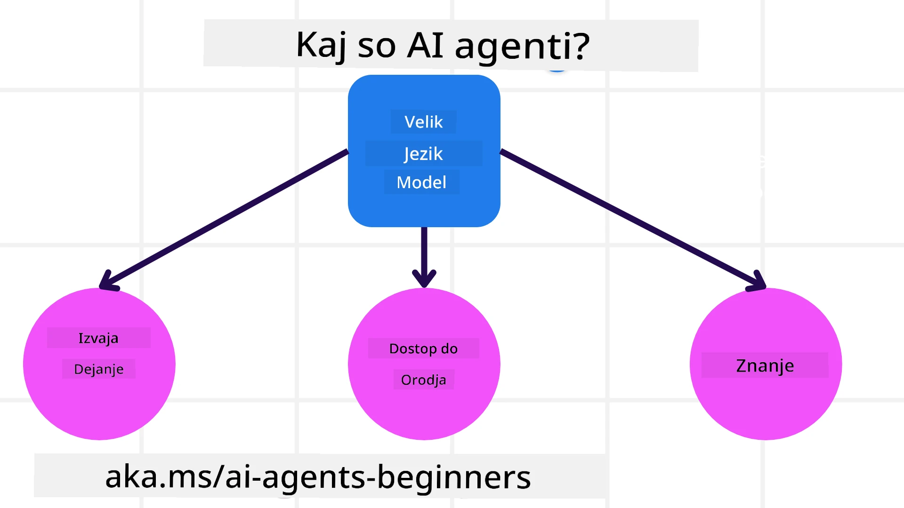
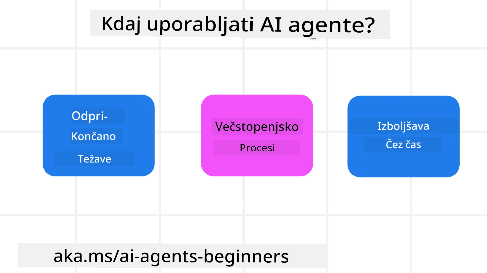

> _(Kliknite zgornjo sliko, da si ogledate video za to lekcijo)_

# Uvod v AI agente in primere uporabe agentov

Dobrodošli v tečaju **AI agenti za začetnike**! Ta tečaj vam daje temeljno znanje — in dejansko delujočo kodo — za začetek gradnje AI agentov iz nič.

Pridružite se pozdravu v <a href="https://discord.gg/kzRShWzttr" target="_blank">Azure AI Discord skupnosti</a> — polni je učencev in razvijalcev AI, ki z veseljem odgovorijo na vprašanja.

Preden začnemo z gradnjo, se prepričajmo, da dejansko razumemo, kaj AI agent *je* in kdaj je smiselno uporabiti agenta.

---

## Uvod

Ta lekcija zajema:

- Kaj so AI agenti in katere različne vrste obstajajo
- Za katere vrste opravil so AI agenti najbolj primerni
- Temeljne gradnike, ki jih boste uporabili pri oblikovanju agentne rešitve

## Cilji učenja

Ob koncu te lekcije bi morali biti sposobni:

- Razložiti, kaj je AI agent in kako se razlikuje od običajne AI rešitve
- V vedeti, kdaj uporabiti AI agenta (in kdaj ne)
- Načrtovati osnovno obliko agentne rešitve za resnični problem

---

## Definiranje AI agentov in vrste AI agentov

### Kaj so AI agenti?

Tukaj je preprost način razmišljanja o tem:

> **AI agenti so sistemi, ki omogočajo velikim jezikovnim modelom (LLM), da dejansko *izvajajo stvari* — tako, da jim dajo orodja in znanje za delovanje na svetu, ne le za odgovarjanje na pozive.**

Poglejmo podrobneje:

- **Sistem** — AI agent ni le ena stvar. Je zbirka delov, ki delujejo skupaj. V jedru ima vsak agent tri dele:
  - **Okolje** — Prostor, v katerem agent deluje. Za potovalnega agenta je to sama rezervacijska platforma.
  - **Senzorji** — Kako agent bere trenutno stanje svojega okolja. Naš potovalni agent lahko preverja razpoložljivost hotelov ali cene letov.
  - **Aktuatorji** — Kako agent ukrepa. Potovalni agent lahko rezervira sobo, pošlje potrditev ali prekliče rezervacijo.

- **Veliki jezikovni modeli** — Agentje so obstajali pred LLM-ji, ampak LLM-ji so tisti, ki moderne agente naredijo tako močne. Razumejo naravni jezik, razmišljajo o kontekstu in nejasne uporabniške zahteve pretvorijo v konkretne akcijske načrte.

- **Izvajanje akcij** — Brez sistema agentov LLM samo generira besedilo. V agentnem sistemu lahko LLM dejansko *izvede* korake — išče po bazi podatkov, kliče API, pošlje sporočilo.

- **Dostop do orodij** — Orodja, ki jih agent lahko uporablja, so odvisna od (1) okolja, v katerem deluje, in (2) kaj mu je razvijalec dovolil. Potovalni agent lahko išče lete, a ne ureja podatkov strank — vse je odvisno od povezav.

- **Spomin in znanje** — Agent lahko ima kratkoročni spomin (trenutni pogovor) in dolgoročni spomin (bazo podatkov strank, pretekle interakcije). Potovalni agent lahko "pomni", da imate raje sedeže ob oknu.

---

### Različne vrste AI agentov

Agentov ni vseh narejenih enako. Tukaj je pregled glavnih vrst, z uporabo potovalnega agenta kot tekočega primera:

| **Vrsta agenta** | **Kaj počne**  | **Primer potovalnega agenta** |
|---|---|---|
| **Enostavni refleksni agenti** | Sledijo trdnim pravilom — brez spomina, brez načrtovanja. | Vidi pritožbo po e-pošti → posreduje jo službi za pomoč uporabnikom. To je vse. |
| **Refleksni agenti, osnovani na modelu** | Ohranjajo notranji model sveta in ga posodabljajo, ko se stvari spreminjajo. | Spremlja zgodovinske cene letov in označi poti, ki so nenadoma drage. |
| **Agenti, osnovani na ciljih** | Imajo cilj in iščejo korak za korakom, kako ga doseči. | Rezervira celotno potovanje (lete, avto, hotel) od vaše trenutne lokacije do cilja. |
| **Agenti, osnovani na uporabnosti** | Ne najdejo samo *nekaterih* rešitev — najdejo *najboljšo* z tehtanjem kompromisov. | Uravnavajo stroške proti udobju, da najdejo potovanje, ki najbolj ustreza vašim željam. |
| **Učeči agenti** | Se izboljšujejo skozi čas na podlagi povratnih informacij. | Prilagajajo priporočila za rezervacijo na podlagi anket po potovanju. |
| **Hierarhični agenti** | Višji agent razdeli delo na podnaloge in jih delegira nižjim agentom. | Zahteva "preklic potovanja" se razdeli na: preklic leta, preklic hotela, preklic najema avtomobila — vsak obravnavan s podagentom. |
| **Sistemi z več agenti (MAS)** | Več neodvisnih agentov, ki delujejo skupaj (ali tekmujejo). | Sodelovanje: ločeni agenti upravljajo hotele, lete in zabavo. Tekmovanje: več agentov tekmuje za polnjenje hotelskih sob po najnižji ceni. |

---

## Kdaj uporabljati AI agente

Samo zato, ker *lahko* uporabite AI agenta, še ne pomeni, da vedno *morate*. Tukaj so situacije, kjer agenti resnično izstopajo:

- **Odprti problemi** — Ko koraki za rešitev problema niso vnaprej programirani. Potrebujete, da LLM dinamično najde pot.
- **Večstopenjski postopki** — Opravila, ki zahtevajo uporabo orodij v več korakih, ne le en sam pogled ali generiranje.
- **Izboljšave skozi čas** — Ko želite, da sistem postaja pametnejši na podlagi povratnih informacij uporabnikov ali okoljskih signalov.

Podrobneje bomo obravnavali, kdaj (in kdaj *ne*) uporabljati AI agente v lekciji **Gradnja zaupanja vrednih AI agentov** pozneje v tečaju.

---

## Osnove agentnih rešitev

### Razvoj agenta

Prvo, kar naredite pri gradnji agenta, je definirati *kaj lahko počne* — njegova orodja, akcije in vedenja.

V tem tečaju uporabljamo **Microsoft Foundry Agent Service** kot našo glavno platformo. Podpira:

- Modele od ponudnikov, kot so OpenAI, Mistral in Meta (Llama)
- Licencirane podatke od ponudnikov, kot je Tripadvisor
- Standardizirane definicije orodij OpenAPI 3.0

### Agentni vzorci

Komunicirate z LLM-ji skozi pozive. Pri agentih ne morete vedno ročno izdelati vsakega poziva — agent mora delovati skozi več korakov. Tu pridejo na vrsto **agentni vzorci**. To so ponovno uporabne strategije za pozivanje in usklajevanje LLM-jev na bolj razširljiv in zanesljiv način.

Ta tečaj je strukturiran okoli najpogostejših in najbolj uporabnih agentnih vzorcev.

### Agentni ogrodji

Agentni ogrodji razvijalcem nudijo že pripravljene predloge, orodja in infrastrukturo za gradnjo agentov. Olajšajo:

- Povezovanje orodij in zmogljivosti
- Opazovanje, kaj agent dela (in odpravljanje napak, ko gre kaj narobe)
- Sodelovanje med več agenti

V tem tečaju se osredotočamo na **Microsoft Agent Framework (MAF)** za gradnjo produkcijsko pripravljenih agentov.

---

## Primeri kode

Pripravljeni si ga ogledati v akciji? Tukaj so primeri kode za to lekcijo:

- 🐍 Python: [Agent Framework](./code_samples/01-python-agent-framework.ipynb)
- 🔷 .NET: [Agent Framework](./code_samples/01-dotnet-agent-framework.md)

---

## Imate vprašanja?

Pridružite se [Microsoft Foundry Discord](https://discord.com/invite/ATgtXmAS5D), da se povežete z drugimi učenci, obiskujete ure za pomoč in dobite odgovore na vaša vprašanja o AI agentih od skupnosti.

---

## Prejšnja lekcija

[Nastavitev tečaja](../00-course-setup/README.md)

## Naslednja lekcija

[Raziskovanje agentnih ogrodij](../02-explore-agentic-frameworks/README.md)

---

<!-- CO-OP TRANSLATOR DISCLAIMER START -->
**Omejitev odgovornosti**:
Ta dokument je bil preveden z uporabo AI prevajalske storitve [Co-op Translator](https://github.com/Azure/co-op-translator). Čeprav si prizadevamo za natančnost, vas prosimo, da upoštevate, da avtomatizirani prevodi lahko vsebujejo napake ali netočnosti. Izvirni dokument v njegovem izvirnem jeziku je treba obravnavati kot avtoritativni vir. Za kritične informacije je priporočljiv strokovni človeški prevod. Ne odgovarjamo za morebitna nesporazume ali napačne interpretacije, ki izhajajo iz uporabe tega prevoda.
<!-- CO-OP TRANSLATOR DISCLAIMER END -->