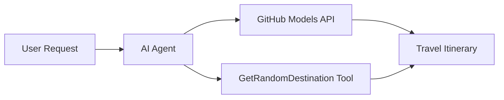

# 🌍 AI Potovalni Agent z Microsoft Agent Framework (.NET)

## 📋 Pregled scenarija

Ta zvezek prikazuje, kako zgraditi inteligentnega agenta za načrtovanje potovanj z uporabo Microsoft Agent Framework za .NET. Agent lahko samodejno ustvari personalizirane dnevne načrte izletov za naključne destinacije po svetu.

**Ključne zmogljivosti:**
- 🎲 **Naključna izbira destinacije**: Uporablja prilagojeno orodje za izbiro počitniških lokacij
- 🗺️ **Inteligentno načrtovanje izletov**: Ustvari podrobne dnevne itinerarje
- 🔄 **Pretakanje v realnem času**: Podpira takojšnje in pretočne odgovore
- 🛠️ **Integracija prilagojenih orodij**: Prikazuje, kako razširiti zmogljivosti agenta

## 🔧 Tehnična arhitektura

### Osnovne tehnologije
- **Microsoft Agent Framework**: Najnovejša implementacija .NET za razvoj AI agentov
- **Integracija GitHub modelov**: Uporablja storitev za sklepanje modelov GitHub AI
- **Združljivost z OpenAI API**: Izkoristi knjižnice odjemalcev OpenAI s prilagojenimi končnimi točkami
- **Varna konfiguracija**: Upravljanje API ključev na osnovi okolja

### Ključne komponente
1. **AIAgent**: Glavni orkestrator agenta, ki upravlja tok pogovora
2. **Prilagojena orodja**: Funkcija `GetRandomDestination()` na voljo agentu
3. **Chat Client**: Pogovorni vmesnik, podprt z GitHub modeli
4. **Podpora za pretakanje**: Zmožnost generiranja odgovorov v realnem času

### Vzorec integracije


## 🚀 Začetek

**Predpogoji:**
- .NET 9.0 ali novejši
- Dostopni žeton za GitHub Models API
- Konfigurirane okoljske spremenljivke v datoteki `.env`

**Potrebne okoljske spremenljivke:**
```env
GITHUB_TOKEN=your_github_token
GITHUB_ENDPOINT=https://models.inference.ai.azure.com
GITHUB_MODEL_ID=gpt-4o-mini
```

Zaženite spodnje celice po vrsti, da vidite potovalnega agenta v akciji!

---

## .NET Single File App: AI Travel Agent Example

See `01-dotnet-agent-framework.cs` for the complete runnable code sample.

Zaženite spodnji vzorec kode:

```bash
dotnet run 01-dotnet-agent-framework.cs
```

### Sample Code

```csharp
static string GetRandomDestination()
{
    var destinations = new List<string>
    {
        "Paris, France",
        "Tokyo, Japan",
        "New York City, USA",
        "Sydney, Australia",
        "Rome, Italy",
        "Barcelona, Spain",
        "Cape Town, South Africa",
        "Rio de Janeiro, Brazil",
        "Bangkok, Thailand",
        "Vancouver, Canada"
    };
    var random = new Random();
    int index = random.Next(destinations.Count);
    return destinations[index];
}

// Extract configuration from environment variables
var github_endpoint = Environment.GetEnvironmentVariable("GITHUB_ENDPOINT") ?? throw new InvalidOperationException("GITHUB_ENDPOINT is not set.");
var github_model_id = Environment.GetEnvironmentVariable("GITHUB_MODEL_ID") ?? "gpt-4o-mini";
var github_token = Environment.GetEnvironmentVariable("GITHUB_TOKEN") ?? throw new InvalidOperationException("GITHUB_TOKEN is not set.");

// Configure OpenAI Client Options
var openAIOptions = new OpenAIClientOptions()
{
    Endpoint = new Uri(github_endpoint)
};

// Initialize OpenAI Client with GitHub Models Configuration
var openAIClient = new OpenAIClient(new ApiKeyCredential(github_token), openAIOptions);

// Create AI Agent with Travel Planning Capabilities
AIAgent agent = openAIClient
    .GetChatClient(github_model_id)
    .CreateAIAgent(
        instructions: "You are a helpful AI Agent that can help plan vacations for customers at random destinations",
        tools: [AIFunctionFactory.Create(GetRandomDestination)]
    );

// Execute Agent: Plan a Day Trip (Non-Streaming)
Console.WriteLine(await agent.RunAsync("Plan me a day trip"));

// Execute Agent: Plan a Day Trip (Streaming Response)
await foreach (var update in agent.RunStreamingAsync("Plan me a day trip"))
{
    Console.Write(update);
}
```
