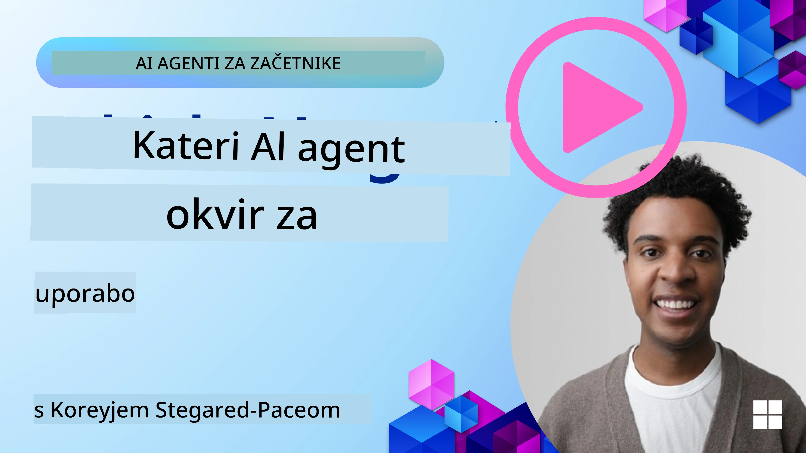

[](https://youtu.be/ODwF-EZo_O8?si=1xoy_B9RNQfrYdF7)

> _(Kliknite zgornjo sliko, da si ogledate video te lekcije)_

# Raziščite ogrodja AI agentov

Ogrodja za AI agente so programske platforme, zasnovane za poenostavitev ustvarjanja, uvajanja in upravljanja AI agentov. Ta ogrodja razvijalcem nudijo vnaprej izdelane komponente, abstrakcije in orodja, ki poenostavijo razvoj kompleksnih AI sistemov.

Ta ogrodja pomagajo razvijalcem, da se osredotočijo na edinstvene vidike svojih aplikacij z zagotavljanjem standardiziranih pristopov k pogostim izzivom pri razvoju AI agentov. Izboljšujejo razširljivost, dostopnost in učinkovitost pri gradnji AI sistemov.

## Uvod 

V tej lekciji bomo obravnavali:

- Kaj so ogrodja za AI agente in kaj razvijalcem omogočajo doseči?
- Kako lahko ekipe uporabijo ta ogrodja za hitro izdelavo prototipov, iteracijo in izboljšanje zmožnosti svojih agentov?
- Kakšna je razlika med ogrodji in orodji, ki jih je ustvaril Microsoft (<a href="https://aka.ms/ai-agents-beginners/ai-agent-service" target="_blank">Azure AI Agent Service</a> in the <a href="https://learn.microsoft.com/azure/ai-services/openai/how-to/responses" target="_blank">Microsoft Agent Framework</a>)?
- Ali lahko neposredno integriram obstoječa orodja iz ekosistema Azure ali potrebujem samostojne rešitve?
- Kaj je Azure AI Agents service in kako mi to pomaga?

## Cilji učenja

Cilji te lekcije so vam pomagati razumeti:

- Vlogo ogrodij za AI agente pri razvoju AI.
- Kako izkoristiti ogrodja za AI agente za gradnjo inteligentnih agentov.
- Ključne zmožnosti, ki jih omogočajo ogrodja za AI agente.
- Razlike med Microsoft Agent Framework in Azure AI Agent Service.

## Kaj so ogrodja za AI agente in kaj razvijalcem omogočajo?

Tradicionalna ogrodja za AI vam lahko pomagajo integrirati AI v vaše aplikacije in izboljšati te aplikacije na naslednje načine:

- **Personalizacija**: AI lahko analizira vedenje in preference uporabnikov, da zagotovi prilagojena priporočila, vsebine in izkušnje.
Primer: Pretakalne storitve, kot je Netflix, uporabljajo AI za predlaganje filmov in oddaj na podlagi zgodovine gledanja, kar povečuje angažiranost in zadovoljstvo uporabnikov.
- **Avtomatizacija in učinkovitost**: AI lahko avtomatizira ponavljajoča se opravila, poenostavi delovne procese in izboljša operativno učinkovitost.
Primer: Aplikacije za podporo strankam uporabljajo klepetalnike na osnovi AI za obravnavo pogostih poizvedb, s čimer skrajšajo čas odziva in osvobodijo človeške agente za bolj zapletene zadeve.
- **Izboljšana uporabniška izkušnja**: AI lahko izboljša celotno uporabniško izkušnjo z zagotavljanjem inteligentnih funkcij, kot so prepoznavanje govora, obdelava naravnega jezika in prediktivno dopolnjevanje besedila.
Primer: Virtualni asistenti, kot sta Siri in Google Assistant, uporabljajo AI za razumevanje in odzivanje na glasovne ukaze, kar uporabnikom olajša interakcijo z napravami.

### Vse to zveni odlično, zakaj torej potrebujemo ogrodje za AI agente?

Ogrodja za AI agente predstavljajo nekaj več kot le AI ogrodja. Namenjena so omogočanju ustvarjanja inteligentnih agentov, ki lahko komunicirajo z uporabniki, drugimi agenti in okoljem za dosego določenih ciljev. Ti agenti lahko kazajo avtonomno vedenje, sprejemajo odločitve in se prilagajajo spreminjajočim se pogojem. Oglejmo si nekaj ključnih zmožnosti, ki jih omogočajo ogrodja za AI agente:

- **Sodelovanje in koordinacija agentov**: Omogočajo ustvarjanje več AI agentov, ki lahko sodelujejo, komunicirajo in se usklajujejo za reševanje kompleksnih nalog.
- **Avtomatizacija in upravljanje nalog**: Zagotavljajo mehanizme za avtomatizacijo večstopenjskih delovnih tokov, delegiranje nalog in dinamično upravljanje nalog med agenti.
- **Kontekstno razumevanje in prilagajanje**: Opremljajo agente z zmožnostjo razumevanja konteksta, prilagajanja spreminjajočemu se okolju in sprejemanja odločitev na podlagi informacij v realnem času.

Povzamemo: agenti vam omogočajo več — avtomatizacijo lahko dvignejo na višjo raven in ustvarijo bolj inteligentne sisteme, ki se lahko prilagajajo in učijo iz svojega okolja.

## Kako hitro izdelati prototip, iterirati in izboljšati zmožnosti agenta?

To je hitro spreminjajoče se področje, vendar obstajajo stvari, skupne večini ogrodij za AI agente, ki vam lahko pomagajo hitro izdelati prototipe in iterirati — namreč modularne komponente, orodja za sodelovanje in učenje v realnem času. Oglejmo si jih:

- **Uporabite modularne komponente**: SDK-ji za AI ponujajo vnaprej izdelane komponente, kot so AI in pomnilniški konektorji, klicanje funkcij z uporabo naravnega jezika ali vtičnikov kode, predloge za pozive in več.
- **Izkoristite orodja za sodelovanje**: Oblikujte agente z določenimi vlogami in nalogami, kar jim omogoča testiranje in rafiniranje kolaborativnih delovnih tokov.
- **Učite se v realnem času**: Implementirajte povratne zanke, kjer se agenti učijo iz interakcij in dinamično prilagajajo svoje vedenje.

### Uporabite modularne komponente

SDK-ji, kot je Microsoft Agent Framework, ponujajo vnaprej izdelane komponente, kot so AI konektorji, definicije orodij in upravljanje agentov.

**Kako lahko ekipe uporabljajo to**: Ekipe lahko hitro sestavijo te komponente v delujoč prototip, ne da bi začele iz nič, kar omogoča hitro eksperimentiranje in iteracijo.

**Kako to deluje v praksi**: Lahko uporabite vnaprej izdelan parser za izluščitev informacij iz uporabnikovega vnosa, modul pomnilnika za shranjevanje in pridobivanje podatkov ter generator pozivov za interakcijo z uporabniki, vse brez potrebe po gradnji teh komponent od začetka.

**Primer kode**. Oglejmo si primer, kako lahko uporabite Microsoft Agent Framework z `AzureAIProjectAgentProvider`, da model odgovori na uporabnikov vnos z uporabo klica orodij:

``` python
# Microsoft Agent Framework Python Primer

import asyncio
import os
from typing import Annotated

from agent_framework.azure import AzureAIProjectAgentProvider
from azure.identity import AzureCliCredential


# Določi vzorčno funkcijo orodja za rezervacijo potovanja
def book_flight(date: str, location: str) -> str:
    """Book travel given location and date."""
    return f"Travel was booked to {location} on {date}"


async def main():
    provider = AzureAIProjectAgentProvider(credential=AzureCliCredential())
    agent = await provider.create_agent(
        name="travel_agent",
        instructions="Help the user book travel. Use the book_flight tool when ready.",
        tools=[book_flight],
    )

    response = await agent.run("I'd like to go to New York on January 1, 2025")
    print(response)
    # Primer izhoda: Vaš let v New York 1. januarja 2025 je bil uspešno rezerviran. Srečno pot! ✈️🗽


if __name__ == "__main__":
    asyncio.run(main())
```

Iz tega primera lahko vidite, kako lahko izkoristite vnaprej izdelan parser za izluščitev ključnih informacij iz uporabnikovega vnosa, kot so izhodišče, cilj in datum zahteve za rezervacijo leta. Ta modularni pristop vam omogoča, da se osredotočite na logiko višje ravni.

### Izkoristite orodja za sodelovanje

Ogrodja, kot je Microsoft Agent Framework, omogočajo ustvarjanje več agentov, ki lahko sodelujejo.

**Kako lahko ekipe uporabljajo to**: Ekipe lahko oblikujejo agente z določenimi vlogami in nalogami, kar jim omogoča testiranje in rafiniranje kolaborativnih delovnih tokov ter izboljšanje splošne učinkovitosti sistema.

**Kako to deluje v praksi**: Ustvarite lahko ekipo agentov, kjer ima vsak agent specializirano funkcijo, na primer pridobivanje podatkov, analiza ali sprejemanje odločitev. Ti agenti lahko komunicirajo in si izmenjujejo informacije za dosego skupnega cilja, kot je odgovor na uporabniško vprašanje ali izvedba naloge.

**Primer kode (Microsoft Agent Framework)**:

```python
# Ustvarjanje več agentov, ki sodelujejo z uporabo Microsoft Agent Framework

import os
from agent_framework.azure import AzureAIProjectAgentProvider
from azure.identity import AzureCliCredential

provider = AzureAIProjectAgentProvider(credential=AzureCliCredential())

# Agent za pridobivanje podatkov
agent_retrieve = await provider.create_agent(
    name="dataretrieval",
    instructions="Retrieve relevant data using available tools.",
    tools=[retrieve_tool],
)

# Agent za analizo podatkov
agent_analyze = await provider.create_agent(
    name="dataanalysis",
    instructions="Analyze the retrieved data and provide insights.",
    tools=[analyze_tool],
)

# Zagon agentov zaporedoma pri nalogi
retrieval_result = await agent_retrieve.run("Retrieve sales data for Q4")
analysis_result = await agent_analyze.run(f"Analyze this data: {retrieval_result}")
print(analysis_result)
```

V prejšnji kodi lahko vidite, kako ustvariti nalogo, ki vključuje več agentov, ki sodelujejo pri analizi podatkov. Vsak agent opravi določeno funkcijo, naloga pa se izvede z usklajevanjem agentov za dosego želenega rezultata. Z ustvarjanjem namensko usmerjenih agentov s specializiranimi vlogami lahko izboljšate učinkovitost in zmogljivost nalog.

### Učite se v realnem času

Napredna ogrodja nudijo zmožnosti za razumevanje konteksta in prilagajanje v realnem času.

**Kako lahko ekipe uporabljajo to**: Ekipe lahko uvedejo povratne zanke, kjer se agenti učijo iz interakcij in dinamično prilagajajo svoje vedenje, kar vodi v neprekinjeno izboljševanje in rafiniranje zmožnosti.

**Kako to deluje v praksi**: Agenti lahko analizirajo povratne informacije uporabnikov, podatke o okolju in rezultate nalog, da posodobijo svojo baza znanja, prilagodijo algoritme za sprejemanje odločitev in s časom izboljšajo zmogljivost. Ta iterativni proces učenja omogoča agentom, da se prilagajajo spreminjajočim se pogojem in uporabniškim preferencam ter izboljšajo splošno učinkovitost sistema.

## Kakšna je razlika med Microsoft Agent Framework in Azure AI Agent Service?

Obstaja veliko načinov za primerjavo teh pristopov, oglejmo si nekaj ključnih razlik glede zasnove, zmožnosti in ciljnih primerov uporabe:

## Microsoft Agent Framework (MAF)

Microsoft Agent Framework zagotavlja poenostavljen SDK za gradnjo AI agentov z uporabo `AzureAIProjectAgentProvider`. Omogoča razvijalcem ustvarjanje agentov, ki uporabljajo modele Azure OpenAI z vgrajenim klicanjem orodij, upravljanjem pogovorov in varnostjo na podjetniški ravni prek Azure identitete.

**Primeri uporabe**: Gradnja proizvodno pripravljenih AI agentov z uporabo orodij, večstopenjskimi delovnimi tokovi in scenariji integracije v podjetju.

Tukaj je nekaj pomembnih osnovnih pojmov Microsoft Agent Framework:

- **Agenti**. Agenta ustvarimo z `AzureAIProjectAgentProvider` in ga konfiguriramo z imenom, navodili in orodji. Agent lahko:
  - **Obdeluje sporočila uporabnikov** in ustvarja odgovore z uporabo modelov Azure OpenAI.
  - **Samodejno kliče orodja** na podlagi konteksta pogovora.
  - **Ohranja stanje pogovora** skozi več interakcij.

  Tu je izvleček kode, ki prikazuje, kako ustvariti agenta:

    ```python
    import os
    from agent_framework.azure import AzureAIProjectAgentProvider
    from azure.identity import AzureCliCredential

    provider = AzureAIProjectAgentProvider(credential=AzureCliCredential())
    agent = await provider.create_agent(
        name="my_agent",
        instructions="You are a helpful assistant.",
    )

    response = await agent.run("Hello, World!")
    print(response)
    ```

- **Orodja**. Ogrodje podpira definiranje orodij kot Python funkcij, ki jih lahko agent samodejno pokliče. Orodja se registrirajo ob ustvarjanju agenta:

    ```python
    def get_weather(location: str) -> str:
        """Get the current weather for a location."""
        return f"The weather in {location} is sunny, 72\u00b0F."

    agent = await provider.create_agent(
        name="weather_agent",
        instructions="Help users check the weather.",
        tools=[get_weather],
    )
    ```

- **Koordinacija več agentov**. Ustvarite lahko več agentov z različnimi specializacijami in uskladite njihovo delo:

    ```python
    planner = await provider.create_agent(
        name="planner",
        instructions="Break down complex tasks into steps.",
    )

    executor = await provider.create_agent(
        name="executor",
        instructions="Execute the planned steps using available tools.",
        tools=[execute_tool],
    )

    plan = await planner.run("Plan a trip to Paris")
    result = await executor.run(f"Execute this plan: {plan}")
    ```

- **Integracija Azure identitete**. Ogrodje uporablja `AzureCliCredential` (ali `DefaultAzureCredential`) za varno avtentikacijo brez ključev, s čimer odpravlja potrebo po neposrednem upravljanju API ključev.

## Azure AI Agent Service

Azure AI Agent Service je novejša pridobitev, predstavljena na Microsoft Ignite 2024. Omogoča razvoj in uvajanje AI agentov z bolj prilagodljivimi modeli, kot je neposredno klicanje odprtokodnih LLM-jev, kot so Llama 3, Mistral in Cohere.

Azure AI Agent Service zagotavlja močnejše mehanizme podjetniške varnosti in metode shranjevanja podatkov, zaradi česar je primerna za podjetniške aplikacije.

Deluje neposredno z Microsoft Agent Framework za gradnjo in uvajanje agentov.

Ta storitev je trenutno v javnem pregledu (Public Preview) in podpira Python in C# za gradnjo agentov.

Z uporabo Python SDK-ja za Azure AI Agent Service lahko ustvarimo agenta z uporabniško definiranim orodjem:

```python
import asyncio
from azure.identity import DefaultAzureCredential
from azure.ai.projects import AIProjectClient

# Določi funkcije orodja
def get_specials() -> str:
    """Provides a list of specials from the menu."""
    return """
    Special Soup: Clam Chowder
    Special Salad: Cobb Salad
    Special Drink: Chai Tea
    """

def get_item_price(menu_item: str) -> str:
    """Provides the price of the requested menu item."""
    return "$9.99"


async def main() -> None:
    credential = DefaultAzureCredential()
    project_client = AIProjectClient.from_connection_string(
        credential=credential,
        conn_str="your-connection-string",
    )

    agent = project_client.agents.create_agent(
        model="gpt-4o-mini",
        name="Host",
        instructions="Answer questions about the menu.",
        tools=[get_specials, get_item_price],
    )

    thread = project_client.agents.create_thread()

    user_inputs = [
        "Hello",
        "What is the special soup?",
        "How much does that cost?",
        "Thank you",
    ]

    for user_input in user_inputs:
        print(f"# User: '{user_input}'")
        message = project_client.agents.create_message(
            thread_id=thread.id,
            role="user",
            content=user_input,
        )
        run = project_client.agents.create_and_process_run(
            thread_id=thread.id, agent_id=agent.id
        )
        messages = project_client.agents.list_messages(thread_id=thread.id)
        print(f"# Agent: {messages.data[0].content[0].text.value}")


if __name__ == "__main__":
    asyncio.run(main())
```

### Osnovni pojmi

Azure AI Agent Service ima naslednje osnovne pojme:

- **Agent**. Azure AI Agent Service se integrira z Microsoft Foundry. Znotraj AI Foundry deluje AI Agent kot "pameten" mikroservis, ki ga je mogoče uporabiti za odgovarjanje na vprašanja (RAG), izvajanje dejanj ali popolno avtomatizacijo delovnih tokov. Doseže to s kombiniranjem moči generativnih AI modelov z orodji, ki mu omogočajo dostop do in interakcijo z realnimi podatkovnimi viri. Tukaj je primer agenta:

    ```python
    agent = project_client.agents.create_agent(
        model="gpt-4o-mini",
        name="my-agent",
        instructions="You are helpful agent",
        tools=code_interpreter.definitions,
        tool_resources=code_interpreter.resources,
    )
    ```

    V tem primeru je agent ustvarjen z modelom `gpt-4o-mini`, imenom `my-agent` in navodili `You are helpful agent`. Agent je opremljen z orodji in viri za izvajanje nalog interpretacije kode.

- **Nit in sporočila**. Nit je še en pomemben pojem. Predstavlja pogovor ali interakcijo med agentom in uporabnikom. Niti se lahko uporabljajo za spremljanje poteka pogovora, shranjevanje kontekstnih informacij in upravljanje stanja interakcije. Tukaj je primer niti:

    ```python
    thread = project_client.agents.create_thread()
    message = project_client.agents.create_message(
        thread_id=thread.id,
        role="user",
        content="Could you please create a bar chart for the operating profit using the following data and provide the file to me? Company A: $1.2 million, Company B: $2.5 million, Company C: $3.0 million, Company D: $1.8 million",
    )
    
    # Ask the agent to perform work on the thread
    run = project_client.agents.create_and_process_run(thread_id=thread.id, agent_id=agent.id)
    
    # Fetch and log all messages to see the agent's response
    messages = project_client.agents.list_messages(thread_id=thread.id)
    print(f"Messages: {messages}")
    ```

    V prejšnji kodi je ustvarjena nit. Nato je sporočilo poslano v nit. Z klicem `create_and_process_run` je agentu dodeljeno, da opravi delo v niti. Na koncu so sporočila pridobljena in zabeležena, da se vidi odgovor agenta. Sporočila kažejo potek pogovora med uporabnikom in agentom. Pomembno je tudi razumeti, da so sporočila lahko različnih tipov, kot so besedilo, slika ali datoteka — to pomeni, da je delo agenta na primer rezultiralo v sliki ali besedilnem odgovoru. Kot razvijalec lahko te informacije nato uporabite za nadaljnjo obdelavo odgovora ali njegovo predstavitev uporabniku.

- **Integracija z Microsoft Agent Framework**. Azure AI Agent Service deluje brezhibno z Microsoft Agent Framework, kar pomeni, da lahko agente gradite z uporabo `AzureAIProjectAgentProvider` in jih uvajate prek Agent Service za produkcijske scenarije.

**Primeri uporabe**: Azure AI Agent Service je zasnovan za podjetniške aplikacije, ki zahtevajo varno, razširljivo in prilagodljivo uvajanje AI agentov.

## Kakšna je razlika med tema pristopoma?
 
Zdi se, da obstaja prekrivanje, vendar so ključne razlike glede njihove zasnove, zmožnosti in ciljne uporabe:
 
- **Microsoft Agent Framework (MAF)**: Je SDK, pripravljen za produkcijsko uporabo za gradnjo AI agentov. Ponuja poenostavljen API za ustvarjanje agentov z klicanjem orodij, upravljanjem pogovorov in integracijo Azure identitete.
- **Azure AI Agent Service**: Je platforma in storitev uvajanja v Azure Foundry za agente. Ponuja vgrajeno povezljivost do storitev, kot so Azure OpenAI, Azure AI Search, Bing Search in izvajanje kode.
 
Še vedno niste prepričani, katerega izbrati?

### Primeri uporabe
 
> Q: Gradim produkcijske aplikacije z AI agenti in želim hitro začeti
>
>A: Microsoft Agent Framework je odlična izbira. Ponuja enostaven, Python-podoben API preko `AzureAIProjectAgentProvider`, ki vam omogoča definiranje agentov z orodji in navodili v le nekaj vrsticah kode.

>Q: Potrebujem uvajanje na podjetniški ravni z integracijami Azure, kot so Search in izvajanje kode
>
> A: Azure AI Agent Service je najbolj primeren. Gre za platformno storitev, ki zagotavlja vgrajene zmogljivosti za več modelov, Azure AI Search, Bing Search in Azure Functions. Omogoča enostavno gradnjo agentov v Foundry portal in njihovo uvajanje v merilu.
 
> Q: Še vedno sem zmeden, dajte mi le eno možnost
>
> A: Začnite z Microsoft Agent Framework za gradnjo vaših agentov, nato pa uporabite Azure AI Agent Service, ko jih boste morali uvajati in razširjati v produkciji. Ta pristop vam omogoča hitro iteracijo logike agenta ob jasni poti do podjetniškega uvajanja.
 
Povzemimo ključne razlike v tabeli:

| Framework | Focus | Core Concepts | Use Cases |
| --- | --- | --- | --- |
| Microsoft Agent Framework | Streamlined agent SDK with tool calling | Agents, Tools, Azure Identity | Building AI agents, tool use, multi-step workflows |
| Azure AI Agent Service | Flexible models, enterprise security, Code generation, Tool calling | Modularity, Collaboration, Process Orchestration | Secure, scalable, and flexible AI agent deployment |

## Ali lahko neposredno integriram obstoječa orodja iz ekosistema Azure ali potrebujem samostojne rešitve?
Odgovor je da — svoje obstoječe Azure ekosistemske pripomočke lahko neposredno integrirate z Azure AI Agent Service, saj je bil zasnovan za nemoteno delovanje z drugimi Azure storitvami. Na primer, lahko integrirate Bing, Azure AI Search in Azure Functions. Obstaja tudi globoka integracija z Microsoft Foundry.

Microsoft Agent Framework se prav tako integrira z Azure storitvami prek `AzureAIProjectAgentProvider` in Azure identitete, kar vam omogoča, da kličete Azure storitve neposredno iz vaših orodij za agente.

## Primeri kode

- Python: [Agent Framework](./code_samples/02-python-agent-framework.ipynb)
- .NET: [Agent Framework](./code_samples/02-dotnet-agent-framework.md)

## Imate več vprašanj o AI agentnih okvirih?

Pridružite se [Microsoft Foundry Discord](https://aka.ms/ai-agents/discord), da spoznate druge udeležence, se udeležite uradnih ur in dobite odgovore na vprašanja o AI agentih.

## Viri

- <a href="https://techcommunity.microsoft.com/blog/azure-ai-services-blog/introducing-azure-ai-agent-service/4298357" target="_blank">Azure Agent Service</a>
- <a href="https://learn.microsoft.com/azure/ai-services/openai/how-to/responses" target="_blank">Microsoft Agent Framework - Azure OpenAI Responses</a>
- <a href="https://learn.microsoft.com/azure/ai-services/agents/overview" target="_blank">Azure AI Agent service</a>

## Prejšnja lekcija

[Introduction to AI Agents and Agent Use Cases](../01-intro-to-ai-agents/README.md)

## Naslednja lekcija

[Razumevanje agentskih oblikovnih vzorcev](../03-agentic-design-patterns/README.md)

---

<!-- CO-OP TRANSLATOR DISCLAIMER START -->
**Izjava o omejitvi odgovornosti**:
Ta dokument je bil preveden z uporabo storitve za prevajanje z umetno inteligenco [Co-op Translator](https://github.com/Azure/co-op-translator). Čeprav si prizadevamo za natančnost, upoštevajte, da lahko avtomatski prevodi vsebujejo napake ali netočnosti. Izvirni dokument v njegovem izvor­nem jeziku velja za avtoritativni vir. Za kritične informacije priporočamo strokovni prevod, opravljen s strani človeka. Ne odgovarjamo za nobene nesporazume ali napačne razlage, ki bi nastale zaradi uporabe tega prevoda.
<!-- CO-OP TRANSLATOR DISCLAIMER END -->