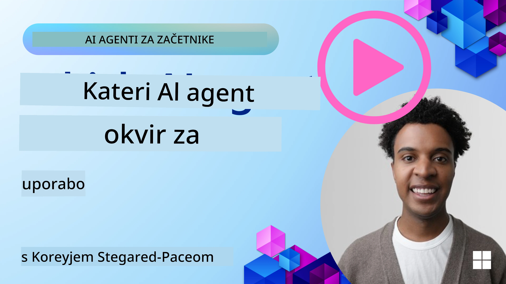

[](https://youtu.be/ODwF-EZo_O8?si=1xoy_B9RNQfrYdF7)

> _(Kliknite zgornjo sliko za ogled videoposnetka te lekcije)_

# Raziščite ogrodja AI agentov

Ogrodja AI agentov so programske platforme, zasnovane za poenostavitev ustvarjanja, uvajanja in upravljanja AI agentov. Ta ogrodja razvijalcem zagotavljajo vnaprej izdelane komponente, abstrakcije in orodja, ki pospešujejo razvoj kompleksnih AI sistemov.

Ta ogrodja pomagajo razvijalcem, da se osredotočijo na edinstvene vidike svojih aplikacij, tako da nudijo standardizirane pristope k pogostim izzivom v razvoju AI agentov. Izboljšajo razširljivost, dostopnost in učinkovitost pri gradnji AI sistemov.

## Uvod

Ta lekcija bo zajemala:

- Kaj so ogrodja AI agentov in kaj omogočajo razvijalcem doseči?
- Kako lahko ekipe uporabijo ta orodja za hitro prototipiranje, iteracijo in izboljšanje zmogljivosti svojega agenta?
- Kakšne so razlike med ogrodji in orodji, ki jih je ustvaril Microsoft (<a href="https://aka.ms/ai-agents-beginners/ai-agent-service" target="_blank">Azure AI Agent Service</a> in <a href="https://learn.microsoft.com/azure/ai-services/openai/how-to/responses" target="_blank">Microsoft Agent Framework</a>)?
- Ali lahko neposredno integriram obstoječa orodja iz Azure ekosistema ali potrebujem samostojne rešitve?
- Kaj je Azure AI Agents storitev in kako mi pomaga?

## Cilji učenja

Cilji te lekcije so, da vam pomagamo razumeti:

- Vlogo ogrodij AI agentov v razvoju AI.
- Kako uporabiti ogrodja AI agentov za gradnjo inteligentnih agentov.
- Ključne zmožnosti, ki jih omogočajo ogrodja AI agentov.
- Razlike med Microsoft Agent Framework in Azure AI Agent Service.

## Kaj so ogrodja AI agentov in kaj omogočajo razvijalcem?

Tradicionalna AI ogrodja vam lahko pomagajo integrirati AI v vaše aplikacije in jih izboljšati na naslednje načine:

- **Personalizacija**: AI lahko analizira vedenje in preference uporabnikov ter zagotavlja personalizirana priporočila, vsebine in izkušnje.
Primer: Strežniki za pretakanje, kot je Netflix, uporabljajo AI za predlaganje filmov in serij na podlagi zgodovine gledanja, kar povečuje angažiranost in zadovoljstvo uporabnikov.
- **Avtomatizacija in učinkovitost**: AI lahko avtomatizira ponavljajoče se naloge, poenostavi delovne procese in izboljša operativno učinkovitost.
Primer: Aplikacije za podporo strankam uporabljajo chatbot-e z AI, ki obravnavajo pogosta vprašanja, zmanjšujejo čas odziva in sproščajo človeške agente za zahtevnejša vprašanja.
- **Izboljšana uporabniška izkušnja**: AI lahko izboljša celotno uporabniško izkušnjo z zagotavljanjem inteligentnih funkcij, kot so prepoznavanje glasu, obdelava naravnega jezika in prediktivno besedilo.
Primer: Virtualni asistenti, kot sta Siri in Google Assistant, uporabljajo AI za razumevanje in odzivanje na glasovna naročila, kar uporabnikom olajša interakcijo z napravami.

### Vse to zveni odlično, zakaj potem potrebujemo AI Agent Framework?

Ogrodja AI agentov predstavljajo nekaj več kot zgolj AI ogrodja. Namenjena so omogočanju ustvarjanja inteligentnih agentov, ki lahko komunicirajo z uporabniki, drugimi agenti in okoljem za dosego specifičnih ciljev. Ti agenti lahko kažejo avtonomno obnašanje, sprejemajo odločitve in se prilagajajo spreminjajočim se pogojem. Poglejmo si nekaj ključnih zmožnosti, ki jih omogočajo ogrodja AI agentov:

- **Sodelovanje in usklajevanje agentov**: Omogoča ustvarjanje več AI agentov, ki lahko sodelujejo, komunicirajo in se usklajujejo za reševanje kompleksnih nalog.
- **Avtomatizacija in upravljanje nalog**: Nudi mehanizme za avtomatizacijo večstopenjskih delovnih tokov, delegiranje nalog in dinamično upravljanje nalog med agenti.
- **Kontekstualno razumevanje in prilagajanje**: Opremlja agente z zmožnostjo razumevanja konteksta, prilagajanja na spreminjajoče se okolje in odločanja na podlagi informacij v realnem času.

Torej, v povzetku, agenti vam omogočajo več: da avtomatizacijo dvignete na višjo raven, da ustvarite bolj inteligentne sisteme, ki se lahko prilagajajo in učijo iz svojega okolja.

## Kako hitro prototipirati, iterirati in izboljšati zmogljivosti agenta?

To je hitro spreminjajoče se področje, vendar obstajajo nekatere skupne lastnosti večine ogrodij AI agentov, ki vam lahko pomagajo hitro prototipirati in iterirati, predvsem modularne komponente, orodja za sodelovanje in učenje v realnem času. Poglejmo jih:

- **Uporabite modularne komponente**: AI SDK-ji nudijo vnaprej izdelane komponente, kot so AI in pomnilniški priključki, klic funkcij z uporabo naravnega jezika ali kodnih vtičnikov, predloge pozivov in več.
- **Izkoristite orodja za sodelovanje**: Oblikujte agente z določenimi vlogami in nalogami, kar jim omogoča testiranje in izpopolnjevanje sodelovalnih delovnih tokov.
- **Učite se v realnem času**: Implementirajte povratne zanke, kjer se agenti učijo iz interakcij in dinamično prilagajajo svoje vedenje.

### Uporaba modularnih komponent

SDK-ji, kot je Microsoft Agent Framework, ponujajo vnaprej izdelane komponente, kot so AI priključki, definicije orodij in upravljanje agentov.

**Kako lahko ekipe to uporabijo**: Ekipe lahko hitro sestavijo te komponente za ustvarjanje funkcionalnega prototipa brez potrebe po gradnji od začetka, kar omogoča hitro eksperimentiranje in iteracijo.

**Kako to deluje v praksi**: Lahko uporabite vnaprej izdelan parser za izvleček informacij iz uporabniškega vnosa, pomnilniški modul za shranjevanje in pridobivanje podatkov ter generator pozivov za interakcijo z uporabniki, vse brez potrebe po gradnji teh komponent od začetka.

**Primer kode**. Poglejmo primer, kako lahko z Microsoft Agent Framework in `AzureAIProjectAgentProvider` omogočite modelu odzivanje na uporabniški vnos s klicem orodij:

``` python
# Microsoft Agent Framework Python primer

import asyncio
import os
from typing import Annotated

from agent_framework.azure import AzureAIProjectAgentProvider
from azure.identity import AzureCliCredential


# Določite vzorčno funkcijo orodja za rezervacijo potovanja
def book_flight(date: str, location: str) -> str:
    """Book travel given location and date."""
    return f"Travel was booked to {location} on {date}"


async def main():
    provider = AzureAIProjectAgentProvider(credential=AzureCliCredential())
    agent = await provider.create_agent(
        name="travel_agent",
        instructions="Help the user book travel. Use the book_flight tool when ready.",
        tools=[book_flight],
    )

    response = await agent.run("I'd like to go to New York on January 1, 2025")
    print(response)
    # Primer izhoda: Vaš let v New York dne 1. januar 2025 je bil uspešno rezerviran. Srečno pot! ✈️🗽


if __name__ == "__main__":
    asyncio.run(main())
```

Iz tega primera lahko vidite, kako lahko uporabite vnaprej izdelan parser za izvlečenje ključnih informacij iz uporabniškega vnosa, kot so izhodišče, cilj in datum za zahtevo za rezervacijo leta. Ta modularni pristop vam omogoča, da se osredotočite na logiko na višji ravni.

### Izkoristite orodja za sodelovanje

Ogrodja, kot je Microsoft Agent Framework, olajšajo ustvarjanje več agentov, ki lahko sodelujejo.

**Kako lahko ekipe to uporabijo**: Ekipe lahko oblikujejo agente z določenimi vlogami in nalogami, kar jim omogoča testiranje in izpopolnjevanje sodelovalnih delovnih tokov ter izboljšanje učinkovitosti sistema.

**Kako to deluje v praksi**: Lahko ustvarite ekipo agentov, kjer ima vsak agent specializirano funkcijo, kot je pridobivanje podatkov, analiza ali sprejemanje odločitev. Ti agenti lahko komunicirajo in si delijo informacije za dosego skupnega cilja, na primer odgovora na vprašanje uporabnika ali izvedbe naloge.

**Primer kode (Microsoft Agent Framework)**:

```python
# Ustvarjanje več agentov, ki sodelujejo z uporabo Microsoft Agent Frameworka

import os
from agent_framework.azure import AzureAIProjectAgentProvider
from azure.identity import AzureCliCredential

provider = AzureAIProjectAgentProvider(credential=AzureCliCredential())

# Agent za pridobivanje podatkov
agent_retrieve = await provider.create_agent(
    name="dataretrieval",
    instructions="Retrieve relevant data using available tools.",
    tools=[retrieve_tool],
)

# Agent za analizo podatkov
agent_analyze = await provider.create_agent(
    name="dataanalysis",
    instructions="Analyze the retrieved data and provide insights.",
    tools=[analyze_tool],
)

# Zaženite agente zaporedno pri opravljanju naloge
retrieval_result = await agent_retrieve.run("Retrieve sales data for Q4")
analysis_result = await agent_analyze.run(f"Analyze this data: {retrieval_result}")
print(analysis_result)
```

V zgornji kodi vidite, kako ustvarite nalogo, ki vključuje več agentov, ki sodelujejo pri analizi podatkov. Vsak agent opravlja specifično funkcijo, nalogo pa se izvaja z usklajevanjem agentov za doseganje želenega rezultata. Z ustvarjanjem namenskih agentov s specializiranimi vlogami lahko izboljšate učinkovitost in delovanje naloge.

### Učenje v realnem času

Napredna ogrodja omogočajo razumevanje konteksta in prilagajanje v realnem času.

**Kako lahko ekipe to uporabijo**: Ekipe lahko implementirajo povratne zanke, kjer se agenti učijo iz interakcij in dinamično prilagajajo svoje vedenje, kar vodi v kontinuirano izboljšavo in izpopolnjevanje zmogljivosti.

**Kako to deluje v praksi**: Agenti lahko analizirajo povratne informacije uporabnikov, okoljske podatke in rezultate nalog, da posodobijo bazo znanja, prilagodijo algoritme odločanja in sčasoma izboljšajo delovanje. Ta iterativni učni proces omogoča agentom prilagajanje spreminjajočim se pogojem in uporabniškim željam, kar izboljšuje učinkovitost sistema.

## Kakšne so razlike med Microsoft Agent Framework in Azure AI Agent Service?

Obstaja veliko načinov za primerjavo teh pristopov, poglejmo pa nekaj ključnih razlik glede njihove zasnove, zmožnosti in ciljne uporabe:

## Microsoft Agent Framework (MAF)

Microsoft Agent Framework ponuja poenostavljen SDK za izdelavo AI agentov z uporabo `AzureAIProjectAgentProvider`. Omogoča razvijalcem ustvarjanje agentov, ki izkoriščajo Azure OpenAI modele z vgrajenim klicem orodij, upravljanjem pogovorov in varnostjo na ravni podjetja prek Azure identitete.

**Uporabni primeri**: Izdelava AI agentov, pripravljenih za produkcijsko uporabo, z uporabo orodij, večstopenjskih delovnih tokov in scenarijev integracije v podjetju.

Tukaj je nekaj pomembnih osnovnih pojmov Microsoft Agent Frameworka:

- **Agenti**. Agent se ustvari prek `AzureAIProjectAgentProvider` in konfigurira z imenom, navodili in orodji. Agent lahko:
  - **Obdeluje uporabniška sporočila** in generira odzive z uporabo Azure OpenAI modelov.
  - **Samodejno kliče orodja** glede na kontekst pogovora.
  - **Ohranja stanje pogovora** skozi več interakcij.

  Tukaj je primer kode, ki prikazuje, kako ustvariti agenta:

    ```python
    import os
    from agent_framework.azure import AzureAIProjectAgentProvider
    from azure.identity import AzureCliCredential

    provider = AzureAIProjectAgentProvider(credential=AzureCliCredential())
    agent = await provider.create_agent(
        name="my_agent",
        instructions="You are a helpful assistant.",
    )

    response = await agent.run("Hello, World!")
    print(response)
    ```

- **Orodja**. Ogrodje podpira definiranje orodij kot Python funkcij, ki jih agent lahko samodejno kliče. Orodja se registrirajo ob ustvarjanju agenta:

    ```python
    def get_weather(location: str) -> str:
        """Get the current weather for a location."""
        return f"The weather in {location} is sunny, 72\u00b0F."

    agent = await provider.create_agent(
        name="weather_agent",
        instructions="Help users check the weather.",
        tools=[get_weather],
    )
    ```

- **Usklajevanje več agentov**. Lahko ustvarite več agentov z različnimi specializacijami in usklajujete njihovo delo:

    ```python
    planner = await provider.create_agent(
        name="planner",
        instructions="Break down complex tasks into steps.",
    )

    executor = await provider.create_agent(
        name="executor",
        instructions="Execute the planned steps using available tools.",
        tools=[execute_tool],
    )

    plan = await planner.run("Plan a trip to Paris")
    result = await executor.run(f"Execute this plan: {plan}")
    ```

- **Integracija Azure identitete**. Ogrodje uporablja `AzureCliCredential` (ali `DefaultAzureCredential`) za varno avtentikacijo brez ključev, s čimer ni potrebe po neposrednem upravljanju API ključev.

## Azure AI Agent Service

Azure AI Agent Service je novejša storitev, predstavljena na Microsoft Ignite 2024. Omogoča razvoj in uvajanje AI agentov z bolj prilagodljivimi modeli, kot je neposredno klicanje odprtokodnih LLM modelov, kot so Llama 3, Mistral in Cohere.

Azure AI Agent Service zagotavlja močnejše varnostne mehanizme za podjetja in metode shranjevanja podatkov, zaradi česar je primeren za podjetniške aplikacije.

Deluje neposredno z Microsoft Agent Framework za gradnjo in uvajanje agentov.

Trenutno je ta storitev v javnem predogledu in podpira Python ter C# za izdelavo agentov.

Z uporabo Azure AI Agent Service Python SDK lahko ustvarimo agenta z orodjem, ki ga določi uporabnik:

```python
import asyncio
from azure.identity import DefaultAzureCredential
from azure.ai.projects import AIProjectClient

# Določite funkcije orodja
def get_specials() -> str:
    """Provides a list of specials from the menu."""
    return """
    Special Soup: Clam Chowder
    Special Salad: Cobb Salad
    Special Drink: Chai Tea
    """

def get_item_price(menu_item: str) -> str:
    """Provides the price of the requested menu item."""
    return "$9.99"


async def main() -> None:
    credential = DefaultAzureCredential()
    project_client = AIProjectClient.from_connection_string(
        credential=credential,
        conn_str="your-connection-string",
    )

    agent = project_client.agents.create_agent(
        model="gpt-4o-mini",
        name="Host",
        instructions="Answer questions about the menu.",
        tools=[get_specials, get_item_price],
    )

    thread = project_client.agents.create_thread()

    user_inputs = [
        "Hello",
        "What is the special soup?",
        "How much does that cost?",
        "Thank you",
    ]

    for user_input in user_inputs:
        print(f"# User: '{user_input}'")
        message = project_client.agents.create_message(
            thread_id=thread.id,
            role="user",
            content=user_input,
        )
        run = project_client.agents.create_and_process_run(
            thread_id=thread.id, agent_id=agent.id
        )
        messages = project_client.agents.list_messages(thread_id=thread.id)
        print(f"# Agent: {messages.data[0].content[0].text.value}")


if __name__ == "__main__":
    asyncio.run(main())
```

### Osnovni pojmi

Azure AI Agent Service ima naslednje osnovne pojme:

- **Agent**. Azure AI Agent Service se integrira z Microsoft Foundryjem. Znotraj AI Foundry deluje AI Agent kot "pametna" mikro storitev, ki jo je mogoče uporabiti za odgovarjanje na vprašanja (RAG), izvajanje dejanj ali popolno avtomatizacijo delovnih tokov. Doseže to s kombiniranjem moči generativnih AI modelov z orodji, ki mu omogočajo dostop do in interakcijo z resničnimi viri podatkov. Tukaj je primer agenta:

    ```python
    agent = project_client.agents.create_agent(
        model="gpt-4o-mini",
        name="my-agent",
        instructions="You are helpful agent",
        tools=code_interpreter.definitions,
        tool_resources=code_interpreter.resources,
    )
    ```

    V tem primeru je agent ustvarjen z modelom `gpt-4o-mini`, imenom `my-agent` in navodili `You are helpful agent`. Agent je opremljen z orodji in viri za izvajanje nalog interpretacije kode.

- **Nit in sporočila**. Nit je še en pomemben pojem. Predstavlja pogovor ali interakcijo med agentom in uporabnikom. Niti se lahko uporabijo za spremljanje napredka pogovora, shranjevanje informacij o kontekstu in upravljanje stanja interakcije. Tukaj je primer niti:

    ```python
    thread = project_client.agents.create_thread()
    message = project_client.agents.create_message(
        thread_id=thread.id,
        role="user",
        content="Could you please create a bar chart for the operating profit using the following data and provide the file to me? Company A: $1.2 million, Company B: $2.5 million, Company C: $3.0 million, Company D: $1.8 million",
    )
    
    # Prosite agenta, naj opravi delo na niti
    run = project_client.agents.create_and_process_run(thread_id=thread.id, agent_id=agent.id)
    
    # Pridobite in zabeležite vsa sporočila, da vidite agentov odziv
    messages = project_client.agents.list_messages(thread_id=thread.id)
    print(f"Messages: {messages}")
    ```

    V zgornji kodi je ustvarjena nit. Nato je nit poslana sporočilo. Z uporabo `create_and_process_run` je agentu naročeno, da opravi delo v niti. Na koncu so sporočila pridobljena in zabeležena, da se vidi odziv agenta. Sporočila kažejo potek pogovora med uporabnikom in agentom. Pomembno je tudi razumeti, da so sporočila lahko različnih vrst, kot so besedilo, slika ali datoteka, kar pomeni, da je delo agenta mogoče rezultiralo v sliki ali na primer besedilnem odzivu. Kot razvijalec lahko te informacije nato uporabite za nadaljnjo obdelavo odgovora ali njegovo predstavitev uporabniku.

- **Integracija z Microsoft Agent Framework**. Azure AI Agent Service brezšivno sodeluje z Microsoft Agent Framework, kar pomeni, da lahko gradite agente z `AzureAIProjectAgentProvider` in jih uvajate preko Agent Service za produkcijske scenarije.

**Uporabni primeri**: Azure AI Agent Service je zasnovan za podjetniške aplikacije, ki zahtevajo varno, razširljivo in prilagodljivo uvajanje AI agentov.

## Kakšna je razlika med tema pristopoma?
 
Zdi se, da obstaja prekrivanje, vendar so nekatere ključne razlike glede zasnove, zmožnosti in ciljne uporabe:
 
- **Microsoft Agent Framework (MAF)**: Je produkcijsko pripravljen SDK za gradnjo AI agentov. Ponuja poenostavljen API za ustvarjanje agentov s klicem orodij, upravljanjem pogovorov in integracijo Azure identitete.
- **Azure AI Agent Service**: Je platforma in storitev uvajanja v Azure Foundryju za agente. Ponuja vgrajeno povezljivost do storitev, kot so Azure OpenAI, Azure AI Search, Bing Search in izvajanje kode.
 
Še vedno niste prepričani, katerega izbrati?

### Uporabni primeri

Poglejmo, če vam lahko pomagamo s pregledom nekaterih pogostih primerov:

> V: Gradim produkcijske aplikacije AI agentov in želim hitro začeti
>

>O: Microsoft Agent Framework je odlična izbira. Ponuja enostaven, pythoničen API prek `AzureAIProjectAgentProvider`, ki vam omogoča definiranje agentov z orodji in navodili z le nekaj vrsticami kode.

>V: Potrebujem uvajanje na ravni podjetja z Azure integracijami, kot sta Search in izvajanje kode
>
> O: Azure AI Agent Service je najbolj primeren. Je platformna storitev, ki nudi vgrajene zmožnosti za več modelov, Azure AI Search, Bing Search in Azure Functions. Omogoča enostavno gradnjo agentov v Foundry Portalu in njihovo uvajanje v velikem obsegu.
 
> V: Še vedno sem zmeden, dajte mi samo eno možnost
>
> O: Začnite z Microsoft Agent Framework za gradnjo agentov, nato pa uporabite Azure AI Agent Service, ko jih boste potrebovali uvajati in razširjati v produkciji. Ta pristop vam omogoča hitro iteracijo na logiki vaših agentov, hkrati pa ima jasen načrt za uvajanje v podjetju.
 
Povzemimo ključne razlike v tabeli:

| Ogrodje | Poudarek | Osnovni pojmi | Uporabni primeri |
| --- | --- | --- | --- |
| Microsoft Agent Framework | Poenostavljen SDK agenta s klicem orodij | Agenti, Orodja, Azure identiteta | Gradnja AI agentov, uporaba orodij, večstopenjski delovni tokovi |
| Azure AI Agent Service | Prilagodljivi modeli, varnost podjetja, generiranje kode, klic orodij | Modularnost, sodelovanje, procesna orkestracija | Varno, razširljivo in prilagodljivo uvajanje AI agentov |

## Ali lahko neposredno integriram obstoječa orodja iz Azure ekosistema ali potrebujem samostojne rešitve?
Odgovor je da, lahko neposredno integrirate svoje obstoječe Azure ekosistemske orodja z Azure AI Agent Service, saj je ta zasnovan za brezhibno delovanje z drugimi storitvami Azure. Na primer, lahko integrirate Bing, Azure AI Search in Azure Functions. Obstaja tudi globoka integracija z Microsoft Foundry.

Microsoft Agent Framework se prav tako povezuje z Azure storitvami preko `AzureAIProjectAgentProvider` in Azure identitete, kar vam omogoča, da neposredno kličete Azure storitve iz svojih agentnih orodij.

## Primeri kode

- Python: [Agent Framework](./code_samples/02-python-agent-framework.ipynb)
- .NET: [Agent Framework](./code_samples/02-dotnet-agent-framework.md)

## Imate več vprašanj o AI Agent Frameworks?

Pridružite se [Microsoft Foundry Discord](https://discord.com/invite/ATgtXmAS5D), da se srečate z drugimi učenci, sodelujete na urah pomoči in dobite odgovore na svoja vprašanja o AI Agentih.

## Viri

- <a href="https://techcommunity.microsoft.com/blog/azure-ai-services-blog/introducing-azure-ai-agent-service/4298357" target="_blank">Azure Agent Service</a>
- <a href="https://learn.microsoft.com/azure/ai-services/openai/how-to/responses" target="_blank">Microsoft Agent Framework - Azure OpenAI Responses</a>
- <a href="https://learn.microsoft.com/azure/ai-services/agents/overview" target="_blank">Azure AI Agent service</a>

## Prejše lekcije

[Uvod v AI agente in primere uporabe agentov](../01-intro-to-ai-agents/README.md)

## Naslednja lekcija

[Razumevanje agentnih oblikovalskih vzorcev](../03-agentic-design-patterns/README.md)

---

<!-- CO-OP TRANSLATOR DISCLAIMER START -->
**Omejitev odgovornosti**:
Ta dokument je bil preveden z uporabo AI prevajalske storitve [Co-op Translator](https://github.com/Azure/co-op-translator). Čeprav si prizadevamo za natančnost, vas prosimo, da upoštevate, da avtomatizirani prevodi lahko vsebujejo napake ali netočnosti. Izvirni dokument v njegovem izvirnem jeziku je treba obravnavati kot avtoritativni vir. Za kritične informacije je priporočljiv strokovni človeški prevod. Ne odgovarjamo za morebitna nesporazume ali napačne interpretacije, ki izhajajo iz uporabe tega prevoda.
<!-- CO-OP TRANSLATOR DISCLAIMER END -->