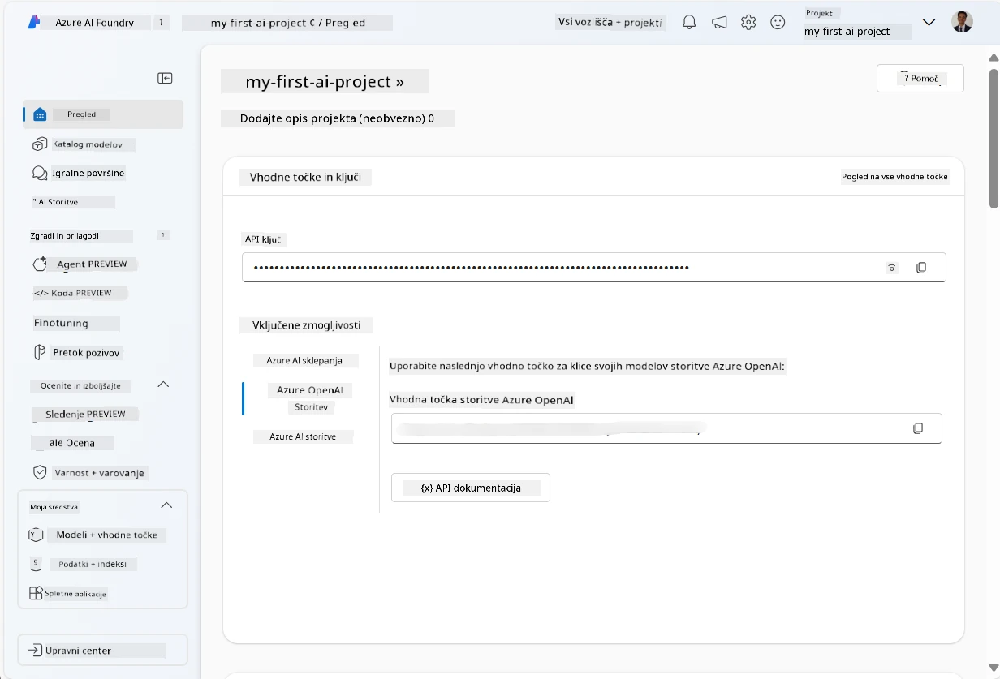
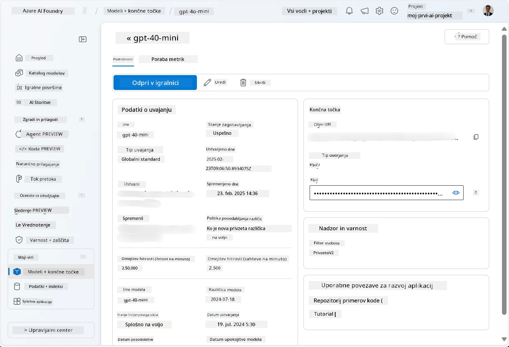
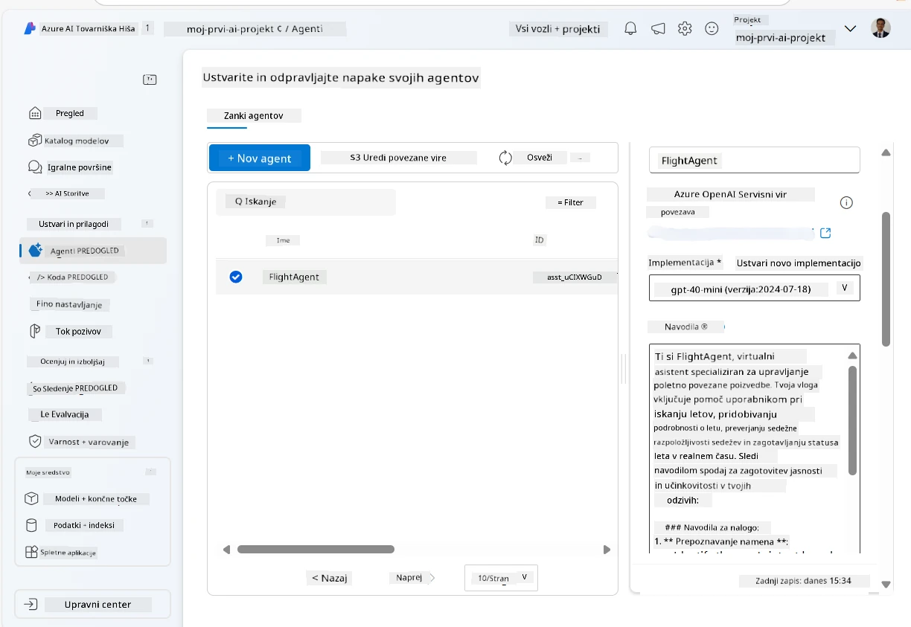
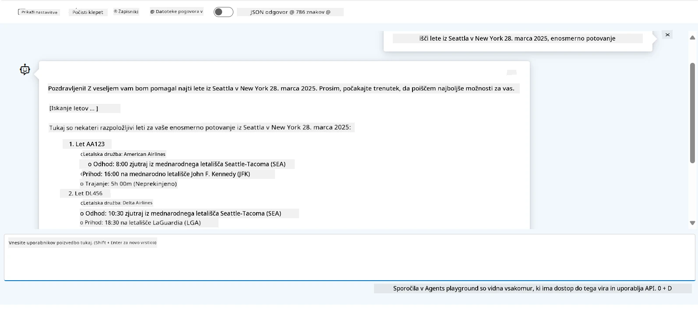

# Razvoj storitve Microsoft Foundry Agent

V tej vaji uporabite orodja Microsoft Foundry Agent Service v [Microsoft Foundry portalu](https://ai.azure.com/?WT.mc_id=academic-105485-koreyst) za ustvarjanje agenta za rezervacijo letov. Agent bo lahko sodeloval z uporabniki in jim zagotavljal informacije o letih.

## Predpogoji

Za dokončanje te vaje potrebujete naslednje:
1. Azure račun z aktivnim naročninskim paketom. [Brezplačno ustvarite račun](https://azure.microsoft.com/free/?WT.mc_id=academic-105485-koreyst).
2. Potrebujete pravice za ustvarjanje vozlišča Microsoft Foundry ali pa naj bo eno ustvarjeno za vas.
    - Če je vaša vloga Sodelavec ali Lastnik, lahko sledite korakom v tem vodiču.

## Ustvarite vozlišče Microsoft Foundry

> **Opomba:** Microsoft Foundry je bil prej poznan kot Azure AI Studio.

1. Sledite tem smernicam iz [Microsoft Foundry](https://learn.microsoft.com/en-us/azure/ai-studio/?WT.mc_id=academic-105485-koreyst) objave na blogu za ustvarjanje vozlišča Microsoft Foundry.
2. Ko je vaš projekt ustvarjen, zaprite vse prikazane nasvete in si oglejte stran projekta v Microsoft Foundry portalu, ki naj bi izgledala podobno kot na spodnji sliki:

    

## Namestite model

1. V levem delu okna vašega projekta, v razdelku **Moje vire**, izberite stran **Modeli + končne točke**.
2. Na strani **Modeli + končne točke**, v zavihku **Nameščanja modelov**, v meniju **+ Namesti model** izberite **Namesti osnovni model**.
3. V seznamu poiščite model `gpt-4o-mini`, ga izberite in potrdite.

    > **Opomba**: Zmanjšanje TPM pomaga preprečiti prekomerno porabo kvote, ki jo imate na voljo v vašem naročninskem paketu.

    

## Ustvarite agenta

Ko ste namestili model, lahko ustvarite agenta. Agent je pogovorni AI model, ki lahko sodeluje z uporabniki.

1. V levem delu okna vašega projekta, v razdelku **Gradnja in prilagajanje**, izberite stran **Agenti**.
2. Kliknite **+ Ustvari agenta** za ustvarjanje novega agenta. V pogovornem oknu **Nastavitev agenta**:
    - Vnesite ime agenta, na primer `FlightAgent`.
    - Prepričajte se, da je izbrano nameščanje modela `gpt-4o-mini`, ki ste ga prej ustvarili
    - Nastavite **Navodila** glede na poziv, ki naj mu agent sledi. Tukaj je primer:
    ```
    You are FlightAgent, a virtual assistant specialized in handling flight-related queries. Your role includes assisting users with searching for flights, retrieving flight details, checking seat availability, and providing real-time flight status. Follow the instructions below to ensure clarity and effectiveness in your responses:

    ### Task Instructions:
    1. **Recognizing Intent**:
       - Identify the user's intent based on their request, focusing on one of the following categories:
         - Searching for flights
         - Retrieving flight details using a flight ID
         - Checking seat availability for a specified flight
         - Providing real-time flight status using a flight number
       - If the intent is unclear, politely ask users to clarify or provide more details.
        
    2. **Processing Requests**:
        - Depending on the identified intent, perform the required task:
        - For flight searches: Request details such as origin, destination, departure date, and optionally return date.
        - For flight details: Request a valid flight ID.
        - For seat availability: Request the flight ID and date and validate inputs.
        - For flight status: Request a valid flight number.
        - Perform validations on provided data (e.g., formats of dates, flight numbers, or IDs). If the information is incomplete or invalid, return a friendly request for clarification.

    3. **Generating Responses**:
    - Use a tone that is friendly, concise, and supportive.
    - Provide clear and actionable suggestions based on the output of each task.
    - If no data is found or an error occurs, explain it to the user gently and offer alternative actions (e.g., refine search, try another query).
    
    ```
> [!NOTE]
> Za podroben poziv lahko preverite [to skladišče](https://github.com/ShivamGoyal03/RoamMind) za več informacij.
    
> Poleg tega lahko dodate **Bazo znanja** in **Dejanja** za izboljšanje zmožnosti agenta, da zagotavlja več informacij in izvaja avtomatizirane naloge na podlagi uporabniških zahtev. Za to vajo lahko te korake preskočite.
    


3. Za ustvarjanje novega multi-AI agenta preprosto kliknite **Nov agent**. Novoustanovljen agent bo nato prikazan na strani Agenti.


## Preizkusite agenta

Po ustvarjanju agenta ga lahko preizkusite, da vidite, kako odgovarja na uporabniške poizvedbe v igrišču Microsoft Foundry portala.

1. Na vrhu podokna **Nastavitev** za vašega agenta izberite **Poskus v igrišču**.
2. V podoknu **Igrača** lahko sodelujete z agentom tako, da v klepetno okno vnesete poizvedbe. Na primer, lahko vprašate agenta, da poišče lete iz Seattla v New York 28.

    > **Opomba**: Agent morda ne bo podajal natančnih odgovorov, saj v tej vaji ne uporabljamo podatkov v realnem času. Namen je preizkusiti sposobnost agenta, da razume in odgovarja na uporabniške poizvedbe na podlagi danih navodil.

    

3. Po preizkusu agenta ga lahko še dodatno prilagodite z dodajanjem več namer, učnih podatkov in dejanj za izboljšanje njegovih zmožnosti.

## Čiščenje virov

Ko končate s preizkušanjem agenta, ga lahko izbrišete, da se izognete dodatnim stroškom.
1. Odprite [Azure portal](https://portal.azure.com) in si oglejte vsebino skupine virov, kjer ste namestili vozlišče, uporabljeno v tej vaji.
2. Na orodni vrstici izberite **Izbriši skupino virov**.
3. Vnesite ime skupine virov in potrdite, da jo želite izbrisati.

## Viri

- [Dokumentacija Microsoft Foundry](https://learn.microsoft.com/en-us/azure/ai-studio/?WT.mc_id=academic-105485-koreyst)
- [Portal Microsoft Foundry](https://ai.azure.com/?WT.mc_id=academic-105485-koreyst)
- [Začetek z Microsoft Foundry](https://techcommunity.microsoft.com/blog/educatordeveloperblog/getting-started-with-azure-ai-studio/4095602?WT.mc_id=academic-105485-koreyst)
- [Osnove AI agentov na Azure](https://learn.microsoft.com/en-us/training/modules/ai-agent-fundamentals/?WT.mc_id=academic-105485-koreyst)
- [Azure AI Discord](https://aka.ms/AzureAI/Discord)

---

<!-- CO-OP TRANSLATOR DISCLAIMER START -->
**Omejitev odgovornosti**:
Ta dokument je bil preveden z uporabo AI prevajalske storitve [Co-op Translator](https://github.com/Azure/co-op-translator). Čeprav si prizadevamo za natančnost, vas prosimo, da upoštevate, da avtomatizirani prevodi lahko vsebujejo napake ali netočnosti. Izvirni dokument v njegovem izvirnem jeziku je treba obravnavati kot avtoritativni vir. Za kritične informacije je priporočljiv strokovni človeški prevod. Ne odgovarjamo za morebitna nesporazume ali napačne interpretacije, ki izhajajo iz uporabe tega prevoda.
<!-- CO-OP TRANSLATOR DISCLAIMER END -->