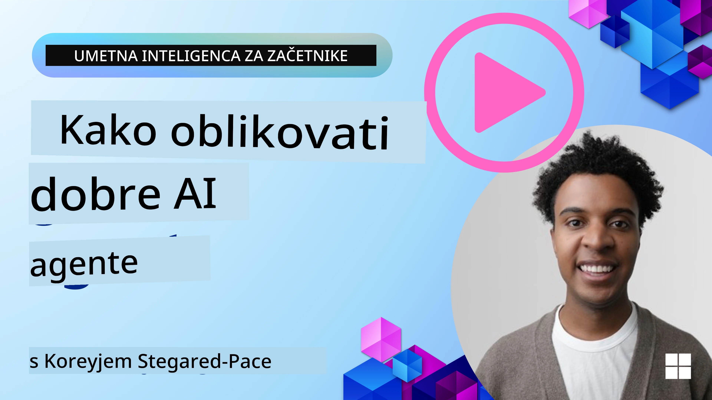
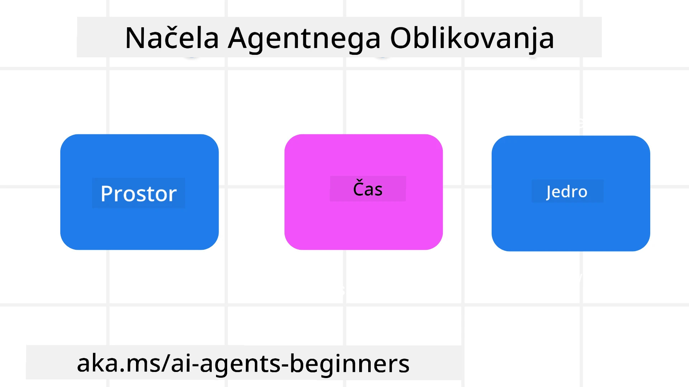

> _(Kliknite na zgornjo sliko za ogled videoposnetka te lekcije)_
# Principi oblikovanja AI agentov

## Uvod

Obstaja veliko načinov razmišljanja o gradnji AI agentnih sistemov. Glede na to, da je dvosmislenost značilnost in ne napaka v oblikovanju generativne AI, je inženirjem včasih težko ugotoviti, kje sploh začeti. Ustvarili smo niz človeka usmerjenih principov UX oblikovanja, ki razvijalcem omogočajo gradnjo sistemov, usmerjenih k uporabniku, za reševanje njihovih poslovnih potreb. Ti oblikovalski principi niso predpisana arhitektura, temveč izhodišče za ekipe, ki opredeljujejo in razvijajo izkušnje agentov.

Na splošno bi morali agenti:

- Razširiti in povečati človeške zmogljivosti (brainstorming, reševanje problemov, avtomatizacija itd.)
- Zapolniti vrzeli v znanju (posodobiti me o področjih znanja, prevajanje itd.)
- Olajšati in podpirati sodelovanje na načine, kako kot posamezniki raje delamo z drugimi
- Narediti nas boljše različice nas samih (npr. življenjski svetovalec/nadzornik nalog, pomoč pri učenju veščin čustvenega uravnavanja in pozornosti, gradnja odpornosti itd.)

## Ta lekcija bo zajemala

- Kaj so principii AI agentnega oblikovanja
- Katere smernice upoštevati pri implementaciji teh principov
- Nekaj primerov uporabe teh principov

## Cilji učenja

Po zaključku te lekcije boste lahko:

1. Razložili, kaj so principi AI agentnega oblikovanja
2. Razložili smernice za uporabo teh principov
3. Razumeli, kako zgraditi agenta z uporabo teh principov

## Principi AI agentnega oblikovanja

### Agent (Prostor)

To je okolje, v katerem agent deluje. Ti principi določajo, kako oblikujemo agente za delovanje v fizičnih in digitalnih svetovih.

- **Povezovanje, ne zlivanje** – pomagati povezati ljudi z drugimi ljudmi, dogodki in uporabnimi informacijami za omogočanje sodelovanja in povezovanja.
- Agenti pomagajo povezovati dogodke, znanje in ljudi.
- Agenti ljudi približajo skupaj. Niso zasnovani, da bi nadomestili ali zaničevali ljudi.
- **Enostavno dostopni, a včasih nevidni** – agent deluje večinoma v ozadju in nas pripravi le, kadar je to relevantno in primerno.
  - Agent je enostavno odkritev in dostopen pooblaščenim uporabnikom na katerikoli napravi ali platformi.
  - Agent podpira večmodalne vhode in izhode (zvok, glas, besedilo itd.).
  - Agent lahko gladko prehaja med sprednjim in ozadnim delom; med proaktivnim in reaktivnim, glede na zaznavanje potreb uporabnika.
  - Agent lahko deluje nevidno, a njegova ozadna metoda in sodelovanje z drugimi agenti sta uporabniku transparentna in nadzorovana.

### Agent (Čas)

Ta princip določa, kako agent deluje skozi čas. Ti principi določajo, kako oblikujemo agente, ki delujejo v preteklosti, sedanjosti in prihodnosti.

- **Preteklost**: Razmišljanje o zgodovini, ki vključuje tako stanje kot kontekst.
  - Agent zagotavlja bolj relevantne rezultate na podlagi analize bogatejših zgodovinskih podatkov, ne le dogodkov, ljudi ali stanj.
  - Agent ustvarja povezave med preteklimi dogodki in aktivno razmišlja o spominu za delovanje v trenutnih situacijah.
- **Zdaj**: Spodbujanje bolj kot le obveščanje.
  - Agent predstavlja celovit pristop k interakciji z ljudmi. Ko se zgodi dogodek, agent presega statično obvestilo ali drugo statično formalnost. Agent lahko poenostavi postopke ali dinamično generira signale za usmerjanje pozornosti uporabnika ob pravem trenutku.
  - Agent prenaša informacije glede na kontekst okolja, družbene in kulturne spremembe ter prilagojeno uporabniškim namenom.
  - Interakcija z agentom je lahko postopna, z rastjo in razvojem kompleksnosti za dolgoročno opolnomočenje uporabnikov.
- **Prihodnost**: Prilagajanje in razvoj.
  - Agent se prilagaja različnim napravam, platformam in modalitetam.
  - Agent se prilagaja vedenju uporabnika, dostopnostnim potrebam in je prosto prilagodljiv.
  - Agent je oblikovan z in se razvija skozi stalno interakcijo z uporabnikom.

### Agent (Jedro)

To so ključni elementi v jedru oblikovanja agenta.

- **Sprejmi negotovost, a vzpostavi zaupanje**.
  - Pričakuje se določena stopnja negotovosti agenta. Negotovost je ključni element oblikovanja agenta.
  - Zaupanje in preglednost sta temeljna sloja oblikovanja agenta.
  - Ljudje nadzorujejo, kdaj je agent vklopljen/izklopljen in status agenta je jasno viden ves čas.

## Smernice za izvajanje teh principov

Ko uporabljate zgornje oblikovalske principe, uporabite naslednje smernice:

1. **Preglednost**: Obvestite uporabnika, da je AI vključen, kako deluje (vključno s preteklimi dejanji) in kako dati povratne informacije ter spremeniti sistem.
2. **Nadzor**: Omogočite uporabniku prilagajanje, določanje preferenc in personalizacijo ter nadzor nad sistemom in njegovimi atributi (vključno z možnostjo pozabe).
3. **Doslednost**: Zasledujte dosledne, večmodalne izkušnje med napravami in končnimi točkami. Uporabljajte znane elemente UI/UX, kjer je mogoče (npr. ikona mikrofona za glasovno interakcijo) in zmanjšajte kognitivno breme uporabnika čim bolj (npr. ciljanje na jedrnate odgovore, vizualna pomagala in vsebine „Izvedi več“).

## Kako oblikovati potovalnega agenta z uporabo teh principov in smernic

Predstavljajte si, da oblikujete potovalnega agenta, tukaj je, kako lahko razmišljate o uporabi oblikovalskih principov in smernic:

1. **Preglednost** – Sporočite uporabniku, da je potovalni agent AI-omogočen agent. Zagotovite osnovna navodila za začetek (npr. sporočilo “Pozdravljeni”, vzorčni pozivi). Jasno to dokumentirajte na strani izdelka. Pokažite seznam pozivov, ki jih je uporabnik že poslal. Jasno povzemite, kako dati povratne informacije (palec gor ali dol, gumb Pošlji povratne informacije itd.). Jasno izrazite, če ima agent omejitve glede uporabe ali tem.
2. **Nadzor** – Poskrbite, da bo jasno, kako uporabnik lahko spremeni agenta, potem ko je ustvarjen, z elementi, kot je sistemski poziv. Omogočite uporabniku izbiro, kako izčrpen je agent, njegov slog pisanja in vse omejitve tematike, o kateri agent ne sme govoriti. Dovolite uporabniku ogled in izbris vseh povezanih datotek ali podatkov, pozivov in preteklih pogovorov.
3. **Doslednost** – Poskrbite, da bodo ikone za deljenje poziva, dodajanje datoteke ali fotografije ter označevanje nekoga ali nečesa standardne in prepoznavne. Uporabljajte ikono s sponko za nakazovanje nalaganja/deljenja datotek z agentom in ikono slike za nalaganje grafike.

## Primeri kod

- Python: [Agent Framework](./code_samples/03-python-agent-framework.ipynb)
- .NET: [Agent Framework](./code_samples/03-dotnet-agent-framework.md)

## Imate dodatna vprašanja o AI agentnih vzorcih oblikovanja?

Pridružite se [Microsoft Foundry Discord](https://discord.com/invite/ATgtXmAS5D), da se srečate z drugimi učenci, obiskujete uradne ure in dobite odgovore na vaša vprašanja o AI agentih.

## Dodatni viri

- <a href="https://openai.com" target="_blank">Prakse za upravljanje agentnih AI sistemov | OpenAI</a>
- <a href="https://microsoft.com" target="_blank">Projekt HAX Toolkit - Microsoft Research</a>
- <a href="https://responsibleaitoolbox.ai" target="_blank">Orodjarna za odgovorno AI</a>

## Prejšnja lekcija

[Raziščite agentne okvire](../02-explore-agentic-frameworks/README.md)

## Naslednja lekcija

[Vzorci uporabe orodij](../04-tool-use/README.md)

---

<!-- CO-OP TRANSLATOR DISCLAIMER START -->
**Omejitev odgovornosti**:
Ta dokument je bil preveden z uporabo AI prevajalske storitve [Co-op Translator](https://github.com/Azure/co-op-translator). Čeprav si prizadevamo za natančnost, vas prosimo, da upoštevate, da avtomatizirani prevodi lahko vsebujejo napake ali netočnosti. Izvirni dokument v njegovem izvirnem jeziku je treba obravnavati kot avtoritativni vir. Za kritične informacije je priporočljiv strokovni človeški prevod. Ne odgovarjamo za morebitna nesporazume ali napačne interpretacije, ki izhajajo iz uporabe tega prevoda.
<!-- CO-OP TRANSLATOR DISCLAIMER END -->