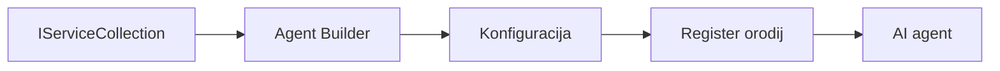

# 🎨 Agentni oblikovalski vzorci z Azure OpenAI (Responses API) (.NET)

## 📋 Cilji učenja

Ta primer prikazuje poslovne oblikovalske vzorce za gradnjo inteligentnih agentov z uporabo Microsoft Agent Framework v .NET z integracijo Azure OpenAI (Responses API). Naučili se boste strokovnih vzorcev in arhitekturnih pristopov, ki agente naredijo pripravljene za produkcijo, vzdržljive in razširljive.

### Poslovni oblikovalski vzorci

- 🏭 **Factory Pattern**: Standardizirano ustvarjanje agentov z odvisnostno injekcijo
- 🔧 **Builder Pattern**: Fluidna konfiguracija in nastavitev agentov
- 🧵 **Vzorci varni za niti**: Sočasno upravljanje pogovorov
- 📋 **Repository Pattern**: Organizirano upravljanje orodij in zmogljivosti

## 🎯 Arhitekturne prednosti specifične za .NET

### Podjetniške funkcije

- **Močno tipiziranje**: Validacija med prevajanjem in podpora IntelliSense
- **Odvisnostna injekcija**: Vgrajena integracija DI kontejnerja
- **Upravljanje konfiguracije**: IConfiguration in vzorci Options
- **Async/Await**: Podpora asinkronemu programiranju prvega razreda

### Vzorci pripravljeni za produkcijo

- **Integracija beleženja**: ILogger in podpora strukturiranemu beleženju
- **Zdravstvene kontrole**: Vgrajen nadzor in diagnostika
- **Validacija konfiguracije**: Močno tipiziranje s podatkovnimi oznakami
- **Ravnanje z napakami**: Strukturirano upravljanje izjeme

## 🔧 Tehnična arhitektura

### Osnovne .NET komponente

- **Microsoft.Extensions.AI**: Enotne abstrakcije AI storitev
- **Microsoft.Agents.AI**: Okvir za orkestražo poslovnih agentov
- **Azure OpenAI (Responses API)**: Vzorce visoko zmogljivosti za API klienta
- **Sistem konfiguracije**: appsettings.json in integracija okolja

### Implementacija oblikovalskih vzorcev



## 🏗️ Prikazani poslovni vzorci

### 1. **Vzorec kreacije**

- **Agent Factory**: Centralizirano ustvarjanje agentov s konsistentno konfiguracijo
- **Builder Pattern**: Fluent API za kompleksno konfiguracijo agentov
- **Singleton Pattern**: Deljeni viri in upravljanje konfiguracije
- **Odvisnostna injekcija**: Ohlapno povezovanje in testabilnost

### 2. **Vzorci vedenja**

- **Strategy Pattern**: Zamenljive strategije izvedbe orodij
- **Command Pattern**: Zapakirani agentni postopki z undo/redo
- **Observer Pattern**: Dogodkovno usmerjeno upravljanje življenjskega cikla agentov
- **Template Method**: Standardizirani poteki izvajanja agentov

### 3. **Strukturni vzorci**

- **Adapter Pattern**: Plast integracije Azure OpenAI (Responses API)
- **Decorator Pattern**: Izboljšanje zmožnosti agentov
- **Facade Pattern**: Poenostavljeni vmesniki za interakcijo agentov
- **Proxy Pattern**: Lenobno nalaganje in predpomnjenje za zmogljivost

## 📚 Načela oblikovanja v .NET

### Načela SOLID

- **Single Responsibility**: Vsaka komponenta ima en jasen namen
- **Open/Closed**: Razširljivo brez spreminjanja
- **Liskov Substitution**: Implementacije orodij na osnovi vmesnikov
- **Interface Segregation**: Osredotočeni, kohezivni vmesniki
- **Dependency Inversion**: Odvisnost od abstrakcij, ne od konkretnih

### Čista arhitektura

- **Plast domene**: Osnovne abstrakcije agentov in orodij
- **Plast aplikacije**: Orkestracija agentov in delovni poteki
- **Plast infrastrukture**: Integracija Azure OpenAI (Responses API) in zunanje storitve
- **Plast predstavitve**: Interakcija z uporabnikom in oblikovanje odgovorov

## 🔒 Poslovna vprašanja

### Varnost

- **Upravljanje poverilnic**: Varen način ravnanja z API ključi preko IConfiguration
- **Validacija vnosa**: Močno tipiziranje in validacija s podatkovnimi oznakami
- **Sanitizacija izhoda**: Varnostno obdelovanje in filtriranje odgovorov
- **Revizijsko beleženje**: Celovito sledenje operacijam

### Zmogljivost

- **Asinkroni vzorci**: Neblokirajoče I/O operacije
- **Povezovalne skupine**: Učinkovito upravljanje HTTP klientov
- **Predpomnjenje**: Predpomnjenje odgovorov za boljšo zmogljivost
- **Upravljanje virov**: Pravilno odstranjevanje in vzorci čiščenja

### Razširljivost

- **Varnost niti**: Podpora sočasnemu izvajanju agentov
- **Združevanje virov**: Učinkovita raba virov
- **Upravljanje obremenitve**: Omejevanje hitrosti in upravljanje z zatišanjem
- **Nadzor**: Merilniki zmogljivosti in zdravstvene kontrole

## 🚀 Uvedba v produkcijo

- **Upravljanje konfiguracije**: Nastavitve specifične za okolje
- **Strategija beleženja**: Strukturirano beleženje s korelacijskimi ID-ji
- **Ravnanje z napakami**: Globalno upravljanje izjem z ustreznim okrevanjem
- **Nadzor**: Application Insights in števec zmogljivosti
- **Testiranje**: Enotne, integracijske in vzorce testiranja obremenitve

Pripravljeni na gradnjo inteligentnih agentov poslovne ravni z .NET? Postavimo nekaj robustnega! 🏢✨

## 🚀 Začetek

### Zahteve

- [.NET 10 SDK](https://dotnet.microsoft.com/download/dotnet/10.0) ali novejši
- [Azure naročnina](https://azure.microsoft.com/free/) z virom Azure OpenAI in namestitvijo modela
- [Azure CLI](https://learn.microsoft.com/cli/azure/install-azure-cli) — prijava z `az login`

### Potrebne spremenljivke okolja

```bash
# zsh/bash
export AZURE_OPENAI_ENDPOINT=https://<your-resource>.openai.azure.com
export AZURE_OPENAI_DEPLOYMENT=gpt-4o-mini
# Nato se prijavite, da lahko AzureCliCredential pridobi žeton
az login
```

```powershell
# PowerShell
$env:AZURE_OPENAI_ENDPOINT = "https://<your-resource>.openai.azure.com"
$env:AZURE_OPENAI_DEPLOYMENT = "gpt-4o-mini"
# Nato se prijavite, da bo AzureCliCredential lahko pridobil žeton
az login
```

### Vzorec kode

Za zagon primer kode,

```bash
# zsh/bash
chmod +x ./03-dotnet-agent-framework.cs
./03-dotnet-agent-framework.cs
```

Ali z uporabo dotnet CLI:

```bash
dotnet run ./03-dotnet-agent-framework.cs
```

Glejte [`03-dotnet-agent-framework.cs`](../../../../03-agentic-design-patterns/code_samples/03-dotnet-agent-framework.cs) za popolno kodo.

```csharp
#!/usr/bin/dotnet run

#:package Microsoft.Extensions.AI@10.*
#:package Microsoft.Agents.AI.OpenAI@1.*-*
#:package Azure.AI.OpenAI@2.1.0
#:package Azure.Identity@1.13.1

using System.ComponentModel;

using Microsoft.Agents.AI;
using Microsoft.Extensions.AI;

using Azure.AI.OpenAI;
using Azure.Identity;

// Tool Function: Random Destination Generator
// This static method will be available to the agent as a callable tool
// The [Description] attribute helps the AI understand when to use this function
// This demonstrates how to create custom tools for AI agents
[Description("Provides a random vacation destination.")]
static string GetRandomDestination()
{
    // List of popular vacation destinations around the world
    // The agent will randomly select from these options
    var destinations = new List<string>
    {
        "Paris, France",
        "Tokyo, Japan",
        "New York City, USA",
        "Sydney, Australia",
        "Rome, Italy",
        "Barcelona, Spain",
        "Cape Town, South Africa",
        "Rio de Janeiro, Brazil",
        "Bangkok, Thailand",
        "Vancouver, Canada"
    };

    // Generate random index and return selected destination
    // Uses System.Random for simple random selection
    var random = new Random();
    int index = random.Next(destinations.Count);
    return destinations[index];
}

// Azure OpenAI with the Responses API (stable v1 endpoint). Sign in with `az login`.
var azureEndpoint = Environment.GetEnvironmentVariable("AZURE_OPENAI_ENDPOINT")
    ?? throw new InvalidOperationException("AZURE_OPENAI_ENDPOINT is not set.");
var deployment = Environment.GetEnvironmentVariable("AZURE_OPENAI_DEPLOYMENT") ?? "gpt-4o-mini";

var azureClient = new AzureOpenAIClient(new Uri(azureEndpoint), new AzureCliCredential());

// Define Agent Identity and Comprehensive Instructions
// Agent name for identification and logging purposes
var AGENT_NAME = "TravelAgent";

// Detailed instructions that define the agent's personality, capabilities, and behavior
// This system prompt shapes how the agent responds and interacts with users
var AGENT_INSTRUCTIONS = """
You are a helpful AI Agent that can help plan vacations for customers.

Important: When users specify a destination, always plan for that location. Only suggest random destinations when the user hasn't specified a preference.

When the conversation begins, introduce yourself with this message:
"Hello! I'm your TravelAgent assistant. I can help plan vacations and suggest interesting destinations for you. Here are some things you can ask me:
1. Plan a day trip to a specific location
2. Suggest a random vacation destination
3. Find destinations with specific features (beaches, mountains, historical sites, etc.)
4. Plan an alternative trip if you don't like my first suggestion

What kind of trip would you like me to help you plan today?"

Always prioritize user preferences. If they mention a specific destination like "Bali" or "Paris," focus your planning on that location rather than suggesting alternatives.
""";

// Create AI Agent with Advanced Travel Planning Capabilities
// Get the Responses client for the deployment and create the AI agent
// Configure agent with name, detailed instructions, and available tools
// This demonstrates the .NET agent creation pattern with full configuration
AIAgent agent = azureClient
    .GetOpenAIResponseClient(deployment)
    .CreateAIAgent(
        name: AGENT_NAME,
        instructions: AGENT_INSTRUCTIONS,
        tools: [AIFunctionFactory.Create(GetRandomDestination)]
    );

// Create New Conversation Thread for Context Management
// Initialize a new conversation thread to maintain context across multiple interactions
// Threads enable the agent to remember previous exchanges and maintain conversational state
// This is essential for multi-turn conversations and contextual understanding
AgentThread thread = agent.GetNewThread();

// Execute Agent: First Travel Planning Request
// Run the agent with an initial request that will likely trigger the random destination tool
// The agent will analyze the request, use the GetRandomDestination tool, and create an itinerary
// Using the thread parameter maintains conversation context for subsequent interactions
await foreach (var update in agent.RunStreamingAsync("Plan me a day trip", thread))
{
    await Task.Delay(10);
    Console.Write(update);
}

Console.WriteLine();

// Execute Agent: Follow-up Request with Context Awareness
// Demonstrate contextual conversation by referencing the previous response
// The agent remembers the previous destination suggestion and will provide an alternative
// This showcases the power of conversation threads and contextual understanding in .NET agents
await foreach (var update in agent.RunStreamingAsync("I don't like that destination. Plan me another vacation.", thread))
{
    await Task.Delay(10);
    Console.Write(update);
}
```

---

<!-- CO-OP TRANSLATOR DISCLAIMER START -->
**Omejitev odgovornosti**:
Ta dokument je bil preveden z uporabo AI prevajalske storitve [Co-op Translator](https://github.com/Azure/co-op-translator). Čeprav si prizadevamo za natančnost, vas prosimo, da upoštevate, da avtomatizirani prevodi lahko vsebujejo napake ali netočnosti. Izvirni dokument v njegovem izvirnem jeziku je treba obravnavati kot avtoritativni vir. Za kritične informacije je priporočljiv strokovni človeški prevod. Ne odgovarjamo za morebitna nesporazume ali napačne interpretacije, ki izhajajo iz uporabe tega prevoda.
<!-- CO-OP TRANSLATOR DISCLAIMER END -->