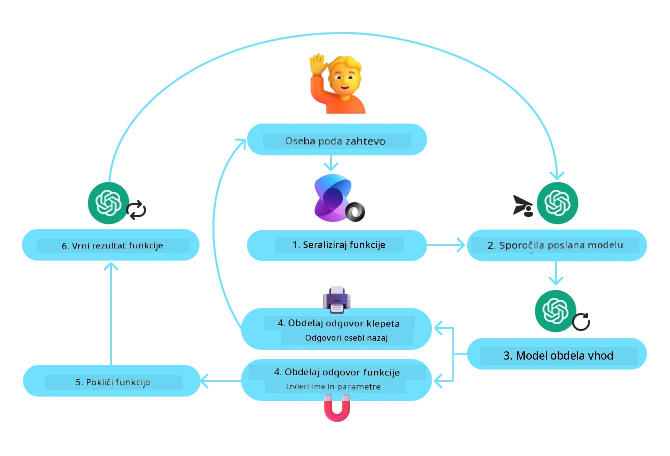
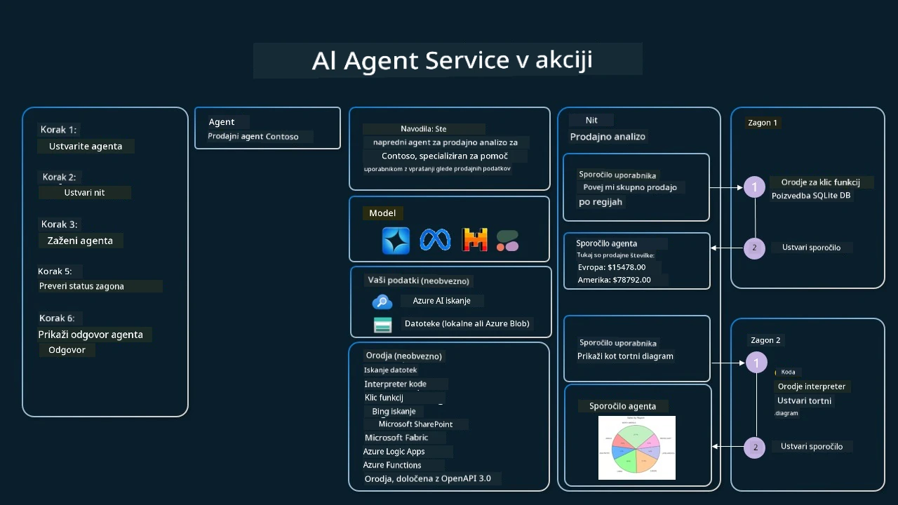

[](https://youtu.be/vieRiPRx-gI?si=cEZ8ApnT6Sus9rhn)

> _(Kliknite sliko zgoraj za ogled videa te lekcije)_

# Vzorec oblikovanja uporabe orodij

Orodja so zanimiva, ker AI agentom omogočajo širši nabor zmožnosti. Namesto, da bi agent imel omejen nabor dejanj, ki jih lahko izvede, lahko z dodajanjem orodja agent zdaj izvaja širok spekter dejanj. V tem poglavju bomo pogledali vzorec oblikovanja uporabe orodij, ki opisuje, kako AI agenti lahko uporabljajo specifična orodja za doseganje svojih ciljev.

## Uvod

V tej lekciji želimo odgovoriti na naslednja vprašanja:

- Kaj je vzorec oblikovanja uporabe orodij?
- Za katere primere uporabe je lahko ta vzorec uporabljen?
- Kateri elementi/gradniki so potrebni za implementacijo tega vzorca?
- Kateri so posebni vidiki pri uporabi vzorca oblikovanja uporabe orodij za gradnjo zanesljivih AI agentov?

## Cilji učenja

Po zaključku te lekcije boste lahko:

- Opredelili vzorec oblikovanja uporabe orodij in njegov namen.
- Prepoznali primere uporabe, kjer je vzorec uporabe orodij uporaben.
- Razumeli ključne elemente, potrebne za implementacijo vzorca.
- Prepoznali pomisleke za zagotavljanje zanesljivosti AI agentov, ki uporabljajo ta vzorec.

## Kaj je vzorec oblikovanja uporabe orodij?

**Vzorec oblikovanja uporabe orodij** se osredotoča na to, da LLM-jem omogoči interakcijo z zunanjimi orodji za doseganje specifičnih ciljev. Orodja so koda, ki jo lahko agent izvede za opravljanje dejanj. Orodje je lahko preprosta funkcija, kot je kalkulator, ali klic API-ja k storitvi tretje osebe, kot je iskanje cene delnice ali vremenska napoved. V kontekstu AI agentov so orodja zasnovana tako, da jih agenti izvajajo kot odziv na **funkcijske klice, ki jih ustvari model**.

## Za katere primere uporabe je lahko vzorec uporabe orodij uporabljen?

AI agenti lahko izkoristijo orodja za opravljanje zahtevnih nalog, pridobivanje informacij ali sprejemanje odločitev. Vzorec uporabe orodij se pogosto uporablja v scenarijih, ki zahtevajo dinamično interakcijo z zunanjimi sistemi, kot so baze podatkov, spletne storitve ali tolmači kode. Ta zmožnost je uporabna za različne primere uporabe, vključno z:

- **Dinamično pridobivanje informacij:** Agenti lahko poizvedujejo zunanje API-je ali baze podatkov za pridobivanje ažurnih podatkov (npr. poizvedovanje v SQLite bazi za analizo podatkov, pridobivanje cen delnic ali vremenskih informacij).
- **Izvajanje in interpretacija kode:** Agenti lahko izvajajo kodo ali skripte za reševanje matematičnih problemov, generiranje poročil ali izvajanje simulacij.
- **Avtomatizacija delovnih tokov:** Avtomatizacija ponavljajočih se ali večstopenjskih delovnih tokov z uporabo orodij kot so planirniki opravil, e-poštne storitve ali podatkovni vodovodi.
- **Podpora uporabnikom:** Agenti lahko komunicirajo s CRM sistemi, platformami za vstopnice ali bazami znanja za reševanje uporabniških vprašanj.
- **Generiranje in urejanje vsebin:** Agenti lahko uporabljajo orodja kot so preverjalniki slovnice, povzemači besedil ali ocenjevalci varnosti vsebin za pomoč pri ustvarjanju vsebin.

## Kateri elementi/gradniki so potrebni za implementacijo vzorca uporabe orodij?

Ti gradniki omogočajo AI agentu izvajanje širokega spektra nalog. Oglejmo si ključne elemente, potrebne za implementacijo vzorca uporabe orodij:

- **Sheme funkcij/orodij**: Podrobne definicije razpoložljivih orodij, vključno z imenom funkcije, namenom, zahtevanimi parametri in pričakovanimi izhodi. Te sheme omogočajo LLM, da razume, katera orodja so na voljo in kako sestaviti veljavne zahteve.

- **Logika izvajanja funkcij**: Določa, kako in kdaj se orodja kličejo glede na namere uporabnika in kontekst pogovora. To lahko vključuje module za načrtovanje, mehanizme usmerjanja ali pogojne tokove, ki dinamično določajo uporabo orodij.

- **Sistem za upravljanje sporočil**: Komponente, ki upravljajo pogovorni tok med vhodi uporabnika, odgovori LLM, klici orodij in izhodi orodij.

- **Okvir za integracijo orodij**: Infrastruktura, ki povezuje agenta z različnimi orodji, ne glede na to, ali gre za preproste funkcije ali zahtevne zunanje storitve.

- **Upravljanje napak & validacija**: Mehanizmi za ravnanje z napakami pri izvajanju orodij, preverjanje parametrov in upravljanje nepričakovanih odzivov.

- **Upravljanje stanja**: Sledi kontekstu pogovora, prejšnjim interakcijam z orodji in trajnim podatkom za zagotavljanje doslednosti preko večkratnih krogov interakcij.

Nato si podrobneje poglejmo klic funkcij/orodij.

### Klic funkcij/orodij

Klic funkcij je glavni način, s katerim omogočimo velikim jezikovnim modelom (LLM), da komunicirajo z orodji. Pogosto boste videli, da se 'Funkcija' in 'Orodje' uporabljata izmenično, ker so 'funkcije' (bloki ponovno uporabne kode) dejanska 'orodja', ki jih agenti uporabljajo za izvajanje nalog. Da se koda funkcije lahko pokliče, mora LLM primerjati zahtevo uporabnika s opisom funkcije. Za to se pošlje shema z opisi vseh razpoložljivih funkcij LLM-ju. LLM nato izbere najprimernejšo funkcijo za nalogo in vrne njeno ime ter argumente. Izbrana funkcija se nato pokliče, njen odgovor se pošlje nazaj LLM-ju, ki uporabi te informacije za odgovor na zahtevo uporabnika.

Za razvijalce, da implementirajo klic funkcij za agente, boste potrebovali:

1. LLM model, ki podpira klic funkcij
2. Shemo, ki vsebuje opise funkcij
3. Kodo za vsako opisano funkcijo

Uporabimo primer pridobivanja trenutnega časa v mestu:

1. **Inicializirajte LLM, ki podpira klic funkcij:**

    Ne podpirajo vsi modeli klica funkcij, zato je pomembno preveriti, ali LLM, ki ga uporabljate, to omogoča. <a href="https://learn.microsoft.com/azure/ai-services/openai/how-to/function-calling" target="_blank">Azure OpenAI</a> podpira klic funkcij. Začnemo lahko z inicializacijo odjemalca Azure OpenAI.

    ```python
    # Inicializirajte odjemalca Azure OpenAI
    client = AzureOpenAI(
        azure_endpoint = os.getenv("AZURE_AI_PROJECT_ENDPOINT"), 
        api_key=os.getenv("AZURE_OPENAI_API_KEY"),  
        api_version="2024-05-01-preview"
    )
    ```

1. **Ustvarite shemo funkcije**:

    Nato definiramo JSON shemo, ki vsebuje ime funkcije, opis funkcije in imena ter opise parametrov funkcije.
    To shemo nato posredujemo prej ustvarjenemu odjemalcu skupaj z uporabnikovo zahtevo po času v San Franciscu. Pomembno je poudariti, da je **klic orodja** tisto, kar se vrne, **ne** končni odgovor na vprašanje. Kot smo omenili, LLM vrne ime funkcije, ki jo je izbral za nalogo, in argumente, ki jim bodo posredovani.

    ```python
    # Opis funkcije za model, da jo prebere
    tools = [
        {
            "type": "function",
            "function": {
                "name": "get_current_time",
                "description": "Get the current time in a given location",
                "parameters": {
                    "type": "object",
                    "properties": {
                        "location": {
                            "type": "string",
                            "description": "The city name, e.g. San Francisco",
                        },
                    },
                    "required": ["location"],
                },
            }
        }
    ]
    ```
   
    ```python
  
    # Začetno uporabnikovo sporočilo
    messages = [{"role": "user", "content": "What's the current time in San Francisco"}] 
  
    # Prvi klic API: Prosite model, naj uporabi funkcijo
      response = client.chat.completions.create(
          model=deployment_name,
          messages=messages,
          tools=tools,
          tool_choice="auto",
      )
  
      # Obdelajte odgovor modela
      response_message = response.choices[0].message
      messages.append(response_message)
  
      print("Model's response:")  

      print(response_message)
  
    ```

    ```bash
    Model's response:
    ChatCompletionMessage(content=None, role='assistant', function_call=None, tool_calls=[ChatCompletionMessageToolCall(id='call_pOsKdUlqvdyttYB67MOj434b', function=Function(arguments='{"location":"San Francisco"}', name='get_current_time'), type='function')])
    ```
  
1. **Koda funkcije, potrebna za izvedbo naloge:**

    Ko je LLM izbral funkcijo, ki jo je treba izvesti, je treba implementirati in izvesti kodo, ki opravi nalogo.
    Kodo za pridobitev trenutnega časa lahko implementiramo v Pythonu. Prav tako bomo morali napisati kodo za pridobivanje imena in argumentov iz response_message za končni rezultat.

    ```python
      def get_current_time(location):
        """Get the current time for a given location"""
        print(f"get_current_time called with location: {location}")  
        location_lower = location.lower()
        
        for key, timezone in TIMEZONE_DATA.items():
            if key in location_lower:
                print(f"Timezone found for {key}")  
                current_time = datetime.now(ZoneInfo(timezone)).strftime("%I:%M %p")
                return json.dumps({
                    "location": location,
                    "current_time": current_time
                })
      
        print(f"No timezone data found for {location_lower}")  
        return json.dumps({"location": location, "current_time": "unknown"})
    ```

     ```python
     # Obravnavaj klice funkcij
      if response_message.tool_calls:
          for tool_call in response_message.tool_calls:
              if tool_call.function.name == "get_current_time":
     
                  function_args = json.loads(tool_call.function.arguments)
     
                  time_response = get_current_time(
                      location=function_args.get("location")
                  )
     
                  messages.append({
                      "tool_call_id": tool_call.id,
                      "role": "tool",
                      "name": "get_current_time",
                      "content": time_response,
                  })
      else:
          print("No tool calls were made by the model.")  
  
      # Drugi klic API-ja: Pridobi končni odgovor modela
      final_response = client.chat.completions.create(
          model=deployment_name,
          messages=messages,
      )
  
      return final_response.choices[0].message.content
     ```

     ```bash
      get_current_time called with location: San Francisco
      Timezone found for san francisco
      The current time in San Francisco is 09:24 AM.
     ```

Klic funkcij je v središču večine, če ne vseh oblik uporabe agentov z orodji, vendar je implementacija iz nič lahko včasih zahtevna.
Kot smo se naučili v [Lekcija 2](../../../02-explore-agentic-frameworks), agentni okviri nam nudijo že pripravljene gradnike za implementacijo uporabe orodij.
 
## Primeri uporabe orodij z agentnimi okvirji

Tukaj je nekaj primerov, kako lahko implementirate vzorec oblikovanja uporabe orodij z uporabo različnih agentnih okvirjev:

### Microsoft Agent Framework

<a href="https://learn.microsoft.com/azure/ai-services/agents/overview" target="_blank">Microsoft Agent Framework</a> je odprtokodni AI okvir za gradnjo AI agentov. Poenostavlja proces klica funkcij tako, da omogoča definiranje orodij kot Python funkcij z okrasjem `@tool`. Okvir upravlja komunikacijo med modelom in vašo kodo. Prav tako omogoča dostop do že pripravljenih orodij, kot sta File Search in Code Interpreter prek `AzureAIProjectAgentProvider`.

Naslednja shema prikazuje proces klica funkcij v Microsoft Agent Framework:



V Microsoft Agent Framework so orodja definirana kot okrašene funkcije. Funkcijo `get_current_time`, ki smo jo videli prej, lahko spremenimo v orodje z uporabo okrasja `@tool`. Okvir bo samodejno serializiral funkcijo in njene parametre ter ustvaril shemo za pošiljanje LLM-ju.

```python
from agent_framework import tool
from agent_framework.azure import AzureAIProjectAgentProvider
from azure.identity import AzureCliCredential

@tool
def get_current_time(location: str) -> str:
    """Get the current time for a given location"""
    ...

# Ustvari odjemalca
provider = AzureAIProjectAgentProvider(credential=AzureCliCredential())

# Ustvari agenta in ga zaženi orodje
agent = await provider.create_agent(name="TimeAgent", instructions="Use available tools to answer questions.", tools=get_current_time)
response = await agent.run("What time is it?")
```
  
### Azure AI Agent Service

<a href="https://learn.microsoft.com/azure/ai-services/agents/overview" target="_blank">Azure AI Agent Service</a> je novejši agentni okvir, zasnovan za omogočanje razvijalcem varne izdelave, uvajanja in skaliranja visokokakovostnih ter razširljivih AI agentov, brez potrebe po upravljanju osnovnih računalniških in pomnilniških virov. Še posebej je uporaben za podjetniške aplikacije, saj gre za popolnoma upravljano storitev z varnostjo na ravni podjetja.

V primerjavi z razvojem neposredno prek LLM API-ja Azure AI Agent Service ponuja nekatere prednosti, vključno z:

- Samodejni klic orodij – ni več potrebe po razčlenjevanju klica orodja, klicanju orodja in obravnavi odgovora; vse to se zdaj izvaja na strežniški strani
- Varno upravljani podatki – namesto upravljanja lastnega stanja pogovora lahko zaupate vlaknom, ki shranjujejo vse informacije, ki jih potrebujete
- Orodja, pripravljena za uporabo – orodja, ki jih lahko uporabite za interakcijo z vašimi viri podatkov, kot so Bing, Azure AI Search in Azure Functions.

Orodja, na voljo v Azure AI Agent Service, lahko razdelimo v dve kategoriji:

1. Orodja za znanje:
    - <a href="https://learn.microsoft.com/azure/ai-services/agents/how-to/tools/bing-grounding?tabs=python&pivots=overview" target="_blank">Povezovanje z Bing Search</a>
    - <a href="https://learn.microsoft.com/azure/ai-services/agents/how-to/tools/file-search?tabs=python&pivots=overview" target="_blank">File Search</a>
    - <a href="https://learn.microsoft.com/azure/ai-services/agents/how-to/tools/azure-ai-search?tabs=azurecli%2Cpython&pivots=overview-azure-ai-search" target="_blank">Azure AI Search</a>

2. Orodja za dejanja:
    - <a href="https://learn.microsoft.com/azure/ai-services/agents/how-to/tools/function-calling?tabs=python&pivots=overview" target="_blank">Klic funkcij</a>
    - <a href="https://learn.microsoft.com/azure/ai-services/agents/how-to/tools/code-interpreter?tabs=python&pivots=overview" target="_blank">Code Interpreter</a>
    - <a href="https://learn.microsoft.com/azure/ai-services/agents/how-to/tools/openapi-spec?tabs=python&pivots=overview" target="_blank">Orodja definirana z OpenAPI</a>
    - <a href="https://learn.microsoft.com/azure/ai-services/agents/how-to/tools/azure-functions?pivots=overview" target="_blank">Azure Functions</a>

Agent Service nam omogoča, da ta orodja uporabljamo skupaj kot `toolset`. Prav tako uporablja `vlakna`, ki sledijo zgodovini sporočil v določenem pogovoru.

Predstavljajte si, da ste prodajni agent v podjetju Contoso. Želite razviti pogovornega agenta, ki lahko odgovarja na vprašanja o vaših prodajnih podatkih.

Naslednja slika prikazuje, kako lahko uporabite Azure AI Agent Service za analizo vaših prodajnih podatkov:



Za uporabo katerega koli od teh orodij s storitvijo lahko ustvarimo odjemalca in definiramo orodje ali nabor orodij. Za praktično implementacijo lahko uporabimo naslednjo kodo v Pythonu. LLM bo lahko pogledal nabor orodij in se odločil, ali bo uporabil uporabnikovo funkcijo, `fetch_sales_data_using_sqlite_query`, ali že pripravljeni Code Interpreter, glede na uporabniško zahtevo.

```python 
import os
from azure.ai.projects import AIProjectClient
from azure.identity import DefaultAzureCredential
from fetch_sales_data_functions import fetch_sales_data_using_sqlite_query # funkcija fetch_sales_data_using_sqlite_query, ki jo najdete v datoteki fetch_sales_data_functions.py.
from azure.ai.projects.models import ToolSet, FunctionTool, CodeInterpreterTool

project_client = AIProjectClient.from_connection_string(
    credential=DefaultAzureCredential(),
    conn_str=os.environ["PROJECT_CONNECTION_STRING"],
)

# Inicializiraj orodja
toolset = ToolSet()

# Inicializiraj agent za klic funkcij s funkcijo fetch_sales_data_using_sqlite_query in jo dodaj orodjem
fetch_data_function = FunctionTool(fetch_sales_data_using_sqlite_query)
toolset.add(fetch_data_function)

# Inicializiraj orodje Koda Interpreter in ga dodaj orodjem.
code_interpreter = code_interpreter = CodeInterpreterTool()
toolset.add(code_interpreter)

agent = project_client.agents.create_agent(
    model="gpt-4o-mini", name="my-agent", instructions="You are helpful agent", 
    toolset=toolset
)
```

## Kateri so posebni vidiki uporabe vzorca uporabe orodij za gradnjo zanesljivih AI agentov?

Pogosta skrb pri dinamično generiranem SQL-ju s strani LLM-jev je varnost, zlasti tveganje SQL inekcij ali zlonamernih dejanj, kot so brisanje ali spreminjanje baze podatkov. Čeprav so te skrbi upravičene, jih lahko učinkovito omilimo z ustrezno konfiguracijo dovoljenj za dostop do baze podatkov. Za večino baz podatkov to pomeni konfiguracijo baze kot samo za branje. Za storitve baz podatkov, kot so PostgreSQL ali Azure SQL, naj ima aplikacija dodeljeno samo vlogo za branje (SELECT).

Zagon aplikacije v varnem okolju dodatno poveča zaščito. V podjetniških scenarijih se podatki običajno izločajo in pretvarjajo iz operativnih sistemov v bazo podatkov ali podatkovno skladišče, dostopno samo za branje, z uporabniku prijazno shemo. Ta pristop zagotavlja varnost podatkov, optimizacijo zmogljivosti in dostopnost ter omejen dostop aplikacije samo za branje.

## Vzorec kode

- Python: [Agent Framework](./code_samples/04-python-agent-framework.ipynb)
- .NET: [Agent Framework](./code_samples/04-dotnet-agent-framework.md)

## Imate več vprašanj o vzorcih oblikovanja uporabe orodij?

Pridružite se [Microsoft Foundry Discord](https://aka.ms/ai-agents/discord), da se srečate z drugimi učenci, udeležite ur uradnih ur in dobite odgovore na vprašanja o AI agentih.

## Dodatni viri

- <a href="https://microsoft.github.io/build-your-first-agent-with-azure-ai-agent-service-workshop/" target="_blank">Delavnica Azure AI Agents Service</a>
- <a href="https://github.com/Azure-Samples/contoso-creative-writer/tree/main/docs/workshop" target="_blank">Delavnica Contoso Creative Writer Multi-Agent</a>
- <a href="https://learn.microsoft.com/azure/ai-services/agents/overview" target="_blank">Pregled Microsoft Agent Framework</a>

## Prejšnja lekcija

[Razumevanje agentnih vzorcev oblikovanja](../03-agentic-design-patterns/README.md)

## Naslednja lekcija
[Agentni RAG](../05-agentic-rag/README.md)

---

<!-- CO-OP TRANSLATOR DISCLAIMER START -->
**Omejitev odgovornosti**:
Ta dokument je bil preveden z uporabo AI prevajalske storitve [Co-op Translator](https://github.com/Azure/co-op-translator). Čeprav si prizadevamo za natančnost, vas opozarjamo, da lahko avtomatizirani prevodi vsebujejo napake ali netočnosti. Izvirni dokument v njegovi izvorni jezikovni različici velja za avtoritativni vir. Za pomembne informacije priporočamo strokovni človeški prevod. Za kakršnekoli nesporazume ali napačne interpretacije, ki izhajajo iz uporabe tega prevoda, ne odgovarjamo.
<!-- CO-OP TRANSLATOR DISCLAIMER END -->