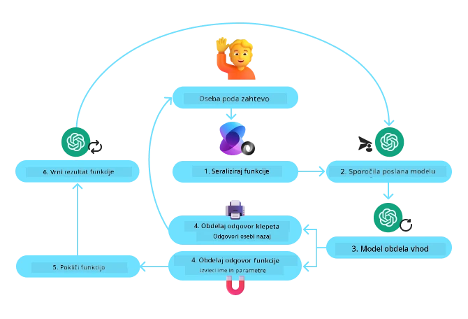
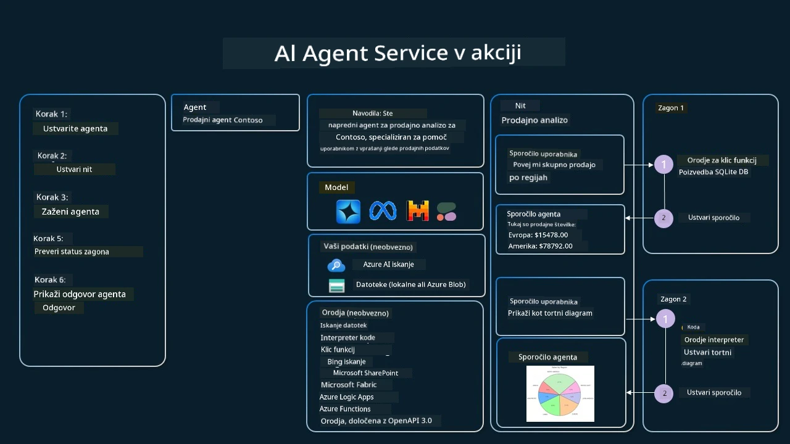

[](https://youtu.be/vieRiPRx-gI?si=cEZ8ApnT6Sus9rhn)

> _(Kliknite na zgornjo sliko za ogled videa te lekcije)_

# Vzorec oblikovanja uporabe orodij

Orodja so zanimiva, ker AI agentom omogočajo širši nabor sposobnosti. Namesto da bi imel agent omejen nabor dejanj, ki jih lahko izvede, lahko z dodajanjem orodja agent zdaj izvaja širok spekter dejanj. V tem poglavju si bomo ogledali vzorec oblikovanja uporabe orodij, ki opisuje, kako AI agenti lahko uporabljajo določena orodja za dosego svojih ciljev.

## Uvod

V tej lekciji želimo odgovoriti na naslednja vprašanja:

- Kaj je vzorec oblikovanja uporabe orodij?
- Za katere primere uporabe ga je mogoče uporabiti?
- Kateri so elementi/gradniki, potrebni za implementacijo vzorca oblikovanja?
- Kateri so posebni premisleki pri uporabi vzorca oblikovanja uporabe orodij za izgradnjo zaupanja vrednih AI agentov?

## Cilji učenja

Po končani tej lekciji boste znali:

- Določiti vzorec oblikovanja uporabe orodij in njegov namen.
- Prepoznati primere uporabe, kjer je vzorec oblikovanja uporabe orodij uporaben.
- Razumeti ključne elemente, potrebne za implementacijo vzorca oblikovanja.
- Prepoznati premisleke za zagotavljanje zanesljivosti AI agentov, ki uporabljajo ta vzorec oblikovanja.

## Kaj je vzorec oblikovanja uporabe orodij?

**Vzorec oblikovanja uporabe orodij** se osredotoča na to, da LLM-jem omogoči interakcijo z zunanjimi orodji za doseganje specifičnih ciljev. Orodja so koda, ki jo lahko agent izvede za izvajanje dejanj. Orodje je lahko preprosta funkcija, kot je kalkulator, ali klic API tretje osebe, na primer poizvedba o ceni delnic ali vremenska napoved. V kontekstu AI agentov so orodja zasnovana tako, da jih agenti izvajajo kot odgovor na **klice funkcij, ki jih generira model**.

## Za katere primere uporabe ga je mogoče uporabiti?

AI agenti lahko uporabljajo orodja za izvedbo zahtevnih nalog, pridobivanje informacij ali sprejemanje odločitev. Vzorec oblikovanja uporabe orodij se pogosto uporablja v scenarijih, kjer je potrebna dinamična interakcija z zunanjimi sistemi, kot so baze podatkov, spletne storitve ali prevajalniki kode. Ta sposobnost je uporabna za različne primere uporabe, vključno z:

- **Dinamično pridobivanje informacij:** Agenti lahko poizvedujejo zunanje API-je ali baze podatkov za pridobitev posodobljenih podatkov (npr. poizvedba baze SQLite za analizo podatkov, pridobivanje cen delnic ali vremenskih informacij).
- **Izvajanje in interpretacija kode:** Agenti lahko izvajajo kodo ali skripte za reševanje matematičnih problemov, izdelavo poročil ali izvedbo simulacij.
- **Avtomatizacija delovnih tokov:** Avtomatizacija ponavljajočih ali večstopenjskih delovnih procesov z integracijo orodij, kot so planerji nalog, e-poštne storitve ali podatkovni pipelini.
- **Podpora strankam:** Agenti lahko komunicirajo s CRM sistemi, platformami za vstopnice ali bazami znanja za reševanje uporabniških vprašanj.
- **Ustvarjanje in urejanje vsebin:** Agenti lahko uporabljajo orodja, kot so preverjevalniki slovnice, povzemalci besedil ali ocenjevalci varnosti vsebine, da pomagajo pri nalogah ustvarjanja vsebin.

## Kateri so elementi/gradniki, potrebni za implementacijo vzorca oblikovanja uporabe orodij?

Ti gradniki agentu omogočajo izvedbo širokega nabora nalog. Poglejmo ključne elemente, potrebne za implementacijo vzorca oblikovanja uporabe orodij:

- **Sheme funkcij/orodij**: Podrobne definicije razpoložljivih orodij, vključno z imenom funkcije, namenom, zahtevanimi parametri in pričakovanimi izhodi. Te sheme omogočajo LLM, da razume, katera orodja so na voljo in kako sestaviti veljavne zahteve.

- **Logika izvajanja funkcij**: Nadzoruje, kako in kdaj se orodja kličejo glede na uporabnikovo namero in kontekst pogovora. To lahko vključuje modules načrtovalcev, mehanizme usmerjanja ali pogojne tokove, ki dinamično določajo uporabo orodij.

- **Sistem rokovanja z sporočili**: Komponente, ki upravljajo pogovorni tok med vhodnimi podatki uporabnika, odgovori LLM, klici orodij in izhodi orodij.

- **Okvir za integracijo orodij**: Infrastruktura, ki povezuje agenta z različnimi orodji, bodisi preprostimi funkcijami ali kompleksnimi zunanjimi storitvami.

- **Obravnava napak in validacija**: Mehanizmi za obvladovanje napak pri izvajanju orodij, preverjanje parametrov in obvladovanje nepričakovanih odgovorov.

- **Upravljanje stanja**: Sledi kontekstu pogovora, prejšnjim interakcijam z orodji in vztrajnimi podatki za zagotovitev skladnosti pri večkrožnih interakcijah.

Nadalje si ogledajmo podrobneje klicanje funkcij/orodij.
 
### Klicanje funkcij/orodij

Klicanje funkcij je glavni način, kako omogočimo LLM-jem interakcijo z orodji. Pogosto boste videli, da se 'funkcija' in 'orodje' uporabljata izmenično, saj so 'funkcije' (bloki ponovno uporabne kode) tista 'orodja', ki jih agenti uporabljajo za izvajanje nalog. Da se koda funkcije pokliče, mora LLM primerjati zahtevo uporabnika z opisom funkcije. Za to se LLM pošlje shema, ki vsebuje opise vseh razpoložljivih funkcij. LLM nato izbere najprimernejšo funkcijo za nalogo in vrne njeno ime ter argumente. Izbrano funkcijo se nato pokliče, njen odgovor pa se pošlje nazaj LLM-ju, ki uporablja te informacije za odziv na uporabnikovo zahtevo.

Za razvijalce, ki želijo implementirati klicanje funkcij za agente, je potrebno:

1. Model LLM, ki podpira klicanje funkcij
2. Shema, ki vsebuje opise funkcij
3. Koda za vsako opisano funkcijo

Uporabimo primer pridobivanja trenutnega časa v mestu za ponazoritev:

1. **Inicializirajte LLM, ki podpira klicanje funkcij:**

    Ne podpirajo vsi modeli klicanja funkcij, zato je pomembno preveriti, ali model, ki ga uporabljate, to podpira. <a href="https://learn.microsoft.com/azure/ai-services/openai/how-to/function-calling" target="_blank">Azure OpenAI</a> podpira klicanje funkcij. Začnemo lahko tako, da inicializiramo OpenAI odjemalca za Azure OpenAI **Responses API** (stabilna `/openai/v1/` točka — ni potrebna `api_version`).

    ```python
    # Inicializirajte odjemalca OpenAI za Azure OpenAI (API odgovorov, končna točka v1)
    client = OpenAI(
        base_url=f"{os.environ['AZURE_OPENAI_ENDPOINT'].rstrip('/')}/openai/v1/",
        api_key=os.environ["AZURE_OPENAI_API_KEY"],
    )
    deployment_name = os.environ["AZURE_OPENAI_DEPLOYMENT"]
    ```

1. **Ustvarite shemo funkcije**:

    Nato bomo definirali JSON shemo, ki vsebuje ime funkcije, opis, kaj funkcija počne, in imena ter opise parametrov funkcije.
    To shemo bomo nato poslali klientu, ustvarjenemu prej, skupaj z uporabnikovo zahtevo za ugotovitev časa v San Franciscu. Pomembno je opozoriti, da je vrnjeni rezultat **klic orodja**, **ne** končni odgovor na vprašanje. Kot je bilo omenjeno prej, LLM vrne ime funkcije, ki jo je izbral za nalogo, in argumente, ki bodo posredovani funkciji.

    ```python
    # Opis funkcije za model, da prebere (format orodja Responses API flat)
    tools = [
        {
            "type": "function",
            "name": "get_current_time",
            "description": "Get the current time in a given location",
            "parameters": {
                "type": "object",
                "properties": {
                    "location": {
                        "type": "string",
                        "description": "The city name, e.g. San Francisco",
                    },
                },
                "required": ["location"],
            },
        }
    ]
    ```
   
    ```python
  
    # Začetno uporabniško sporočilo
    messages = [{"role": "user", "content": "What's the current time in San Francisco"}]

    # Prvi klic API: Prosite model, naj uporabi funkcijo
    response = client.responses.create(
        model=deployment_name,
        input=messages,
        tools=tools,
        tool_choice="auto",
        store=False,
    )

    # Responses API vrne klice orodij kot elemente function_call v response.output.
    # Dodajte jih v pogovor, da ima model celoten kontekst v naslednjem koraku.
    messages += response.output

    print("Model's response:")
    print(response.output)
  
    ```

    ```bash
    Model's response:
    [ResponseFunctionToolCall(arguments='{"location":"San Francisco"}', call_id='call_pOsKdUlqvdyttYB67MOj434b', name='get_current_time', type='function_call')]
    ```
  
1. **Koda funkcije, potrebna za izvedbo naloge:**

    Ko je LLM izbral funkcijo, ki jo je potrebno zagnati, je treba implementirati in izvesti kodo, ki nalogo opravi.
    Kodo bomo implementirali v Pythonu za pridobitev trenutnega časa. Prav tako bomo morali napisati kodo za izluščitev imena in argumentov iz response_message za pridobitev končnega rezultata.

    ```python
      def get_current_time(location):
        """Get the current time for a given location"""
        print(f"get_current_time called with location: {location}")  
        location_lower = location.lower()
        
        for key, timezone in TIMEZONE_DATA.items():
            if key in location_lower:
                print(f"Timezone found for {key}")  
                current_time = datetime.now(ZoneInfo(timezone)).strftime("%I:%M %p")
                return json.dumps({
                    "location": location,
                    "current_time": current_time
                })
      
        print(f"No timezone data found for {location_lower}")  
        return json.dumps({"location": location, "current_time": "unknown"})
    ```

     ```python
    # Obravnavaj klice funkcij
    tool_calls = [item for item in response.output if item.type == "function_call"]
    if tool_calls:
        for tool_call in tool_calls:
            if tool_call.name == "get_current_time":

                function_args = json.loads(tool_call.arguments)

                time_response = get_current_time(
                    location=function_args.get("location")
                )

                # Vrni rezultat orodja kot element function_call_output
                messages.append({
                    "type": "function_call_output",
                    "call_id": tool_call.call_id,
                    "output": time_response,
                })
    else:
        print("No tool calls were made by the model.")

    # Drugi klic API: Pridobi končni odziv modela
    final_response = client.responses.create(
        model=deployment_name,
        input=messages,
        tools=tools,
        store=False,
    )

    return final_response.output_text
     ```

     ```bash
      get_current_time called with location: San Francisco
      Timezone found for san francisco
      The current time in San Francisco is 09:24 AM.
     ```

Klicanje funkcij je srž večine, če ne vseh, oblikovanj uporabe orodij agentov, vendar je implementacija od začetka včasih lahko zahtevna.
Kot smo se naučili v [Lekcija 2](../../../02-explore-agentic-frameworks), nam agentski okvirji nudijo predhodno izdelane gradnike za implementacijo uporabe orodij.
 
## Primeri uporabe orodij z agentskimi okviri

Tukaj je nekaj primerov, kako lahko vzorec oblikovanja uporabe orodij implementirate z različnimi agentskimi okviri:

### Microsoft Agent Framework

<a href="https://learn.microsoft.com/azure/ai-services/agents/overview" target="_blank">Microsoft Agent Framework</a> je odprtokodni AI okvir za gradnjo AI agentov. Poenostavlja proces klicanja funkcij tako, da omogoča definiranje orodij kot Python funkcij z dekoratorjem `@tool`. Okvir upravlja dvosmerno komunikacijo med modelom in vašo kodo. Prav tako omogoča dostop do že izdelanih orodij, kot sta File Search in Code Interpreter, preko `FoundryChatClient`.

Naslednja shema prikazuje proces klicanja funkcij z Microsoft Agent Framework:



V Microsoft Agent Framework so orodja definirana kot dekorirane funkcije. Funkcijo `get_current_time`, ki smo jo videli prej, lahko spremenimo v orodje z uporabo dekoratorja `@tool`. Okvir bo samodejno serializiral funkcijo in njene parametre ter ustvaril shemo za pošiljanje LLM-ju.

```python
import os
from agent_framework import tool
from agent_framework.foundry import FoundryChatClient
from azure.identity import AzureCliCredential

@tool(approval_mode="never_require")
def get_current_time(location: str) -> str:
    """Get the current time for a given location"""
    ...

# Ustvari odjemalca
provider = FoundryChatClient(
    project_endpoint=os.environ["AZURE_AI_PROJECT_ENDPOINT"],
    model=os.environ["AZURE_AI_MODEL_DEPLOYMENT_NAME"],
    credential=AzureCliCredential(),
)

# Ustvari agenta in zaženi z orodjem
agent = provider.as_agent(name="TimeAgent", instructions="Use available tools to answer questions.", tools=get_current_time)
response = await agent.run("What time is it?")
```
  
### Microsoft Foundry Agent Service

<a href="https://learn.microsoft.com/azure/ai-services/agents/overview" target="_blank">Microsoft Foundry Agent Service</a> je novejši agentski okvir, zasnovan za omogočanje razvijalcem, da varno gradijo, uvajajo in razširjajo visokokakovostne, razširljive AI agente brez potrebe po upravljanju osnovnih virov za računalništvo in shranjevanje. Je še posebej uporaben za poslovne aplikacije, ker gre za popolnoma upravljano storitev z varnostjo na podjetniški ravni.

V primerjavi z neposrednim razvojem z LLM API Microsoft Foundry Agent Service ponuja nekaj prednosti, vključno z:

- Samodejno klicanje orodij – ni potrebe po analizi klica orodja, klicu orodja in upravljanju odziva; vse to se zdaj izvaja na strežniku
- Varnim upravljanjem podatkov – namesto upravljanja lastnega stanja pogovora lahko zanesete na 'threads', ki shranjujejo vse potrebne informacije
- Orodja "iz škatle" – Orodja, s katerimi lahko interagirate s svojimi podatkovnimi viri, kot so Bing, Azure AI Search in Azure Functions.

Orodja, ki so na voljo v Microsoft Foundry Agent Service, lahko razdelimo v dve kategoriji:

1. Orodja za znanje:
    - <a href="https://learn.microsoft.com/azure/ai-services/agents/how-to/tools/bing-grounding?tabs=python&pivots=overview" target="_blank">Povezovanje z Bing Search</a>
    - <a href="https://learn.microsoft.com/azure/ai-services/agents/how-to/tools/file-search?tabs=python&pivots=overview" target="_blank">Iskanje datotek</a>
    - <a href="https://learn.microsoft.com/azure/ai-services/agents/how-to/tools/azure-ai-search?tabs=azurecli%2Cpython&pivots=overview-azure-ai-search" target="_blank">Azure AI Search</a>

2. Orodja za dejanja:
    - <a href="https://learn.microsoft.com/azure/ai-services/agents/how-to/tools/function-calling?tabs=python&pivots=overview" target="_blank">Klicanje funkcij</a>
    - <a href="https://learn.microsoft.com/azure/ai-services/agents/how-to/tools/code-interpreter?tabs=python&pivots=overview" target="_blank">Interpreter kode</a>
    - <a href="https://learn.microsoft.com/azure/ai-services/agents/how-to/tools/openapi-spec?tabs=python&pivots=overview" target="_blank">Orodja, definirana z OpenAPI</a>
    - <a href="https://learn.microsoft.com/azure/ai-services/agents/how-to/tools/azure-functions?pivots=overview" target="_blank">Azure Functions</a>

Agent Service nam omogoča uporabo teh orodij skupaj kot 'toolset' (skupin orodij). Prav tako uporablja 'threads', ki sledijo zgodovini sporočil določenega pogovora.

Predstavljajte si, da ste prodajni agent v podjetju Contoso. Želite razviti pogovornega agenta, ki lahko odgovori na vprašanja o vaših prodajnih podatkih.

Naslednja slika prikazuje, kako lahko uporabite Microsoft Foundry Agent Service za analizo vaših prodajnih podatkov:



Za uporabo katerega koli od teh orodij s storitvijo lahko ustvarimo klienta in definiramo orodje ali skupino orodij. Za praktično izvedbo lahko uporabimo naslednjo Python kodo. LLM bo lahko pregledal skupino orodij in se odloči, ali bo uporabil uporabniško ustvarjeno funkcijo `fetch_sales_data_using_sqlite_query` ali že izdelan interpreter kode, odvisno od uporabnikove zahteve.

```python 
import os
from azure.ai.projects import AIProjectClient
from azure.identity import DefaultAzureCredential
from fetch_sales_data_functions import fetch_sales_data_using_sqlite_query # funkcija fetch_sales_data_using_sqlite_query, ki jo lahko najdemo v datoteki fetch_sales_data_functions.py.
from azure.ai.projects.models import ToolSet, FunctionTool, CodeInterpreterTool

project_client = AIProjectClient.from_connection_string(
    credential=DefaultAzureCredential(),
    conn_str=os.environ["PROJECT_CONNECTION_STRING"],
)

# Inicializacija orodjarne
toolset = ToolSet()

# Inicializacija agenta za klic funkcij s funkcijo fetch_sales_data_using_sqlite_query in dodajanje le-te v orodjarno
fetch_data_function = FunctionTool(fetch_sales_data_using_sqlite_query)
toolset.add(fetch_data_function)

# Inicializacija orodja za interpretacijo kode in dodajanje le-tega v orodjarno.
code_interpreter = CodeInterpreterTool()toolset.add(code_interpreter)

agent = project_client.agents.create_agent(
    model="gpt-4o-mini", name="my-agent", instructions="You are helpful agent", 
    toolset=toolset
)
```

## Kateri so posebni premisleki pri uporabi vzorca oblikovanja uporabe orodij za gradnjo zaupanja vrednih AI agentov?

Pogosta skrb pri dinamično generiranem SQL s strani LLM-jev je varnost, zlasti tveganje SQL injekcij ali zlonamernih dejanj, kot so izbris ali spreminjanje baze podatkov. Čeprav so te skrbi upravičene, jih je mogoče učinkovito omiliti z ustrezno konfiguracijo dovoljenj za dostop do baze podatkov. Za večino baz podatkov to pomeni konfiguracijo baze v načinu samo za branje. Za baze podatkov, kot sta PostgreSQL ali Azure SQL, bi morala aplikacija imeti vlogo samo za branje (SELECT).

Zagon aplikacije v varnem okolju dodatno poveča zaščito. V poslovnih scenarijih se podatki običajno izvlečejo in pretvorijo iz operativnih sistemov v bazo podatkov ali podatkovno skladišče z uporabniku prijazno shemo, ki je samo za branje. Ta pristop zagotavlja, da so podatki varni, optimizirani za zmogljivost in dostopnost ter da ima aplikacija omejen dostop samo za branje.

## Vzorec kode

- Python: [Agent Framework](./code_samples/04-python-agent-framework.ipynb)
- .NET: [Agent Framework](./code_samples/04-dotnet-agent-framework.md)

## Imate več vprašanj o vzorcih oblikovanja uporabe orodij?

Pridružite se [Microsoft Foundry Discord](https://discord.com/invite/ATgtXmAS5D), da se srečate z drugimi učenci, udeležite ur pisarne in dobite odgovore na vprašanja o AI agentih.

## Dodatni viri

- <a href="https://microsoft.github.io/build-your-first-agent-with-azure-ai-agent-service-workshop/" target="_blank">Delavnica Azure AI Agents Service</a>
- <a href="https://github.com/Azure-Samples/contoso-creative-writer/tree/main/docs/workshop" target="_blank">Contoso Creative Writer delavnica za več agentov</a>
- <a href="https://learn.microsoft.com/azure/ai-services/agents/overview" target="_blank">Pregled Microsoft Agent Framework</a>


## Prejšnja lekcija

[Razumevanje vzorcev agentnega oblikovanja](../03-agentic-design-patterns/README.md)

## Naslednja lekcija

[Agentic RAG](../05-agentic-rag/README.md)

---

<!-- CO-OP TRANSLATOR DISCLAIMER START -->
**Omejitev odgovornosti**:
Ta dokument je bil preveden z uporabo AI prevajalske storitve [Co-op Translator](https://github.com/Azure/co-op-translator). Čeprav si prizadevamo za natančnost, vas prosimo, da upoštevate, da avtomatizirani prevodi lahko vsebujejo napake ali netočnosti. Izvirni dokument v njegovem izvirnem jeziku je treba obravnavati kot avtoritativni vir. Za kritične informacije je priporočljiv strokovni človeški prevod. Ne odgovarjamo za morebitna nesporazume ali napačne interpretacije, ki izhajajo iz uporabe tega prevoda.
<!-- CO-OP TRANSLATOR DISCLAIMER END -->