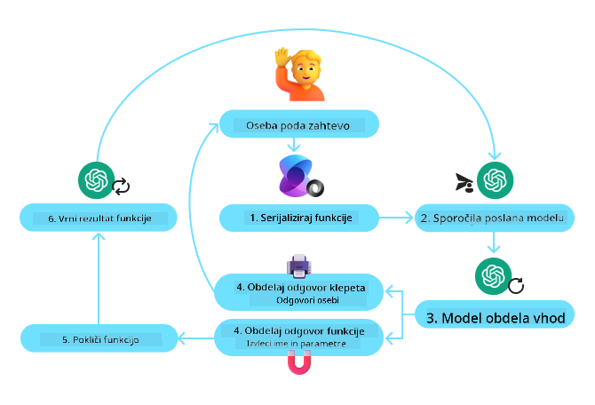
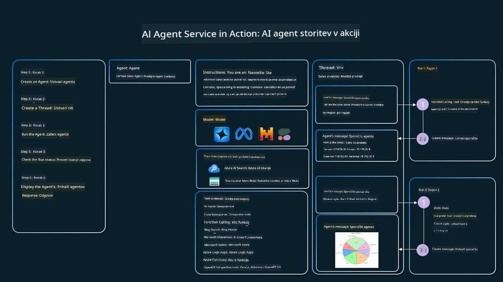

<!--
CO_OP_TRANSLATOR_METADATA:
{
  "original_hash": "4a5ccc4ad1dba85fbc2087cf3b986544",
  "translation_date": "2025-08-30T09:21:16+00:00",
  "source_file": "04-tool-use/README.md",
  "language_code": "sl"
}
-->
[](https://youtu.be/vieRiPRx-gI?si=cEZ8ApnT6Sus9rhn)

> _(Kliknite zgornjo sliko za ogled videoposnetka te lekcije)_

# Vzorec oblikovanja uporabe orodij

Orodja so zanimiva, ker omogočajo AI agentom širši nabor zmožnosti. Namesto da bi imel agent omejen nabor dejanj, ki jih lahko izvede, lahko z dodajanjem orodja zdaj izvaja širok spekter dejanj. V tem poglavju bomo preučili vzorec oblikovanja uporabe orodij, ki opisuje, kako lahko AI agenti uporabljajo specifična orodja za dosego svojih ciljev.

## Uvod

V tej lekciji bomo poskušali odgovoriti na naslednja vprašanja:

- Kaj je vzorec oblikovanja uporabe orodij?
- Za katere primere uporabe je primeren?
- Katere so ključne sestavine, potrebne za implementacijo tega vzorca oblikovanja?
- Katere posebne vidike je treba upoštevati pri uporabi vzorca oblikovanja uporabe orodij za gradnjo zaupanja vrednih AI agentov?

## Cilji učenja

Po zaključku te lekcije boste lahko:

- Opredelili vzorec oblikovanja uporabe orodij in njegov namen.
- Prepoznali primere uporabe, kjer je vzorec oblikovanja uporabe orodij uporaben.
- Razumeli ključne elemente, potrebne za implementacijo tega vzorca oblikovanja.
- Prepoznali vidike za zagotavljanje zaupanja vrednosti AI agentov, ki uporabljajo ta vzorec oblikovanja.

## Kaj je vzorec oblikovanja uporabe orodij?

**Vzorec oblikovanja uporabe orodij** se osredotoča na omogočanje interakcije LLM-jev z zunanjimi orodji za dosego specifičnih ciljev. Orodja so koda, ki jo lahko agent izvede za izvedbo dejanj. Orodje je lahko preprosta funkcija, kot je kalkulator, ali API klic do storitve tretje osebe, kot je iskanje cen delnic ali vremenska napoved. V kontekstu AI agentov so orodja zasnovana tako, da jih agenti izvedejo kot odgovor na **funkcijske klice, ki jih ustvari model**.

## Za katere primere uporabe je primeren?

AI agenti lahko uporabljajo orodja za dokončanje zapletenih nalog, pridobivanje informacij ali sprejemanje odločitev. Vzorec oblikovanja uporabe orodij se pogosto uporablja v scenarijih, ki zahtevajo dinamično interakcijo z zunanjimi sistemi, kot so baze podatkov, spletne storitve ali interpreterji kode. Ta sposobnost je uporabna za številne primere uporabe, vključno z:

- **Dinamično pridobivanje informacij:** Agenti lahko poizvedujejo zunanje API-je ali baze podatkov za pridobivanje posodobljenih podatkov (npr. poizvedovanje SQLite baze za analizo podatkov, pridobivanje cen delnic ali vremenskih informacij).
- **Izvajanje in interpretacija kode:** Agenti lahko izvajajo kodo ali skripte za reševanje matematičnih problemov, ustvarjanje poročil ali izvajanje simulacij.
- **Avtomatizacija delovnih tokov:** Avtomatizacija ponavljajočih se ali večstopenjskih delovnih tokov z integracijo orodij, kot so načrtovalniki opravil, e-poštne storitve ali podatkovni tokovi.
- **Podpora strankam:** Agenti lahko komunicirajo s CRM sistemi, platformami za izdajo vstopnic ali bazami znanja za reševanje uporabniških poizvedb.
- **Ustvarjanje in urejanje vsebin:** Agenti lahko uporabljajo orodja, kot so preverjevalniki slovnice, povzetki besedil ali ocenjevalci varnosti vsebin za pomoč pri nalogah ustvarjanja vsebin.

## Katere so ključne sestavine, potrebne za implementacijo vzorca oblikovanja uporabe orodij?

Te sestavine omogočajo AI agentu izvajanje širokega spektra nalog. Oglejmo si ključne elemente, potrebne za implementacijo vzorca oblikovanja uporabe orodij:

- **Sheme funkcij/orodij:** Podrobne definicije razpoložljivih orodij, vključno z imenom funkcije, namenom, zahtevanimi parametri in pričakovanimi izhodi. Te sheme omogočajo LLM-ju razumevanje, katera orodja so na voljo in kako sestaviti veljavne zahteve.
- **Logika izvajanja funkcij:** Določa, kako in kdaj se orodja prikličejo glede na uporabnikov namen in kontekst pogovora. To lahko vključuje module za načrtovanje, mehanizme usmerjanja ali pogojne tokove, ki dinamično določajo uporabo orodij.
- **Sistem za upravljanje sporočil:** Komponente, ki upravljajo tok pogovora med uporabniškimi vnosi, odgovori LLM-ja, klici orodij in izhodi orodij.
- **Okvir za integracijo orodij:** Infrastruktura, ki povezuje agenta z različnimi orodji, naj bodo to preproste funkcije ali kompleksne zunanje storitve.
- **Upravljanje napak in validacija:** Mehanizmi za obravnavo napak pri izvajanju orodij, validacijo parametrov in upravljanje nepričakovanih odgovorov.
- **Upravljanje stanja:** Sledi kontekstu pogovora, prejšnjim interakcijam z orodji in trajnim podatkom za zagotavljanje doslednosti pri večkratnih interakcijah.

Nato si podrobneje oglejmo klicanje funkcij/orodij.

### Klicanje funkcij/orodij

Klicanje funkcij je primarni način, kako omogočimo velikim jezikovnim modelom (LLM-jem) interakcijo z orodji. Pogosto boste videli, da se izraza 'funkcija' in 'orodje' uporabljata izmenično, saj so 'funkcije' (bloki ponovno uporabne kode) 'orodja', ki jih agenti uporabljajo za izvajanje nalog. Da bi bila koda funkcije priklicana, mora LLM primerjati uporabnikovo zahtevo z opisom funkcije. Za to se LLM-ju pošlje shema, ki vsebuje opise vseh razpoložljivih funkcij. LLM nato izbere najprimernejšo funkcijo za nalogo in vrne njeno ime ter argumente. Izbrana funkcija se izvede, njen odgovor pa se pošlje nazaj LLM-ju, ki uporabi informacije za odgovor na uporabnikovo zahtevo.

Za implementacijo klicanja funkcij za agente razvijalci potrebujejo:

1. LLM model, ki podpira klicanje funkcij
2. Shemo, ki vsebuje opise funkcij
3. Kodo za vsako opisano funkcijo

Poglejmo primer pridobivanja trenutnega časa v določenem mestu:

1. **Inicializacija LLM-ja, ki podpira klicanje funkcij:**

    Vsi modeli ne podpirajo klicanja funkcij, zato je pomembno preveriti, ali model, ki ga uporabljate, to omogoča. <a href="https://learn.microsoft.com/azure/ai-services/openai/how-to/function-calling" target="_blank">Azure OpenAI</a> podpira klicanje funkcij. Začnemo lahko z inicializacijo odjemalca Azure OpenAI.

    ```python
    # Initialize the Azure OpenAI client
    client = AzureOpenAI(
        azure_endpoint = os.getenv("AZURE_OPENAI_ENDPOINT"), 
        api_key=os.getenv("AZURE_OPENAI_API_KEY"),  
        api_version="2024-05-01-preview"
    )
    ```

1. **Ustvarjanje sheme funkcije:**

    Nato definiramo JSON shemo, ki vsebuje ime funkcije, opis njenega namena ter imena in opise parametrov funkcije. To shemo nato posredujemo prej ustvarjenemu odjemalcu skupaj z uporabnikovo zahtevo za iskanje časa v San Franciscu. Pomembno je poudariti, da je rezultat **klic orodja**, **ne** končni odgovor na vprašanje. Kot že omenjeno, LLM vrne ime funkcije, ki jo je izbral za nalogo, in argumente, ki bodo posredovani funkciji.

    ```python
    # Function description for the model to read
    tools = [
        {
            "type": "function",
            "function": {
                "name": "get_current_time",
                "description": "Get the current time in a given location",
                "parameters": {
                    "type": "object",
                    "properties": {
                        "location": {
                            "type": "string",
                            "description": "The city name, e.g. San Francisco",
                        },
                    },
                    "required": ["location"],
                },
            }
        }
    ]
    ```
   
    ```python
  
    # Initial user message
    messages = [{"role": "user", "content": "What's the current time in San Francisco"}] 
  
    # First API call: Ask the model to use the function
      response = client.chat.completions.create(
          model=deployment_name,
          messages=messages,
          tools=tools,
          tool_choice="auto",
      )
  
      # Process the model's response
      response_message = response.choices[0].message
      messages.append(response_message)
  
      print("Model's response:")  

      print(response_message)
  
    ```

    ```bash
    Model's response:
    ChatCompletionMessage(content=None, role='assistant', function_call=None, tool_calls=[ChatCompletionMessageToolCall(id='call_pOsKdUlqvdyttYB67MOj434b', function=Function(arguments='{"location":"San Francisco"}', name='get_current_time'), type='function')])
    ```
  
1. **Koda funkcije, potrebna za izvedbo naloge:**

    Zdaj, ko je LLM izbral, katero funkcijo je treba zagnati, je treba implementirati in izvesti kodo, ki izvede nalogo. Kodo za pridobivanje trenutnega časa lahko implementiramo v Pythonu. Prav tako moramo napisati kodo za pridobivanje imena in argumentov iz response_message, da dobimo končni rezultat.

    ```python
      def get_current_time(location):
        """Get the current time for a given location"""
        print(f"get_current_time called with location: {location}")  
        location_lower = location.lower()
        
        for key, timezone in TIMEZONE_DATA.items():
            if key in location_lower:
                print(f"Timezone found for {key}")  
                current_time = datetime.now(ZoneInfo(timezone)).strftime("%I:%M %p")
                return json.dumps({
                    "location": location,
                    "current_time": current_time
                })
      
        print(f"No timezone data found for {location_lower}")  
        return json.dumps({"location": location, "current_time": "unknown"})
    ```

     ```python
     # Handle function calls
      if response_message.tool_calls:
          for tool_call in response_message.tool_calls:
              if tool_call.function.name == "get_current_time":
     
                  function_args = json.loads(tool_call.function.arguments)
     
                  time_response = get_current_time(
                      location=function_args.get("location")
                  )
     
                  messages.append({
                      "tool_call_id": tool_call.id,
                      "role": "tool",
                      "name": "get_current_time",
                      "content": time_response,
                  })
      else:
          print("No tool calls were made by the model.")  
  
      # Second API call: Get the final response from the model
      final_response = client.chat.completions.create(
          model=deployment_name,
          messages=messages,
      )
  
      return final_response.choices[0].message.content
     ```

     ```bash
      get_current_time called with location: San Francisco
      Timezone found for san francisco
      The current time in San Francisco is 09:24 AM.
     ```

Klicanje funkcij je osrednji del večine, če ne vseh, zasnov uporabe orodij agentov, vendar je lahko njegova implementacija od začetka včasih zahtevna. Kot smo se naučili v [Lekciji 2](../../../02-explore-agentic-frameworks), agentni okviri zagotavljajo vnaprej pripravljene gradnike za implementacijo uporabe orodij.

## Primeri uporabe orodij z agentnimi okviri

Tukaj je nekaj primerov, kako lahko implementirate vzorec oblikovanja uporabe orodij z različnimi agentnimi okviri:

### Semantic Kernel

<a href="https://learn.microsoft.com/azure/ai-services/agents/overview" target="_blank">Semantic Kernel</a> je odprtokodni AI okvir za razvijalce .NET, Python in Java, ki delajo z velikimi jezikovnimi modeli (LLM-ji). Poenostavi postopek uporabe klicanja funkcij z avtomatskim opisovanjem vaših funkcij in njihovih parametrov modelu skozi proces, imenovan <a href="https://learn.microsoft.com/semantic-kernel/concepts/ai-services/chat-completion/function-calling/?pivots=programming-language-python#1-serializing-the-functions" target="_blank">serializacija</a>. Prav tako upravlja komunikacijo med modelom in vašo kodo. Druga prednost uporabe agentnega okvira, kot je Semantic Kernel, je, da omogoča dostop do vnaprej pripravljenih orodij, kot sta <a href="https://github.com/microsoft/semantic-kernel/blob/main/python/samples/getting_started_with_agents/openai_assistant/step4_assistant_tool_file_search.py" target="_blank">Iskanje datotek</a> in <a href="https://github.com/microsoft/semantic-kernel/blob/main/python/samples/getting_started_with_agents/openai_assistant/step3_assistant_tool_code_interpreter.py" target="_blank">Interpreter kode</a>.

Naslednji diagram prikazuje postopek klicanja funkcij s Semantic Kernel:



V Semantic Kernel se funkcije/orodja imenujejo <a href="https://learn.microsoft.com/semantic-kernel/concepts/plugins/?pivots=programming-language-python" target="_blank">Vtičniki</a>. Funkcijo `get_current_time`, ki smo jo videli prej, lahko pretvorimo v vtičnik tako, da jo spremenimo v razred, ki vsebuje funkcijo. Prav tako lahko uvozimo dekorator `kernel_function`, ki sprejme opis funkcije. Ko nato ustvarite jedro z vtičnikom GetCurrentTimePlugin, bo jedro samodejno serializiralo funkcijo in njene parametre ter pri tem ustvarilo shemo za pošiljanje LLM-ju.

```python
from semantic_kernel.functions import kernel_function

class GetCurrentTimePlugin:
    async def __init__(self, location):
        self.location = location

    @kernel_function(
        description="Get the current time for a given location"
    )
    def get_current_time(location: str = ""):
        ...

```

```python 
from semantic_kernel import Kernel

# Create the kernel
kernel = Kernel()

# Create the plugin
get_current_time_plugin = GetCurrentTimePlugin(location)

# Add the plugin to the kernel
kernel.add_plugin(get_current_time_plugin)
```
  
### Azure AI Agent Service

<a href="https://learn.microsoft.com/azure/ai-services/agents/overview" target="_blank">Azure AI Agent Service</a> je novejši agentni okvir, zasnovan za omogočanje razvijalcem, da varno gradijo, uvajajo in skalirajo visokokakovostne in razširljive AI agente, ne da bi morali upravljati osnovne računalniške in shranjevalne vire. Posebej je uporaben za podjetniške aplikacije, saj je popolnoma upravljana storitev z varnostjo na ravni podjetja.

V primerjavi z razvojem neposredno z LLM API-jem Azure AI Agent Service ponuja nekaj prednosti, vključno z:

- Samodejno klicanje orodij – ni potrebe po razčlenjevanju klica orodja, izvajanju orodja in obravnavi odgovora; vse to se zdaj izvaja na strežniški strani
- Varno upravljanje podatkov – namesto da bi sami upravljali stanje pogovora, se lahko zanesete na niti za shranjevanje vseh potrebnih informacij
- Vnaprej pripravljena orodja – Orodja, ki jih lahko uporabite za interakcijo z vašimi viri podatkov, kot so Bing, Azure AI Search in Azure Functions.

Orodja, ki so na voljo v Azure AI Agent Service, lahko razdelimo v dve kategoriji:

1. Orodja za znanje:
    - <a href="https://learn.microsoft.com/azure/ai-services/agents/how-to/tools/bing-grounding?tabs=python&pivots=overview" target="_blank">Utemeljitev z Bing iskanjem</a>
    - <a href="https://learn.microsoft.com/azure/ai-services/agents/how-to/tools/file-search?tabs=python&pivots=overview" target="_blank">Iskanje datotek</a>
    - <a href="https://learn.microsoft.com/azure/ai-services/agents/how-to/tools/azure-ai-search?tabs=azurecli%2Cpython&pivots=overview-azure-ai-search" target="_blank">Azure AI Search</a>

2. Orodja za dejanja:
    - <a href="https://learn.microsoft.com/azure/ai-services/agents/how-to/tools/function-calling?tabs=python&pivots=overview" target="_blank">Klicanje funkcij</a>
    - <a href="https://learn.microsoft.com/azure/ai-services/agents/how-to/tools/code-interpreter?tabs=python&pivots=overview" target="_blank">Interpreter kode</a>
    - <a href="https://learn.microsoft.com/azure/ai-services/agents/how-to/tools/openapi-spec?tabs=python&pivots=overview" target="_blank">Orodja, definirana z OpenAI</a>
    - <a href="https://learn.microsoft.com/azure/ai-services/agents/how-to/tools/azure-functions?pivots=overview" target="_blank">Azure Functions</a>

Agent Service omogoča uporabo teh orodij skupaj kot `toolset`. Prav tako uporablja `threads`, ki sledijo zgodovini sporočil iz določenega pogovora.

Predstavljajte si, da ste prodajni agent v podjetju Contoso. Želite razviti pogovornega agenta, ki lahko odgovarja na vprašanja o vaših prodajnih podatkih.

Naslednja slika prikazuje, kako bi lahko uporabili Azure AI Agent Service za analizo vaših prodajnih podatkov:



Za uporabo katerega koli od teh orodij s storitvijo lahko ustvarimo odjemalca in definiramo orodje ali nabor orodij. Za praktično implementacijo lahko uporabimo naslednjo Python kodo. LLM bo lahko pogledal nabor orodij in se odločil, ali bo uporabil uporabniško ustvarjeno funkcijo `fetch_sales_data_using_sqlite_query` ali vnaprej pripravljeni Interpreter kode, odvisno od uporabnikove zahteve.

```python 
import os
from azure.ai.projects import AIProjectClient
from azure.identity import DefaultAzureCredential
from fetch_sales_data_functions import fetch_sales_data_using_sqlite_query # fetch_sales_data_using_sqlite_query function which can be found in a fetch_sales_data_functions.py file.
from azure.ai.projects.models import ToolSet, FunctionTool, CodeInterpreterTool

project_client = AIProjectClient.from_connection_string(
    credential=DefaultAzureCredential(),
    conn_str=os.environ["PROJECT_CONNECTION_STRING"],
)

# Initialize function calling agent with the fetch_sales_data_using_sqlite_query function and adding it to the toolset
fetch_data_function = FunctionTool(fetch_sales_data_using_sqlite_query)
toolset = ToolSet()
toolset.add(fetch_data_function)

# Initialize Code Interpreter tool and adding it to the toolset. 
code_interpreter = code_interpreter = CodeInterpreterTool()
toolset = ToolSet()
toolset.add(code_interpreter)

agent = project_client.agents.create_agent(
    model="gpt-4o-mini", name="my-agent", instructions="You are helpful agent", 
    toolset=toolset
)
```

## Katere posebne vidike je treba upoštevati pri uporabi vzorca oblikovanja uporabe orodij za gradnjo zaupanja vrednih AI agentov?

Pogosta skrb pri SQL, ki ga dinamično generirajo LLM-ji, je varnost, zlasti tveganje za SQL vbrizgavanje ali zlonamerna dejanja, kot je brisanje ali spreminjanje baze podatkov. Čeprav so te skrbi upravičene, jih je mogoče učinkovito omiliti s pravilno konfiguracijo dovoljenj za dostop do baze podatkov. Pri večini baz podatkov to vključuje konfiguracijo baze kot samo za branje. Pri storitvah baz podatkov, kot sta PostgreSQL ali Azure SQL, je treba aplikaciji dodeliti vlogo samo za branje (SELECT).

Zagon aplikacije v varnem okolju dodatno poveča zaščito. V podjetniških scenarijih se podatki običajno pridobijo in transformirajo iz operativnih sistemov v bazo podatkov samo za branje ali podatkovno skladišče s shemo, prijazno uporabniku. Ta pristop zagotavlja, da so podatki varni, optimizirani za zmogljivost in dostopnost ter da ima aplikacija omejen, samo za branje dostop.

### Imate še vprašanja o vzorcu oblikovanja uporabe orodij?
Pridružite se [Azure AI Foundry Discord](https://aka.ms/ai-agents/discord), kjer lahko spoznate druge učence, se udeležite uradnih ur in dobite odgovore na svoja vprašanja o AI agentih.

## Dodatni viri

## Prejšnja lekcija

[Razumevanje vzorcev agentnega oblikovanja](../03-agentic-design-patterns/README.md)

## Naslednja lekcija

[Agentni RAG](../05-agentic-rag/README.md)

---

**Omejitev odgovornosti**:  
Ta dokument je bil preveden z uporabo storitve AI za prevajanje [Co-op Translator](https://github.com/Azure/co-op-translator). Čeprav si prizadevamo za natančnost, vas prosimo, da upoštevate, da lahko avtomatizirani prevodi vsebujejo napake ali netočnosti. Izvirni dokument v njegovem izvirnem jeziku je treba obravnavati kot avtoritativni vir. Za ključne informacije priporočamo profesionalni človeški prevod. Ne prevzemamo odgovornosti za morebitna napačna razumevanja ali napačne interpretacije, ki bi nastale zaradi uporabe tega prevoda.