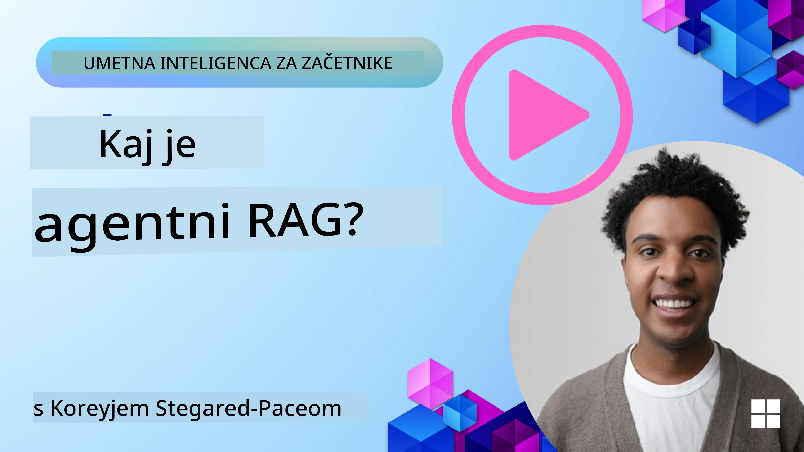
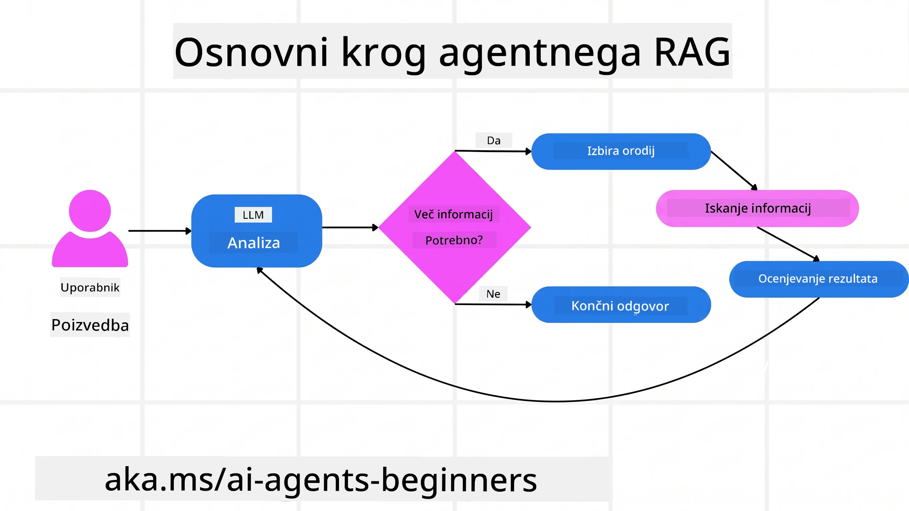
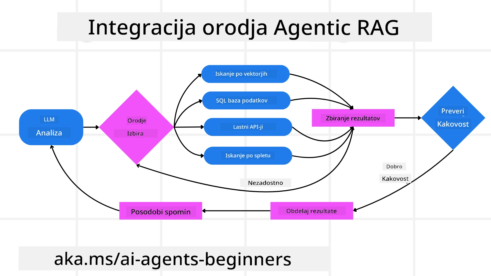
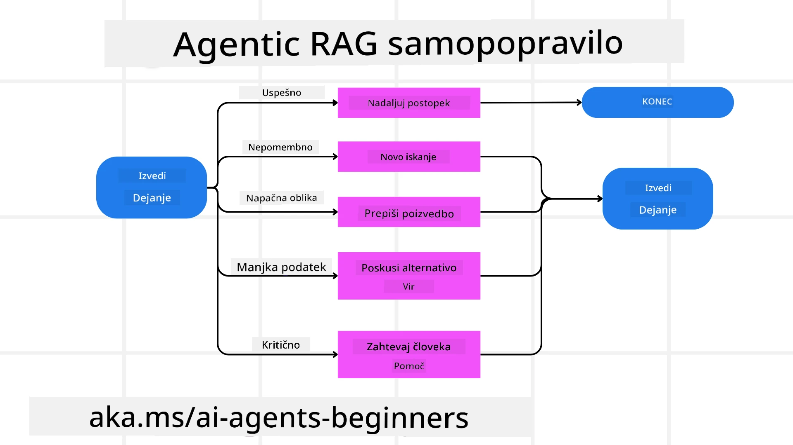
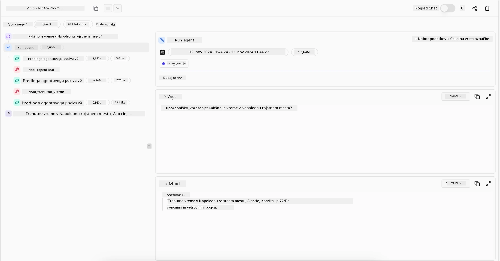

> _(Kliknite na sliko zgoraj za ogled videa tega dela)_

# Agentic RAG

Ta lekcija ponuja celovit pregled Agentic Retrieval-Augmented Generation (Agentic RAG), novega AI paradigme, kjer veliki jezikovni modeli (LLM) samostojno načrtujejo naslednje korake, medtem ko pridobivajo informacije iz zunanjih virov. Za razliko od statičnih vzorcev pridobivanja in nato branja, Agentic RAG vključuje iterativne klice na LLM, prekinjene z orodji ali klici funkcij in strukturiranimi izhodi. Sistem ocenjuje rezultate, izboljšuje poizvedbe, po potrebi kliče dodatna orodja in nadaljuje ta cikel, dokler ne doseže zadovoljive rešitve.

## Uvod

Ta lekcija bo obravnavala

- **Razumevanje Agentic RAG:** Spoznajte novo paradigmo v AI, kjer veliki jezikovni modeli (LLM) samostojno načrtujejo naslednje korake, medtem ko pridobivajo informacije iz zunanjih podatkovnih virov.
- **Razumevanje iterativnega načina maker-checker:** Razumite zanko iterativnih klicev LLM, prekinjenih z orodji ali klici funkcij in strukturiranimi izhodi, namenjenimi izboljšanju pravilnosti in obravnavi napačno oblikovanih poizvedb.
- **Raziščite praktične primere uporabe:** Prepoznajte primere, kjer Agentic RAG izstopa, kot so okolja s poudarkom na pravilnosti, zapletene baze podatkov in razširjeni poteki dela.

## Cilji učenja

Po zaključku te lekcije boste znali/razumeli:

- **Razumevanje Agentic RAG:** Spoznajte novo paradigmo v AI, kjer veliki jezikovni modeli (LLM) samostojno načrtujejo naslednje korake, medtem ko pridobivajo informacije iz zunanjih podatkovnih virov.
- **Iterativni način maker-checker:** Razumite koncept zanke iterativnih klicev LLM, prekinjenih z orodji ali klici funkcij in strukturiranimi izhodi, namenjenih izboljšanju pravilnosti in obravnavi napačno oblikovanih poizvedb.
- **Lastništvo procesa sklepanja:** Razumite zmožnost sistema, da prevzame lastništvo svojega procesa sklepanja, sprejema odločitve o pristopu k problemom brez odvisnosti od vnaprej določenih poti.
- **Potek dela:** Razumite, kako agentni model samostojno odloča o pridobivanju poročil o tržnih trendih, identifikaciji podatkov konkurentov, korelaciji notranjih prodajnih metrik, sintezi ugotovitev in vrednotenju strategije.
- **Iterativne zanke, integracija orodij in pomnenje:** Spoznajte sistemski vzorec interakcije v zanki, ki ohranja stanje in pomnjenje čez korake, da se izogiba ponavljajočim se zankam in sprejema informirane odločitve.
- **Obravnava načinov napak in samopopravljanje:** Raziščite robustne mehanizme samopopravka sistema, vključno z iteracijami in ponovnim poizvedovanjem, uporabo diagnostičnih orodij in zanašanjem na človeški nadzor.
- **Meje avtonomije:** Razumite omejitve Agentic RAG, s poudarkom na avtonomiji, specifični za domeno, odvisnosti od infrastrukture in spoštovanju varnostnih omejitev.
- **Praktični primeri uporabe in vrednost:** Prepoznajte primere, kjer Agentic RAG izstopa, kot so okolja s poudarkom na pravilnosti, zapletene baze podatkov in razširjeni poteki dela.
- **Upravljanje, preglednost in zaupanje:** Spoznajte pomen upravljanja in preglednosti, vključno z razložljivim sklepanjem, nadzorom pristranosti in človeškim nadzorom.

## Kaj je Agentic RAG?

Agentic Retrieval-Augmented Generation (Agentic RAG) je nova AI paradigma, kjer veliki jezikovni modeli (LLMs) samostojno načrtujejo svoje naslednje korake, medtem ko pridobivajo informacije iz zunanjih virov. Za razliko od statičnih vzorcev pridobivanja in nato branja, Agentic RAG vključuje iterativne klice na LLM, prekinitve z orodji ali funkcijami in strukturirane izhode. Sistem ocenjuje rezultate, izboljšuje poizvedbe, po potrebi kliče dodatna orodja in nadaljuje ta cikel, dokler ne doseže zadovoljive rešitve. Ta iterativni "maker-checker" način izboljšuje pravilnost, obravnava napačno oblikovane poizvedbe in zagotavlja visokokakovostne rezultate.

Sistem aktivno prevzema lastništvo svojega procesa sklepanja, prepisuje neuspešne poizvedbe, izbira različne metode pridobivanja informacij in integrira več orodij — kot na primer vektorsko iskanje v Azure AI Search, SQL baze podatkov ali prilagojene API-je — preden zaključi svoj odgovor. Ključna lastnost agentnega sistema je njegova zmožnost, da prevzame lastništvo nad svojim procesom sklepanja. Tradicionalne implementacije RAG se zanašajo na vnaprej določene poti, medtem ko agentni sistem samostojno določi zaporedje korakov na podlagi kakovosti najdenih informacij.

## Definicija Agentic Retrieval-Augmented Generation (Agentic RAG)

Agentic Retrieval-Augmented Generation (Agentic RAG) je nova paradigma v razvoju AI, kjer LLM ne le pridobivajo informacije iz zunanjih podatkovnih virov, temveč tudi samostojno načrtujejo svoje naslednje korake. Za razliko od statičnih vzorcev pridobivanja in nato branja ali skrbno načrtovanih zaporedij pozivov, Agentic RAG vključuje zanko iterativnih klicev LLM, prekinjenih z orodji ali klici funkcij in strukturiranimi izhodi. Vsakič sistem ocenjuje pridobljene rezultate, odloči, ali bo izboljšal poizvedbe, po potrebi kliče dodatna orodja in nadaljuje ta cikel, dokler ne doseže zadovoljive rešitve.

Ta iterativni "maker-checker" način delovanja je zasnovan za izboljšanje pravilnosti, obravnavo napačno oblikovanih poizvedb do strukturiranih baz podatkov (npr. NL2SQL) in zagotavljanje uravnoteženih, visokokakovostnih rezultatov. Namesto da bi se zanašal zgolj na skrbno načrtovane verige pozivov, sistem aktivno prevzema lastništvo nad svojim procesom sklepanja. Lahko prepiše neuspešne poizvedbe, izbere različne metode pridobivanja informacij in integrira več orodij — kot so vektorsko iskanje v Azure AI Search, SQL baze podatkov ali prilagojeni API-ji — preden zaključi svoj odgovor. Tako ni potrebe po prekompleksnih orkestracijskih okvirjih. Namesto tega lahko razmeroma enostavna zanka "klic LLM → uporaba orodja → klic LLM → ..." prinese sofisticirane in dobro utemeljene izhode.

## Lastništvo procesa sklepanja

Ključna lastnost, ki naredi sistem "agenten", je njegova sposobnost, da prevzame lastništvo svojega procesa sklepanja. Tradicionalne implementacije RAG pogosto temeljijo na tem, da ljudje vnaprej določijo pot modelu: verigo misli, ki opisuje, kaj pridobiti in kdaj.
Toda ko je sistem resnično agenten, notranje odloča, kako pristopiti k problemu. Ni zgolj izvrševanje skripte; samostojno določa zaporedje korakov na podlagi kakovosti najdenih informacij.
Na primer, če je vljudno prosjen, naj ustvari strategijo lansiranja izdelka, se ne zanaša zgolj na poziv, ki podrobno opisuje celoten raziskovalni in odločanje potek dela. Namesto tega agentni model samostojno odloči, da:

1. Pridobi trenutna poročila o tržnih trendih z uporabo Bing Web Grounding
2. Identificira ustrezne podatke o konkurentih z uporabo Azure AI Search.
3. Korelira zgodovinske notranje prodajne metrike z uporabo Azure SQL Database.
4. Sintezo ugotovitev v kohezivno strategijo, orkestrirano preko Azure OpenAI Service.
5. Ocenjuje strategijo glede vrzeli ali nedoslednosti, po potrebi sproži nov krog pridobivanja podatkov.
Vsi ti koraki — izboljševanje poizvedb, izbira virov, iteracija dokler ni "zadovoljen" z odgovorom — so odločitve modela, ne vnaprej narejene s strani človeka.

## Iterativne zanke, integracija orodij in pomnjenje

Agentni sistem temelji na vzorcu interakcije znotraj zanke:

- **Začetni klic:** Cilj uporabnika (tudi poziv) je predložen LLM.
- **Klic orodja:** Če model zazna manjkajoče informacije ali nejasna navodila, izbere orodje ali metodo pridobivanja — kot je poizvedba v vektorski bazi podatkov (npr. Azure AI Search Hybrid iskanje po zasebnih podatkih) ali strukturiran klic SQL — za zbiranje več konteksta.
- **Ocenjevanje in izboljšanje:** Po pregledu prejetih podatkov model odloči, ali so informacije zadostne. Če ne, izboljša poizvedbo, poskusi drugačno orodje ali prilagodi svoj pristop.
- **Ponavljanje dokler ni zadovoljen:** Ta cikel se nadaljuje, dokler model ne oceni, da ima dovolj jasnosti in dokazov za podajo končnega, dobro argumentiranega odgovora.
- **Pomnjenje in stanje:** Ker sistem ohranja stanje in pomnjenje čez korake, se lahko spomni prejšnjih poskusov in njihovih rezultatov, izogiba se ponavljajočim zankam in sprejema bolj informirane odločitve med napredovanjem.

Sčasoma to ustvarja občutek razvijajočega se razumevanja, ki modelu omogoča navigacijo po zapletenih, večstopenjskih nalogah brez potrebe po stalni človeški intervenciji ali preoblikovanju poziva.

## Obravnava načinov napak in samopopravilo

Avtonomija Agentic RAG vključuje tudi robustne mehanizme samopopravka. Ko sistem naleti na slepe pečine — kot so pridobivanje nepomembnih dokumentov ali nalet na napačno oblikovane poizvedbe — lahko:

- **Iterira in ponovno poizveduje:** Namesto da vrača nizkocenovne odgovore, model poskuša nove strategije iskanja, prepisuje baze podatkov poizvedbe ali pregleduje alternativne podatkovne nize.
- **Uporablja diagnostična orodja:** Sistem lahko kliče dodatne funkcije, namenjene pomaga pri odpravljanju napak v sklepanju ali potrjuje pravilnost pridobljenih podatkov. Orodja, kot je Azure AI Tracing, bodo pomembna za omogočanje robustne opazljivosti in nadzora.
- **Zanašanje na človeški nadzor:** Pri visokorizičnih ali večkrat neuspešnih primerih lahko model označi negotovost in zahteva človeško usmerjanje. Ko človek posreduje korektivne povratne informacije, jih model lahko vključi za nadaljnje izboljšave.

Ta iterativni in dinamični pristop omogoča modelu, da se nenehno izboljšuje, zagotavlja, da ni le enkratni sistem ampak se uči iz svojih napak med posamezno sejo.

## Meje agentnosti

Kljub svoji avtonomiji znotraj naloge Agentic RAG ni enak kot Splošna umetna inteligenca (Artificial General Intelligence). Njegove "agentne" zmogljivosti so omejene na orodja, podatkovne vire in politike, ki jih določijo razvijalci. Ne more si izumiti lastnih orodij ali stopiti izven domen, ki so bile določene. Namesto tega odlično orkestrira vire, ki so na voljo.
Ključne razlike od bolj naprednih oblik AI so:

1. **Avtonomija specifična za domeno:** Agentic RAG sistemi so osredotočeni na doseganje uporabniško določenih ciljev znotraj znane domene, z uporabo strategij, kot so prepisovanje poizvedb ali izbira orodij za izboljšanje rezultatov.
2. **Odvisnost od infrastrukture:** Zmožnosti sistema so vezane na orodja in podatke, integrirane s strani razvijalcev. Ne more preseči teh meja brez človeške intervencije.
3. **Spoštovanje varnostnih omejitev:** Etična načela, pravila skladnosti in poslovne politike ostajajo zelo pomembni. Svoboda agenta je vedno omejena s varnostnimi ukrepi in nadzornimi mehanizmi (upamo?).

## Praktični primeri uporabe in vrednost

Agentic RAG izstopa v situacijah, ki zahtevajo iterativno izboljševanje in natančnost:

1. **Okolja s poudarkom na pravilnosti:** Pri preverjanju skladnosti, regulativni analizi ali pravnih raziskavah lahko agentni model večkrat preveri dejstva, se posvetuje z več viri in prepiše poizvedbe, dokler ne ustvari temeljito preverjenega odgovora.
2. **Zapletene baze podatkov:** Pri delu s strukturiranimi podatki, kjer poizvedbe pogosto ne uspejo ali jih je treba prilagoditi, lahko sistem samostojno izboljšuje poizvedbe z uporabo Azure SQL ali Microsoft Fabric OneLake ter zagotavlja, da končno pridobivanje ustreza namenu uporabnika.
3. **Razširjeni poteki dela:** Daljše seje se lahko razvijajo, ko se pojavijo nove informacije. Agentic RAG lahko nenehno vključuje nove podatke, spreminja strategije glede na nova saznanja o problematiki.

## Upravljanje, preglednost in zaupanje

Ker sistemi postajajo bolj avtonomni v svojem sklepanju, sta upravljanje in preglednost ključna:

- **Razložljivo sklepanja:** Model lahko poda revizijsko sled poizvedb, ki jih je izvedel, virov, ki jih je pregledal, in korakov sklepanja, ki jih je naredil za dosego zaključka. Orodja kot Azure AI Content Safety in Azure AI Tracing / GenAIOps lahko pomagajo ohranjati preglednost in zmanjševati tveganja.
- **Nadzor pristranosti in uravnoteženo pridobivanje:** Razvijalci lahko prilagajajo strategije pridobivanja, da zagotovijo upoštevanje uravnoteženih in reprezentativnih virov podatkov, ter redno izvajajo revizije izhodov, da zaznajo pristranost ali izkrivljene vzorce s pomočjo prilagojenih modelov za napredne organizacije za podatkovno znanost, ki uporabljajo Azure Machine Learning.
- **Človeški nadzor in skladnost:** Pri občutljivih nalogah je pregled človeka še vedno bistven. Agentic RAG ne nadomešča človeškega presojevanja v odločanjih visokega tveganja — ga dopolnjuje z bolj temeljito preverjenimi možnostmi.

Imeti orodja, ki zagotavljajo jasen zapis dejanj, je ključno. Brez njih je odpravljanje napak v večstopenjskem procesu zelo zahtevno. Oglejte si naslednji primer iz Literal AI (podjetja za Chainlit) za agentno izvedbo:

## Zaključek

Agentic RAG predstavlja naravni razvoj v načinu, kako AI sistemi obravnavajo zapletene in podatkovno intenzivne naloge. Z uporabo vzorca interakcije v zanki, samostojno izbiro orodij in izboljševanjem poizvedb, dokler ne doseže visokokakovostnega rezultata, sistem presega statično sledenje pozivom v bolj prilagodljiv in kontekstno zavedajoč se odločevalec. Čeprav je še vedno omejen z infrastrukturo in etičnimi smernicami, ki jih določajo ljudje, te agentne sposobnosti omogočajo bogatejše, bolj dinamične in na koncu bolj uporabne AI interakcije za podjetja in končne uporabnike.

### Imate več vprašanj o Agentic RAG?

Pridružite se [Microsoft Foundry Discord](https://discord.com/invite/ATgtXmAS5D) za druženje z drugimi učenci, udeležbo na urah pisarne in odgovore na vaša vprašanja o AI agentih.

## Dodatni viri

- <a href="https://learn.microsoft.com/training/modules/use-own-data-azure-openai" target="_blank">Implementacija Retrieval Augmented Generation (RAG) z Azure OpenAI Service: Naučite se uporabljati lastne podatke z Azure OpenAI Service. Ta Microsoft Learn modul nudi celovit vodič za implementacijo RAG</a>
- <a href="https://learn.microsoft.com/azure/ai-studio/concepts/evaluation-approach-gen-ai" target="_blank">Ocena generativnih AI aplikacij z Microsoft Foundry: Ta članek zajema oceno in primerjavo modelov na javno dostopnih podatkovnih nizih, vključno z agentnimi AI aplikacijami in RAG arhitekturami</a>
- <a href="https://weaviate.io/blog/what-is-agentic-rag" target="_blank">Kaj je Agentic RAG | Weaviate</a>
- <a href="https://ragaboutit.com/agentic-rag-a-complete-guide-to-agent-based-retrieval-augmented-generation/" target="_blank">Agentic RAG: Celovit vodič za agentno Retrieval Augmented Generation – Novice iz generacije RAG</a>
- <a href="https://huggingface.co/learn/cookbook/agent_rag" target="_blank">Agentic RAG: pospešite svoj RAG z reformulacijo poizvedb in samoprethajanjem! Hugging Face odprtokodna kuharska knjiga za AI</a>
- <a href="https://youtu.be/aQ4yQXeB1Ss?si=2HUqBzHoeB5tR04U" target="_blank">Dodajanje agentnih plasti k RAG</a>
- <a href="https://www.youtube.com/watch?v=zeAyuLc_f3Q&t=244s" target="_blank">Prihodnost pomočnikov za znanje: Jerry Liu</a>
- <a href="https://www.youtube.com/watch?v=AOSjiXP1jmQ" target="_blank">Kako zgraditi agentne RAG sisteme</a>
- <a href="https://ignite.microsoft.com/sessions/BRK102?source=sessions" target="_blank">Uporaba Microsoft Foundry Agent Service za razširjanje vaših AI agentov</a>

### Akademski članki

- <a href="https://arxiv.org/abs/2303.17651" target="_blank">2303.17651 Self-Refine: Iterativna izboljšava s samopovratno informacijo</a>
- <a href="https://arxiv.org/abs/2303.11366" target="_blank">2303.11366 Reflexion: Jezikovni agenti z verbalnim učenjem s krepitvijo</a>
- <a href="https://arxiv.org/abs/2305.11738" target="_blank">2305.11738 CRITIC: Veliki jezikovni modeli se lahko samopopravijo z interaktivnim orodjem za kritiko</a>
- <a href="https://arxiv.org/abs/2501.09136" target="_blank">2501.09136 Agentic Retrieval-Augmented Generation: Pregled agentnega RAG</a>

## Prejšnja lekcija

[Tool Use Design Pattern](../04-tool-use/README.md)

## Naslednja lekcija

[Gradnja zaupanja vrednih AI agentov](../06-building-trustworthy-agents/README.md)

---

<!-- CO-OP TRANSLATOR DISCLAIMER START -->
**Omejitev odgovornosti**:
Ta dokument je bil preveden z uporabo AI prevajalske storitve [Co-op Translator](https://github.com/Azure/co-op-translator). Čeprav si prizadevamo za natančnost, vas prosimo, da upoštevate, da avtomatizirani prevodi lahko vsebujejo napake ali netočnosti. Izvirni dokument v njegovem izvirnem jeziku je treba obravnavati kot avtoritativni vir. Za kritične informacije je priporočljiv strokovni človeški prevod. Ne odgovarjamo za morebitna nesporazume ali napačne interpretacije, ki izhajajo iz uporabe tega prevoda.
<!-- CO-OP TRANSLATOR DISCLAIMER END -->