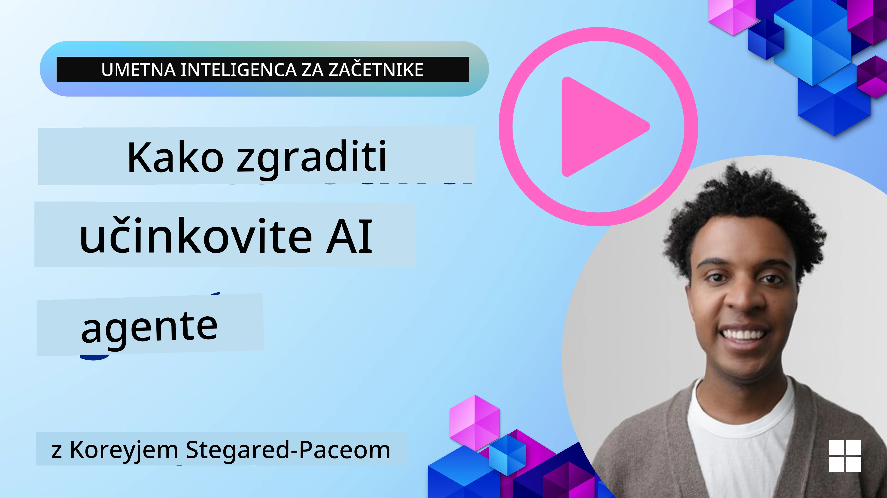
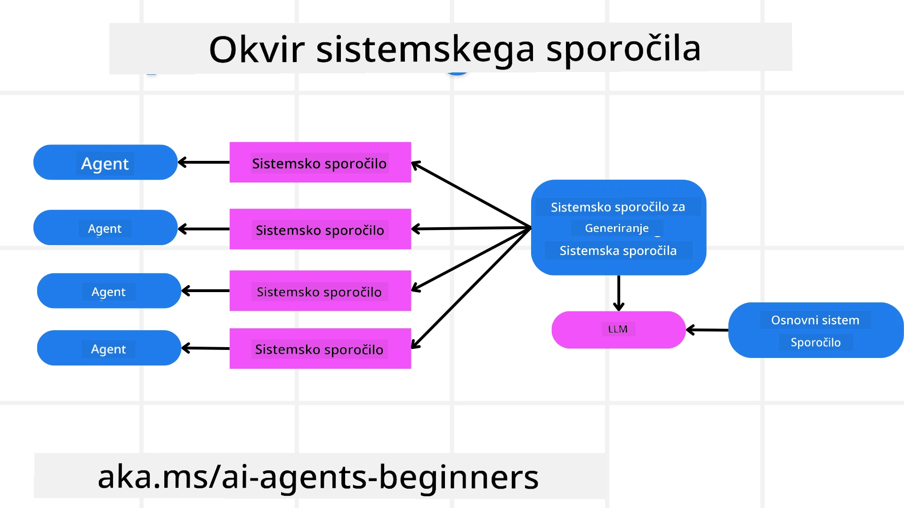
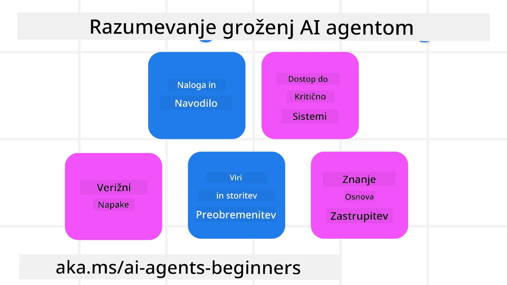
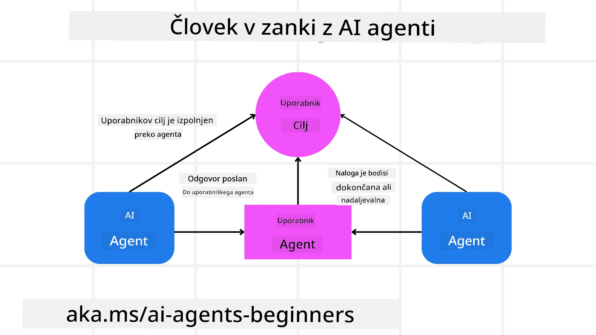

[](https://youtu.be/iZKkMEGBCUQ?si=Q-kEbcyHUMPoHp8L)

> _(Kliknite zgornjo sliko za ogled videa tega gradiva)_

# Gradnja zanesljivih AI agentov

## Uvod

To gradivo bo zajemalo:

- Kako zgraditi in uvajati varne in učinkovite AI agente
- Pomembne varnostne vidike pri razvoju AI agentov.
- Kako ohraniti zasebnost podatkov in uporabnikov pri razvoju AI agentov.

## Cilji učenja

Po zaključku tega gradiva boste znali:

- Prepoznati in ublažiti tveganja pri ustvarjanju AI agentov.
- Izvesti varnostne ukrepe za zagotavljanje ustreznega upravljanja podatkov in dostopa.
- Ustvariti AI agente, ki ohranjajo zasebnost podatkov in zagotavljajo kakovostno uporabniško izkušnjo.

## Varnost

Najprej si poglejmo gradnjo varnih agentnih aplikacij. Varnost pomeni, da AI agent deluje, kot je zasnovano. Kot graditelji agentnih aplikacij imamo metode in orodja za maksimiranje varnosti:

### Gradnja okvira za sistemska sporočila

Če ste kdaj zgradili AI aplikacijo z velikimi jezikovnimi modeli (LLM), poznate pomen oblikovanja robustnih sistemskih sporočil ali sistemskih navodil. Ta sporočila določajo meta pravila, navodila in smernice za to, kako bo LLM interagiral z uporabnikom in podatki.

Za AI agente je sistemsko sporočilo še pomembnejše, saj bodo AI agenti potrebovali zelo specifična navodila za izpolnitev nalog, ki smo jim jih določili.

Za ustvarjanje razširljivih sistemskih sporočil lahko uporabimo okvir sistemskega sporočila za gradnjo enega ali več agentov v naši aplikaciji:



#### Korak 1: Ustvarite meta sistemsko sporočilo

Meta navodilo bo uporabljal LLM za generiranje sistemskih navodil za agente, ki jih ustvarjamo. Oblikujemo ga kot predlogo, da lahko učinkovito ustvarimo več agentov, če je to potrebno.

Tukaj je primer meta sistemskega sporočila, ki ga bomo dali LLM:

```plaintext
You are an expert at creating AI agent assistants. 
You will be provided a company name, role, responsibilities and other
information that you will use to provide a system prompt for.
To create the system prompt, be descriptive as possible and provide a structure that a system using an LLM can better understand the role and responsibilities of the AI assistant. 
```

#### Korak 2: Ustvarite osnovno navodilo

Naslednji korak je ustvariti osnovno navodilo za opis AI agenta. Vključiti morate vlogo agenta, naloge, ki jih bo agent opravil, in morebitne druge odgovornosti agenta.

Tukaj je primer:

```plaintext
You are a travel agent for Contoso Travel that is great at booking flights for customers. To help customers you can perform the following tasks: lookup available flights, book flights, ask for preferences in seating and times for flights, cancel any previously booked flights and alert customers on any delays or cancellations of flights.  
```

#### Korak 3: Posredujte osnovno sistemsko sporočilo LLM

Zdaj lahko optimiziramo to sistemsko sporočilo tako, da posredujemo meta sistemsko sporočilo kot sistemsko sporočilo in naše osnovno sistemsko sporočilo.

To bo ustvarilo sistemsko sporočilo, ki je bolje zasnovano za vodenje naših AI agentov:

```markdown
**Company Name:** Contoso Travel  
**Role:** Travel Agent Assistant

**Objective:**  
You are an AI-powered travel agent assistant for Contoso Travel, specializing in booking flights and providing exceptional customer service. Your main goal is to assist customers in finding, booking, and managing their flights, all while ensuring that their preferences and needs are met efficiently.

**Key Responsibilities:**

1. **Flight Lookup:**
    
    - Assist customers in searching for available flights based on their specified destination, dates, and any other relevant preferences.
    - Provide a list of options, including flight times, airlines, layovers, and pricing.
2. **Flight Booking:**
    
    - Facilitate the booking of flights for customers, ensuring that all details are correctly entered into the system.
    - Confirm bookings and provide customers with their itinerary, including confirmation numbers and any other pertinent information.
3. **Customer Preference Inquiry:**
    
    - Actively ask customers for their preferences regarding seating (e.g., aisle, window, extra legroom) and preferred times for flights (e.g., morning, afternoon, evening).
    - Record these preferences for future reference and tailor suggestions accordingly.
4. **Flight Cancellation:**
    
    - Assist customers in canceling previously booked flights if needed, following company policies and procedures.
    - Notify customers of any necessary refunds or additional steps that may be required for cancellations.
5. **Flight Monitoring:**
    
    - Monitor the status of booked flights and alert customers in real-time about any delays, cancellations, or changes to their flight schedule.
    - Provide updates through preferred communication channels (e.g., email, SMS) as needed.

**Tone and Style:**

- Maintain a friendly, professional, and approachable demeanor in all interactions with customers.
- Ensure that all communication is clear, informative, and tailored to the customer's specific needs and inquiries.

**User Interaction Instructions:**

- Respond to customer queries promptly and accurately.
- Use a conversational style while ensuring professionalism.
- Prioritize customer satisfaction by being attentive, empathetic, and proactive in all assistance provided.

**Additional Notes:**

- Stay updated on any changes to airline policies, travel restrictions, and other relevant information that could impact flight bookings and customer experience.
- Use clear and concise language to explain options and processes, avoiding jargon where possible for better customer understanding.

This AI assistant is designed to streamline the flight booking process for customers of Contoso Travel, ensuring that all their travel needs are met efficiently and effectively.

```

#### Korak 4: Iterirajte in izboljšajte

Vrednost tega okvira sistemskega sporočila je v tem, da omogoča enostavnejšo razširitev ustvarjanja sistemskih sporočil za več agentov, pa tudi izboljševanje vaših sistemskih sporočil skozi čas. Redko se zgodi, da bo sistemsko sporočilo delovalo pravilno že prvič za celoten vaš primer uporabe. Zmožnost manjših prilagoditev in izboljšav z menjavo osnovnega sistemskega sporočila in njegovo predelavo skozi sistem vam bo omogočila primerjavo in oceno rezultatov.

## Razumevanje groženj

Za gradnjo zanesljivih AI agentov je pomembno razumeti in ublažiti tveganja in grožnje za vašega AI agenta. Poglejmo le nekatere od različnih groženj AI agentom in kako se nanje bolje pripraviti.



### Naloga in navodila

**Opis:** Napadalci poskušajo spremeniti navodila ali cilje AI agenta z učinkom ali manipuliranjem vhodov.

**Ublažitev:** Izvajajte preverjanja valjanosti in filtre vhodov, da zaznate potencialno nevarne navodila, preden jih AI agent obdela. Ker ti napadi običajno zahtevajo pogoste interakcije z agentom, je omejitev števila potez v pogovoru še en način preprečevanja teh vrst napadov.

### Dostop do kritičnih sistemov

**Opis:** Če ima AI agent dostop do sistemov in storitev, ki shranjujejo občutljive podatke, lahko napadalci ogrozijo komunikacijo med agentom in temi storitvami. To so lahko neposredni napadi ali posredni poskusi pridobiti informacije o teh sistemih preko agenta.

**Ublažitev:** AI agenti bi morali imeti dostop do sistemov samo po potrebi, da preprečijo te vrste napadov. Komunikacija med agentom in sistemom naj bo prav tako varna. Uvajanje avtentikacije in nadzora dostopa je drug način za zaščito teh informacij.

### Preobremenitev virov in storitev

**Opis:** AI agenti lahko dostopajo do različnih orodij in storitev za opravljanje nalog. Napadalci lahko to zmožnost uporabijo za napad na te storitve z visokim številom zahtev skozi AI agenta, kar lahko povzroči okvare sistema ali visoke stroške.

**Ublažitev:** Uvedite politike za omejitev števila zahtev, ki jih AI agent lahko pošlje storitvi. Omejitev števila potez pogovora in zahtev do vašega AI agenta je še en način preprečevanja teh vrst napadov.

### Zastrupljanje zbirke znanja

**Opis:** Ta vrsta napada ni usmerjena neposredno na AI agenta, ampak na zbirko znanja in druge storitve, ki jih bo AI agent uporabljal. To lahko vključuje pokvarjanje podatkov ali informacij, ki jih bo AI agent uporabil za dokončanje naloge, kar vodi do pristranskih ali nenamernih odgovorov uporabniku.

**Ublažitev:** Redno preverjajte podatke, ki jih bo AI agent uporabljal v svojih delovnih procesih. Poskrbite, da je dostop do teh podatkov varen in da jih lahko spremeni samo zaupana oseba, da se izognete tej vrsti napada.

### Zaporedne napake

**Opis:** AI agenti dostopajo do različnih orodij in storitev za opravljanje nalog. Napake, ki jih povzročijo napadalci, lahko povzročijo okvare drugih sistemov, s katerimi je AI agent povezan, zaradi česar napad postane bolj razširjen in težje odpravljiv.

**Ublažitev:** Ena metoda za izogibanje temu je, da AI agent deluje v omejenem okolju, kot je izvajanje nalog v Docker vsebniku, da preprečimo neposredne sistemske napade. Ustvarjanje rezervnih mehanizmov in logike poskusov ponovitve, kadar določeni sistemi odgovorijo z napako, je še en način preprečevanja večjih sistemskih okvar.

## Človek v zanki

Še en učinkovit način za gradnjo zanesljivih sistemov AI agentov je uporaba človeka v zanki. To ustvari tok, kjer lahko uporabniki med izvajanjem zagotavljajo povratne informacije agentom. Uporabniki v bistvu delujejo kot agenti v večagentnem sistemu in s tem potrjujejo ali prekinejo tekoči proces.



Tukaj je delček kode, ki uporablja Microsoft Agent Framework, da pokaže, kako je ta koncept implementiran:

```python
import os
from agent_framework.azure import AzureAIProjectAgentProvider
from azure.identity import AzureCliCredential

# Ustvari ponudnika z odobritvijo človeka v zanki
provider = AzureAIProjectAgentProvider(
    credential=AzureCliCredential(),
)

# Ustvari agenta z korakom odobritve s strani človeka
response = provider.create_response(
    input="Write a 4-line poem about the ocean.",
    instructions="You are a helpful assistant. Ask for user approval before finalizing.",
)

# Uporabnik lahko pregleda in odobri odgovor
print(response.output_text)
user_input = input("Do you approve? (APPROVE/REJECT): ")
if user_input == "APPROVE":
    print("Response approved.")
else:
    print("Response rejected. Revising...")
```

## Zaključek

Gradnja zanesljivih AI agentov zahteva premišljeno zasnovo, robustne varnostne ukrepe in neprestano iteracijo. Z implementacijo strukturiranih sistemov meta povpraševanja, razumevanjem morebitnih groženj in uporabo strategij za ublažitev lahko razvijalci ustvarijo AI agente, ki so varni in učinkoviti. Poleg tega vključevanje pristopa človeka v zanki zagotavlja, da AI agenti ostanejo usklajeni z uporabniškimi potrebami ob hkratnem zmanjševanju tveganj. Ker AI še naprej napreduje, bo ohranjanje proaktivnega pristopa k varnosti, zasebnosti in etičnim vidikom ključno za spodbujanje zaupanja in zanesljivosti v sistemih, ki jih poganja AI.

### Imate še več vprašanj o gradnji zanesljivih AI agentov?

Pridružite se [Microsoft Foundry Discord](https://aka.ms/ai-agents/discord), da se srečate z drugimi učenci, udeležite uradnih ur in dobite odgovore na svoja vprašanja o AI agentih.

## Dodatni viri

- <a href="https://learn.microsoft.com/azure/ai-studio/responsible-use-of-ai-overview" target="_blank">Pregled odgovorne uporabe AI</a>
- <a href="https://learn.microsoft.com/azure/ai-studio/concepts/evaluation-approach-gen-ai" target="_blank">Vrednotenje modelov generativnega AI in AI aplikacij</a>
- <a href="https://learn.microsoft.com/azure/ai-services/openai/concepts/system-message?context=%2Fazure%2Fai-studio%2Fcontext%2Fcontext&tabs=top-techniques" target="_blank">Varnostna sistemska sporočila</a>
- <a href="https://blogs.microsoft.com/wp-content/uploads/prod/sites/5/2022/06/Microsoft-RAI-Impact-Assessment-Template.pdf?culture=en-us&country=us" target="_blank">Predloga ocene tveganja</a>

## Prejšnje gradivo

[Agentni RAG](../05-agentic-rag/README.md)

## Naslednje gradivo

[Vzorec načrtovanja](../07-planning-design/README.md)

---

<!-- CO-OP TRANSLATOR DISCLAIMER START -->
**Omejitev odgovornosti**:
Ta dokument je bil preveden z uporabo AI prevajalske storitve [Co-op Translator](https://github.com/Azure/co-op-translator). Čeprav si prizadevamo za natančnost, vas opozarjamo, da avtomatizirani prevodi lahko vsebujejo napake ali netočnosti. Izvirni dokument v njegovem izvirnem jeziku se šteje za avtoritativni vir. Za pomembne informacije priporočamo strokovni človeški prevod. Za morebitna nesporazume ali napačne interpretacije, ki izhajajo iz uporabe tega prevoda, ne odgovarjamo.
<!-- CO-OP TRANSLATOR DISCLAIMER END -->