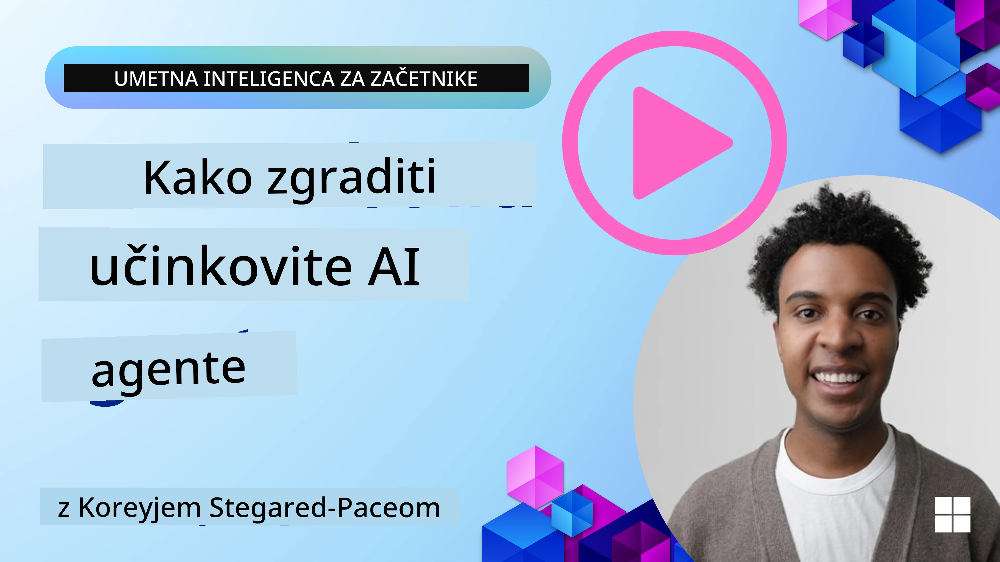
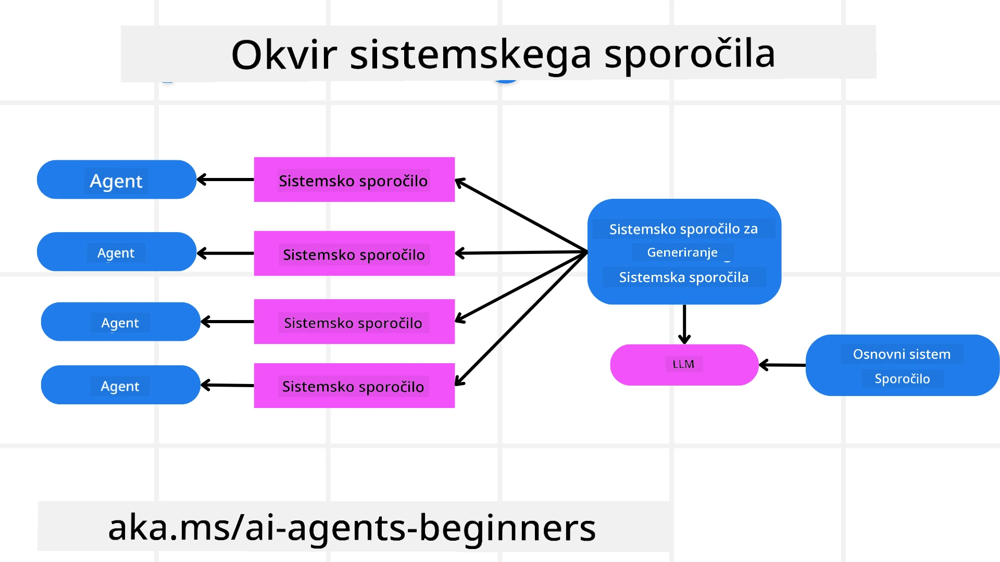
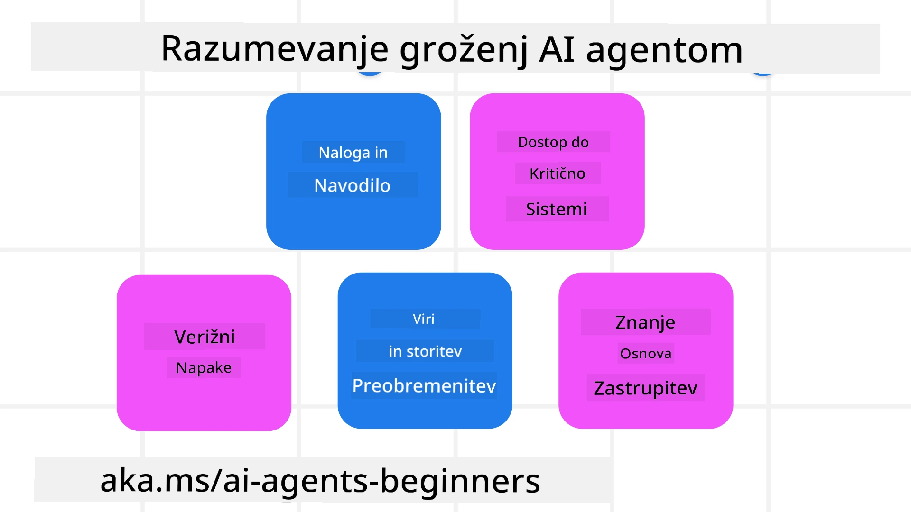
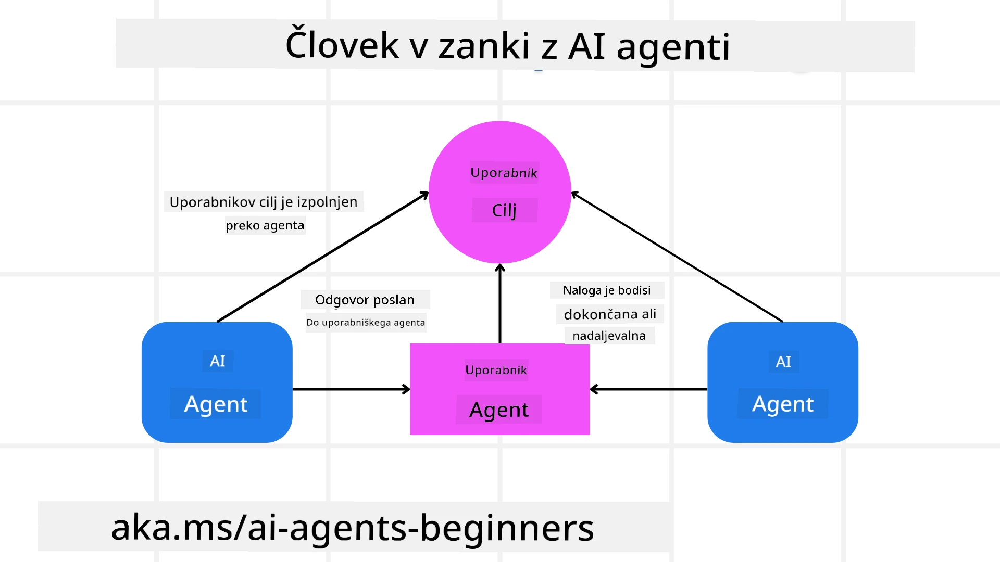

[](https://youtu.be/iZKkMEGBCUQ?si=Q-kEbcyHUMPoHp8L)

> _(Kliknite zgornjo sliko, da si ogledate video tega gradiva)_

# Gradnja zanesljivih AI agentov

## Uvod

To gradivo bo zajemalo:

- Kako zgraditi in uvajati varne in učinkovite AI agente
- Pomembna varnostna razmišljanja pri razvoju AI agentov.
- Kako vzdrževati zasebnost podatkov in uporabnikov pri razvoju AI agentov.

## Cilji učenja

Po zaključku tega gradiva boste znali:

- Prepoznati in omiliti tveganja pri ustvarjanju AI agentov.
- Izvesti varnostne ukrepe za zagotovitev pravilnega upravljanja podatkov in dostopa.
- Ustvariti AI agente, ki vzdržujejo zasebnost podatkov in zagotavljajo kakovostno uporabniško izkušnjo.

## Varnost

Najprej si poglejmo, kako zgraditi varne agentne aplikacije. Varnost pomeni, da AI agent deluje tako, kot je zasnovano. Kot graditelji agentnih aplikacij imamo metode in orodja, da maksimiramo varnost:

### Gradnja ogrodja sistemskih sporočil

Če ste kdaj gradili AI aplikacijo z uporabo velikih jezikovnih modelov (LLM), poznate pomen oblikovanja robustnega sistemskega poziva ali sistemskega sporočila. Ti pozivi določajo meta pravila, navodila in smernice za interakcijo LLM z uporabnikom in podatki.

Za AI agente je sistemski poziv še pomembnejši, saj bodo AI agenti potrebovali zelo specifična navodila za opravljanje nalog, ki smo jih zanje zasnovali.

Za ustvarjanje razširljivih sistemskih pozivov lahko uporabimo ogrodje sistemskih sporočil za izgradnjo enega ali več agentov v naši aplikaciji:



#### Korak 1: Ustvarite meta sistemsko sporočilo

Meta poziv bo uporabil LLM za generiranje sistemskih pozivov za agente, ki jih ustvarimo. Oblikujemo ga kot predlogo, da lahko učinkovito ustvarjamo več agentov, če je potrebno.

Tukaj je primer meta sistemskega sporočila, ki bi ga dali LLM:

```plaintext
You are an expert at creating AI agent assistants. 
You will be provided a company name, role, responsibilities and other
information that you will use to provide a system prompt for.
To create the system prompt, be descriptive as possible and provide a structure that a system using an LLM can better understand the role and responsibilities of the AI assistant. 
```

#### Korak 2: Ustvarite osnovni poziv

Naslednji korak je ustvariti osnovni poziv za opis AI agenta. Vključiti morate vlogo agenta, naloge, ki jih bo agent opravljal, in druge odgovornosti agenta.

Tukaj je primer:

```plaintext
You are a travel agent for Contoso Travel that is great at booking flights for customers. To help customers you can perform the following tasks: lookup available flights, book flights, ask for preferences in seating and times for flights, cancel any previously booked flights and alert customers on any delays or cancellations of flights.  
```

#### Korak 3: Posredujte osnovno sistemsko sporočilo LLM

Sedaj lahko to sistemsko sporočilo optimiziramo tako, da kot sistemsko sporočilo podamo meta sistemsko sporočilo in naše osnovno sistemsko sporočilo.

To bo ustvarilo sistemsko sporočilo, ki je bolje zasnovano za usmerjanje naših AI agentov:

```markdown
**Company Name:** Contoso Travel  
**Role:** Travel Agent Assistant

**Objective:**  
You are an AI-powered travel agent assistant for Contoso Travel, specializing in booking flights and providing exceptional customer service. Your main goal is to assist customers in finding, booking, and managing their flights, all while ensuring that their preferences and needs are met efficiently.

**Key Responsibilities:**

1. **Flight Lookup:**
    
    - Assist customers in searching for available flights based on their specified destination, dates, and any other relevant preferences.
    - Provide a list of options, including flight times, airlines, layovers, and pricing.
2. **Flight Booking:**
    
    - Facilitate the booking of flights for customers, ensuring that all details are correctly entered into the system.
    - Confirm bookings and provide customers with their itinerary, including confirmation numbers and any other pertinent information.
3. **Customer Preference Inquiry:**
    
    - Actively ask customers for their preferences regarding seating (e.g., aisle, window, extra legroom) and preferred times for flights (e.g., morning, afternoon, evening).
    - Record these preferences for future reference and tailor suggestions accordingly.
4. **Flight Cancellation:**
    
    - Assist customers in canceling previously booked flights if needed, following company policies and procedures.
    - Notify customers of any necessary refunds or additional steps that may be required for cancellations.
5. **Flight Monitoring:**
    
    - Monitor the status of booked flights and alert customers in real-time about any delays, cancellations, or changes to their flight schedule.
    - Provide updates through preferred communication channels (e.g., email, SMS) as needed.

**Tone and Style:**

- Maintain a friendly, professional, and approachable demeanor in all interactions with customers.
- Ensure that all communication is clear, informative, and tailored to the customer's specific needs and inquiries.

**User Interaction Instructions:**

- Respond to customer queries promptly and accurately.
- Use a conversational style while ensuring professionalism.
- Prioritize customer satisfaction by being attentive, empathetic, and proactive in all assistance provided.

**Additional Notes:**

- Stay updated on any changes to airline policies, travel restrictions, and other relevant information that could impact flight bookings and customer experience.
- Use clear and concise language to explain options and processes, avoiding jargon where possible for better customer understanding.

This AI assistant is designed to streamline the flight booking process for customers of Contoso Travel, ensuring that all their travel needs are met efficiently and effectively.

```

#### Korak 4: Ponovite in izboljšajte

Vrednost tega ogrodja sistemskih sporočil je v tem, da lažje ustvarjamo sistemska sporočila za več agentov in izboljšujemo sistemska sporočila skozi čas. Redko imate sistemsko sporočilo, ki deluje prvič za vaš celoten primer uporabe. Zmožnost majhnih popravkov in izboljšav s spreminjanjem osnovnega sistemskega sporočila in izvajanjem skozi sistem vam omogoča primerjavo in ocenjevanje rezultatov.

## Razumevanje groženj

Za gradnjo zanesljivih AI agentov je pomembno razumeti in omiliti tveganja in grožnje za vaš AI agent. Poglejmo nekaj različnih groženj za AI agente in kako se lahko bolje načrtujete in pripravite nanje.



### Naloga in navodilo

**Opis:** Napadalci poskušajo spremeniti navodila ali cilje AI agenta preko pozivov ali manipulacije vhodov.

**Omilitev**: Izvajajte preverjanja veljavnosti in filtre vhodov, da zaznate potencialno nevarne pozive, preden jih obdela AI agent. Ker ti napadi običajno zahtevajo pogoste interakcije z agentom, je omejitev števila zavojev v pogovoru še en način preprečevanja tovrstnih napadov.

### Dostop do kritičnih sistemov

**Opis**: Če ima AI agent dostop do sistemov in storitev, ki hranijo občutljive podatke, lahko napadalci kompromitirajo komunikacijo med agentom in temi storitvami. To so lahko neposredni napadi ali posredni poskusi pridobitve informacij o sistemih preko agenta.

**Omilitev**: AI agenti naj imajo dostop do sistemov le po potrebi, da preprečimo tovrstne napade. Komunikacija med agentom in sistemom mora biti tudi varna. Izvedba avtentikacije in nadzora dostopa je še en način za zaščito teh informacij.

### Preobremenitev virov in storitev

**Opis:** AI agenti lahko dostopajo do različnih orodij in storitev za opravljanje nalog. Napadalci lahko to zmožnost uporabijo za napad na te storitve z velikim številom zahtev preko AI agenta, kar lahko povzroči odpoved sistema ali visoke stroške.

**Omilitev:** Uvedite politike za omejitev števila zahtev, ki jih AI agent lahko pošlje storitvi. Omejitev števila zavojev pogovora in zahtev do vašega AI agenta je še en način za preprečitev tovrstnih napadov.

### Zastrupljanje baze znanja

**Opis:** Ta vrsta napada ne cilja neposredno na AI agenta, ampak na bazo znanja in druge storitve, ki jih AI agent uporablja. To lahko vključuje kvarjenje podatkov ali informacij, ki jih AI agent uporablja za izvedbo naloge, kar vodi do pristranskih ali neželenih odgovorov uporabniku.

**Omilitev:** Redno preverjajte podatke, ki jih AI agent uporablja v svojih opravilih. Zagotovite, da je dostop do teh podatkov varen in da ga spreminjajo le zaupanja vredni posamezniki, da preprečite tovrstne napade.

### Kaskadne napake

**Opis:** AI agenti dostopajo do različnih orodij in storitev za opravljanje nalog. Napake, ki jih povzročijo napadalci, lahko povzročijo odpovedi drugih sistemov, s katerimi je AI agent povezan, zaradi česar postane napad bolj razširjen in težje odpravljen.

**Omilitev**: Ena metoda za preprečevanje tega je, da AI agent deluje v omejenem okolju, na primer izvaja naloge v Docker kontejnerju, da prepreči neposredne napade na sistem. Ustvarjanje mehanizmov za povrnitev in logike ponovnega poizkusa, ko določeni sistemi odgovorijo z napako, je še en način preprečevanja večjih odpovedi sistema.

## Človek v zanki

Še en učinkovit način za izgradnjo zanesljivih sistemov AI agentov je uporaba človeka v zanki. To ustvari tok, kjer lahko uporabniki med izvajanjem agentov podajo povratne informacije. Uporabniki v bistvu delujejo kot agenti v večagentnem sistemu in lahko odobrijo ali prekinejo tekoči proces.



Tukaj je odsek kode, ki uporablja Microsoft Agent Framework, da pokaže, kako je ta koncept implementiran:

```python
import os
from agent_framework.foundry import FoundryChatClient
from azure.identity import AzureCliCredential

# Ustvari ponudnika z odobritvijo človeka v zanki
provider = FoundryChatClient(
    project_endpoint=os.environ["AZURE_AI_PROJECT_ENDPOINT"],
    model=os.environ["AZURE_AI_MODEL_DEPLOYMENT_NAME"],
    credential=AzureCliCredential(),
)

# Ustvari agenta z korakom odobritve s strani človeka
response = provider.create_response(
    input="Write a 4-line poem about the ocean.",
    instructions="You are a helpful assistant. Ask for user approval before finalizing.",
)

# Uporabnik lahko pregleda in odobri odgovor
print(response.output_text)
user_input = input("Do you approve? (APPROVE/REJECT): ")
if user_input == "APPROVE":
    print("Response approved.")
else:
    print("Response rejected. Revising...")
```

## Zaključek

Gradnja zanesljivih AI agentov zahteva skrbno zasnovo, robustne varnostne ukrepe in neprestano ponavljanje. Z izvajanjem strukturiranih meta pozivnih sistemov, razumevanjem potencialnih groženj in uporabo strategij omilitve lahko razvijalci ustvarijo AI agente, ki so hkrati varni in učinkoviti. Poleg tega vključitev človeka v zanki zagotavlja, da AI agenti ostanejo usklajeni s potrebami uporabnikov ob hkratnem zmanjševanju tveganj. Kot se AI nadalje razvija, bo ohranjanje proaktivnega pristopa k varnosti, zasebnosti in etičnim premislekom ključnega pomena za spodbujanje zaupanja in zanesljivosti v AI-podprtih sistemih.

## Vzorec kode

- [`code_samples/06-system-message-framework.ipynb`](code_samples/06-system-message-framework.ipynb): Demonstracija ogrodja sistemskih sporočil preko meta poziva, korak za korakom.
- [`code_samples/06-human-in-the-loop.ipynb`](code_samples/06-human-in-the-loop.ipynb): Dovoljenja pred dejanjem, razvrščanje tveganj in revizijska beleženja za zanesljive agente.

### Imate več vprašanj o gradnji zanesljivih AI agentov?

Pridružite se [Microsoft Foundry Discord](https://discord.com/invite/ATgtXmAS5D), da se srečate z drugimi učenci, sodelujete na urah pisarne in dobite odgovore na vprašanja o AI agentih.

## Dodatni viri

- <a href="https://learn.microsoft.com/azure/ai-studio/responsible-use-of-ai-overview" target="_blank">Pregled odgovorne uporabe AI</a>
- <a href="https://learn.microsoft.com/azure/ai-studio/concepts/evaluation-approach-gen-ai" target="_blank">Ocena generativnih AI modelov in AI aplikacij</a>
- <a href="https://learn.microsoft.com/azure/ai-services/openai/concepts/system-message?context=%2Fazure%2Fai-studio%2Fcontext%2Fcontext&tabs=top-techniques" target="_blank">Varnostna sistemska sporočila</a>
- <a href="https://blogs.microsoft.com/wp-content/uploads/prod/sites/5/2022/06/Microsoft-RAI-Impact-Assessment-Template.pdf?culture=en-us&country=us" target="_blank">Predloga ocene tveganja</a>

## Prejšnja lekcija

[Agentni RAG](../05-agentic-rag/README.md)

## Naslednja lekcija

[Vzorec načrtovanja](../07-planning-design/README.md)

---

<!-- CO-OP TRANSLATOR DISCLAIMER START -->
**Omejitev odgovornosti**:
Ta dokument je bil preveden z uporabo AI prevajalske storitve [Co-op Translator](https://github.com/Azure/co-op-translator). Čeprav si prizadevamo za natančnost, vas prosimo, da upoštevate, da avtomatizirani prevodi lahko vsebujejo napake ali netočnosti. Izvirni dokument v njegovem izvirnem jeziku je treba obravnavati kot avtoritativni vir. Za kritične informacije je priporočljiv strokovni človeški prevod. Ne odgovarjamo za morebitna nesporazume ali napačne interpretacije, ki izhajajo iz uporabe tega prevoda.
<!-- CO-OP TRANSLATOR DISCLAIMER END -->