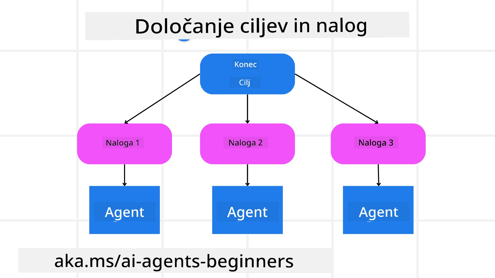

[](https://youtu.be/kPfJ2BrBCMY?si=9pYpPXp0sSbK91Dr)

> _(Kliknite zgornjo sliko za ogled videa tega učnega gradiva)_

# Načrtovanje

## Uvod

To učno gradivo bo zajemalo

* Določitev jasnega skupnega cilja in razčlenitev kompleksne naloge na obvladljive naloge.
* Izrabo strukturiranega izhoda za bolj zanesljive in strojno berljive odgovore.
* Uporabo dogodkovno vodene metode za upravljanje dinamičnih nalog in nepričakovanih vnosov.

## Cilji učenja

Po zaključku tega učnega gradiva boste razumeli:

* Prepoznati in določiti skupni cilj za AI agenta, ki jasno ve, kaj je treba doseči.
* Razčleniti kompleksno nalogo na obvladljive podnaloge in jih organizirati v logičen zaporedje.
* Opremljati agente z ustreznimi orodji (npr. orodja za iskanje ali orodja za analitiko podatkov), odločiti, kdaj in kako jih uporabiti, ter obvladovati nepričakovane situacije, ki nastanejo.
* Ocenjevati rezultate podnalog, meriti uspešnost in ponavljati dejanja za izboljšanje končnega izhoda.

## Določanje skupnega cilja in razčlenitev naloge



Večina nalog v resničnem svetu je preveč zapletena, da bi jih rešili v enem koraku. AI agent potrebuje jedrnat cilj, ki vodi njegovo načrtovanje in dejanja. Na primer, razmislimo o cilju:

    "Ustvari tridnevni potovalni načrt."

Čeprav je enostaven za povedati, ga je še vedno treba natančneje opredeliti. Bolj kot je cilj jasen, bolje se lahko agent (in vsi sodelujoči ljudje) osredotoči na dosego pravega rezultata, na primer ustvarjanje celovitega potovalnega načrta z možnostmi letov, priporočili hotelov in predlogi dejavnosti.

### Razčlenitev naloge

Velike ali zapletene naloge postanejo obvladljivejše, če jih razdelimo na manjše, ciljno usmerjene podnaloge.  
Pri primeru potovalnega načrta lahko cilj razčlenimo na:

* Rezervacijo leta  
* Rezervacijo hotela  
* Najem avtomobila  
* Prilagoditev

Vsako podnalogo lahko nato obravnavajo namenski agenti ali procesi. En agent se lahko specializira za iskanje najboljših ponudb za lete, drugi za rezervacijo hotelov in tako naprej. Koordinacijski ali "spodnji" agent lahko nato zbere te rezultate v enoten načrt za končnega uporabnika.

Ta modularni pristop omogoča tudi postopne izboljšave. Na primer, lahko dodate specializirane agente za prehranske priporočila ali lokalne dejavnosti in v času izboljšujete načrt.

### Strukturiran izhod

Veliki jezikovni modeli (LLM) lahko ustvarijo strukturiran izhod (npr. JSON), ki ga je lažje razčleniti in obdelati za spodnje agente ali storitve. To je še posebej uporabno v večagentnem okolju, kjer lahko ukrepamo po prejetju načrta.

Naslednji Pythonov odlomek kaže preprostega načrtovalnega agenta, ki razčleni cilj na podnaloge in generira strukturiran načrt:

```python
from pydantic import BaseModel
from enum import Enum
from typing import List, Optional, Union
import json
import os
from typing import Optional
from pprint import pprint
from agent_framework.azure import AzureAIProjectAgentProvider
from azure.identity import AzureCliCredential

class AgentEnum(str, Enum):
    FlightBooking = "flight_booking"
    HotelBooking = "hotel_booking"
    CarRental = "car_rental"
    ActivitiesBooking = "activities_booking"
    DestinationInfo = "destination_info"
    DefaultAgent = "default_agent"
    GroupChatManager = "group_chat_manager"

# Model potovalne podnaloge
class TravelSubTask(BaseModel):
    task_details: str
    assigned_agent: AgentEnum  # želi se nam dodeliti nalogo agentu

class TravelPlan(BaseModel):
    main_task: str
    subtasks: List[TravelSubTask]
    is_greeting: bool

provider = AzureAIProjectAgentProvider(credential=AzureCliCredential())

# Določi uporabnikovo sporočilo
system_prompt = """You are a planner agent.
    Your job is to decide which agents to run based on the user's request.
    Provide your response in JSON format with the following structure:
{'main_task': 'Plan a family trip from Singapore to Melbourne.',
 'subtasks': [{'assigned_agent': 'flight_booking',
               'task_details': 'Book round-trip flights from Singapore to '
                               'Melbourne.'}
    Below are the available agents specialised in different tasks:
    - FlightBooking: For booking flights and providing flight information
    - HotelBooking: For booking hotels and providing hotel information
    - CarRental: For booking cars and providing car rental information
    - ActivitiesBooking: For booking activities and providing activity information
    - DestinationInfo: For providing information about destinations
    - DefaultAgent: For handling general requests"""

user_message = "Create a travel plan for a family of 2 kids from Singapore to Melbourne"

response = client.create_response(input=user_message, instructions=system_prompt)

response_content = response.output_text
pprint(json.loads(response_content))
```

### Načrtovalni agent z večagentno orkestracijo

V tem primeru Semantic Router Agent prejme uporabniško zahtevo (npr. "Potrebujem načrt hotela za moje potovanje.").

Načrtovalec nato:

* Prejme načrt hotela: Načrtovalec prejme uporabniško sporočilo in na podlagi sistemskega poziva (vključno s podrobnostmi o razpoložljivih agentih) ustvari strukturiran potovalni načrt.
* Navede agente in njihova orodja: Register agentov vsebuje seznam agentov (npr. za let, hotel, najem avtomobila in dejavnosti) skupaj s funkcijami ali orodji, ki jih ponujajo.
* Usmeri načrt ustreznim agentom: Glede na število podnalog načrtovalec bodisi neposredno pošlje sporočilo namenskemu agentu (za primere ene naloge) ali koordinira preko upravitelja skupinskega klepeta za večagentno sodelovanje.
* Povzame rezultat: Na koncu načrtovalec povzame izdelan načrt za preglednost.  
Naslednji primer kode v Pythonu prikazuje te korake:

```python

from pydantic import BaseModel

from enum import Enum
from typing import List, Optional, Union

class AgentEnum(str, Enum):
    FlightBooking = "flight_booking"
    HotelBooking = "hotel_booking"
    CarRental = "car_rental"
    ActivitiesBooking = "activities_booking"
    DestinationInfo = "destination_info"
    DefaultAgent = "default_agent"
    GroupChatManager = "group_chat_manager"

# Model podnaloge potovanja

class TravelSubTask(BaseModel):
    task_details: str
    assigned_agent: AgentEnum # Želimo dodeliti nalogo agentu

class TravelPlan(BaseModel):
    main_task: str
    subtasks: List[TravelSubTask]
    is_greeting: bool
import json
import os
from typing import Optional

from agent_framework.azure import AzureAIProjectAgentProvider
from azure.identity import AzureCliCredential

# Ustvari odjemalca

provider = AzureAIProjectAgentProvider(credential=AzureCliCredential())

from pprint import pprint

# Določi uporabniško sporočilo

system_prompt = """You are a planner agent.
    Your job is to decide which agents to run based on the user's request.
    Below are the available agents specialized in different tasks:
    - FlightBooking: For booking flights and providing flight information
    - HotelBooking: For booking hotels and providing hotel information
    - CarRental: For booking cars and providing car rental information
    - ActivitiesBooking: For booking activities and providing activity information
    - DestinationInfo: For providing information about destinations
    - DefaultAgent: For handling general requests"""

user_message = "Create a travel plan for a family of 2 kids from Singapore to Melbourne"

response = client.create_response(input=user_message, instructions=system_prompt)

response_content = response.output_text

# Izpiši vsebino odgovora po nalaganju kot JSON

pprint(json.loads(response_content))
```

Sledi izhod prejšnje kode, ki ga lahko nato uporabite za usmerjanje k `assigned_agent` in povzema potovalni načrt za končnega uporabnika.

```json
{
    "is_greeting": "False",
    "main_task": "Plan a family trip from Singapore to Melbourne.",
    "subtasks": [
        {
            "assigned_agent": "flight_booking",
            "task_details": "Book round-trip flights from Singapore to Melbourne."
        },
        {
            "assigned_agent": "hotel_booking",
            "task_details": "Find family-friendly hotels in Melbourne."
        },
        {
            "assigned_agent": "car_rental",
            "task_details": "Arrange a car rental suitable for a family of four in Melbourne."
        },
        {
            "assigned_agent": "activities_booking",
            "task_details": "List family-friendly activities in Melbourne."
        },
        {
            "assigned_agent": "destination_info",
            "task_details": "Provide information about Melbourne as a travel destination."
        }
    ]
}
```

Primer zvezka s prejšnjim primerom kode je na voljo [tukaj](07-python-agent-framework.ipynb).

### Iterativno načrtovanje

Nekatere naloge zahtevajo izmenjavo ali ponovno načrtovanje, kjer izid ene podnaloge vpliva na naslednjo. Na primer, če agent zazna nepričakovano obliko podatkov med rezervacijo letov, se bo morda moral prilagoditi, preden nadaljuje z rezervacijo hotela.

Prav tako uporabniški feedback (npr. da človek odloči, da raje želi zgodnejši let) lahko sproži delno ponoven načrt. Ta dinamični, iterativni pristop zagotavlja, da končna rešitev ustreza realnim omejitvam in spreminjajočim se uporabniškim željam.

npr. vzorčna koda

```python
from agent_framework.azure import AzureAIProjectAgentProvider
from azure.identity import AzureCliCredential
#.. enako kot prejšnja koda in posreduj zgodovino uporabnika, trenutni načrt

system_prompt = """You are a planner agent to optimize the
    Your job is to decide which agents to run based on the user's request.
    Below are the available agents specialized in different tasks:
    - FlightBooking: For booking flights and providing flight information
    - HotelBooking: For booking hotels and providing hotel information
    - CarRental: For booking cars and providing car rental information
    - ActivitiesBooking: For booking activities and providing activity information
    - DestinationInfo: For providing information about destinations
    - DefaultAgent: For handling general requests"""

user_message = "Create a travel plan for a family of 2 kids from Singapore to Melbourne"

response = client.create_response(
    input=user_message,
    instructions=system_prompt,
    context=f"Previous travel plan - {TravelPlan}",
)
# .. ponovno načrtuj in pošlji naloge ustreznim agentom
```

Za bolj celovito načrtovanje si oglejte Magnetic One <a href="https://www.microsoft.com/research/articles/magentic-one-a-generalist-multi-agent-system-for-solving-complex-tasks" target="_blank">blog objavo</a> za reševanje kompleksnih nalog.

## Povzetek

V tem članku smo si ogledali primer, kako lahko ustvarimo načrtovalca, ki dinamično izbira razpoložljive agente. Izhod načrtovalca razčleni naloge in dodeli agente, da jih lahko izvedejo. Predpostavlja se, da imajo agenti dostop do funkcij/orodij, potrebnih za izvedbo naloge. Poleg agentov lahko vključite tudi druge vzorce, kot so refleksija, povzemalnik in krožni klepet, da dodatno prilagodite.

## Dodatni viri

Magentic One - Generalistični večagentni sistem za reševanje kompleksnih nalog, ki je dosegel impresivne rezultate na več zahtevnih benchmarkih. Referenca: <a href="https://www.microsoft.com/research/articles/magentic-one-a-generalist-multi-agent-system-for-solving-complex-tasks" target="_blank">Magentic One</a>. V tej implementaciji orkestrator ustvarja nalogam specifične načrte in te naloge delegira razpoložljivim agentom. Poleg načrtovanja orkestrator uporablja tudi mehanizem sledenja za spremljanje napredka naloge in po potrebi ponovno načrtuje.

### Imate več vprašanj o vzorcu načrtovanja?

Pridružite se [Microsoft Foundry Discord](https://aka.ms/ai-agents/discord), da se srečate z drugimi učenci, obiskujete uradne ure in dobite odgovore na vprašanja o AI agentih.

## Prejšnje učno gradivo

[Gradnja zanesljivih AI agentov](../06-building-trustworthy-agents/README.md)

## Naslednje učno gradivo

[Večagentni vzorec](../08-multi-agent/README.md)

---

<!-- CO-OP TRANSLATOR DISCLAIMER START -->
**Omejitev odgovornosti**:
Ta dokument je bil preveden z uporabo AI prevajalske storitve [Co-op Translator](https://github.com/Azure/co-op-translator). Čeprav si prizadevamo za natančnost, vas prosimo, da upoštevate, da avtomatizirani prevodi lahko vsebujejo napake ali netočnosti. Izvirni dokument v njegovem izvirnem jeziku velja za avtoritativni vir. Za kritične informacije priporočamo strokovni človeški prevod. Nismo odgovorni za kakršna koli nesporazume ali napačne interpretacije, ki izhajajo iz uporabe tega prevoda.
<!-- CO-OP TRANSLATOR DISCLAIMER END -->