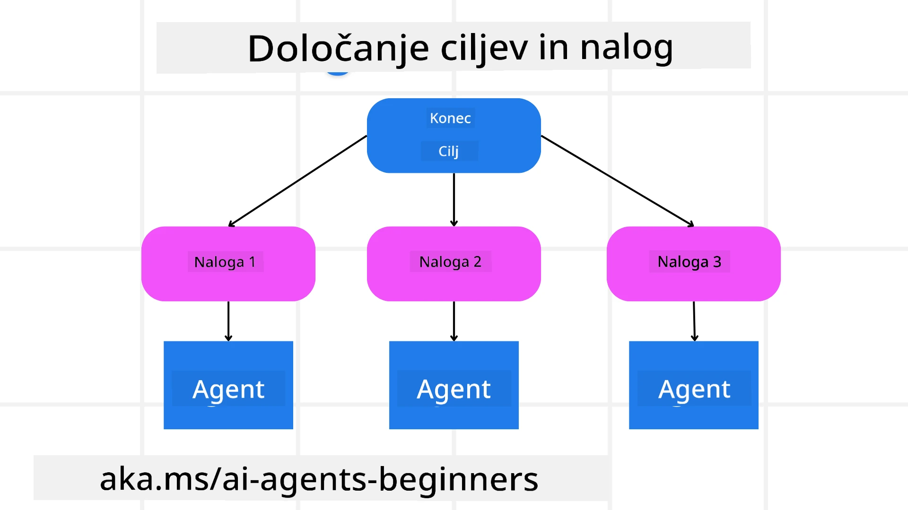

[](https://youtu.be/kPfJ2BrBCMY?si=9pYpPXp0sSbK91Dr)

> _(Kliknite na zgornjo sliko za ogled video lekcije)_

# Načrtovanje

## Uvod

Ta lekcija bo zajemala

* Določitev jasnega skupnega cilja in razdelitev kompleksne naloge na obvladljive naloge.
* Uporabo strukturiranega izhoda za bolj zanesljive in strojno berljive odgovore.
* Uporabo pristopa, ki temelji na dogodkih, za obravnavo dinamičnih nalog in nepričakovanih vhodov.

## Cilji učenja

Po zaključku te lekcije boste razumeli:

* Prepoznati in določiti skupni cilj za AI agenta, tako da jasno ve, kaj je treba doseči.
* Razčleniti kompleksno nalogo na obvladljive podnaloge in jih organizirati v logičen zaporedje.
* Opremljati agente z ustreznimi orodji (npr. iskalnimi ali analitičnimi orodji), odločiti, kdaj in kako jih uporabiti, ter obvladovati nepričakovane situacije.
* Ocenjevati rezultate podnalog, meriti uspešnost in večkrat ponavljati ukrepe za izboljšanje končnega izhoda.

## Določitev skupnega cilja in razdelitev naloge



Večina nalog v resničnem svetu je preveč zapletena, da bi jih rešili v enem koraku. AI agent potrebuje jedrnat cilj, ki usmerja njegovo načrtovanje in dejanja. Na primer, upoštevajte cilj:

    "Ustvari tridnevni potovalni načrt."

Čeprav je preprosto ga navesti, je vseeno potreben natančnejši opis. Bolj jasen cilj omogoča agentu (in morebitnim sodelujočim) bolje osredotočiti na dosego pravega rezultata, na primer ustvarjanje obsežnega načrta z možnostmi letov, priporočili hotelov in predlogi aktivnosti.

### Razčlenitev naloge

Velike ali zapletene naloge postanejo bolj obvladljive, če jih razdelimo na manjše, ciljno usmerjene podnaloge.
Za primer potovalnega načrta bi lahko razčlenili cilj na:

* Rezervacijo letov
* Rezervacijo hotela
* Najem avtomobila
* Personalizacijo

Vsako podnalogo lahko nato opravljajo namenski agenti ali procesi. Eden se lahko specializira za iskanje najboljših letalskih ponudb, drugi se osredotoči na rezervacije hotelov itd. Koordinacijski ali "spodnji" agent nato združi te rezultate v en sam koherenten načrt za končnega uporabnika.

Ta modularni pristop omogoča tudi postopne izboljšave. Na primer, lahko dodate specializirane agente za priporočila hrane ali lokalnih aktivnosti ter sčasoma izboljšate načrt.

### Strukturiran izhod

Veliki jezikovni modeli (LLM) lahko ustvarjajo strukturiran izhod (npr. JSON), ki ga je lažje analizirati in obdelati za spodnje agente ali storitve. To je še posebej uporabno v kontekstu več agentov, kjer lahko te naloge izvedemo po prejemu načrta.

Naslednji Python primer prikazuje preprost načrtovalni agent, ki razčleni cilj na podnaloge in generira strukturiran načrt:

```python
from pydantic import BaseModel
from enum import Enum
from typing import List, Optional, Union
import json
import os
from typing import Optional
from pprint import pprint
from agent_framework.azure import AzureAIProjectAgentProvider
from azure.identity import AzureCliCredential

class AgentEnum(str, Enum):
    FlightBooking = "flight_booking"
    HotelBooking = "hotel_booking"
    CarRental = "car_rental"
    ActivitiesBooking = "activities_booking"
    DestinationInfo = "destination_info"
    DefaultAgent = "default_agent"
    GroupChatManager = "group_chat_manager"

# Model potovalne podnaloge
class TravelSubTask(BaseModel):
    task_details: str
    assigned_agent: AgentEnum  # želimo dodeliti nalogo agentu

class TravelPlan(BaseModel):
    main_task: str
    subtasks: List[TravelSubTask]
    is_greeting: bool

provider = AzureAIProjectAgentProvider(credential=AzureCliCredential())

# Določi uporabnikovo sporočilo
system_prompt = """You are a planner agent.
    Your job is to decide which agents to run based on the user's request.
    Provide your response in JSON format with the following structure:
{'main_task': 'Plan a family trip from Singapore to Melbourne.',
 'subtasks': [{'assigned_agent': 'flight_booking',
               'task_details': 'Book round-trip flights from Singapore to '
                               'Melbourne.'}
    Below are the available agents specialised in different tasks:
    - FlightBooking: For booking flights and providing flight information
    - HotelBooking: For booking hotels and providing hotel information
    - CarRental: For booking cars and providing car rental information
    - ActivitiesBooking: For booking activities and providing activity information
    - DestinationInfo: For providing information about destinations
    - DefaultAgent: For handling general requests"""

user_message = "Create a travel plan for a family of 2 kids from Singapore to Melbourne"

response = client.create_response(input=user_message, instructions=system_prompt)

response_content = response.output_text
pprint(json.loads(response_content))
```

### Načrtovalni agent z orkestracijo več agentov

V tem primeru agent Semantic Router prejme uporabniški zahtevek (npr. "Potrebujem načrt hotela za moje potovanje.").

Načrtovalec nato:

* Prejme načrt hotela: Načrtovalec vzame uporabnikovo sporočilo in na podlagi sistemskega poziva (vključno s podatki o razpoložljivih agentih) ustvari strukturiran potovalni načrt.
* Našteje agente in njihova orodja: Registrski seznam agentov vsebuje seznam agentov (npr. za let, hotel, najem avtomobila in aktivnosti) skupaj s funkcijami ali orodji, ki jih ponujajo.
* Usmerja načrt ustreznim agentom: Glede na število podnalog načrtovalec bodisi neposredno pošlje sporočilo namenskemu agentu (za enonalogne scenarije) ali usklajuje prek upravljalnika skupinskega klepeta za sodelovanje več agentov.
* Povzame rezultat: Na koncu načrtovalec povzame ustvarjeni načrt za jasnost.
Naslednji Python vzorec kode prikazuje te korake:

```python

from pydantic import BaseModel

from enum import Enum
from typing import List, Optional, Union

class AgentEnum(str, Enum):
    FlightBooking = "flight_booking"
    HotelBooking = "hotel_booking"
    CarRental = "car_rental"
    ActivitiesBooking = "activities_booking"
    DestinationInfo = "destination_info"
    DefaultAgent = "default_agent"
    GroupChatManager = "group_chat_manager"

# Model podnaloge potovanja

class TravelSubTask(BaseModel):
    task_details: str
    assigned_agent: AgentEnum # želimo dodeliti nalogo agentu

class TravelPlan(BaseModel):
    main_task: str
    subtasks: List[TravelSubTask]
    is_greeting: bool
import json
import os
from typing import Optional

from agent_framework.azure import AzureAIProjectAgentProvider
from azure.identity import AzureCliCredential

# Ustvari odjemalca

provider = AzureAIProjectAgentProvider(credential=AzureCliCredential())

from pprint import pprint

# Določi sporočilo uporabnika

system_prompt = """You are a planner agent.
    Your job is to decide which agents to run based on the user's request.
    Below are the available agents specialized in different tasks:
    - FlightBooking: For booking flights and providing flight information
    - HotelBooking: For booking hotels and providing hotel information
    - CarRental: For booking cars and providing car rental information
    - ActivitiesBooking: For booking activities and providing activity information
    - DestinationInfo: For providing information about destinations
    - DefaultAgent: For handling general requests"""

user_message = "Create a travel plan for a family of 2 kids from Singapore to Melbourne"

response = client.create_response(input=user_message, instructions=system_prompt)

response_content = response.output_text

# Natisni vsebino odgovora po nalaganju kot JSON

pprint(json.loads(response_content))
```

Kar sledi, je izhod prejšnje kode, ki jo lahko nato uporabite za usmerjanje na `assigned_agent` in povzema potovalni načrt končnemu uporabniku.

```json
{
    "is_greeting": "False",
    "main_task": "Plan a family trip from Singapore to Melbourne.",
    "subtasks": [
        {
            "assigned_agent": "flight_booking",
            "task_details": "Book round-trip flights from Singapore to Melbourne."
        },
        {
            "assigned_agent": "hotel_booking",
            "task_details": "Find family-friendly hotels in Melbourne."
        },
        {
            "assigned_agent": "car_rental",
            "task_details": "Arrange a car rental suitable for a family of four in Melbourne."
        },
        {
            "assigned_agent": "activities_booking",
            "task_details": "List family-friendly activities in Melbourne."
        },
        {
            "assigned_agent": "destination_info",
            "task_details": "Provide information about Melbourne as a travel destination."
        }
    ]
}
```

Primer zvezka s prejšnjo kodo je na voljo [tukaj](07-python-agent-framework.ipynb).

### Iterativno načrtovanje

Nekatere naloge zahtevajo izmenjavo ali preplanujo, kjer izid ene podnaloge vpliva na naslednjo. Na primer, če agent odkrije nepričakovano obliko podatkov med rezervacijo letov, bo morda moral prilagoditi svojo strategijo, preden nadaljuje z rezervacijo hotela.

Poleg tega lahko povratna informacija uporabnika (npr. odločitev človeka za zgodnejši let) sproži delno ponovno načrtovanje. Ta dinamični, iterativni pristop zagotavlja, da končna rešitev ustreza resničnim omejitvam in spreminjajočim se željam uporabnika.

npr. primer kode

```python
from agent_framework.azure import AzureAIProjectAgentProvider
from azure.identity import AzureCliCredential
#.. enako kot prejšnja koda in posreduj zgodovino uporabnika, trenutni načrt

system_prompt = """You are a planner agent to optimize the
    Your job is to decide which agents to run based on the user's request.
    Below are the available agents specialized in different tasks:
    - FlightBooking: For booking flights and providing flight information
    - HotelBooking: For booking hotels and providing hotel information
    - CarRental: For booking cars and providing car rental information
    - ActivitiesBooking: For booking activities and providing activity information
    - DestinationInfo: For providing information about destinations
    - DefaultAgent: For handling general requests"""

user_message = "Create a travel plan for a family of 2 kids from Singapore to Melbourne"

response = client.create_response(
    input=user_message,
    instructions=system_prompt,
    context=f"Previous travel plan - {TravelPlan}",
)
# .. ponovno načrtuj in pošlji naloge ustreznim agentom
```

Za bolj celovito načrtovanje si oglejte Magnetic One <a href="https://www.microsoft.com/research/articles/magentic-one-a-generalist-multi-agent-system-for-solving-complex-tasks" target="_blank">Blogpost</a> za reševanje kompleksnih nalog.

## Povzetek

V tem članku smo si ogledali primer, kako lahko ustvarimo načrtovalca, ki lahko dinamično izbere razpoložljive agente. Izhod načrtovalca razčleni naloge in dodeli agente, da jih lahko izvedejo. Predpostavlja se, da imajo agenti dostop do funkcij/orodij, potrebnih za izvedbo naloge. Poleg agentov lahko vključite tudi druge vzorce, kot so refleksija, povzemalnik in krožni klepet za dodatno prilagoditev.

## Dodatni viri

Magentic One - Generalni večagentni sistem za reševanje kompleksnih nalog, ki je dosegel impresivne rezultate na več zahtevnih agentnih merilih. Referenca: <a href="https://www.microsoft.com/research/articles/magentic-one-a-generalist-multi-agent-system-for-solving-complex-tasks" target="_blank">Magentic One</a>. V tej implementaciji orkestrator ustvarja naloge specifične načrte in delegira te naloge razpoložljivim agentom. Poleg načrtovanja orkestrator uporablja tudi mehanizem sledenja za nadzor napredka naloge in ponovno načrtuje po potrebi.

### Imate več vprašanj o vzorcu načrtovanja?

Pridružite se [Microsoft Foundry Discord](https://discord.com/invite/ATgtXmAS5D) in se srečajte z drugimi učenci, udeležite se uradnih ur ter dobite odgovore na vprašanja o AI agentih.

## Prejšnja lekcija

[Gradnja zaupanja vrednih AI agentov](../06-building-trustworthy-agents/README.md)

## Naslednja lekcija

[Vzorec načrtovanja z več agenti](../08-multi-agent/README.md)

---

<!-- CO-OP TRANSLATOR DISCLAIMER START -->
**Omejitev odgovornosti**:
Ta dokument je bil preveden z uporabo AI prevajalske storitve [Co-op Translator](https://github.com/Azure/co-op-translator). Čeprav si prizadevamo za natančnost, vas prosimo, da upoštevate, da avtomatizirani prevodi lahko vsebujejo napake ali netočnosti. Izvirni dokument v njegovem izvirnem jeziku je treba obravnavati kot avtoritativni vir. Za kritične informacije je priporočljiv strokovni človeški prevod. Ne odgovarjamo za morebitna nesporazume ali napačne interpretacije, ki izhajajo iz uporabe tega prevoda.
<!-- CO-OP TRANSLATOR DISCLAIMER END -->