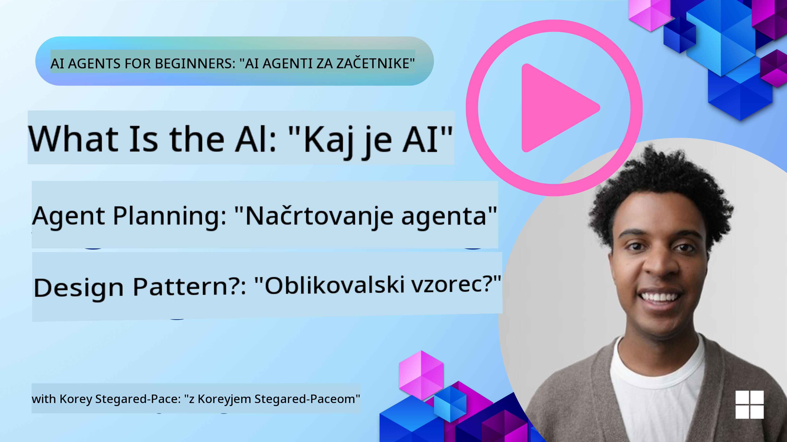
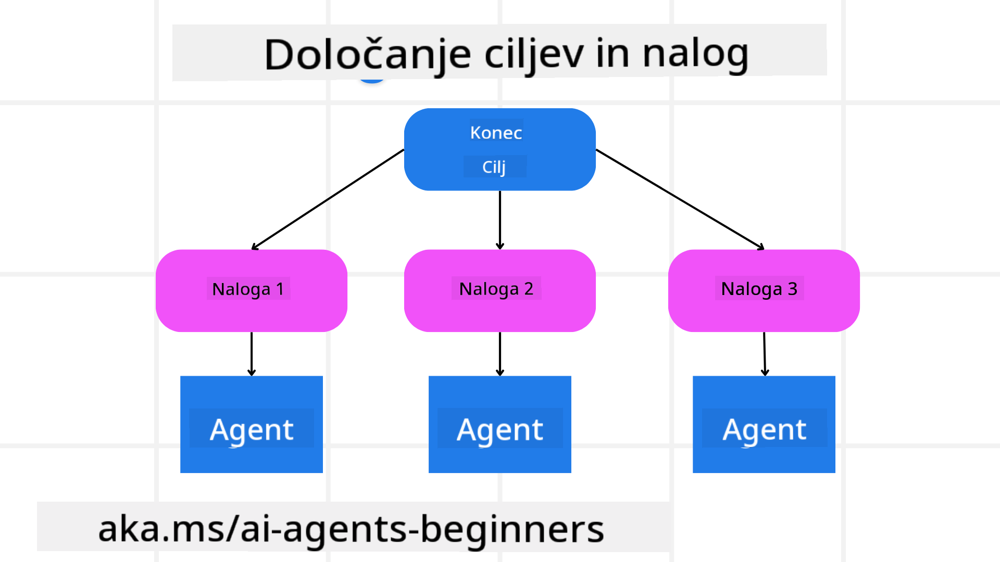

<!--
CO_OP_TRANSLATOR_METADATA:
{
  "original_hash": "a28d30590704ea13b6a08d4793cf9c2b",
  "translation_date": "2025-08-30T09:25:06+00:00",
  "source_file": "07-planning-design/README.md",
  "language_code": "sl"
}
-->
[](https://youtu.be/kPfJ2BrBCMY?si=9pYpPXp0sSbK91Dr)

> _(Kliknite na zgornjo sliko za ogled videa te lekcije)_

# Načrtovanje načrta

## Uvod

Ta lekcija bo zajemala:

* Določitev jasnega splošnega cilja in razdelitev kompleksne naloge na obvladljive naloge.
* Uporaba strukturiranega izhoda za zanesljivejše in strojno berljive odgovore.
* Uporaba pristopa, ki temelji na dogodkih, za obravnavo dinamičnih nalog in nepričakovanih vnosov.

## Cilji učenja

Po zaključku te lekcije boste razumeli:

* Kako določiti in postaviti splošni cilj za AI agenta, da bo jasno vedel, kaj je treba doseči.
* Kako razdeliti kompleksno nalogo na obvladljive podnaloge in jih organizirati v logičnem zaporedju.
* Kako opremiti agente s pravimi orodji (npr. iskalna orodja ali orodja za analizo podatkov), odločiti, kdaj in kako jih uporabiti, ter obravnavati nepričakovane situacije.
* Kako oceniti rezultate podnalog, meriti uspešnost in iterirati na dejanjih za izboljšanje končnega izhoda.

## Določitev splošnega cilja in razdelitev naloge



Večina nalog v resničnem svetu je preveč zapletenih, da bi jih lahko rešili v enem koraku. AI agent potrebuje jedrnat cilj, ki usmerja njegovo načrtovanje in dejanja. Na primer, razmislite o cilju:

    "Ustvari tridnevni potovalni načrt."

Čeprav je cilj preprost za zapisati, ga je treba še izpopolniti. Bolj kot je cilj jasen, bolj se lahko agent (in morebitni človeški sodelavci) osredotoči na dosego pravega rezultata, kot je ustvarjanje celovitega načrta z možnostmi letov, priporočili za hotele in predlogi za aktivnosti.

### Razdelitev naloge

Velike ali zapletene naloge postanejo obvladljivejše, ko jih razdelimo na manjše, ciljno usmerjene podnaloge. 
Za primer potovalnega načrta lahko cilj razdelite na:

* Rezervacija letov
* Rezervacija hotelov
* Najem avtomobila
* Personalizacija

Vsako podnalogo lahko nato obravnavajo namenski agenti ali procesi. Eden od agentov se lahko specializira za iskanje najboljših ponudb za lete, drugi za rezervacije hotelov itd. Koordinacijski ali "nadaljnji" agent lahko nato združi te rezultate v enoten načrt za končnega uporabnika.

Ta modularni pristop omogoča tudi postopne izboljšave. Na primer, lahko dodate specializirane agente za priporočila hrane ali predloge lokalnih aktivnosti in sčasoma izpopolnite načrt.

### Strukturiran izhod

Veliki jezikovni modeli (LLM) lahko ustvarijo strukturiran izhod (npr. JSON), ki ga je lažje razčleniti in obdelati za nadaljnje agente ali storitve. To je še posebej uporabno v kontekstu več agentov, kjer lahko te naloge izvedemo po prejemu načrtovanega izhoda. Za hiter pregled si oglejte naslednji Python primer, ki prikazuje preprostega načrtovalnega agenta, ki razdeli cilj na podnaloge in ustvari strukturiran načrt:

```python
from pydantic import BaseModel
from enum import Enum
from typing import List, Optional, Union
import json
import os
from typing import Optional
from pprint import pprint
from autogen_core.models import UserMessage, SystemMessage, AssistantMessage
from autogen_ext.models.azure import AzureAIChatCompletionClient
from azure.core.credentials import AzureKeyCredential

class AgentEnum(str, Enum):
    FlightBooking = "flight_booking"
    HotelBooking = "hotel_booking"
    CarRental = "car_rental"
    ActivitiesBooking = "activities_booking"
    DestinationInfo = "destination_info"
    DefaultAgent = "default_agent"
    GroupChatManager = "group_chat_manager"

# Travel SubTask Model
class TravelSubTask(BaseModel):
    task_details: str
    assigned_agent: AgentEnum  # we want to assign the task to the agent

class TravelPlan(BaseModel):
    main_task: str
    subtasks: List[TravelSubTask]
    is_greeting: bool

client = AzureAIChatCompletionClient(
    model="gpt-4o-mini",
    endpoint="https://models.inference.ai.azure.com",
    # To authenticate with the model you will need to generate a personal access token (PAT) in your GitHub settings.
    # Create your PAT token by following instructions here: https://docs.github.com/en/authentication/keeping-your-account-and-data-secure/managing-your-personal-access-tokens
    credential=AzureKeyCredential(os.environ["GITHUB_TOKEN"]),
    model_info={
        "json_output": False,
        "function_calling": True,
        "vision": True,
        "family": "unknown",
    },
)

# Define the user message
messages = [
    SystemMessage(content="""You are an planner agent.
    Your job is to decide which agents to run based on the user's request.
                      Provide your response in JSON format with the following structure:
{'main_task': 'Plan a family trip from Singapore to Melbourne.',
 'subtasks': [{'assigned_agent': 'flight_booking',
               'task_details': 'Book round-trip flights from Singapore to '
                               'Melbourne.'}
    Below are the available agents specialised in different tasks:
    - FlightBooking: For booking flights and providing flight information
    - HotelBooking: For booking hotels and providing hotel information
    - CarRental: For booking cars and providing car rental information
    - ActivitiesBooking: For booking activities and providing activity information
    - DestinationInfo: For providing information about destinations
    - DefaultAgent: For handling general requests""", source="system"),
    UserMessage(
        content="Create a travel plan for a family of 2 kids from Singapore to Melboune", source="user"),
]

response = await client.create(messages=messages, extra_create_args={"response_format": 'json_object'})

response_content: Optional[str] = response.content if isinstance(
    response.content, str) else None
if response_content is None:
    raise ValueError("Response content is not a valid JSON string" )

pprint(json.loads(response_content))

# # Ensure the response content is a valid JSON string before loading it
# response_content: Optional[str] = response.content if isinstance(
#     response.content, str) else None
# if response_content is None:
#     raise ValueError("Response content is not a valid JSON string")

# # Print the response content after loading it as JSON
# pprint(json.loads(response_content))

# Validate the response content with the MathReasoning model
# TravelPlan.model_validate(json.loads(response_content))
```

### Načrtovalni agent z orkestracijo več agentov

V tem primeru Semantic Router Agent prejme uporabniško zahtevo (npr. "Potrebujem načrt za hotel za svoje potovanje.").

Načrtovalec nato:

* Prejme načrt za hotel: Načrtovalec vzame uporabniško sporočilo in na podlagi sistemskega poziva (vključno s podrobnostmi o razpoložljivih agentih) ustvari strukturiran potovalni načrt.
* Navede agente in njihova orodja: Register agentov vsebuje seznam agentov (npr. za lete, hotele, najem avtomobilov in aktivnosti) skupaj s funkcijami ali orodji, ki jih ponujajo.
* Usmeri načrt ustreznim agentom: Glede na število podnalog načrtovalec bodisi pošlje sporočilo neposredno namenskim agentom (za enostavne naloge) bodisi koordinira prek upravitelja skupinskega klepeta za sodelovanje več agentov.
* Povzame rezultat: Na koncu načrtovalec povzame ustvarjeni načrt za jasnost.

Naslednji Python primer kode ponazarja te korake:

```python

from pydantic import BaseModel

from enum import Enum
from typing import List, Optional, Union

class AgentEnum(str, Enum):
    FlightBooking = "flight_booking"
    HotelBooking = "hotel_booking"
    CarRental = "car_rental"
    ActivitiesBooking = "activities_booking"
    DestinationInfo = "destination_info"
    DefaultAgent = "default_agent"
    GroupChatManager = "group_chat_manager"

# Travel SubTask Model

class TravelSubTask(BaseModel):
    task_details: str
    assigned_agent: AgentEnum # we want to assign the task to the agent

class TravelPlan(BaseModel):
    main_task: str
    subtasks: List[TravelSubTask]
    is_greeting: bool
import json
import os
from typing import Optional

from autogen_core.models import UserMessage, SystemMessage, AssistantMessage
from autogen_ext.models.openai import AzureOpenAIChatCompletionClient

# Create the client with type-checked environment variables

client = AzureOpenAIChatCompletionClient(
    azure_deployment=os.getenv("AZURE_OPENAI_DEPLOYMENT_NAME"),
    model=os.getenv("AZURE_OPENAI_DEPLOYMENT_NAME"),
    api_version=os.getenv("AZURE_OPENAI_API_VERSION"),
    azure_endpoint=os.getenv("AZURE_OPENAI_ENDPOINT"),
    api_key=os.getenv("AZURE_OPENAI_API_KEY"),
)

from pprint import pprint

# Define the user message

messages = [
    SystemMessage(content="""You are an planner agent.
    Your job is to decide which agents to run based on the user's request.
    Below are the available agents specialized in different tasks:
    - FlightBooking: For booking flights and providing flight information
    - HotelBooking: For booking hotels and providing hotel information
    - CarRental: For booking cars and providing car rental information
    - ActivitiesBooking: For booking activities and providing activity information
    - DestinationInfo: For providing information about destinations
    - DefaultAgent: For handling general requests""", source="system"),
    UserMessage(content="Create a travel plan for a family of 2 kids from Singapore to Melbourne", source="user"),
]

response = await client.create(messages=messages, extra_create_args={"response_format": TravelPlan})

# Ensure the response content is a valid JSON string before loading it

response_content: Optional[str] = response.content if isinstance(response.content, str) else None
if response_content is None:
    raise ValueError("Response content is not a valid JSON string")

# Print the response content after loading it as JSON

pprint(json.loads(response_content))
```

Sledi izhod iz prejšnje kode, ki ga lahko nato uporabite za usmerjanje k `assigned_agent` in povzemanje potovalnega načrta za končnega uporabnika.

```json
{
    "is_greeting": "False",
    "main_task": "Plan a family trip from Singapore to Melbourne.",
    "subtasks": [
        {
            "assigned_agent": "flight_booking",
            "task_details": "Book round-trip flights from Singapore to Melbourne."
        },
        {
            "assigned_agent": "hotel_booking",
            "task_details": "Find family-friendly hotels in Melbourne."
        },
        {
            "assigned_agent": "car_rental",
            "task_details": "Arrange a car rental suitable for a family of four in Melbourne."
        },
        {
            "assigned_agent": "activities_booking",
            "task_details": "List family-friendly activities in Melbourne."
        },
        {
            "assigned_agent": "destination_info",
            "task_details": "Provide information about Melbourne as a travel destination."
        }
    ]
}
```

Primer zvezka s prejšnjim primerom kode je na voljo [tukaj](07-autogen.ipynb).

### Iterativno načrtovanje

Nekatere naloge zahtevajo povratno komunikacijo ali ponovno načrtovanje, kjer rezultat ene podnaloge vpliva na naslednjo. Na primer, če agent odkrije nepričakovano obliko podatkov med rezervacijo letov, bo morda moral prilagoditi svojo strategijo, preden nadaljuje z rezervacijo hotelov.

Poleg tega lahko povratne informacije uporabnika (npr. če se človek odloči za zgodnejši let) sprožijo delno ponovno načrtovanje. Ta dinamičen, iterativen pristop zagotavlja, da se končna rešitev uskladi z resničnimi omejitvami in spreminjajočimi se uporabniškimi preferencami.

npr. vzorec kode

```python
from autogen_core.models import UserMessage, SystemMessage, AssistantMessage
#.. same as previous code and pass on the user history, current plan
messages = [
    SystemMessage(content="""You are a planner agent to optimize the
    Your job is to decide which agents to run based on the user's request.
    Below are the available agents specialized in different tasks:
    - FlightBooking: For booking flights and providing flight information
    - HotelBooking: For booking hotels and providing hotel information
    - CarRental: For booking cars and providing car rental information
    - ActivitiesBooking: For booking activities and providing activity information
    - DestinationInfo: For providing information about destinations
    - DefaultAgent: For handling general requests""", source="system"),
    UserMessage(content="Create a travel plan for a family of 2 kids from Singapore to Melbourne", source="user"),
    AssistantMessage(content=f"Previous travel plan - {TravelPlan}", source="assistant")
]
# .. re-plan and send the tasks to respective agents
```

Za bolj celovito načrtovanje si oglejte Magnetic One za reševanje kompleksnih nalog.

## Povzetek

V tem članku smo si ogledali primer, kako lahko ustvarimo načrtovalca, ki lahko dinamično izbere razpoložljive agente, ki so definirani. Izhod načrtovalca razdeli naloge in dodeli agente, da jih lahko izvedejo. Predpostavlja se, da imajo agenti dostop do funkcij/orodij, ki so potrebna za izvedbo naloge. Poleg agentov lahko vključite tudi druge vzorce, kot so refleksija, povzemanje in krožni klepet, da dodatno prilagodite.

## Dodatni viri

* AutoGen Magnetic One - Generalistični sistem z več agenti za reševanje kompleksnih nalog, ki je dosegel impresivne rezultate na več zahtevnih agentnih merilih. Referenca:

. V tej implementaciji orkestrator ustvari načrt, specifičen za nalogo, in te naloge delegira razpoložljivim agentom. Poleg načrtovanja orkestrator uporablja tudi mehanizem za sledenje, da spremlja napredek naloge in po potrebi ponovno načrtuje.

### Imate več vprašanj o vzorcu načrtovanja?

Pridružite se [Azure AI Foundry Discord](https://aka.ms/ai-agents/discord), da se povežete z drugimi učenci, se udeležite uradnih ur in dobite odgovore na svoja vprašanja o AI agentih.

## Prejšnja lekcija

[Gradnja zaupanja vrednih AI agentov](../06-building-trustworthy-agents/README.md)

## Naslednja lekcija

[Vzorec oblikovanja z več agenti](../08-multi-agent/README.md)

---

**Omejitev odgovornosti**:  
Ta dokument je bil preveden z uporabo storitve za prevajanje z umetno inteligenco [Co-op Translator](https://github.com/Azure/co-op-translator). Čeprav si prizadevamo za natančnost, vas prosimo, da upoštevate, da lahko avtomatizirani prevodi vsebujejo napake ali netočnosti. Izvirni dokument v njegovem maternem jeziku je treba obravnavati kot avtoritativni vir. Za ključne informacije priporočamo profesionalni človeški prevod. Ne prevzemamo odgovornosti za morebitna nesporazume ali napačne razlage, ki bi nastale zaradi uporabe tega prevoda.