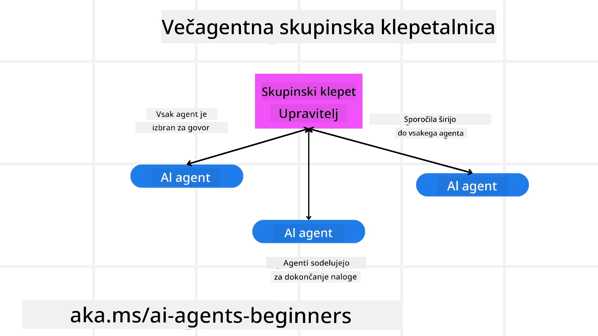
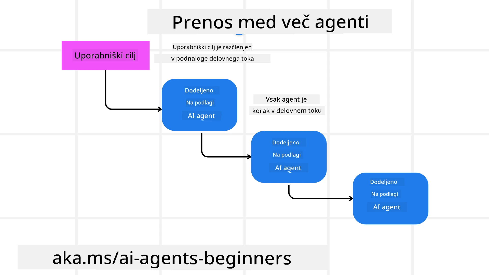
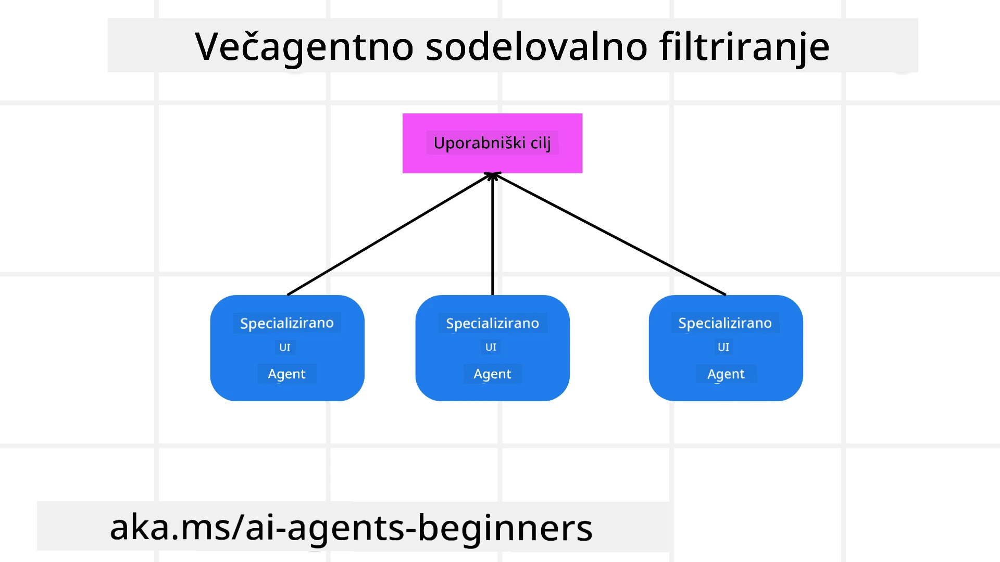

> _(Kliknite zgornjo sliko, da si ogledate video te lekcije)_

# Multi-agentni načrtovalni vzorci

Takoj, ko začnete delati na projektu, ki vključuje več agentov, boste morali upoštevati multi-agentni načrtovalni vzorec. Vendar morda ni takoj jasno, kdaj preiti na več agentov in kakšne so prednosti.

## Uvod

V tej lekciji želimo odgovoriti na naslednja vprašanja:

- V katerih scenarijih so multi-agenti primerni?
- Kakšne so prednosti uporabe multi-agentov v primerjavi z enim samim agentom, ki opravlja več opravil?
- Kateri so osnovni gradniki za implementacijo multi-agentnega načrtovalnega vzorca?
- Kako imamo pregled nad tem, kako več agentov medsebojno sodeluje?

## Cilji učenja

Po tej lekciji bi morali biti sposobni:

- Prepoznati scenarije, kjer so multi-agenti primerni.
- Prepoznati prednosti uporabe multi-agentov v primerjavi z enim samim agentom.
- Razumeti osnovne gradnike za implementacijo multi-agentnega načrtovalnega vzorca.

Kakšna je širša slika?

*Multi-agenti so načrtovalni vzorec, ki omogoča več agentom, da sodelujejo pri doseganju skupnega cilja*.

Ta vzorec se široko uporablja na različnih področjih, vključno z robotiko, avtonomnimi sistemi in distribuiranim računalništvom.

## Scenariji, kjer so multi-agenti primerni

Kateri scenariji so torej primerna raba za uporabo multi-agentov? Odgovor je, da je veliko scenarijev, kjer je uporaba več agentov koristna, predvsem v naslednjih primerih:

- **Velike delovne obremenitve**: Velike delovne obremenitve je mogoče razdeliti na manjša opravila in dodeliti različnim agentom, kar omogoča vzporedno obdelavo in hitrejše dokončanje. Primer tega je obdelava velike količine podatkov.
- **Kompleksna opravila**: Kompleksna opravila, podobno kot velike delovne obremenitve, je mogoče razdeliti na manjše podnaloge in jih dodeliti različnim agentom, od katerih se vsak specializira za določen vidik naloge. Dober primer tega so avtonomna vozila, kjer različni agenti upravljajo navigacijo, zaznavanje ovir in komunikacijo z drugimi vozili.
- **Raznoliko strokovno znanje**: Različni agenti imajo lahko raznoliko strokovno znanje, kar jim omogoča učinkovitejše upravljanje različnih vidikov naloge kot en sam agent. Za ta primer je dober primer zdravstvo, kjer agenti upravljajo diagnostiko, načrte zdravljenja in spremljanje pacientov.

## Prednosti uporabe multi-agentov v primerjavi z enim samim agentom

Sistem z enim agentom bi lahko deloval dobro za enostavna opravila, vendar pa uporaba več agentov za bolj kompleksna opravila prinaša več prednosti:

- **Specializacija**: Vsak agent se lahko specializira za določeno nalogo. Pomanjkanje specializacije pri enem agentu pomeni, da ima agent širok krog opravil, vendar se lahko zmede pri kompleksnem opravilu. Na primer lahko opravi nalogo, za katero ni najbolj primeren.
- **Razširljivost**: Sistem je lažje razširljiv z dodajanjem več agentov namesto preobremenjevanja enega samega agenta.
- **Odpornost na napake**: Če en agent odpove, lahko drugi še vedno delujejo, kar zagotavlja zanesljivost sistema.

Vzemimo primer - rezervirajmo potovanje za uporabnika. Sistem z enim agentom bi moral obvladati vse vidike postopka rezervacije potovanja, od iskanja letov do rezervacije hotelov in najetih avtomobilov. Za dosego tega z enim agentom bi moral agent imeti orodja za upravljanje vseh teh opravil. To bi lahko privedlo do kompleksnega in monolitnega sistema, ki je težak za vzdrževanje in širitev. Sistemi z več agenti pa lahko imajo različne agente, specializirane za iskanje letov, rezervacijo hotelov in najem avtomobilov. Tako sistem postane bolj modularen, lažje vzdrževalen in razširljiv.

Primerjajte to s turistično agencijo, ki jo vodi družinski par, in turistično agencijo, ki deluje kot franšiza. Družinski par bi imel enega agenta, ki ureja vse vidike rezervacije potovanja, medtem ko bi franšiza imela različne agente za različne vidike rezervacije.

## Gradniki za implementacijo multi-agentnega načrtovalnega vzorca

Preden lahko implementirate multi-agentni načrtovalni vzorec, morate razumeti gradnike, ki sestavljajo ta vzorec.

Naredimo to bolj konkretno, spet poglejmo primer rezervacije potovanja za uporabnika. V tem primeru bi gradniki vključevali:

- **Komunikacija med agenti**: Agenti za iskanje letov, rezervacijo hotelov in najem avtomobilov morajo komunicirati in si deliti informacije o uporabnikovih željah in omejitvah. Morate se odločiti za protokole in metode te komunikacije. Konkretno to pomeni, da agent za iskanje letov komunicira z agentom za rezervacijo hotelov, da se zagotovi, da je hotel rezerviran za iste datume kot let. To pomeni, da si agenti morajo deliti informacije o uporabnikovih datumih potovanja, kar pomeni, da morate določiti *kateri agenti si delijo informacije in kako si jih delijo*.
- **Mehanizmi koordinacije**: Agenti morajo usklajevati svoje ukrepe, da se zagotovijo uporabnikove želje in omejitve. Želja uporabnika je lahko na primer hotel blizu letališča, medtem ko je omejitev, da so najemni avtomobili na voljo samo na letališču. To pomeni, da mora agent za rezervacijo hotelov koordinirati z agentom za najem avtomobilov, da se zagotovi upoštevanje želja in omejitev uporabnika. To pomeni, da morate določiti *kako agenti usklajujejo svoje ukrepe*.
- **Arhitektura agenta**: Agenti morajo imeti notranjo strukturo za sprejemanje odločitev in učenje iz interakcij z uporabnikom. To pomeni, da mora agent za iskanje letov imeti notranjo strukturo za odločanje o tem, katere lete priporočiti uporabniku. To pomeni, da morate določiti *kako agenti sprejemajo odločitve in se učijo iz svojih interakcij z uporabnikom*. Primer, kako se agent uči in izboljšuje, je, da lahko agent za iskanje letov uporablja model strojnega učenja za priporočanje letov glede na pretekle uporabnikove želje.
- **Preglednost interakcij multi-agentov**: Potrebujete preglednost nad tem, kako več agentov medsebojno sodeluje. To pomeni, da potrebujete orodja in tehnike za sledenje aktivnostim in interakcijam agentov. To je lahko v obliki orodij za beleženje in spremljanje, orodij za vizualizacijo in merjenje zmogljivosti.
- **Multi-agentni vzorci**: Obstajajo različni vzorci za implementacijo multi-agentnih sistemov, kot so centralizirane, decentralizirane in hibridne arhitekture. Treba je odločiti, kateri vzorec najbolje ustreza vašemu primeru uporabe.
- **Človek v zanki**: V večini primerov imate človeka v zanki in morate agentom navesti, kdaj naj zahtevajo človeško intervencijo. To je lahko v obliki uporabnika, ki zahteva določen hotel ali let, ki ga agenti niso priporočili, ali zahteve za potrditev pred rezervacijo leta ali hotela.

## Preglednost interakcij multi-agentov

Pomembno je, da imate preglednost nad tem, kako več agentov medsebojno sodeluje. Ta preglednost je ključna za odpravljanje napak, optimizacijo in zagotavljanje učinkovitosti celotnega sistema. Za dosego tega potrebujete orodja in tehnike za sledenje aktivnostim in interakcijam agentov. To je lahko v obliki orodij za beleženje in spremljanje, orodij za vizualizacijo in metrik uspešnosti.

Na primer, pri rezervaciji potovanja za uporabnika bi lahko imeli nadzorno ploščo, ki prikazuje stanje vsakega agenta, uporabnikove želje in omejitve ter interakcije med agenti. Ta nadzorna plošča bi lahko prikazala uporabnikove datume potovanja, lete, ki jih je priporočil agent za lete, hotele, ki jih je priporočil agent za hotele, in najemne avtomobile, ki jih je priporočil agent za najem. To bi vam dalo jasen pogled, kako agenti medsebojno sodelujejo in ali se upoštevajo uporabnikove želje in omejitve.

Poglejmo si vsakega od teh vidikov bolj podrobno.

- **Orodja za beleženje in spremljanje**: Želite beležiti vsako dejanje, ki ga izvede agent. Vnos v dnevnik lahko shrani informacije o agentu, ki je izvedel dejanje, izvedenem dejanju, času izvedbe in rezultatu dejanja. Te informacije lahko nato uporabite za odpravljanje napak, optimizacijo in druge namene.

- **Orodja za vizualizacijo**: Orodja za vizualizacijo vam lahko pomagajo videti interakcije med agenti na bolj intuitiven način. Na primer, lahko imate graf, ki prikazuje pretok informacij med agenti. To vam lahko pomaga prepoznati ozka grla, neučinkovitosti in druge težave v sistemu.

- **Metrične kazalnike zmogljivosti**: Metrične kazalnike zmogljivosti vam pomagajo spremljati učinkovitost multi-agentnega sistema. Na primer, lahko spremljate čas, potreben za dokončanje naloge, število opravljenih nalog na enoto časa in natančnost priporočil, ki jih dajejo agenti. Te informacije vam lahko pomagajo prepoznati področja za izboljšave in optimizirati sistem.

## Multi-agentni vzorci

Poglobimo se v nekaj konkretnih vzorcev, ki jih lahko uporabimo za ustvarjanje multi-agentnih aplikacij. Tukaj je nekaj zanimivih vzorcev, ki jih je vredno razmisliti:

### Skupinski klepet

Ta vzorec je uporaben, kadar želite ustvariti aplikacijo za skupinski klepet, kjer lahko več agentov medsebojno komunicira. Tipični primeri uporabe tega vzorca vključujejo timsko sodelovanje, podporo strankam in socialna omrežja.

V tem vzorcu vsak agent predstavlja uporabnika v skupinskem klepetu, sporočila pa si agenti izmenjujejo z uporabo protokola za sporočanje. Agenti lahko pošiljajo sporočila v skupinski klepet, prejemajo sporočila iz skupinskega klepeta in odgovarjajo na sporočila drugih agentov.

Ta vzorec je mogoče implementirati s centralizirano arhitekturo, kjer so vsa sporočila usmerjena preko osrednjega strežnika, ali z decentralizirano arhitekturo, kjer se sporočila izmenjujejo neposredno.

### Predaja

Ta vzorec je uporaben, kadar želite ustvariti aplikacijo, kjer lahko več agentov predaja naloge drug drugemu.

Tipični primeri uporabe tega vzorca vključujejo podporo strankam, upravljanje opravil in avtomatizacijo delovnih tokov.

V tem vzorcu vsak agent predstavlja nalogo ali korak v delovnem toku, agenti pa lahko naloge predajajo drugim agentom na podlagi vnaprej določenih pravil.

### Sodelovalno filtriranje

Ta vzorec je uporaben, kadar želite ustvariti aplikacijo, kjer lahko več agentov sodeluje pri podajanju priporočil uporabnikom.

Razlog, zakaj želite, da več agentov sodeluje, je, da ima vsak agent lahko drugačno strokovno znanje in lahko na različne načine prispeva k procesu priporočanja.

Vzemimo primer, kjer uporabnik želi priporočilo za najboljšo delnico za nakup na borzi.

- **Strokovnjak za panogo**: En agent bi lahko bil strokovnjak za določeno panogo.
- **Tehnična analiza**: Drug agent bi bil strokovnjak za tehnično analizo.
- **Temeljna analiza**: Tretji agent pa bi bil specialist za temeljno analizo. S sodelovanjem lahko ti agenti uporabniku nudijo bolj celovito priporočilo.

## Scenarij: Postopek vračila denarja

Upoštevajte scenarij, kjer stranka poskuša dobiti vračilo za izdelek. V tem postopku je lahko precej agentov, a razdelimo jih na agente, specifične za ta postopek, in splošne agente, ki jih lahko uporabimo tudi v drugih postopkih.

**Agenti specifični za postopek vračila:**

Spodaj je nekaj agentov, ki bi lahko sodelovali v postopku vračila:

- **Agent za stranko**: ta agent zastopa stranko in je odgovoren za začetek postopka vračila.
- **Agent prodajalca**: agent zastopa prodajalca in je odgovoren za obdelavo vračila.
- **Agent plačil**: agent zastopa plačilni postopek in je odgovoren za vračilo plačila stranki.
- **Agent reševanja**: agent zastopa postopek reševanja in je odgovoren za reševanje vseh težav, ki se pojavijo med postopkom vračila.
- **Agent skladnosti**: agent skrbi, da postopek vračila ustreza predpisom in pravilnikom.

**Splošni agenti:**

Te agente lahko uporabijo tudi drugi deli vašega podjetja.

- **Agent za dostavo**: agent skrbi za postopek dostave in je odgovoren za vračilo izdelka prodajalcu. Ta agent se lahko uporablja tako za postopek vračila kot tudi za splošno dostavo izdelka, na primer po nakupu.
- **Agent za povratne informacije**: agent zbira povratne informacije od strank. Povratne informacije so lahko zbrane kadarkoli, ne samo med postopkom vračila.
- **Agent za eskalacijo**: agent skrbi za eskalacijo težav na višjo podporno raven. Takšnega agenta lahko uporabite v katerem koli postopku, kjer je potrebna eskalacija težave.
- **Agent za obveščanje**: agent pošilja obvestila stranki v različnih fazah postopka vračila.
- **Agent za analitiko**: agent analizira podatke povezane s postopkom vračila.
- **Agent za revizijo**: agent opravlja revizijo postopka vračila, da zagotovi pravilno izvajanje.
- **Agent za poročanje**: agent izdeluje poročila o postopku vračila.
- **Agent za znanje**: agent vzdržuje bazo znanja informacij, povezanih s postopkom vračila. Ta agent je lahko podkovan tako v vračilih kot tudi drugih delih vašega podjetja.
- **Agent za varnost**: agent skrbi za varnost postopka vračila.
- **Agent za kakovost**: agent zagotavlja kakovost postopka vračila.

Prejšnji seznam vključuje precej agentov, tako specifičnih za postopek vračila kot tudi splošnih agentov, ki so uporabni v drugih delih vašega podjetja. Upamo, da vam to daje idejo, kako se odločiti, katere agente uporabiti v vašem multi-agentnem sistemu.

## Naloga

Oblikujte multi-agentni sistem za postopek podpore strankam. Prepoznajte agente, vključene v postopek, njihove vloge in odgovornosti ter kako sodelujejo med seboj. Upoštevajte tako agente, specifične za postopek podpore strankam, kot tudi splošne agente, ki jih lahko uporabite v drugih delih vašega podjetja.
> Premislite, preden preberete naslednjo rešitev, morda boste potrebovali več agentov, kot mislite.

> NAMIG: Razmislite o različnih fazah procesa podpore strankam in prav tako upoštevajte agente, potrebne za kateri koli sistem.

## Rešitev

[Rešitev](./solution/solution.md)

## Preverjanje znanja

Vprašanje: Kdaj bi morali razmisliti o uporabi več agentov?

- [ ] A1: Ko imate majhno delovno obremenitev in preprosto nalogo.
- [ ] A2: Ko imate veliko delovno obremenitev
- [ ] A3: Ko imate preprosto nalogo.

[Kviz rešitve](./solution/solution-quiz.md)

## Povzetek

V tej lekciji smo si ogledali vzorec več-agentnega oblikovanja, vključno s scenariji, kjer so več agenti primerni, prednostmi uporabe več agentov v primerjavi z enim samim agentom, gradniki za implementacijo vzorca več-agentnega oblikovanja in kako pridobiti pregled nad tem, kako se več agentov medsebojno povezuje.

### Imate še več vprašanj o vzorcu več-agentnega oblikovanja?

Pridružite se [Microsoft Foundry Discord](https://aka.ms/ai-agents/discord), da se srečate z drugimi učenci, obiskujete uradne ure in dobite odgovore na vaša vprašanja o AI agentih.

## Dodatni viri

- <a href="https://learn.microsoft.com/azure/ai-services/agents/overview" target="_blank">Dokumentacija Microsoft Agent Framework</a>
- <a href="https://www.analyticsvidhya.com/blog/2024/10/agentic-design-patterns/" target="_blank">Agentni oblikovni vzorci</a>

## Prejšnja lekcija

[Načrtovanje oblikovanja](../07-planning-design/README.md)

## Naslednja lekcija

[Metakognicija v AI agentih](../09-metacognition/README.md)

---

<!-- CO-OP TRANSLATOR DISCLAIMER START -->
**Omejitev odgovornosti**:
Ta dokument je bil preveden z uporabo storitve za prevajanje z umetno inteligenco [Co-op Translator](https://github.com/Azure/co-op-translator). Čeprav si prizadevamo za natančnost, vas prosimo, da upoštevate, da lahko avtomatski prevodi vsebujejo napake ali netočnosti. Izvirni dokument v njegovem matičnem jeziku velja za zanesljiv in avtoritativni vir. Za ključne informacije je priporočljivo poiskati strokovni človeški prevod. Nismo odgovorni za morebitne nesporazume ali napačne razlage, ki izhajajo iz uporabe tega prevoda.
<!-- CO-OP TRANSLATOR DISCLAIMER END -->