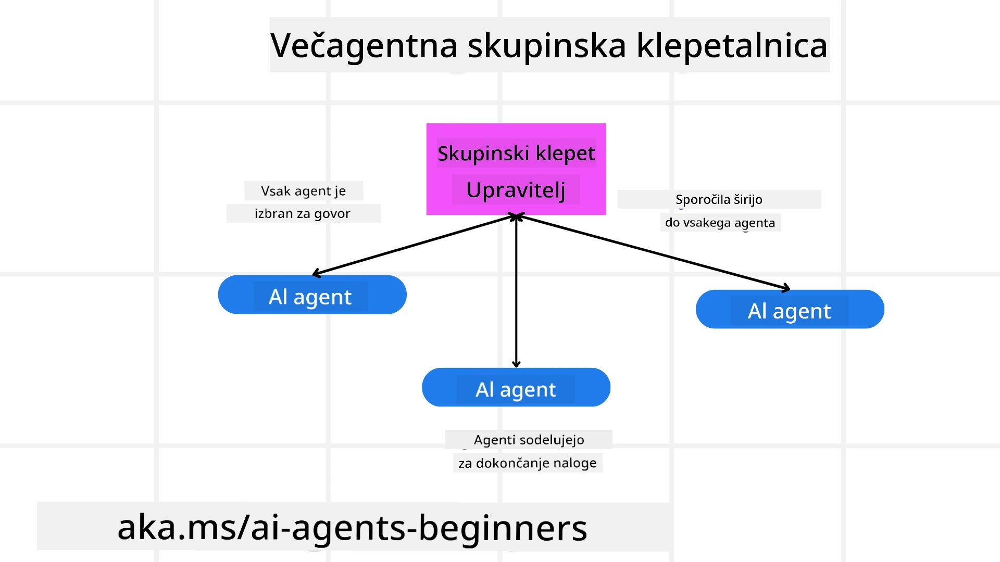
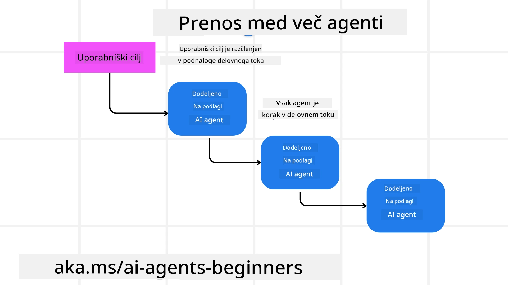
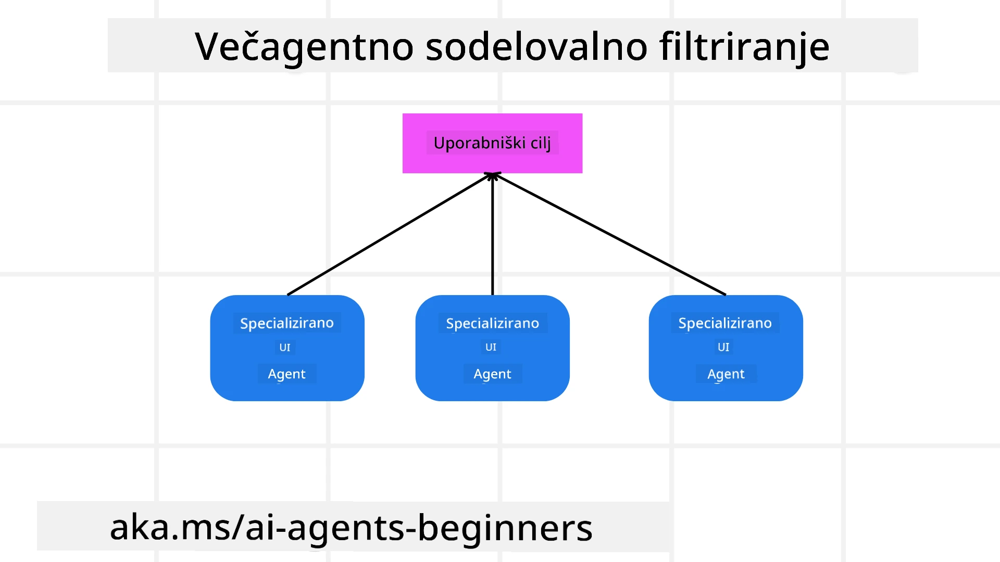

> _(Kliknite zgornjo sliko za ogled videa te lekcije)_

# Multi-agentni oblikovni vzorci

Takoj ko začnete delati na projektu, ki vključuje več agentov, boste morali razmisliti o multi-agentnem oblikovnem vzorcu. Vendar pa morda takoj ni jasno, kdaj preiti na več agentov in kakšne so prednosti.

## Uvod

V tej lekciji bomo poskušali odgovoriti na naslednja vprašanja:

- Za katere scenarije je uporaba multi-agentov primerna?
- Kakšne prednosti ima uporaba več agentov v primerjavi s posameznim agentom, ki opravlja več nalog?
- Katere so gradbene enote za implementacijo multi-agentnega oblikovnega vzorca?
- Kako pridobiti pregled nad tem, kako več agentov medsebojno sodeluje?

## Cilji učenja

Po tej lekciji bi morali biti sposobni:

- Prepoznati scenarije, kjer je uporaba multi-agentov primerna
- Prepoznati prednosti uporabe več agentov v primerjavi s posameznim agentom.
- Razumeti gradbene enote za implementacijo multi-agentnega oblikovnega vzorca.

Kakšna je širša slika?

*Multi-agenti so oblikovni vzorec, ki omogoča sodelovanje več agentov za dosego skupnega cilja*.

Ta vzorec se široko uporablja na različnih področjih, vključno z robotiko, avtonomnimi sistemi in distribuiranim računalništvom.

## Scenariji, kjer je uporaba multi-agentov primerna

Kateri scenariji so torej dober primer uporabe multi-agentov? Odgovor je, da obstaja veliko scenarijev, kjer je uporaba več agentov koristna, še posebej v naslednjih primerih:

- **Velike delovne obremenitve**: Velike delovne obremenitve je mogoče razdeliti na manjše naloge in jih dodeliti različnim agentom, kar omogoča vzporedno obdelavo in hitrejše dokončanje. Primer tega je obdelava velike količine podatkov.
- **Kompleksne naloge**: Kompleksne naloge, podobno kot velike delovne obremenitve, je mogoče razbiti na manjše podnaloge in jih dodeliti različnim agentom, pri čemer se vsak specializira za določen vidik naloge. Dober primer tega so avtonomna vozila, kjer različni agenti upravljajo navigacijo, zaznavanje ovir in komunikacijo z drugimi vozili.
- **Raznolike strokovne kompetence**: Različni agenti lahko imajo različna strokovna znanja, kar jim omogoča učinkovitejše obvladovanje različnih vidikov naloge kot posamezni agent. Dober primer tega so zdravstvene storitve, kjer agenti upravljajo diagnostiko, načrte zdravljenja in spremljanje pacientev.

## Prednosti uporabe multi-agentov v primerjavi s posameznim agentom

Posamezen agent bi lahko dobro deloval pri enostavnih nalogah, vendar pri bolj kompleksnih nalogah uporaba več agentov prinaša več prednosti:

- **Specializacija**: Vsak agent se lahko specializira za določeno nalogo. Pomanjkanje specializacije pri posameznem agentu pomeni, da ima agent zmožnost opravljanja vsega, vendar se lahko zmede pri kompleksnih nalogah. Na primer, lahko opravlja nalogo, za katero ni najbolj primeren.
- **Območje razširitve**: Sisteme je lažje razširjati z dodajanjem več agentov kot preobremenjevanjem posameznega agenta.
- **Odpornost na napake**: Če en agent odpove, lahko drugi nadaljujejo z delovanjem, kar zagotavlja zanesljivost sistema.

Vzemimo primer rezervacije potovanja za uporabnika. Sistem z enim agentom bi moral urejati vse vidike rezervacijskega procesa, od iskanja letov do rezervacije hotelov in najema avtomobilov. Za to bi moral imeti agent orodja za vse te naloge. To bi lahko povzročilo kompleksen in monolitni sistem, ki je težko vzdrževati in razširjati. Multi-agentni sistem pa bi lahko imel različne agente, specializirane za iskanje letov, rezervacije hotelov in avtomobilov. To bi sistem naredilo bolj modularen, lažje vzdržljiv in razširljiv.

To primerjajte s turistično agencijo, ki jo vodi družinsko podjetje, in turistično agencijo v obliki franšize. Družinsko podjetje bi imelo enega agenta, ki ureja vse vidike procesa rezervacije potovanja, medtem ko bi franšiza imela različne agente, ki urejajo različne vidike rezervacij.

## Gradbene enote za implementacijo multi-agentnega oblikovnega vzorca

Preden lahko implementirate multi-agentni oblikovni vzorec, morate razumeti gradbene enote, ki sestavljajo vzorec.

Naredimo to bolj konkretno z zgledom rezervacije potovanja za uporabnika. V tem primeru gradbene enote vključujejo:

- **Komunikacija med agenti**: Agenti, ki iščejo lete, rezervirajo hotele in avtomobile, morajo komunicirati in deliti informacije o uporabnikovih preferencah in omejitvah. Morate se odločiti o protokolih in metodah te komunikacije. Konkretno to pomeni, da agent za iskanje letov mora komunicirati z agentom za rezervacijo hotelov, da zagotovi, da je hotel rezerviran za iste datume kot let. To pomeni, da agenti morajo deliti informacije o uporabnikovih datumu potovanja, kar pomeni, da morate odločiti *kateri agenti delijo informacije in kako jih delijo*.
- **Mehanizmi koordinacije**: Agenti morajo usklajevati svoja dejanja, da zagotovijo, da so uporabnikove preference in omejitve izpolnjene. Uporabnikova želja je lahko, da želi hotel blizu letališča, medtem ko je omejitev, da so avtomobili na voljo samo na letališču. To pomeni, da mora agent za rezervacijo hotelov sodelovati z agentom za rezervacijo avtomobilov, da zagotovita izpolnitev uporabnikovih želja in omejitev. To pomeni, da morate odločiti *kako agenti usklajujejo svoja dejanja*.
- **Arhitektura agenta**: Agenti morajo imeti notranjo strukturo za sprejemanje odločitev in učenje iz interakcij z uporabnikom. To pomeni, da mora agent za iskanje letov imeti notranjo strukturo za odločanje o tem, katere lete priporočiti uporabniku. To pomeni, da morate odločiti *kako agenti sprejemajo odločitve in se učijo iz interakcij z uporabnikom*. Primer, kako agent uči in izboljšuje delovanje, bi lahko bil, da agent za iskanje letov uporablja model strojnega učenja za priporočanje letov uporabniku glede na njihove pretekle preference.
- **Vidnost interakcij med agenti**: Potrebno je imeti vpogled v to, kako več agentov medsebojno sodeluje. To pomeni, da morate imeti orodja in tehnike za sledenje aktivnostim in interakcijam agentov. To je lahko v obliki zapisovanja in spremljanja, orodij za vizualizacijo in meritev učinkovitosti.
- **Multi-agentni vzorci**: Obstajajo različni vzorci za implementacijo multi-agentnih sistemov, kot so centralizirane, decentralizirane in hibridne arhitekture. Odločiti se morate za vzorec, ki najbolj ustreza vašemu primeru uporabe.
- **Človek v zanki**: V večini primerov boste imeli človeka v zanki in morate agentom povedati, kdaj naj prosijo za človeško posredovanje. To je lahko v obliki uporabnika, ki zahteva določen hotel ali let, ki ga agenti niso priporočili, ali zahteva potrditev pred rezervacijo leta ali hotela.

## Vidnost interakcij med agenti

Pomembno je, da imate vpogled v to, kako več agentov medsebojno sodeluje. Ta vpogled je ključen za odpravljanje napak, optimizacijo in zagotavljanje učinkovitosti celotnega sistema. Da bi dosegli to, morate imeti orodja in tehnike za sledenje aktivnostim in interakcijam agentov. To je lahko v obliki zapisovanja in spremljanja, orodij za vizualizacijo in meritev učinkovitosti.

Na primer, v primeru rezervacije potovanja za uporabnika bi lahko imeli nadzorno ploščo, ki prikazuje stanje vsakega agenta, uporabnikove preference in omejitve ter interakcije med agenti. Ta nadzorna plošča bi lahko prikazovala uporabnikove datume potovanj, lete, ki jih priporoča agent za lete, hotele, ki jih priporoča agent za hotele, in avtomobile, ki jih priporoča agent za najem avtomobilov. To bi vam dalo jasno sliko, kako agenti medsebojno sodelujejo in ali so uporabnikove preference in omejitve izpolnjene.

Poglejmo si vsak od teh vidikov podrobneje.

- **Orodja za zapisovanje in spremljanje**: Želite zapisovanje za vsako dejanje, ki ga opravi agent. Vnos v dnevnik bi lahko shranil informacije o agentu, ki je ukrep opravil, o opravljenem dejanju, času izvedbe in izidu dejanja. Te informacije nato lahko uporabite za odpravljanje napak, optimizacijo in podobno.

- **Orodja za vizualizacijo**: Orodja za vizualizacijo vam lahko pomagajo videti interakcije med agenti na bolj intuitiven način. Na primer, lahko imate graf, ki prikazuje pretok informacij med agenti. To vam lahko pomaga identificirati ozka grla, neučinkovitosti in druge težave v sistemu.

- **Meritve učinkovitosti**: Meritve učinkovitosti vam lahko pomagajo spremljati uspešnost multi-agentnega sistema. Na primer, lahko spremljate čas, potreben za dokončanje naloge, število dokončanih nalog na časovno enoto in natančnost priporočil, ki jih agenti podajo. Te informacije vam lahko pomagajo ugotoviti področja za izboljšave in optimizirati sistem.

## Multi-agentni vzorci

Poglobimo se v nekaj konkretnih vzorcev, ki jih lahko uporabimo za ustvarjanje multi-agentnih aplikacij. Tukaj je nekaj zanimivih vzorcev, ki jih je vredno razmisliti:

### Skupinski klepet

Ta vzorec je uporaben, ko želite ustvariti aplikacijo za skupinski klepet, kjer lahko več agentov medsebojno komunicira. Tipični primeri uporabe tega vzorca vključujejo timsko sodelovanje, podporo strankam in družbena omrežja.

V tem vzorcu vsak agent predstavlja uporabnika v skupinskem klepetu, sporočila pa se izmenjujejo med agenti z uporabo protokola sporočanja. Agenti lahko pošiljajo sporočila v skupinski klepet, prejemajo sporočila iz skupinskega klepeta in odgovarjajo na sporočila drugih agentov.

Ta vzorec je lahko implementiran s centralizirano arhitekturo, kjer so vsa sporočila usmerjena skozi osrednji strežnik, ali pa z decentralizirano arhitekturo, kjer se sporočila izmenjujejo neposredno.

### Predaja nalog

Ta vzorec je uporaben, ko želite ustvariti aplikacijo, kjer lahko več agentov med seboj predaja naloge.

Tipični primeri uporabe tega vzorca vključujejo podporo strankam, upravljanje nalog in avtomatizacijo delovnih procesov.

V tem vzorcu vsak agent predstavlja nalogo ali korak v delovnem procesu, agenti pa lahko na podlagi vnaprej določenih pravil predajajo naloge drugim agentom.

### Sodelovalno filtriranje

Ta vzorec je uporaben, ko želite ustvariti aplikacijo, kjer lahko več agentov sodeluje pri dajanju priporočil uporabnikom.

Zakaj bi želeli, da več agentov sodeluje, je zato, ker ima vsak agent različno strokovno znanje in lahko prispeva k postopku priporočanja na različne načine.

Vzemimo primer, ko uporabnik želi priporočilo za najboljšo delnico za nakup na borzi.

- **Strokovnjak za industrijo**: En agent je lahko strokovnjak za določeno industrijo.
- **Tehnična analiza**: Drug agent je lahko strokovnjak za tehnično analizo.
- **Temeljna analiza**: tretji agent pa je lahko strokovnjak za temeljno analizo. S sodelovanjem lahko ti agenti uporabniku podajo bolj celovito priporočilo.

## Scenarij: Postopek vračila denarja

Upoštevajte scenarij, kjer stranka poskuša dobiti vračilo za izdelek. V tem postopku je lahko vključenih precej agentov, vendar jih razdelimo na agente, specifične za ta postopek, in splošne agente, ki se lahko uporabljajo v drugih procesih.

**Agenti specifični za postopek vračila denarja**:

Spodaj je nekaj agentov, ki bi lahko sodelovali v postopku vračila:

- **Agent stranke**: Ta agent predstavlja stranko in je odgovoren za začetek postopka vračila.
- **Agent prodajalca**: Ta agent predstavlja prodajalca in je odgovoren za obdelavo vračila.
- **Agent za plačila**: Ta agent predstavlja plačilni proces in je odgovoren za vračilo plačila stranki.
- **Agent za reševanje**: Ta agent predstavlja postopek reševanja in je odgovoren za reševanje vseh težav, ki nastanejo med postopkom vračila.
- **Agent za skladnost**: Ta agent predstavlja postopek skladnosti in je odgovoren za zagotavljanje, da postopek vračila ustreza predpisom in politikam.

**Splošni agenti**:

Ti agenti se lahko uporabljajo v drugih delih vašega podjetja.

- **Agent za pošiljanje**: Ta agent predstavlja postopek pošiljanja in je odgovoren za vrnitev izdelka nazaj prodajalcu. Ta agent se lahko uporablja tako v postopku vračila kot za splošno pošiljanje izdelkov na primer ob nakupu.
- **Agent za povratne informacije**: Ta agent predstavlja postopek zbiranja povratnih informacij in je odgovoren za zbiranje povratnih informacij od stranke. Povratne informacije se lahko zbirajo kadarkoli, ne samo med postopkom vračila.
- **Agent za eskalacijo**: Ta agent predstavlja postopek eskalacije in je odgovoren za eskalacijo težav na višjo raven podpore. Takšnega agenta lahko uporabite v katerem koli postopku, kjer je potrebna eskalacija težave.
- **Agent za obveščanje**: Ta agent predstavlja postopek obveščanja in je odgovoren za pošiljanje obvestil stranki na različnih stopnjah postopka vračila.
- **Agent za analitiko**: Ta agent predstavlja postopek analitike in je odgovoren za analizo podatkov, povezanih s postopkom vračila.
- **Agent za revizijo**: Ta agent predstavlja postopek revizije in je odgovoren za pregled postopka vračila, da zagotovi pravilno izvajanje.
- **Agent za poročanje**: Ta agent predstavlja postopek poročanja in je odgovoren za pripravo poročil o postopku vračila.
- **Agent za znanje**: Ta agent predstavlja postopek upravljanja znanja in je odgovoren za vzdrževanje baze znanja o postopku vračila. Ta agent bi lahko bil obveščen tako o vračilih kot tudi o drugih delih vašega podjetja.
- **Agent za varnost**: Ta agent predstavlja postopek varnosti in je odgovoren za zagotavljanje varnosti postopka vračila.
- **Agent za kakovost**: Ta agent predstavlja postopek zagotavljanja kakovosti in je odgovoren za zagotavljanje kakovosti postopka vračila.

Naštetih je kar precej agentov, tako za specifični postopek vračila kot tudi za splošne agente, ki se lahko uporabljajo v drugih delih vašega podjetja. Upamo, da vam to daje predstavo o tem, kako se lahko odločite, katere agente uporabiti v vašem multi-agentnem sistemu.

## Naloga

Oblikujte multi-agentni sistem za proces podpore strankam. Identificirajte agente, vključene v proces, njihove vloge in odgovornosti ter kako medsebojno sodelujejo. Upoštevajte tako agente specifične za podporo strankam kot tudi splošne agente, ki jih lahko uporabite v drugih delih vašega podjetja.

> Premislite, preden preberete naslednjo rešitev, morda boste potrebovali več agentov, kot mislite.

> NASVET: Razmislite o različnih fazah procesa podpore strankam in tudi o agentih, potrebnih za kateri koli sistem.

## Rešitev

[Rešitev](./solution/solution.md)

## Preverjanje znanja

### Vprašanje 1

Kateri scenarij najbolj ustreza sistemu z več agenti?

- [ ] A1: Pomožni bot odgovarja na pogosta vprašanja z uporabo ene baze znanja in majhnega nabora orodij.
- [ ] A2: Tok vračila zahteva ločene vloge za prevaro, plačilo in skladnost, vsaka z lastnimi orodji, njihovi rezultati pa morajo biti usklajeni.
- [ ] A3: Enaka preprosta zahteva za razvrščanje prispe tisočkrat na uro.

### Vprašanje 2

Kdaj je običajno boljša izbira en sam agent?

- [ ] A1: Nalogo je mogoče opraviti z enim nizom navodil in orodij, brez posebnih predajanj.
- [ ] A2: Agent ima dostop do več kot enega orodja.
- [ ] A3: Tok dela zahteva ločene vloge z različnimi dovoljenji in neodvisne revizijske sledi.

[Rešitev kviza](./solution/solution-quiz.md)

## Povzetek

V tej lekciji smo si ogledali vzorec večagentnega oblikovanja, vključno s scenariji, kjer so večagentni sistemi primerni, prednostmi uporabe več agentov v primerjavi z enim samim agentom, gradniki za implementacijo vzorca večagentnega oblikovanja ter kako pridobiti vpogled, kako več agentov medsebojno sodeluje.

### Imate več vprašanj o vzorcu večagentnega oblikovanja?

Pridružite se [Microsoft Foundry Discord](https://discord.com/invite/ATgtXmAS5D), da spoznate druge učeče se, se udeležite uradne ure in dobite odgovore na vprašanja o AI agentih.

## Dodatni viri

- <a href="https://learn.microsoft.com/azure/ai-services/agents/overview" target="_blank">Dokumentacija Microsoft Agent Framework</a>
- <a href="https://www.analyticsvidhya.com/blog/2024/10/agentic-design-patterns/" target="_blank">Vzorce agentnega oblikovanja</a>

## Prejšnja lekcija

[Načrtovanje oblikovanja](../07-planning-design/README.md)

## Naslednja lekcija

[Metakognicija v AI agentih](../09-metacognition/README.md)

---

<!-- CO-OP TRANSLATOR DISCLAIMER START -->
**Omejitev odgovornosti**:
Ta dokument je bil preveden z uporabo AI prevajalske storitve [Co-op Translator](https://github.com/Azure/co-op-translator). Čeprav si prizadevamo za natančnost, vas prosimo, da upoštevate, da avtomatizirani prevodi lahko vsebujejo napake ali netočnosti. Izvirni dokument v njegovem izvirnem jeziku je treba obravnavati kot avtoritativni vir. Za kritične informacije je priporočljiv strokovni človeški prevod. Ne odgovarjamo za morebitna nesporazume ali napačne interpretacije, ki izhajajo iz uporabe tega prevoda.
<!-- CO-OP TRANSLATOR DISCLAIMER END -->