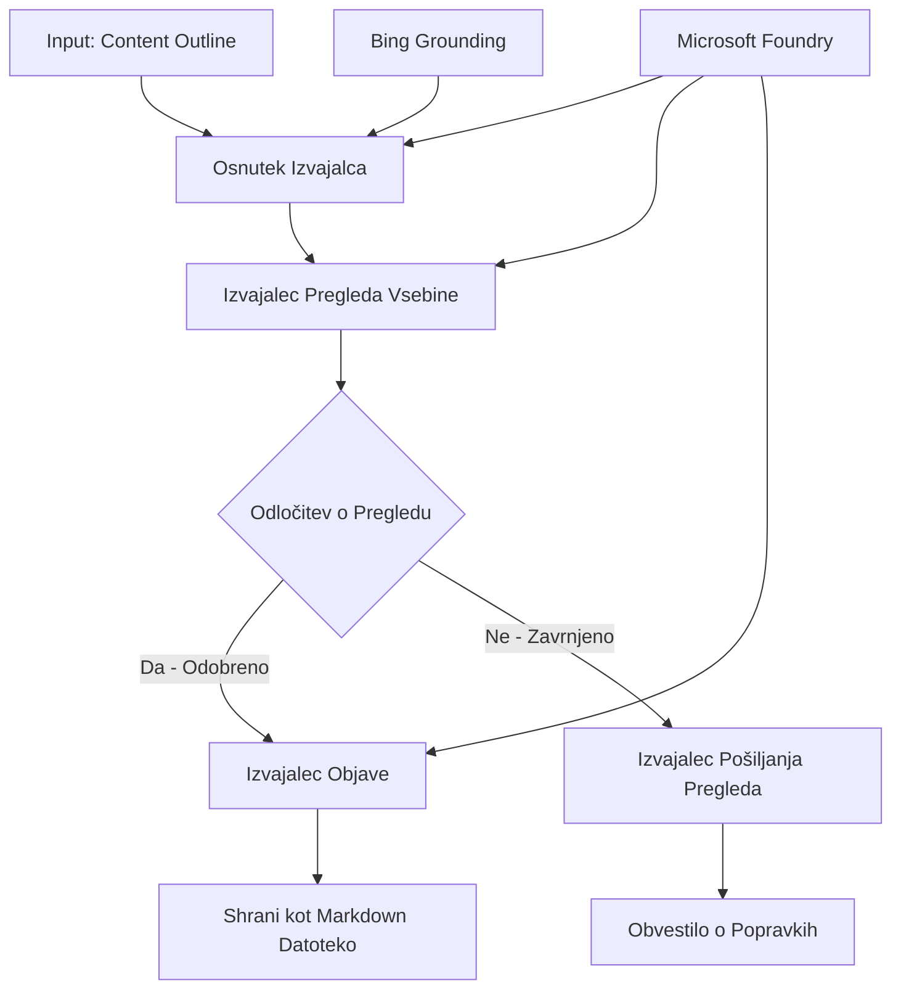

# 🔀 Pogojni agentni delovni tokovi z Microsoft Foundry (.NET)

## 📋 Vadnica o inteligentnih delovnih tokovih, ki temeljijo na odločitvah

Ta zvezek prikazuje **vzorce pogojnih delovnih tokov** z uporabo Microsoft Foundry in Microsoft Agent Framework za .NET. Naučili se boste, kako zgraditi zapletene delovne tokove, ki temeljijo na odločitvah, ki inteligentno usmerjajo procesiranje na podlagi analize AI, poslovnih pravil in dinamičnih pogojev za avtomatizacijo na ravni podjetja.

## 🎯 Cilji učenja

### 🧠 **Inteligentna arhitektura odločanja**
- **Implementacija pogojevne logike**: Zgradite kompleksna drevesa odločitev z več razvejitvenimi točkami
- **Usmerjanje na osnovi AI**: Uporabite modele Microsoft Foundry za sprejemanje inteligentnih odločitev o usmerjanju
- **Dinamična prilagoditev delovnega toka**: Spreminjajte vedenje delovnega toka na podlagi analize in pogojev med izvajanjem
- **Integracija poslovnih pravil**: Vdelajte poslovno logiko in zahteve skladnosti v delovne tokove

### 🔀 **Napredni pogojevni vzorci**
- **Odločanje na več kriterijih**: Ocenjujte več dejavnikov za odločanje o usmerjanju
- **Obdelava, ki upošteva kontekst**: Sprejemajte odločitve na podlagi zbranega konteksta in zgodovine delovnega toka
- **Prilagodljiva sprememba delovnega toka**: Dinamično prilagajajte poti procesiranja glede na pogoje v realnem času
- **Integracija pogonskega mehanizma pravil**: Implementirajte sofisticirane poslovne pogonske mehanizme pravil znotraj delovnih tokov

### 🏢 **Podjetniške pogojevne aplikacije**
- **Klasifikacija in usmerjanje dokumentov**: Samodejno klasificirajte in usmerjajte dokumente v ustrezne delovne tokove
- **Triaža podpore strankam**: Inteligentno usmerjanje poizvedb strank v specializirane ekipe za obdelavo
- **Obdelava skladnosti in tveganj**: Uporabite različne postopke preverjanja in pregleda na podlagi ocene tveganja
- **Delovni tokovi zagotavljanja kakovosti**: Usmerjajte vsebino skozi ustrezne postopke pregleda na podlagi meril kakovosti

## ⚙️ Predpogoji in namestitev

### 📦 **Zahtevani paketi NuGet**

Napredni paketi za pogojno procesiranje delovnih tokov:

```xml
<!-- Core AI Framework -->
<PackageReference Include="Microsoft.Extensions.AI" Version="9.9.0" />

<!-- Azure AI Agents with Persistent State -->
<PackageReference Include="Azure.AI.Agents.Persistent" Version="1.2.0-beta.5" />

<!-- Azure Identity and Utilities -->
<PackageReference Include="Azure.Identity" Version="1.15.0" />
<PackageReference Include="System.Linq.Async" Version="6.0.3" />
<PackageReference Include="DotNetEnv" Version="3.1.1" />

<!-- Local Workflow Framework References -->
<!-- Microsoft.Agents.Workflows.dll - Advanced workflow orchestration -->
<!-- Microsoft.Agents.AI.AzureAI.dll - Microsoft Foundry integration -->
<!-- Microsoft.Agents.AI.dll - Core agent abstractions -->
```

### 🔑 **Konfiguracija Microsoft Foundry**

**Zahtevani viri Azure:**
- Delovno okolje Microsoft Foundry z modeli pogojevnega procesiranja
- Azure naročnina z ustreznimi kvotami in dovoljenji za računske vire
- Deployed AI modeli za sprejemanje odločitev in analizo vsebine
- (Neobvezno) Povezava Bing Search API za zmožnosti utemeljevanja

**Konfiguracija okolja (.env datoteka):**
```env
# Microsoft Foundry Configuration
AZURE_AI_PROJECT_ENDPOINT=https://your-project.cognitiveservices.azure.com/
BING_CONNECTION_ID=your-bing-connection-id
```

**Nastavitev avtentikacije:**
```csharp
// Azure CLI or Managed Identity authentication
using Azure.Identity;
var credential = new AzureCliCredential();

// Load environment configuration
DotNetEnv.Env.Load("../../../.env");
```

### 🏗️ **Arhitektura pogojevnega delovnega toka**



**Ključne komponente:**
- **Izvajalec osnutkov**: AI agent, ki ustvarja začetne osnutke vsebine iz načrtov
- **Izvajalec pregleda vsebine**: AI agent, ki ocenjuje kakovost in skladnost osnutkov
- **Pogojevno usmerjanje**: Logika odločanja, ki usmerja na podlagi rezultatov pregleda
- **Poti objave/pregleda**: Ločene poti procesiranja za odobreno proti zavrnjeni vsebini
- **Upravljanje stanja**: Ohranja kontekst vsebine in pregleda skozi ves delovni tok

## 🎨 **Vzorci oblikovanja pogojevnih delovnih tokov**

### 📋 **Produkcija vsebine z vrati kakovosti**
```
Outline → Draft Creation → Quality Review → {Approve: Publish | Reject: Revise}
```

### 🎯 **Obdelava dokumentov na podlagi tveganja**
```
Document → Risk Assessment → {Low: Standard | High: Enhanced Review}
```

### 🔍 **Inteligentno usmerjanje podpore strankam**
```
Customer Query → Analysis → {Simple: FAQ Bot | Complex: Human Agent}
```

### 💼 **Delovni tokovi, ki temeljijo na skladnosti**
```
Content → Compliance Check → {Pass: Publish | Fail: Legal Review}
```

## 🏢 **Podjetniške koristi pogojevnih delovnih tokov**

### 🎯 **Inteligentna avtomatizacija**
- **Pametno sprejemanje odločitev**: Usmerjanje na podlagi analize vsebine in konteksta, ki ga poganja AI
- **Prilagodljivo procesiranje**: Delovni tokovi, ki se samodejno prilagajajo glede na spreminjajoče se pogoje
- **Izvajanje poslovnih pravil**: Samodejna uporaba kompleksne poslovne logike in politik
- **Kontekstualno usmerjanje**: Odločitve na podlagi celotne zgodovine delovnega toka in nabranega konteksta

### 📈 **Operativna odličnost**
- **Optimizirana dodelitev virov**: Usmeri delo najbolj ustreznim strokovnjakom in procesom
- **Zmanjšano ročno posredovanje**: Avtomatizirano odločanje zmanjšuje potrebo po človeškem usmerjanju
- **Hitrejši časi reševanja**: Neposredno usmerjanje k primernim strokovnjakom in zmogljivostim procesiranja
- **Dosledna uporaba**: Enotna uporaba poslovnih pravil in kriterijev odločanja

### 🛡️ **Upravljanje tveganj in skladnost**
- **Samodejna ocena tveganja**: AI-poganjano vrednotenje vsebine in nivojev tveganja situacije
- **Uveljavljanje skladnosti**: Samodejno usmerjanje skozi zahtevane regulativne postopke
- **Uporaba varnostnih protokolov**: Izboljšane varnostne ukrepe glede na oceno tveganja
- **Vzdrževanje sledljivosti revizije**: Popolna dokumentacija odločitev o usmerjanju in utemeljitev

### 📊 **Analitika in nenehno izboljševanje**
- **Analiza odločitev**: Spremljanje učinkovitosti in natančnosti odločitev o usmerjanju
- **Prepoznavanje vzorcev**: Prepoznavanje trendov in vzorcev v odločitvah o usmerjanju skozi čas
- **Optimizacija zmogljivosti**: Stalno izboljševanje kriterijev odločanja in učinkovitosti usmerjanja
- **Poslovna inteligenca**: Vpogledi v značilnosti vsebine in zahteve za procesiranje

### 🔧 **Tehnična odličnost**
- **Vztrajno upravljanje stanja**: Ohranjanje kompleksnega stanja med izvajanjem delovnega toka
- **Razširljiva arhitektura**: Obvladovanje potreb po pogojnem procesiranju z velikim obsegom
- **Zmožnosti integracije**: Gladka integracija z obstoječimi poslovnimi sistemi in procesi
- **Nadzor in opazovanje**: Celovito spremljanje uspešnosti delovnega toka in odločitev

Zgradimo inteligentne, na odločitvah temelječe delovne tokove podjetja z .NET! 🚀

## 💻 Zaganjanje kode

Popolna implementacija je na voljo v `04.dotnet-agent-framework-workflow-aifoundry-condition.cs`. Ta prikazuje **delovni tok produkcije vsebine z vrati kakovosti**:

### 🏗️ **Arhitektura delovnega toka**

```
Content Outline → Draft Creation → Quality Review → Conditional Routing:
                                                      ├─ Approved (>200 words) → Publish
                                                      └─ Rejected (<200 words) → Review Notification
```

**Agenti v delovnem toku:**
1. **Evangelist Agent**: Ustvarja osnutke vadnice iz načrtov z uporabo Bing utemeljevanja
2. **Agent za pregled vsebine**: Ocenjuje kakovost osnutkov (število besed, popolnost)
3. **Agent izdajatelj**: Shrani odobreno vsebino kot datoteke Markdown z žigi časa

**Prilagojeni izvajalci:**
1. **DraftExecutor**: Usmerja ustvarjanje osnutkov
2. **ContentReviewExecutor**: Izvaja ocenjevanje kakovosti
3. **PublishExecutor**: Obravnava objavo odobrene vsebine
4. **SendReviewExecutor**: Upravljanje obvestil o zavrnjeni vsebini

### 🚀 Zagon primera

**Predpogoj:**
- Konfigurirano delovno okolje Microsoft Foundry
- Avtentikacija v Azure CLI (`az login`)
- (Neobvezno) Povezava Bing Search za utemeljevanje

```bash
# Naredite skripto izvršljivo (Unix/Linux/macOS)
chmod +x 04.dotnet-agent-framework-workflow-aifoundry-condition.cs

# Zaženite pogojno delovni tok
./04.dotnet-agent-framework-workflow-aifoundry-condition.cs
```

Ali na Windows:
```powershell
dotnet run 04.dotnet-agent-framework-workflow-aifoundry-condition.cs
```

### 📝 Pričakovani izhod

Delovni tok bo:
1. **Ustvaril agente**: Inicializira tri specializirane agente Microsoft Foundry
2. **Generiral osnutek**: Evangelistični agent ustvari osnutek vadnice iz načrta
3. **Pregledal vsebino**: Agent za pregled vsebine oceni kakovost osnutka
4. **Pogojevno usmerjanje**:
   - **Če odobreno (>200 besed)**: Izvajalec objave shrani kot Markdown datoteko
   - **Če zavrnjeno (<200 besed)**: Pošlji obvestilo o pregledu
5. **Prikaz rezultatov**: Prikaže končni izid delovnega toka

### 🔧 Možnosti prilagoditve

**Spremeni kriterije pregleda:**
```csharp
const string ContentReviewerInstructions = @"
You are a content reviewer...
1. Check if content is more than 500 words (instead of 200)
2. Verify technical accuracy
3. Ensure proper formatting
...";
```

**Dodaj več pogojevnih poti:**
```csharp
var workflow = new WorkflowBuilder(draftExecutor)
    .AddEdge(draftExecutor, contentReviewerExecutor)
    .AddEdge(contentReviewerExecutor, publishExecutor, condition: GetCondition("Excellent"))
    .AddEdge(contentReviewerExecutor, editExecutor, condition: GetCondition("Good"))
    .AddEdge(contentReviewerExecutor, sendReviewerExecutor, condition: GetCondition("Poor"))
    .Build();
```

**Spremeni zahteve za vsebino:**
```csharp
string OUTLINE_Content = @"
# Your Custom Topic
## Section 1
https://your-reference-url
## Section 2
...
";
```

### 🎯 Praktične uporabe

Ta vzorec pogojevnega delovnega toka je idealen za:
- **Sistemi za upravljanje vsebine**: Avtomatizirani uredniški delovni tokovi z vrati kakovosti
- **Obdelava dokumentov**: Usmerjanje dokumentov na podlagi klasifikacije in skladnosti
- **Podpora strankam**: Inteligentno usmerjanje zahtevkov glede na kompleksnost in nujnost
- **Pravni pregled**: Usmerjanje pogodb na podlagi ocene tveganja in vrednosti
- **HR procesi**: Usmerjanje vlog skozi ustrezne presejalne delovne tokove

### 🔍 Razumevanje pogojevne logike

**Funkcija pogoja:**
```csharp
public Func<object?, bool> GetCondition(string expectedResult) =>
    reviewResult => reviewResult is ReviewResult review && review.Result == expectedResult;
```

Ta funkcija ustvari predikat, ki:
1. Preveri, ali je rezultat tipa `ReviewResult`
2. Primerja lastnost `Result` z pričakovano vrednostjo
3. Vrne resnično/ne resnično za določanje usmerjanja

**Robovi delovnega toka s pogoji:**
```csharp
.AddEdge(contentReviewerExecutor, publishExecutor, condition: GetCondition("Yes"))
.AddEdge(contentReviewerExecutor, sendReviewerExecutor, condition: GetCondition("No"))
```

### 📊 Napredne funkcije

**Validacija JSON shem:**
Delovni tok uporablja JSON sheme za zagotavljanje strukturiranih odgovorov:

```csharp
// Define response structure
public class ReviewResult
{
    [JsonPropertyName("review_result")]
    public string Result { get; set; } = string.Empty;
    
    [JsonPropertyName("reason")]
    public string Reason { get; set; } = string.Empty;
    
    [JsonPropertyName("draft_content")]
    public string DraftContent { get; set; } = string.Empty;
}

// Apply to agent
ResponseFormat = ChatResponseFormat.ForJsonSchema(
    AIJsonUtilities.CreateJsonSchema(typeof(ReviewResult)), 
    "ReviewResult", 
    "Review Result From DraftContent"
)
```

**Integracija Bing utemeljevanja:**
Evangelistični agent uporablja Bing utemeljevanje za dostop do informacij v realnem času:

```csharp
var bingGroundingConfig = new BingGroundingSearchConfiguration(bing_conn_id);
BingGroundingToolDefinition bingGroundingTool = new(
    new BingGroundingSearchToolParameters([bingGroundingConfig])
);
```

To agentu omogoča sledenje URL povezavam v načrtu in pridobivanje aktualnih informacij.

### 🛡️ Ravnanje z napakami

Delovni tok vključuje robustno obravnavo napak za zavrnjeno vsebino:
- Neuspehi pregleda sprožijo alternativno pot
- Obvestila zagotavljajo jasne razloge za zavrnitev
- Vsebina je ohranjena za revizijo

### 🔄 Razširjanje delovnega toka

**Dodaj zanko revizije:**
Ustvari povratno zanko, ki samodejno ponovno ustvarja osnutke vsebine:

```csharp
.AddEdge(contentReviewerExecutor, publishExecutor, condition: GetCondition("Yes"))
.AddEdge(contentReviewerExecutor, draftExecutor, condition: GetCondition("No")) // Loop back
```

**Implementiraj večnivojski pregled:**
Dodaj več stopenj pregleda z različnimi kriteriji:

```csharp
.AddEdge(draftExecutor, technicalReviewer)
.AddEdge(technicalReviewer, editorialReviewer, condition: GetCondition("TechPass"))
.AddEdge(editorialReviewer, publishExecutor, condition: GetCondition("EditPass"))
```

Ta pogojni vzorec delovnega toka zagotavlja temelje za gradnjo sofisticiranih, inteligentnih avtomatizacijskih sistemov podjetij! 🚀

---

<!-- CO-OP TRANSLATOR DISCLAIMER START -->
**Omejitev odgovornosti**:
Ta dokument je bil preveden z uporabo AI prevajalske storitve [Co-op Translator](https://github.com/Azure/co-op-translator). Čeprav si prizadevamo za natančnost, vas prosimo, da upoštevate, da avtomatizirani prevodi lahko vsebujejo napake ali netočnosti. Izvirni dokument v njegovem izvirnem jeziku je treba obravnavati kot avtoritativni vir. Za kritične informacije je priporočljiv strokovni človeški prevod. Ne odgovarjamo za morebitna nesporazume ali napačne interpretacije, ki izhajajo iz uporabe tega prevoda.
<!-- CO-OP TRANSLATOR DISCLAIMER END -->