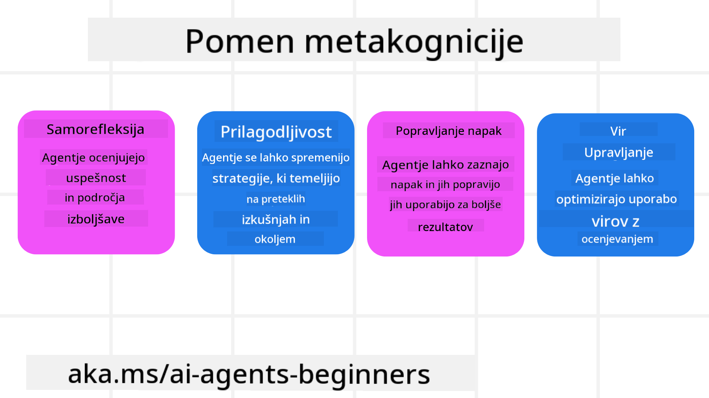
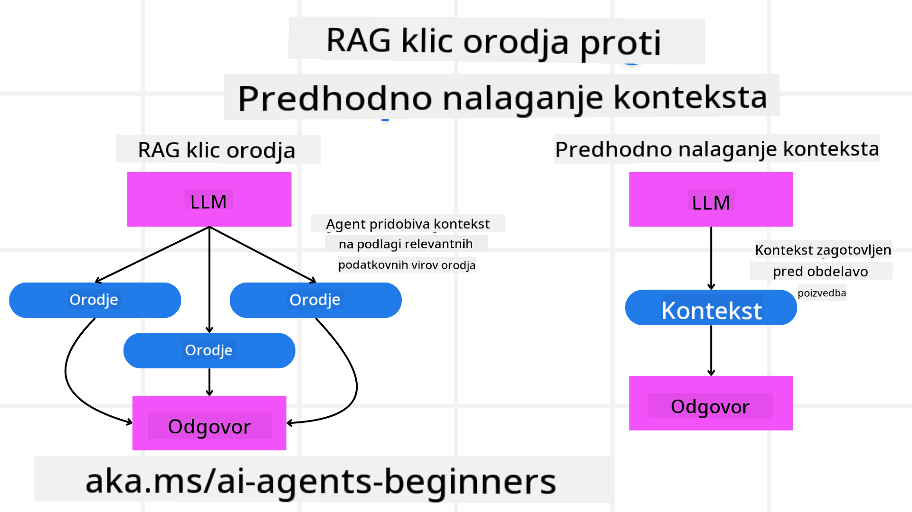

<!--
CO_OP_TRANSLATOR_METADATA:
{
  "original_hash": "5f0deef171fc3a68d5d3d770a8bfb03d",
  "translation_date": "2025-08-30T09:15:19+00:00",
  "source_file": "09-metacognition/README.md",
  "language_code": "sl"
}
-->
[](https://youtu.be/His9R6gw6Ec?si=3_RMb8VprNvdLRhX)

> _(Kliknite zgornjo sliko za ogled videoposnetka te lekcije)_
# Metakognicija pri AI agentih

## Uvod

Dobrodošli v lekciji o metakogniciji pri AI agentih! To poglavje je zasnovano za začetnike, ki jih zanima, kako lahko AI agenti razmišljajo o svojih lastnih miselnih procesih. Po koncu te lekcije boste razumeli ključne koncepte in pridobili praktične primere za uporabo metakognicije pri oblikovanju AI agentov.

## Cilji učenja

Po zaključku te lekcije boste sposobni:

1. Razumeti posledice zank razmišljanja pri definicijah agentov.
2. Uporabljati tehnike načrtovanja in evalvacije za pomoč pri samopopravljanju agentov.
3. Ustvariti lastne agente, ki so sposobni manipulirati s kodo za dosego nalog.

## Uvod v metakognicijo

Metakognicija se nanaša na višje kognitivne procese, ki vključujejo razmišljanje o lastnem razmišljanju. Za AI agente to pomeni sposobnost ocenjevanja in prilagajanja svojih dejanj na podlagi samozavedanja in preteklih izkušenj. Metakognicija ali "razmišljanje o razmišljanju" je pomemben koncept pri razvoju agentnih AI sistemov. Vključuje zavedanje AI sistemov o lastnih notranjih procesih ter sposobnost spremljanja, regulacije in prilagajanja svojega vedenja. Podobno kot mi, ko "preberemo prostor" ali analiziramo problem. To samozavedanje lahko pomaga AI sistemom pri sprejemanju boljših odločitev, prepoznavanju napak in izboljšanju njihovega delovanja skozi čas – kar nas ponovno povezuje s Turingovim testom in razpravo o tem, ali bo AI prevzel nadzor.

V kontekstu agentnih AI sistemov lahko metakognicija pomaga pri reševanju več izzivov, kot so:
- Transparentnost: Zagotavljanje, da lahko AI sistemi pojasnijo svoje razmišljanje in odločitve.
- Razmišljanje: Izboljšanje sposobnosti AI sistemov za sintezo informacij in sprejemanje premišljenih odločitev.
- Prilagodljivost: Omogočanje AI sistemom, da se prilagodijo novim okoljem in spreminjajočim se razmeram.
- Percepcija: Izboljšanje natančnosti AI sistemov pri prepoznavanju in interpretaciji podatkov iz okolja.

### Kaj je metakognicija?

Metakognicija ali "razmišljanje o razmišljanju" je višji kognitivni proces, ki vključuje samozavedanje in samoregulacijo lastnih kognitivnih procesov. Na področju AI metakognicija omogoča agentom, da ocenjujejo in prilagajajo svoje strategije in dejanja, kar vodi do izboljšanih sposobnosti reševanja problemov in sprejemanja odločitev. Z razumevanjem metakognicije lahko oblikujete AI agente, ki so ne le bolj inteligentni, temveč tudi bolj prilagodljivi in učinkoviti. Pri pravi metakogniciji bi AI eksplicitno razmišljal o svojem lastnem razmišljanju.

Primer: “Dajal sem prednost cenejšim letom, ker… Morda sem spregledal direktne lete, zato naj ponovno preverim.”
Spremljanje, kako ali zakaj je izbral določeno pot.
- Opazovanje, da je naredil napake, ker se je preveč zanašal na uporabniške preference iz preteklosti, zato spremeni svojo strategijo odločanja, ne le končno priporočilo.
- Diagnosticiranje vzorcev, kot je: “Kadar koli uporabnik omeni ‘preveč gneče,’ ne bi smel le odstraniti določenih znamenitosti, temveč tudi prepoznati, da je moja metoda izbire ‘najboljših znamenitosti’ pomanjkljiva, če vedno rangiram po priljubljenosti.”

### Pomen metakognicije pri AI agentih

Metakognicija igra ključno vlogo pri oblikovanju AI agentov iz več razlogov:



- Samorefleksija: Agenti lahko ocenijo svojo uspešnost in prepoznajo področja za izboljšanje.
- Prilagodljivost: Agenti lahko prilagodijo svoje strategije na podlagi preteklih izkušenj in spreminjajočih se okolij.
- Popravljanje napak: Agenti lahko samostojno zaznajo in popravijo napake, kar vodi do natančnejših rezultatov.
- Upravljanje virov: Agenti lahko optimizirajo uporabo virov, kot so čas in računalniška moč, z načrtovanjem in evalvacijo svojih dejanj.

## Komponente AI agenta

Preden se poglobimo v metakognitivne procese, je pomembno razumeti osnovne komponente AI agenta. AI agent običajno vključuje:

- Osebnost: Osebnost in značilnosti agenta, ki določajo, kako komunicira z uporabniki.
- Orodja: Zmožnosti in funkcije, ki jih agent lahko izvaja.
- Spretnosti: Znanje in strokovnost, ki jih agent poseduje.

Te komponente delujejo skupaj, da ustvarijo "enoto strokovnosti," ki lahko izvaja specifične naloge.

**Primer**:
Razmislite o potovalnem agentu, ki ne le načrtuje vaš dopust, temveč tudi prilagaja svojo pot na podlagi podatkov v realnem času in preteklih izkušenj strank.

### Primer: Metakognicija pri storitvi potovalnega agenta

Predstavljajte si, da oblikujete storitev potovalnega agenta, ki jo poganja AI. Ta agent, "Potovalni agent," pomaga uporabnikom pri načrtovanju njihovih počitnic. Da bi vključili metakognicijo, mora Potovalni agent ocenjevati in prilagajati svoja dejanja na podlagi samozavedanja in preteklih izkušenj. Tukaj je, kako bi metakognicija lahko igrala vlogo:

#### Trenutna naloga

Trenutna naloga je pomagati uporabniku načrtovati potovanje v Pariz.

#### Koraki za dokončanje naloge

1. **Zbiranje uporabniških preferenc**: Vprašajte uporabnika o njegovih datumih potovanja, proračunu, interesih (npr. muzeji, kulinarika, nakupovanje) in morebitnih posebnih zahtevah.
2. **Pridobivanje informacij**: Poiščite možnosti letov, nastanitev, znamenitosti in restavracij, ki ustrezajo uporabnikovim preferencam.
3. **Generiranje priporočil**: Pripravite personaliziran itinerar z informacijami o letih, rezervacijah hotelov in predlaganimi dejavnostmi.
4. **Prilagoditev na podlagi povratnih informacij**: Vprašajte uporabnika za povratne informacije o priporočilih in naredite potrebne prilagoditve.

#### Potrebni viri

- Dostop do baz podatkov za rezervacijo letov in hotelov.
- Informacije o pariških znamenitostih in restavracijah.
- Podatki o povratnih informacijah uporabnikov iz preteklih interakcij.

#### Izkušnje in samorefleksija

Potovalni agent uporablja metakognicijo za ocenjevanje svoje uspešnosti in učenje iz preteklih izkušenj. Na primer:

1. **Analiza povratnih informacij uporabnikov**: Potovalni agent pregleda povratne informacije uporabnikov, da ugotovi, katera priporočila so bila dobro sprejeta in katera ne. Svoje prihodnje predloge prilagodi temu.
2. **Prilagodljivost**: Če je uporabnik prej omenil, da ne mara gneče, bo Potovalni agent v prihodnje izogibal priporočanju priljubljenih turističnih točk v času največje gneče.
3. **Popravljanje napak**: Če je Potovalni agent v preteklosti naredil napako, na primer predlagal hotel, ki je bil že polno zaseden, se nauči bolj temeljito preverjati razpoložljivost, preden poda priporočila.

#### Praktični primer za razvijalce

Tukaj je poenostavljen primer kode Potovalnega agenta, ki vključuje metakognicijo:

```python
class Travel_Agent:
    def __init__(self):
        self.user_preferences = {}
        self.experience_data = []

    def gather_preferences(self, preferences):
        self.user_preferences = preferences

    def retrieve_information(self):
        # Search for flights, hotels, and attractions based on preferences
        flights = search_flights(self.user_preferences)
        hotels = search_hotels(self.user_preferences)
        attractions = search_attractions(self.user_preferences)
        return flights, hotels, attractions

    def generate_recommendations(self):
        flights, hotels, attractions = self.retrieve_information()
        itinerary = create_itinerary(flights, hotels, attractions)
        return itinerary

    def adjust_based_on_feedback(self, feedback):
        self.experience_data.append(feedback)
        # Analyze feedback and adjust future recommendations
        self.user_preferences = adjust_preferences(self.user_preferences, feedback)

# Example usage
travel_agent = Travel_Agent()
preferences = {
    "destination": "Paris",
    "dates": "2025-04-01 to 2025-04-10",
    "budget": "moderate",
    "interests": ["museums", "cuisine"]
}
travel_agent.gather_preferences(preferences)
itinerary = travel_agent.generate_recommendations()
print("Suggested Itinerary:", itinerary)
feedback = {"liked": ["Louvre Museum"], "disliked": ["Eiffel Tower (too crowded)"]}
travel_agent.adjust_based_on_feedback(feedback)
```

#### Zakaj je metakognicija pomembna

- **Samorefleksija**: Agenti lahko analizirajo svojo uspešnost in prepoznajo področja za izboljšanje.
- **Prilagodljivost**: Agenti lahko prilagodijo strategije na podlagi povratnih informacij in spreminjajočih se razmer.
- **Popravljanje napak**: Agenti lahko samostojno zaznajo in popravijo napake.
- **Upravljanje virov**: Agenti lahko optimizirajo uporabo virov, kot so čas in računalniška moč.

Z vključitvijo metakognicije lahko Potovalni agent ponudi bolj personalizirana in natančna potovalna priporočila, kar izboljša celotno uporabniško izkušnjo.

---

## 2. Načrtovanje pri agentih

Načrtovanje je ključna komponenta vedenja AI agenta. Vključuje oblikovanje korakov, potrebnih za dosego cilja, ob upoštevanju trenutnega stanja, virov in možnih ovir.

### Elementi načrtovanja

- **Trenutna naloga**: Jasno definirajte nalogo.
- **Koraki za dokončanje naloge**: Razdelite nalogo na obvladljive korake.
- **Potrebni viri**: Identificirajte potrebne vire.
- **Izkušnje**: Uporabite pretekle izkušnje za informiranje načrtovanja.

**Primer**:
Tukaj so koraki, ki jih mora Potovalni agent izvesti, da učinkovito pomaga uporabniku pri načrtovanju potovanja:

### Koraki za Potovalnega agenta

1. **Zbiranje uporabniških preferenc**
   - Vprašajte uporabnika za podrobnosti o datumih potovanja, proračunu, interesih in morebitnih posebnih zahtevah.
   - Primeri: "Kdaj načrtujete potovanje?" "Kakšen je vaš proračun?" "Katere dejavnosti vas zanimajo na počitnicah?"

2. **Pridobivanje informacij**
   - Poiščite ustrezne možnosti potovanja na podlagi uporabniških preferenc.
   - **Leti**: Poiščite razpoložljive lete znotraj uporabnikovega proračuna in želenih datumov potovanja.
   - **Nastanitve**: Najdite hotele ali najemne nepremičnine, ki ustrezajo uporabnikovim željam glede lokacije, cene in udobja.
   - **Znamenitosti in restavracije**: Identificirajte priljubljene znamenitosti, dejavnosti in možnosti prehranjevanja, ki se ujemajo z uporabnikovimi interesi.

3. **Generiranje priporočil**
   - Zberite pridobljene informacije v personaliziran itinerar.
   - Zagotovite podrobnosti, kot so možnosti letov, rezervacije hotelov in predlagane dejavnosti, pri čemer poskrbite, da so priporočila prilagojena uporabnikovim željam.

4. **Predstavitev itinerarja uporabniku**
   - Delite predlagani itinerar z uporabnikom za pregled.
   - Primer: "Tukaj je predlagan itinerar za vaše potovanje v Pariz. Vključuje podrobnosti o letih, rezervacijah hotelov in seznam priporočenih dejavnosti ter restavracij. Sporočite mi svoje mnenje!"

5. **Zbiranje povratnih informacij**
   - Vprašajte uporabnika za povratne informacije o predlaganem itinerarju.
   - Primeri: "Ali vam ustrezajo možnosti letov?" "Ali je hotel primeren za vaše potrebe?" "Ali želite dodati ali odstraniti kakšne dejavnosti?"

6. **Prilagoditev na podlagi povratnih informacij**
   - Prilagodite itinerar na podlagi uporabnikovih povratnih informacij.
   - Naredite potrebne spremembe pri priporočilih za lete, nastanitve in dejavnosti, da bolje ustrezajo uporabnikovim željam.

7. **Končna potrditev**
   - Predstavite posodobljen itinerar uporabniku za končno potrditev.
   - Primer: "Na podlagi vaših povratnih informacij sem naredil prilagoditve. Tukaj je posodobljen itinerar. Ali je vse v redu?"

8. **Rezervacija in potrditev**
   - Ko uporabnik odobri itinerar, nadaljujte z rezervacijo letov, nastanitev in vnaprej načrtovanih dejavnosti.
   - Pošljite uporabniku podrobnosti o potrditvi.

9. **Nudenje stalne podpore**
   - Bodite na voljo za pomoč uporabniku pri morebitnih spremembah ali dodatnih zahtevah pred in med potovanjem.
   - Primer: "Če potrebujete dodatno pomoč med potovanjem, me lahko kadar koli kontaktirate!"

### Primer interakcije

```python
class Travel_Agent:
    def __init__(self):
        self.user_preferences = {}
        self.experience_data = []

    def gather_preferences(self, preferences):
        self.user_preferences = preferences

    def retrieve_information(self):
        flights = search_flights(self.user_preferences)
        hotels = search_hotels(self.user_preferences)
        attractions = search_attractions(self.user_preferences)
        return flights, hotels, attractions

    def generate_recommendations(self):
        flights, hotels, attractions = self.retrieve_information()
        itinerary = create_itinerary(flights, hotels, attractions)
        return itinerary

    def adjust_based_on_feedback(self, feedback):
        self.experience_data.append(feedback)
        self.user_preferences = adjust_preferences(self.user_preferences, feedback)

# Example usage within a booing request
travel_agent = Travel_Agent()
preferences = {
    "destination": "Paris",
    "dates": "2025-04-01 to 2025-04-10",
    "budget": "moderate",
    "interests": ["museums", "cuisine"]
}
travel_agent.gather_preferences(preferences)
itinerary = travel_agent.generate_recommendations()
print("Suggested Itinerary:", itinerary)
feedback = {"liked": ["Louvre Museum"], "disliked": ["Eiffel Tower (too crowded)"]}
travel_agent.adjust_based_on_feedback(feedback)
```

## 3. Korektivni RAG sistem

Najprej začnimo z razumevanjem razlike med orodjem RAG in predhodnim nalaganjem konteksta.



### Pridobitveno-podprta generacija (RAG)

RAG združuje sistem za pridobivanje informacij z generativnim modelom. Ko je podano vprašanje, sistem za pridobivanje informacij poišče ustrezne dokumente ali podatke iz zunanjega vira, pridobljene informacije pa se uporabijo za dopolnitev vnosa generativnega modela. To pomaga modelu ustvariti bolj natančne in kontekstualno ustrezne odgovore.

V RAG sistemu agent pridobi ustrezne informacije iz baze znanja in jih uporabi za generiranje ustreznih odgovorov ali dejanj.

### Korektivni pristop RAG

Korektivni pristop RAG se osredotoča na uporabo tehnik RAG za popravljanje napak in izboljšanje natančnosti AI agentov. To vključuje:

1. **Tehnika pozivanja**: Uporaba specifičnih pozivov za usmerjanje agenta pri pridobivanju ustreznih informacij.
2. **Orodje**: Implementacija algoritmov in mehanizmov, ki omogočajo agentu ocenjevanje ustreznosti pridobljenih informacij in generiranje natančnih odgovorov.
3. **Evalvacija**: Nenehno ocenjevanje uspešnosti agenta in prilagoditve za izboljšanje natančnosti in učinkovitosti.

#### Primer: Korektivni RAG pri iskalnem agentu

Razmislite o iskalnem agentu, ki pridobiva informacije s spleta za odgovarjanje na uporabniška vprašanja. Korektivni pristop RAG lahko vključuje:

1. **Tehnika pozivanja**: Oblikovanje iskalnih poizvedb na podlagi uporabniškega vnosa.
2. **Orodje**: Uporaba algoritmov za obdelavo naravnega jezika in strojnega učenja za razvrščanje in filtriranje rezultatov iskanja.
3. **Evalvacija**: Analiza povratnih informacij uporabnikov za prepoznavanje in popravljanje netočnosti v pridobljenih informacijah.

### Korektivni RAG pri Potovalnem agentu

Korektivni RAG (Pridobitveno-podprta generacija) izboljša sposobnost AI za pridobivanje in generiranje informacij ter hkrati popravlja morebitne netočnosti. Poglejmo, kako lahko Potovalni agent uporabi korektivni pristop RAG za zagotavljanje natančnejših in ustreznejših potovalnih priporočil.

To vključuje:

- **Tehnika pozivanja:** Uporaba specifičnih pozivov za usmerjanje agenta pri pridobivanju ustreznih informacij.
- **Orodje:** Implementacija algoritmov in mehanizmov, ki omogočajo agentu ocenjevanje ustreznosti pridobljenih informacij in generiranje natančnih odgovorov.
- **Evalvacija:** Nenehno ocenjevanje uspešnosti agenta in prilagoditve za izboljšanje natančnosti in učinkovitosti.

#### Koraki za implementacijo korektivnega RAG pri Potovalnem agentu

1. **Začetna interakcija z uporabnikom**
   - Potovalni agent zbere začetne preference uporabnika, kot so destinacija, datumi potovanja, proračun in interesi.
   - Primer:

     ```python
     preferences = {
         "destination": "Paris",
         "dates": "2025-04-01 to 2025-04-10",
         "budget": "moderate",
         "interests": ["museums", "cuisine"]
     }
     ```

2. **Pridobivanje informacij**
   - Potovalni agent pridobi informacije o letih, nastanitvah, znamenitostih in restavracijah na podlagi uporabniških preferenc.
   - Primer:

     ```python
     flights = search_flights(preferences)
     hotels = search_hotels(preferences)
     attractions = search_attractions(preferences)
     ```

3. **Generiranje začetnih priporočil**
   - Potovalni agent uporabi pridobljene informacije za generiranje personaliziranega itinerarja.
   - Primer:

     ```python
     itinerary = create_itinerary(flights, hotels, attractions)
     print("Suggested Itinerary:", itinerary)
     ```

4. **Zbiranje povratnih informacij uporabnika**
   - Potovalni agent vpraša uporabnika za povratne informacije o začetnih priporočilih.
   - Primer:

     ```python
     feedback = {
         "liked": ["Louvre Museum"],
         "disliked": ["Eiffel Tower (too crowded)"]
     }
     ```

5. **Proces korektivnega RAG**
   - **Tehnika pozivanja**: Potovalni agent oblikuje nove iskalne poizvedbe na podlagi povratnih informacij uporabnika.

```python
class Travel_Agent:
    def __init__(self):
        self.user_preferences = {}
        self.experience_data = []

    def gather_preferences(self, preferences):
        self.user_preferences = preferences

    def retrieve_information(self):
        flights = search_flights(self.user_preferences)
        hotels = search_hotels(self.user_preferences)
        attractions = search_attractions(self.user_preferences)
        return flights, hotels, attractions

    def generate_recommendations(self):
        flights, hotels, attractions = self.retrieve_information()
        itinerary = create_itinerary(flights, hotels, attractions)
        return itinerary

    def adjust_based_on_feedback(self, feedback):
        self.experience_data.append(feedback)
        self.user_preferences = adjust_preferences(self.user_preferences, feedback)
        new_itinerary = self.generate_recommendations()
        return new_itinerary

# Example usage
travel_agent = Travel_Agent()
preferences = {
    "destination": "Paris",
    "dates": "2025-04-01 to 2025-04-10",
    "budget": "moderate",
    "interests": ["museums", "cuisine"]
}
travel_agent.gather_preferences(preferences)
itinerary = travel_agent.generate_recommendations()
print("Suggested Itinerary:", itinerary)
feedback = {"liked": ["Louvre Museum"], "disliked": ["Eiffel Tower (too crowded)"]}
new_itinerary = travel_agent.adjust_based_on_feedback(feedback)
print("Updated Itinerary:", new_itinerary)
```

### Predhodno nalaganje konteksta

Predhodno nalaganje konteksta vključuje nalaganje ustreznih informacij ali ozadja v model, preden ta obdela poizvedbo. To pomeni, da ima model že od začetka dostop do teh informacij, kar mu omogoča, da ustvari bolj informirane odgovore, ne da bi moral med procesom pridobivati dodatne podatke.

Tukaj je poenostavljen primer, kako bi lahko predhodno nalaganje konteksta izgledalo za aplikacijo potovalnega agenta v Pythonu:

```python
class TravelAgent:
    def __init__(self):
        # Pre-load popular destinations and their information
        self.context = {
            "Paris": {"country": "France", "currency": "Euro", "language": "French", "attractions": ["Eiffel Tower", "Louvre Museum"]},
            "Tokyo": {"country": "Japan", "currency": "Yen", "language": "Japanese", "attractions": ["Tokyo Tower", "Shibuya Crossing"]},
            "New York": {"country": "USA", "currency": "Dollar", "language": "English", "attractions": ["Statue of Liberty", "Times Square"]},
            "Sydney": {"country": "Australia", "currency": "Dollar", "language": "English", "attractions": ["Sydney Opera House", "Bondi Beach"]}
        }

    def get_destination_info(self, destination):
        # Fetch destination information from pre-loaded context
        info = self.context.get(destination)
        if info:
            return f"{destination}:\nCountry: {info['country']}\nCurrency: {info['currency']}\nLanguage: {info['language']}\nAttractions: {', '.join(info['attractions'])}"
        else:
            return f"Sorry, we don't have information on {destination}."

# Example usage
travel_agent = TravelAgent()
print(travel_agent.get_destination_info("Paris"))
print(travel_agent.get_destination_info("Tokyo"))
```

#### Pojasnilo

1. **Inicializacija (metoda `__init__`)**: Razred `TravelAgent` predhodno naloži slovar, ki vsebuje informacije o priljubljenih destinacijah, kot so Pariz, Tokio, New York in Sydney. Ta slovar vključuje podrobnosti, kot so država, valuta, jezik in glavne znamenitosti za vsako destinacijo.

2. **Pridobivanje informacij (metoda `get_destination_info`)**: Ko uporabnik povpraša o določeni destinaciji, metoda `get_destination_info` pridobi ustrezne informacije iz predhodno naloženega slovarja konteksta.

S predhodnim nalaganjem konteksta lahko aplikacija potovalnega agenta hitro odgovori na uporabniške poizvedbe, ne da bi morala te informacije v realnem času pridobivati iz zunanjega vira. To naredi aplikacijo bolj učinkovito in odzivno.

### Začetek načrta z jasnim ciljem pred iteracijo

Začetek načrta z jasnim ciljem vključuje določitev jasnega cilja ali želenega rezultata že na začetku. Z opredelitvijo tega cilja model uporablja ta cilj kot vodilo skozi celoten iterativni proces. To pomaga zagotoviti, da se vsaka iteracija približa doseganju želenega rezultata, kar naredi proces bolj učinkovit in osredotočen.

Tukaj je primer, kako bi lahko potovalni agent začel načrt z jasnim ciljem pred iteracijo v Pythonu:

### Scenarij

Potovalni agent želi za stranko načrtovati prilagojene počitnice. Cilj je ustvariti potovalni načrt, ki maksimizira zadovoljstvo stranke glede na njene želje in proračun.

### Koraki

1. Določite želje in proračun stranke.  
2. Začnite z začetnim načrtom na podlagi teh želja.  
3. Iterirajte, da izpopolnite načrt in optimizirate zadovoljstvo stranke.

#### Python koda

```python
class TravelAgent:
    def __init__(self, destinations):
        self.destinations = destinations

    def bootstrap_plan(self, preferences, budget):
        plan = []
        total_cost = 0

        for destination in self.destinations:
            if total_cost + destination['cost'] <= budget and self.match_preferences(destination, preferences):
                plan.append(destination)
                total_cost += destination['cost']

        return plan

    def match_preferences(self, destination, preferences):
        for key, value in preferences.items():
            if destination.get(key) != value:
                return False
        return True

    def iterate_plan(self, plan, preferences, budget):
        for i in range(len(plan)):
            for destination in self.destinations:
                if destination not in plan and self.match_preferences(destination, preferences) and self.calculate_cost(plan, destination) <= budget:
                    plan[i] = destination
                    break
        return plan

    def calculate_cost(self, plan, new_destination):
        return sum(destination['cost'] for destination in plan) + new_destination['cost']

# Example usage
destinations = [
    {"name": "Paris", "cost": 1000, "activity": "sightseeing"},
    {"name": "Tokyo", "cost": 1200, "activity": "shopping"},
    {"name": "New York", "cost": 900, "activity": "sightseeing"},
    {"name": "Sydney", "cost": 1100, "activity": "beach"},
]

preferences = {"activity": "sightseeing"}
budget = 2000

travel_agent = TravelAgent(destinations)
initial_plan = travel_agent.bootstrap_plan(preferences, budget)
print("Initial Plan:", initial_plan)

refined_plan = travel_agent.iterate_plan(initial_plan, preferences, budget)
print("Refined Plan:", refined_plan)
```

#### Pojasnilo kode

1. **Inicializacija (metoda `__init__`)**: Razred `TravelAgent` se inicializira s seznamom možnih destinacij, pri čemer ima vsaka destinacija atribute, kot so ime, stroški in vrsta aktivnosti.

2. **Začetek načrta (metoda `bootstrap_plan`)**: Ta metoda ustvari začetni potovalni načrt na podlagi želja in proračuna stranke. Preleti seznam destinacij in jih doda v načrt, če ustrezajo željam stranke in so v okviru proračuna.

3. **Ujemanje želja (metoda `match_preferences`)**: Ta metoda preveri, ali destinacija ustreza željam stranke.

4. **Iteracija načrta (metoda `iterate_plan`)**: Ta metoda izpopolni začetni načrt tako, da poskuša vsako destinacijo v načrtu zamenjati z boljšo možnostjo, ob upoštevanju želja in proračunskih omejitev stranke.

5. **Izračun stroškov (metoda `calculate_cost`)**: Ta metoda izračuna skupne stroške trenutnega načrta, vključno z morebitno novo destinacijo.

#### Primer uporabe

- **Začetni načrt**: Potovalni agent ustvari začetni načrt na podlagi želje stranke po ogledih znamenitosti in proračuna 2000 $.  
- **Izpopolnjen načrt**: Potovalni agent iterira načrt in ga optimizira glede na želje in proračun stranke.

Z začetkom načrta z jasnim ciljem (npr. maksimizacija zadovoljstva stranke) in iteracijo za izpopolnitev načrta lahko potovalni agent ustvari prilagojen in optimiziran potovalni načrt za stranko. Ta pristop zagotavlja, da potovalni načrt že od začetka ustreza željam in proračunu stranke ter se z vsako iteracijo izboljšuje.

### Uporaba LLM za ponovno razvrščanje in ocenjevanje

Veliki jezikovni modeli (LLM) se lahko uporabljajo za ponovno razvrščanje in ocenjevanje z ocenjevanjem ustreznosti in kakovosti pridobljenih dokumentov ali generiranih odgovorov. Tukaj je, kako to deluje:

**Pridobivanje**: Prvi korak pridobi niz kandidatnih dokumentov ali odgovorov na podlagi poizvedbe.

**Ponovno razvrščanje**: LLM oceni te kandidate in jih ponovno razvrsti glede na njihovo ustreznost in kakovost. Ta korak zagotavlja, da so najpomembnejše in najkakovostnejše informacije predstavljene najprej.

**Ocenjevanje**: LLM dodeli ocene vsakemu kandidatu, ki odražajo njihovo ustreznost in kakovost. To pomaga pri izbiri najboljšega odgovora ali dokumenta za uporabnika.

Z uporabo LLM za ponovno razvrščanje in ocenjevanje lahko sistem zagotovi natančnejše in kontekstualno ustrezne informacije, kar izboljša celotno uporabniško izkušnjo.

Tukaj je primer, kako bi potovalni agent uporabil velik jezikovni model (LLM) za ponovno razvrščanje in ocenjevanje potovalnih destinacij na podlagi želja uporabnika v Pythonu:

#### Scenarij - Potovanje glede na želje

Potovalni agent želi stranki priporočiti najboljše potovalne destinacije glede na njene želje. LLM bo pomagal ponovno razvrstiti in oceniti destinacije, da zagotovi, da so predstavljene najbolj ustrezne možnosti.

#### Koraki:

1. Zberite želje uporabnika.  
2. Pridobite seznam možnih potovalnih destinacij.  
3. Uporabite LLM za ponovno razvrščanje in ocenjevanje destinacij glede na želje uporabnika.

Tukaj je, kako lahko posodobite prejšnji primer z uporabo Azure OpenAI Services:

#### Zahteve

1. Potrebujete naročnino na Azure.  
2. Ustvarite vir Azure OpenAI in pridobite svoj API ključ.

#### Primer Python kode

```python
import requests
import json

class TravelAgent:
    def __init__(self, destinations):
        self.destinations = destinations

    def get_recommendations(self, preferences, api_key, endpoint):
        # Generate a prompt for the Azure OpenAI
        prompt = self.generate_prompt(preferences)
        
        # Define headers and payload for the request
        headers = {
            'Content-Type': 'application/json',
            'Authorization': f'Bearer {api_key}'
        }
        payload = {
            "prompt": prompt,
            "max_tokens": 150,
            "temperature": 0.7
        }
        
        # Call the Azure OpenAI API to get the re-ranked and scored destinations
        response = requests.post(endpoint, headers=headers, json=payload)
        response_data = response.json()
        
        # Extract and return the recommendations
        recommendations = response_data['choices'][0]['text'].strip().split('\n')
        return recommendations

    def generate_prompt(self, preferences):
        prompt = "Here are the travel destinations ranked and scored based on the following user preferences:\n"
        for key, value in preferences.items():
            prompt += f"{key}: {value}\n"
        prompt += "\nDestinations:\n"
        for destination in self.destinations:
            prompt += f"- {destination['name']}: {destination['description']}\n"
        return prompt

# Example usage
destinations = [
    {"name": "Paris", "description": "City of lights, known for its art, fashion, and culture."},
    {"name": "Tokyo", "description": "Vibrant city, famous for its modernity and traditional temples."},
    {"name": "New York", "description": "The city that never sleeps, with iconic landmarks and diverse culture."},
    {"name": "Sydney", "description": "Beautiful harbour city, known for its opera house and stunning beaches."},
]

preferences = {"activity": "sightseeing", "culture": "diverse"}
api_key = 'your_azure_openai_api_key'
endpoint = 'https://your-endpoint.com/openai/deployments/your-deployment-name/completions?api-version=2022-12-01'

travel_agent = TravelAgent(destinations)
recommendations = travel_agent.get_recommendations(preferences, api_key, endpoint)
print("Recommended Destinations:")
for rec in recommendations:
    print(rec)
```

#### Pojasnilo kode - Preference Booker

1. **Inicializacija**: Razred `TravelAgent` se inicializira s seznamom možnih potovalnih destinacij, pri čemer ima vsaka destinacija atribute, kot so ime in opis.

2. **Pridobivanje priporočil (metoda `get_recommendations`)**: Ta metoda ustvari poziv za storitev Azure OpenAI na podlagi želja uporabnika in pošlje HTTP POST zahtevo na API Azure OpenAI, da pridobi ponovno razvrščene in ocenjene destinacije.

3. **Generiranje poziva (metoda `generate_prompt`)**: Ta metoda sestavi poziv za Azure OpenAI, ki vključuje želje uporabnika in seznam destinacij. Poziv vodi model, da ponovno razvrsti in oceni destinacije glede na podane želje.

4. **API klic**: Knjižnica `requests` se uporablja za pošiljanje HTTP POST zahteve na končno točko API Azure OpenAI. Odgovor vsebuje ponovno razvrščene in ocenjene destinacije.

5. **Primer uporabe**: Potovalni agent zbere želje uporabnika (npr. zanimanje za oglede znamenitosti in raznoliko kulturo) in uporabi storitev Azure OpenAI za pridobitev ponovno razvrščenih in ocenjenih priporočil za potovalne destinacije.

Ne pozabite zamenjati `your_azure_openai_api_key` s svojim dejanskim API ključem Azure OpenAI in `https://your-endpoint.com/...` z dejanskim URL-jem končne točke vaše Azure OpenAI implementacije.

Z uporabo LLM za ponovno razvrščanje in ocenjevanje lahko potovalni agent strankam zagotovi bolj prilagojena in ustrezna potovalna priporočila ter izboljša njihovo celotno izkušnjo.

### RAG: Tehnika pozivanja proti orodju

Pridobivanje z dopolnjeno generacijo (RAG) je lahko tako tehnika pozivanja kot orodje pri razvoju AI agentov. Razumevanje razlike med obema vam lahko pomaga učinkoviteje izkoristiti RAG v svojih projektih.

#### RAG kot tehnika pozivanja

**Kaj je to?**

- Kot tehnika pozivanja RAG vključuje oblikovanje specifičnih poizvedb ali pozivov za usmerjanje pridobivanja ustreznih informacij iz velikega korpusa ali baze podatkov. Te informacije se nato uporabijo za generiranje odgovorov ali dejanj.

**Kako deluje:**

1. **Oblikovanje pozivov**: Ustvarite dobro strukturirane pozive ali poizvedbe na podlagi naloge ali uporabniškega vnosa.  
2. **Pridobivanje informacij**: Uporabite pozive za iskanje ustreznih podatkov iz obstoječe baze znanja ali nabora podatkov.  
3. **Generiranje odgovora**: Združite pridobljene informacije z generativnimi AI modeli za ustvarjanje celovitega in koherentnega odgovora.

**Primer v potovalnem agentu**:

- Uporabniški vnos: "Želim obiskati muzeje v Parizu."  
- Poziv: "Poišči najboljše muzeje v Parizu."  
- Pridobljene informacije: Podrobnosti o Louvreu, Musée d'Orsay itd.  
- Generiran odgovor: "Tukaj so najboljši muzeji v Parizu: Louvre, Musée d'Orsay in Centre Pompidou."

#### RAG kot orodje

**Kaj je to?**

- Kot orodje je RAG integriran sistem, ki avtomatizira proces pridobivanja in generiranja, kar razvijalcem olajša implementacijo kompleksnih AI funkcionalnosti brez ročnega oblikovanja pozivov za vsako poizvedbo.

**Kako deluje:**

1. **Integracija**: Vgradite RAG v arhitekturo AI agenta, kar mu omogoča samodejno upravljanje nalog pridobivanja in generiranja.  
2. **Avtomatizacija**: Orodje upravlja celoten proces, od prejema uporabniškega vnosa do generiranja končnega odgovora, brez potrebe po eksplicitnih pozivih za vsak korak.  
3. **Učinkovitost**: Izboljša delovanje agenta z optimizacijo procesa pridobivanja in generiranja, kar omogoča hitrejše in natančnejše odgovore.

**Primer v potovalnem agentu**:

- Uporabniški vnos: "Želim obiskati muzeje v Parizu."  
- Orodje RAG: Samodejno pridobi informacije o muzejih in generira odgovor.  
- Generiran odgovor: "Tukaj so najboljši muzeji v Parizu: Louvre, Musée d'Orsay in Centre Pompidou."

### Primerjava

| Vidik                  | Tehnika pozivanja                                         | Orodje                                                  |
|------------------------|----------------------------------------------------------|--------------------------------------------------------|
| **Ročno proti avtomatskemu** | Ročno oblikovanje pozivov za vsako poizvedbo.          | Avtomatiziran proces pridobivanja in generiranja.       |
| **Nadzor**             | Ponuja večji nadzor nad procesom pridobivanja.            | Poenostavi in avtomatizira pridobivanje in generiranje. |
| **Prilagodljivost**    | Omogoča prilagojene pozive glede na specifične potrebe.    | Bolj učinkovito za implementacije v večjem obsegu.      |
| **Kompleksnost**       | Zahteva oblikovanje in prilagajanje pozivov.              | Lažje za integracijo v arhitekturo AI agenta.           |

### Praktični primeri

**Primer tehnike pozivanja:**

```python
def search_museums_in_paris():
    prompt = "Find top museums in Paris"
    search_results = search_web(prompt)
    return search_results

museums = search_museums_in_paris()
print("Top Museums in Paris:", museums)
```

**Primer orodja:**

```python
class Travel_Agent:
    def __init__(self):
        self.rag_tool = RAGTool()

    def get_museums_in_paris(self):
        user_input = "I want to visit museums in Paris."
        response = self.rag_tool.retrieve_and_generate(user_input)
        return response

travel_agent = Travel_Agent()
museums = travel_agent.get_museums_in_paris()
print("Top Museums in Paris:", museums)
```

### Ocenjevanje ustreznosti

Ocenjevanje ustreznosti je ključni vidik delovanja AI agenta. Zagotavlja, da so informacije, ki jih agent pridobi in generira, primerne, točne in uporabne za uporabnika. Raziščimo, kako oceniti ustreznost pri AI agentih, vključno s praktičnimi primeri in tehnikami.

#### Ključni koncepti pri ocenjevanju ustreznosti

1. **Zavedanje konteksta**:  
   - Agent mora razumeti kontekst uporabniške poizvedbe, da pridobi in generira ustrezne informacije.  
   - Primer: Če uporabnik vpraša za "najboljše restavracije v Parizu," mora agent upoštevati želje uporabnika, kot so vrsta kuhinje in proračun.

2. **Točnost**:  
   - Informacije, ki jih agent zagotovi, morajo biti dejansko pravilne in posodobljene.  
   - Primer: Priporočanje trenutno odprtih restavracij z dobrimi ocenami namesto zastarelih ali zaprtih možnosti.

3. **Namen uporabnika**:  
   - Agent mora razbrati namen uporabnika za poizvedbo, da zagotovi najbolj ustrezne informacije.  
   - Primer: Če uporabnik vpraša za "cenovno ugodne hotele," mora agent dati prednost ugodnim možnostim.

4. **Povratne informacije**:  
   - Nenehno zbiranje in analiza povratnih informacij uporabnikov pomaga agentu izboljšati proces ocenjevanja ustreznosti.  
   - Primer: Uporaba ocen in povratnih informacij uporabnikov o prejšnjih priporočilih za izboljšanje prihodnjih odgovorov.

#### Praktične tehnike za ocenjevanje ustreznosti

1. **Točkovanje ustreznosti**:  
   - Dodelite oceno ustreznosti vsakemu pridobljenemu elementu glede na to, kako dobro ustreza uporabniški poizvedbi in željam.  
   - Primer:

     ```python
     def relevance_score(item, query):
         score = 0
         if item['category'] in query['interests']:
             score += 1
         if item['price'] <= query['budget']:
             score += 1
         if item['location'] == query['destination']:
             score += 1
         return score
     ```

2. **Filtriranje in razvrščanje**:  
   - Odstranite neustrezne elemente in razvrstite preostale glede na njihove ocene ustreznosti.  
   - Primer:

     ```python
     def filter_and_rank(items, query):
         ranked_items = sorted(items, key=lambda item: relevance_score(item, query), reverse=True)
         return ranked_items[:10]  # Return top 10 relevant items
     ```

3. **Obdelava naravnega jezika (NLP)**:  
   - Uporabite NLP tehnike za razumevanje uporabniške poizvedbe in pridobivanje ustreznih informacij.  
   - Primer:

     ```python
     def process_query(query):
         # Use NLP to extract key information from the user's query
         processed_query = nlp(query)
         return processed_query
     ```

4. **Integracija povratnih informacij uporabnikov**:  
   - Zberite povratne informacije uporabnikov o podanih priporočilih in jih uporabite za prilagoditev prihodnjih ocen ustreznosti.  
   - Primer:

     ```python
     def adjust_based_on_feedback(feedback, items):
         for item in items:
             if item['name'] in feedback['liked']:
                 item['relevance'] += 1
             if item['name'] in feedback['disliked']:
                 item['relevance'] -= 1
         return items
     ```

#### Primer: Ocenjevanje ustreznosti pri potovalnem agentu

Tukaj je praktičen primer, kako lahko potovalni agent oceni ustreznost potovalnih priporočil:

```python
class Travel_Agent:
    def __init__(self):
        self.user_preferences = {}
        self.experience_data = []

    def gather_preferences(self, preferences):
        self.user_preferences = preferences

    def retrieve_information(self):
        flights = search_flights(self.user_preferences)
        hotels = search_hotels(self.user_preferences)
        attractions = search_attractions(self.user_preferences)
        return flights, hotels, attractions

    def generate_recommendations(self):
        flights, hotels, attractions = self.retrieve_information()
        ranked_hotels = self.filter_and_rank(hotels, self.user_preferences)
        itinerary = create_itinerary(flights, ranked_hotels, attractions)
        return itinerary

    def filter_and_rank(self, items, query):
        ranked_items = sorted(items, key=lambda item: self.relevance_score(item, query), reverse=True)
        return ranked_items[:10]  # Return top 10 relevant items

    def relevance_score(self, item, query):
        score = 0
        if item['category'] in query['interests']:
            score += 1
        if item['price'] <= query['budget']:
            score += 1
        if item['location'] == query['destination']:
            score += 1
        return score

    def adjust_based_on_feedback(self, feedback, items):
        for item in items:
            if item['name'] in feedback['liked']:
                item['relevance'] += 1
            if item['name'] in feedback['disliked']:
                item['relevance'] -= 1
        return items

# Example usage
travel_agent = Travel_Agent()
preferences = {
    "destination": "Paris",
    "dates": "2025-04-01 to 2025-04-10",
    "budget": "moderate",
    "interests": ["museums", "cuisine"]
}
travel_agent.gather_preferences(preferences)
itinerary = travel_agent.generate_recommendations()
print("Suggested Itinerary:", itinerary)
feedback = {"liked": ["Louvre Museum"], "disliked": ["Eiffel Tower (too crowded)"]}
updated_items = travel_agent.adjust_based_on_feedback(feedback, itinerary['hotels'])
print("Updated Itinerary with Feedback:", updated_items)
```

### Iskanje z namenom

Iskanje z namenom vključuje razumevanje in interpretacijo osnovnega namena ali cilja za uporabniško poizvedbo, da pridobi in generira najbolj ustrezne in uporabne informacije. Ta pristop presega zgolj ujemanje ključnih besed in se osredotoča na razumevanje dejanskih potreb in konteksta uporabnika.

#### Ključni koncepti pri iskanju z namenom

1. **Razumevanje namena uporabnika**:  
   - Namen uporabnika lahko razdelimo v tri glavne kategorije: informacijski, navigacijski in transakcijski.  
     - **Informacijski namen**: Uporabnik išče informacije o določeni temi (npr. "Kateri so najboljši muzeji v Parizu?").  
     - **Navigacijski namen**: Uporabnik želi dostopati do določene spletne strani ali strani (npr. "Uradna spletna stran Louvra").  
     - **Transakcijski namen**: Uporabnik želi opraviti transakcijo, kot je rezervacija leta ali nakup (npr. "Rezerviraj let v Pariz").

2. **Zavedanje konteksta**:  
   - Analiza konteksta uporabniške poizvedbe pomaga pri natančnem prepoznavanju namena. To vključuje upoštevanje prejšnjih interakcij, želja uporabnika in specifičnih podrobnosti trenutne poizvedbe.

3. **Obdelava naravnega jezika (NLP)**:  
   - NLP tehnike se uporabljajo za razumevanje in interpretacijo naravnih jezikovnih poizvedb uporabnikov. To vključuje naloge, kot so prepoznavanje entitet, analiza sentimenta in razčlenjevanje poizvedb.

4. **Personalizacija**:  
   - Personalizacija rezultatov iskanja na podlagi zgodovine, želja in povratnih informacij uporabnika izboljša ustreznost pridobljenih informacij.
#### Praktični primer: Iskanje z namenom v potovalnem agentu

Vzemimo za primer potovalnega agenta, da vidimo, kako lahko implementiramo iskanje z namenom.

1. **Zbiranje uporabniških preferenc**

   ```python
   class Travel_Agent:
       def __init__(self):
           self.user_preferences = {}

       def gather_preferences(self, preferences):
           self.user_preferences = preferences
   ```

2. **Razumevanje uporabniškega namena**

   ```python
   def identify_intent(query):
       if "book" in query or "purchase" in query:
           return "transactional"
       elif "website" in query or "official" in query:
           return "navigational"
       else:
           return "informational"
   ```

3. **Zavedanje konteksta**

   ```python
   def analyze_context(query, user_history):
       # Combine current query with user history to understand context
       context = {
           "current_query": query,
           "user_history": user_history
       }
       return context
   ```

4. **Iskanje in personalizacija rezultatov**

   ```python
   def search_with_intent(query, preferences, user_history):
       intent = identify_intent(query)
       context = analyze_context(query, user_history)
       if intent == "informational":
           search_results = search_information(query, preferences)
       elif intent == "navigational":
           search_results = search_navigation(query)
       elif intent == "transactional":
           search_results = search_transaction(query, preferences)
       personalized_results = personalize_results(search_results, user_history)
       return personalized_results

   def search_information(query, preferences):
       # Example search logic for informational intent
       results = search_web(f"best {preferences['interests']} in {preferences['destination']}")
       return results

   def search_navigation(query):
       # Example search logic for navigational intent
       results = search_web(query)
       return results

   def search_transaction(query, preferences):
       # Example search logic for transactional intent
       results = search_web(f"book {query} to {preferences['destination']}")
       return results

   def personalize_results(results, user_history):
       # Example personalization logic
       personalized = [result for result in results if result not in user_history]
       return personalized[:10]  # Return top 10 personalized results
   ```

5. **Primer uporabe**

   ```python
   travel_agent = Travel_Agent()
   preferences = {
       "destination": "Paris",
       "interests": ["museums", "cuisine"]
   }
   travel_agent.gather_preferences(preferences)
   user_history = ["Louvre Museum website", "Book flight to Paris"]
   query = "best museums in Paris"
   results = search_with_intent(query, preferences, user_history)
   print("Search Results:", results)
   ```

---

## 4. Generiranje kode kot orodje

Agenti za generiranje kode uporabljajo AI modele za pisanje in izvajanje kode, s čimer rešujejo kompleksne probleme in avtomatizirajo naloge.

### Agenti za generiranje kode

Agenti za generiranje kode uporabljajo generativne AI modele za pisanje in izvajanje kode. Ti agenti lahko rešujejo kompleksne probleme, avtomatizirajo naloge in zagotavljajo dragocene vpoglede z generiranjem in izvajanjem kode v različnih programskih jezikih.

#### Praktične aplikacije

1. **Avtomatizirano generiranje kode**: Generiranje odsekov kode za specifične naloge, kot so analiza podatkov, spletno strganje ali strojno učenje.
2. **SQL kot RAG**: Uporaba SQL poizvedb za pridobivanje in manipulacijo podatkov iz baz.
3. **Reševanje problemov**: Ustvarjanje in izvajanje kode za reševanje specifičnih problemov, kot so optimizacija algoritmov ali analiza podatkov.

#### Primer: Agent za generiranje kode za analizo podatkov

Predstavljajte si, da načrtujete agenta za generiranje kode. Tukaj je, kako bi lahko deloval:

1. **Naloga**: Analizirati podatkovni niz za prepoznavanje trendov in vzorcev.
2. **Koraki**:
   - Naložite podatkovni niz v orodje za analizo podatkov.
   - Generirajte SQL poizvedbe za filtriranje in združevanje podatkov.
   - Izvedite poizvedbe in pridobite rezultate.
   - Uporabite rezultate za ustvarjanje vizualizacij in vpogledov.
3. **Potrebni viri**: Dostop do podatkovnega niza, orodja za analizo podatkov in SQL zmogljivosti.
4. **Izkušnje**: Uporabite pretekle rezultate analiz za izboljšanje natančnosti in ustreznosti prihodnjih analiz.

### Primer: Agent za generiranje kode za potovalnega agenta

V tem primeru bomo zasnovali agenta za generiranje kode, potovalnega agenta, ki pomaga uporabnikom pri načrtovanju potovanj z generiranjem in izvajanjem kode. Ta agent lahko opravlja naloge, kot so iskanje potovalnih možnosti, filtriranje rezultatov in sestavljanje itinerarjev z uporabo generativne AI.

#### Pregled agenta za generiranje kode

1. **Zbiranje uporabniških preferenc**: Zbira uporabniške vnose, kot so destinacija, datumi potovanja, proračun in interesi.
2. **Generiranje kode za pridobivanje podatkov**: Generira odseke kode za pridobivanje podatkov o letih, hotelih in znamenitostih.
3. **Izvajanje generirane kode**: Izvaja generirano kodo za pridobivanje podatkov v realnem času.
4. **Generiranje itinerarja**: Sestavi pridobljene podatke v personaliziran načrt potovanja.
5. **Prilagajanje na podlagi povratnih informacij**: Prejme povratne informacije uporabnika in po potrebi regenerira kodo za izboljšanje rezultatov.

#### Postopna implementacija

1. **Zbiranje uporabniških preferenc**

   ```python
   class Travel_Agent:
       def __init__(self):
           self.user_preferences = {}

       def gather_preferences(self, preferences):
           self.user_preferences = preferences
   ```

2. **Generiranje kode za pridobivanje podatkov**

   ```python
   def generate_code_to_fetch_data(preferences):
       # Example: Generate code to search for flights based on user preferences
       code = f"""
       def search_flights():
           import requests
           response = requests.get('https://api.example.com/flights', params={preferences})
           return response.json()
       """
       return code

   def generate_code_to_fetch_hotels(preferences):
       # Example: Generate code to search for hotels
       code = f"""
       def search_hotels():
           import requests
           response = requests.get('https://api.example.com/hotels', params={preferences})
           return response.json()
       """
       return code
   ```

3. **Izvajanje generirane kode**

   ```python
   def execute_code(code):
       # Execute the generated code using exec
       exec(code)
       result = locals()
       return result

   travel_agent = Travel_Agent()
   preferences = {
       "destination": "Paris",
       "dates": "2025-04-01 to 2025-04-10",
       "budget": "moderate",
       "interests": ["museums", "cuisine"]
   }
   travel_agent.gather_preferences(preferences)
   
   flight_code = generate_code_to_fetch_data(preferences)
   hotel_code = generate_code_to_fetch_hotels(preferences)
   
   flights = execute_code(flight_code)
   hotels = execute_code(hotel_code)

   print("Flight Options:", flights)
   print("Hotel Options:", hotels)
   ```

4. **Generiranje itinerarja**

   ```python
   def generate_itinerary(flights, hotels, attractions):
       itinerary = {
           "flights": flights,
           "hotels": hotels,
           "attractions": attractions
       }
       return itinerary

   attractions = search_attractions(preferences)
   itinerary = generate_itinerary(flights, hotels, attractions)
   print("Suggested Itinerary:", itinerary)
   ```

5. **Prilagajanje na podlagi povratnih informacij**

   ```python
   def adjust_based_on_feedback(feedback, preferences):
       # Adjust preferences based on user feedback
       if "liked" in feedback:
           preferences["favorites"] = feedback["liked"]
       if "disliked" in feedback:
           preferences["avoid"] = feedback["disliked"]
       return preferences

   feedback = {"liked": ["Louvre Museum"], "disliked": ["Eiffel Tower (too crowded)"]}
   updated_preferences = adjust_based_on_feedback(feedback, preferences)
   
   # Regenerate and execute code with updated preferences
   updated_flight_code = generate_code_to_fetch_data(updated_preferences)
   updated_hotel_code = generate_code_to_fetch_hotels(updated_preferences)
   
   updated_flights = execute_code(updated_flight_code)
   updated_hotels = execute_code(updated_hotel_code)
   
   updated_itinerary = generate_itinerary(updated_flights, updated_hotels, attractions)
   print("Updated Itinerary:", updated_itinerary)
   ```

### Izkoristek zavedanja okolja in sklepanja

Na podlagi sheme tabele lahko izboljšamo proces generiranja poizvedb z izkoriščanjem zavedanja okolja in sklepanja.

Tukaj je primer, kako to lahko storimo:

1. **Razumevanje sheme**: Sistem razume shemo tabele in uporablja te informacije za osnovo pri generiranju poizvedb.
2. **Prilagajanje na podlagi povratnih informacij**: Sistem prilagodi uporabniške preference na podlagi povratnih informacij in sklepa, katera polja v shemi je treba posodobiti.
3. **Generiranje in izvajanje poizvedb**: Sistem generira in izvaja poizvedbe za pridobivanje posodobljenih podatkov o letih in hotelih na podlagi novih preferenc.

Tukaj je posodobljen primer kode v Pythonu, ki vključuje te koncepte:

```python
def adjust_based_on_feedback(feedback, preferences, schema):
    # Adjust preferences based on user feedback
    if "liked" in feedback:
        preferences["favorites"] = feedback["liked"]
    if "disliked" in feedback:
        preferences["avoid"] = feedback["disliked"]
    # Reasoning based on schema to adjust other related preferences
    for field in schema:
        if field in preferences:
            preferences[field] = adjust_based_on_environment(feedback, field, schema)
    return preferences

def adjust_based_on_environment(feedback, field, schema):
    # Custom logic to adjust preferences based on schema and feedback
    if field in feedback["liked"]:
        return schema[field]["positive_adjustment"]
    elif field in feedback["disliked"]:
        return schema[field]["negative_adjustment"]
    return schema[field]["default"]

def generate_code_to_fetch_data(preferences):
    # Generate code to fetch flight data based on updated preferences
    return f"fetch_flights(preferences={preferences})"

def generate_code_to_fetch_hotels(preferences):
    # Generate code to fetch hotel data based on updated preferences
    return f"fetch_hotels(preferences={preferences})"

def execute_code(code):
    # Simulate execution of code and return mock data
    return {"data": f"Executed: {code}"}

def generate_itinerary(flights, hotels, attractions):
    # Generate itinerary based on flights, hotels, and attractions
    return {"flights": flights, "hotels": hotels, "attractions": attractions}

# Example schema
schema = {
    "favorites": {"positive_adjustment": "increase", "negative_adjustment": "decrease", "default": "neutral"},
    "avoid": {"positive_adjustment": "decrease", "negative_adjustment": "increase", "default": "neutral"}
}

# Example usage
preferences = {"favorites": "sightseeing", "avoid": "crowded places"}
feedback = {"liked": ["Louvre Museum"], "disliked": ["Eiffel Tower (too crowded)"]}
updated_preferences = adjust_based_on_feedback(feedback, preferences, schema)

# Regenerate and execute code with updated preferences
updated_flight_code = generate_code_to_fetch_data(updated_preferences)
updated_hotel_code = generate_code_to_fetch_hotels(updated_preferences)

updated_flights = execute_code(updated_flight_code)
updated_hotels = execute_code(updated_hotel_code)

updated_itinerary = generate_itinerary(updated_flights, updated_hotels, feedback["liked"])
print("Updated Itinerary:", updated_itinerary)
```

#### Pojasnilo - Rezervacija na podlagi povratnih informacij

1. **Zavedanje sheme**: Slovar `schema` določa, kako je treba prilagoditi preference na podlagi povratnih informacij. Vključuje polja, kot so `favorites` in `avoid`, z ustreznimi prilagoditvami.
2. **Prilagajanje preferenc (metoda `adjust_based_on_feedback`)**: Ta metoda prilagodi preference na podlagi uporabniških povratnih informacij in sheme.
3. **Prilagoditve na podlagi okolja (metoda `adjust_based_on_environment`)**: Ta metoda prilagodi nastavitve na podlagi sheme in povratnih informacij.
4. **Generiranje in izvajanje poizvedb**: Sistem generira kodo za pridobivanje posodobljenih podatkov o letih in hotelih na podlagi prilagojenih preferenc ter simulira izvajanje teh poizvedb.
5. **Generiranje itinerarja**: Sistem ustvari posodobljen načrt potovanja na podlagi novih podatkov o letih, hotelih in znamenitostih.

Z vključitvijo zavedanja okolja in sklepanja na podlagi sheme lahko sistem generira natančnejše in ustreznejše poizvedbe, kar vodi do boljših potovalnih priporočil in bolj personalizirane uporabniške izkušnje.

### Uporaba SQL kot tehnike Retrieval-Augmented Generation (RAG)

SQL (Structured Query Language) je zmogljivo orodje za interakcijo z bazami podatkov. Ko se uporablja kot del pristopa Retrieval-Augmented Generation (RAG), lahko SQL pridobi ustrezne podatke iz baz za informiranje in generiranje odgovorov ali dejanj v AI agentih. Raziščimo, kako lahko SQL uporabimo kot tehniko RAG v kontekstu potovalnega agenta.

#### Ključni koncepti

1. **Interakcija z bazo podatkov**:
   - SQL se uporablja za poizvedovanje po bazah, pridobivanje ustreznih informacij in manipulacijo podatkov.
   - Primer: Pridobivanje podrobnosti o letih, informacij o hotelih in znamenitostih iz potovalne baze podatkov.

2. **Integracija z RAG**:
   - SQL poizvedbe se generirajo na podlagi uporabniških vnosov in preferenc.
   - Pridobljeni podatki se nato uporabijo za generiranje personaliziranih priporočil ali dejanj.

3. **Dinamično generiranje poizvedb**:
   - AI agent generira dinamične SQL poizvedbe na podlagi konteksta in potreb uporabnika.
   - Primer: Prilagajanje SQL poizvedb za filtriranje rezultatov na podlagi proračuna, datumov in interesov.

#### Aplikacije

- **Avtomatizirano generiranje kode**: Generiranje odsekov kode za specifične naloge.
- **SQL kot RAG**: Uporaba SQL poizvedb za manipulacijo podatkov.
- **Reševanje problemov**: Ustvarjanje in izvajanje kode za reševanje problemov.

**Primer**:
Agent za analizo podatkov:

1. **Naloga**: Analizirati podatkovni niz za iskanje trendov.
2. **Koraki**:
   - Naložite podatkovni niz.
   - Generirajte SQL poizvedbe za filtriranje podatkov.
   - Izvedite poizvedbe in pridobite rezultate.
   - Generirajte vizualizacije in vpoglede.
3. **Viri**: Dostop do podatkovnega niza, SQL zmogljivosti.
4. **Izkušnje**: Uporabite pretekle rezultate za izboljšanje prihodnjih analiz.

#### Praktični primer: Uporaba SQL v potovalnem agentu

1. **Zbiranje uporabniških preferenc**

   ```python
   class Travel_Agent:
       def __init__(self):
           self.user_preferences = {}

       def gather_preferences(self, preferences):
           self.user_preferences = preferences
   ```

2. **Generiranje SQL poizvedb**

   ```python
   def generate_sql_query(table, preferences):
       query = f"SELECT * FROM {table} WHERE "
       conditions = []
       for key, value in preferences.items():
           conditions.append(f"{key}='{value}'")
       query += " AND ".join(conditions)
       return query
   ```

3. **Izvajanje SQL poizvedb**

   ```python
   import sqlite3

   def execute_sql_query(query, database="travel.db"):
       connection = sqlite3.connect(database)
       cursor = connection.cursor()
       cursor.execute(query)
       results = cursor.fetchall()
       connection.close()
       return results
   ```

4. **Generiranje priporočil**

   ```python
   def generate_recommendations(preferences):
       flight_query = generate_sql_query("flights", preferences)
       hotel_query = generate_sql_query("hotels", preferences)
       attraction_query = generate_sql_query("attractions", preferences)
       
       flights = execute_sql_query(flight_query)
       hotels = execute_sql_query(hotel_query)
       attractions = execute_sql_query(attraction_query)
       
       itinerary = {
           "flights": flights,
           "hotels": hotels,
           "attractions": attractions
       }
       return itinerary

   travel_agent = Travel_Agent()
   preferences = {
       "destination": "Paris",
       "dates": "2025-04-01 to 2025-04-10",
       "budget": "moderate",
       "interests": ["museums", "cuisine"]
   }
   travel_agent.gather_preferences(preferences)
   itinerary = generate_recommendations(preferences)
   print("Suggested Itinerary:", itinerary)
   ```

#### Primeri SQL poizvedb

1. **Poizvedba za lete**

   ```sql
   SELECT * FROM flights WHERE destination='Paris' AND dates='2025-04-01 to 2025-04-10' AND budget='moderate';
   ```

2. **Poizvedba za hotele**

   ```sql
   SELECT * FROM hotels WHERE destination='Paris' AND budget='moderate';
   ```

3. **Poizvedba za znamenitosti**

   ```sql
   SELECT * FROM attractions WHERE destination='Paris' AND interests='museums, cuisine';
   ```

Z uporabo SQL kot dela tehnike Retrieval-Augmented Generation (RAG) lahko AI agenti, kot je potovalni agent, dinamično pridobivajo in uporabljajo ustrezne podatke za zagotavljanje natančnih in personaliziranih priporočil.

### Primer metakognicije

Za prikaz implementacije metakognicije ustvarimo preprostega agenta, ki *premišljuje o svojem procesu odločanja* med reševanjem problema. V tem primeru bomo zgradili sistem, kjer agent poskuša optimizirati izbiro hotela, nato pa oceni svoje razmišljanje in prilagodi svojo strategijo, ko naredi napake ali suboptimalne izbire.

Simulirali bomo to z osnovnim primerom, kjer agent izbira hotele na podlagi kombinacije cene in kakovosti, vendar bo "premišljeval" o svojih odločitvah in se ustrezno prilagodil.

#### Kako to ponazarja metakognicijo:

1. **Začetna odločitev**: Agent bo izbral najcenejši hotel, ne da bi razumel vpliv na kakovost.
2. **Premišljevanje in ocenjevanje**: Po začetni izbiri bo agent preveril, ali je hotel "slaba" izbira na podlagi povratnih informacij uporabnika. Če ugotovi, da je kakovost hotela prenizka, bo premišljeval o svojem razmišljanju.
3. **Prilagoditev strategije**: Agent bo prilagodil svojo strategijo na podlagi premišljevanja in prešel z "najcenejšega" na "najkakovostnejšega", s čimer bo izboljšal svoj proces odločanja v prihodnjih iteracijah.

Tukaj je primer:

```python
class HotelRecommendationAgent:
    def __init__(self):
        self.previous_choices = []  # Stores the hotels chosen previously
        self.corrected_choices = []  # Stores the corrected choices
        self.recommendation_strategies = ['cheapest', 'highest_quality']  # Available strategies

    def recommend_hotel(self, hotels, strategy):
        """
        Recommend a hotel based on the chosen strategy.
        The strategy can either be 'cheapest' or 'highest_quality'.
        """
        if strategy == 'cheapest':
            recommended = min(hotels, key=lambda x: x['price'])
        elif strategy == 'highest_quality':
            recommended = max(hotels, key=lambda x: x['quality'])
        else:
            recommended = None
        self.previous_choices.append((strategy, recommended))
        return recommended

    def reflect_on_choice(self):
        """
        Reflect on the last choice made and decide if the agent should adjust its strategy.
        The agent considers if the previous choice led to a poor outcome.
        """
        if not self.previous_choices:
            return "No choices made yet."

        last_choice_strategy, last_choice = self.previous_choices[-1]
        # Let's assume we have some user feedback that tells us whether the last choice was good or not
        user_feedback = self.get_user_feedback(last_choice)

        if user_feedback == "bad":
            # Adjust strategy if the previous choice was unsatisfactory
            new_strategy = 'highest_quality' if last_choice_strategy == 'cheapest' else 'cheapest'
            self.corrected_choices.append((new_strategy, last_choice))
            return f"Reflecting on choice. Adjusting strategy to {new_strategy}."
        else:
            return "The choice was good. No need to adjust."

    def get_user_feedback(self, hotel):
        """
        Simulate user feedback based on hotel attributes.
        For simplicity, assume if the hotel is too cheap, the feedback is "bad".
        If the hotel has quality less than 7, feedback is "bad".
        """
        if hotel['price'] < 100 or hotel['quality'] < 7:
            return "bad"
        return "good"

# Simulate a list of hotels (price and quality)
hotels = [
    {'name': 'Budget Inn', 'price': 80, 'quality': 6},
    {'name': 'Comfort Suites', 'price': 120, 'quality': 8},
    {'name': 'Luxury Stay', 'price': 200, 'quality': 9}
]

# Create an agent
agent = HotelRecommendationAgent()

# Step 1: The agent recommends a hotel using the "cheapest" strategy
recommended_hotel = agent.recommend_hotel(hotels, 'cheapest')
print(f"Recommended hotel (cheapest): {recommended_hotel['name']}")

# Step 2: The agent reflects on the choice and adjusts strategy if necessary
reflection_result = agent.reflect_on_choice()
print(reflection_result)

# Step 3: The agent recommends again, this time using the adjusted strategy
adjusted_recommendation = agent.recommend_hotel(hotels, 'highest_quality')
print(f"Adjusted hotel recommendation (highest_quality): {adjusted_recommendation['name']}")
```

#### Metakognitivne sposobnosti agenta

Ključ tukaj je agentova sposobnost:
- Oceniti svoje prejšnje odločitve in proces odločanja.
- Prilagoditi svojo strategijo na podlagi tega premišljevanja, tj. metakognicija v praksi.

To je preprosta oblika metakognicije, kjer je sistem sposoben prilagoditi svoj proces razmišljanja na podlagi notranjih povratnih informacij.

### Zaključek

Metakognicija je močno orodje, ki lahko bistveno izboljša zmogljivosti AI agentov. Z vključitvijo metakognitivnih procesov lahko oblikujete agente, ki so bolj inteligentni, prilagodljivi in učinkoviti. Uporabite dodatne vire za nadaljnje raziskovanje fascinantnega sveta metakognicije v AI agentih.

### Imate več vprašanj o vzorcu oblikovanja metakognicije?

Pridružite se [Azure AI Foundry Discord](https://aka.ms/ai-agents/discord), da se povežete z drugimi učenci, udeležite uradnih ur in dobite odgovore na svoja vprašanja o AI agentih.

## Prejšnja lekcija

[Večagentni vzorec oblikovanja](../08-multi-agent/README.md)

## Naslednja lekcija

[AI agenti v produkciji](../10-ai-agents-production/README.md)

---

**Omejitev odgovornosti**:  
Ta dokument je bil preveden z uporabo storitve za prevajanje z umetno inteligenco [Co-op Translator](https://github.com/Azure/co-op-translator). Čeprav si prizadevamo za natančnost, vas prosimo, da upoštevate, da lahko avtomatizirani prevodi vsebujejo napake ali netočnosti. Izvirni dokument v njegovem maternem jeziku je treba obravnavati kot avtoritativni vir. Za ključne informacije priporočamo profesionalni človeški prevod. Ne prevzemamo odgovornosti za morebitna napačna razumevanja ali napačne interpretacije, ki bi nastale zaradi uporabe tega prevoda.