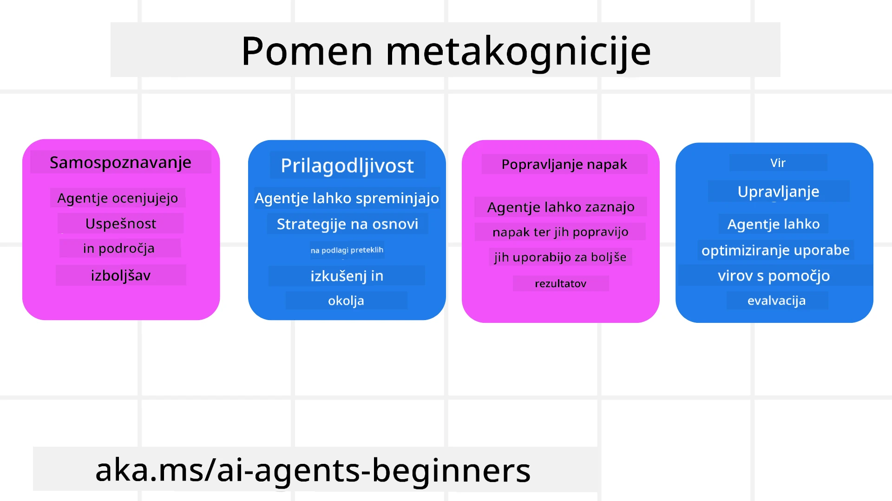
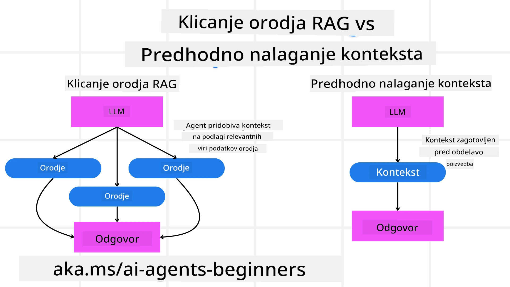

[](https://youtu.be/His9R6gw6Ec?si=3_RMb8VprNvdLRhX)

> _(Kliknite na zgornjo sliko, da si ogledate video te lekcije)_
# Metakognicija pri AI agentih

## Uvod

Dobrodošli v lekciji o metakogniciji pri AI agentih! Ta poglavje je namenjeno začetnikom, ki jih zanima, kako lahko AI agenti razmišljajo o svojih miselnih procesih. Ob koncu te lekcije boste razumeli ključne pojme in boste opremljeni s praktičnimi primeri za uporabo metakognicije pri oblikovanju AI agentov.

## Cilji učenja

Po končanem učenju boste lahko:

1. Razumeli pomen zanke sklepanja v definicijah agentov.
2. Uporabili tehnike načrtovanja in vrednotenja za pomoč samopopravljajočim se agentom.
3. Ustvarili svoje agente, sposobne manipulirati kodo za izvedbo nalog.

## Uvod v metakognicijo

Metakognicija se nanaša na višje kognitivne procese, ki vključujejo razmišljanje o lastnem razmišljanju. Za AI agente to pomeni, da lahko ocenijo in prilagodijo svoja dejanja na podlagi samorefleksije in preteklih izkušenj. Metakognicija oziroma "razmišljanje o razmišljanju" je pomemben koncept pri razvoju agentnih AI sistemov. Vključuje zavedanje notranjih procesov AI sistemov in sposobnost spremljanja, regulacije in prilagajanja njihovega vedenja. Tako kot mi, ko razberemo vzdušje v prostoru ali pogledamo problem. Ta samozavedanje lahko pomaga AI sistemom pri boljšem odločanju, prepoznavanju napak in izboljševanju zmogljivosti skozi čas - kar ponovno povezuje na Turingov test in razpravo, ali bo AI prevzel nadzor.

V kontekstu agentnih AI sistemov metakognicija lahko pomaga rešiti več izzivov, kot so:
- Preglednost: Zagotavljanje, da AI sistemi lahko pojasnijo svoje sklepe in odločitve.
- Razmišljanje: Izboljšanje sposobnosti AI sistemov za sintezo informacij in sprejemanje zanesljivih odločitev.
- Prilagajanje: Omogočanje AI sistemom, da se prilagodijo novim okoljem in spreminjajočim se pogojem.
- Percepcija: Izboljšanje natančnosti AI sistemov pri prepoznavanju in interpretaciji podatkov iz okolja.

### Kaj je metakognicija?

Metakognicija ali "razmišljanje o razmišljanju" je višji kognitivni proces, ki vključuje samozavedanje in samoregulacijo lastnih kognitivnih procesov. V svetu AI metakognicija omogoča agentom, da ocenijo in prilagodijo svoje strategije in dejanja, kar vodi do izboljšanih sposobnosti reševanja problemov in odločanja. S spoznavanjem metakognicije lahko oblikujete AI agente, ki niso le bolj inteligentni, temveč tudi bolj prilagodljivi in učinkoviti. V pravi metakogniciji bi videli AI, ki eksplicitno razmišlja o lastnem sklepanju.

Primer: "Prednost sem dal cenejšim letom, ker... morda zamujam neposredne lete, zato naj ponovno preverim."
Spremljanje, kako ali zakaj je izbral določeno pot.
- Zaznavanje, da je naredil napake, ker se je preveč zanašal na uporabniške preference prejšnjič, zato spremeni svojo strategijo odločanja, ne le končno priporočilo.
- Diagnosticiranje vzorcev, na primer: "Kadarkoli uporabnik omeni 'preveč gneče,' ne smem le odstraniti določenih znamenitosti, ampak tudi razmisliti, da je moj način izbire 'najboljših znamenitosti' napačen, če vedno rangiram po priljubljenosti."

### Pomen metakognicije pri AI agentih

Metakognicija igra ključno vlogo pri oblikovanju AI agentov iz več razlogov:



- Samorefleksija: Agenti lahko ocenijo svoje delovanje in prepoznajo področja za izboljšave.
- Prilagodljivost: Agenti lahko prilagodijo svoje strategije na podlagi preteklih izkušenj in spreminjajočega se okolja.
- Popravljanje napak: Agenti lahko samostojno zaznavajo in popravljajo napake, kar vodi do natančnejših rezultatov.
- Upravljanje virov: Agenti lahko optimizirajo uporabo virov, kot sta čas in računalniška moč, z načrtovanjem in vrednotenjem svojih dejanj.

## Komponente AI agenta

Preden se poglobimo v metakognitivne procese, je nujno razumeti osnovne sestavine AI agenta. AI agent običajno sestavljajo:

- Persona: Osebnost in značilnosti agenta, ki določajo, kako sodeluje z uporabniki.
- Orodja: Sposobnosti in funkcije, ki jih agent lahko izvaja.
- Sposobnosti: Znanje in strokovnost, ki jih agent poseduje.

Te komponente skupaj ustvarjajo "enoto strokovnosti," ki lahko opravlja določene naloge.

**Primer**:
Predstavljajte si potovalnega agenta, storitev, ki ne le načrtuje vaše počitnice, ampak prilagaja svojo pot glede na podatke v realnem času in pretekle izkušnje potnikov.

### Primer: Metakognicija v storitvi potovalnega agenta

Zamislite si, da oblikujete storitev potovalnega agenta na osnovi AI. Ta agent, "Potovalni agent," pomaga uporabnikom pri načrtovanju počitnic. Za vključitev metakognicije mora Potovalni agent oceniti in prilagoditi svoja dejanja na podlagi samozavedanja in preteklih izkušenj. Tako bi lahko metakognicija igrala vlogo:

#### Trenutna naloga

Trenutna naloga je pomagati uporabniku načrtovati potovanje v Pariz.

#### Koraki za dokončanje naloge

1. **Zbiranje uporabniških preferenc**: Povprašajte uporabnika o datumih potovanja, proračunu, interesih (npr. muzeji, kulinarika, trgovanje) in morebitnih posebnih zahtevah.
2. **Pridobivanje informacij**: Iskanje možnosti letov, nastanitve, znamenitosti in restavracij, ki ustrezajo uporabnikovim željam.
3. **Izdelava priporočil**: Ponudba personaliziranega itinerarja z informacijami o letih, rezervacijah hotelov in predlaganih aktivnostih.
4. **Prilagoditev glede na povratne informacije**: Povprašajte uporabnika o odzivih na priporočila in izvedite potrebne spremembe.

#### Potrebni viri

- Dostop do podatkovnih baz za letalske in hotelske rezervacije.
- Informacije o pariških znamenitostih in restavracijah.
- Podatki o uporabniških povratnih informacijah iz prejšnjih interakcij.

#### Izkušnje in samorefleksija

Potovalni agent uporablja metakognicijo za vrednotenje svojega delovanja in učenje iz preteklih izkušenj. Na primer:

1. **Analiza povratnih informacij uporabnikov**: Potovalni agent pregledoval povratne informacije, da ugotovi, katera priporočila so bila dobro sprejeta in katera ne. Ustrezno prilagodi prihodnje predloge.
2. **Prilagodljivost**: Če je uporabnik prej omenil nelagodje zaradi gneče, se bo Potovalni agent v prihodnje izogibal predlaganju priljubljenih turističnih lokacij v najbolj množičnih urah.
3. **Popravljanje napak**: Če je Potovalni agent kdaj naredil napako pri rezervaciji, na primer predlagal hotel, ki je bil polno zaseden, se nauči preveriti razpoložljivost bolj strogo pred dajanjem priporočil.

#### Praktičen primer za razvijalce

Tukaj je poenostavljen primer kode, kako bi lahko koda Potovalnega agenta vključevala metakognicijo:

```python
class Travel_Agent:
    def __init__(self):
        self.user_preferences = {}
        self.experience_data = []

    def gather_preferences(self, preferences):
        self.user_preferences = preferences

    def retrieve_information(self):
        # Iskanje letov, hotelov in turističnih znamenitosti glede na preference
        flights = search_flights(self.user_preferences)
        hotels = search_hotels(self.user_preferences)
        attractions = search_attractions(self.user_preferences)
        return flights, hotels, attractions

    def generate_recommendations(self):
        flights, hotels, attractions = self.retrieve_information()
        itinerary = create_itinerary(flights, hotels, attractions)
        return itinerary

    def adjust_based_on_feedback(self, feedback):
        self.experience_data.append(feedback)
        # Analiza povratnih informacij in prilagajanje prihodnjih priporočil
        self.user_preferences = adjust_preferences(self.user_preferences, feedback)

# Primer uporabe
travel_agent = Travel_Agent()
preferences = {
    "destination": "Paris",
    "dates": "2025-04-01 to 2025-04-10",
    "budget": "moderate",
    "interests": ["museums", "cuisine"]
}
travel_agent.gather_preferences(preferences)
itinerary = travel_agent.generate_recommendations()
print("Suggested Itinerary:", itinerary)
feedback = {"liked": ["Louvre Museum"], "disliked": ["Eiffel Tower (too crowded)"]}
travel_agent.adjust_based_on_feedback(feedback)
```

#### Zakaj je metakognicija pomembna

- **Samorefleksija**: Agenti lahko analizirajo svoje delovanje in prepoznajo možnosti za izboljšave.
- **Prilagodljivost**: Agenti lahko spreminjajo strategije na podlagi povratnih informacij in spreminjajočih se pogojev.
- **Popravljanje napak**: Agenti lahko samostojno zaznajo in popravijo napake.
- **Upravljanje virov**: Agenti lahko optimizirajo uporabo virov, kot sta čas in računalniška moč.

Z vključitvijo metakognicije lahko Potovalni agent ponudi bolj personalizirana in natančna potovalna priporočila ter izboljša celotno uporabniško izkušnjo.

---

## 2. Načrtovanje pri agentih

Načrtovanje je ključen sestavni del vedenja AI agentov. Vključuje opredelitev korakov, potrebnih za dosego cilja, pri čemer se upošteva trenutni položaj, viri in možne ovire.

### Elementi načrtovanja

- **Trenutna naloga**: Jasno definirajte nalogo.
- **Koraki za dokončanje naloge**: Razdelite nalogo na obvladljive korake.
- **Potrebni viri**: Določite potrebne vire.
- **Izkušnje**: Uporabite pretekle izkušnje za informiranje načrtovanja.

**Primer**:
Tu so koraki, ki jih Potovalni agent potrebuje, da učinkovito pomaga uporabniku načrtovati potovanje:

### Koraki za Potovalni agent

1. **Zbiranje uporabniških preferenc**
   - Povprašajte uporabnika o podrobnostih potovalnih datumov, proračunu, interesih in morebitnih posebnih zahtevah.
   - Primeri: "Kdaj načrtujete potovanje?" "Kakšen je vaš proračun?" "Kakšne aktivnosti imate radi na počitnicah?"

2. **Pridobivanje informacij**
   - Poiščite ustrezne potovalne možnosti glede na uporabniške preference.
   - **Leta**: Poiščite razpoložljive lete v okviru uporabnikovega proračuna in preferiranih datumov potovanja.
   - **Nastanitve**: Najdite hotele ali najemne nepremičnine, ki ustrezajo uporabnikovim željam glede lokacije, cene in udobij.
   - **Znamenitosti in restavracije**: Prepoznajte priljubljene znamenitosti, aktivnosti in jedilne možnosti, ki sovpadajo z interesi uporabnika.

3. **Izdelava priporočil**
   - Združite pridobljene informacije v personaliziran načrt poti.
   - Navedite podrobnosti, kot so možnosti letov, rezervacije hotelov in predlagane aktivnosti, pri čemer prilagodite priporočila uporabnikovim željam.

4. **Predstavitev načrta uporabniku**
   - Predstavite uporabniku predlagani načrt poti v pregled.
   - Primer: "Tukaj je predlagan načrt za vaše potovanje v Pariz. Vključuje podatke o letih, hotelskih rezervacijah in seznam predlaganih aktivnosti ter restavracij. Sporočite mi svoje mnenje!"

5. **Zbiranje povratnih informacij**
   - Povprašajte uporabnika za povratne informacije o predlaganem načrtu.
   - Primeri: "Všeč so vam možnosti letov?" "Ali je hotel primeren za vaše potrebe?" "Bi želeli dodati ali odstraniti kakšne aktivnosti?"

6. **Prilagoditev glede na povratne informacije**
   - Prilagodite načrt glede na uporabnikove povratne informacije.
   - Naredite spremembe pri priporočilih za let, nastanitev in aktivnosti, da bodo bolje ustrezala uporabnikovim željam.

7. **Končna potrditev**
   - Predstavite uporabniku posodobljen načrt za končno potrditev.
   - Primer: "Naredil sem prilagoditve na podlagi vaših povratnih informacij. Tukaj je posodobljen načrt. Ali je vse v redu?"

8. **Rezervacija in potrditev**
   - Ko uporabnik potrdi načrt, izvedite rezervacije letov, nastanitev in vseh predhodno načrtovanih aktivnosti.
   - Pošljite podatke o potrditvi uporabniku.

9. **Stalna podpora**
   - Bodite na voljo za pomoč uporabniku pri spremembah ali dodatnih zahtevah pred in med potovanjem.
   - Primer: "Če potrebujete dodatno pomoč med potovanjem, me lahko kadarkoli kontaktirate!"

### Primer interakcije

```python
class Travel_Agent:
    def __init__(self):
        self.user_preferences = {}
        self.experience_data = []

    def gather_preferences(self, preferences):
        self.user_preferences = preferences

    def retrieve_information(self):
        flights = search_flights(self.user_preferences)
        hotels = search_hotels(self.user_preferences)
        attractions = search_attractions(self.user_preferences)
        return flights, hotels, attractions

    def generate_recommendations(self):
        flights, hotels, attractions = self.retrieve_information()
        itinerary = create_itinerary(flights, hotels, attractions)
        return itinerary

    def adjust_based_on_feedback(self, feedback):
        self.experience_data.append(feedback)
        self.user_preferences = adjust_preferences(self.user_preferences, feedback)

# Primer uporabe znotraj zahteve za bučanje
travel_agent = Travel_Agent()
preferences = {
    "destination": "Paris",
    "dates": "2025-04-01 to 2025-04-10",
    "budget": "moderate",
    "interests": ["museums", "cuisine"]
}
travel_agent.gather_preferences(preferences)
itinerary = travel_agent.generate_recommendations()
print("Suggested Itinerary:", itinerary)
feedback = {"liked": ["Louvre Museum"], "disliked": ["Eiffel Tower (too crowded)"]}
travel_agent.adjust_based_on_feedback(feedback)
```

## 3. Korektivni RAG sistem

Najprej začnimo z razumevanjem razlike med RAG orodjem in pre-emptive nalaganjem konteksta.



### Preiskovalno dopolnjeno generiranje (RAG)

RAG združuje sistem za iskanje z generativnim modelom. Ko je postavljeno vprašanje, sistem za iskanje pridobi relevantne dokumente ali podatke iz zunanjega vira, te informacije pa se uporabijo za dopolnitev vhoda generativnemu modelu. To pomaga modelu ustvariti natančnejše in kontekstualno ustrezne odgovore.

V RAG sistemu agent pridobiva relevantne informacije iz baze znanja in jih uporablja za generiranje primernih odgovorov ali dejanj.

### Pristop korektivnega RAG

Pristop korektivnega RAG se osredotoča na uporabo RAG tehnik za popravljanje napak in izboljševanje natančnosti AI agentov. To vključuje:

1. **Tehnika spodbujanja (prompting)**: Uporaba specifičnih spodbud za usmerjanje agenta pri iskanju relevantnih informacij.
2. **Orodje**: Implementacija algoritmov in mehanizmov, ki agentu omogočajo ocenjevanje ustreznosti pridobljenih informacij in ustvarjanje natančnih odgovorov.
3. **Vrednotenje**: Stalno spremljanje delovanja agenta in izvajanje prilagoditev za izboljšanje natančnosti in učinkovitosti.

#### Primer: Korektivni RAG v iskalnem agentu

Razmislimo o iskalnem agentu, ki pridobiva informacije z interneta za odgovore na uporabniške poizvedbe. Pristop korektivnega RAG lahko vključuje:

1. **Tehnika spodbujanja**: Oblikovanje iskalnih poizvedb na podlagi uporabnikovega vnosa.
2. **Orodje**: Uporaba procesiranja naravnega jezika in algoritmov strojnega učenja za razvrščanje in filtriranje iskalnih rezultatov.
3. **Vrednotenje**: Analiza povratnih informacij uporabnikov za prepoznavanje in popravljanje netočnosti v pridobljenih informacijah.

### Korektivni RAG pri Potovalnem agentu

Korektivni RAG (Retrieval-Augmented Generation) izboljšuje zmožnost AI za pridobivanje in generiranje informacij ter hkrati popravlja morebitne netočnosti. Oglejmo si, kako lahko Potovalni agent uporabi pristop korektivnega RAG za zagotavljanje natančnejših in relevantnejših potovalnih priporočil.

To vključuje:

- **Tehnika spodbujanja:** Uporaba specifičnih spodbud za usmerjanje agenta pri iskanju relevantnih informacij.
- **Orodje:** Implementacija algoritmov in mehanizmov, ki agentu omogočajo ocenjevanje ustreznosti pridobljenih informacij in ustvarjanje natančnih odgovorov.
- **Vrednotenje:** Stalno spremljanje delovanja agenta in izvajanje prilagoditev za izboljšanje natančnosti in učinkovitosti.

#### Koraki za implementacijo korektivnega RAG v Potovalnem agentu

1. **Začetna interakcija z uporabnikom**
   - Potovalni agent zbere začetne preference uporabnika, kot so destinacija, datumi potovanja, proračun in interesi.
   - Primer:

     ```python
     preferences = {
         "destination": "Paris",
         "dates": "2025-04-01 to 2025-04-10",
         "budget": "moderate",
         "interests": ["museums", "cuisine"]
     }
     ```

2. **Pridobivanje informacij**
   - Potovalni agent pridobi informacije o letih, nastanitvah, znamenitostih in restavracijah glede na uporabniške preference.
   - Primer:

     ```python
     flights = search_flights(preferences)
     hotels = search_hotels(preferences)
     attractions = search_attractions(preferences)
     ```

3. **Ustvarjanje začetnih priporočil**
   - Potovalni agent uporabi pridobljene informacije za generiranje personaliziranega itinerarja.
   - Primer:

     ```python
     itinerary = create_itinerary(flights, hotels, attractions)
     print("Suggested Itinerary:", itinerary)
     ```

4. **Zbiranje povratnih informacij uporabnika**
   - Potovalni agent povpraša uporabnika za mnenje o začetnih priporočilih.
   - Primer:

     ```python
     feedback = {
         "liked": ["Louvre Museum"],
         "disliked": ["Eiffel Tower (too crowded)"]
     }
     ```

5. **Proces korektivnega RAG**
   - **Tehnika spodbujanja**: Potovalni agent oblikuje nove iskalne poizvedbe glede na povratne informacije uporabnika.
     - Primer:

       ```python
       if "disliked" in feedback:
           preferences["avoid"] = feedback["disliked"]
       ```

   - **Orodje**: Potovalni agent uporablja algoritme za razvrščanje in filtriranje novih iskalnih rezultatov, pri čemer poudarja relevantnost glede na povratne informacije.
     - Primer:

       ```python
       new_attractions = search_attractions(preferences)
       new_itinerary = create_itinerary(flights, hotels, new_attractions)
       print("Updated Itinerary:", new_itinerary)
       ```

   - **Vrednotenje**: Potovalni agent stalno ocenjuje relevantnost in natančnost svojih priporočil z analizo povratnih informacij uporabnika in izvajanjem potrebnih prilagoditev.
     - Primer:

       ```python
       def adjust_preferences(preferences, feedback):
           if "liked" in feedback:
               preferences["favorites"] = feedback["liked"]
           if "disliked" in feedback:
               preferences["avoid"] = feedback["disliked"]
           return preferences

       preferences = adjust_preferences(preferences, feedback)
       ```

#### Praktičen primer

Tukaj je poenostavljen primer Python kode, ki vključuje pristop korektivnega RAG v Potovalnem agentu:

```python
class Travel_Agent:
    def __init__(self):
        self.user_preferences = {}
        self.experience_data = []

    def gather_preferences(self, preferences):
        self.user_preferences = preferences

    def retrieve_information(self):
        flights = search_flights(self.user_preferences)
        hotels = search_hotels(self.user_preferences)
        attractions = search_attractions(self.user_preferences)
        return flights, hotels, attractions

    def generate_recommendations(self):
        flights, hotels, attractions = self.retrieve_information()
        itinerary = create_itinerary(flights, hotels, attractions)
        return itinerary

    def adjust_based_on_feedback(self, feedback):
        self.experience_data.append(feedback)
        self.user_preferences = adjust_preferences(self.user_preferences, feedback)
        new_itinerary = self.generate_recommendations()
        return new_itinerary

# Primer uporabe
travel_agent = Travel_Agent()
preferences = {
    "destination": "Paris",
    "dates": "2025-04-01 to 2025-04-10",
    "budget": "moderate",
    "interests": ["museums", "cuisine"]
}
travel_agent.gather_preferences(preferences)
itinerary = travel_agent.generate_recommendations()
print("Suggested Itinerary:", itinerary)
feedback = {"liked": ["Louvre Museum"], "disliked": ["Eiffel Tower (too crowded)"]}
new_itinerary = travel_agent.adjust_based_on_feedback(feedback)
print("Updated Itinerary:", new_itinerary)
```

### Pre-emptive nalaganje konteksta
Pre-emptive Context Load vključuje nalaganje ustreznega konteksta ali osnovnih informacij v model pred obdelavo poizvedbe. To pomeni, da ima model od začetka dostop do teh informacij, kar mu lahko pomaga generirati bolj informirane odgovore, ne da bi moral med postopkom pridobivati dodatne podatke.

Tukaj je poenostavljen primer, kako bi lahko izgledalo pre-emptive context load za aplikacijo potovalnega agenta v Pythonu:

```python
class TravelAgent:
    def __init__(self):
        # Prednaloži priljubljene destinacije in njihove informacije
        self.context = {
            "Paris": {"country": "France", "currency": "Euro", "language": "French", "attractions": ["Eiffel Tower", "Louvre Museum"]},
            "Tokyo": {"country": "Japan", "currency": "Yen", "language": "Japanese", "attractions": ["Tokyo Tower", "Shibuya Crossing"]},
            "New York": {"country": "USA", "currency": "Dollar", "language": "English", "attractions": ["Statue of Liberty", "Times Square"]},
            "Sydney": {"country": "Australia", "currency": "Dollar", "language": "English", "attractions": ["Sydney Opera House", "Bondi Beach"]}
        }

    def get_destination_info(self, destination):
        # Pridobi informacije o destinaciji iz prednaloženega konteksta
        info = self.context.get(destination)
        if info:
            return f"{destination}:\nCountry: {info['country']}\nCurrency: {info['currency']}\nLanguage: {info['language']}\nAttractions: {', '.join(info['attractions'])}"
        else:
            return f"Sorry, we don't have information on {destination}."

# Primer uporabe
travel_agent = TravelAgent()
print(travel_agent.get_destination_info("Paris"))
print(travel_agent.get_destination_info("Tokyo"))
```

#### Razlaga

1. **Inicializacija (`__init__` metoda)**: Razred `TravelAgent` prednaloži slovar, ki vsebuje informacije o priljubljenih destinacijah, kot so Pariz, Tokio, New York in Sydney. Ta slovar vključuje podrobnosti, kot so država, valuta, jezik in glavne znamenitosti za vsako destinacijo.

2. **Pridobivanje informacij (`get_destination_info` metoda)**: Ko uporabnik vpraša za določeno destinacijo, metoda `get_destination_info` pridobi ustrezne informacije iz prednaloženega slovarja konteksta.

S prednaloženim kontekstom aplikacija potovalnega agenta lahko hitro odgovori na uporabniške poizvedbe, ne da bi morala v realnem času pridobivati te informacije iz zunanjega vira. To naredi aplikacijo bolj učinkovito in odzivno.

### Začetek načrta z določenim ciljem pred iteracijo

Začetek načrta s ciljem pomeni začeti z jasno opredeljenim namenom ali ciljno vsebino v mislih. Z opredelitvijo tega cilja vnaprej lahko model ta cilj uporablja kot vodilo skozi celoten iterativni proces. To pomaga zagotoviti, da se vsaka iteracija pomakne bliže doseganju želenega rezultata, kar naredi postopek učinkovitejši in osredotočen.

Tukaj je primer, kako lahko začnete načrt potovanja s ciljem pred iteriranjem za potovalnega agenta v Pythonu:

### Scenarij

Potovalni agent želi načrtovati prilagojene počitnice za stranko. Cilj je ustvariti potovalni itinerarij, ki maksimira zadovoljstvo stranke glede na njene preference in proračun.

### Koraki

1. Določite preference in proračun stranke.
2. Začnite začetni načrt na podlagi teh preferenc.
3. Iterirajte, da izpopolnite načrt in optimizirate zadovoljstvo stranke.

#### Python koda

```python
class TravelAgent:
    def __init__(self, destinations):
        self.destinations = destinations

    def bootstrap_plan(self, preferences, budget):
        plan = []
        total_cost = 0

        for destination in self.destinations:
            if total_cost + destination['cost'] <= budget and self.match_preferences(destination, preferences):
                plan.append(destination)
                total_cost += destination['cost']

        return plan

    def match_preferences(self, destination, preferences):
        for key, value in preferences.items():
            if destination.get(key) != value:
                return False
        return True

    def iterate_plan(self, plan, preferences, budget):
        for i in range(len(plan)):
            for destination in self.destinations:
                if destination not in plan and self.match_preferences(destination, preferences) and self.calculate_cost(plan, destination) <= budget:
                    plan[i] = destination
                    break
        return plan

    def calculate_cost(self, plan, new_destination):
        return sum(destination['cost'] for destination in plan) + new_destination['cost']

# Primer uporabe
destinations = [
    {"name": "Paris", "cost": 1000, "activity": "sightseeing"},
    {"name": "Tokyo", "cost": 1200, "activity": "shopping"},
    {"name": "New York", "cost": 900, "activity": "sightseeing"},
    {"name": "Sydney", "cost": 1100, "activity": "beach"},
]

preferences = {"activity": "sightseeing"}
budget = 2000

travel_agent = TravelAgent(destinations)
initial_plan = travel_agent.bootstrap_plan(preferences, budget)
print("Initial Plan:", initial_plan)

refined_plan = travel_agent.iterate_plan(initial_plan, preferences, budget)
print("Refined Plan:", refined_plan)
```

#### Razlaga kode

1. **Inicializacija (`__init__` metoda)**: Razred `TravelAgent` je inicializiran z listom potencialnih destinacij, ki imajo atribute, kot so ime, strošek in vrsta aktivnosti.

2. **Začetek načrta (`bootstrap_plan` metoda)**: Ta metoda ustvari začetni potovalni načrt na podlagi strankinih preferenc in proračuna. Iterira skozi seznam destinacij in jih doda v načrt, če se ujemajo s preferencami stranke in so znotraj proračuna.

3. **Ujemanje preferenc (`match_preferences` metoda)**: Ta metoda preverja, ali destinacija ustreza preferencam stranke.

4. **Iteriranje načrta (`iterate_plan` metoda)**: Ta metoda izpopolnjuje začetni načrt tako, da poskuša zamenjati posamezne destinacije v načrtu z boljšimi ujemanji, ob upoštevanju preferenc in omejitev proračuna.

5. **Izračun stroškov (`calculate_cost` metoda)**: Ta metoda izračuna skupne stroške trenutnega načrta, vključno s potencialno novo destinacijo.

#### Primer uporabe

- **Začetni načrt**: Potovalni agent ustvari začetni načrt na podlagi strankinih preferenc za ogled znamenitosti in proračuna 2000 $.
- **Izboljšan načrt**: Potovalni agent iterira načrt in ga optimizira glede na preference in proračun stranke.

Z začetkom načrta z jasnim ciljem (npr. maksimiranje zadovoljstva stranke) in iteriranjem za izpopolnjevanje načrta lahko potovalni agent ustvari prilagojen in optimiziran potovalni itinerarij za stranko. Ta pristop zagotavlja, da potovalni načrt od samega začetka ustreza preferencam in proračunu stranke ter se izboljšuje z vsako iteracijo.

### Izkoristek LLM za prerazvrščanje in ocenjevanje

Veliki jezikovni modeli (LLM) se lahko uporabljajo za prerazvrščanje in ocenjevanje z ocenjevanjem relevantnosti in kakovosti pridobljenih dokumentov ali ustvarjenih odgovorov. Tako deluje:

**Pridobivanje:** Začetni korak pridobi nabor kandidatnih dokumentov ali odgovorov na podlagi poizvedbe.

**Prerazvrščanje:** LLM oceni te kandidate in jih prerazvrsti glede na njihovo relevantnost in kakovost. Ta korak zagotovi, da se najprej prikažejo najbolj relevantne in kakovostne informacije.

**Ocenjevanje:** LLM dodeli ocene posameznim kandidatom, ki odražajo njihovo relevantnost in kakovost. To pomaga pri izbiri najboljšega odgovora ali dokumenta za uporabnika.

Z izkoriščanjem LLM za prerazvrščanje in ocenjevanje lahko sistem zagotovi bolj natančne in kontekstualno relevantne informacije ter izboljša uporabniško izkušnjo.

Tukaj je primer, kako bi potovalni agent lahko uporabil veliki jezikovni model (LLM) za prerazvrščanje in ocenjevanje potovalnih destinacij na podlagi uporabniških preferenc v Pythonu:

#### Scenarij - potovanje glede na preference

Potovalni agent želi priporočiti najboljše potovalne destinacije stranki na podlagi njenih preferenc. LLM bo pomagal prerazvrstiti in oceniti destinacije, da bodo predstavljene najbolj relevantne možnosti.

#### Koraki:

1. Zberite uporabniške preference.
2. Pridobite seznam potencialnih potovalnih destinacij.
3. Uporabite LLM za prerazvrščanje in ocenjevanje destinacij po uporabniških preferencah.

Tukaj je, kako lahko posodobite prejšnji primer z uporabo Azure OpenAI storitev:

#### Zahteve

1. Potrebujete Azure naročnino.
2. Ustvarite Azure OpenAI vir in pridobite svoj API ključ.

#### Primer Python kode

```python
import requests
import json

class TravelAgent:
    def __init__(self, destinations):
        self.destinations = destinations

    def get_recommendations(self, preferences, api_key, endpoint):
        # Ustvari poziv za Azure OpenAI
        prompt = self.generate_prompt(preferences)
        
        # Določi glave in vsebino zahteve
        headers = {
            'Content-Type': 'application/json',
            'Authorization': f'Bearer {api_key}'
        }
        payload = {
            "prompt": prompt,
            "max_tokens": 150,
            "temperature": 0.7
        }
        
        # Pokliči Azure OpenAI API za pridobitev ponovno razvrščenih in ocenjenih destinacij
        response = requests.post(endpoint, headers=headers, json=payload)
        response_data = response.json()
        
        # Izvleci in vrni priporočila
        recommendations = response_data['choices'][0]['text'].strip().split('\n')
        return recommendations

    def generate_prompt(self, preferences):
        prompt = "Here are the travel destinations ranked and scored based on the following user preferences:\n"
        for key, value in preferences.items():
            prompt += f"{key}: {value}\n"
        prompt += "\nDestinations:\n"
        for destination in self.destinations:
            prompt += f"- {destination['name']}: {destination['description']}\n"
        return prompt

# Primer uporabe
destinations = [
    {"name": "Paris", "description": "City of lights, known for its art, fashion, and culture."},
    {"name": "Tokyo", "description": "Vibrant city, famous for its modernity and traditional temples."},
    {"name": "New York", "description": "The city that never sleeps, with iconic landmarks and diverse culture."},
    {"name": "Sydney", "description": "Beautiful harbour city, known for its opera house and stunning beaches."},
]

preferences = {"activity": "sightseeing", "culture": "diverse"}
api_key = 'your_azure_openai_api_key'
endpoint = 'https://your-endpoint.com/openai/deployments/your-deployment-name/completions?api-version=2022-12-01'

travel_agent = TravelAgent(destinations)
recommendations = travel_agent.get_recommendations(preferences, api_key, endpoint)
print("Recommended Destinations:")
for rec in recommendations:
    print(rec)
```

#### Razlaga kode - Preference Booker

1. **Inicializacija**: Razred `TravelAgent` je inicializiran z listom potencialnih potovalnih destinacij, vsaka ima atribute, kot so ime in opis.

2. **Pridobivanje priporočil (`get_recommendations` metoda)**: Ta metoda generira poziv za Azure OpenAI storitev na podlagi uporabnikovih preferenc in naredi HTTP POST zahtevek do Azure OpenAI API-ja za pridobitev prerazvrščenih in ocenjenih destinacij.

3. **Generiranje poziva (`generate_prompt` metoda)**: Ta metoda ustvari poziv za Azure OpenAI, ki vključuje uporabnikove preference in seznam destinacij. Poziv usmerja model, da prerazvrsti in oceni destinacije glede na dane preference.

4. **Klic API-ja**: Knjižnica `requests` se uporablja za HTTP POST zahtevek do Azure OpenAI API končne točke. Odziv vsebuje prerazvrščene in ocenjene destinacije.

5. **Primer uporabe**: Potovalni agent zbere uporabniške preference (npr. zanimanje za ogled znamenitosti in raznoliko kulturo) in uporabi Azure OpenAI, da pridobi prerazvrščene in ocenjene priporočila za potovalne destinacije.

Poskrbite, da boste nadomestili `your_azure_openai_api_key` z vašim dejanskim Azure OpenAI API ključem in `https://your-endpoint.com/...` z dejansko URL končne točke vaše Azure OpenAI implementacije.

Z izkoriščanjem LLM za prerazvrščanje in ocenjevanje lahko potovalni agent zagotovi bolj personalizirana in relevantna potovalna priporočila strankam ter tako izboljša njihovo celotno izkušnjo.

### RAG: Tehnika pozivanja (prompting) proti orodju

Retrieval-Augmented Generation (RAG) je lahko tako tehnika pozivanja (prompting technique) kot orodje v razvoju AI agentov. Razumevanje razlike med obema vam lahko pomaga bolje izkoristiti RAG v vaših projektih.

#### RAG kot tehnika pozivanja

**Kaj je to?**

- Kot tehnika pozivanja RAG vključuje oblikovanje specifičnih poizvedb ali pozivov za usmerjanje pridobivanja relevantnih informacij iz velike zbirke ali baze podatkov. Te informacije se nato uporabijo za generiranje odgovorov ali dejanj.

**Kako deluje:**

1. **Oblikovanje pozivov:** Ustvarite dobro strukturirane pozive ali poizvedbe glede na nalogo ali uporabniški vnos.
2. **Pridobivanje informacij:** Izkoristite pozive za iskanje relevantnih podatkov v obstoječi bazi znanja ali naboru podatkov.
3. **Generiranje odgovora:** Združite pridobljene informacije z generativnimi AI modeli, da ustvarite celovit in koherenten odgovor.

**Primer v potovalnem agentu:**

- Uporabniški vnos: "Želim obiskati muzeje v Parizu."
- Poziv: "Poišči najboljše muzeje v Parizu."
- Pridobljene informacije: Podrobnosti o muzeju Louvre, Musée d'Orsay itd.
- Generiran odgovor: "Tukaj je nekaj najbolj znanih muzejev v Parizu: Louvre, Musée d'Orsay in Centre Pompidou."

#### RAG kot orodje

**Kaj je to?**

- Kot orodje je RAG integriran sistem, ki avtomatizira postopek pridobivanja in generiranja, kar razvijalcem olajša implementacijo kompleksnih AI funkcionalnosti brez ročnega oblikovanja pozivov za vsako poizvedbo.

**Kako deluje:**

1. **Integracija:** Vdelajte RAG v arhitekturo AI agenta, da samodejno upravlja pridobivanje in generiranje.
2. **Avtomatizacija:** Orodje upravlja celoten postopek, od prejema uporabniškega vnosa do generiranja končnega odgovora, brez potrebe po izrecnih pozivih za vsak korak.
3. **Učinkovitost:** Izboljša zmogljivost agenta s poenostavitvijo procesa pridobivanja in generiranja, omogoča hitrejše in natančnejše odgovore.

**Primer v potovalnem agentu:**

- Uporabniški vnos: "Želim obiskati muzeje v Parizu."
- RAG orodje: Samodejno pridobi informacije o muzeju in generira odgovor.
- Generiran odgovor: "Tukaj je nekaj najbolj znanih muzejev v Parizu: Louvre, Musée d'Orsay in Centre Pompidou."

### Primerjava

| Vidik                  | Tehnika pozivanja                                         | Orodje                                                   |
|------------------------|-----------------------------------------------------------|----------------------------------------------------------|
| **Ročno vs avtomatsko**| Ročno oblikovanje pozivov za vsako poizvedbo.             | Avtomatiziran postopek pridobivanja in generiranja.       |
| **Nadzor**             | Ponuja več nadzora nad postopkom pridobivanja.            | Poenostavi in avtomatizira pridobivanje in generiranje.  |
| **Prilagodljivost**    | Dovoljuje prilagojene pozive glede na specifične potrebe. | Učinkovitejše za implementacije v večjih obsegu.          |
| **Zapletenost**        | Zahteva izdelavo in prilagajanje pozivov.                  | Enostavneje za integracijo v arhitekturo AI agenta.       |

### Praktični primeri

**Primer tehnike pozivanja:**

```python
def search_museums_in_paris():
    prompt = "Find top museums in Paris"
    search_results = search_web(prompt)
    return search_results

museums = search_museums_in_paris()
print("Top Museums in Paris:", museums)
```

**Primer orodja:**

```python
class Travel_Agent:
    def __init__(self):
        self.rag_tool = RAGTool()

    def get_museums_in_paris(self):
        user_input = "I want to visit museums in Paris."
        response = self.rag_tool.retrieve_and_generate(user_input)
        return response

travel_agent = Travel_Agent()
museums = travel_agent.get_museums_in_paris()
print("Top Museums in Paris:", museums)
```

### Ocenjevanje relevantnosti

Ocenjevanje relevantnosti je ključen vidik delovanja AI agenta. Zagotavlja, da so informacije, ki jih agent pridobi in generira, primerne, natančne in koristne za uporabnika. Raziščimo, kako ocenjevati relevantnost v AI agentih, vključno s praktičnimi primeri in tehnikami.

#### Ključni pojmi pri ocenjevanju relevantnosti

1. **Zavedanje konteksta**:
   - Agent mora razumeti kontekst uporabnikove poizvedbe, da lahko pridobi in generira relevantne informacije.
   - Primer: Če uporabnik vpraša za "najboljše restavracije v Parizu", mora agent upoštevati uporabnikove preference, kot so vrsta kuhinje in proračun.

2. **Natančnost**:
   - Informacije, ki jih agent zagotovi, morajo biti dejansko točne in posodobljene.
   - Primer: Priporočanje trenutno odprtih restavracij z dobrimi ocenami namesto zastarelih ali zaprtih možnosti.

3. **Namen uporabnika**:
   - Agent mora razvozlati uporabnikov namen za poizvedbo, da zagotovi najrelevantnejše informacije.
   - Primer: Če uporabnik vpraša za "cenovno ugodne hotele", mora agent dati prednost dostopnim možnostim.

4. **Povratne informacije**:
   - Stalno zbiranje in analiza povratnih informacij uporabnikov pomaga agentu izpopolniti proces ocenjevanja relevantnosti.
   - Primer: Vključevanje ocen in povratnih informacij o preteklih priporočilih za izboljšanje prihodnjih odgovorov.

#### Praktične tehnike za ocenjevanje relevantnosti

1. **Ocena relevantnosti**:
   - Dodelite relevantnostno oceno vsakemu pridobljenemu elementu na podlagi ujemanja z uporabnikovo poizvedbo in preferencami.
   - Primer:

     ```python
     def relevance_score(item, query):
         score = 0
         if item['category'] in query['interests']:
             score += 1
         if item['price'] <= query['budget']:
             score += 1
         if item['location'] == query['destination']:
             score += 1
         return score
     ```

2. **Filtriranje in razvrščanje**:
   - Odstranite nerelevantne elemente in preostale razvrstite glede na ocene relevantnosti.
   - Primer:

     ```python
     def filter_and_rank(items, query):
         ranked_items = sorted(items, key=lambda item: relevance_score(item, query), reverse=True)
         return ranked_items[:10]  # Vrni prvih 10 relevantnih elementov
     ```

3. **Obdelava naravnega jezika (NLP)**:
   - Uporabite tehnike NLP za razumevanje uporabnikove poizvedbe in pridobivanje relevantnih informacij.
   - Primer:

     ```python
     def process_query(query):
         # Uporabite NLP za izločanje ključnih informacij iz uporabnikovega poizvedbe
         processed_query = nlp(query)
         return processed_query
     ```

4. **Integracija povratnih informacij uporabnikov**:
   - Zbirajte povratne informacije o podanih priporočilih in jih uporabite za prilagoditev prihodnjih ocen relevantnosti.
   - Primer:

     ```python
     def adjust_based_on_feedback(feedback, items):
         for item in items:
             if item['name'] in feedback['liked']:
                 item['relevance'] += 1
             if item['name'] in feedback['disliked']:
                 item['relevance'] -= 1
         return items
     ```

#### Primer: Ocenjevanje relevantnosti v Travel Agent

Tukaj je praktičen primer, kako Travel Agent lahko oceni relevantnost potovalnih priporočil:

```python
class Travel_Agent:
    def __init__(self):
        self.user_preferences = {}
        self.experience_data = []

    def gather_preferences(self, preferences):
        self.user_preferences = preferences

    def retrieve_information(self):
        flights = search_flights(self.user_preferences)
        hotels = search_hotels(self.user_preferences)
        attractions = search_attractions(self.user_preferences)
        return flights, hotels, attractions

    def generate_recommendations(self):
        flights, hotels, attractions = self.retrieve_information()
        ranked_hotels = self.filter_and_rank(hotels, self.user_preferences)
        itinerary = create_itinerary(flights, ranked_hotels, attractions)
        return itinerary

    def filter_and_rank(self, items, query):
        ranked_items = sorted(items, key=lambda item: self.relevance_score(item, query), reverse=True)
        return ranked_items[:10]  # Vrni top 10 relevantnih elementov

    def relevance_score(self, item, query):
        score = 0
        if item['category'] in query['interests']:
            score += 1
        if item['price'] <= query['budget']:
            score += 1
        if item['location'] == query['destination']:
            score += 1
        return score

    def adjust_based_on_feedback(self, feedback, items):
        for item in items:
            if item['name'] in feedback['liked']:
                item['relevance'] += 1
            if item['name'] in feedback['disliked']:
                item['relevance'] -= 1
        return items

# Primer uporabe
travel_agent = Travel_Agent()
preferences = {
    "destination": "Paris",
    "dates": "2025-04-01 to 2025-04-10",
    "budget": "moderate",
    "interests": ["museums", "cuisine"]
}
travel_agent.gather_preferences(preferences)
itinerary = travel_agent.generate_recommendations()
print("Suggested Itinerary:", itinerary)
feedback = {"liked": ["Louvre Museum"], "disliked": ["Eiffel Tower (too crowded)"]}
updated_items = travel_agent.adjust_based_on_feedback(feedback, itinerary['hotels'])
print("Updated Itinerary with Feedback:", updated_items)
```

### Iskanje z namenom

Iskanje z namenom vključuje razumevanje in interpretacijo globljega cilja ali namena za uporabnikovo poizvedbo, da pridobite in generirate najbolj relevantne in koristne informacije. Ta pristop presega zgolj iskanje ključnih besed in se osredotoča na razumevanje dejanskih potreb in konteksta uporabnika.

#### Ključni pojmi pri iskanju z namenom

1. **Razumevanje namena uporabnika**:
   - Namen uporabnika lahko razdelimo v tri glavne tipe: informativni, navigacijski in transakcijski.
     - **Informativni namen:** Uporabnik išče informacije o temi (npr. "Kateri so najboljši muzeji v Parizu?").
     - **Navigacijski namen:** Uporabnik želi obiskati določeno spletno stran ali stran (npr. "Uradna spletna stran muzeja Louvre").
     - **Transakcijski namen:** Uporabnik želi izvesti transakcijo, kot je rezervacija leta ali nakup (npr. "Rezerviraj let v Pariz").

2. **Zavedanje konteksta**:
   - Analiza konteksta uporabnikove poizvedbe pomaga natančno prepoznati njegov namen. To vključuje upoštevanje prejšnjih interakcij, uporabniških preferenc in posebnosti trenutne poizvedbe.

3. **Obdelava naravnega jezika (NLP)**:
   - NLP tehnike se uporabljajo za razumevanje in interpretacijo naravnih jezikovnih poizvedb uporabnikov. Vključujejo naloge, kot so prepoznavanje entitet, analiza sentimenta in analiza poizvedbe.

4. **Personalizacija**:
   - Personalizacija rezultatov iskanja na podlagi zgodovine, preferenc in povratnih informacij uporabnika izboljšuje relevantnost pridobljenih informacij.

#### Praktičen primer: Iskanje z namenom v Travel Agent

Poglejmo Travel Agent kot primer, kako implementirati iskanje z namenom.

1. **Zbiranje uporabniških preferenc**

   ```python
   class Travel_Agent:
       def __init__(self):
           self.user_preferences = {}

       def gather_preferences(self, preferences):
           self.user_preferences = preferences
   ```

2. **Razumevanje namena uporabnika**

   ```python
   def identify_intent(query):
       if "book" in query or "purchase" in query:
           return "transactional"
       elif "website" in query or "official" in query:
           return "navigational"
       else:
           return "informational"
   ```

3. **Zavedanje konteksta**
   ```python
   def analyze_context(query, user_history):
       # Združite trenutno poizvedbo z uporabniško zgodovino za razumevanje konteksta
       context = {
           "current_query": query,
           "user_history": user_history
       }
       return context
   ```

4. **Iskanje in personalizacija rezultatov**

   ```python
   def search_with_intent(query, preferences, user_history):
       intent = identify_intent(query)
       context = analyze_context(query, user_history)
       if intent == "informational":
           search_results = search_information(query, preferences)
       elif intent == "navigational":
           search_results = search_navigation(query)
       elif intent == "transactional":
           search_results = search_transaction(query, preferences)
       personalized_results = personalize_results(search_results, user_history)
       return personalized_results

   def search_information(query, preferences):
       # Primer iskalne logike za informacijski namen
       results = search_web(f"best {preferences['interests']} in {preferences['destination']}")
       return results

   def search_navigation(query):
       # Primer iskalne logike za navigacijski namen
       results = search_web(query)
       return results

   def search_transaction(query, preferences):
       # Primer iskalne logike za transakcijski namen
       results = search_web(f"book {query} to {preferences['destination']}")
       return results

   def personalize_results(results, user_history):
       # Primer personalizacijske logike
       personalized = [result for result in results if result not in user_history]
       return personalized[:10]  # Prikaži prvih 10 personaliziranih rezultatov
   ```

5. **Primer uporabe**

   ```python
   travel_agent = Travel_Agent()
   preferences = {
       "destination": "Paris",
       "interests": ["museums", "cuisine"]
   }
   travel_agent.gather_preferences(preferences)
   user_history = ["Louvre Museum website", "Book flight to Paris"]
   query = "best museums in Paris"
   results = search_with_intent(query, preferences, user_history)
   print("Search Results:", results)
   ```

---

## 4. Generiranje kode kot orodje

Agentje za generiranje kode uporabljajo modele umetne inteligence za pisanje in izvajanje kode, s čimer rešujejo zapletene probleme in avtomatizirajo naloge.

### Agentje za generiranje kode

Agentje za generiranje kode uporabljajo generativne AI modele za pisanje in izvajanje kode. Ti agenti lahko rešujejo zapletene probleme, avtomatizirajo naloge in zagotavljajo dragocene vpoglede z generiranjem in izvajanjem kode v različnih programskih jezikih.

#### Praktične uporabe

1. **Avtomatizirano ustvarjanje kode**: Generiranje odlomkov kode za specifične naloge, kot so analiza podatkov, spletno strganje ali strojno učenje.
2. **SQL kot RAG**: Uporaba SQL poizvedb za pridobivanje in manipulacijo podatkov iz baz.
3. **Reševanje problemov**: Ustvarjanje in izvajanje kode za reševanje specifičnih problemov, kot je optimizacija algoritmov ali analiza podatkov.

#### Primer: Agent za generiranje kode za analizo podatkov

Predstavljajte si, da načrtujete agenta za generiranje kode. Tako bi lahko deloval:

1. **Naloga**: Analizirati podatkovni niz za prepoznavanje trendov in vzorcev.
2. **Koraki**:
   - Naložite podatkovni niz v orodje za analizo podatkov.
   - Generirajte SQL poizvedbe za filtriranje in agregacijo podatkov.
   - Izvedite poizvedbe in pridobite rezultate.
   - Uporabite rezultate za ustvarjanje vizualizacij in vpogledov.
3. **Potrebni viri**: Dostop do podatkovnega niza, orodja za analizo podatkov in SQL zmogljivosti.
4. **Izkušnje**: Uporabite pretekle rezultate analiz za izboljšanje natančnosti in relevantnosti prihodnjih analiz.

### Primer: Agent za generiranje kode za potovalnega agenta

V tem primeru bomo zasnovali agenta za generiranje kode, Potovalnega agenta, da pomaga uporabnikom pri načrtovanju potovanj z generiranjem in izvajanjem kode. Ta agent lahko obravnava naloge, kot so iskanje potovalnih možnosti, filtriranje rezultatov in sestavljanje načrta poti z uporabo generativne AI.

#### Pregled agenta za generiranje kode

1. **Zbiranje uporabniških preferenc**: Zbira uporabniške vnose, kot so cilj potovanja, datumi potovanja, proračun in interesi.
2. **Generiranje kode za pridobivanje podatkov**: Generira odlomke kode za pridobivanje podatkov o letih, hotelih in znamenitostih.
3. **Izvajanje generirane kode**: Izvaja generirano kodo za pridobitev informacij v realnem času.
4. **Generiranje načrta poti**: Sestavi pridobljene podatke v personaliziran potovalni načrt.
5. **Prilagajanje na podlagi povratnih informacij**: Prejema povratne informacije uporabnika in po potrebi ponovno generira kodo za natančnejše rezultate.

#### Postopna izvedba

1. **Zbiranje uporabniških preferenc**

   ```python
   class Travel_Agent:
       def __init__(self):
           self.user_preferences = {}

       def gather_preferences(self, preferences):
           self.user_preferences = preferences
   ```

2. **Generiranje kode za pridobitev podatkov**

   ```python
   def generate_code_to_fetch_data(preferences):
       # Primer: Ustvari kodo za iskanje letov na podlagi uporabniških želja
       code = f"""
       def search_flights():
           import requests
           response = requests.get('https://api.example.com/flights', params={preferences})
           return response.json()
       """
       return code

   def generate_code_to_fetch_hotels(preferences):
       # Primer: Ustvari kodo za iskanje hotelov
       code = f"""
       def search_hotels():
           import requests
           response = requests.get('https://api.example.com/hotels', params={preferences})
           return response.json()
       """
       return code
   ```

3. **Izvajanje generirane kode**

   ```python
   def execute_code(code):
       # Izvedite generirano kodo z uporabo exec
       exec(code)
       result = locals()
       return result

   travel_agent = Travel_Agent()
   preferences = {
       "destination": "Paris",
       "dates": "2025-04-01 to 2025-04-10",
       "budget": "moderate",
       "interests": ["museums", "cuisine"]
   }
   travel_agent.gather_preferences(preferences)
   
   flight_code = generate_code_to_fetch_data(preferences)
   hotel_code = generate_code_to_fetch_hotels(preferences)
   
   flights = execute_code(flight_code)
   hotels = execute_code(hotel_code)

   print("Flight Options:", flights)
   print("Hotel Options:", hotels)
   ```

4. **Generiranje načrta poti**

   ```python
   def generate_itinerary(flights, hotels, attractions):
       itinerary = {
           "flights": flights,
           "hotels": hotels,
           "attractions": attractions
       }
       return itinerary

   attractions = search_attractions(preferences)
   itinerary = generate_itinerary(flights, hotels, attractions)
   print("Suggested Itinerary:", itinerary)
   ```

5. **Prilagajanje na podlagi povratnih informacij**

   ```python
   def adjust_based_on_feedback(feedback, preferences):
       # Prilagodi nastavitve glede na povratne informacije uporabnika
       if "liked" in feedback:
           preferences["favorites"] = feedback["liked"]
       if "disliked" in feedback:
           preferences["avoid"] = feedback["disliked"]
       return preferences

   feedback = {"liked": ["Louvre Museum"], "disliked": ["Eiffel Tower (too crowded)"]}
   updated_preferences = adjust_based_on_feedback(feedback, preferences)
   
   # Ponovno ustvari in izvrši kodo z posodobljenimi nastavitvami
   updated_flight_code = generate_code_to_fetch_data(updated_preferences)
   updated_hotel_code = generate_code_to_fetch_hotels(updated_preferences)
   
   updated_flights = execute_code(updated_flight_code)
   updated_hotels = execute_code(updated_hotel_code)
   
   updated_itinerary = generate_itinerary(updated_flights, updated_hotels, attractions)
   print("Updated Itinerary:", updated_itinerary)
   ```

### Izkoriščanje okoljske ozaveščenosti in sklepanja

Glede na shemo tabele lahko dejansko izboljšamo proces generiranja poizvedb z uporabo okoljske ozaveščenosti in sklepanja.

Tukaj je primer, kako je to mogoče:

1. **Razumevanje sheme**: Sistem bo razumel shemo tabele in uporabil te informacije za podlago generiranju poizvedb.
2. **Prilagajanje na podlagi povratnih informacij**: Sistem bo prilagodil uporabniške preference glede na povratne informacije in presodil, katera polja v shemi je treba posodobiti.
3. **Generiranje in izvajanje poizvedb**: Sistem bo generiral in izvajal poizvedbe za pridobitev posodobljenih podatkov o letih in hotelih na podlagi novih preferenc.

Tukaj je posodobljen primer Python kode, ki vključuje te koncepte:

```python
def adjust_based_on_feedback(feedback, preferences, schema):
    # Prilagodi nastavitve na podlagi povratnih informacij uporabnika
    if "liked" in feedback:
        preferences["favorites"] = feedback["liked"]
    if "disliked" in feedback:
        preferences["avoid"] = feedback["disliked"]
    # Razmišljanje na podlagi sheme za prilagoditev drugih povezanih nastavitev
    for field in schema:
        if field in preferences:
            preferences[field] = adjust_based_on_environment(feedback, field, schema)
    return preferences

def adjust_based_on_environment(feedback, field, schema):
    # Prilagojena logika za prilagoditev nastavitev na podlagi sheme in povratnih informacij
    if field in feedback["liked"]:
        return schema[field]["positive_adjustment"]
    elif field in feedback["disliked"]:
        return schema[field]["negative_adjustment"]
    return schema[field]["default"]

def generate_code_to_fetch_data(preferences):
    # Generiraj kodo za pridobivanje podatkov o letih na podlagi posodobljenih nastavitev
    return f"fetch_flights(preferences={preferences})"

def generate_code_to_fetch_hotels(preferences):
    # Generiraj kodo za pridobivanje podatkov o hotelih na podlagi posodobljenih nastavitev
    return f"fetch_hotels(preferences={preferences})"

def execute_code(code):
    # Simuliraj izvajanje kode in vrni ponarejene podatke
    return {"data": f"Executed: {code}"}

def generate_itinerary(flights, hotels, attractions):
    # Generiraj načrt poti na podlagi letov, hotelov in znamenitosti
    return {"flights": flights, "hotels": hotels, "attractions": attractions}

# Primer sheme
schema = {
    "favorites": {"positive_adjustment": "increase", "negative_adjustment": "decrease", "default": "neutral"},
    "avoid": {"positive_adjustment": "decrease", "negative_adjustment": "increase", "default": "neutral"}
}

# Primer uporabe
preferences = {"favorites": "sightseeing", "avoid": "crowded places"}
feedback = {"liked": ["Louvre Museum"], "disliked": ["Eiffel Tower (too crowded)"]}
updated_preferences = adjust_based_on_feedback(feedback, preferences, schema)

# Ponovno generiraj in izvedi kodo s posodobljenimi nastavitvami
updated_flight_code = generate_code_to_fetch_data(updated_preferences)
updated_hotel_code = generate_code_to_fetch_hotels(updated_preferences)

updated_flights = execute_code(updated_flight_code)
updated_hotels = execute_code(updated_hotel_code)

updated_itinerary = generate_itinerary(updated_flights, updated_hotels, feedback["liked"])
print("Updated Itinerary:", updated_itinerary)
```

#### Razlaga - Rezervacija na podlagi povratnih informacij

1. **Ozaveščenost o shemi**: Slovar `schema` določa, kako naj se preference prilagodijo glede na povratne informacije. Vključuje polja, kot so `favorites` in `avoid`, s pripadajočimi prilagoditvami.
2. **Prilagajanje preferenc (`adjust_based_on_feedback` metoda)**: Ta metoda prilagodi preference na podlagi povratnih informacij uporabnika in sheme.
3. **Prilagoditve na podlagi okolja (`adjust_based_on_environment` metoda)**: Ta metoda prilagaja nastavitve na podlagi sheme in povratnih informacij.
4. **Generiranje in izvajanje poizvedb**: Sistem generira kodo za pridobitev posodobljenih podatkov o letih in hotelih glede na prilagojene preference ter simulira izvajanje teh poizvedb.
5. **Generiranje načrta poti**: Sistem ustvari posodobljen načrt poti na podlagi novih podatkov o letih, hotelih in znamenitostih.

S tem, ko sistemu omogočimo okoljsko ozaveščenost in sklepanja na podlagi sheme, lahko generira natančnejše in bolj relevantne poizvedbe, kar vodi do boljših potovalnih priporočil in bolj personalizirane uporabniške izkušnje.

### Uporaba SQL kot tehnike za pridobivanje z obogatitvijo generiranja (RAG)

SQL (strukturirani jezik poizvedb) je zmogljivo orodje za delo z bazami podatkov. Ko se uporablja kot del pristopa pridobivanja z obogatitvijo generiranja (RAG), lahko SQL pridobi relevantne podatke iz baz za informiranje in generiranje odgovorov ali dejanj v AI agentih. Raziskali bomo, kako se SQL lahko uporabi kot tehnika RAG v kontekstu Potovalnega agenta.

#### Ključni koncepti

1. **Interakcija z bazo podatkov**:
   - SQL se uporablja za poizvedovanje baz, pridobivanje relevantnih informacij in manipulacijo podatkov.
   - Primer: Pridobivanje podatkov o letih, hotelih in znamenitostih iz potovalne baze podatkov.

2. **Integracija z RAG**:
   - SQL poizvedbe so generirane na podlagi uporabniških vhodov in preferenc.
   - Pridobljeni podatki se nato uporabijo za generiranje personaliziranih priporočil ali dejanj.

3. **Dinamično generiranje poizvedb**:
   - AI agent generira dinamične SQL poizvedbe glede na kontekst in uporabniške potrebe.
   - Primer: Prilagajanje SQL poizvedb za filtriranje rezultatov glede na proračun, datume in interese.

#### Uporabe

- **Avtomatizirano generiranje kode**: Generiranje odlomkov kode za določene naloge.
- **SQL kot RAG**: Uporaba SQL poizvedb za manipulacijo podatkov.
- **Reševanje problemov**: Ustvarjanje in izvajanje kode za reševanje problemov.

**Primer**:
Agent za analizo podatkov:

1. **Naloga**: Analizirati podatkovni niz za iskanje trendov.
2. **Koraki**:
   - Naložite podatkovni niz.
   - Generirajte SQL poizvedbe za filtriranje podatkov.
   - Izvedite poizvedbe in pridobite rezultate.
   - Generirajte vizualizacije in vpoglede.
3. **Viri**: Dostop do podatkovnega niza, SQL zmogljivosti.
4. **Izkušnje**: Uporaba preteklih rezultatov za izboljšanje prihodnjih analiz.

#### Praktični primer: uporaba SQL v Potovalnem agentu

1. **Zbiranje uporabniških preferenc**

   ```python
   class Travel_Agent:
       def __init__(self):
           self.user_preferences = {}

       def gather_preferences(self, preferences):
           self.user_preferences = preferences
   ```

2. **Generiranje SQL poizvedb**

   ```python
   def generate_sql_query(table, preferences):
       query = f"SELECT * FROM {table} WHERE "
       conditions = []
       for key, value in preferences.items():
           conditions.append(f"{key}='{value}'")
       query += " AND ".join(conditions)
       return query
   ```

3. **Izvajanje SQL poizvedb**

   ```python
   import sqlite3

   def execute_sql_query(query, database="travel.db"):
       connection = sqlite3.connect(database)
       cursor = connection.cursor()
       cursor.execute(query)
       results = cursor.fetchall()
       connection.close()
       return results
   ```

4. **Generiranje priporočil**

   ```python
   def generate_recommendations(preferences):
       flight_query = generate_sql_query("flights", preferences)
       hotel_query = generate_sql_query("hotels", preferences)
       attraction_query = generate_sql_query("attractions", preferences)
       
       flights = execute_sql_query(flight_query)
       hotels = execute_sql_query(hotel_query)
       attractions = execute_sql_query(attraction_query)
       
       itinerary = {
           "flights": flights,
           "hotels": hotels,
           "attractions": attractions
       }
       return itinerary

   travel_agent = Travel_Agent()
   preferences = {
       "destination": "Paris",
       "dates": "2025-04-01 to 2025-04-10",
       "budget": "moderate",
       "interests": ["museums", "cuisine"]
   }
   travel_agent.gather_preferences(preferences)
   itinerary = generate_recommendations(preferences)
   print("Suggested Itinerary:", itinerary)
   ```

#### Primer SQL poizvedb

1. **Poizvedba o letih**

   ```sql
   SELECT * FROM flights WHERE destination='Paris' AND dates='2025-04-01 to 2025-04-10' AND budget='moderate';
   ```

2. **Poizvedba o hotelih**

   ```sql
   SELECT * FROM hotels WHERE destination='Paris' AND budget='moderate';
   ```

3. **Poizvedba o znamenitostih**

   ```sql
   SELECT * FROM attractions WHERE destination='Paris' AND interests='museums, cuisine';
   ```

Z izkoriščanjem SQL kot dela tehnike pridobivanja z obogatitvijo generiranja (RAG) lahko AI agenti, kot je Potovalni agent, dinamično pridobivajo in uporabljajo relevantne podatke za zagotavljanje točnih in personaliziranih priporočil.

### Primer metakognicije

Za demonstracijo implementacije metakognicije ustvarimo preprostega agenta, ki *se sprašuje o svojem procesu odločanja* med reševanjem problema. V tem primeru bomo zgradili sistem, kjer agent poskuša optimizirati izbiro hotela, nato pa ovrednoti svoje sklepe in prilagodi strategijo, če naredi napake ali suboptimalne odločitve.

Simulirali bomo to z osnovnim primerom, kjer agent izbira hotele glede na kombinacijo cene in kvalitete, vendar bo "razmišljal" o svojih odločitvah in se temu primerno prilagodil.

#### Kako to ponazarja metakognicijo:

1. **Začetna odločitev**: Agent izbere najcenejši hotel, ne da bi razumel vpliv kvalitete.
2. **Razmislek in ocena**: Po začetni izbiri agent preveri, ali je bil hotel "slaba" izbira na podlagi povratnih informacij uporabnika. Če ugotovi, da je bila kvaliteta hotela prenizka, razmisli o svojem sklepanju.
3. **Prilagoditev strategije**: Agent spremeni svojo strategijo glede na razmislek in preklopi z "najnecenejši" na "najvišja_kvaliteta", s čimer izboljša proces odločanja v prihodnjih iteracijah.

Tukaj je primer:

```python
class HotelRecommendationAgent:
    def __init__(self):
        self.previous_choices = []  # Shranjuje prej izbrane hotele
        self.corrected_choices = []  # Shranjuje popravljene izbire
        self.recommendation_strategies = ['cheapest', 'highest_quality']  # Na voljo so strategije

    def recommend_hotel(self, hotels, strategy):
        """
        Recommend a hotel based on the chosen strategy.
        The strategy can either be 'cheapest' or 'highest_quality'.
        """
        if strategy == 'cheapest':
            recommended = min(hotels, key=lambda x: x['price'])
        elif strategy == 'highest_quality':
            recommended = max(hotels, key=lambda x: x['quality'])
        else:
            recommended = None
        self.previous_choices.append((strategy, recommended))
        return recommended

    def reflect_on_choice(self):
        """
        Reflect on the last choice made and decide if the agent should adjust its strategy.
        The agent considers if the previous choice led to a poor outcome.
        """
        if not self.previous_choices:
            return "No choices made yet."

        last_choice_strategy, last_choice = self.previous_choices[-1]
        # Predpostavimo, da imamo povratne informacije uporabnika, ki nam povedo, ali je bila zadnja izbira dobra ali ne
        user_feedback = self.get_user_feedback(last_choice)

        if user_feedback == "bad":
            # Prilagodi strategijo, če je bila prejšnja izbira nezadovoljiva
            new_strategy = 'highest_quality' if last_choice_strategy == 'cheapest' else 'cheapest'
            self.corrected_choices.append((new_strategy, last_choice))
            return f"Reflecting on choice. Adjusting strategy to {new_strategy}."
        else:
            return "The choice was good. No need to adjust."

    def get_user_feedback(self, hotel):
        """
        Simulate user feedback based on hotel attributes.
        For simplicity, assume if the hotel is too cheap, the feedback is "bad".
        If the hotel has quality less than 7, feedback is "bad".
        """
        if hotel['price'] < 100 or hotel['quality'] < 7:
            return "bad"
        return "good"

# Simuliraj seznam hotelov (cena in kakovost)
hotels = [
    {'name': 'Budget Inn', 'price': 80, 'quality': 6},
    {'name': 'Comfort Suites', 'price': 120, 'quality': 8},
    {'name': 'Luxury Stay', 'price': 200, 'quality': 9}
]

# Ustvari agenta
agent = HotelRecommendationAgent()

# Korak 1: Agent priporoči hotel z uporabo strategije "najcenejši"
recommended_hotel = agent.recommend_hotel(hotels, 'cheapest')
print(f"Recommended hotel (cheapest): {recommended_hotel['name']}")

# Korak 2: Agent razmisli o izbiri in po potrebi prilagodi strategijo
reflection_result = agent.reflect_on_choice()
print(reflection_result)

# Korak 3: Agent ponovno priporoči, tokrat z uporabo prilagojene strategije
adjusted_recommendation = agent.recommend_hotel(hotels, 'highest_quality')
print(f"Adjusted hotel recommendation (highest_quality): {adjusted_recommendation['name']}")
```

#### Sposobnosti metakognicije agenta

Ključno tukaj je agentova sposobnost:
- Ovrednotiti svoje pretekle izbire in proces odločanja.
- Prilagoditi svojo strategijo na podlagi tega razmisleka, tj. metakognicija v akciji.

To je preprosta oblika metakognicije, kjer je sistem sposoben prilagoditi svoj proces sklepanja na podlagi notranjih povratnih informacij.

### Zaključek

Metakognicija je močno orodje, ki lahko bistveno izboljša zmožnosti AI agentov. Z vključitvijo metakognitivnih procesov lahko oblikujete agente, ki so inteligentnejši, prilagodljivejši in učinkovitejši. Uporabite dodatne vire za nadaljnje raziskovanje fascinantnega sveta metakognicije v AI agentih.

### Imate več vprašanj o metakognitivnem vzorcu oblikovanja?

Pridružite se [Microsoft Foundry Discord](https://discord.com/invite/ATgtXmAS5D), da se srečate z drugimi učenjaki, sodelujete na urah za pomoč in dobite odgovore na vprašanja o AI agentih.

## Prejšnja lekcija

[Multi-Agent Design Pattern](../08-multi-agent/README.md)

## Naslednja lekcija

[AI Agents in Production](../10-ai-agents-production/README.md)

---

<!-- CO-OP TRANSLATOR DISCLAIMER START -->
**Omejitev odgovornosti**:
Ta dokument je bil preveden z uporabo AI prevajalske storitve [Co-op Translator](https://github.com/Azure/co-op-translator). Čeprav si prizadevamo za natančnost, vas prosimo, da upoštevate, da avtomatizirani prevodi lahko vsebujejo napake ali netočnosti. Izvirni dokument v njegovem izvirnem jeziku je treba obravnavati kot avtoritativni vir. Za kritične informacije je priporočljiv strokovni človeški prevod. Ne odgovarjamo za morebitna nesporazume ali napačne interpretacije, ki izhajajo iz uporabe tega prevoda.
<!-- CO-OP TRANSLATOR DISCLAIMER END -->