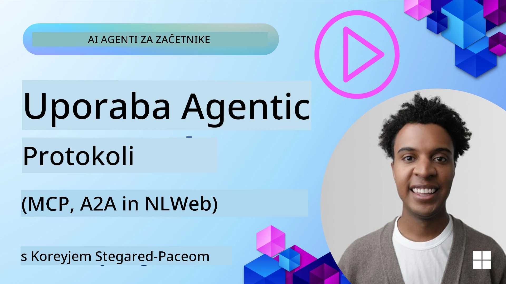
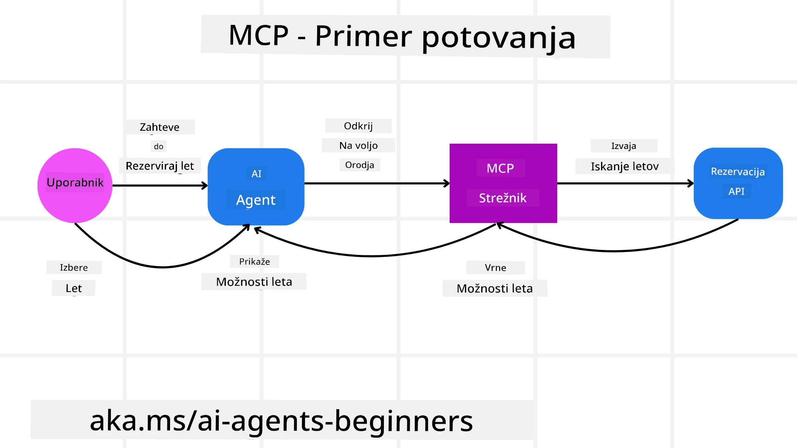
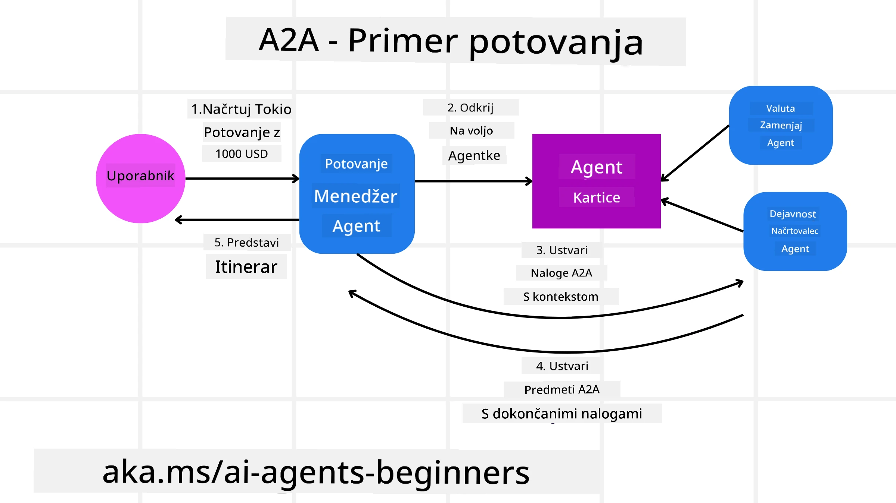
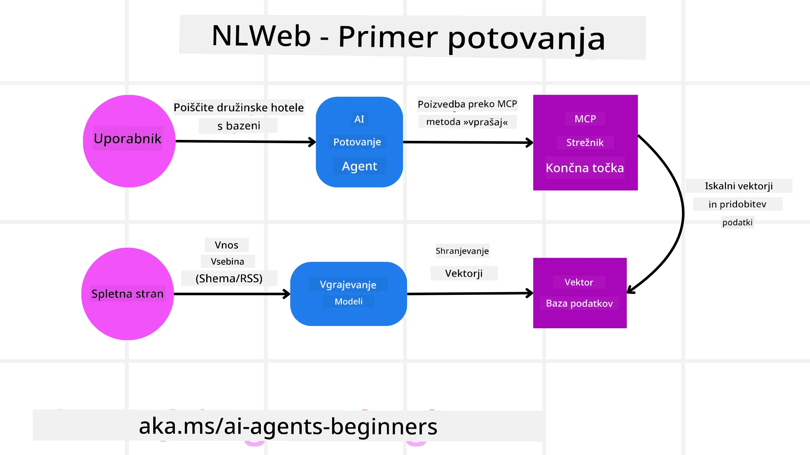

# Uporaba agentnih protokolov (MCP, A2A in NLWeb)

> _(Kliknite zgornjo sliko za ogled videa te lekcije)_

Z rastjo uporabe AI agentov narašča tudi potreba po protokolih, ki zagotavljajo standardizacijo, varnost in podpirajo odprto inovativnost. V tej lekciji bomo obravnavali 3 protokole, ki naj bi zadovoljili to potrebo - Model Context Protocol (MCP), Agent to Agent (A2A) in Natural Language Web (NLWeb).

## Uvod

V tej lekciji bomo obravnavali:

• Kako **MCP** omogoča AI agentom dostop do zunanjih orodij in podatkov za dokončanje uporabniških nalog.

• Kako **A2A** omogoča komunikacijo in sodelovanje med različnimi AI agenti.

• Kako **NLWeb** prinaša vmesnike za naravni jezik na katerokoli spletno stran in omogoča AI agentom odkrivanje in interakcijo s vsebino.

## Cilji učenja

• **Prepoznati** osnovni namen in prednosti MCP, A2A in NLWeb v kontekstu AI agentov.

• **Pojasniti**, kako vsak protokol olajša komunikacijo in interakcijo med LLM, orodji in drugimi agenti.

• **Razumeti** različne vloge, ki jih ima vsak protokol pri gradnji kompleksnih agentnih sistemov.

## Model Context Protocol

The **Model Context Protocol (MCP)** je odprt standard, ki zagotavlja standardiziran način za aplikacije, da zagotovijo kontekst in orodja LLM. To omogoča "univerzalni adapter" do različnih virov podatkov in orodij, na katere se AI agenti lahko povežejo na dosleden način.

Poglejmo si sestavne dele MCP, prednosti v primerjavi z neposredno uporabo API-jev in primer, kako bi AI agenti lahko uporabljali MCP strežnik.

### MCP Core Components

MCP deluje na arhitekturi **odjemalec-strežnik** in osnovne komponente so:

• **Hosts** so aplikacije z LLM (na primer urejevalnik kode, kot je VSCode), ki sprožijo povezave do MCP strežnika.

• **Clients** so komponente znotraj gostujoče aplikacije, ki vzdržujejo eno-na-eno povezave s strežniki.

• **Servers** so lahke aplikacije, ki razkrivajo določene zmožnosti.

V protokolu so vključeni trije osnovni primitivni tipi, ki predstavljajo zmožnosti MCP strežnika:

• **Tools**: To so posamezna dejanja ali funkcije, ki jih lahko agent pokliče, da izvede neko opravilo. Na primer, vremenska storitev bi lahko razkrila orodje "get weather", ali pa bi e‑trgovina razkrila orodje "purchase product". MCP strežniki v svojem seznamu zmožnosti oglašujejo ime vsakega orodja, opis in shemo vhod/izhod.

• **Resources**: To so podatkovni elementi ali dokumenti samo za branje, ki jih lahko MCP strežnik zagotovi, in jih odjemalci lahko pridobijo po potrebi. Primeri vključujejo vsebine datotek, zapise v podatkovni bazi ali dnevniške datoteke. Resources so lahko besedilni (kot koda ali JSON) ali binarni (kot slike ali PDF‑ji).

• **Prompts**: To so preddefinirane predloge, ki ponujajo predlagane pozive in omogočajo bolj zapletene delovne tokove.

### Prednosti MCP

MCP ponuja pomembne prednosti za AI agente:

• **Dinamično odkrivanje orodij**: Agenti lahko dinamično prejmejo seznam razpoložljivih orodij od strežnika skupaj z opisi, kaj ta orodja počnejo. To je v nasprotju s tradicionalnimi API‑ji, ki pogosto zahtevajo statično kodiranje integracij, kar pomeni, da vsaka sprememba API‑ja zahteva posodobitve kode. MCP omogoča pristop "integriraj enkrat", kar prinaša večjo prilagodljivost.

• **Medsebojna združljivost med LLM**: MCP deluje z različnimi LLM, kar omogoča fleksibilnost pri menjavi osnovnih modelov za boljše delovanje.

• **Standardizirana varnost**: MCP vključuje standardni način preverjanja pristnosti, kar izboljša razširljivost pri dodajanju dostopa do dodatnih MCP strežnikov. To je preprosteje kot upravljanje različnih ključev in vrst potrjevanja za raznolike tradicionalne API‑je.

### MCP Primer

Predstavljajte si, da uporabnik želi rezervirati let z AI asistentom, ki ga poganja MCP.

1. **Povezava**: AI asistent (MCP odjemalec) se poveže z MCP strežnikom, ki ga zagotavlja letalska družba.

2. **Odkritje orodij**: Odjemalec vpraša MCP strežnik letalske družbe: "Katera orodja imate na voljo?" Strežnik odgovori z orodji, kot so "search flights" in "book flights".

3. **Klic orodja**: Nato uporabnik vpraša AI asistenta: "Prosim poišči let iz Portlanda v Honolulu." AI asistent, z uporabo svojega LLM, ugotovi, da mora poklicati orodje "search flights" in posreduje ustrezne parametre (izvor, destinacija) MCP strežniku.

4. **Izvedba in odgovor**: MCP strežnik, kot ovojnica, izvede dejanski klic v notranji rezervacijski API letalske družbe. Nato prejme informacije o letih (npr. JSON podatke) in jih pošlje nazaj AI asistentu.

5. **Nadaljnja interakcija**: AI asistent prikaže možnosti letov. Ko izberete let, lahko asistent pokliče orodje "book flight" na istem MCP strežniku in dokonča rezervacijo.

## Agent-to-Agent Protocol (A2A)

Medtem ko se MCP osredotoča na povezovanje LLM z orodji, protokol **Agent-to-Agent (A2A)** naredi korak dlje in omogoča komunikacijo ter sodelovanje med različnimi AI agenti. A2A povezuje AI agente prek različnih organizacij, okolij in tehnoloških skladov, da dokončajo skupno nalogo.

Pregledali bomo sestavne dele in prednosti A2A ter primer, kako bi se ga lahko uporabilo v naši potovalni aplikaciji.

### A2A Core Components

A2A se osredotoča na omogočanje komunikacije med agenti in na to, da medsebojno sodelujejo pri dokončanju podnaloge uporabnika. Vsaka komponenta protokola k temu prispeva:

#### Agent Card

Podobno kot MCP strežnik deli seznam orodij, ima Agent Card:
- Ime agenta .
- **opis splošnih nalog**, ki jih opravlja.
- **seznam specifičnih veščin** z opisi, ki pomagajo drugim agentom (ali celo človeškim uporabnikom) razumeti, kdaj in zakaj bi želeli poklicati tega agenta.
- Trenutni **Endpoint URL** agenta
- **verzija** in **zmožnosti** agenta, kot so pretakanje odgovorov in potisna obvestila.

#### Agent Executor

Agent Executor je odgovoren za **posredovanje konteksta pogovora uporabnika oddaljenemu agentu**, saj ta kontekst oddaljenemu agentu omogoči razumevanje naloge, ki jo je treba izvesti. V A2A strežniku agent uporablja svoj lasten Large Language Model (LLM) za razčlenjevanje dohodnih zahtev in izvrševanje nalog z uporabo lastnih notranjih orodij.

#### Artifact

Ko oddaljeni agent dokonča zahtevano nalogo, nastane izdelek njegovega dela kot artifact. Artifact **vsebuje rezultat agentovega dela**, **opis, kaj je bilo dokončano**, in **besedilni kontekst**, ki je bil poslan skozi protokol. Po pošiljanju artifacta se povezava z oddaljenim agentom zapre, dokler ni znova potrebna.

#### Event Queue

Ta komponenta se uporablja za **obravnavo posodobitev in posredovanje sporočil**. Še posebej v produkciji je pomembna za agentne sisteme, saj prepreči prekinitev povezave med agenti pred dokončanjem naloge, še posebej ko lahko dokončanje naloge traja dlje časa.

### Prednosti A2A

• **Izboljšano sodelovanje**: Omogoča agentom iz različnih ponudnikov in platform, da komunicirajo, delijo kontekst in sodelujejo ter tako omogočajo nemoteno avtomatizacijo med prej ločenimi sistemi.

• **Fleksibilnost pri izbiri modela**: Vsak A2A agent se lahko odloči, kateri LLM uporablja za obdelavo svojih zahtev, kar omogoča optimizirane ali fino nastavljene modele za posameznega agenta, v nasprotju z enim samim LLM v nekaterih scenarijih MCP.

• **Vgrajeno preverjanje pristnosti**: Preverjanje pristnosti je neposredno integrirano v A2A protokol, kar zagotavlja robusten varnostni okvir za interakcije agentov.

### A2A Primer

Razširimo naš scenarij rezervacije potovanja, vendar tokrat uporabimo A2A.

1. **Uporabnik zahteva večagentno storitev**: Uporabnik komunicira s "Travel Agent" A2A odjemalcem/agenta, morda z navedbo: "Prosim rezerviraj celotno potovanje v Honolulu za naslednji teden, vključno z leti, hotelom in najemom avtomobila".

2. **Orkestracija s strani Travel Agenta**: Travel Agent prejme to kompleksno zahtevo. Uporabi svoj LLM za razmislek o nalogi in ugotovi, da mora sodelovati z drugimi specializiranimi agenti.

3. **Komunikacija med agenti**: Travel Agent nato uporabi A2A protokol za povezavo z navzdol usmerjenimi agenti, kot so "Airline Agent", "Hotel Agent" in "Car Rental Agent", ki jih ustvarjajo različna podjetja.

4. **Delegirano izvrševanje nalog**: Travel Agent pošlje specifične naloge tem specializiranim agentom (npr. "Poišči lete v Honolulu", "Rezerviraj hotel", "Najemi avto"). Vsak od teh specializiranih agentov, ki poganja njegov lasten LLM in uporablja lastna orodja (to so lahko tudi MCP strežniki), izvede svoj del rezervacije.

5. **Konsolidiran odgovor**: Ko vsi navzdol usmerjeni agenti dokončajo svoje naloge, Travel Agent sestavi rezultate (podatke o letu, potrditev hotela, rezervacijo najema avtomobila) in pošlje uporabniku celovit odgovor v slogu klepeta.

## Natural Language Web (NLWeb)

Spletne strani so že dolgo glavni način, kako uporabniki dostopajo do informacij in podatkov po internetu.

Poglejmo komponente NLWeb, prednosti NLWeb in primer, kako naš NLWeb deluje na primeru potovalne aplikacije.

### Komponente NLWeb

- **NLWeb Application (Core Service Code)**: Sistem, ki obdeluje vprašanja v naravnem jeziku. Povezuje različne dele platforme za ustvarjanje odgovorov. Lahko ga razumemo kot **motor, ki poganja funkcije naravnega jezika** na spletni strani.

- **NLWeb Protocol**: To je **osnovni nabor pravil za naravno jezikovno interakcijo** s spletno stranjo. V odgovoru pošilja podatke v JSON formatu (pogosto uporablja Schema.org). Njegov namen je ustvariti preprosto osnovo za "AI splet", podobno kot je HTML omogočil deljenje dokumentov na spletu.

- **MCP Server (Model Context Protocol Endpoint)**: Vsaka NLWeb postavitev deluje tudi kot **MCP strežnik**. To pomeni, da lahko **deli orodja (kot je metoda “ask”) in podatke** z drugimi AI sistemi. V praksi to omogoča, da so vsebine in zmožnosti spletne strani uporabne za AI agente, kar omogoča, da stran postane del širšega “agentnega ekosistema.”

- **Embedding Models**: Ti modeli se uporabljajo za **pretvorbo vsebine spletne strani v številčne predstavitve, imenovane vdelave (vectors/embeddings)**. Te vektorske predstavitve zajamejo pomen na način, ki ga računalniki lahko primerjajo in iščejo. Shranjene so v posebni podatkovni bazi, uporabniki pa lahko izberejo, kateri embedding model želijo uporabljati.

- **Vector Database (Retrieval Mechanism)**: Ta baza **shrani vdelave vsebine spletne strani**. Ko nekdo postavi vprašanje, NLWeb pregleda vektorsko bazo, da hitro najde najbolj relevantne informacije. Vrne hitri seznam možnih odgovorov, rangiranih po podobnosti. NLWeb deluje z različnimi sistemi za shranjevanje vektorjev, kot so Qdrant, Snowflake, Milvus, Azure AI Search in Elasticsearch.

### NLWeb na primeru

Ponovno razmislimo o naši spletni strani za rezervacije potovanj, tokrat pa jo poganja NLWeb.

1. **Vnos podatkov**: Obstoječi produktni katalogi spletne strani (npr. seznami letov, opisi hotelov, turistični paketi) so oblikovani z uporabo Schema.org ali naloženi prek RSS virov. Orodja NLWeb zajamejo te strukturirane podatke, ustvarijo vdelave in jih shranijo v lokalno ali oddaljeno vektorsko bazo.

2. **Poizvedba v naravnem jeziku (človek)**: Uporabnik obišče spletno stran in namesto brskanja po menijih vpiše v klepetno vmesnik: "Poišči mi družinam prijazen hotel v Honoluluju s bazenom za naslednji teden".

3. **Obdelava v NLWeb**: NLWeb aplikacija prejme to poizvedbo. Poizvedbo pošlje LLM‑u za razumevanje in hkrati izvede iskanje v svoji vektorski bazi za ustrezne hotelske vnose.

4. **Natančni rezultati**: LLM pomaga interpretirati rezultate iskanja iz baze, identificirati najboljše ujemanje glede na kriterije "družinam prijazen", "bazen" in "Honolulu" ter nato oblikuje odgovor v naravnem jeziku. Ključno je, da se odgovor sklicuje na dejanske hotele iz kataloga spletne strani in preprečuje izmišljanje informacij.

5. **Interakcija AI agenta**: Ker NLWeb deluje kot MCP strežnik, se lahko zunanji AI potovalni agent poveže tudi z instanco NLWeb te spletne strani. AI agent bi lahko nato uporabil MCP metodo `ask` za neposredno poizvedbo spletne strani: `ask("Are there any vegan-friendly restaurants in the Honolulu area recommended by the hotel?")`. NLWeb instanca bi to obdelala, izkoristila svojo bazo podatkov o restavracijah (če je naložena) in vrnila strukturiran JSON odgovor.

### Imate več vprašanj o MCP/A2A/NLWeb?

Pridružite se [Microsoft Foundry Discord](https://aka.ms/ai-agents/discord), da se srečate z drugimi učenci, udeležite ur na voljo in dobite odgovore na svoja vprašanja o AI agentih.

## Viri

- [MCP for Beginners](https://aka.ms/mcp-for-beginners)  
- [MCP Documentation](https://learn.microsoft.com/python/api/overview/azure/ai-projects-readme)
- [NLWeb Repo](https://github.com/nlweb-ai/NLWeb)
- [Microsoft Agent Framework](https://aka.ms/ai-agents-beginners/agent-framewrok)

---

<!-- CO-OP TRANSLATOR DISCLAIMER START -->
**Izjava o omejitvi odgovornosti**:
Ta dokument je bil preveden z uporabo storitve za prevajanje z umetno inteligenco Co-op Translator (https://github.com/Azure/co-op-translator). Čeprav si prizadevamo za natančnost, upoštevajte, da lahko avtomatizirani prevodi vsebujejo napake ali netočnosti. Izvirni dokument v izvirnem jeziku je treba šteti za avtoritativni vir. Za kritične informacije priporočamo strokovni človeški prevod. Ne odgovarjamo za morebitna nesporazume ali napačne interpretacije, ki bi nastale zaradi uporabe tega prevoda.
<!-- CO-OP TRANSLATOR DISCLAIMER END -->