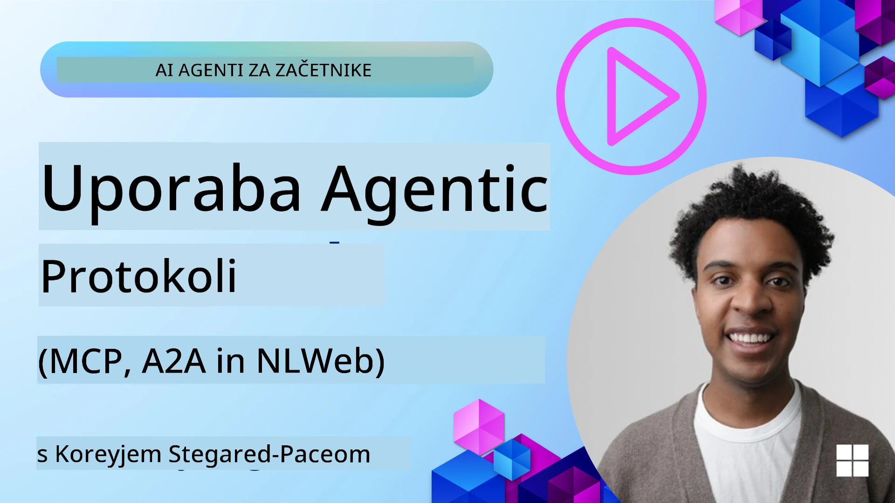
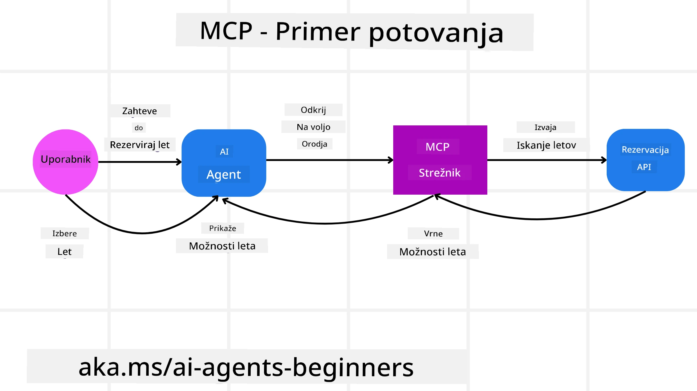
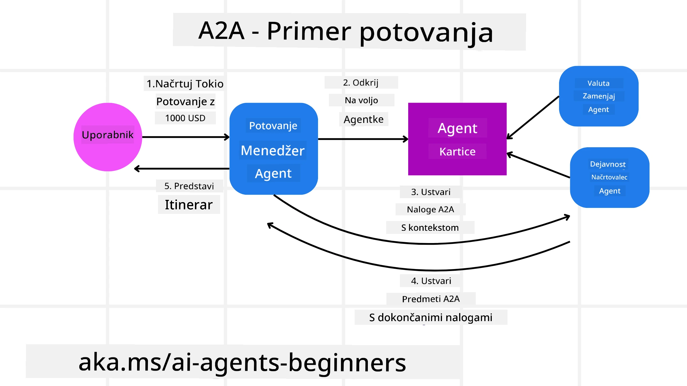
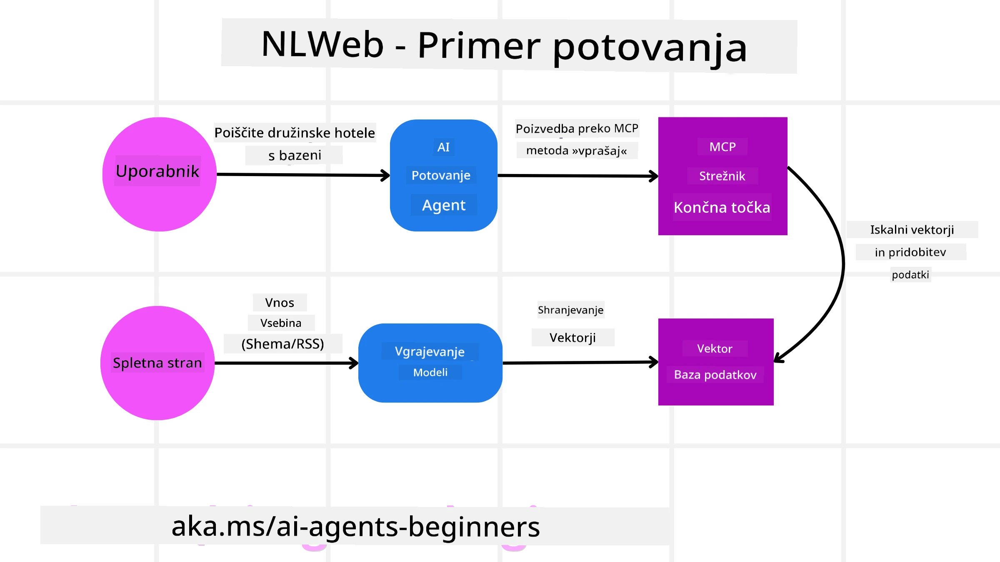

# Uporaba agentnih protokolov (MCP, A2A in NLWeb)

> _(Kliknite na zgornjo sliko za ogled videoposnetka te lekcije)_

Z rastjo uporabe AI agentov se povečuje tudi potreba po protokolih, ki zagotavljajo standardizacijo, varnost in podpirajo odprte inovacije. V tej lekciji bomo obravnavali 3 protokole, ki želijo izpolniti to potrebo - Model Context Protocol (MCP), Agent to Agent (A2A) in Natural Language Web (NLWeb).

## Uvod

V tej lekciji bomo obravnavali:

• Kako **MCP** omogoča AI agentom dostop do zunanjih orodij in podatkov za izvedbo uporabniških nalog.

• Kako **A2A** omogoča komunikacijo in sodelovanje med različnimi AI agenti.

• Kako **NLWeb** prinaša naravno jezikovne vmesnike na katerokoli spletno stran, kar omogoča AI agentom odkrivanje in interakcijo z vsebino.

## Cilji učenja

• **Prepoznati** osnovni namen in koristi MCP, A2A in NLWeb v kontekstu AI agentov.

• **Razložiti**, kako vsak protokol omogoča komunikacijo in interakcijo med LLM-ji, orodji in drugimi agenti.

• **Prepoznati** različne vloge, ki jih ima vsak protokol pri gradnji kompleksnih agentnih sistemov.

## Model Context Protocol

**Model Context Protocol (MCP)** je odprt standard, ki zagotavlja standardiziran način, da aplikacije zagotovijo kontekst in orodja LLM-jem. To omogoča "univerzalni priključek" za različne podatkovne vire in orodja, na katere se AI agenti lahko povežejo na enoten način.

Poglejmo sestavne dele MCP, koristi v primerjavi z neposredno uporabo API-jev in primer, kako bi AI agenti lahko uporabili MCP strežnik.

### Glavne komponente MCP

MCP deluje na **arhitekturi odjemalec-strežnik**, glavne komponente so:

• **Gostitelji (Hosts)** so LLM aplikacije (na primer koda urejevalnik kot VSCode), ki vzpostavijo povezavo s MCP strežnikom.

• **Odjemalci (Clients)** so sestavni deli znotraj gostiteljske aplikacije, ki vzdržujejo eno-na-eno povezave s strežniki.

• **Strežniki (Servers)** so lahki programi, ki razkrivajo določene funkcionalnosti.

V protokolu so vključene tri osnovne primitivne funkcije, ki predstavljajo zmogljivosti MCP strežnika:

• **Orodja (Tools)**: Diskretna dejanja ali funkcije, ki jih AI agent lahko pokliče za izvedbo naloge. Na primer, vremenska služba lahko razkrije orodje "dobite vreme" ali e-trgovinski strežnik orodje "nakup izdelka". MCP strežniki oglašujejo ime orodja, opis in vhodno/izhodno shemo v svojem seznamu zmogljivosti.

• **Viri (Resources)**: To so podatkovni elementi ali dokumenti samo za branje, ki jih MCP strežnik lahko zagotovi, odjemalci pa jih lahko pridobijo po potrebi. Primeri vključujejo vsebine datotek, zapise v podatkovnih bazah ali log datoteke. Viri so lahko besedilni (kot je koda ali JSON) ali binarni (kot slike ali PDF-ji).

• **Pozivi (Prompts)**: Vnaprej določeni vzorci, ki nudijo predlagane pozive, kar omogoča bolj kompleksne delovne tokove.

### Prednosti MCP

MCP ponuja pomembne prednosti za AI agente:

• **Dinamično odkrivanje orodij**: Agenti lahko dinamično prejmejo seznam razpoložljivih orodij s strežnika skupaj z opisi njihove funkcije. To se razlikuje od tradicionalnih API-jev, ki pogosto zahtevajo statično kodiranje za integracije, zato vsaka sprememba API-ja zahteva spremembo kode. MCP omogoča pristop "poveži enkrat", kar vodi do večje prilagodljivosti.

• **Medsebojna združljivost med različnimi LLM-ji**: MCP deluje z različnimi LLM-ji, kar omogoča fleksibilnost pri zamenjavi jedrnih modelov za boljšo zmogljivost.

• **Standardizirana varnost**: MCP vključuje standardno metodo preverjanja pristnosti, kar izboljšuje razširljivost ob dodajanju dostopa do dodatnih MCP strežnikov. To je enostavnejše kot upravljanje različnih ključev in vrst preverjanja pristnosti za različne tradicionalne API-je.

### Primer MCP

Predstavljajte si, da uporabnik želi rezervirati let s pomočjo AI asistenta, ki temelji na MCP.

1. **Povezava**: AI asistent (MCP odjemalec) se poveže z MCP strežnikom, ki ga zagotavlja letalska družba.

2. **Odkritje orodij**: Odjemalec vpraša MCP strežnik letalske družbe: "Katere orodje imate na voljo?" Strežnik odgovori z orodji, kot so "iskanje letov" in "rezervacija letov".

3. **Klic orodja**: Uporabnik nato vpraša AI asistenta: "Prosim poišči let iz Portlanda v Honolulu." AI asistent, s pomočjo LLM, ugotovi, da mora poklicati orodje "iskanje letov" in posreduje ustrezne parametre (izvor, destinacija) MCP strežniku.

4. **Izvedba in odgovor**: MCP strežnik, ki deluje kot ovojnica, naredi dejanski klic notranjemu rezervacijskemu API-ju letalske družbe. Nato prejme informacije o letu (npr. podatke v JSON formatu) in jih pošlje nazaj AI asistentu.

5. **Nadaljnja interakcija**: AI asistent predstavi možnosti letov. Ko uporabnik izbere let, lahko asistent pokliče orodje "rezervacija leta" na istem MCP strežniku in dokonča rezervacijo.

## Agent-to-Agent protokol (A2A)

Medtem ko se MCP osredotoča na povezovanje LLM-jev z orodji, **Agent-to-Agent (A2A)** protokol korak dlje omogoča komunikacijo in sodelovanje med različnimi AI agenti. A2A povezuje AI agente iz različnih organizacij, okolij in tehnoloških skladov za dokončanje skupnih nalog.

Pregledali bomo sestavne dele in koristi A2A ter primer, kako bi ga lahko uporabili v naši aplikaciji za potovanja.

### Glavne komponente A2A

A2A omogoča komunikacijo med agenti in njihovo skupno delo pri izvedbi podnalog za uporabnika. Vsaka komponenta protokola prispeva k temu:

#### Kartica agenta

Podobno kot MCP strežnik deli seznam orodij, Kartica agenta vsebuje:
- Ime agenta.
- **Opis splošnih nalog**, ki jih opravlja.
- **Seznam specifičnih veščin** s opisi, ki pomagajo drugim agentom (ali celo ljudem) razumeti, kdaj in zakaj bi želeli poklicati tega agenta.
- **Trenutni URL končne točke** agenta.
- **Različico** in **zmogljivosti** agenta, kot so pretočni odgovori in potisna obvestila.

#### Izvrševalec agenta

Izvrševalec agenta je odgovoren za **posredovanje konteksta uporabniškega klepeta oddaljenemu agentu**; ta potrebuje kontekst, da razume nalogo, ki jo je treba izvesti. V A2A strežniku agent uporablja svoj lasten velik jezikovni model (LLM) za analizo zahtevanih ukazov in izvedbo nalog z uporabo lastnih notranjih orodij.

#### Artefakt

Ko oddaljeni agent uspešno izvede zahtevano nalogo, nastane rezultat dela kot artefakt. Artefakt **vsebuje rezultat dela agenta**, **opis izvedene naloge** in **besedilni kontekst**, ki se pošlje prek protokola. Po pošiljanju artefakta se povezava z oddaljenim agentom zapre, dokler ni spet potrebna.

#### Vrsta dogodkov

Ta komponenta se uporablja za **obravnavo posodobitev in posredovanje sporočil**. Še posebej je pomembna pri produkcijskih agentnih sistemih, da prepreči zaprtje povezave med agenti, preden je naloga opravljena, še posebej ko izvedba naloge traja dlje časa.

### Prednosti A2A

• **Izboljšano sodelovanje**: Omogoča interakcijo agentov različnih ponudnikov in platform, izmenjavo konteksta in skupno delo, kar omogoča nemoteno avtomatizacijo med tradicionalno ločenimi sistemi.

• **Fleksibilnost izbire modela**: Vsak A2A agent lahko izbere, kateri LLM uporablja za obdelavo svojih zahtev, kar omogoča optimizirane ali prilagojene modele na agenta, v nasprotju z enim samim LLM povezavo v nekaterih MCP scenarijih.

• **Vgrajena avtentikacija**: Preverjanje pristnosti je neposredno vgrajeno v A2A protokol, kar zagotavlja robusten varnostni okvir za interakcije agentov.

### Primer A2A

Razširimo naš scenarij rezervacije potovanj, tokrat z uporabo A2A.

1. **Uporabniška zahteva za večagentni sistem**: Uporabnik komunicira z "potovalnim agentom", A2A klientom/agenta, morda z besedami: "Prosim, rezerviraj celotno potovanje v Honolulu za naslednji teden, vključno z leti, hotelom in najemom avtomobila".

2. **Orkestracija potovalnega agenta**: Potovalni agent prejme to kompleksno zahtevo. Uporabi svoj LLM za razmišljanje o nalogi in ugotovi, da mora sodelovati z drugimi specializiranimi agenti.

3. **Komunikacija med agenti**: Potovalni agent nato uporabi A2A protokol za povezavo z nižjimi agenti, kot so "agent letalske družbe," "agent hotela" in "agent za najem avtomobila," ki jih ustvarjajo različna podjetja.

4. **Delegirana izvedba naloge**: Potovalni agent pošlje specifične naloge tem specializiranim agentom (npr. "Najdi lete v Honolulu," "Rezerviraj hotel," "Najem avtomobila"). Vsak od teh specializiranih agentov, ki poganja lastne LLM-je in uporablja lastna orodja (ki so lahko tudi MCP strežniki), izvede svojo del naloge rezervacije.

5. **Združen odgovor**: Ko vsi nižji agenti zaključijo svoje naloge, potovalni agent združi rezultate (podrobnosti o letu, potrditev hotela, rezervacijo avtomobila) in uporabniku pošlje celovit odgovor v obliki klepeta.

## Naravni jezikovni splet (NLWeb)

Spletna mesta so že dolgo primarni način za uporabnike, da dostopajo do informacij in podatkov po internetu.

Poglejmo različne komponente NLWeb, koristi NLWeb in primer, kako naša NLWeb deluje z uporabo naše aplikacije za potovanja.

### Komponente NLWeb

- **NLWeb aplikacija (osnovna koda storitve)**: Sistem, ki obdeluje vprašanja v naravnem jeziku. Povezuje različne dele platforme, da ustvari odgovore. Lahko si jo predstavljate kot **motor, ki poganja funkcije naravnega jezika** spletne strani.

- **NLWeb protokol**: To je **osnovni niz pravil za naravno jezikovno interakcijo** s spletnim mestom. Pošilja odgovore v obliki JSON (pogosto uporablja Schema.org). Namenjen je ustvarjanju preproste osnove za "AI splet", tako kot je HTML omogočil deljenje dokumentov na spletu.

- **MCP strežnik (končna točka Model Context Protokola)**: Vsaka NLWeb namestitev deluje tudi kot **MCP strežnik**. To pomeni, da lahko **deli orodja (kot je metoda "ask") in podatke** z drugimi AI sistemi. V praksi to omogoča, da so vsebine in zmogljivosti spletne strani uporabne za AI agente, s čimer splet postane del širšega "agentnega ekosistema".

- **Modeli vdelave (embedding modeli)**: Ti modeli se uporabljajo za **pretvorbo vsebine spletne strani v številske predstavitve, imenovane vektorji** (embeddingi). Ti vektorji zajemajo pomen na način, ki ga računalniki lahko primerjajo in iščejo. Shranjeni so v posebni podatkovni bazi, uporabniki pa lahko izberejo, kateri model vdelave želijo uporabiti.

- **Vektorska podatkovna baza (mehanizem za iskanje)**: Ta podatkovna baza **hrani embeddinge vsebine spletnega mesta**. Ko nekdo postavi vprašanje, NLWeb preveri v vektorski bazi, da hitro najde najbolj relevantne informacije. Ponudi hiter seznam možnih odgovorov, razvrščenih po podobnosti. NLWeb deluje z različnimi sistemi za shranjevanje vektorjev, kot so Qdrant, Snowflake, Milvus, Azure AI Search in Elasticsearch.

### Primer NLWeb

Ponovno si oglejmo naš spletni portal za potovalne rezervacije, tokrat na pogonu NLWeb.

1. **Vnos podatkov**: Obstoječi katalogi izdelkov spletne strani za potovanja (npr. seznami letov, opisi hotelov, ponudbe izletov) so formatirani z uporabo Schema.org ali naloženi prek RSS virov. NLWeb orodja vnesejo te strukturirane podatke, ustvarijo embeddinge in jih shranijo v lokalno ali oddaljeno vektorsko podatkovno bazo.

2. **Poizvedba v naravnem jeziku (človek)**: Uporabnik obišče spletno stran in namesto krmarjenja po menijih vpiše v klepet: "Najdi družinam prijazen hotel v Honolulu z bazenom za naslednji teden."

3. **Obdelava NLWeb**: NLWeb aplikacija prejme to poizvedbo. Pošlje jo LLM-ju za razumevanje in hkrati pregleda svojo vektorsko podatkovno bazo za relevantne hotelske vpise.

4. **Natančni rezultati**: LLM pomaga interpretirati rezultate iskanja iz baze, prepozna najboljše ujemanje glede na kriterije "družinam prijazen," "bazen" in "Honolulu," nato oblikuje odgovor v naravnem jeziku. Pomembno je, da se odgovor sklicuje na dejanske hotele iz kataloga spletne strani, brez izmišljenih informacij.

5. **Interakcija AI agenta**: Ker NLWeb deluje kot MCP strežnik, se lahko z zunanjim AI potovalnim agentom poveže ta NLWeb instanca spletne strani. AI agent lahko uporabi MCP metodo `ask` za neposredno poizvedbo spletne strani: `ask("Ali so v območju Honolulu priporočene veganske restavracije s strani hotela?")`. NLWeb instanca to obdelá, uporabi svojo bazo podatkov o restavracijah (če je naložena) in vrne strukturiran JSON odgovor.

### Imate več vprašanj o MCP/A2A/NLWeb?

Pridružite se [Microsoft Foundry Discordu](https://discord.com/invite/ATgtXmAS5D), da se povežete z drugimi učenci, obiščete uradne ure in dobite odgovore na vprašanja o AI agentih.

## Viri

- [MCP za začetnike](https://aka.ms/mcp-for-beginners)  
- [Dokumentacija MCP](https://learn.microsoft.com/python/api/overview/azure/ai-projects-readme)
- [NLWeb repozitorij](https://github.com/nlweb-ai/NLWeb)
- [Microsoft Agent Framework](https://aka.ms/ai-agents-beginners/agent-framework)

---

<!-- CO-OP TRANSLATOR DISCLAIMER START -->
**Omejitev odgovornosti**:
Ta dokument je bil preveden z uporabo AI prevajalske storitve [Co-op Translator](https://github.com/Azure/co-op-translator). Čeprav si prizadevamo za natančnost, vas prosimo, da upoštevate, da avtomatizirani prevodi lahko vsebujejo napake ali netočnosti. Izvirni dokument v njegovem izvirnem jeziku je treba obravnavati kot avtoritativni vir. Za kritične informacije je priporočljiv strokovni človeški prevod. Ne odgovarjamo za morebitna nesporazume ali napačne interpretacije, ki izhajajo iz uporabe tega prevoda.
<!-- CO-OP TRANSLATOR DISCLAIMER END -->