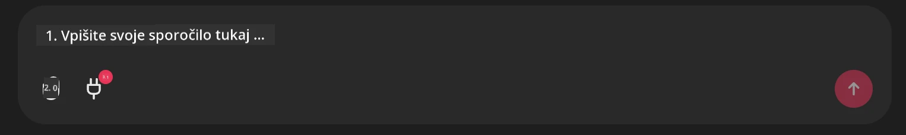

# Github MCP Server Primer

## Opis

To je bila predstavitvena različica, ustvarjena za AI Agents Hackathon, ki ga je gostil Microsoft Reactor.

Ta orodja se uporabljajo za priporočanje projektov za hackathon na podlagi uporabnikovih Github repozitorijev.
To se izvede z:

1. **Github Agent** - Uporablja Github MCP Server za pridobivanje repozitorijev in informacij o teh repozitorijih.
2. **Hackathon Agent** - Sprejme podatke od Github Agenta in ustvari kreativne ideje za projekte na hackathonu na podlagi projektov, programskih jezikov, ki jih uporablja uporabnik, in kategorij projektov za AI Agents hackathon.
3. **Events Agent** - Na podlagi predlogov Hackathon Agenta bo Events Agent priporočil ustrezne dogodke iz serije AI Agent Hackathon.
## Zagon kode 

### Okoljske spremenljivke

Ta primer uporablja Microsoft Agent Framework, Azure OpenAI Service, Github MCP Server in Azure AI Search.

Prepričajte se, da imate nastavljene ustrezne okoljske spremenljivke za uporabo teh orodij:

```python
AZURE_AI_PROJECT_ENDPOINT=""
AZURE_AI_MODEL_DEPLOYMENT_NAME=""
AZURE_SEARCH_SERVICE_ENDPOINT=""
AZURE_SEARCH_API_KEY=""
``` 

## Zagon Chainlit strežnika

Za povezavo z MCP strežnikom ta primer uporablja Chainlit kot klepetalni vmesnik. 

Če želite zagnati strežnik, uporabite naslednji ukaz v terminalu:

```bash
chainlit run app.py -w
```

To bi moralo zagnati vaš Chainlit strežnik na `localhost:8000` ter napolniti vaš Azure AI Search indeks z vsebino `event-descriptions.md`. 

## Povezovanje z MCP strežnikom

Za povezavo z Github MCP Serverjem izberite ikono "vtič" pod poljem za klepet "Vpišite svoje sporočilo tukaj..":



Od tam lahko kliknete na "Poveži MCP", da dodate ukaz za povezavo z Github MCP Serverjem:

```bash
npx -y @modelcontextprotocol/server-github --env GITHUB_PERSONAL_ACCESS_TOKEN=[YOUR PERSONAL ACCESS TOKEN]
```

Zamenjajte "[YOUR PERSONAL ACCESS TOKEN]" z vašim dejanskim osebnim dostopnim žetonom. 

Po povezavi bi morali poleg ikone vtiča videti (1), kar potrdi, da je povezano. Če ne, poskusite znova zagnati Chainlit strežnik z `chainlit run app.py -w`.

## Uporaba predstavitve 

Za začetek delovnega toka agentov za priporočanje projektov za hackathon lahko vnesete sporočilo, na primer: 

"Priporočite projekte za hackathon za Github uporabnika koreyspace"

Router Agent bo analiziral vašo zahtevo in določil, katera kombinacija agentov (GitHub, Hackathon in Events) je najbolj primerna za obravnavo vašega poizvedka. Agenti sodelujejo, da zagotovijo celovite priporočila na podlagi analize GitHub repozitorijev, oblikovanja idej za projekte in ustreznih tehnoloških dogodkov.

---

<!-- CO-OP TRANSLATOR DISCLAIMER START -->
**Izjava o omejitvi odgovornosti**:
Ta dokument je bil preveden z uporabo storitve za avtomatsko prevajanje z umetno inteligenco [Co-op Translator](https://github.com/Azure/co-op-translator). Čeprav si prizadevamo za točnost, upoštevajte, da lahko avtomatizirani prevodi vsebujejo napake ali netočnosti. Izvirni dokument v njegovem izvirnem jeziku velja za uradni vir. Za kritične informacije priporočamo strokovni prevod, opravljen s strani človeškega prevajalca. Ne odgovarjamo za morebitne nesporazume ali napačne razlage, ki izhajajo iz uporabe tega prevoda.
<!-- CO-OP TRANSLATOR DISCLAIMER END -->