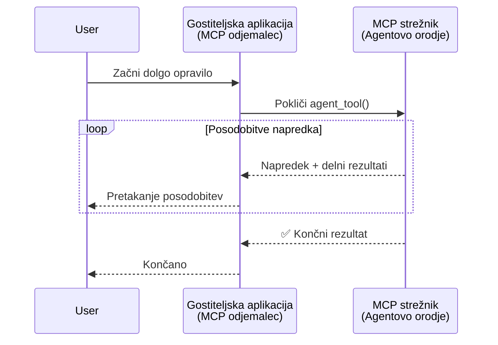
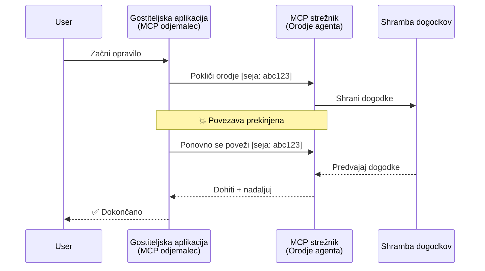
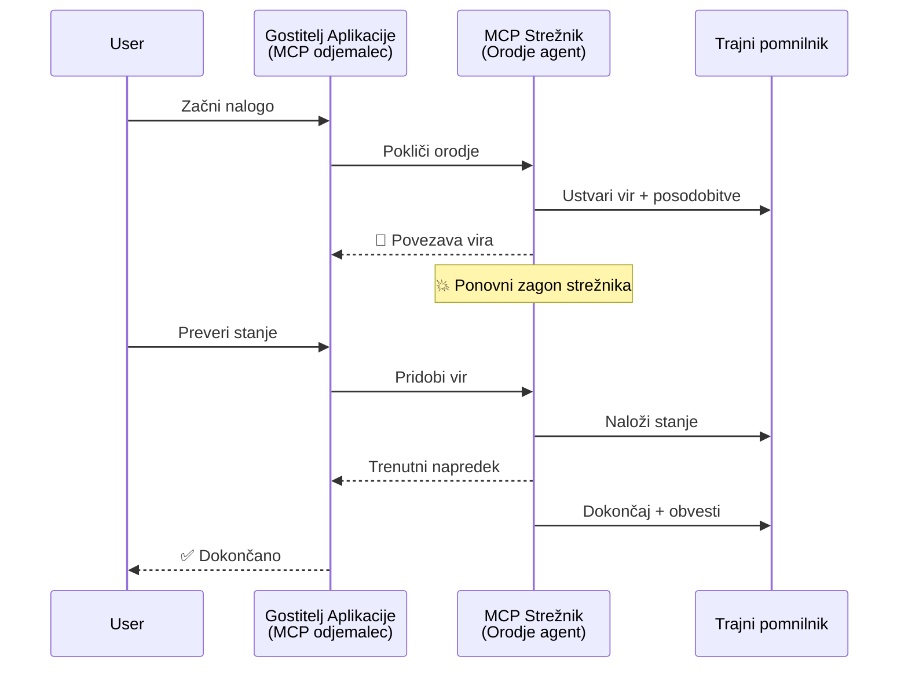
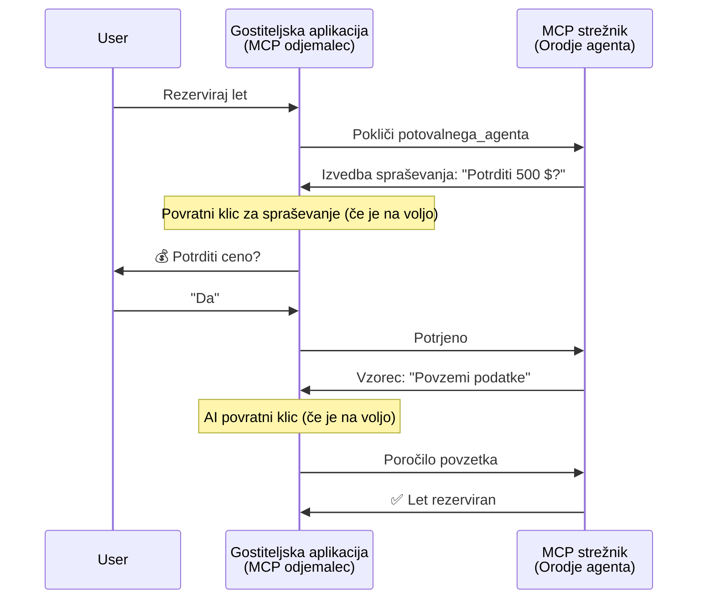
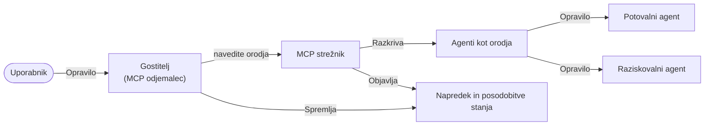

# Gradnja sistemov komunikacije agent-agent z MCP

> TL;DR - Ali lahko zgradite komunikacijo agent2agent na MCP? Da!

MCP se je razvila daleč preko svojega prvotnega cilja "nudenja konteksta LLM-jem". Z zadnjimi izboljšavami, vključno z [ponovnim vzpostavljanjem pretočnih podatkov](https://modelcontextprotocol.io/docs/concepts/transports#resumability-and-redelivery), [pridobivanjem informacij](https://modelcontextprotocol.io/specification/2025-06-18/client/elicitation), [vzorcev vzorčenja](https://modelcontextprotocol.io/specification/2025-06-18/client/sampling) in obvestili ([napredek](https://modelcontextprotocol.io/specification/2025-06-18/basic/utilities/progress) in [viri](https://modelcontextprotocol.io/specification/2025-06-18/schema#resourceupdatednotification)), MCP zdaj nudi trdno osnovo za gradnjo kompleksnih sistemov komunikacije agent-agent.

## Napačno razumevanje agenta orodja

Ker vse več razvijalcev raziskuje orodja z agentnimi vedenji (delujejo dolgo časa, lahko zahtevajo dodatne vnose med izvajanjem itd.), je pogosto napačno prepričanje, da MCP ni primeren, predvsem ker so prvi primeri orodij bili primitivni in osredotočeni na preproste vzorce zahteva-odgovor.

To dojemanje je zastarelo. Specifikacija MCP je bila v zadnjih mesecih bistveno nadgrajena z zmogljivostmi, ki zapolnjujejo vrzel za gradnjo dolgotrajnih agentnih vedenj:

- **Pretakanje & Delni rezultati**: Posodobitve napredka v realnem času med izvajanjem
- **Ponovno vzpostavljanje**: Stranke se lahko ponovno povežejo in nadaljujejo po prekinitvi povezave
- **Vzdržljivost**: Rezultati preživijo ponovni zagon strežnika (npr. preko povezav do virov)
- **Večkrožni**: Interaktivni vnosi med izvajanjem z uporabo pridobivanja informacij in vzorčenja

Te funkcije se lahko združijo za omogočanje kompleksnih agentnih in multi-agentnih aplikacij, vse nameščene na protokolu MCP.

Za referenco bomo agenta imenovali "orodje", ki je na voljo na MCP strežniku. To vključuje obstoj gostiteljske aplikacije, ki izvaja MCP klienta, ki vzpostavi sejo s MCP strežnikom in lahko kliče agenta.

## Kaj naredi orodje MCP "agentno"?

Preden se potopimo v implementacijo, določimo, katere infrastrukturne zmogljivosti so potrebne za podporo dolgotrajnim agentom.

> Agenta bomo definirali kot entiteto, ki lahko deluje samostojno skozi daljša obdobja, sposobno izvajanja kompleksnih nalog, ki lahko zahtevajo več interakcij ali prilagoditev na podlagi povratnih informacij v realnem času.

### 1. Pretakanje & Delni rezultati

Tradicionalni vzorci zahteva-odgovor ne delujejo za dolgotrajne naloge. Agenti morajo nuditi:

- Posodobitve napredka v realnem času
- Vmesne rezultate

**Podpora MCP**: Obvestila o posodobitvah virov omogočajo pretakanje delnih rezultatov, vendar to zahteva previdno zasnovo, da se izogne konfliktnim zahtevam modela JSON-RPC 1:1 zahteva/odgovor.

| Funkcija                   | Uporaba                                                                                                                                                                        | Podpora MCP                                                                                 |
| -------------------------- | ----------------------------------------------------------------------------------------------------------------------------------------------------------------------------- | ------------------------------------------------------------------------------------------- |
| Posodobitve napredka       | Uporabnik zahteva nalogo migracije baze kode. Agent pretaka napredek: "10 % - Analiza odvisnosti... 25 % - Pretvorba datotek TypeScript... 50 % - Posodabljanje uvozov..."         | ✅ Obvestila o napredku                                                                     |
| Delni rezultati            | Naloga »Ustvari knjigo« pretaka delne rezultate, npr. 1) Osnutek zgodbe, 2) Seznam poglavij, 3) Vsako poglavje kot zaključeno. Gostitelj lahko kadarkoli pregleduje, prekliče ali preusmeri. | ✅ Obvestila se lahko »razširijo« za vključitev delnih rezultatov, glej predloge za PR 383, 776 |

<div align="center" style="font-style: italic; font-size: 0.95em; margin-bottom: 0.5em;">
<strong>Slika 1:</strong> Ta diagram prikazuje, kako MCP agenti pretakajo posodobitve napredka v realnem času in delne rezultate gostiteljski aplikaciji med dolgotrajno nalogo, kar omogoča uporabniku spremljanje izvajanja v realnem času.
</div>



### 2. Ponovno vzpostavljanje

Agenti morajo spretno upravljati s prekinitvami omrežja:

- Ponovno povezovanje po prekinitvi (stranka)
- Nadaljevanje od točke prekinitve (ponovno pošiljanje sporočil)

**Podpora MCP**: MCP StreamableHTTP prenos danes podpira nadaljevanje seje in ponovno pošiljanje sporočil z ID-ji sej in zadnjimi ID-ji dogodkov. Pomembno je, da mora strežnik implementirati EventStore, ki omogoča ponovne predvajanja dogodkov ob ponovni povezavi stranke.  
Obstaja predlog skupnosti (PR #975), ki raziskuje transportno-agnostične pretočne podatke z možnostjo ponovnega vzpostavljanja.

| Funkcija       | Uporaba                                                                                                                                                     | Podpora MCP                                                               |
| ------------- | ----------------------------------------------------------------------------------------------------------------------------------------------------------- | ------------------------------------------------------------------------- |
| Ponovno vzpostavljanje | Stranka prekine med dolgotrajno nalogo. Ob povezavi se seja nadaljuje, zamujeni dogodki se predvajajo, naloga teče nemoteno od tam, kjer je bila prekinjena. | ✅ StreamableHTTP prenos s sejskimi ID-ji, predvajanjem dogodkov in EventStore |

<div align="center" style="font-style: italic; font-size: 0.95em; margin-bottom: 0.5em;">
<strong>Slika 2:</strong> Ta diagram prikazuje, kako MCPjev StreamableHTTP prenos in shramba dogodkov omogočata nemoteno ponovno vzpostavitev seje: če se klient prekine, se lahko ponovno poveže in predvaja zamujene dogodke, pri čemer naloga teče neprekinjeno brez izgube napredka.
</div>



### 3. Vzdržljivost

Dolgotrajni agenti potrebujejo trajno stanje:

- Rezultati preživijo ponovni zagon strežnika
- Status je mogoče pridobiti zunaj pasu
- Spremljanje napredka čez seje

**Podpora MCP**: MCP zdaj podpira vrsto povratka povezave do vira pri klicih orodij. Danes je možen vzorec, da orodje ustvari vir in takoj vrne povezavo do vira. Orodje lahko nadaljuje z obravnavo naloge v ozadju in posodablja vir. Stranka pa lahko izbere, da preverja stanje tega vira za delne ali celotne rezultate (odvisno od tega, katere posodobitve vira strežnik zagotavlja) ali se naroči na vir za obvestila o posodobitvah.

Ena omejitev je, da požiranje virov ali naročanje na posodobitve lahko povzroči porabo virov s posledicami v merilu. Obstaja odprt predlog skupnosti (vključno s #992), ki raziskuje možnost vključitve spletnih kaveljčkov ali sprožilcev, ki jih strežnik lahko kliče za obveščanje stranke/gostiteljske aplikacije o posodobitvah.

| Funkcija    | Uporaba                                                                                                                                               | Podpora MCP                                                      |
| ---------- | ---------------------------------------------------------------------------------------------------------------------------------------------------- | ---------------------------------------------------------------- |
| Vzdržljivost | Strežnik crkne med nalogo za migracijo podatkov. Rezultati in napredek preživijo ponovni zagon, stranka lahko preveri status in nadaljuje z vztrajnim virom. | ✅ Povezave do virov s trajnim shranjevanjem in statusnimi obvestili |

Danes je pogost vzorec, da se oblikuje orodje, ki ustvari vir in takoj vrne povezavo do vira. Orodje lahko v ozadju obravnava nalogo, pošilja obvestila o virih, ki služijo kot posodobitve napredka ali vključujejo delne rezultate, in po potrebi posodablja vsebino vira.

<div align="center" style="font-style: italic; font-size: 0.95em; margin-bottom: 0.5em;">
<strong>Slika 3:</strong> Ta diagram prikazuje, kako MCP agenti uporabljajo trajne vire in statusna obvestila, da zagotavljajo, da dolgotrajne naloge preživijo ponovne zagone strežnika, kar strankam omogoča preverjanje napredka in pridobivanje rezultatov tudi po izpadih.
</div>



### 4. Večkrožne interakcije

Agenti pogosto potrebujejo dodatne vnose med izvajanjem:

- Ljudsko pojasnilo ali odobritev
- Pomoč AI za kompleksne odločitve
- Dinamična prilagoditev parametrov

**Podpora MCP**: Popolnoma podprto prek vzorčenja (za AI vnose) in pridobivanja informacij (za človeške vnose).

| Funkcija                | Uporaba                                                                                                                                           | Podpora MCP                                           |
| ---------------------- | ------------------------------------------------------------------------------------------------------------------------------------------------ | ----------------------------------------------------- |
| Večkrožne interakcije  | Agent za rezervacijo potovanja zahteva potrditev cene uporabnika, nato pa prosi AI za povzetek podatkov o potovanju, preden zaključi rezervacijo. | ✅ Pridobivanje informacij za človeške vnose, vzorčenje za AI vnose |

<div align="center" style="font-style: italic; font-size: 0.95em; margin-bottom: 0.5em;">
<strong>Slika 4:</strong> Ta diagram prikazuje, kako MCP agenti lahko interaktivno pridobivajo človeške vnose ali zahtevajo pomoč AI med izvajanjem, podpirajoč kompleksne večkrožne poteke dela, kot so potrditve in dinamično odločanje.
</div>



## Implementacija dolgotrajnih agentov na MCP - Pregled kode

V okviru tega članka zagotavljamo [shramba kode](https://github.com/victordibia/ai-tutorials/tree/main/MCP%20Agents), ki vsebuje popolno implementacijo dolgotrajnih agentov z uporabo MCP Python SDK in StreamableHTTP prenosa za nadaljevanje seje in ponovno pošiljanje sporočil. Implementacija prikazuje, kako se lahko zmogljivosti MCP sestavijo za omogočanje sofisticiranih vedenj, podobnih agentom.

Natančneje, implementiramo strežnik z dvema glavnim agentnima orodjema:

- **Agent za potovanja** - Simulira storitev rezervacije potovanj s potrditvijo cene prek pridobivanja informacij
- **Agent za raziskave** - Izvaja raziskovalne naloge z AI-podprtimi povzetki prek vzorčenja

Oba agenta prikazujeta posodobitve napredka v realnem času, interaktivne potrditve in popolne zmogljivosti nadaljevanja seje.

### Ključni koncepti implementacije

Naslednji razdelki prikazujejo implementacijo agentov na strani strežnika in ravnanje gostitelja na strani klienta za vsako zmogljivost:

#### Pretakanje & Posodobitve napredka - Status naloge v realnem času

Pretakanje omogoča agentom, da nudijo posodobitve napredka v realnem času med dolgotrajnimi nalogami, obveščajo uporabnike o statusu naloge in vmesnih rezultatih.

**Implementacija na strežniku (agent pošilja obvestila o napredku):**

```python
# Iz server/server.py - Potovalni agent pošilja posodobitve o napredku
for i, step in enumerate(steps):
    await ctx.session.send_progress_notification(
        progress_token=ctx.request_id,
        progress=i * 25,
        total=100,
        message=step,
        related_request_id=str(ctx.request_id)
    )
    await anyio.sleep(2)  # Simuliraj delo

# Alternativa: Zabeleži sporočila za podrobne korak za korakom posodobitve
await ctx.session.send_log_message(
    level="info",
    data=f"Processing step {current_step}/{steps} ({progress_percent}%)",
    logger="long_running_agent",
    related_request_id=ctx.request_id,
)
```

**Implementacija na klientu (gostitelj prejema posodobitve napredka):**

```python
# Iz client/client.py - Odjemalec, ki obdeluje obvestila v realnem času
async def message_handler(message) -> None:
    if isinstance(message, types.ServerNotification):
        if isinstance(message.root, types.LoggingMessageNotification):
            console.print(f"📡 [dim]{message.root.params.data}[/dim]")
        elif isinstance(message.root, types.ProgressNotification):
            progress = message.root.params
            console.print(f"🔄 [yellow]{progress.message} ({progress.progress}/{progress.total})[/yellow]")

# Registriraj upravljavca sporočil ob ustvarjanju seje
async with ClientSession(
    read_stream, write_stream,
    message_handler=message_handler
) as session:
```

#### Pridobivanje informacij - Zahteva po uporabniškem vnosu

Pridobivanje informacij omogoča agentom, da med izvajanjem zahtevajo uporabniški vnos. To je bistveno za potrditve, pojasnila ali odobritve med dolgotrajnimi nalogami.

**Implementacija na strežniku (agent zahteva potrditev):**

```python
# Iz server/server.py - Potovalni agent zahteva potrditev cene
elicit_result = await ctx.session.elicit(
    message=f"Please confirm the estimated price of $1200 for your trip to {destination}",
    requestedSchema=PriceConfirmationSchema.model_json_schema(),
    related_request_id=ctx.request_id,
)

if elicit_result and elicit_result.action == "accept":
    # Nadaljuj z rezervacijo
    logger.info(f"User confirmed price: {elicit_result.content}")
elif elicit_result and elicit_result.action == "decline":
    # Prekliči rezervacijo
    booking_cancelled = True
```

**Implementacija na klientu (gostitelj zagotavlja povratni klic za pridobivanje informacij):**

```python
# Iz client/client.py - upravljanje zahtev za pridobivanje podatkov s strani odjemalca
async def elicitation_callback(context, params):
    console.print(f"💬 Server is asking for confirmation:")
    console.print(f"   {params.message}")

    response = console.input("Do you accept? (y/n): ").strip().lower()

    if response in ['y', 'yes']:
        return types.ElicitResult(
            action="accept",
            content={"confirm": True, "notes": "Confirmed by user"}
        )
    else:
        return types.ElicitResult(
            action="decline",
            content={"confirm": False, "notes": "Declined by user"}
        )

# Registrirajte povratni klic ob ustvarjanju seje
async with ClientSession(
    read_stream, write_stream,
    elicitation_callback=elicitation_callback
) as session:
```

#### Vzorčenje - Zahteva po pomoči AI

Vzorčenje agentom omogoča, da zahtevajo pomoč LLM za kompleksne odločitve ali generiranje vsebin med izvajanjem. To omogoča hibridne človeško-AI poteke dela.

**Implementacija na strežniku (agent zahteva pomoč AI):**

```python
# Iz server/server.py - Agent raziskovalec zahteva AI povzetek
sampling_result = await ctx.session.create_message(
    messages=[
        SamplingMessage(
            role="user",
            content=TextContent(type="text", text=f"Please summarize the key findings for research on: {topic}")
        )
    ],
    max_tokens=100,
    related_request_id=ctx.request_id,
)

if sampling_result and sampling_result.content:
    if sampling_result.content.type == "text":
        sampling_summary = sampling_result.content.text
        logger.info(f"Received sampling summary: {sampling_summary}")
```

**Implementacija na klientu (gostitelj zagotavlja povratni klic za vzorčenje):**

```python
# Iz client/client.py - Stranka obdeluje zahteve za vzorčenje
async def sampling_callback(context, params):
    message_text = params.messages[0].content.text if params.messages else 'No message'
    console.print(f"🧠 Server requested sampling: {message_text}")

    # V pravi aplikaciji bi lahko to klicalo LLM API
    # Za demonstracijske namene nudimo ponarejen odgovor
    mock_response = "Based on current research, MCP has evolved significantly..."

    return types.CreateMessageResult(
        role="assistant",
        content=types.TextContent(type="text", text=mock_response),
        model="interactive-client",
        stopReason="endTurn"
    )

# Registrirajte povratni klic ob ustvarjanju seje
async with ClientSession(
    read_stream, write_stream,
    sampling_callback=sampling_callback,
    elicitation_callback=elicitation_callback
) as session:
```

#### Ponovno vzpostavljanje - Neprekinjenost seje kljub prekinitvam

Ponovno vzpostavljanje zagotavlja, da dolgotrajne naloge agentov prenesejo prekinitve povezave klienta in nemoteno nadaljujejo ob ponovni povezavi. To se izvaja prek shramb dogodkov in tokenov za nadaljevanje.

**Implementacija Event Store (strežnik hrani stanje seje):**

```python
# Iz server/event_store.py - Preprost pomnilnik dogodkov v pomnilniku
class SimpleEventStore(EventStore):
    def __init__(self):
        self._events: list[tuple[StreamId, EventId, JSONRPCMessage]] = []
        self._event_id_counter = 0

    async def store_event(self, stream_id: StreamId, message: JSONRPCMessage) -> EventId:
        """Store an event and return its ID."""
        self._event_id_counter += 1
        event_id = str(self._event_id_counter)
        self._events.append((stream_id, event_id, message))
        return event_id

    async def replay_events_after(self, last_event_id: EventId, send_callback: EventCallback) -> StreamId | None:
        """Replay events after the specified ID for resumption."""
        start_index = None
        stream_id = None
        for index, (event_stream_id, event_id, _) in enumerate(self._events):
            if event_id == last_event_id:
                start_index = index + 1
                stream_id = event_stream_id
                break

        if start_index is None:
            return None

        # Predvajaj samo kasnejše dogodke iz izvirnega toka seje.
        for event_stream_id, event_id, message in self._events[start_index:]:
            if event_stream_id != stream_id:
                continue
            await send_callback(EventMessage(message, event_id))

        return stream_id

# Iz server/server.py - Posredovanje pomnilnika dogodkov upravitelju sej
def create_server_app(event_store: Optional[EventStore] = None) -> Starlette:
    server = ResumableServer()

    # Ustvari upravitelja sej s pomnilnikom dogodkov za nadaljevanje
    session_manager = StreamableHTTPSessionManager(
        app=server,
        event_store=event_store,  # Pomnilnik dogodkov omogoča nadaljevanje seje
        json_response=False,
        security_settings=security_settings,
    )

    return Starlette(routes=[Mount("/mcp", app=session_manager.handle_request)])

# Uporaba: Inicializirajte s pomnilnikom dogodkov
event_store = SimpleEventStore()
app = create_server_app(event_store)
```

**Meta podatki klienta z tokenom za nadaljevanje (klient se ponovno povezuje z uporabljenim stanjem):**

```python
# Iz client/client.py - Nadaljevanje stranke z metapodatki
if existing_tokens and existing_tokens.get("resumption_token"):
    # Uporabi obstoječi žeton za nadaljevanje, da nadaljujemo tam, kjer smo končali
    metadata = ClientMessageMetadata(
        resumption_token=existing_tokens["resumption_token"],
    )
else:
    # Ustvari povratni klic za shranjevanje žetona za nadaljevanje, ko je prejet
    def enhanced_callback(token: str):
        protocol_version = getattr(session, 'protocol_version', None)
        token_manager.save_tokens(session_id, token, protocol_version, command, args)

    metadata = ClientMessageMetadata(
        on_resumption_token_update=enhanced_callback,
    )

# Pošlji zahtevo z metapodatki za nadaljevanje
result = await session.send_request(
    types.ClientRequest(
        types.CallToolRequest(
            method="tools/call",
            params=types.CallToolRequestParams(name=command, arguments=args)
        )
    ),
    types.CallToolResult,
    metadata=metadata,
)
```

Gostiteljska aplikacija lokalno hrani ID-je sej in tokene za nadaljevanje, kar ji omogoča ponovno povezavo s trenutnimi sejami brez izgube napredka ali stanja.

### Organizacija kode

<div align="center" style="font-style: italic; font-size: 0.95em; margin-bottom: 0.5em;">
<strong>Slika 5:</strong> Arhitektura sistema agentov na osnovi MCP
</div>



**Ključne datoteke:**

- **`server/server.py`** - Strežnik MCP z možnostjo nadaljevanja, agenti za potovanja in raziskave, ki prikazujejo pridobivanje informacij, vzorčenje in posodobitve napredka
- **`client/client.py`** - Interaktivna gostiteljska aplikacija z podporo za nadaljevanje, upravljanjem povratnih klicev in tokenov
- **`server/event_store.py`** - Implementacija shramb dogodkov za nadaljevanje sej in ponovno pošiljanje sporočil

## Razširitev na multi-agentno komunikacijo na MCP

Zgornjo implementacijo je mogoče razširiti na sisteme z več agenti s povečanjem inteligence in obsega gostiteljske aplikacije:

- **Inteligentna razčlenitev nalog**: Gostitelj analizira kompleksne uporabniške zahteve in jih razdeli na podnaloge za različne specializirane agente
- **Usklajevanje več strežnikov**: Gostitelj ohranja povezave do več MCP strežnikov, od katerih vsak razkriva različne zmogljivosti agentov
- **Upravljanje stanja nalog**: Gostitelj spremlja napredek preko več hkratnih nalog agentov, obvladuje odvisnosti in zaporedje
- **Odpornost in ponovni poskusi**: Gostitelj upravlja z napakami, izvaja logiko ponovnih poskusov in preusmerja naloge, ko agenti postanejo nedosegljivi
- **Sintetiziranje rezultatov**: Gostitelj združuje izhode več agentov v koherentne končne rezultate

Gostitelj se razvije iz preproste stranke v inteligentnega orkestratorja, ki usklajuje distribuirane zmogljivosti agentov ob ohranjanju iste osnovne MCP protokolarne baze.

## Zaključek

Izboljšane zmogljivosti MCP - obvestila o virih, pridobivanje informacij/vzorčenje, pretočni podatki z možnostjo ponovnega vzpostavljanja in trajni viri - omogočajo kompleksne interakcije agent-agent ob ohranjanju enostavnosti protokola.

## Začetek

Ste pripravljeni zgraditi svoj agent2agent sistem? Sledite tem korakom:

### 1. Zaženite demo

```bash
# Zaženite strežnik z dnevnikom dogodkov za nadaljevanje
python -m server.server --port 8006

# V drugem terminalu zaženite interaktivni odjemalec
python -m client.client --url http://127.0.0.1:8006/mcp
```

**Na voljo ukazi v interaktivnem načinu:**

- `travel_agent` - Rezervirajte potovanje s potrditvijo cene prek pridobivanja informacij
- `research_agent` - Raziskujte teme z AI-podprtimi povzetki preko vzorčenja
- `list` - Prikaži vsa razpoložljiva orodja
- `clean-tokens` - Počisti tokene za nadaljevanje
- `help` - Prikaži podrobno pomoč za ukaze
- `quit` - Izhod iz klienta

### 2. Preizkusite zmogljivosti nadaljevanja

- Začnite dolgotrajnega agenta (npr. `travel_agent`)
- Prekini klienta med izvajanjem (Ctrl+C)
- Ponovno zaženi klienta - ta se bo samodejno nadaljeval od tam, kjer je bil prekinjen

### 3. Raziščite in razširite

- **Raziščite primere**: Oglejte si [mcp-agents](https://github.com/victordibia/ai-tutorials/tree/main/MCP%20Agents)
- **Pridružite se skupnosti**: Sodelujte v razpravah MCP na GitHubu
- **Eksperimentirajte**: Začnite z enostavno dolgotrajno nalogo in postopoma dodajajte pretakanje, ponovno vzpostavljanje in večagentno koordinacijo

To prikazuje, kako MCP omogoča inteligentna vedenja agentov ob ohranjanju preprostosti na osnovi orodij.

Na splošno se specifikacija MCP hitro razvija; bralcu priporočamo pregled uradne dokumentacijske spletne strani za najnovejše posodobitve - https://modelcontextprotocol.io/introduction

---

<!-- CO-OP TRANSLATOR DISCLAIMER START -->
**Omejitev odgovornosti**:
Ta dokument je bil preveden z uporabo AI prevajalske storitve [Co-op Translator](https://github.com/Azure/co-op-translator). Čeprav si prizadevamo za natančnost, vas prosimo, da upoštevate, da avtomatizirani prevodi lahko vsebujejo napake ali netočnosti. Izvirni dokument v njegovem izvirnem jeziku je treba obravnavati kot avtoritativni vir. Za kritične informacije je priporočljiv strokovni človeški prevod. Ne odgovarjamo za morebitna nesporazume ali napačne interpretacije, ki izhajajo iz uporabe tega prevoda.
<!-- CO-OP TRANSLATOR DISCLAIMER END -->